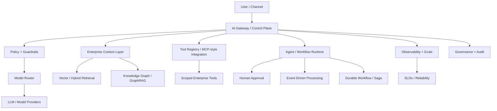

# Building Enterprise Agentic AI

## From LLM Runtime to Governed, Event-Driven & Reliable AI Platforms

<p align="center">
  <strong>An Architecture & Engineering Portfolio for Production-Oriented Enterprise Agentic AI in Fintech</strong>
</p>

<p align="center">
  
  
  
  
  
</p>

<p align="center">
  <a href="./README.md">Home</a> ·
  <a href="./README.es.md">🇪🇸 Español</a>
</p>

---

## Why this portfolio exists

Most AI portfolios stop at a chatbot, a prompt, a notebook or a single RAG demo.

This one focuses on the harder problem:

> **How do you engineer the system around the model so that AI can move toward a governed, secure, observable, auditable and reliable production capability?**

Across 18 progressive repositories, this portfolio explores the capabilities and engineering patterns required to evolve from a basic LLM runtime toward an Enterprise Agentic AI platform: governed evidence, controlled tools, persistent state, long-running workflows, event-driven processing, human approval, quality signals, auditability and reliability engineering.

The 18 modules are not the product. They are the **engineering evidence** behind the architecture.

---

## The central idea

```text
Model ≠ AI System
Agent ≠ AI Platform

Model
+ Context
+ Retrieval
+ Tools
+ State
+ Evaluation
+ Observability
+ Security
+ Governance
+ Event Processing
+ Durable Workflows
+ Reliability
= Production-Oriented AI System
```

> **The model is not the architecture. The agent is not the platform. Production AI emerges from the system around them.**

---

## Architecture evolution — 8 layers

```mermaid
flowchart LR
    A["01 · MODEL<br/>LLM Runtime · Structured Outputs · Memory"]
    B["02 · KNOWLEDGE<br/>Embeddings · Retrieval · RAG"]
    C["03 · AGENCY<br/>Agent Graphs · HITL · MCP Concepts"]
    D["04 · TRUST<br/>Evals · Observability · Security"]
    E["05 · PLATFORM<br/>Production Patterns · Control Plane · Governance"]
    F["06 · CONTEXT<br/>Knowledge Graph · GraphRAG"]
    G["07 · OPERATIONS<br/>Events · Durable Workflows · Saga"]
    H["08 · RELIABILITY<br/>SLOs · Incidents · Chaos"]

    A --> B --> C --> D --> E --> F --> G --> H
```



| Level | Architecture Layer | Modules | Engineering Focus |
|---:|---|---|---|
| **01** | **MODEL FOUNDATION** | Weeks 01–03 | Runtime · Structured outputs · State · Memory |
| **02** | **KNOWLEDGE** | Weeks 04–05 | Embeddings · Retrieval · Hybrid Search · Grounded RAG |
| **03** | **AGENCY** | Weeks 06–07 | Agent Graphs · HITL · MCP concepts |
| **04** | **TRUST** | Weeks 08–10 | Evals · Observability · Security · Guardrails |
| **05** | **PLATFORM** | Weeks 11–14 | Production patterns · Control Plane · Governance |
| **06** | **ENTERPRISE CONTEXT** | Week 15 | Semantic Layer · Knowledge Graph · GraphRAG |
| **07** | **AUTONOMOUS OPERATIONS** | Weeks 16–17 | Event-Driven AI · Durable Workflows · Saga |
| **08** | **RELIABILITY** | Week 18 | SLOs · Incident Response · Chaos Testing |

---

## This is not a reading list. It is an engineering portfolio.

Across the modules, the repositories contain runnable implementations, tests, datasets, diagrams, verification notes and generated artifacts.

You can inspect concrete engineering outputs such as:

- LLM runtimes and provider integrations
- JSON Schema / Structured Output pipelines
- tool execution and validation layers
- state and memory stores
- vector retrieval and hybrid search
- grounded RAG with citations
- agent graphs, checkpoints and human approval
- MCP concepts and MCP-style tool/resource integration patterns
- evaluation datasets, judges and regression comparisons
- traces, latency/cost telemetry and observability snapshots
- security policies and guardrails
- idempotency, queues, fallbacks and resilience mechanisms
- multimodal / voice / computer-use workflow patterns
- enterprise AI Gateway / Control Plane artifacts
- AI governance evidence, System Cards and regulatory mapping
- Knowledge Graph / GraphRAG nodes, edges and evidence paths
- Event-Driven AI with DLQ, replay and streaming telemetry
- durable workflow state, Saga compensation and Outbox
- SLO / incident-response / chaos-testing reliability practices

---

## The 18-module engineering path

| Week | Production Artifact | Core Topics | Engineering Evidence | Repository |
|---:|---|---|---|---|
| **01** | **LLM Runtime v1** | Responses API · OpenAI/Bedrock · Prompt & Context Engineering | Runtime, docs, bilingual examples | [Open ↗](https://github.com/marcelodmartini/week1-llm-ia-fintech-bilingual) |
| **02** | **Tool Runtime v1** | Structured Outputs · JSON Schema · Tool Calling | Code, tests, CI-oriented structure | [Open ↗](https://github.com/marcelodmartini/week2-llm-ia-fintech-bilingual) |
| **03** | **Stateful Chat v1** | Prompt Caching · Conversation State · Memory · Compaction | State/memory runtime, tests | [Open ↗](https://github.com/marcelodmartini/week3-llm-ia-fintech-bilingual) |
| **04** | **Retriever v1** | Embeddings · Chunking · Metadata · Vector Search | Retriever implementation, tests | [Open ↗](https://github.com/marcelodmartini/week4-llm-ia-fintech-bilingual) |
| **05** | **Enterprise RAG v1** | Hybrid Search · Reranking · Grounding · Citations | Grounded RAG pipeline, tests | [Open ↗](https://github.com/marcelodmartini/week5-llm-ia-fintech-bilingual) |
| **06** | **Agent Graph v1** | Graph Orchestration · Workflows vs Agents · Checkpoints · HITL | Agent graph, checkpoints, HITL | [Open ↗](https://github.com/marcelodmartini/week6-llm-ia-fintech-bilingual) |
| **07** | **MCP Integration v1** | MCP Concepts · Remote Tools · Tool Search · Deferred Loading | MCP-style tool/resource layer | [Open ↗](https://github.com/marcelodmartini/week7-llm-ia-fintech-bilingual) |
| **08** | **Eval Harness v1** | Eval Datasets · Judges · Regression · MLflow | baseline_report · candidate_report · regression_diff | [Open ↗](https://github.com/marcelodmartini/week8-llm-ia-fintech-bilingual) |
| **09** | **AI Observability v1** | Tracing · Cost · Latency · Debugging | dashboard_snapshot · request_reports · trace_dump | [Open ↗](https://github.com/marcelodmartini/week9-llm-ia-fintech-bilingual) |
| **10** | **Secure Agent v1** | Prompt Injection · Guardrails · Scoped Tools · Policy | SECURITY docs · verification · sample results | [Open ↗](https://github.com/marcelodmartini/week10-llm-ia-fintech-bilingual) |
| **11** | **Production AI Runtime** | Resilience · Idempotency · Queues · SLOs · FinOps | audit_log · metrics_snapshot · production/queue results | [Open ↗](https://github.com/marcelodmartini/week11-llm-ia-fintech-bilingual) |
| **12** | **Multimodal Automation for Fintech** | Fine-Tuning · Multimodal · Voice · Computer Use · n8n | fine_tuning_dataset · classifier_eval · n8n workflow | [Open ↗](https://github.com/marcelodmartini/week12-llm-ia-fintech-bilingual) |
| **13** | **Enterprise AI Control Plane** | LLM Gateway · Model Router · Registries · Release Gates | release_gate_decision · telemetry · control-plane results | [Open ↗](https://github.com/marcelodmartini/week13-llm-ia-fintech-bilingual) |
| **14** | **AI Governance, Risk & Compliance** | Model Risk · Controls · Evidence · Validation · Audit | system card · governance dashboard · regulatory mapping | [Open ↗](https://github.com/marcelodmartini/week14-llm-ia-fintech-bilingual) |
| **15** | **Semantic Layer + Knowledge Graph + GraphRAG** | Ontology · Entity Resolution · Evidence Paths | graph nodes/edges · GraphRAG context · audit export | [Open ↗](https://github.com/marcelodmartini/week15-llm-ia-fintech-bilingual) |
| **16** | **Event-Driven AI Fintech** | Streaming Intelligence · Real-Time Decisioning · Replay · DLQ | DLQ · replay report · operational graph · stream telemetry | [Open ↗](https://github.com/marcelodmartini/week16-llm-ia-fintech-bilingual) |
| **17** | **Durable AI Workflows** | HITL · Saga · Compensation · Outbox/Inbox · Replay | workflow states · approvals · outbox · saga compensation | [Open ↗](https://github.com/marcelodmartini/week17-llm-ia-fintech-bilingual) |
| **18** | **AI Reliability Engineering** | SLIs/SLOs · Error Budgets · Incidents · Chaos Testing | reliability artifacts · tests · verification | [Open ↗](https://github.com/marcelodmartini/week18-llm-ia-fintech-bilingual) |

---

## Module-by-module map

### Week 01 — [LLM Runtime v1](https://github.com/marcelodmartini/week1-llm-ia-fintech-bilingual)
**Responses API · OpenAI/Bedrock · Prompt & Context Engineering**

A production-minded LLM runtime foundation with provider integration, prompting and context boundaries.

**Evidence:** `Runtime, docs, bilingual examples`

### Week 02 — [Tool Runtime v1](https://github.com/marcelodmartini/week2-llm-ia-fintech-bilingual)
**Structured Outputs · JSON Schema · Tool Calling**

Machine-consumable AI through schemas, extraction, classification, validation and controlled tool execution.

**Evidence:** `Code, tests, CI-oriented structure`

### Week 03 — [Stateful Chat v1](https://github.com/marcelodmartini/week3-llm-ia-fintech-bilingual)
**Prompt Caching · Conversation State · Memory · Compaction**

Stateful conversational architecture with session state, memory policies, context building and compaction.

**Evidence:** `State/memory runtime, tests`

### Week 04 — [Retriever v1](https://github.com/marcelodmartini/week4-llm-ia-fintech-bilingual)
**Embeddings · Chunking · Metadata · Vector Search**

Retrieval foundations for fintech knowledge using embeddings, ingestion, chunking and semantic search.

**Evidence:** `Retriever implementation, tests`

### Week 05 — [Enterprise RAG v1](https://github.com/marcelodmartini/week5-llm-ia-fintech-bilingual)
**Hybrid Search · Reranking · Grounding · Citations**

Evidence-grounded RAG with hybrid retrieval, reranking, citations and traceable evidence.

**Evidence:** `Grounded RAG pipeline, tests`

### Week 06 — [Agent Graph v1](https://github.com/marcelodmartini/week6-llm-ia-fintech-bilingual)
**Graph Orchestration · Workflows vs Agents · Checkpoints · HITL**

Governed stateful orchestration with branching, checkpoints, durable execution and human approval.

**Evidence:** `Agent graph, checkpoints, HITL`

### Week 07 — [MCP Integration v1](https://github.com/marcelodmartini/week7-llm-ia-fintech-bilingual)
**MCP Concepts · Remote Tools · Tool Search · Deferred Loading**

A governed MCP-style integration layer for tools/resources with discovery, scopes, validation and deferred loading.

**Evidence:** `MCP-style tool/resource layer`

### Week 08 — [Eval Harness v1](https://github.com/marcelodmartini/week8-llm-ia-fintech-bilingual)
**Eval Datasets · Judges · Regression · MLflow**

Observable AI quality through datasets, scorers, judges and baseline-vs-candidate regression.

**Evidence:** `baseline_report` · `candidate_report` · `regression_diff`

### Week 09 — [AI Observability v1](https://github.com/marcelodmartini/week9-llm-ia-fintech-bilingual)
**Tracing · Cost · Latency · Debugging**

End-to-end visibility into model calls, tools, retrieval, cost, latency, failures and traces.

**Evidence:** `dashboard_snapshot` · `request_reports` · `trace_dump`

### Week 10 — [Secure Agent v1](https://github.com/marcelodmartini/week10-llm-ia-fintech-bilingual)
**Prompt Injection · Guardrails · Scoped Tools · Policy**

Defense-in-depth for agentic systems with trust boundaries, scoped tools, approvals and output controls.

**Evidence:** `SECURITY docs` · `verification` · `sample results`

### Week 11 — [Production AI Runtime](https://github.com/marcelodmartini/week11-llm-ia-fintech-bilingual)
**Resilience · Idempotency · Queues · SLOs · FinOps**

A production runtime with rate/concurrency controls, cache, idempotency, queues, fallbacks and operational metrics.

**Evidence:** `audit_log` · `metrics_snapshot` · `production/queue results`

### Week 12 — [Multimodal Automation for Fintech](https://github.com/marcelodmartini/week12-llm-ia-fintech-bilingual)
**Fine-Tuning · Multimodal · Voice · Computer Use · n8n**

Advanced AI capabilities wrapped in evaluation, sandboxing, human approval and auditable workflow automation.

**Evidence:** `fine_tuning_dataset` · `classifier_eval` · `n8n workflow`

### Week 13 — [Enterprise AI Control Plane](https://github.com/marcelodmartini/week13-llm-ia-fintech-bilingual)
**LLM Gateway · Model Router · Registries · Release Gates**

Centralized enterprise access to models, prompts, tools, routing, policies, telemetry and release governance.

**Evidence:** `release_gate_decision` · `telemetry` · `control-plane results`

### Week 14 — [AI Governance, Risk & Compliance](https://github.com/marcelodmartini/week14-llm-ia-fintech-bilingual)
**Model Risk · Controls · Evidence · Validation · Audit**

Governed AI as an enterprise asset: inventory, risk assessment, controls, evidence, approvals and monitoring.

**Evidence:** `system card` · `governance dashboard` · `regulatory mapping`

### Week 15 — [Semantic Layer + Knowledge Graph + GraphRAG](https://github.com/marcelodmartini/week15-llm-ia-fintech-bilingual)
**Ontology · Entity Resolution · Evidence Paths**

Enterprise context through governed entities, relationships, lineage, ownership, graph retrieval and evidence paths.

**Evidence:** `graph nodes/edges` · `GraphRAG context` · `audit export`

### Week 16 — [Event-Driven AI Fintech](https://github.com/marcelodmartini/week16-llm-ia-fintech-bilingual)
**Streaming Intelligence · Real-Time Decisioning · Replay · DLQ**

AI that reacts to real events with schemas, idempotency, bounded decisions, replay, DLQ and operational telemetry.

**Evidence:** `DLQ` · `replay report` · `operational graph` · `stream telemetry`

### Week 17 — [Durable AI Workflows](https://github.com/marcelodmartini/week17-llm-ia-fintech-bilingual)
**HITL · Saga · Compensation · Outbox/Inbox · Replay**

Long-running AI processes with persistent state, approval gates, compensation, outbox and auditable replay.

**Evidence:** `workflow states` · `approvals` · `outbox` · `saga compensation`

### Week 18 — [AI Reliability Engineering](https://github.com/marcelodmartini/week18-llm-ia-fintech-bilingual)
**SLIs/SLOs · Error Budgets · Incidents · Chaos Testing**

Operate AI as a critical production system with degraded modes, runbooks, incident response and chaos testing.

**Evidence:** `reliability artifacts` · `tests` · `verification`

---

## From prototype to enterprise AI platform

The progression is intentional:

```text
01–03  Understand and control the LLM runtime
04–05  Give the system trusted knowledge
06–07  Add agency and governed external capability patterns
08–10  Make quality, behavior and security inspectable
11–14  Explore the layers of an enterprise AI platform
15     Give agents an enterprise semantic context
16–17  Move from request/response toward operational AI processes
18     Engineer reliability for real production conditions
```

By the end, the portfolio demonstrates an architecture with explicit control concerns for **knowledge, tools, policy, quality, risk, workflow state and reliability**.

---

## Enterprise architecture view



### What each layer is responsible for

| Layer | Responsibility |
|---|---|
| **AI Gateway / Control Plane** | model access, routing, tenancy, prompt/tool registries, release policy |
| **Policy & Guardrails** | trust boundaries, scoped actions, validation, approval gates |
| **Enterprise Context** | vector retrieval, semantic layer, Knowledge Graph, GraphRAG |
| **Tool / MCP-style Layer** | governed patterns for access to external capabilities and enterprise systems |
| **Agent / Workflow Runtime** | state, branching, orchestration, checkpoints, HITL |
| **Event-Driven Layer** | reactive processing, idempotency, DLQ, replay, real-time decisioning |
| **Durable Execution** | long-running workflows, Saga, compensation, Outbox/Inbox |
| **Observability & Evals** | quality, groundedness, routing/tool correctness, latency, cost, traces |
| **Governance & Audit** | inventory, evidence, risk controls, approvals, lineage, audit trail |
| **Reliability Engineering** | SLIs, SLOs, error budgets, degraded modes, incidents, chaos testing |

---

## Evidence over claims

A major goal of the later modules is to produce engineering artifacts that can be inspected.

Examples currently present across the repositories include:

```text
baseline_report.json
candidate_report.json
regression_diff.json

dashboard_snapshot.json
request_reports.json
trace_dump.json

SECURITY.md
sample_run_results.json

audit_log.json
metrics_snapshot.json
production_results.json
queue_results.json

classifier_eval_report.json
fine_tuning_dataset.jsonl
n8n_workflow_spec.json

release_gate_decision.json
telemetry_events.json
telemetry_summary.json

governance_dashboard.json
system_card_ai_fraud_triage_v1.md
regulatory_mapping_report.json
audit_events.json

graph_nodes.json
graph_edges.json
week15_graphrag_context_results.json
week15_graph_audit_export.json

dead_letter_queue.json
replay_report.json
operational_graph.json
stream_telemetry_summary.json

approval_requests.json
workflow_states.json
outbox_events.json
saga_compensation_report.json
```

The purpose is to make the portfolio **inspectable**: a reviewer can look beyond the README and see how quality, governance, workflow state and operational behavior are represented.

---

## Recommended paths

### Recruiters & Hiring Managers — 15 to 20 minutes

Start with:

**05 — Enterprise RAG**  
**08 — Evaluation & Regression**  
**10 — Secure Agent**  
**13 — Enterprise AI Control Plane**  
**15 — Knowledge Graph + GraphRAG**  
**17 — Durable AI Workflows**  
**18 — AI Reliability Engineering**

This path shows the transition from AI feature engineering to enterprise production architecture.

### AI / Solution Architects

Recommended sequence:

```text
05 → 06 → 07 → 08 → 09 → 10 → 13 → 14 → 15 → 16 → 17 → 18
```

### Software Engineers entering GenAI

Follow the complete path:

```text
01 → 02 → 03 → 04 → 05 → 06 → 07 → 08 → 09
→ 10 → 11 → 12 → 13 → 14 → 15 → 16 → 17 → 18
```

---

## Engineering principles used throughout

**1. Evidence over eloquence.** Answers become stronger when they are grounded in trusted context and evidence paths.

**2. Deterministic control around probabilistic models.** Schemas, validation, policies, workflow state and critical transitions should not depend only on model behavior.

**3. Bounded autonomy.** Agents can reason, but their tool access and side effects must be constrained.

**4. Human approval where risk requires it.** HITL is an architectural control, not a UI afterthought.

**5. Evaluation before confidence.** Quality requires datasets, scorers, judges, baselines and regression.

**6. Observability before production.** Teams need traces, latency, cost, model/tool behavior and failure context.

**7. Security by design.** Prompt injection, data leakage and tool abuse are system-level problems.

**8. Idempotency and durable state.** Retries and long-running flows must not duplicate financial side effects.

**9. Governance and auditability.** Models, prompts, tools, evidence, decisions and approvals need traceability.

**10. Reliability as a product property.** SLOs, error budgets, degraded modes, runbooks and incident response belong in AI engineering.

---

## Technology landscape

The portfolio explores concepts and implementation patterns around:

`TypeScript` · `Node.js` · `OpenAI Responses API` · `AWS Bedrock` · `JSON Schema` · `Structured Outputs` · `Tool Calling` · `Graph Orchestration` · `LangGraph patterns` · `MCP concepts` · `MCP-style integration` · `Embeddings` · `Vector Search` · `Hybrid Retrieval` · `Reranking` · `RAG` · `MLflow` · `Tracing` · `Guardrails` · `Policy Engines` · `Queues` · `Idempotency` · `Multimodal AI` · `Realtime Voice` · `Computer Use` · `n8n` · `LLM Gateway` · `Knowledge Graph` · `GraphRAG` · `Event-Driven Architecture` · `Saga` · `Outbox/Inbox` · `SLOs` · `Chaos Testing`

The exact implementation varies by module. The unifying theme is **production-oriented Enterprise Agentic AI architecture for fintech**.

---

## Fintech scenarios

The repositories use realistic but generic scenarios around:

`Payments` · `Fraud Investigation` · `KYC / Onboarding` · `Chargebacks & Disputes` · `Credit / Risk` · `Collections` · `Customer Operations` · `Compliance` · `Data Governance` · `Operational Troubleshooting`

The objective is not blind automation of high-risk decisions. The recurring design pattern is:

```text
reasoning
→ evidence
→ policy
→ bounded tool access
→ approval when required
→ auditable action
```

---

## Typical repository structure

The exact structure evolves by module. A typical repository may contain:

```text
weekN-llm-ia-fintech-bilingual/
├── README.md
├── README.en.md
├── README.es.md
├── docs/
├── assets/             # when applicable
├── data/               # when applicable
├── examples/           # early modules
├── src/
├── tests/              # most implementation modules
├── artifacts/reports/  # where applicable
└── generated *.json / *.jsonl evidence
```

---

## What I want a reviewer to take away

Not:

> “This portfolio knows how to call an LLM API.”

But:

> **“This portfolio demonstrates how to engineer AI systems across runtime, context, retrieval, agents, tools, evaluation, observability, security, platform governance, enterprise semantics, event-driven processing, durable operations and reliability.”**

That is the difference between experimenting with GenAI and engineering **production-oriented Enterprise Agentic AI systems**.

---

## Start

➡️ **[Week 01 — LLM Runtime v1](https://github.com/marcelodmartini/week1-llm-ia-fintech-bilingual)**

Continue sequentially through:

➡️ **[Week 18 — AI Reliability Engineering](https://github.com/marcelodmartini/week18-llm-ia-fintech-bilingual)**

---

## Author

**Marcelo D. Martini**  
Software Engineer · AI Engineering · Generative AI · Agentic Systems · Fintech Architecture

GitHub: [@marcelodmartini](https://github.com/marcelodmartini)

---

<sub>This is a personal engineering and learning portfolio. Examples are educational, use generic fintech scenarios and are not intended to expose proprietary systems, confidential information or production credentials.</sub>
