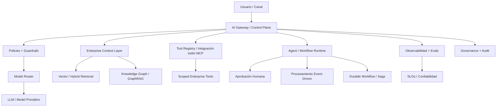

# Construyendo Enterprise Agentic AI

## Desde LLM Runtime hasta Plataformas de IA Gobernadas, Event-Driven y Confiables

<p align="center">
  <strong>Portfolio de Arquitectura e Ingeniería para Enterprise Agentic AI orientada a producción en Fintech</strong>
</p>

<p align="center">
  
  
  
  
  
</p>

<p align="center">
  <a href="./README.md">Inicio</a> ·
  <a href="./README.en.md">🇺🇸 English</a>
</p>

---

## Por qué existe este portfolio

Muchos portfolios de IA terminan en un chatbot, un prompt, un notebook o una única demo de RAG.

Este se enfoca en un problema más difícil:

> **¿Cómo hacemos ingeniería del sistema que rodea al modelo para que la IA pueda evolucionar hacia una capacidad productiva gobernada, segura, observable, auditable y confiable?**

A través de 18 repositorios progresivos, este portfolio explora las capacidades y patrones de ingeniería necesarios para evolucionar desde un runtime LLM básico hacia una arquitectura Enterprise Agentic AI: evidencia gobernada, tools controladas, estado persistente, workflows de larga duración, procesamiento event-driven, aprobación humana, señales de calidad, auditabilidad y reliability engineering.

Las 18 semanas no son el producto. Son la **evidencia de ingeniería** detrás de la arquitectura.

---

## La idea central

```text
Modelo ≠ Sistema de IA
Agente ≠ Plataforma de IA

Modelo
+ Contexto
+ Retrieval
+ Tools
+ Estado
+ Evaluación
+ Observabilidad
+ Seguridad
+ Governance
+ Procesamiento de Eventos
+ Workflows Durables
+ Confiabilidad
= Sistema de IA Orientado a Producción
```

> **El modelo no es la arquitectura. El agente no es la plataforma. La IA productiva surge del sistema que los rodea.**

---

## Evolución de la arquitectura — 8 capas

```mermaid
flowchart LR
    A["01 · MODELO<br/>LLM Runtime · Structured Outputs · Memoria"]
    B["02 · CONOCIMIENTO<br/>Embeddings · Retrieval · RAG"]
    C["03 · AGENCIA<br/>Agent Graphs · HITL · Conceptos MCP"]
    D["04 · CONFIANZA<br/>Evals · Observabilidad · Seguridad"]
    E["05 · PLATAFORMA<br/>Patrones Productivos · Control Plane · Governance"]
    F["06 · CONTEXTO<br/>Knowledge Graph · GraphRAG"]
    G["07 · OPERACIONES<br/>Eventos · Durable Workflows · Saga"]
    H["08 · CONFIABILIDAD<br/>SLOs · Incidentes · Chaos"]

    A --> B --> C --> D --> E --> F --> G --> H
```



| Nivel | Capa de Arquitectura | Módulos | Foco de Ingeniería |
|---:|---|---|---|
| **01** | **FUNDACIÓN DEL MODELO** | Semanas 01–03 | Runtime · Structured outputs · Estado · Memoria |
| **02** | **CONOCIMIENTO** | Semanas 04–05 | Embeddings · Retrieval · Hybrid Search · Grounded RAG |
| **03** | **AGENCIA** | Semanas 06–07 | Agent Graphs · HITL · conceptos MCP |
| **04** | **CONFIANZA** | Semanas 08–10 | Evals · Observabilidad · Seguridad · Guardrails |
| **05** | **PLATAFORMA** | Semanas 11–14 | Production Runtime · Advanced AI · Control Plane · Governance |
| **06** | **CONTEXTO ENTERPRISE** | Semana 15 | Semantic Layer · Knowledge Graph · GraphRAG |
| **07** | **OPERACIONES AUTÓNOMAS** | Semanas 16–17 | Event-Driven AI · Durable Workflows · Saga |
| **08** | **CONFIABILIDAD** | Semana 18 | SLOs · Incident Response · Chaos Testing |

---

## Esto no es una lista de lectura. Es un portfolio de ingeniería.

Los módulos contienen implementaciones ejecutables, tests, datasets, diagramas, notas de verificación y artefactos generados.

Se pueden inspeccionar resultados concretos como:

- runtimes LLM e integración con providers
- pipelines de JSON Schema / Structured Outputs
- ejecución y validación de tools
- stores de estado y memoria
- vector retrieval e hybrid search
- RAG con grounding y citas
- agent graphs, checkpoints y aprobación humana
- conceptos MCP y patrones de integración de tools/resources estilo MCP
- datasets de evaluación, judges y regresión
- trazas, telemetría de latencia/costo y snapshots de observabilidad
- políticas de seguridad y guardrails
- idempotencia, colas, fallbacks y mecanismos de resiliencia
- patrones multimodales / voice / computer use
- artefactos de Enterprise AI Gateway / Control Plane
- evidencia de AI Governance, System Cards y regulatory mapping
- Knowledge Graph / GraphRAG con nodes, edges y evidence paths
- Event-Driven AI con DLQ, replay y streaming telemetry
- estado durable, Saga compensation y Outbox
- prácticas de SLO, incident response y chaos testing

---

## Recorrido de ingeniería de 18 módulos

| Semana | Artefacto Productivo | Temas Principales | Evidencia de Ingeniería | Repositorio |
|---:|---|---|---|---|
| **01** | **LLM Runtime v1** | Responses API · OpenAI/Bedrock · Prompt & Context Engineering | Runtime, docs, bilingual examples | [Abrir ↗](https://github.com/marcelodmartini/week1-llm-ia-fintech-bilingual) |
| **02** | **Tool Runtime v1** | Structured Outputs · JSON Schema · Tool Calling | Code, tests, CI-oriented structure | [Abrir ↗](https://github.com/marcelodmartini/week2-llm-ia-fintech-bilingual) |
| **03** | **Stateful Chat v1** | Prompt Caching · Conversation State · Memory · Compaction | State/memory runtime, tests | [Abrir ↗](https://github.com/marcelodmartini/week3-llm-ia-fintech-bilingual) |
| **04** | **Retriever v1** | Embeddings · Chunking · Metadata · Vector Search | Retriever implementation, tests | [Abrir ↗](https://github.com/marcelodmartini/week4-llm-ia-fintech-bilingual) |
| **05** | **Enterprise RAG v1** | Hybrid Search · Reranking · Grounding · Citations | Grounded RAG pipeline, tests | [Abrir ↗](https://github.com/marcelodmartini/week5-llm-ia-fintech-bilingual) |
| **06** | **Agent Graph v1** | Graph Orchestration · Workflows vs Agents · Checkpoints · HITL | Agent graph, checkpoints, HITL | [Abrir ↗](https://github.com/marcelodmartini/week6-llm-ia-fintech-bilingual) |
| **07** | **MCP Integration v1** | MCP Concepts · Remote Tools · Tool Search · Deferred Loading | MCP-style tool/resource layer | [Abrir ↗](https://github.com/marcelodmartini/week7-llm-ia-fintech-bilingual) |
| **08** | **Eval Harness v1** | Eval Datasets · Judges · Regression · MLflow | baseline_report · candidate_report · regression_diff | [Abrir ↗](https://github.com/marcelodmartini/week8-llm-ia-fintech-bilingual) |
| **09** | **AI Observability v1** | Tracing · Cost · Latency · Debugging | dashboard_snapshot · request_reports · trace_dump | [Abrir ↗](https://github.com/marcelodmartini/week9-llm-ia-fintech-bilingual) |
| **10** | **Secure Agent v1** | Prompt Injection · Guardrails · Scoped Tools · Policy | SECURITY docs · verification · sample results | [Abrir ↗](https://github.com/marcelodmartini/week10-llm-ia-fintech-bilingual) |
| **11** | **Production AI Runtime** | Resilience · Idempotency · Queues · SLOs · FinOps | audit_log · metrics_snapshot · production/queue results | [Abrir ↗](https://github.com/marcelodmartini/week11-llm-ia-fintech-bilingual) |
| **12** | **Multimodal Automation for Fintech** | Fine-Tuning · Multimodal · Voice · Computer Use · n8n | fine_tuning_dataset · classifier_eval · n8n workflow | [Abrir ↗](https://github.com/marcelodmartini/week12-llm-ia-fintech-bilingual) |
| **13** | **Enterprise AI Control Plane** | LLM Gateway · Model Router · Registries · Release Gates | release_gate_decision · telemetry · control-plane results | [Abrir ↗](https://github.com/marcelodmartini/week13-llm-ia-fintech-bilingual) |
| **14** | **AI Governance, Risk & Compliance** | Model Risk · Controls · Evidence · Validation · Audit | system card · governance dashboard · regulatory mapping | [Abrir ↗](https://github.com/marcelodmartini/week14-llm-ia-fintech-bilingual) |
| **15** | **Semantic Layer + Knowledge Graph + GraphRAG** | Ontology · Entity Resolution · Evidence Paths | graph nodes/edges · GraphRAG context · audit export | [Abrir ↗](https://github.com/marcelodmartini/week15-llm-ia-fintech-bilingual) |
| **16** | **Event-Driven AI Fintech** | Streaming Intelligence · Real-Time Decisioning · Replay · DLQ | DLQ · replay report · operational graph · stream telemetry | [Abrir ↗](https://github.com/marcelodmartini/week16-llm-ia-fintech-bilingual) |
| **17** | **Durable AI Workflows** | HITL · Saga · Compensation · Outbox/Inbox · Replay | workflow states · approvals · outbox · saga compensation | [Abrir ↗](https://github.com/marcelodmartini/week17-llm-ia-fintech-bilingual) |
| **18** | **AI Reliability Engineering** | SLIs/SLOs · Error Budgets · Incidents · Chaos Testing | reliability artifacts · tests · verification | [Abrir ↗](https://github.com/marcelodmartini/week18-llm-ia-fintech-bilingual) |

---

## Mapa módulo por módulo

### Semana 01 — [LLM Runtime v1](https://github.com/marcelodmartini/week1-llm-ia-fintech-bilingual)
**Responses API · OpenAI/Bedrock · Prompt & Context Engineering**

Fundación de runtime LLM con integración de proveedores, prompting y límites de contexto orientados a producción.

**Evidencia:** `Runtime, docs, bilingual examples`

### Semana 02 — [Tool Runtime v1](https://github.com/marcelodmartini/week2-llm-ia-fintech-bilingual)
**Structured Outputs · JSON Schema · Tool Calling**

IA consumible por backend mediante schemas, extracción, clasificación, validación y ejecución controlada de tools.

**Evidencia:** `Code, tests, CI-oriented structure`

### Semana 03 — [Stateful Chat v1](https://github.com/marcelodmartini/week3-llm-ia-fintech-bilingual)
**Prompt Caching · Conversation State · Memory · Compaction**

Arquitectura conversacional con estado, políticas de memoria, construcción de contexto y compactación.

**Evidencia:** `State/memory runtime, tests`

### Semana 04 — [Retriever v1](https://github.com/marcelodmartini/week4-llm-ia-fintech-bilingual)
**Embeddings · Chunking · Metadata · Vector Search**

Fundamentos de retrieval para conocimiento fintech usando embeddings, ingesta, chunking y búsqueda semántica.

**Evidencia:** `Retriever implementation, tests`

### Semana 05 — [Enterprise RAG v1](https://github.com/marcelodmartini/week5-llm-ia-fintech-bilingual)
**Hybrid Search · Reranking · Grounding · Citations**

RAG basado en evidencia con retrieval híbrido, reranking, citas y trazabilidad.

**Evidencia:** `Grounded RAG pipeline, tests`

### Semana 06 — [Agent Graph v1](https://github.com/marcelodmartini/week6-llm-ia-fintech-bilingual)
**Graph Orchestration · Workflows vs Agents · Checkpoints · HITL**

Orquestación stateful gobernada con branching, checkpoints, durable execution y aprobación humana.

**Evidencia:** `Agent graph, checkpoints, HITL`

### Semana 07 — [MCP Integration v1](https://github.com/marcelodmartini/week7-llm-ia-fintech-bilingual)
**MCP Concepts · Remote Tools · Tool Search · Deferred Loading**

Capa de integración estilo MCP para tools/resources con discovery, scopes, validación y deferred loading.

**Evidencia:** `MCP-style tool/resource layer`

### Semana 08 — [Eval Harness v1](https://github.com/marcelodmartini/week8-llm-ia-fintech-bilingual)
**Eval Datasets · Judges · Regression · MLflow**

Calidad AI observable mediante datasets, scorers, judges y regresión baseline-vs-candidate.

**Evidencia:** `baseline_report` · `candidate_report` · `regression_diff`

### Semana 09 — [AI Observability v1](https://github.com/marcelodmartini/week9-llm-ia-fintech-bilingual)
**Tracing · Cost · Latency · Debugging**

Visibilidad end-to-end de modelos, tools, retrieval, costo, latencia, fallos y trazas.

**Evidencia:** `dashboard_snapshot` · `request_reports` · `trace_dump`

### Semana 10 — [Secure Agent v1](https://github.com/marcelodmartini/week10-llm-ia-fintech-bilingual)
**Prompt Injection · Guardrails · Scoped Tools · Policy**

Defensa en profundidad con trust boundaries, scoped tools, approvals y controles de salida.

**Evidencia:** `SECURITY docs` · `verification` · `sample results`

### Semana 11 — [Production AI Runtime](https://github.com/marcelodmartini/week11-llm-ia-fintech-bilingual)
**Resilience · Idempotency · Queues · SLOs · FinOps**

Runtime productivo con controles de rate/concurrency, cache, idempotencia, colas, fallbacks y métricas.

**Evidencia:** `audit_log` · `metrics_snapshot` · `production/queue results`

### Semana 12 — [Multimodal Automation for Fintech](https://github.com/marcelodmartini/week12-llm-ia-fintech-bilingual)
**Fine-Tuning · Multimodal · Voice · Computer Use · n8n**

Capacidades AI avanzadas envueltas en evaluación, sandboxing, aprobación humana y automatización auditable.

**Evidencia:** `fine_tuning_dataset` · `classifier_eval` · `n8n workflow`

### Semana 13 — [Enterprise AI Control Plane](https://github.com/marcelodmartini/week13-llm-ia-fintech-bilingual)
**LLM Gateway · Model Router · Registries · Release Gates**

Acceso enterprise centralizado a modelos, prompts, tools, routing, policies, telemetry y release governance.

**Evidencia:** `release_gate_decision` · `telemetry` · `control-plane results`

### Semana 14 — [AI Governance, Risk & Compliance](https://github.com/marcelodmartini/week14-llm-ia-fintech-bilingual)
**Model Risk · Controls · Evidence · Validation · Audit**

IA gobernada como activo enterprise: inventario, evaluación de riesgo, controles, evidencia, approvals y monitoring.

**Evidencia:** `system card` · `governance dashboard` · `regulatory mapping`

### Semana 15 — [Semantic Layer + Knowledge Graph + GraphRAG](https://github.com/marcelodmartini/week15-llm-ia-fintech-bilingual)
**Ontology · Entity Resolution · Evidence Paths**

Contexto enterprise con entidades gobernadas, relaciones, linaje, ownership, graph retrieval y evidence paths.

**Evidencia:** `graph nodes/edges` · `GraphRAG context` · `audit export`

### Semana 16 — [Event-Driven AI Fintech](https://github.com/marcelodmartini/week16-llm-ia-fintech-bilingual)
**Streaming Intelligence · Real-Time Decisioning · Replay · DLQ**

IA que reacciona a eventos reales con schemas, idempotencia, decisiones acotadas, replay, DLQ y telemetry.

**Evidencia:** `DLQ` · `replay report` · `operational graph` · `stream telemetry`

### Semana 17 — [Durable AI Workflows](https://github.com/marcelodmartini/week17-llm-ia-fintech-bilingual)
**HITL · Saga · Compensation · Outbox/Inbox · Replay**

Procesos AI de larga duración con estado persistente, approval gates, compensation, outbox y replay auditable.

**Evidencia:** `workflow states` · `approvals` · `outbox` · `saga compensation`

### Semana 18 — [AI Reliability Engineering](https://github.com/marcelodmartini/week18-llm-ia-fintech-bilingual)
**SLIs/SLOs · Error Budgets · Incidents · Chaos Testing**

Operación de IA como sistema crítico con degraded modes, runbooks, incident response y chaos testing.

**Evidencia:** `reliability artifacts` · `tests` · `verification`

---

## De prototipo a plataforma Enterprise AI

La progresión es intencional:

```text
01–03  Entender y controlar el runtime LLM
04–05  Dar conocimiento confiable al sistema
06–07  Agregar agencia y patrones de capacidades externas gobernadas
08–10  Hacer inspeccionables la calidad, el comportamiento y la seguridad
11–14  Explorar las capas de una plataforma AI enterprise
15     Dar contexto semántico corporativo a los agentes
16–17  Pasar de request/response hacia procesos operativos AI
18     Diseñar confiabilidad para condiciones productivas reales
```

Al final, el portfolio demuestra una arquitectura con preocupaciones de control explícitas para **conocimiento, tools, policies, calidad, riesgo, workflow state y confiabilidad**.

---

## Vista de arquitectura Enterprise



### Responsabilidad de cada capa

| Capa | Responsabilidad |
|---|---|
| **AI Gateway / Control Plane** | acceso a modelos, routing, tenancy, registries de prompts/tools, release policy |
| **Policies & Guardrails** | trust boundaries, acciones acotadas, validación, approval gates |
| **Enterprise Context** | vector retrieval, semantic layer, Knowledge Graph, GraphRAG |
| **Tool / MCP-style Layer** | patrones gobernados para acceder a capacidades externas y sistemas enterprise |
| **Agent / Workflow Runtime** | estado, branching, orquestación, checkpoints, HITL |
| **Event-Driven Layer** | procesamiento reactivo, idempotencia, DLQ, replay, decisiones en tiempo real |
| **Durable Execution** | workflows largos, Saga, compensation, Outbox/Inbox |
| **Observability & Evals** | calidad, groundedness, routing/tool correctness, latencia, costo, trazas |
| **Governance & Audit** | inventario, evidencia, controles de riesgo, approvals, linaje, audit trail |
| **Reliability Engineering** | SLIs, SLOs, error budgets, degraded modes, incidentes, chaos testing |

---

## Evidencia por encima de afirmaciones

Uno de los objetivos principales de los módulos posteriores es producir artefactos de ingeniería inspeccionables.

Entre los repositorios existen ejemplos como:

```text
baseline_report.json
candidate_report.json
regression_diff.json

dashboard_snapshot.json
request_reports.json
trace_dump.json

SECURITY.md
sample_run_results.json

audit_log.json
metrics_snapshot.json
production_results.json
queue_results.json

classifier_eval_report.json
fine_tuning_dataset.jsonl
n8n_workflow_spec.json

release_gate_decision.json
telemetry_events.json
telemetry_summary.json

governance_dashboard.json
system_card_ai_fraud_triage_v1.md
regulatory_mapping_report.json
audit_events.json

graph_nodes.json
graph_edges.json
week15_graphrag_context_results.json
week15_graph_audit_export.json

dead_letter_queue.json
replay_report.json
operational_graph.json
stream_telemetry_summary.json

approval_requests.json
workflow_states.json
outbox_events.json
saga_compensation_report.json
```

La intención es que el portfolio sea **inspeccionable**: un reviewer puede ir más allá del README y observar cómo se representan calidad, governance, workflow state y comportamiento operativo.

---

## Recorridos recomendados

### Recruiters & Hiring Managers — 15 a 20 minutos

Empezar por:

**05 — Enterprise RAG**  
**08 — Evaluation & Regression**  
**10 — Secure Agent**  
**13 — Enterprise AI Control Plane**  
**15 — Knowledge Graph + GraphRAG**  
**17 — Durable AI Workflows**  
**18 — AI Reliability Engineering**

Este recorrido muestra la transición desde una feature AI hacia arquitectura productiva enterprise.

### AI / Solution Architects

Secuencia recomendada:

```text
05 → 06 → 07 → 08 → 09 → 10 → 13 → 14 → 15 → 16 → 17 → 18
```

### Software Engineers entrando en GenAI

Recorrido completo:

```text
01 → 02 → 03 → 04 → 05 → 06 → 07 → 08 → 09
→ 10 → 11 → 12 → 13 → 14 → 15 → 16 → 17 → 18
```

---

## Principios de ingeniería utilizados

**1. Evidencia por encima de elocuencia.** Una respuesta es más fuerte cuando está grounded en contexto confiable y evidence paths.

**2. Control determinístico alrededor de modelos probabilísticos.** Schemas, validación, policies, workflow state y transiciones críticas no deberían depender solamente del modelo.

**3. Autonomía acotada.** Los agentes pueden razonar, pero su acceso a tools y side effects debe estar limitado.

**4. Human approval cuando el riesgo lo requiere.** HITL es un control arquitectónico, no un detalle de UI.

**5. Evaluación antes que confianza.** La calidad necesita datasets, scorers, judges, baselines y regression.

**6. Observabilidad antes de producción.** Se necesitan trazas, latencia, costo, comportamiento de modelos/tools y contexto de fallas.

**7. Seguridad por diseño.** Prompt injection, data leakage y tool abuse son problemas del sistema completo.

**8. Idempotencia y estado durable.** Retries y procesos largos no deben duplicar side effects financieros.

**9. Governance y auditabilidad.** Modelos, prompts, tools, evidencia, decisiones y approvals necesitan trazabilidad.

**10. Confiabilidad como propiedad del producto.** SLOs, error budgets, degraded modes, runbooks e incident response forman parte de AI Engineering.

---

## Landscape tecnológico

El portfolio explora conceptos y patrones de implementación alrededor de:

`TypeScript` · `Node.js` · `OpenAI Responses API` · `AWS Bedrock` · `JSON Schema` · `Structured Outputs` · `Tool Calling` · `Graph Orchestration` · `patrones LangGraph` · `conceptos MCP` · `integración estilo MCP` · `Embeddings` · `Vector Search` · `Hybrid Retrieval` · `Reranking` · `RAG` · `MLflow` · `Tracing` · `Guardrails` · `Policy Engines` · `Queues` · `Idempotency` · `Multimodal AI` · `Realtime Voice` · `Computer Use` · `n8n` · `LLM Gateway` · `Knowledge Graph` · `GraphRAG` · `Event-Driven Architecture` · `Saga` · `Outbox/Inbox` · `SLOs` · `Chaos Testing`

La implementación exacta cambia por módulo. El hilo conductor es **Enterprise Agentic AI orientada a producción aplicada a arquitectura fintech**.

---

## Escenarios fintech

Los repositorios utilizan escenarios realistas pero genéricos sobre:

`Pagos` · `Investigación de Fraude` · `KYC / Onboarding` · `Chargebacks y Disputas` · `Crédito / Riesgo` · `Cobranzas` · `Operaciones de Clientes` · `Compliance` · `Data Governance` · `Troubleshooting Operativo`

El objetivo no es automatizar ciegamente decisiones de alto riesgo. El patrón recurrente es:

```text
reasoning
→ evidencia
→ policy
→ acceso acotado a tools
→ aprobación cuando corresponde
→ acción auditable
```

---

## Estructura típica de los repositorios

La estructura exacta evoluciona según el módulo. Un repositorio típico puede contener:

```text
weekN-llm-ia-fintech-bilingual/
├── README.md
├── README.en.md
├── README.es.md
├── docs/
├── assets/             # cuando aplica
├── data/               # cuando aplica
├── examples/           # primeros módulos
├── src/
├── tests/              # mayoría de módulos de implementación
├── artifacts/reports/  # cuando aplica
└── evidencia generada *.json / *.jsonl
```

---

## Qué debería llevarse un reviewer

No:

> “Este portfolio sabe llamar a una API de LLM.”

Sino:

> **“Este portfolio demuestra cómo hacer ingeniería de sistemas AI atravesando runtime, contexto, retrieval, agentes, tools, evaluación, observabilidad, seguridad, platform governance, semántica enterprise, procesamiento event-driven, operaciones durables y confiabilidad.”**

Esa es la diferencia entre experimentar con GenAI y hacer ingeniería de **Enterprise Agentic AI orientada a producción**.

---

## Comenzar

➡️ **[Semana 01 — LLM Runtime v1](https://github.com/marcelodmartini/week1-llm-ia-fintech-bilingual)**

Continuar secuencialmente hasta:

➡️ **[Semana 18 — AI Reliability Engineering](https://github.com/marcelodmartini/week18-llm-ia-fintech-bilingual)**

---

## Autor

**Marcelo D. Martini**  
Software Engineer · AI Engineering · Generative AI · Agentic Systems · Fintech Architecture

GitHub: [@marcelodmartini](https://github.com/marcelodmartini)

---

<sub>Portfolio personal de ingeniería y aprendizaje. Los ejemplos son educativos, utilizan escenarios fintech genéricos y no buscan exponer sistemas propietarios, información confidencial ni credenciales productivas.</sub>
