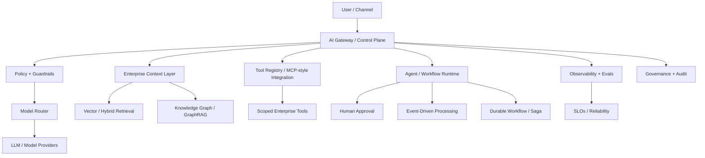

# Building Enterprise Agentic AI

## From LLM Runtime to Governed, Event-Driven & Reliable AI Platforms

<p align="center">
  <strong>An Architecture & Engineering Portfolio for Production-Oriented Enterprise Agentic AI in Fintech</strong><br/>
  <strong>Portfolio de Arquitectura e Ingeniería para Enterprise Agentic AI orientada a producción en Fintech</strong>
</p>

<p align="center">
  
  
  
  
  
</p>

<p align="center">
  <a href="./README.en.md"><strong>🇺🇸 Full English Version</strong></a>
  &nbsp;&nbsp;·&nbsp;&nbsp;
  <a href="./README.es.md"><strong>🇪🇸 Versión Completa en Español</strong></a>
</p>

---

> **The model is not the architecture. The agent is not the platform. Production AI emerges from the system around them.**
>
> **El modelo no es la arquitectura. El agente no es la plataforma. La IA productiva surge del sistema que los rodea.**

This repository is the **single entry point** to 18 progressive, bilingual engineering modules exploring the capabilities and design patterns required to evolve from a basic LLM runtime toward governed, observable, event-driven, durable and reliable Enterprise Agentic AI systems for fintech.

Este repositorio es el **punto de entrada único** a 18 módulos de ingeniería progresivos y bilingües que exploran las capacidades y patrones de diseño necesarios para evolucionar desde un runtime LLM básico hacia sistemas Enterprise Agentic AI gobernados, observables, event-driven, durables y confiables para fintech.

---

## Architecture Journey / Recorrido de Arquitectura

```mermaid
flowchart LR
    A["01 · MODEL<br/>LLM Runtime · Structured Outputs · Memory"]
    B["02 · KNOWLEDGE<br/>Embeddings · Retrieval · RAG"]
    C["03 · AGENCY<br/>Agent Graphs · HITL · MCP Concepts"]
    D["04 · TRUST<br/>Evals · Observability · Security"]
    E["05 · PLATFORM<br/>Production Patterns · Control Plane · Governance"]
    F["06 · CONTEXT<br/>Knowledge Graph · GraphRAG"]
    G["07 · OPERATIONS<br/>Events · Durable Workflows · Saga"]
    H["08 · RELIABILITY<br/>SLOs · Incidents · Chaos"]

    A --> B --> C --> D --> E --> F --> G --> H
```



This is not a list of disconnected tutorials. Each module adds a production-oriented capability or pattern that becomes part of the next architectural layer.

No es una lista de tutoriales aislados. Cada módulo agrega una capacidad o patrón orientado a producción que pasa a formar parte de la siguiente capa arquitectónica.

---

## What is actually built / Qué se construye realmente

Across the 18 repositories you will find **runnable TypeScript/Node.js code, tests, datasets, bilingual documentation, diagrams and generated engineering artifacts**.

A lo largo de los 18 repositorios vas a encontrar **código TypeScript/Node.js ejecutable, tests, datasets, documentación bilingüe, diagramas y artefactos de ingeniería generados**.

```text
LLM Runtime
→ Structured Output & Tool Runtime
→ Stateful Memory
→ Vector Retrieval
→ Enterprise RAG
→ Agent Graph + HITL
→ MCP-style Integration
→ Evaluation & Regression
→ AI Observability
→ Secure Agent
→ Production AI Runtime
→ Multimodal Automation
→ Enterprise AI Control Plane
→ AI Governance & Model Risk
→ Knowledge Graph + GraphRAG
→ Event-Driven AI
→ Durable AI Workflows + Saga
→ AI Reliability Engineering
```

---

## 18 Engineering Modules / 18 Módulos de Ingeniería

| # | Production Artifact / Artefacto | Core Focus / Foco | Repository |
|---:|---|---|---|
| **01** | **LLM Runtime v1** | Responses API · OpenAI/Bedrock · Prompt & Context Engineering | [Week 01 ↗](https://github.com/marcelodmartini/week1-llm-ia-fintech-bilingual) |
| **02** | **Tool Runtime v1** | Structured Outputs · JSON Schema · Tool Calling | [Week 02 ↗](https://github.com/marcelodmartini/week2-llm-ia-fintech-bilingual) |
| **03** | **Stateful Chat v1** | Prompt Caching · Conversation State · Memory · Compaction | [Week 03 ↗](https://github.com/marcelodmartini/week3-llm-ia-fintech-bilingual) |
| **04** | **Retriever v1** | Embeddings · Chunking · Metadata · Vector Search | [Week 04 ↗](https://github.com/marcelodmartini/week4-llm-ia-fintech-bilingual) |
| **05** | **Enterprise RAG v1** | Hybrid Search · Reranking · Grounding · Citations | [Week 05 ↗](https://github.com/marcelodmartini/week5-llm-ia-fintech-bilingual) |
| **06** | **Agent Graph v1** | Graph Orchestration · Workflows vs Agents · Checkpoints · HITL | [Week 06 ↗](https://github.com/marcelodmartini/week6-llm-ia-fintech-bilingual) |
| **07** | **MCP Integration v1** | MCP Concepts · Remote Tools · Tool Search · Deferred Loading | [Week 07 ↗](https://github.com/marcelodmartini/week7-llm-ia-fintech-bilingual) |
| **08** | **Eval Harness v1** | Eval Datasets · Judges · Regression · MLflow | [Week 08 ↗](https://github.com/marcelodmartini/week8-llm-ia-fintech-bilingual) |
| **09** | **AI Observability v1** | Tracing · Cost · Latency · Debugging | [Week 09 ↗](https://github.com/marcelodmartini/week9-llm-ia-fintech-bilingual) |
| **10** | **Secure Agent v1** | Prompt Injection · Guardrails · Scoped Tools · Policy | [Week 10 ↗](https://github.com/marcelodmartini/week10-llm-ia-fintech-bilingual) |
| **11** | **Production AI Runtime** | Resilience · Idempotency · Queues · SLOs · FinOps | [Week 11 ↗](https://github.com/marcelodmartini/week11-llm-ia-fintech-bilingual) |
| **12** | **Multimodal Automation for Fintech** | Fine-Tuning · Multimodal · Voice · Computer Use · n8n | [Week 12 ↗](https://github.com/marcelodmartini/week12-llm-ia-fintech-bilingual) |
| **13** | **Enterprise AI Control Plane** | LLM Gateway · Model Router · Registries · Release Gates | [Week 13 ↗](https://github.com/marcelodmartini/week13-llm-ia-fintech-bilingual) |
| **14** | **AI Governance, Risk & Compliance** | Model Risk · Controls · Evidence · Validation · Audit | [Week 14 ↗](https://github.com/marcelodmartini/week14-llm-ia-fintech-bilingual) |
| **15** | **Semantic Layer + Knowledge Graph + GraphRAG** | Ontology · Entity Resolution · Evidence Paths | [Week 15 ↗](https://github.com/marcelodmartini/week15-llm-ia-fintech-bilingual) |
| **16** | **Event-Driven AI Fintech** | Streaming Intelligence · Real-Time Decisioning · Replay · DLQ | [Week 16 ↗](https://github.com/marcelodmartini/week16-llm-ia-fintech-bilingual) |
| **17** | **Durable AI Workflows** | HITL · Saga · Compensation · Outbox/Inbox · Replay | [Week 17 ↗](https://github.com/marcelodmartini/week17-llm-ia-fintech-bilingual) |
| **18** | **AI Reliability Engineering** | SLIs/SLOs · Error Budgets · Incidents · Chaos Testing | [Week 18 ↗](https://github.com/marcelodmartini/week18-llm-ia-fintech-bilingual) |

---

## Evidence, not just claims / Evidencia, no solo conceptos

Later modules expose concrete generated artifacts such as:

```text
baseline_report.json
candidate_report.json
regression_diff.json
dashboard_snapshot.json
trace_dump.json
SECURITY.md
audit_log.json
metrics_snapshot.json
fine_tuning_dataset.jsonl
release_gate_decision.json
telemetry_events.json
governance_dashboard.json
system_card_ai_fraud_triage_v1.md
graph_nodes.json
graph_edges.json
week15_graphrag_context_results.json
dead_letter_queue.json
replay_report.json
approval_requests.json
outbox_events.json
saga_compensation_report.json
workflow_states.json
```

That distinction matters: this portfolio is designed to be **inspectable engineering work**, not only explanatory content.

La diferencia importa: este portfolio está diseñado para mostrar **trabajo de ingeniería inspeccionable**, no solamente contenido explicativo.

---

## Fast path for reviewers / Recorrido rápido

**Recruiters & Hiring Managers:** start with **05 → 08 → 10 → 13 → 15 → 17 → 18**.

**AI / Solution Architects:** review **05 → 06 → 07 → 08 → 09 → 10 → 13 → 14 → 15 → 16 → 17 → 18**.

**Software Engineers entering GenAI:** follow the complete path **01 → 18**.

---

## Enterprise Architecture View



> **A model endpoint is not an AI platform.** Production-oriented AI engineering requires context, tools, state, policies, evaluation, observability, governance, durable execution patterns and reliability engineering.

---

## Core Engineering Principles

**Evidence over eloquence · Deterministic control around probabilistic models · Bounded autonomy · Human approval for sensitive actions · Evaluation before confidence · Observability before production · Security by design · Idempotency and durable state · Governance and auditability · Reliability as a product property**

---

## Fintech Scope

The modules use generic, non-proprietary scenarios around:

`Payments` · `Fraud` · `KYC/Onboarding` · `Chargebacks` · `Credit/Risk` · `Collections` · `Customer Operations` · `Compliance` · `Data Governance` · `Operational Troubleshooting`

The objective is **not blind automation of high-risk decisions**. The recurring pattern is controlled reasoning + evidence + policy + approvals + auditability.

---

## Author

**Marcelo D. Martini**  
Software Engineer · AI Engineering · Generative AI · Agentic Systems · Fintech Architecture

GitHub: [@marcelodmartini](https://github.com/marcelodmartini)

---

<sub>Personal engineering and learning portfolio. Examples use generic fintech scenarios and are not intended to expose proprietary systems, confidential information or production credentials.</sub>
