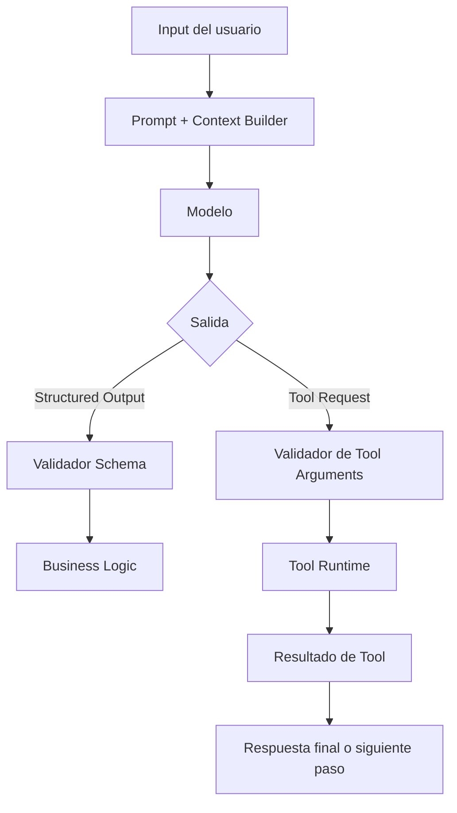
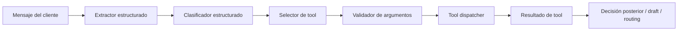

# Semana 02 — Structured Outputs, JSON Schema y Tool Calling para Fintech

Perfecto. Vamos con la **Semana 2 completa**, bien enseñada, bien aterrizada a software y bien apuntada a **Fintech**.

Según tu plan, la **Semana 2** tiene como foco **Structured outputs / JSON Schema / tool calling**, con el objetivo de **pasar de texto libre a IA usable por software**, y cerrar con un entregable **Tool Runtime v1** que incluya: un clasificador estructurado, un extractor estructurado, 3 tools reales con schema formal y validación de entradas/salidas.

---

# Semana 2 — Structured Outputs + JSON Schema + Tool Calling

## Objetivo real

La semana 1 te enseñó a hablar bien con el modelo.
La semana 2 te enseña a **hacer que el modelo trabaje para tu software**.

Ese es el salto clave.

En semana 1 el output podía ser texto útil.
En semana 2 el output tiene que ser:

- parseable,
- validable,
- consumible por código,
- y confiable dentro de límites razonables.

En otras palabras:

> Semana 1 = “que responda bien”.
> Semana 2 = “que responda en formato usable por el sistema”.

Y eso, en fintech, cambia todo.

Porque una fintech no puede operar sobre “texto lindo”.
Tiene que operar sobre:

- campos,
- categorías,
- flags,
- montos,
- severidades,
- decisiones,
- estados,
- acciones posibles.

---

# 1. Qué problema resuelve esta semana

Si vos le pedís a un modelo:

> “Leé este caso y decime qué pasó”

te puede responder algo muy útil… pero difícil de automatizar.

Ejemplo:

> “El cliente parece estar reportando un cobro duplicado en tarjeta, con severidad media y convendría revisar si fue duplicación del comercio o una retención temporal.”

Eso está bien para una persona.
Pero para software todavía es pobre.

Tu backend necesita algo así:

```json
{
  "intent": "duplicate_charge",
  "severity": "medium",
  "requires_human_review": true,
  "possible_cause": "merchant_duplicate_or_auth_hold"
}
```

Eso ya lo puede consumir:

- un workflow,
- una cola,
- un BPM,
- un motor de reglas,
- un dashboard,
- una API,
- un agente posterior.

Ese es el corazón de la Semana 2.

---

# 2. La idea madre: pasar de texto libre a contratos

La idea central es esta:

> El modelo deja de ser solo un generador de texto y pasa a ser un componente que produce datos bajo contrato.

Ese contrato normalmente está definido por un **schema**.

En práctica:

- vos definís **qué estructura querés**,
- el modelo intenta producirla,
- tu sistema la valida,
- y recién ahí la consume.

Esto es importantísimo en fintech porque reduce:

- ambigüedad,
- errores de parseo,
- improvisación,
- outputs no consumibles,
- riesgo operativo.

---

# 3. Qué es un structured output

Un **structured output** es una respuesta del modelo que sigue una estructura formal, normalmente:

- JSON,
- un objeto con campos definidos,
- o una salida que cumple un schema.

## Ejemplo de salida libre

```txt
El cliente está consultando por una transferencia que no llegó. Parecería una incidencia operativa y conviene derivarlo a operaciones.
```

## Ejemplo de salida estructurada

```json
{
  "intent": "transfer_not_received",
  "category": "payments_incident",
  "severity": "medium",
  "team_to_route": "operations",
  "requires_human_review": true
}
```

## Diferencia clave

La salida libre está pensada para humanos.
La salida estructurada está pensada para software.

---

# 4. Structured output no significa verdad

Esto es crucial.

Aunque el modelo te devuelva JSON perfecto, eso **no significa que el contenido sea correcto**.

Puede pasar esto:

```json
{
  "intent": "fraud_confirmed",
  "severity": "high"
}
```

y sin embargo el caso real no confirma fraude, sino solo una sospecha.

Entonces:

> Structured output mejora forma, no garantiza verdad.

Por eso siempre necesitás:

1. buen prompt,
2. buen contexto,
3. schema correcto,
4. validación,
5. y reglas de negocio.

---

# 5. Qué es JSON Schema

**JSON Schema** es una forma estándar de describir cómo debe verse un JSON.

Sirve para definir:

- qué campos existen,
- qué tipo tiene cada campo,
- cuáles son obligatorios,
- qué valores se permiten,
- qué formato debe respetar.

## Ejemplo simple

```json
{
  "type": "object",
  "properties": {
    "intent": {
      "type": "string",
      "enum": ["duplicate_charge", "fraud_report", "kyc_issue"]
    },
    "severity": {
      "type": "string",
      "enum": ["low", "medium", "high"]
    },
    "requires_human_review": {
      "type": "boolean"
    }
  },
  "required": ["intent", "severity", "requires_human_review"],
  "additionalProperties": false
}
```

Esto le dice al sistema:

- tiene que ser un objeto,
- `intent` debe ser string y uno de esos valores,
- `severity` debe ser uno de esos tres,
- `requires_human_review` debe ser boolean,
- no se aceptan campos extra.

---

# 6. Por qué JSON Schema es tan importante en IA aplicada

Porque fuerza a pensar con disciplina.

Si no tenés schema, tu modelo responde “como quiere”.

Si tenés schema, vos definís:

- el contrato de salida,
- la forma esperada,
- los límites del output,
- la interfaz entre IA y software.

## En fintech esto es oro porque permite:

- clasificar tickets de soporte,
- extraer entidades de casos,
- decidir routing,
- armar borradores de disputa,
- detectar campos faltantes,
- disparar validaciones posteriores.

---

# 7. Componentes clave de JSON Schema que tenés que dominar

## 7.1 `type`

Define el tipo:

- `string`
- `number`
- `integer`
- `boolean`
- `array`
- `object`

## 7.2 `properties`

Define los campos del objeto.

## 7.3 `required`

Lista los campos obligatorios.

## 7.4 `enum`

Define valores permitidos.

Ideal para:

- severidad,
- categoría,
- intención,
- estado,
- canal,
- moneda,
- país.

## 7.5 `items`

Define el schema de elementos dentro de un array.

## 7.6 `additionalProperties`

Si es `false`, prohibís campos extra.

Muy recomendable cuando querés outputs limpios.

## 7.7 `description`

Ayuda al modelo y a humanos a entender qué significa cada campo.

## 7.8 `minLength`, `maxLength`, `minimum`, `maximum`, `pattern`

Sirven para acotar mejor.

---

# 8. Reglas de diseño de schemas para fintech

## Regla 1 — Schema chico y claro

No hagas un monstruo de 70 campos en Semana 2.

Primero hacé schemas de 5 a 12 campos.

## Regla 2 — Campos con semántica estable

Usá nombres consistentes:

- `intent`
- `severity`
- `requires_human_review`
- `team_to_route`
- `transaction_amount`
- `currency`

## Regla 3 — Evitá texto libre innecesario

Si algo puede ser `enum`, mejor `enum`.

## Regla 4 — No mezcles todo

No metas en el mismo schema:

- clasificación,
- explicación legal,
- resumen,
- auditoría,
- tool invocation.

Separá responsabilidades.

## Regla 5 — Preferí ausencia antes que invento

Si el modelo no sabe el monto, mejor `null` o ausencia controlada que un monto inventado.

## Regla 6 — Prohibí campos extra cuando importa control

`additionalProperties: false` ayuda mucho.

---

# 9. Structured extraction

La **extracción estructurada** es cuando tomás texto no estructurado y lo convertís en campos formales.

## Ejemplo fintech

Input:

> “El cliente dice que ayer a las 21:13 intentó pagar en Carrefour, le falló la primera vez, volvió a intentar y ahora ve dos consumos de ARS 48.200.”

Output:

```json
{
  "merchant_name": "Carrefour",
  "transaction_amount": 48200,
  "currency": "ARS",
  "reported_issue": "duplicate_charge",
  "event_time_text": "ayer 21:13",
  "requires_human_review": true
}
```

## Para qué sirve

La extracción estructurada te permite:

- alimentar workflows,
- abrir casos con campos normalizados,
- preparar derivaciones,
- ejecutar reglas,
- cruzar contra sistemas internos.

---

# 10. Structured classification

La **clasificación estructurada** es diferente.

No busca extraer datos textuales, sino **ubicar el caso en una taxonomía**.

## Ejemplo

Input:

> “Me vaciaron la cuenta, no reconozco varias transferencias”

Output:

```json
{
  "intent": "fraud_report",
  "subcategory": "account_takeover_suspected",
  "severity": "high",
  "team_to_route": "fraud_ops",
  "requires_human_review": true
}
```

## Diferencia con extracción

### Extracción responde:

- qué datos aparecen en el texto

### Clasificación responde:

- qué significa operativamente el caso

---

# 11. Tool calling

Ahora viene una de las ideas más importantes de IA aplicada.

## Qué es tool calling

Es el patrón donde el modelo no solo responde, sino que puede **pedir usar una herramienta**.

Pero ojo:

> el modelo no ejecuta realmente la herramienta por sí solo;
> tu runtime decide si la ejecuta.

El modelo dice algo como:

- “para resolver esto necesito consultar el estado de la transacción”
- o devuelve una intención de usar una tool con argumentos estructurados

Y después tu sistema:

1. valida esos argumentos,
2. ejecuta la tool real,
3. le devuelve el resultado al flujo.

---

# 12. Por qué tool calling importa tanto

Porque sin tools el modelo solo trabaja con lo que ya tiene en el prompt.

Con tools puede pedir:

- consultar una transacción,
- revisar un estado KYC,
- ver si existe deuda vencida,
- obtener flags de riesgo,
- preparar un borrador de disputa.

Entonces el modelo pasa de “hablar” a “orquestar información”.

---

# 13. Pero en fintech hay que usar tools con mucha disciplina

No todas las tools son iguales.

## Tipo A — Read-only

Las más seguras.

Ejemplos:

- consultar estado de transacción
- obtener estado de tarjeta
- consultar flags de riesgo
- leer estado KYC

## Tipo B — Draft / preparatorias

Todavía seguras si están bien diseñadas.

Ejemplos:

- crear borrador de disputa
- preparar respuesta para backoffice
- generar resumen de reclamo

## Tipo C — Acciones sensibles

Mucho más riesgosas.

Ejemplos:

- bloquear tarjeta
- revertir operación
- liberar fondos
- modificar scoring
- aprobar un alta

En Semana 2 yo te recomiendo trabajar casi todo con herramientas **read-only** o **draft**.

---

# 14. Anatomía de una buena tool

Una tool buena tiene:

## a) Nombre claro

Ejemplo:
`get_transaction_status`

## b) Descripción precisa

Qué hace y cuándo usarla.

## c) Input schema formal

Qué parámetros acepta.

## d) Output predecible

Qué devuelve.

## e) Scope

Qué no hace.

## f) Política de seguridad

Si requiere confirmación humana o no.

## g) Timeout / retry policy

Para runtime serio.

---

# 15. Diferencia entre respuesta estructurada y tool calling

## Respuesta estructurada

El modelo devuelve datos estructurados.

Ejemplo:

```json
{
  "intent": "duplicate_charge",
  "severity": "medium"
}
```

## Tool calling

El modelo dice:
“Necesito usar `get_transaction_status` con estos argumentos”.

Ejemplo:

```json
{
  "tool_name": "get_transaction_status",
  "arguments": {
    "transaction_id": "txn_123",
    "customer_id": "cust_456"
  }
}
```

Una cosa clasifica o extrae.
La otra pide ejecutar una capacidad externa.

---

# 16. Arquitectura mental de la Semana 2



La clave es esta:

- nada se consume sin validar,
- ninguna tool se ejecuta sin validar argumentos,
- ninguna acción sensible debería correr sin política.

---

# 17. Diseño del mini proyecto de la semana: Tool Runtime v1

Según tu plan, el entregable de la semana es un **Tool Runtime v1** con: clasificador estructurado, extractor estructurado, 3 tools reales con schema formal y validación de entradas/salidas.

Yo te propongo este diseño:

## Componentes

1. **Extractor estructurado**
2. **Clasificador estructurado**
3. **Catálogo de tools**
4. **Validador de schemas**
5. **Dispatcher de tools**
6. **Policies básicas**
7. **Logs y manejo de errores**

---

# 18. Caso fintech base de toda la semana

Vamos a usar un dominio común para practicar:

## Caso principal

Cliente reporta posible cargo duplicado o fraude en tarjeta.

Eso te permite practicar:

- extracción,
- clasificación,
- tool selection,
- validación,
- rutas operativas,
- borrador de disputa.

---

# 19. Estructura del proyecto recomendada

```text
week2-tool-runtime-fintech/
├─ README.md
├─ package.json
├─ tsconfig.json
├─ src/
│  ├─ types.ts
│  ├─ schemas/
│  │  ├─ extractionSchemas.ts
│  │  ├─ classificationSchemas.ts
│  │  └─ toolSchemas.ts
│  ├─ validators/
│  │  └─ schemaValidator.ts
│  ├─ runtime/
│  │  ├─ llmGateway.ts
│  │  ├─ extractor.ts
│  │  ├─ classifier.ts
│  │  ├─ toolChooser.ts
│  │  └─ toolDispatcher.ts
│  ├─ tools/
│  │  ├─ catalog.ts
│  │  └─ handlers.ts
│  ├─ prompts/
│  │  ├─ extractionPrompt.ts
│  │  ├─ classificationPrompt.ts
│  │  └─ toolPrompt.ts
│  └─ main.ts
```

---

# 20. Stack sugerido

Como venís de Node/TypeScript, te conviene esto:

- **TypeScript**
- **Zod** para validación app-side
- JSON Schema para contrato conceptual con el modelo
- tu wrapper de Semana 1 como base de conexión al modelo

En esta semana, Zod te simplifica mucho la vida.

---

# 21. Código — base técnica completa

## 21.1 package.json

```json
{
  "name": "week2-tool-runtime-fintech",
  "version": "1.0.0",
  "private": true,
  "type": "module",
  "scripts": {
    "dev": "tsx src/main.ts"
  },
  "dependencies": {
    "zod": "^3.23.8"
  },
  "devDependencies": {
    "tsx": "^4.19.2",
    "typescript": "^5.8.3"
  }
}
```

---

## 21.2 types.ts

```ts
export type Severity = "low" | "medium" | "high";

export type Intent =
  | "duplicate_charge"
  | "fraud_report"
  | "transfer_not_received"
  | "kyc_issue"
  | "debt_inquiry"
  | "other";

export interface StructuredExtraction {
  merchant_name?: string;
  transaction_amount?: number;
  currency?: "ARS" | "USD" | "BRL" | "EUR" | "UNKNOWN";
  event_time_text?: string;
  reported_issue: Intent;
  customer_emotion?: "calm" | "angry" | "anxious" | "frustrated" | "unknown";
  requires_human_review: boolean;
}

export interface StructuredClassification {
  intent: Intent;
  severity: Severity;
  team_to_route:
    | "support_ops"
    | "fraud_ops"
    | "payments_ops"
    | "collections_ops"
    | "kyc_ops";
  requires_human_review: boolean;
  rationale_short: string;
}

export interface ToolCallRequest {
  tool_name:
    | "get_transaction_status"
    | "get_customer_risk_flags"
    | "create_dispute_draft";
  arguments: Record<string, unknown>;
}

export interface ToolResult {
  tool_name: string;
  success: boolean;
  data?: Record<string, unknown>;
  error?: string;
}
```

---

## 21.3 extractionSchemas.ts

```ts
import { z } from "zod";

export const extractionSchema = z.object({
  merchant_name: z.string().min(1).optional(),
  transaction_amount: z.number().nonnegative().optional(),
  currency: z.enum(["ARS", "USD", "BRL", "EUR", "UNKNOWN"]).optional(),
  event_time_text: z.string().min(1).optional(),
  reported_issue: z.enum([
    "duplicate_charge",
    "fraud_report",
    "transfer_not_received",
    "kyc_issue",
    "debt_inquiry",
    "other"
  ]),
  customer_emotion: z
    .enum(["calm", "angry", "anxious", "frustrated", "unknown"])
    .optional(),
  requires_human_review: z.boolean()
});

export type ExtractionSchemaType = z.infer<typeof extractionSchema>;

export const extractionJsonSchema = {
  type: "object",
  additionalProperties: false,
  properties: {
    merchant_name: { type: "string", description: "Nombre del comercio" },
    transaction_amount: {
      type: "number",
      description: "Monto de la transacción si aparece claramente"
    },
    currency: {
      type: "string",
      enum: ["ARS", "USD", "BRL", "EUR", "UNKNOWN"]
    },
    event_time_text: {
      type: "string",
      description: "Texto temporal tal como aparece: ayer 21:13, hoy a la mañana, etc."
    },
    reported_issue: {
      type: "string",
      enum: [
        "duplicate_charge",
        "fraud_report",
        "transfer_not_received",
        "kyc_issue",
        "debt_inquiry",
        "other"
      ]
    },
    customer_emotion: {
      type: "string",
      enum: ["calm", "angry", "anxious", "frustrated", "unknown"]
    },
    requires_human_review: { type: "boolean" }
  },
  required: ["reported_issue", "requires_human_review"]
} as const;
```

---

## 21.4 classificationSchemas.ts

```ts
import { z } from "zod";

export const classificationSchema = z.object({
  intent: z.enum([
    "duplicate_charge",
    "fraud_report",
    "transfer_not_received",
    "kyc_issue",
    "debt_inquiry",
    "other"
  ]),
  severity: z.enum(["low", "medium", "high"]),
  team_to_route: z.enum([
    "support_ops",
    "fraud_ops",
    "payments_ops",
    "collections_ops",
    "kyc_ops"
  ]),
  requires_human_review: z.boolean(),
  rationale_short: z.string().min(3).max(200)
});

export type ClassificationSchemaType = z.infer<typeof classificationSchema>;

export const classificationJsonSchema = {
  type: "object",
  additionalProperties: false,
  properties: {
    intent: {
      type: "string",
      enum: [
        "duplicate_charge",
        "fraud_report",
        "transfer_not_received",
        "kyc_issue",
        "debt_inquiry",
        "other"
      ]
    },
    severity: {
      type: "string",
      enum: ["low", "medium", "high"]
    },
    team_to_route: {
      type: "string",
      enum: [
        "support_ops",
        "fraud_ops",
        "payments_ops",
        "collections_ops",
        "kyc_ops"
      ]
    },
    requires_human_review: {
      type: "boolean"
    },
    rationale_short: {
      type: "string"
    }
  },
  required: [
    "intent",
    "severity",
    "team_to_route",
    "requires_human_review",
    "rationale_short"
  ]
} as const;
```

---

## 21.5 toolSchemas.ts

```ts
import { z } from "zod";

export const getTransactionStatusInputSchema = z.object({
  transaction_id: z.string().min(3),
  customer_id: z.string().min(3)
});

export const getCustomerRiskFlagsInputSchema = z.object({
  customer_id: z.string().min(3)
});

export const createDisputeDraftInputSchema = z.object({
  customer_id: z.string().min(3),
  transaction_id: z.string().min(3),
  reason: z.enum(["duplicate_charge", "fraud_report", "service_not_received"])
});

export const toolSelectionSchema = z.object({
  tool_name: z.enum([
    "get_transaction_status",
    "get_customer_risk_flags",
    "create_dispute_draft"
  ]),
  arguments: z.record(z.unknown())
});

export const toolSelectionJsonSchema = {
  type: "object",
  additionalProperties: false,
  properties: {
    tool_name: {
      type: "string",
      enum: [
        "get_transaction_status",
        "get_customer_risk_flags",
        "create_dispute_draft"
      ]
    },
    arguments: {
      type: "object"
    }
  },
  required: ["tool_name", "arguments"]
} as const;
```

---

## 21.6 schemaValidator.ts

```ts
import { ZodSchema } from "zod";

export function validateOrThrow<T>(schema: ZodSchema<T>, data: unknown): T {
  const result = schema.safeParse(data);

  if (!result.success) {
    const issues = result.error.issues.map((i) => ({
      path: i.path.join("."),
      message: i.message
    }));

    throw new Error(`Validation error: ${JSON.stringify(issues, null, 2)}`);
  }

  return result.data;
}
```

---

# 22. Gateway abstracto del modelo

No te ato a un proveedor puntual.
La idea es que conectes esto con tu runtime de la semana 1.

## 22.1 llmGateway.ts

```ts
export interface LLMGateway {
  generateStructured<T>(params: {
    systemPrompt: string;
    userInput: string;
    jsonSchema: object;
  }): Promise<T>;
}
```

---

# 23. Prompts bien diseñados

## 23.1 extractionPrompt.ts

```ts
export const extractionSystemPrompt = `
Sos un extractor estructurado de casos fintech.

Tu tarea es leer un caso de cliente y devolver SOLO un objeto JSON válido.
No agregues texto fuera del JSON.

Reglas:
- Extraé únicamente información presente o claramente inferible.
- No inventes montos, monedas, comercios o fechas.
- Si un dato no aparece, omitilo.
- "reported_issue" debe representar el problema principal del caso.
- "requires_human_review" debe ser true si el caso involucra dinero, posible fraude, reclamo o falta de certeza operativa.
`.trim();
```

## 23.2 classificationPrompt.ts

```ts
export const classificationSystemPrompt = `
Sos un clasificador operativo para una fintech.

Debés leer el caso y devolver SOLO un JSON válido con:
- intent
- severity
- team_to_route
- requires_human_review
- rationale_short

Reglas:
- No confirmes fraude si no hay confirmación formal.
- La severidad debe reflejar impacto operativo y urgencia.
- team_to_route debe ser el equipo más adecuado.
- rationale_short debe ser breve y concreta.
`.trim();
```

## 23.3 toolPrompt.ts

```ts
export const toolSelectionSystemPrompt = `
Sos un selector de herramientas para una fintech.

Elegí SOLO una tool cuando sea realmente útil.
Devolvé SOLO un JSON válido con:
- tool_name
- arguments

Tools disponibles:
1. get_transaction_status -> consultar estado de una transacción
2. get_customer_risk_flags -> consultar flags de riesgo del cliente
3. create_dispute_draft -> crear borrador de disputa, no ejecuta disputa real

Reglas:
- No elijas tool si faltan argumentos indispensables.
- No inventes transaction_id ni customer_id.
- Preferí read-only antes que acciones draft si el caso todavía es ambiguo.
`.trim();
```

---

# 24. Extractor estructurado

## 24.1 extractor.ts

```ts
import { LLMGateway } from "./llmGateway";
import { extractionJsonSchema, extractionSchema } from "../schemas/extractionSchemas";
import { validateOrThrow } from "../validators/schemaValidator";
import { extractionSystemPrompt } from "../prompts/extractionPrompt";

export class StructuredExtractor {
  constructor(private readonly llm: LLMGateway) {}

  async run(userInput: string) {
    const raw = await this.llm.generateStructured({
      systemPrompt: extractionSystemPrompt,
      userInput,
      jsonSchema: extractionJsonSchema
    });

    return validateOrThrow(extractionSchema, raw);
  }
}
```

---

# 25. Clasificador estructurado

## 25.1 classifier.ts

```ts
import { LLMGateway } from "./llmGateway";
import {
  classificationJsonSchema,
  classificationSchema
} from "../schemas/classificationSchemas";
import { validateOrThrow } from "../validators/schemaValidator";
import { classificationSystemPrompt } from "../prompts/classificationPrompt";

export class StructuredClassifier {
  constructor(private readonly llm: LLMGateway) {}

  async run(userInput: string) {
    const raw = await this.llm.generateStructured({
      systemPrompt: classificationSystemPrompt,
      userInput,
      jsonSchema: classificationJsonSchema
    });

    return validateOrThrow(classificationSchema, raw);
  }
}
```

---

# 26. Catálogo de tools

## 26.1 catalog.ts

```ts
export const toolCatalog = [
  {
    name: "get_transaction_status",
    description: "Consulta el estado de una transacción existente",
    risk_level: "read_only"
  },
  {
    name: "get_customer_risk_flags",
    description: "Consulta flags de riesgo del cliente",
    risk_level: "read_only"
  },
  {
    name: "create_dispute_draft",
    description: "Crea un borrador de disputa sin ejecutar la disputa final",
    risk_level: "draft"
  }
] as const;
```

---

# 27. Handlers de tools

## 27.1 handlers.ts

```ts
import {
  getTransactionStatusInputSchema,
  getCustomerRiskFlagsInputSchema,
  createDisputeDraftInputSchema
} from "../schemas/toolSchemas";
import { validateOrThrow } from "../validators/schemaValidator";

export async function getTransactionStatus(args: unknown) {
  const input = validateOrThrow(getTransactionStatusInputSchema, args);

  return {
    transaction_id: input.transaction_id,
    customer_id: input.customer_id,
    status: "posted",
    amount: 48200,
    currency: "ARS",
    merchant_name: "Carrefour",
    possible_duplicate: true
  };
}

export async function getCustomerRiskFlags(args: unknown) {
  const input = validateOrThrow(getCustomerRiskFlagsInputSchema, args);

  return {
    customer_id: input.customer_id,
    account_takeover_risk: "low",
    recent_device_change: false,
    recent_password_reset: false
  };
}

export async function createDisputeDraft(args: unknown) {
  const input = validateOrThrow(createDisputeDraftInputSchema, args);

  return {
    draft_id: "disp_draft_001",
    customer_id: input.customer_id,
    transaction_id: input.transaction_id,
    reason: input.reason,
    status: "draft_created"
  };
}
```

---

# 28. Dispatcher de tools

## 28.1 toolDispatcher.ts

```ts
import {
  getTransactionStatus,
  getCustomerRiskFlags,
  createDisputeDraft
} from "../tools/handlers";

export class ToolDispatcher {
  async dispatch(toolName: string, args: unknown) {
    switch (toolName) {
      case "get_transaction_status":
        return getTransactionStatus(args);
      case "get_customer_risk_flags":
        return getCustomerRiskFlags(args);
      case "create_dispute_draft":
        return createDisputeDraft(args);
      default:
        throw new Error(`Tool no soportada: ${toolName}`);
    }
  }
}
```

---

# 29. Selector de tool

## 29.1 toolChooser.ts

```ts
import { LLMGateway } from "./llmGateway";
import { toolSelectionJsonSchema, toolSelectionSchema } from "../schemas/toolSchemas";
import { validateOrThrow } from "../validators/schemaValidator";
import { toolSelectionSystemPrompt } from "../prompts/toolPrompt";

export class ToolChooser {
  constructor(private readonly llm: LLMGateway) {}

  async choose(userInput: string) {
    const raw = await this.llm.generateStructured({
      systemPrompt: toolSelectionSystemPrompt,
      userInput,
      jsonSchema: toolSelectionJsonSchema
    });

    return validateOrThrow(toolSelectionSchema, raw);
  }
}
```

---

# 30. Demo local sin proveedor real

Para aprender, está buenísimo tener un mock.

## 30.1 main.ts con fake gateway

```ts
import { StructuredExtractor } from "./runtime/extractor";
import { StructuredClassifier } from "./runtime/classifier";
import { ToolChooser } from "./runtime/toolChooser";
import { ToolDispatcher } from "./runtime/toolDispatcher";
import { LLMGateway } from "./runtime/llmGateway";

class FakeLLMGateway implements LLMGateway {
  async generateStructured<T>(params: {
    systemPrompt: string;
    userInput: string;
    jsonSchema: object;
  }): Promise<T> {
    const text = params.userInput.toLowerCase();

    if (params.systemPrompt.includes("extractor estructurado")) {
      return {
        merchant_name: "Carrefour",
        transaction_amount: 48200,
        currency: "ARS",
        event_time_text: "ayer 21:13",
        reported_issue: "duplicate_charge",
        customer_emotion: "frustrated",
        requires_human_review: true
      } as T;
    }

    if (params.systemPrompt.includes("clasificador operativo")) {
      return {
        intent: text.includes("fraude") ? "fraud_report" : "duplicate_charge",
        severity: text.includes("fraude") ? "high" : "medium",
        team_to_route: text.includes("fraude") ? "fraud_ops" : "payments_ops",
        requires_human_review: true,
        rationale_short: "Caso monetario con necesidad de revisión operativa."
      } as T;
    }

    if (params.systemPrompt.includes("selector de herramientas")) {
      return {
        tool_name: "get_transaction_status",
        arguments: {
          transaction_id: "txn_001",
          customer_id: "cust_001"
        }
      } as T;
    }

    throw new Error("Fake gateway sin respuesta definida");
  }
}

async function main() {
  const llm = new FakeLLMGateway();
  const extractor = new StructuredExtractor(llm);
  const classifier = new StructuredClassifier(llm);
  const toolChooser = new ToolChooser(llm);
  const dispatcher = new ToolDispatcher();

  const userInput = `
Cliente: "Ayer a las 21:13 intenté pagar en Carrefour, falló una vez, repetí y ahora veo dos consumos de ARS 48.200.
No sé si es duplicado o fraude. Estoy muy preocupado."
  `.trim();

  const extracted = await extractor.run(userInput);
  console.log("EXTRACTION");
  console.log(extracted);

  const classified = await classifier.run(userInput);
  console.log("\nCLASSIFICATION");
  console.log(classified);

  const selectedTool = await toolChooser.choose(userInput);
  console.log("\nTOOL SELECTION");
  console.log(selectedTool);

  const toolResult = await dispatcher.dispatch(
    selectedTool.tool_name,
    selectedTool.arguments
  );
  console.log("\nTOOL RESULT");
  console.log(toolResult);
}

main().catch(console.error);
```

---

# 31. Cómo conectar esto con tu Semana 1

En la semana 1 vos construiste un runtime base con:

- prompt builder,
- provider router,
- OpenAI/Bedrock adapters,
- estructura de prompts.

Ahora, en la semana 2, tenés que agregarle una nueva capacidad:

> en lugar de pedir solo texto, pedir estructura validable y tool requests bajo contrato.

Tu `LLMGateway` real puede usar tu runtime de semana 1 por debajo.

---

# 32. Validación: el punto más importante de toda la semana

La validación tiene varias capas.

## Capa 1 — Validación del output del modelo

¿Cumple schema o no?

## Capa 2 — Validación semántica

Aunque cumpla schema, ¿tiene sentido?

Ejemplo:

- monto negativo,
- moneda inválida,
- team_to_route inconsistente con intent.

## Capa 3 — Validación de input de tool

Antes de ejecutar una tool, ¿los argumentos están completos y sanos?

## Capa 4 — Validación de output de tool

La tool devolvió algo usable o no?

## Capa 5 — Reglas de negocio

Aunque todo esté formalmente bien, ¿se puede consumir sin riesgo?

---

# 33. Errores típicos y cómo tratarlos

## Error 1 — JSON inválido

El modelo devuelve texto mezclado con JSON.

### Qué hacer

- retry controlado,
- bajar temperatura,
- usar instrucción “solo JSON”,
- o pedir reparación.

## Error 2 — Schema mismatch

Falta un campo o el enum no coincide.

### Qué hacer

- rechazar,
- loguear,
- reparar con retry limitado,
- no consumir directo.

## Error 3 — Tool arguments incompletos

El modelo intenta usar una tool sin `transaction_id`.

### Qué hacer

- no ejecutar,
- pedir más datos,
- o marcar “missing_required_arguments”.

## Error 4 — Tool peligrosa invocada sin contexto suficiente

Ejemplo: crear disputa draft cuando todavía no sabés ni transacción ni motivo.

### Qué hacer

- bloquear por policy.

## Error 5 — Clasificación formalmente válida pero operativamente mala

Ejemplo: manda un caso de fraude a `support_ops`.

### Qué hacer

- meter validación cruzada,
- o reglas determinísticas encima.

---

# 34. Retry strategy bien pensada

No todo se reintenta igual.

## Reintentar sí

- timeout del modelo
- JSON roto
- campo faltante menor
- error transitorio

## No reintentar a ciegas

- tools de acción
- workflows sensibles
- procesos con side effects
- operaciones no idempotentes

## Regla práctica

En semana 2:

- retry 1 vez para parseo/estructura
- no repetir acciones con side effects sin idempotencia

---

# 35. Idempotencia y fintech

Esto te lo explico como arquitecto porque es muy importante.

Si el modelo pide una tool dos veces y tu runtime la ejecuta dos veces, podés crear lío.

Ejemplo:

- crear dos borradores,
- abrir dos incidentes,
- duplicar una marca.

Por eso toda tool que cree algo debería tener:

- `request_id`
- `idempotency_key`
- o una policy de deduplicación

Aunque sea un draft.

---

# 36. Cómo pensar bien la clasificación

La clasificación buena tiene 4 propiedades:

## a) Taxonomía clara

Las clases tienen que estar bien definidas.

## b) Mutuamente útiles

No necesariamente 100% exclusivas, pero sí operativamente útiles.

## c) Orientadas a acción

La clasificación tiene que servir para algo.

## d) Estables en el tiempo

No redefinir clases cada dos días.

## Taxonomía sugerida para fintech soporte/ops

- `duplicate_charge`
- `fraud_report`
- `transfer_not_received`
- `kyc_issue`
- `debt_inquiry`
- `other`

Muy buena para empezar.

---

# 37. Cómo pensar bien la extracción

La extracción buena tiene que responder:

- ¿qué campos necesita realmente el negocio?
- ¿qué campos aparecen con suficiente frecuencia?
- ¿qué campos valen el costo de extracción?
- ¿qué campos pueden validarse después?

## Campos muy buenos para extraer en fintech

- comercio
- monto
- moneda
- hora textual
- tipo de problema
- urgencia subjetiva
- si requiere revisión humana

---

# 38. Cómo pensar bien las tools

Una rule of thumb excelente:

> Primero usá el modelo para decidir qué saber.
> Después usá tools para traer datos.
> Recién después pensá en acciones.

Esa secuencia te baja mucho riesgo.

---

# 39. 3 tools fintech ideales para Semana 2

Te recomiendo exactamente estas 3:

## Tool 1 — `get_transaction_status`

Read-only. Muy útil y segura.

## Tool 2 — `get_customer_risk_flags`

Read-only. Buena para fraude.

## Tool 3 — `create_dispute_draft`

Acción suave. No ejecuta algo irreversible.

Con eso cubrís:

- consulta operacional,
- señales de riesgo,
- preparación documental.

---

# 40. Ejercicios prácticos completos

Ahora vamos a la parte más importante para aprender de verdad.

---

## Ejercicio 1 — Convertir texto libre a extracción estructurada

### Caso

```txt
Cliente dice:
"Ayer a las 21:13 quise pagar en Carrefour. Falló, volví a intentar y ahora aparecen dos consumos de ARS 48.200."
```

### Objetivo

Devolver:

- `merchant_name`
- `transaction_amount`
- `currency`
- `event_time_text`
- `reported_issue`
- `requires_human_review`

### Qué aprender

- a no inventar campos
- a definir campos mínimos útiles
- a separar extracción de clasificación

### Resultado esperado

```json
{
  "merchant_name": "Carrefour",
  "transaction_amount": 48200,
  "currency": "ARS",
  "event_time_text": "ayer 21:13",
  "reported_issue": "duplicate_charge",
  "requires_human_review": true
}
```

---

## Ejercicio 2 — Clasificar el mismo caso

### Objetivo

Ahora no extraigas datos; clasificá operativamente.

### Salida esperada

```json
{
  "intent": "duplicate_charge",
  "severity": "medium",
  "team_to_route": "payments_ops",
  "requires_human_review": true,
  "rationale_short": "Caso monetario con posible duplicidad de consumo."
}
```

### Qué aprender

- clasificación y extracción no son lo mismo
- una estructura operativa puede ser distinta de la estructura informacional

---

## Ejercicio 3 — Diseñar un schema mejor

### Tarea

Tomá este schema flojo:

```json
{
  "type": "object",
  "properties": {
    "intent": { "type": "string" },
    "severity": { "type": "string" }
  }
}
```

Y mejoralo para que sea realmente usable.

### Tenés que agregar

- `required`
- `enum`
- `additionalProperties: false`
- `team_to_route`
- `requires_human_review`

### Qué aprender

Un schema flojo da outputs flojos.

---

## Ejercicio 4 — Tool selection correcta

### Caso

```txt
Cliente: "No reconozco esta compra internacional y necesito saber qué pasó con la transacción txn_893 y mi usuario cust_122"
```

### Objetivo

Elegir una tool válida.

### Salida esperada

```json
{
  "tool_name": "get_transaction_status",
  "arguments": {
    "transaction_id": "txn_893",
    "customer_id": "cust_122"
  }
}
```

### Qué aprender

- usar tool solo si tiene sentido
- no inventar argumentos
- respetar contrato

---

## Ejercicio 5 — Rechazar una tool mal formada

### Caso

```json
{
  "tool_name": "get_transaction_status",
  "arguments": {
    "customer_id": "cust_122"
  }
}
```

### Qué debería pasar

Tu validador debe rechazarlo porque falta `transaction_id`.

### Qué aprender

- no ejecutar tools incompletas
- fail closed

---

## Ejercicio 6 — Caso de fraude con routing correcto

### Caso

```txt
Cliente informa una compra internacional en USD 420 que no reconoce. Dice que nunca viajó y que recibió un SMS que no aprobó.
```

### Objetivo

Clasificarlo.

### Salida esperada

```json
{
  "intent": "fraud_report",
  "severity": "high",
  "team_to_route": "fraud_ops",
  "requires_human_review": true,
  "rationale_short": "Consumo no reconocido con señales de posible fraude."
}
```

### Qué aprender

- severidad
- routing
- no confirmar fraude como hecho definitivo

---

## Ejercicio 7 — Borrador de disputa

### Caso

Tenés:

- `customer_id = cust_001`
- `transaction_id = txn_001`
- razón = `duplicate_charge`

### Objetivo

Invocar la tool de draft.

### Salida esperada

```json
{
  "draft_id": "disp_draft_001",
  "customer_id": "cust_001",
  "transaction_id": "txn_001",
  "reason": "duplicate_charge",
  "status": "draft_created"
}
```

### Qué aprender

- tool de acción suave
- todavía no se ejecuta una disputa real
- muy útil para fintech segura

---

## Ejercicio 8 — Reparación de output inválido

### Caso

El modelo devuelve:

```json
{
  "intent": "fraude_total",
  "severity": "critica"
}
```

### Problema

No cumple enums.

### Qué hacer

- rechazar
- loguear
- reintentar con prompt más estricto
- o pedir reparación

### Qué aprender

- schema como defensa
- no confiar en el primer output solo porque “parece bien”

---

# 41. Caso práctico integrador de punta a punta

Este ejercicio es el más importante de la semana.

## Input

```txt
Cliente: "Ayer a las 21:13 quise pagar en Carrefour. Falló, repetí el intento y ahora veo dos consumos de ARS 48.200. Estoy preocupado porque no sé si fue error o fraude. Mi transacción es txn_001 y mi cliente cust_001."
```

## Flujo ideal

### Paso 1 — Extracción

Obtener datos del caso.

### Paso 2 — Clasificación

Definir intención, severidad y equipo.

### Paso 3 — Tool selection

Elegir `get_transaction_status`.

### Paso 4 — Tool execution

Traer estado real.

### Paso 5 — Siguiente paso

Opcionalmente preparar un borrador de disputa si corresponde.

## Qué aprendés

- diseño de pipeline
- separación de responsabilidades
- validación entre capas
- tool calling con criterio de negocio

---

# 42. Diagrama completo de la semana



---

# 43. Qué deberías saber explicar al terminar la semana

Si realmente dominaste la semana 2, deberías poder explicar esto con claridad:

## 1. Qué diferencia hay entre salida libre y salida estructurada

Una sirve más para humanos; la otra para software.

## 2. Qué diferencia hay entre extracción y clasificación

Una saca datos del texto; la otra asigna significado operativo.

## 3. Qué es JSON Schema

Un contrato formal para la forma del JSON.

## 4. Qué es tool calling

Un patrón donde el modelo pide usar herramientas externas bajo control del runtime.

## 5. Por qué siempre se valida

Porque formato correcto no implica contenido correcto.

## 6. Qué tools conviene usar primero en fintech

Read-only y draft, no acciones irreversibles.

---

# 44. Checklist final de salida

Esto sigue exactamente la lógica de tu plan para Semana 2.

-  Sé usar JSON Schema con modelos
-  Sé diseñar tools pequeñas y claras
-  Sé validar outputs antes de consumirlos
-  Distingo respuesta libre vs respuesta estructurada
-  Tengo al menos 3 tools funcionales
-  Tengo un clasificador estructurado funcionando
-  Tengo un extractor estructurado funcionando
-  Entiendo retries y errores
-  Puedo explicar por qué structured output no garantiza verdad
-  Puedo conectar la semana 2 con el runtime de la semana 1

---

# 45. Resumen maestro de la Semana 2

Quiero que te quede grabado así:

> Semana 1 te enseñó a construir un runtime que habla con modelos.
> Semana 2 te enseña a convertir ese runtime en una pieza usable por software.

La secuencia correcta es:

1. definís el contrato,
2. pedís estructura,
3. validás,
4. clasificás o extraés,
5. si hace falta, elegís tool,
6. validás argumentos,
7. ejecutás bajo control,
8. y recién ahí consumís el resultado.

Ese patrón es la base de casi toda IA aplicada seria en fintech.

---

# 46. Qué haría yo como tu profesor para practicarlo bien

Te haría hacer estas 3 mini metas:

## Meta A

Construir extractor + clasificador y probar 20 casos.

## Meta B

Agregar 3 tools con validación estricta.

## Meta C

Armar un flujo punta a punta con:

- un caso de cargo duplicado,
- uno de fraude,
- uno de deuda.

Si lográs eso, la semana está realmente incorporada.

---

# 47. Entregable final ideal de tu Semana 2

Tu **Tool Runtime v1** debería quedar así:

- `StructuredExtractor`
- `StructuredClassifier`
- `ToolChooser`
- `ToolDispatcher`
- `Zod validators`
- `3 tools fintech`
- `README`
- `10 a 20 casos de prueba`

Eso cumple perfecto el espíritu del plan y te deja muy bien parado para la semana 3, donde ya entrás en **state / memory / compaction**.

Después te lo convierto en **repo GitHub + ZIP completo de Semana 2**, con README, código, diagramas y estructura lista para subir.