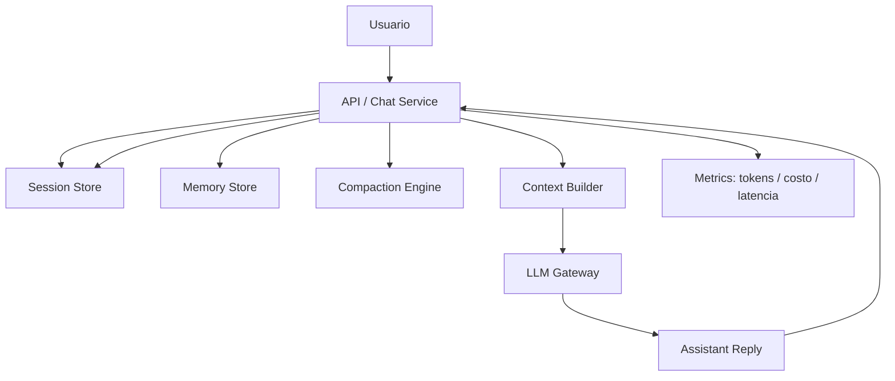

# Semana 03 — Prompt Caching, Conversation State, Memory y Compaction para Fintech

Perfecto. La **Semana 3** del plan está dedicada a **prompt caching, conversation state, memory y compaction**. El objetivo explícito es **manejar conversaciones largas, estado y costo**. La distribución formal es: lunes prompt caching, martes conversation state y persistencia, miércoles memoria corta vs larga, jueves compaction/summarization, viernes medir historial útil vs ruido y sábado mini proyecto **Stateful Chat v1**. El entregable esperado es un chat con **conversación persistente**, **historial por sesión**, **resumen del contexto viejo** y una **estrategia simple de compaction**; el checklist pide entender qué persistir, usar historial sin inflar el contexto, resumir contexto viejo de forma útil, reducir costo/latencia y tener el chat stateful funcionando.

Voy a enseñártela como la enseñaría a un ingeniero senior que quiere llevar esto a **producto fintech**.

---

# Semana 3 — Prompt Caching + Conversation State + Memory + Compaction

## La idea central

Hasta la Semana 2 hiciste dos cosas muy importantes:

1. aprendiste a **hablar bien con el modelo**,
2. aprendiste a **hacer que devuelva estructura útil para software**.

La Semana 3 agrega la tercera pata:

> cómo hacer que una app LLM **recuerde lo correcto**, **olvide lo incorrecto**, y **no se vuelva cara, lenta o caótica** a medida que la conversación crece.

Ese es el problema real.

Porque los modelos, por sí solos, no “viven” en el tiempo como un sistema de negocio.
Tu aplicación sí.

Entonces aparece una distinción clave:

- **el modelo es stateless por llamada**,
- **tu aplicación es stateful a lo largo de la sesión y, a veces, a lo largo de múltiples sesiones**.

Entender esa diferencia es el corazón de la Semana 3.

---

# 1. Qué problema resuelve esta semana

Imaginá este caso fintech.

Un cliente arranca con:

> “Me cobraron dos veces una compra.”

Después agrega:

> “Fue en Carrefour, ayer a la noche.”

Después:

> “Mi transacción era la txn_001.”

Después:

> “No sé si fue duplicado o fraude.”

Después:

> “Ya hablé con soporte y sigo igual.”

Si en cada turno mandás solo el último mensaje al modelo, perdés contexto.
Si mandás todo el historial completo para siempre, el sistema se vuelve:

- más caro,
- más lento,
- más ruidoso,
- más propenso a confundirse.

Entonces necesitás una disciplina intermedia:

- guardar estado,
- separar memoria útil de ruido,
- compactar,
- resumir,
- y construir contexto de forma inteligente.

---

# 2. El modelo mental correcto

Quiero que esta semana te quede grabada con estas 4 capas:

## Capa 1 — El modelo

No tiene memoria persistente propia entre llamadas, salvo el contexto que vos le mandás.

## Capa 2 — El estado conversacional

Es el estado operativo de la sesión actual:

- historial,
- resumen del caso,
- preguntas abiertas,
- último intent,
- último equipo sugerido,
- IDs de correlación,
- flags operativos.

## Capa 3 — La memoria útil

Es información que puede servir más allá de un turno:

- preferencia de idioma,
- producto afectado,
- tipo de problema recurrente,
- canal preferido,
- constraints del usuario.

## Capa 4 — La política de compaction

Es la lógica que decide:

- qué conservar literal,
- qué resumir,
- qué borrar,
- qué promover a memoria,
- qué jamás persistir.

Ese es el sistema real.

---

# 3. Qué es `conversation state`

`Conversation state` no es simplemente “guardar mensajes”.

Es el **estado mínimo necesario** para que una conversación siga teniendo continuidad.

## Incluye cosas como

- mensajes recientes,
- resumen acumulado,
- facts confirmados,
- dudas abiertas,
- intención actual,
- resultado de tools anteriores,
- caso o ticket en progreso,
- métricas de tokens/costo,
- timestamps.

## En fintech eso es importantísimo

Porque muchas conversaciones no son “pregunta-respuesta única”.
Son flujos:

- soporte de pagos,
- fraude,
- disputa,
- KYC,
- cobranza,
- préstamos,
- límite,
- transferencias demoradas.

Y esos flujos tienen continuidad.

---

# 4. Qué es persistencia

Persistencia es decidir qué parte del estado no vive solo en memoria RAM del proceso, sino que se guarda en algún storage.

## Niveles de persistencia

### Nivel A — por request

Solo existe dentro de una ejecución.
Sirve para lógica interna del turno.

### Nivel B — por sesión

Se guarda mientras la conversación siga abierta.
Ejemplo:

- historial de chat,
- summary de la sesión,
- intent actual.

### Nivel C — cross-session

Sobrevive entre sesiones.
Ejemplo:

- idioma preferido,
- tono preferido,
- producto habitual,
- ciertas preferencias operativas.

## Regla clave

No todo debe persistirse cross-session.

En fintech, ser agresivo guardando memoria puede salir caro en:

- privacidad,
- compliance,
- costo,
- confusión semántica.

---

# 5. Qué es `prompt caching`

Te lo explico bien y sin humo.

## Idea simple

En muchas apps, una parte grande del prompt es **estable**:

- rol del asistente,
- políticas,
- glosario,
- reglas,
- instrucciones,
- formato,
- disclaimers operativos.

Y otra parte es **dinámica**:

- mensaje actual del usuario,
- últimos turnos,
- resumen de sesión,
- memories relevantes.

`Prompt caching` es la idea de **aprovechar esa parte estable** para no recalcular o no re-enviar de forma ineficiente la misma carga contextual una y otra vez.

## Hay dos sentidos de caching

### A. Caching conceptual / arquitectónico

Separás “prefijo estático” de “sufijo dinámico”.
Esto ya ordena muchísimo la arquitectura.

### B. Caching técnico / de proveedor

Algunos proveedores pueden optimizar mejor prompts con prefijos estables y repetidos.

Aunque no dependas de una feature específica del proveedor, diseñar prompts con un **prefijo estático versionado** ya te deja mucho mejor parado.

## En limpio

Semana 3 no es “aprender una feature mágica”.
Es aprender esta disciplina:

> mantené estable lo estable y variable lo variable.

---

# 6. Cómo diseñar prompts cache-friendly

## Malo

Armar un prompt gigante distinto en cada turno mezclando:

- instrucciones,
- ejemplos,
- historial,
- memories,
- texto del usuario,
- resultados viejos.

## Mejor

Separar:

### Prefijo estático

- rol
- reglas
- guardrails
- taxonomía
- tono
- política operativa
- formato

### Contexto semiestático

- perfil liviano del usuario
- memoria relevante
- summary de sesión

### Contexto dinámico

- últimos N mensajes
- mensaje actual
- output de tools del turno

## Beneficios

- menos ruido,
- menor latencia,
- mejor consistencia,
- más facilidad de debug,
- más posibilidad de compaction ordenada.

---

# 7. Memoria corta vs memoria larga

Este punto de la semana es clave.

## Memoria corta

Es la memoria de trabajo de la sesión actual.

Ejemplos:

- últimos mensajes,
- summary del caso,
- transacción discutida,
- última tool usada,
- pregunta pendiente.

### Características

- alta relevancia inmediata,
- corta duración,
- alto recambio,
- no necesariamente se conserva al terminar la sesión.

## Memoria larga

Es información útil más estable entre sesiones.

Ejemplos:

- idioma preferido,
- producto principal del cliente,
- preferencia de respuestas cortas o técnicas,
- que suele consultar por tarjeta de crédito y no por inversión,
- cierto patrón operativo repetido.

### Características

- vida más larga,
- más filtrada,
- más estable,
- más gobernada,
- más delicada en fintech.

---

# 8. Qué NO es memoria

Esto te ahorra muchos errores.

## No es memoria útil

- saludos,
- “gracias”,
- frases redundantes,
- repeticiones del mismo problema,
- intentos fallidos de redacción,
- emociones pasajeras sin impacto,
- mensajes irrelevantes para el caso.

## Tampoco debería ser memoria persistente

- PAN completo,
- CVV,
- OTP,
- número completo de documento si no hace falta,
- datos sensibles no estrictamente necesarios,
- logs completos de tools sin política.

En fintech, la memoria debe ser **mínima, útil y gobernada**.

---

# 9. Qué conviene persistir en una app fintech

## Sí conviene persistir a nivel sesión

- `session_id`
- `user_id` o `customer_id` tokenizado
- resumen del caso
- intent actual
- estado del flujo
- últimos mensajes
- herramientas usadas
- preguntas abiertas
- estado de resolución

## Puede convenir persistir cross-session

- idioma preferido
- tono preferido
- canal preferido
- producto principal
- preferencia de explicación breve o detallada
- tipo de consultas habituales

## No conviene persistir por defecto

- conversaciones completas eternamente
- datos sensibles en bruto
- campos no normalizados
- inferencias débiles como si fueran verdad
- emociones temporales como “enojado” por meses
- decisiones no validadas

---

# 10. Qué es `compaction`

`Compaction` es la técnica de reducir el volumen del historial sin perder continuidad útil.

## Formas de compaction

### A. Truncation

Borrás mensajes viejos y te quedás con los últimos N.
Simple, barato, pero riesgoso.

### B. Summarization

Resumís lo viejo y conservás lo importante.

### C. Selective retention

Guardás literal solo algunas piezas:

- facts confirmados,
- IDs,
- decisiones,
- compromisos,
- restricciones.

### D. Hybrid compaction

Combinás:

- summary de lo viejo,
- últimos K mensajes literales,
- memories relevantes,
- facts pinneados.

Esta suele ser la mejor estrategia inicial.

---

# 11. Qué es un buen summary de compaction

Un resumen bueno **no reescribe la charla como novela**.

Tiene que quedar operativo.

## Buen formato de summary

- objetivo del caso,
- hechos confirmados,
- datos concretos,
- acciones ya hechas,
- resultados de tools,
- preguntas abiertas,
- riesgos o incertidumbres,
- próximo paso.

## Mal summary

- demasiado literario,
- demasiado largo,
- ambiguo,
- mezcla hechos con opiniones,
- pierde IDs y decisiones,
- no dice qué sigue pendiente.

---

# 12. Historial útil vs ruido

El viernes del plan pide exactamente esto: **medir historial útil vs ruido**.

Esta es una capacidad muy madura.

## Historial útil

- hechos confirmados
- constraints del usuario
- IDs
- montos
- moneda
- tools ya usadas
- respuestas ya dadas
- políticas aplicadas
- decisiones
- pendientes

## Ruido

- saludos
- disculpas repetidas
- reformulaciones redundantes
- mensajes de “ok”
- repeticiones del caso sin información nueva
- texto largo que no cambia la decisión

## Regla práctica

Tu sistema tiene que preguntarse constantemente:

> “¿Este fragmento mejora la calidad de la próxima respuesta o solo consume contexto?”

---

# 13. Reducción de costo y latencia

La Semana 3 también apunta a eso explícitamente.

El costo y la latencia suben por varias razones:

- prompts largos,
- historial irrelevante,
- summaries malos,
- demasiados mensajes duplicados,
- demasiadas memories inútiles,
- tools metidas dentro del contexto bruto.

## Cómo bajarlos

- prefijo estático limpio,
- ventana dinámica corta,
- summary estructurado,
- memories filtradas,
- eliminación de ruido,
- token budgeting,
- no enviar otra vez resultados viejos irrelevantes.

---

# 14. Arquitectura ideal de `Stateful Chat v1`

Este es el mini proyecto formal de la semana.



## Componentes

### Session Store

Guarda el estado de la sesión.

### Memory Store

Guarda memoria persistente filtrada.

### Compaction Engine

Resume y recorta.

### Context Builder

Arma el contexto final para el modelo.

### LLM Gateway

Conecta con tu runtime de semanas 1 y 2.

### Metrics

Mide tokens, costo y latencia.

---

# 15. Modelo de datos recomendado

## `SessionState`

Estado vivo de la sesión.

## `ChatMessage`

Mensaje individual.

## `MemoryRecord`

Memoria persistente.

## `CompactionSummary`

Resumen estructurado del pasado.

## `ContextEnvelope`

Lo que realmente le pasás al modelo.

---

# 16. Carpeta sugerida del proyecto

```text
week3-stateful-chat-fintech/
├─ README.md
├─ package.json
├─ tsconfig.json
├─ src/
│  ├─ types.ts
│  ├─ tokenBudget.ts
│  ├─ stores.ts
│  ├─ compactor.ts
│  ├─ memoryPolicy.ts
│  ├─ contextBuilder.ts
│  ├─ statefulChatService.ts
│  ├─ mockLLM.ts
│  └─ main.ts
```

---

# 17. Código completo — base técnica de la Semana 3

## 17.1 `package.json`

```json
{
  "name": "week3-stateful-chat-fintech",
  "version": "1.0.0",
  "private": true,
  "type": "module",
  "scripts": {
    "dev": "tsx src/main.ts"
  },
  "devDependencies": {
    "tsx": "^4.19.2",
    "typescript": "^5.8.3"
  }
}
```

## 17.2 `tsconfig.json`

```json
{
  "compilerOptions": {
    "target": "ES2022",
    "module": "NodeNext",
    "moduleResolution": "NodeNext",
    "strict": true,
    "skipLibCheck": true,
    "outDir": "dist"
  },
  "include": ["src/**/*.ts"]
}
```

## 17.3 `src/types.ts`

```ts
export type Role = "system" | "user" | "assistant";

export interface ChatMessage {
  id: string;
  role: Role;
  content: string;
  createdAt: string;
  tokensApprox: number;
}

export interface SessionSummary {
  caseGoal: string;
  confirmedFacts: string[];
  actionsTaken: string[];
  openQuestions: string[];
  latestRiskView?: string;
  compactedAt: string;
}

export interface SessionState {
  sessionId: string;
  userId: string;
  messages: ChatMessage[];
  summary?: SessionSummary;
  currentIntent?: string;
  openCaseId?: string;
  updatedAt: string;
}

export interface MemoryRecord {
  id: string;
  userId: string;
  key: string;
  value: string;
  scope: "preference" | "profile" | "operational";
  confidence: number;
  createdAt: string;
  ttlDays?: number;
}

export interface ContextEnvelope {
  staticPrefix: string;
  sessionSummary?: SessionSummary;
  relevantMemories: MemoryRecord[];
  recentMessages: ChatMessage[];
  currentUserInput: string;
}

export interface LLMGateway {
  reply(context: ContextEnvelope): Promise<string>;
}
```

## 17.4 `src/tokenBudget.ts`

```ts
export function approxTokens(text: string): number {
  return Math.ceil(text.length / 4);
}

export function totalTokens(texts: string[]): number {
  return texts.reduce((acc, text) => acc + approxTokens(text), 0);
}
```

## 17.5 `src/stores.ts`

```ts
import { MemoryRecord, SessionState } from "./types.js";

export class InMemorySessionStore {
  private sessions = new Map<string, SessionState>();

  get(sessionId: string): SessionState | undefined {
    return this.sessions.get(sessionId);
  }

  save(session: SessionState): void {
    this.sessions.set(session.sessionId, session);
  }
}

export class InMemoryMemoryStore {
  private memories = new Map<string, MemoryRecord[]>();

  listByUser(userId: string): MemoryRecord[] {
    return this.memories.get(userId) ?? [];
  }

  upsert(userId: string, memory: MemoryRecord): void {
    const current = this.memories.get(userId) ?? [];
    const withoutSameKey = current.filter((m) => m.key !== memory.key);
    withoutSameKey.push(memory);
    this.memories.set(userId, withoutSameKey);
  }
}
```

## 17.6 `src/memoryPolicy.ts`

```ts
import { randomUUID } from "node:crypto";
import { MemoryRecord } from "./types.js";

function nowIso() {
  return new Date().toISOString();
}

function containsSensitivePattern(text: string): boolean {
  const maybeCard = /\b\d{13,19}\b/.test(text);
  const maybeOtp = /\botp\b|\bcvv\b|\btoken\b/i.test(text);
  return maybeCard || maybeOtp;
}

export function extractStableMemories(userId: string, text: string): MemoryRecord[] {
  const memories: MemoryRecord[] = [];
  const lower = text.toLowerCase();

  if (containsSensitivePattern(text)) {
    return memories;
  }

  if (lower.includes("respondeme en español") || lower.includes("en español")) {
    memories.push({
      id: randomUUID(),
      userId,
      key: "preferred_language",
      value: "es",
      scope: "preference",
      confidence: 0.95,
      createdAt: nowIso(),
      ttlDays: 180
    });
  }

  if (lower.includes("tarjeta de crédito")) {
    memories.push({
      id: randomUUID(),
      userId,
      key: "primary_product",
      value: "credit_card",
      scope: "profile",
      confidence: 0.8,
      createdAt: nowIso(),
      ttlDays: 90
    });
  }

  if (lower.includes("cuenta sueldo")) {
    memories.push({
      id: randomUUID(),
      userId,
      key: "primary_product",
      value: "salary_account",
      scope: "profile",
      confidence: 0.8,
      createdAt: nowIso(),
      ttlDays: 90
    });
  }

  if (lower.includes("explicamelo corto") || lower.includes("explicá corto")) {
    memories.push({
      id: randomUUID(),
      userId,
      key: "response_style",
      value: "concise",
      scope: "preference",
      confidence: 0.8,
      createdAt: nowIso(),
      ttlDays: 120
    });
  }

  return memories;
}
```

## 17.7 `src/compactor.ts`

```ts
import { ChatMessage, SessionState, SessionSummary } from "./types.js";
import { totalTokens } from "./tokenBudget.js";

const MAX_CONTEXT_TOKENS = 1200;
const KEEP_LAST_MESSAGES = 6;

function summarizeMessages(messages: ChatMessage[]): SessionSummary {
  const joined = messages.map((m) => `${m.role}: ${m.content}`).join("\n");

  const confirmedFacts: string[] = [];
  const actionsTaken: string[] = [];
  const openQuestions: string[] = [];

  if (/carrefour/i.test(joined)) confirmedFacts.push("El comercio mencionado es Carrefour.");
  if (/ars\s?48\.?200|48200/i.test(joined)) confirmedFacts.push("El monto reportado es ARS 48.200.");
  if (/duplicado|dos consumos/i.test(joined)) confirmedFacts.push("El problema reportado sugiere posible cargo duplicado.");
  if (/fraude/i.test(joined)) openQuestions.push("Queda abierta la duda entre cargo duplicado y fraude.");
  if (/txn_/i.test(joined)) confirmedFacts.push("La conversación incluye un transaction_id.");
  if (/ya hablé con soporte/i.test(joined)) actionsTaken.push("El cliente ya habló con soporte previamente.");

  return {
    caseGoal: "Resolver el incidente transaccional del cliente con continuidad de contexto.",
    confirmedFacts,
    actionsTaken,
    openQuestions,
    latestRiskView: /fraude/i.test(joined) ? "Existe sospecha de fraude, no confirmada." : "Caso operativo de pagos, sin fraude confirmado.",
    compactedAt: new Date().toISOString()
  };
}

export function maybeCompact(session: SessionState): SessionState {
  const tokenCount = totalTokens(session.messages.map((m) => m.content));

  if (tokenCount <= MAX_CONTEXT_TOKENS || session.messages.length <= KEEP_LAST_MESSAGES) {
    return session;
  }

  const messagesToSummarize = session.messages.slice(0, -KEEP_LAST_MESSAGES);
  const recentMessages = session.messages.slice(-KEEP_LAST_MESSAGES);

  const summary = summarizeMessages(messagesToSummarize);

  return {
    ...session,
    summary,
    messages: recentMessages,
    updatedAt: new Date().toISOString()
  };
}
```

## 17.8 `src/contextBuilder.ts`

```ts
import { createHash } from "node:crypto";
import { ContextEnvelope, MemoryRecord, SessionState } from "./types.js";

export const STATIC_PREFIX = `
Sos un asistente fintech stateful orientado a soporte operacional.
Objetivos:
1. Mantener continuidad entre turnos.
2. No inventar resoluciones.
3. Diferenciar hecho confirmado vs hipótesis.
4. Usar el resumen de sesión como contexto operativo.
5. Priorizar claridad, seguridad y trazabilidad.
`.trim();

export function getStaticPrefixCacheKey(): string {
  return createHash("sha256").update(STATIC_PREFIX).digest("hex");
}

export function selectRelevantMemories(memories: MemoryRecord[]): MemoryRecord[] {
  return memories.slice(-5);
}

export function buildContext(
  session: SessionState,
  relevantMemories: MemoryRecord[],
  currentUserInput: string
): ContextEnvelope {
  return {
    staticPrefix: STATIC_PREFIX,
    sessionSummary: session.summary,
    relevantMemories,
    recentMessages: session.messages.slice(-6),
    currentUserInput
  };
}
```

## 17.9 `src/mockLLM.ts`

```ts
import { ContextEnvelope, LLMGateway } from "./types.js";

export class MockLLM implements LLMGateway {
  async reply(context: ContextEnvelope): Promise<string> {
    const input = context.currentUserInput.toLowerCase();

    const memoryHints = context.relevantMemories
      .map((m) => `${m.key}=${m.value}`)
      .join(", ");

    const summaryFacts =
      context.sessionSummary?.confirmedFacts.join(" ") ?? "";

    if (input.includes("duplicado") || input.includes("dos consumos")) {
      return [
        "Entiendo el caso como un posible cargo duplicado.",
        summaryFacts ? `Resumen previo útil: ${summaryFacts}` : "",
        memoryHints ? `Memorias relevantes: ${memoryHints}.` : "",
        "Próximo paso sugerido: validar estado de la transacción, distinguir duplicado vs retención temporal y confirmar datos faltantes."
      ]
        .filter(Boolean)
        .join(" ");
    }

    if (input.includes("fraude")) {
      return [
        "Tomo el caso con mayor criticidad porque aparece sospecha de fraude.",
        summaryFacts ? `Contexto acumulado: ${summaryFacts}` : "",
        "No confirmo fraude como hecho definitivo; lo trataría como sospecha hasta validación adicional."
      ]
        .filter(Boolean)
        .join(" ");
    }

    if (input.includes("deuda") || input.includes("mora")) {
      return [
        "Detecto una consulta de cobranzas o deuda.",
        memoryHints ? `Memorias relevantes: ${memoryHints}.` : "",
        "Próximo paso sugerido: confirmar estado actual, días de mora y alternativas vigentes sin prometer planes no confirmados."
      ]
        .filter(Boolean)
        .join(" ");
    }

    return "Entendido. Mantengo continuidad del caso y responderé usando resumen, memoria relevante y mensajes recientes.";
  }
}
```

## 17.10 `src/statefulChatService.ts`

```ts
import { randomUUID } from "node:crypto";
import { buildContext, selectRelevantMemories } from "./contextBuilder.js";
import { maybeCompact } from "./compactor.js";
import { extractStableMemories } from "./memoryPolicy.js";
import { approxTokens } from "./tokenBudget.js";
import { InMemoryMemoryStore, InMemorySessionStore } from "./stores.js";
import { ChatMessage, LLMGateway, SessionState } from "./types.js";

function nowIso() {
  return new Date().toISOString();
}

function createMessage(role: "user" | "assistant", content: string): ChatMessage {
  return {
    id: randomUUID(),
    role,
    content,
    createdAt: nowIso(),
    tokensApprox: approxTokens(content)
  };
}

export class StatefulChatService {
  constructor(
    private readonly sessionStore: InMemorySessionStore,
    private readonly memoryStore: InMemoryMemoryStore,
    private readonly llm: LLMGateway
  ) {}

  private getOrCreateSession(sessionId: string, userId: string): SessionState {
    const existing = this.sessionStore.get(sessionId);
    if (existing) return existing;

    const fresh: SessionState = {
      sessionId,
      userId,
      messages: [],
      updatedAt: nowIso()
    };

    this.sessionStore.save(fresh);
    return fresh;
  }

  async handleTurn(params: {
    sessionId: string;
    userId: string;
    userInput: string;
  }) {
    let session = this.getOrCreateSession(params.sessionId, params.userId);

    const userMessage = createMessage("user", params.userInput);
    session.messages.push(userMessage);
    session.updatedAt = nowIso();

    const extractedMemories = extractStableMemories(params.userId, params.userInput);
    for (const memory of extractedMemories) {
      this.memoryStore.upsert(params.userId, memory);
    }

    session = maybeCompact(session);

    const allMemories = this.memoryStore.listByUser(params.userId);
    const relevantMemories = selectRelevantMemories(allMemories);

    const context = buildContext(session, relevantMemories, params.userInput);
    const reply = await this.llm.reply(context);

    session.messages.push(createMessage("assistant", reply));
    session.updatedAt = nowIso();

    session = maybeCompact(session);
    this.sessionStore.save(session);

    return {
      reply,
      session,
      relevantMemoriesCount: relevantMemories.length
    };
  }
}
```

## 17.11 `src/main.ts`

```ts
import { getStaticPrefixCacheKey } from "./contextBuilder.js";
import { MockLLM } from "./mockLLM.js";
import { InMemoryMemoryStore, InMemorySessionStore } from "./stores.js";
import { StatefulChatService } from "./statefulChatService.js";

async function main() {
  const sessionStore = new InMemorySessionStore();
  const memoryStore = new InMemoryMemoryStore();
  const llm = new MockLLM();

  const chat = new StatefulChatService(sessionStore, memoryStore, llm);

  const sessionId = "sess_001";
  const userId = "cust_001";

  console.log("STATIC PREFIX CACHE KEY:", getStaticPrefixCacheKey());

  const turn1 = await chat.handleTurn({
    sessionId,
    userId,
    userInput:
      "Respondeme en español. Ayer a las 21:13 intenté pagar en Carrefour y ahora veo dos consumos de ARS 48.200."
  });
  console.log("\nTURN 1\n", turn1.reply);

  const turn2 = await chat.handleTurn({
    sessionId,
    userId,
    userInput:
      "No sé si fue duplicado o fraude. Ya hablé con soporte y sigo igual."
  });
  console.log("\nTURN 2\n", turn2.reply);

  const turn3 = await chat.handleTurn({
    sessionId,
    userId,
    userInput:
      "Explicamelo corto y decime cuál sería el próximo paso."
  });
  console.log("\nTURN 3\n", turn3.reply);

  console.log("\nSESSION SUMMARY\n", turn3.session.summary);
  console.log("\nPERSISTED MEMORIES\n", memoryStore.listByUser(userId));
}

main().catch(console.error);
```

---

# 18. Qué enseña este código

Este código, aunque simple, ya tiene los pilares correctos.

## Enseña prompt caching

Porque separa un `STATIC_PREFIX` estable, versionable y cache-friendly.

## Enseña state

Porque guarda `SessionState` por `sessionId`.

## Enseña memoria

Porque extrae solo algunos facts estables y los guarda por `userId`.

## Enseña compaction

Porque resume el pasado cuando el historial crece demasiado.

## Enseña contexto útil

Porque el modelo recibe:

- prefijo estable,
- summary,
- memories relevantes,
- mensajes recientes,
- input actual.

Ese patrón es exactamente el corazón de **Stateful Chat v1**.

---

# 19. Qué mejorarías en producción

Esta parte es muy importante para tu nivel.

## A. Session store real

En vez de memoria RAM:

- Redis
- DynamoDB
- Postgres

## B. Memory store real

Con TTL, versionado y gobernanza.

## C. Summary mejor

En vez de heurísticas, usar un summarizer LLM con schema estructurado.

## D. Relevance real

En vez de `slice(-5)`, usar scoring:

- por recencia,
- por tipo,
- por intent actual,
- por similitud.

## E. Métricas

Guardar:

- tokens por turno,
- mensajes compactados,
- tamaño de summary,
- cantidad de memories usadas,
- latencia.

## F. Políticas fintech

Bloquear persistencia de:

- PAN,
- CVV,
- OTP,
- datos innecesarios.

---

# 20. Estrategia de compaction recomendable en fintech

Yo arrancaría con esta fórmula:

## Keep verbatim

- últimos 4 a 8 mensajes

## Keep structured summary

- facts confirmados
- acciones hechas
- open questions
- risk view
- next step

## Keep memory

- idioma
- tono
- producto
- preferencias

## Drop

- saludos
- repeticiones
- ruido

Es simple, estable y muy explicable.

---

# 21. Ejercicios prácticos — lunes a sábado

Ahora vamos con la parte que realmente te hace aprender.

## Lunes — Prompt caching y cuándo sirve

Objetivo formal del plan: entender prompt caching y cuándo conviene.

### Ejercicio 1

Tomá este prompt malo:

```txt
Sos un analista fintech. Política de pagos... [texto largo]
Historial completo...
Mensaje actual...
```

Separalo en:

- `STATIC_PREFIX`
- `SESSION_SUMMARY`
- `RELEVANT_MEMORIES`
- `RECENT_MESSAGES`
- `CURRENT_USER_INPUT`

### Qué tenés que aprender

Que la estabilidad del prefijo importa más que “copiar y pegar todo”.

### Ejercicio 2

Calculá tokens aproximados de:

- prompt completo sin compaction,
- prompt con prefijo estático + summary.

Usá `approxTokens()`.

### Resultado esperado

Ver una reducción clara del tamaño dinámico.

---

## Martes — Conversation state y persistencia

Objetivo formal del plan: state y persistencia.

### Ejercicio 3

Implementá una conversación de 3 turnos usando `sessionId` fijo.

Caso:

1. “Me cobraron dos veces.”
2. “Fue en Carrefour.”
3. “Ya hablé con soporte.”

### Qué tenés que verificar

Que el tercer turno siga entendiendo todo el caso, no solo el último mensaje.

### Aprendizaje

El estado no es el modelo; lo administra tu app.

---

## Miércoles — Memoria corta vs larga

Objetivo formal del plan: distinguir memoria corta y larga.

### Ejercicio 4

Del siguiente conjunto decidí qué va a sesión y qué va a memoria larga:

1. “Respondeme en español.”
2. “Mi tarjeta terminó en 4921.”
3. “Prefiero respuestas cortas.”
4. “Hoy estoy muy enojado.”
5. “Siempre consulto por tarjeta de crédito.”

### Solución esperada

- sesión: estado emocional, contexto puntual, últimos 4 dígitos solo si política lo permite y preferentemente tokenizados o no persistidos
- memoria larga: idioma, estilo de respuesta, producto principal
- no persistir sin gobernanza: datos sensibles

### Aprendizaje

Persistir menos suele ser mejor.

---

## Jueves — Compaction y summarization

Objetivo formal del plan: estrategia de compaction/summarization.

### Ejercicio 5

Simulá 20 mensajes de una conversación larga y aplicá `maybeCompact()`.

### Qué tenés que mirar

- cuántos mensajes quedan verbatim,
- qué entra en summary,
- si el summary preserva:
  - facts,
  - acciones,
  - dudas,
  - riesgo.

### Ejercicio 6

Reescribí `summarizeMessages()` para que use este formato:

```ts
{
  caseGoal: string,
  confirmedFacts: string[],
  actionsTaken: string[],
  openQuestions: string[],
  nextStep: string
}
```

### Aprendizaje

El summary tiene que ser operativo, no literario.

---

## Viernes — Medir historial útil vs ruido

Objetivo formal del plan: medir historial útil vs ruido.

### Ejercicio 7

Tomá esta conversación:

1. “Hola”
2. “Me cobraron dos veces”
3. “Gracias”
4. “Fue en Carrefour”
5. “Perdón, quise decir ayer”
6. “ARS 48.200”
7. “Ok”
8. “Ya hablé con soporte”

Marcá cada línea como:

- útil
- ruido
- contextual débil
- crítica

### Solución razonable

- útiles/críticas: 2, 4, 5, 6, 8
- ruido: 1, 3, 7

### Ejercicio 8

Calculá ahorro aproximado de tokens al eliminar ruido antes de construir contexto.

### Aprendizaje

No todo lo dicho merece ir al modelo.

---

## Sábado — Mini proyecto `Stateful Chat v1`

El plan cierra con este proyecto.

### Objetivo

Construir un chat que tenga:

- conversación persistente,
- historial por sesión,
- summary del contexto viejo,
- compaction simple.

### Alcance mínimo

- `SessionStore`
- `MemoryStore`
- `Compactor`
- `ContextBuilder`
- `StatefulChatService`

### Caso integrador

Usá 3 dominios:

1. cargo duplicado
2. fraude
3. consulta de deuda

### Qué tenés que comprobar

- que el sistema no pierde continuidad,
- que no infla contexto innecesariamente,
- que reduce costo de contexto a medida que crece el historial,
- que usa memories relevantes y no basura.

---

# 22. Casos fintech completos para practicar

## Caso A — Cargo duplicado

### Turno 1

“Me cobraron dos veces una compra.”

### Turno 2

“Fue ayer en Carrefour por ARS 48.200.”

### Turno 3

“No sé si es duplicado o fraude.”

### Turno 4

“Ya hablé con soporte y sigo igual.”

### Lo que el sistema debería mantener

- comercio,
- monto,
- hipótesis abierta,
- acción previa tomada.

---

## Caso B — Fraude

### Turno 1

“No reconozco una compra internacional.”

### Turno 2

“Fue por USD 420.”

### Turno 3

“Recibí un SMS que no aprobé.”

### Turno 4

“Necesito que me expliques el próximo paso.”

### Lo que el sistema debería mantener

- sospecha de fraude,
- monto,
- señal de SMS no aprobado,
- criticidad alta,
- que todavía no es fraude confirmado.

---

## Caso C — Mora / cobranza

### Turno 1

“Tengo una deuda y no entiendo el estado.”

### Turno 2

“Quiero una explicación corta.”

### Turno 3

“No me prometas planes que no existan.”

### Lo que el sistema debería mantener

- dominio cobranza,
- estilo de respuesta,
- restricción operativa.

---

# 23. Cómo evaluar si aprendiste de verdad

El plan propone medir si:

- entendés el concepto,
- podés implementarlo de cero,
- podés explicarlo en lenguaje de arquitectura,
- sabés cuándo usarlo y cuándo no,
- dejaste un entregable funcionando,
- documentaste trade-offs.

Yo lo traduciría a estas preguntas concretas:

## 1

¿Podés explicar la diferencia entre:

- estado de sesión,
- memoria,
- historial,
- summary?

## 2

¿Podés justificar por qué no conviene mandar todo el historial siempre?

## 3

¿Podés mostrar una política clara de qué persistir y qué no?

## 4

¿Podés compactar sin romper continuidad?

## 5

¿Podés reducir tokens sin degradar demasiado la calidad?

Si la respuesta es sí, la semana está incorporada.

---

# 24. Errores clásicos de esta semana

## Error 1

Confundir historial completo con memoria.

## Error 2

Persistir todo porque “por las dudas sirve”.

## Error 3

Hacer summaries narrativos y no operativos.

## Error 4

Guardar datos sensibles que no necesitás.

## Error 5

No separar prefijo estático de contexto dinámico.

## Error 6

No medir tokens ni ruido.

## Error 7

Usar memoria larga para cosas inestables.

---

# 25. Cómo conecta esta semana con las siguientes

Esta semana es puente.

## Conecta hacia atrás

- usa el runtime de la Semana 1,
- puede usar outputs estructurados de la Semana 2 para summaries y memories.

## Conecta hacia adelante

- Semana 4: retrieval
- Semana 5: RAG
- Semana 6: LangGraph
- Semana 8: evaluación
- Semana 9: observabilidad

Porque una app AI real no es solo un modelo: es un sistema con estado, contexto, memoria, retrieval, tools y evaluación. Eso está muy alineado con el núcleo del plan, donde state/memory aparece como parte del bloque central de IA moderna.

---

# 26. Resumen maestro de la Semana 3

Quiero que te quede así de claro:

> Semana 3 no se trata de “hacer que el chat recuerde todo”.
> Se trata de hacer que el sistema recuerde **lo correcto**, en **el lugar correcto**, durante **el tiempo correcto**, con **el costo correcto**.

La disciplina correcta es:

1. separar estado de sesión y memoria larga,
2. mantener un prefijo estable,
3. compactar el pasado,
4. conservar facts críticos,
5. eliminar ruido,
6. medir tokens y continuidad,
7. persistir con política, no por impulso.

Ese es el corazón de un **Stateful Chat v1**.

En el próximo paso te lo convierto en **repo GitHub + ZIP completo de la Semana 3**, con README, código, diagramas y estructura lista para subir.