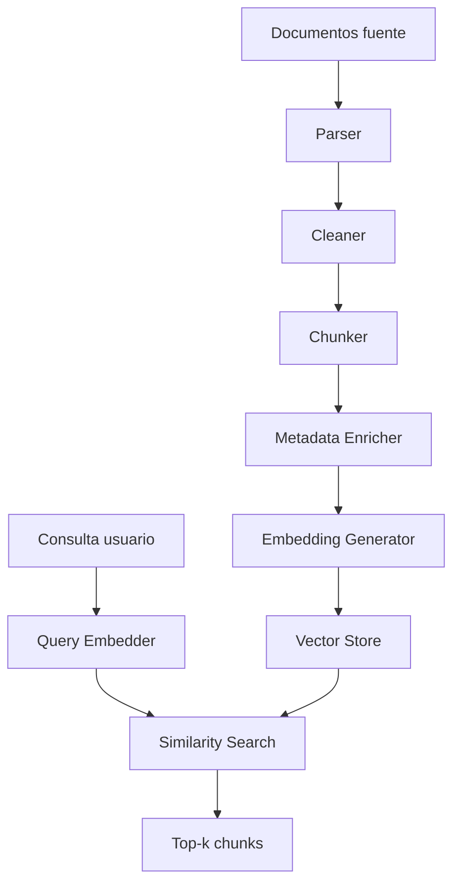

# Semana 04 — Embeddings, Chunking, Ingestion y Vector Search para Fintech

Perfecto. Vamos con la **Semana 4 completa**, bien enseñada y aterrizada a **software real para fintech**.

Según tu plan, la **Semana 4** es: **Embeddings / chunking / ingestion / vector search**.
El objetivo formal es **“construir la base de retrieval”**. La semana se distribuye en:

- **Lunes:** embeddings y similitud
- **Martes:** chunking y overlap
- **Miércoles:** metadata y diseño de corpus
- **Jueves:** pipeline de ingestión
- **Viernes:** búsqueda vectorial inicial
- **Sábado:** mini proyecto **“Retriever v1”**

Y el entregable esperado es:

- parser simple de documentos
- chunker configurable
- embeddings generados
- top-k vector search

con el checklist de salida:

- entender cómo afecta el chunk size
- diseñar metadata útil
- tener pipeline de ingestión inicial
- saber hacer búsqueda vectorial básica
- poder explicar por qué un retrieval falla.

---

# Semana 4 — Embeddings + Chunking + Ingestion + Vector Search

## La idea central

Hasta ahora venías construyendo:

- **Semana 1:** runtime LLM
- **Semana 2:** outputs estructurados y tools
- **Semana 3:** estado, memoria y compaction

La **Semana 4** agrega una capacidad fundamental:

> que tu sistema pueda **buscar información relevante** en un corpus propio y no depender solo del contexto escrito a mano.

Ese es el nacimiento real del **retrieval**.

En otras palabras:

- antes, el modelo respondía con lo que le mandabas en el prompt,
- ahora, tu sistema puede **encontrar contexto relevante** desde documentos, políticas, FAQs, manuales, KBs, catálogos, tickets históricos o bases operativas.

Eso es enorme para fintech.

Porque una fintech vive llena de información dispersa:

- políticas de chargeback,
- reglas operativas,
- documentación de fraude,
- procedimientos KYC,
- estados de productos,
- FAQs internas,
- contratos,
- manuales de atención,
- catálogos de eventos,
- normas regulatorias internas.

Y el modelo solo sirve bien si le das el **contexto correcto**.

---

# 1. Qué problema resuelve esta semana

Imaginá este caso:

Un cliente dice:

> “Me cobraron dos veces una compra, no sé si es duplicado, retención temporal o fraude. Ya hablé con soporte.”

El modelo puede hablar lindo, sí.
Pero para responder bien de verdad, quizás necesita saber:

- cuál es la política vigente de cargos duplicados,
- cómo se distingue una retención de una duplicación real,
- qué canal aplica según producto,
- qué pasos puede prometer y cuáles no.

Esa información no está “en el modelo”.
Está en tus documentos.

Entonces aparece retrieval:

1. indexás documentos,
2. transformás contenido en vectores,
3. buscás fragmentos parecidos a la consulta,
4. traés el top-k,
5. y después se lo pasás al modelo.

La Semana 4 construye exactamente esa base.

---

# 2. Qué es retrieval

**Retrieval** es el proceso de recuperar información relevante desde un corpus para enriquecer una respuesta.

No es todavía “RAG completo”.
Eso viene en la Semana 5.

Acá el foco es la base:

- representar texto como vectores,
- dividir documentos en chunks,
- guardar metadata,
- indexar,
- buscar por similitud.

---

# 3. Qué es un embedding

Un **embedding** es una representación numérica de un texto en un espacio vectorial.

En simple:

> transformás texto en una lista de números que captura significado semántico.

Ejemplo conceptual:

- “cargo duplicado”
- “me cobraron dos veces”
- “doble débito”

Aunque no sean idénticos lexicalmente, deberían quedar **cerca** en el espacio vectorial.

## Intuición

El embedding busca que textos con significado parecido tengan vectores parecidos.

---

# 4. Qué significa “similitud”

Una vez que tenés embeddings, podés medir qué tan “cerca” está una consulta de un chunk indexado.

Las métricas más usadas:

- **cosine similarity**
- **dot product**
- **euclidean distance**

La más común para empezar es **cosine similarity**.

## Intuición de cosine similarity

No compara tanto el tamaño del vector, sino la dirección.

Entonces si dos vectores apuntan parecido, el texto se considera semánticamente similar.

---

# 5. Por qué embeddings son tan importantes

Porque permiten buscar por **significado**, no solo por coincidencia exacta de palabras.

## Búsqueda keyword tradicional

Consulta:

> “doble cobro”

Documento:

> “cargo duplicado”

Puede no matchear bien si no comparte tokens exactos.

## Búsqueda semántica

Ambos conceptos deberían quedar cerca en embedding space.

Eso es clave en fintech porque los usuarios escriben:

- con errores,
- con términos coloquiales,
- con nombres incompletos,
- con ambigüedad,
- con variaciones regionales.

---

# 6. Qué NO hacen mágicamente los embeddings

Importante:

Los embeddings **no garantizan verdad** ni relevancia perfecta.

Pueden fallar si:

- el chunk es malo,
- el corpus está mal diseñado,
- la metadata es pobre,
- mezclaste documentos incompatibles,
- el embedding model no capta bien el dominio,
- la consulta es demasiado ambigua.

Entonces:

> embeddings mejoran la búsqueda semántica, pero no reemplazan buen diseño de corpus.

---

# 7. Qué es chunking

**Chunking** es dividir documentos largos en fragmentos más chicos llamados **chunks**.

Esto se hace porque:

- no querés indexar un documento entero gigantesco como una sola unidad,
- una consulta suele necesitar solo una parte,
- los embeddings funcionan mejor sobre unidades razonables de significado,
- el modelo después consume mejor contexto pequeño y relevante.

---

# 8. Qué es un buen chunk

Un buen chunk debería ser:

- semánticamente coherente,
- suficientemente chico para ser preciso,
- suficientemente grande para no perder contexto,
- fácilmente trazable al documento origen.

Ejemplo malo:

- cortar en medio de una regla,
- mezclar dos temas distintos,
- fragmentar tanto que se pierde sentido.

Ejemplo bueno:

- una política completa corta,
- una sección operativa,
- una respuesta FAQ,
- un procedimiento puntual,
- una cláusula útil con encabezado.

---

# 9. Chunk size: uno de los parámetros más importantes

Tu plan lo pone en el checklist: entender cómo afecta el **chunk size**.

## Chunk muy chico

Ventajas:

- alta precisión
- fragmentos más específicos

Problemas:

- pierde contexto
- puede quedar demasiado “telegráfico”
- baja recall semántica

## Chunk muy grande

Ventajas:

- conserva más contexto
- puede capturar mejor una política completa

Problemas:

- mete ruido
- empeora precisión
- puede traer mucho texto irrelevante
- encarece lo que luego mandás al LLM

## Regla práctica

No existe un tamaño único perfecto.
Depende del corpus.

En fintech suele funcionar bien empezar con chunks que respeten **unidades lógicas**:

- párrafos largos agrupados,
- subsecciones,
- FAQ individual,
- política puntual,
- procedimiento de 1 tema.

---

# 10. Qué es overlap

**Overlap** es repetir una parte del texto entre chunks contiguos.

Ejemplo:

- chunk 1: líneas 1–10
- chunk 2: líneas 8–17

Las líneas 8–10 son overlap.

## Para qué sirve

Evita perder información que cae justo en el borde del corte.

## Problema si es excesivo

- duplicás información,
- agrandás índice,
- traés demasiados chunks parecidos,
- subís costo.

## Regla práctica

Overlap moderado ayuda.
Overlap excesivo ensucia.

---

# 11. Chunking strategies

## A. Fixed-size chunking

Cortás cada N caracteres o tokens.

Ventaja:

- simple

Problema:

- puede cortar feo semánticamente

## B. Paragraph-based chunking

Usás párrafos como base.

Ventaja:

- más natural

Problema:

- algunos párrafos son muy chicos o muy grandes

## C. Section-aware chunking

Respetás títulos, subtítulos, FAQs, bullets, cláusulas.

Ventaja:

- muy bueno para documentos operativos

## D. Hybrid chunking

Primero por estructura, luego ajustás tamaño.

Este suele ser el mejor enfoque serio.

---

# 12. Metadata: el gran diferenciador de un buen retriever

Tu plan lo marca explícitamente: **metadata y diseño de corpus**.

La metadata no es decorativa.
Es lo que permite que retrieval sea trazable, filtrable y explicable.

## Metadata útil en fintech

- `document_id`
- `source_type`
- `document_title`
- `section_title`
- `product`
- `country`
- `domain`
- `topic`
- `version`
- `effective_date`
- `language`
- `sensitivity`
- `chunk_index`

## Ejemplo

Un chunk puede venir de:

- documento: “Política de cargos duplicados”
- dominio: `payments`
- país: `AR`
- producto: `credit_card`
- vigencia: `2026-03-01`

Eso te permite filtrar y evitar mezclar contextos que no corresponden.

---

# 13. Qué es diseño de corpus

Tu corpus es el conjunto de documentos que vas a indexar.

Un error enorme es pensar que “corpus” es simplemente una carpeta de PDFs.

No.

Un buen corpus está:

- curado,
- normalizado,
- etiquetado,
- deduplicado,
- particionado,
- gobernado.

## Preguntas clave

- ¿Qué documentos entran?
- ¿Qué documentos no entran?
- ¿Cuál es la versión vigente?
- ¿Qué idioma?
- ¿Qué región?
- ¿Qué producto?
- ¿Qué sensibilidad?
- ¿Qué fuente tiene autoridad?

---

# 14. Errores típicos de corpus

## Error 1

Meter documentos viejos y nuevos juntos sin versionado.

## Error 2

Mezclar políticas de distintos países.

## Error 3

No distinguir fuente oficial vs borrador.

## Error 4

Indexar tablas o logs crudos sin limpieza.

## Error 5

No deduplicar contenido repetido.

## Error 6

No guardar la trazabilidad del origen.

---

# 15. Qué es ingestion

**Ingestion** es el pipeline que toma documentos y los transforma en un índice consultable.

Pasos típicos:

1. leer documento
2. parsearlo
3. limpiarlo
4. dividirlo en chunks
5. generar metadata
6. calcular embeddings
7. guardar chunks + metadata + vector en un store

Eso es exactamente el “pipeline de ingestión” que el plan pide para el jueves.

---

# 16. Etapas reales del pipeline de ingestión

## 1. Parsing

Leer archivo:

- txt
- md
- html
- docx
- pdf

## 2. Cleaning

Eliminar:

- headers repetidos,
- footers,
- saltos raros,
- basura de OCR,
- espacios innecesarios.

## 3. Structuring

Detectar:

- títulos,
- subtítulos,
- secciones,
- FAQs,
- listas.

## 4. Chunking

Aplicar estrategia de corte.

## 5. Metadata enrichment

Agregar metadatos del documento y del chunk.

## 6. Embedding generation

Transformar chunk a vector.

## 7. Indexing

Guardar en vector store.

---

# 17. Qué es vector search

**Vector search** es buscar los chunks cuyo embedding está más cerca del embedding de la consulta.

Flujo:

1. el usuario hace una query
2. generás embedding de la query
3. comparás contra embeddings indexados
4. ordenás por similitud
5. devolvés top-k

Eso es exactamente la “búsqueda vectorial inicial” del viernes y el top-k vector search del entregable.

---

# 18. Qué es top-k

`top-k` significa devolver los `k` resultados más similares.

Ejemplo:

- `top-3`
- `top-5`
- `top-10`

## Problema de k bajo

Podés perder recall.

## Problema de k alto

Metés ruido.

## Regla práctica

Para empezar:

- `top-3` o `top-5` está muy bien.

---

# 19. Cómo falla un retrieval

El plan quiere que puedas explicar **por qué falla un retrieval**.

Las razones típicas son:

## A. Chunking malo

La información quedó partida o mezclada.

## B. Corpus malo

Documento irrelevante, viejo o inconsistente.

## C. Metadata mala

No filtraste por producto/país/dominio.

## D. Query mala

Muy corta, ambigua o fuera de dominio.

## E. Embedding mismatch

El modelo de embeddings no representa bien ese dominio.

## F. Top-k mal elegido

Trajiste demasiado poco o demasiado ruido.

## G. Falta de reranking

Esto aparece más en Semana 5.

---

# 20. Arquitectura mental de la Semana 4



---

# 21. Diseño fintech recomendado para Semana 4

Para aprender bien, yo no arrancaría con un corpus enorme.

Arrancaría con 3 dominios simples:

## Dominio 1 — Pagos

- cargos duplicados
- retenciones temporales
- transferencias no acreditadas

## Dominio 2 — Fraude

- consumo no reconocido
- account takeover sospechado
- señales operativas

## Dominio 3 — KYC / soporte

- validación pendiente
- documentación observada
- demoras de revisión

Con eso ya tenés variedad semántica real.

---

# 22. Mini proyecto de la semana: `Retriever v1`

Tu plan pide un **Retriever v1** con:

- parser simple
- chunker configurable
- embeddings generados
- top-k vector search.

Yo te recomiendo este diseño:

```text
week4-retriever-fintech/
├─ README.md
├─ package.json
├─ tsconfig.json
├─ src/
│  ├─ types.ts
│  ├─ parser.ts
│  ├─ chunker.ts
│  ├─ embedder.ts
│  ├─ vectorStore.ts
│  ├─ retriever.ts
│  ├─ sampleDocs.ts
│  └─ main.ts
```

---

# 23. Código completo — base técnica de la Semana 4

La idea es dejarte una versión **runnable sin credenciales**, usando un embedder local determinístico para aprender arquitectura. Después lo cambiás por OpenAI, Bedrock u otro proveedor.

## 23.1 `package.json`

```json
{
  "name": "week4-retriever-fintech",
  "version": "1.0.0",
  "private": true,
  "type": "module",
  "scripts": {
    "dev": "tsx src/main.ts"
  },
  "devDependencies": {
    "tsx": "^4.19.2",
    "typescript": "^5.8.3"
  }
}
```

## 23.2 `tsconfig.json`

```json
{
  "compilerOptions": {
    "target": "ES2022",
    "module": "NodeNext",
    "moduleResolution": "NodeNext",
    "strict": true,
    "skipLibCheck": true,
    "outDir": "dist"
  },
  "include": ["src/**/*.ts"]
}
```

## 23.3 `src/types.ts`

```ts
export interface SourceDocument {
  id: string;
  title: string;
  content: string;
  domain: "payments" | "fraud" | "kyc";
  product: "credit_card" | "wallet" | "account";
  country: "AR" | "MX" | "BR";
  version: string;
}

export interface ChunkMetadata {
  documentId: string;
  documentTitle: string;
  domain: SourceDocument["domain"];
  product: SourceDocument["product"];
  country: SourceDocument["country"];
  version: string;
  chunkIndex: number;
  startChar: number;
  endChar: number;
}

export interface ChunkRecord {
  id: string;
  text: string;
  metadata: ChunkMetadata;
  embedding: number[];
}

export interface SearchResult {
  chunkId: string;
  score: number;
  text: string;
  metadata: ChunkMetadata;
}
```

## 23.4 `src/parser.ts`

```ts
import { SourceDocument } from "./types.js";

export class SimpleParser {
  parse(doc: SourceDocument): string {
    return doc.content
      .replace(/\r/g, "")
      .replace(/[ \t]+/g, " ")
      .replace(/\n{3,}/g, "\n\n")
      .trim();
  }
}
```

## 23.5 `src/chunker.ts`

```ts
export interface ChunkingConfig {
  chunkSize: number;
  overlap: number;
}

export interface RawChunk {
  text: string;
  startChar: number;
  endChar: number;
  index: number;
}

export class CharacterChunker {
  constructor(private readonly config: ChunkingConfig) {
    if (config.overlap >= config.chunkSize) {
      throw new Error("overlap debe ser menor que chunkSize");
    }
  }

  split(text: string): RawChunk[] {
    const chunks: RawChunk[] = [];
    let start = 0;
    let index = 0;

    while (start < text.length) {
      const end = Math.min(start + this.config.chunkSize, text.length);
      const chunkText = text.slice(start, end).trim();

      if (chunkText.length > 0) {
        chunks.push({
          text: chunkText,
          startChar: start,
          endChar: end,
          index
        });
        index += 1;
      }

      if (end === text.length) break;
      start = end - this.config.overlap;
    }

    return chunks;
  }
}
```

## 23.6 `src/embedder.ts`

```ts
export interface Embedder {
  embed(text: string): Promise<number[]>;
}

function tokenize(text: string): string[] {
  return text
    .toLowerCase()
    .replace(/[^a-z0-9áéíóúñü\s]/gi, " ")
    .split(/\s+/)
    .filter(Boolean);
}

export class LocalHashEmbedder implements Embedder {
  constructor(private readonly dimensions = 128) {}

  async embed(text: string): Promise<number[]> {
    const vec = new Array(this.dimensions).fill(0);
    const tokens = tokenize(text);

    for (const token of tokens) {
      let hash = 0;
      for (let i = 0; i < token.length; i++) {
        hash = (hash * 31 + token.charCodeAt(i)) >>> 0;
      }
      const idx = hash % this.dimensions;
      vec[idx] += 1;
    }

    const norm = Math.sqrt(vec.reduce((acc, v) => acc + v * v, 0)) || 1;
    return vec.map((v) => v / norm);
  }
}
```

## 23.7 `src/vectorStore.ts`

```ts
import { ChunkRecord, SearchResult } from "./types.js";

function cosineSimilarity(a: number[], b: number[]): number {
  let dot = 0;
  let normA = 0;
  let normB = 0;

  for (let i = 0; i < a.length; i++) {
    dot += a[i] * b[i];
    normA += a[i] * a[i];
    normB += b[i] * b[i];
  }

  const denom = Math.sqrt(normA) * Math.sqrt(normB) || 1;
  return dot / denom;
}

export class InMemoryVectorStore {
  private records: ChunkRecord[] = [];

  add(record: ChunkRecord): void {
    this.records.push(record);
  }

  search(queryEmbedding: number[], topK = 3): SearchResult[] {
    return this.records
      .map((record) => ({
        chunkId: record.id,
        score: cosineSimilarity(queryEmbedding, record.embedding),
        text: record.text,
        metadata: record.metadata
      }))
      .sort((a, b) => b.score - a.score)
      .slice(0, topK);
  }

  size(): number {
    return this.records.length;
  }
}
```

## 23.8 `src/retriever.ts`

```ts
import { randomUUID } from "node:crypto";
import { CharacterChunker } from "./chunker.js";
import { Embedder } from "./embedder.js";
import { SimpleParser } from "./parser.js";
import { SourceDocument } from "./types.js";
import { InMemoryVectorStore } from "./vectorStore.js";

export class RetrieverIngestionService {
  constructor(
    private readonly parser: SimpleParser,
    private readonly chunker: CharacterChunker,
    private readonly embedder: Embedder,
    private readonly store: InMemoryVectorStore
  ) {}

  async ingestDocument(doc: SourceDocument): Promise<void> {
    const parsed = this.parser.parse(doc);
    const chunks = this.chunker.split(parsed);

    for (const chunk of chunks) {
      const embedding = await this.embedder.embed(chunk.text);

      this.store.add({
        id: randomUUID(),
        text: chunk.text,
        embedding,
        metadata: {
          documentId: doc.id,
          documentTitle: doc.title,
          domain: doc.domain,
          product: doc.product,
          country: doc.country,
          version: doc.version,
          chunkIndex: chunk.index,
          startChar: chunk.startChar,
          endChar: chunk.endChar
        }
      });
    }
  }
}

export class RetrieverQueryService {
  constructor(
    private readonly embedder: Embedder,
    private readonly store: InMemoryVectorStore
  ) {}

  async search(query: string, topK = 3) {
    const queryEmbedding = await this.embedder.embed(query);
    return this.store.search(queryEmbedding, topK);
  }
}
```

## 23.9 `src/sampleDocs.ts`

```ts
import { SourceDocument } from "./types.js";

export const sampleDocs: SourceDocument[] = [
  {
    id: "doc_payments_001",
    title: "Política de cargos duplicados",
    domain: "payments",
    product: "credit_card",
    country: "AR",
    version: "2026-04",
    content: `
Un cargo duplicado ocurre cuando el cliente visualiza dos consumos por una misma operación.
Debe distinguirse de una retención temporal o doble autorización.
No debe prometerse reintegro automático sin validación del estado de la transacción y del comercio.
El siguiente paso operativo es revisar el estado de la autorización y orientar el reclamo según canal vigente.
`
  },
  {
    id: "doc_fraud_001",
    title: "Guía de consumo no reconocido",
    domain: "fraud",
    product: "credit_card",
    country: "AR",
    version: "2026-04",
    content: `
Un consumo no reconocido debe tratarse como sospecha de fraude hasta validación adicional.
Se consideran señales relevantes: compra internacional inesperada, SMS no aprobado, cambio de dispositivo y patrón atípico.
No debe afirmarse fraude confirmado sin controles adicionales.
`
  },
  {
    id: "doc_kyc_001",
    title: "Estados KYC y documentación observada",
    domain: "kyc",
    product: "account",
    country: "AR",
    version: "2026-04",
    content: `
Una cuenta puede quedar en revisión por documentación vencida, imagen ilegible o inconsistencia de datos.
El mensaje al cliente debe explicar el motivo general sin exponer lógica antifraude interna.
`
  }
];
```

## 23.10 `src/main.ts`

```ts
import { CharacterChunker } from "./chunker.js";
import { LocalHashEmbedder } from "./embedder.js";
import { SimpleParser } from "./parser.js";
import { RetrieverIngestionService, RetrieverQueryService } from "./retriever.js";
import { sampleDocs } from "./sampleDocs.js";
import { InMemoryVectorStore } from "./vectorStore.js";

async function main() {
  const parser = new SimpleParser();
  const chunker = new CharacterChunker({
    chunkSize: 180,
    overlap: 40
  });
  const embedder = new LocalHashEmbedder(128);
  const store = new InMemoryVectorStore();

  const ingestion = new RetrieverIngestionService(
    parser,
    chunker,
    embedder,
    store
  );

  for (const doc of sampleDocs) {
    await ingestion.ingestDocument(doc);
  }

  console.log("Chunks indexados:", store.size());

  const retriever = new RetrieverQueryService(embedder, store);

  const queries = [
    "me cobraron dos veces la misma compra",
    "no reconozco un consumo internacional",
    "mi cuenta quedó en revisión por documentos"
  ];

  for (const query of queries) {
    const results = await retriever.search(query, 3);
    console.log(`\nQUERY: ${query}`);
    for (const r of results) {
      console.log({
        score: Number(r.score.toFixed(4)),
        title: r.metadata.documentTitle,
        domain: r.metadata.domain,
        chunkIndex: r.metadata.chunkIndex,
        text: r.text
      });
    }
  }
}

main().catch(console.error);
```

---

# 24. Qué enseña este código

Este código, aunque básico, ya te enseña todo el esqueleto correcto de la Semana 4:

## Parser simple

Cumple con el entregable.

## Chunker configurable

También cumple con el entregable.

## Embeddings generados

En este caso con un embedder local de estudio, pero la arquitectura queda lista para uno real.

## Top-k vector search

Implementado con cosine similarity y ranking.

---

# 25. Cómo reemplazar el embedder por uno real

La interfaz ya está lista:

```ts
export interface Embedder {
  embed(text: string): Promise<number[]>;
}
```

Entonces después podés poner:

- `OpenAIEmbedder`
- `BedrockEmbedder`
- `HFEmbedder`
- `VoyageEmbedder`
- `OllamaEmbedder`

La arquitectura buena es desacoplar el **retrieval pipeline** del proveedor de embeddings.

---

# 26. Qué metadata agregaría yo en una fintech real

Además de la básica, agregaría:

- `source_authority`: official / draft / faq / ops_note
- `effective_from`
- `effective_to`
- `is_active`
- `regulatory_scope`
- `customer_segment`
- `internal_only`
- `pii_level`

Porque después eso te va a servir muchísimo para filtrar en RAG serio.

---

# 27. Ejercicios prácticos — lunes a sábado

Ahora vamos a lo más importante: aprender de verdad.

## Lunes — Embeddings y similitud

Objetivo del plan: embeddings y similitud.

### Ejercicio 1

Tomá estas 3 consultas:

1. “me cobraron dos veces”
2. “cargo duplicado”
3. “no reconozco una compra”

Ejecutalas contra tu retriever.

### Qué deberías observar

- las primeras 2 deberían caer más cerca del documento de pagos,
- la tercera probablemente caiga más cerca del documento de fraude.

### Qué aprendés

Que similitud semántica no es igual a coincidencia exacta de palabras.

---

## Martes — Chunking y overlap

Objetivo del plan: chunking y overlap.

### Ejercicio 2

Probá estas configuraciones:

- `chunkSize=80`, `overlap=0`
- `chunkSize=180`, `overlap=40`
- `chunkSize=400`, `overlap=80`

### Qué comparar

- cantidad de chunks,
- calidad de resultados,
- ruido traído,
- continuidad del contenido.

### Qué aprendés

Cómo afecta el chunk size, exactamente como pide el checklist.

---

## Miércoles — Metadata y diseño de corpus

Objetivo del plan: metadata y diseño de corpus.

### Ejercicio 3

Agregá estos documentos:

- política de transferencias no acreditadas
- guía de account takeover
- FAQ de documentos observados

Y etiquetalos con:

- `domain`
- `product`
- `country`
- `version`

### Qué aprendés

Que retrieval sin metadata es mucho más débil.

---

## Jueves — Pipeline de ingestión

Objetivo del plan: pipeline de ingestión.

### Ejercicio 4

Hacé una función `ingestDocuments(docs: SourceDocument[])`.

### Requisitos

- parsear
- chunkear
- generar embeddings
- guardar en store

### Qué aprendés

Que ingestion no es una sola función, sino un pipeline con etapas claras.

---

## Viernes — Búsqueda vectorial inicial

Objetivo del plan: búsqueda vectorial inicial.

### Ejercicio 5

Probá estas consultas:

- “no me llegó la transferencia”
- “hay una compra internacional que no reconozco”
- “subí el documento y sigo en revisión”

### Qué observar

- ranking
- score
- si el top-1 es razonable
- si top-3 trae chunks útiles o ruido

### Qué aprendés

A evaluar retrieval básico.

---

## Sábado — Mini proyecto `Retriever v1`

Objetivo del plan: construir el entregable semanal.

### Requisitos mínimos

- parser
- chunker configurable
- embeddings
- top-k search

### Requisito recomendable

Agregar filtros por metadata:

- `domain`
- `product`
- `country`

---

# 28. Ejercicios adicionales para nivel más fuerte

## Ejercicio 6 — Filtro por dominio

Agregá una búsqueda que permita filtrar solo `domain = payments`.

### Aprendizaje

No todo retrieval tiene que correr sobre todo el corpus.

---

## Ejercicio 7 — Comparar chunking malo vs bueno

Meté un documento largo sin estructura y uno bien seccionado.

### Aprendizaje

La calidad del chunking afecta muchísimo el retrieval.

---

## Ejercicio 8 — Diagnóstico de falla

Tomá una query que falle y explicá por cuál de estas razones fue:

- chunking
- corpus
- metadata
- query
- embedding
- top-k

### Aprendizaje

Eso te entrena exactamente para el último punto del checklist.

---

# 29. Casos fintech concretos para practicar

## Caso A — Cargo duplicado

Consulta:

> “me cobraron dos veces una compra en supermercado”

Esperado:

- documento de pagos
- política de duplicado / retención

## Caso B — Fraude

Consulta:

> “no reconozco una compra internacional y me llegó un SMS raro”

Esperado:

- documento de fraude
- señales de consumo no reconocido

## Caso C — KYC

Consulta:

> “subí mi documento y la cuenta sigue en revisión”

Esperado:

- documento de KYC
- causas generales de revisión

---

# 30. Qué deberías saber explicar al terminar la semana

## 1

Qué es un embedding y para qué sirve.

## 2

Por qué similitud semántica no es lo mismo que búsqueda keyword.

## 3

Qué trade-off hay entre chunk chico y chunk grande.

## 4

Qué rol cumple el overlap.

## 5

Por qué metadata importa tanto.

## 6

Cómo funciona un pipeline de ingestión.

## 7

Cómo opera top-k vector search.

## 8

Por qué falla un retrieval.

Si podés explicar eso, la semana está bien incorporada.

---

# 31. Checklist final de salida

Traducido a validación práctica, tu semana queda bien cerrada si podés decir:

- entiendo cómo afecta el chunk size,
- sé diseñar metadata útil,
- tengo pipeline de ingestión inicial,
- sé hacer búsqueda vectorial básica,
- puedo explicar por qué un retrieval falla.

Y además, siguiendo el criterio general del plan, deberías poder:

- entender el concepto sin leer,
- implementarlo de cero,
- explicarlo en lenguaje de arquitectura,
- saber cuándo usarlo y cuándo no,
- dejar un entregable funcionando,
- documentar trade-offs.

---

# 32. Resumen maestro de la Semana 4

Quiero que te quede grabado así:

> Semana 4 no es “meter documentos a una base vectorial”.
> Semana 4 es aprender a construir **la base de retrieval**: representar texto semánticamente, dividirlo bien, etiquetarlo bien, indexarlo bien y recuperarlo con lógica suficiente para que el sistema encuentre el contexto correcto.

La secuencia correcta es:

1. definir corpus
2. parsear
3. limpiar
4. chunkear
5. agregar metadata
6. generar embeddings
7. indexar
8. buscar top-k
9. diagnosticar fallas

Eso te deja listo para la **Semana 5**, donde ya pasás de “retrieval base” a **RAG serio con grounding, hybrid search y reranking**.

Después te lo convierto en **repo GitHub + ZIP completo de la Semana 4**, con README, código, diagramas y estructura lista para subir.