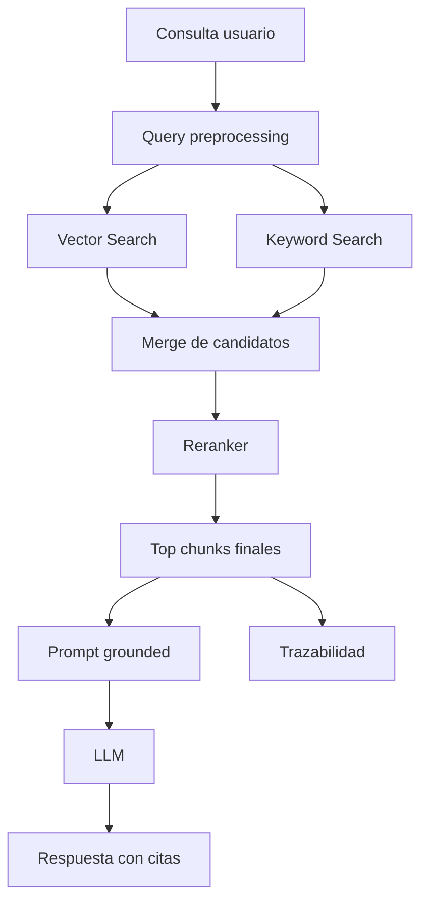

# Semana 05 — RAG, Grounding, Hybrid Search y Reranking para Fintech

Perfecto. Vamos con la **Semana 5 completa**, bien enseñada, bien técnica y aterrizada a **Fintech real**.

Según tu plan, la **Semana 5** es: **RAG / hybrid search / reranking / grounding**.
El objetivo formal es **“llevar retrieval a calidad seria”**. La semana se distribuye en:

- **Lunes:** RAG bien hecho
- **Martes:** grounding y citas
- **Miércoles:** hybrid search
- **Jueves:** reranking
- **Viernes:** comparar calidad antes/después
- **Sábado:** mini proyecto **Enterprise RAG v1**

Y el entregable esperado es:

- búsqueda híbrida
- reranking
- respuesta con citas
- trazabilidad de chunks usados

con el checklist de salida:

- sé construir RAG con fuentes
- entiendo recall vs precision
- sé cuándo usar hybrid search
- sé para qué sirve reranking
- tengo un RAG claramente mejorado.

---

# Semana 5 — RAG + Grounding + Hybrid Search + Reranking

## La idea central

La Semana 4 te enseñó a **encontrar chunks parecidos**.
La Semana 5 te enseña a convertir eso en un sistema que **responde mejor, con fuentes, menos alucinación y más calidad operacional**.

La diferencia es enorme:

- **Semana 4:** “busco fragmentos”
- **Semana 5:** “uso esos fragmentos para responder con fundamento”

Ese salto es RAG.

---

# 1. Qué es RAG

**RAG** significa **Retrieval-Augmented Generation**.

En limpio:

> el modelo no responde solo con su conocimiento interno o con el prompt fijo, sino con información recuperada dinámicamente desde tus fuentes.

## Flujo mental

1. entra una consulta
2. el sistema busca chunks relevantes
3. selecciona los mejores
4. arma contexto con esos chunks
5. el modelo genera la respuesta usando esas fuentes

Entonces el sistema combina dos cosas:

- **retrieval** → encontrar evidencia
- **generation** → redactar respuesta útil

---

# 2. Qué problema resuelve RAG

Sin RAG, tu modelo:

- puede contestar genérico,
- puede quedarse corto,
- puede inventar,
- puede no respetar la política vigente,
- puede mezclar dominios.

Con RAG, tu sistema puede contestar usando:

- manuales internos,
- políticas operativas,
- FAQs,
- procesos KYC,
- protocolos antifraude,
- estados de producto,
- documentación de soporte.

En fintech esto vale muchísimo porque el modelo tiene que hablar con:

- precisión operativa,
- trazabilidad,
- y menos margen de improvisación.

---

# 3. Qué NO resuelve mágicamente RAG

RAG no es magia.

No arregla:

- corpus malo,
- chunks malos,
- metadata pobre,
- documentos desactualizados,
- preguntas ambiguas,
- prompts flojos,
- ranking mediocre.

Entonces:

> RAG mejora la calidad cuando el retrieval, el corpus y el armado del contexto están bien diseñados.

---

# 4. Qué es grounding

**Grounding** significa que la respuesta está **anclada** en evidencia concreta.

No es solo “contestar bien”.
Es contestar con base en algo.

## Ejemplo sin grounding

> “Seguramente te lo van a devolver automáticamente.”

Eso puede sonar útil, pero puede ser falso.

## Ejemplo con grounding

> “Según la política de cargos duplicados, no debe prometerse reintegro automático sin validar estado de la transacción y del comercio.”

Eso ya está anclado en fuente.

## En fintech grounding es clave porque:

- baja alucinación,
- mejora auditoría,
- mejora confianza,
- permite trazabilidad,
- ayuda a revisión humana,
- reduce riesgo operativo.

---

# 5. Qué son citas en RAG

Las **citas** son la forma de mostrar de dónde salió la respuesta.

Pueden apuntar a:

- documento,
- chunk,
- sección,
- título,
- página,
- ID interno.

## Qué lográs con citas

- trazabilidad
- revisión
- debugging
- confianza del usuario interno
- inspección por compliance o soporte

## Regla muy importante

La cita no es un adorno visual.
Es una parte del sistema de control.

---

# 6. Qué es un RAG “bien hecho”

El lunes de tu plan dice literalmente **“RAG bien hecho”**.

Eso significa varias cosas al mismo tiempo:

## a) Buen corpus

Fuentes correctas, actualizadas y gobernadas.

## b) Buen retrieval

Que traiga evidencia útil y no basura.

## c) Buen contexto

No meter 40 chunks sin criterio.

## d) Buen prompt

Que obligue al modelo a responder con base en fuentes.

## e) Buen grounding

Que diferencie hecho citado vs inferencia.

## f) Buen output

Respuesta clara, útil y trazable.

---

# 7. Recall vs precision

Tu checklist de salida lo incluye explícitamente.

## Recall

Es la capacidad de **no dejar afuera información relevante**.

Si una consulta necesita 3 piezas y vos solo trajiste 1, tenés recall bajo.

## Precision

Es la capacidad de **no meter información irrelevante**.

Si trajiste 12 chunks y 8 son ruido, tenés precision baja.

## Trade-off

- más recall suele traer más ruido
- más precision puede perder cobertura

## Ejemplo fintech

Consulta:

> “No reconozco una compra internacional y recibí un SMS que no aprobé”

Buen retrieval debería cubrir:

- señales de fraude
- consumo no reconocido
- cautela de no confirmar fraude sin validación

Si trae solo una parte, recall bajo.
Si además mete documentos de KYC o deuda, precision baja.

---

# 8. Qué es hybrid search

El miércoles del plan es **hybrid search**.

**Hybrid search** combina dos enfoques:

- **búsqueda semántica** (embeddings/vectorial)
- **búsqueda lexical/keyword** (BM25, tf-idf, coincidencia de términos, etc.)

## Por qué combinar

Porque cada una resuelve cosas distintas.

### Vectorial

Muy buena para:

- sinónimos,
- paráfrasis,
- lenguaje natural,
- significado.

### Keyword

Muy buena para:

- IDs exactos,
- nombres de productos,
- términos regulatorios,
- siglas,
- códigos,
- coincidencia literal.

## En fintech hybrid search es excelente porque hay:

- lenguaje natural del cliente,
- terminología técnica,
- códigos internos,
- transaction IDs,
- nombres de estados,
- términos legales.

---

# 9. Cuándo falla lo vectorial solo

Puede fallar cuando la query depende mucho de:

- `txn_893`
- `chargeback code 4853`
- `estado OBS_DOC_02`
- `Visa`, `Mastercard`, `DEBIN`
- nombre exacto de una política

La vectorial sola puede no priorizar bien eso.

---

# 10. Cuándo falla keyword sola

Puede fallar cuando el usuario dice:

- “me cobraron dos veces”
  y el documento dice:
- “cargo duplicado”

o cuando dice:

- “me vaciaron la cuenta”
  y el documento habla de:
- “account takeover sospechado”

Ahí la semántica ayuda muchísimo.

---

# 11. Qué es reranking

El jueves del plan es **reranking**.

Reranking significa:

> después del retrieval inicial, aplicás una segunda capa de ranking más fina para reordenar los resultados.

## Flujo

1. hacés búsqueda inicial amplia
2. recuperás top-20 o top-10
3. aplicás un modelo o lógica más precisa
4. reordenás
5. te quedás con top-3 o top-5 mejores

## Para qué sirve

El retrieval inicial suele optimizar recall.
El reranking optimiza precision.

---

# 12. Intuición correcta de reranking

Pensalo así:

- **retrieval** = “traeme candidatos razonables”
- **reranking** = “de esos candidatos, decime cuáles son realmente los mejores”

Esa separación es muy importante.

---

# 13. Qué puede usar reranking

## A. Heurísticas

- penalizar chunks largos
- premiar coincidencia de términos críticos
- premiar mismo dominio/producto/país

## B. Cross-encoder o modelo más caro

Más preciso, más costoso.

## C. Reglas de negocio

Ejemplo:

- si aparece `transaction_id`, premiar chunks con `payments`
- si aparece `international purchase`, premiar `fraud`

En una fintech real muchas veces usás mezcla de las 3.

---

# 14. Qué significa “respuesta con fuentes”

El entregable formal de la semana lo pide.

Una **respuesta con fuentes** no es solo pegar links.

Tiene que:

- contestar la pregunta,
- citar evidencia relevante,
- no sobrecitar,
- no citar chunks irrelevantes,
- poder inspeccionarse luego.

## Buen patrón

1. respuesta principal
2. puntos de apoyo
3. citas por chunk/documento
4. aclaración si hay incertidumbre

---

# 15. Qué es trazabilidad de chunks usados

También está en el entregable.

Significa poder responder:

- qué chunks se recuperaron,
- con qué score,
- cuáles se usaron finalmente,
- de qué documento vinieron,
- por qué quedaron arriba.

Eso es crítico para:

- debugging,
- tuning,
- evaluación,
- confianza,
- compliance interno.

---

# 16. Arquitectura mental de la Semana 5



---

# 17. Qué diferencia hay entre Semana 4 y Semana 5

## Semana 4

- embeddings
- chunking
- metadata
- ingestión
- vector search básico

## Semana 5

- usar retrieval dentro de una respuesta real
- grounding
- citas
- hybrid search
- reranking
- comparación de calidad antes/después

La Semana 4 construye la base.
La Semana 5 la convierte en calidad seria.

---

# 18. Diseño fintech recomendado para practicar

Yo te recomiendo trabajar con estos documentos:

## Pagos

- política de cargos duplicados
- transferencias no acreditadas
- retenciones temporales

## Fraude

- guía de consumo no reconocido
- account takeover
- señales de alto riesgo

## KYC

- estados de documentación observada
- revisión manual
- causas típicas de rechazo o demora

## Soporte general

- canales válidos
- qué se puede prometer y qué no

Así armás un corpus pequeño pero realista.

---

# 19. Qué casos de usuario conviene probar

## Caso 1 — Doble cobro

> “Me cobraron dos veces en supermercado y no sé si es retención o duplicado”

## Caso 2 — Fraude

> “No reconozco una compra internacional y me llegó un SMS raro”

## Caso 3 — KYC

> “Subí el documento y sigo en revisión”

## Caso 4 — Transferencia

> “Hice una transferencia y no llegó”

Estos casos te obligan a probar:

- retrieval
- grounding
- ranking
- citas
- respuesta útil

---

# 20. Estructura recomendada del mini proyecto

## `Enterprise RAG v1`

```text
week5-enterprise-rag-fintech/
├─ README.md
├─ package.json
├─ tsconfig.json
├─ src/
│  ├─ types.ts
│  ├─ parser.ts
│  ├─ chunker.ts
│  ├─ embedder.ts
│  ├─ vectorStore.ts
│  ├─ keywordSearch.ts
│  ├─ hybridRetriever.ts
│  ├─ reranker.ts
│  ├─ groundedAnswer.ts
│  ├─ sampleDocs.ts
│  └─ main.ts
```

---

# 21. Diseño de tipos

## `src/types.ts`

```ts
export interface SourceDocument {
  id: string;
  title: string;
  content: string;
  domain: "payments" | "fraud" | "kyc" | "support";
  product: "credit_card" | "wallet" | "account";
  country: "AR" | "MX" | "BR";
  version: string;
}

export interface ChunkMetadata {
  documentId: string;
  documentTitle: string;
  domain: SourceDocument["domain"];
  product: SourceDocument["product"];
  country: SourceDocument["country"];
  version: string;
  chunkIndex: number;
}

export interface ChunkRecord {
  id: string;
  text: string;
  metadata: ChunkMetadata;
  embedding: number[];
}

export interface RetrievalCandidate {
  chunkId: string;
  text: string;
  metadata: ChunkMetadata;
  vectorScore?: number;
  keywordScore?: number;
  hybridScore?: number;
  rerankScore?: number;
}

export interface CitedAnswer {
  answer: string;
  citations: Array<{
    chunkId: string;
    documentTitle: string;
    chunkIndex: number;
  }>;
  usedChunks: RetrievalCandidate[];
}
```

---

# 22. Parser y chunker

Podés reutilizar casi igual la lógica de Semana 4.

## `src/parser.ts`

```ts
import { SourceDocument } from "./types.js";

export class SimpleParser {
  parse(doc: SourceDocument): string {
    return doc.content
      .replace(/\r/g, "")
      .replace(/[ \t]+/g, " ")
      .replace(/\n{3,}/g, "\n\n")
      .trim();
  }
}
```

## `src/chunker.ts`

```ts
export interface ChunkingConfig {
  chunkSize: number;
  overlap: number;
}

export interface RawChunk {
  text: string;
  index: number;
}

export class CharacterChunker {
  constructor(private readonly config: ChunkingConfig) {
    if (config.overlap >= config.chunkSize) {
      throw new Error("overlap debe ser menor que chunkSize");
    }
  }

  split(text: string): RawChunk[] {
    const chunks: RawChunk[] = [];
    let start = 0;
    let index = 0;

    while (start < text.length) {
      const end = Math.min(start + this.config.chunkSize, text.length);
      const chunkText = text.slice(start, end).trim();

      if (chunkText.length > 0) {
        chunks.push({ text: chunkText, index });
        index += 1;
      }

      if (end === text.length) break;
      start = end - this.config.overlap;
    }

    return chunks;
  }
}
```

---

# 23. Embedder local

## `src/embedder.ts`

```ts
export interface Embedder {
  embed(text: string): Promise<number[]>;
}

function tokenize(text: string): string[] {
  return text
    .toLowerCase()
    .replace(/[^a-z0-9áéíóúñü\s]/gi, " ")
    .split(/\s+/)
    .filter(Boolean);
}

export class LocalHashEmbedder implements Embedder {
  constructor(private readonly dimensions = 128) {}

  async embed(text: string): Promise<number[]> {
    const vec = new Array(this.dimensions).fill(0);
    const tokens = tokenize(text);

    for (const token of tokens) {
      let hash = 0;
      for (let i = 0; i < token.length; i++) {
        hash = (hash * 31 + token.charCodeAt(i)) >>> 0;
      }
      vec[hash % this.dimensions] += 1;
    }

    const norm = Math.sqrt(vec.reduce((acc, v) => acc + v * v, 0)) || 1;
    return vec.map((v) => v / norm);
  }
}

export function cosineSimilarity(a: number[], b: number[]): number {
  let dot = 0;
  let normA = 0;
  let normB = 0;

  for (let i = 0; i < a.length; i++) {
    dot += a[i] * b[i];
    normA += a[i] * a[i];
    normB += b[i] * b[i];
  }

  const denom = Math.sqrt(normA) * Math.sqrt(normB) || 1;
  return dot / denom;
}
```

---

# 24. Vector store

## `src/vectorStore.ts`

```ts
import { ChunkRecord, RetrievalCandidate } from "./types.js";
import { cosineSimilarity } from "./embedder.js";

export class InMemoryVectorStore {
  private records: ChunkRecord[] = [];

  add(record: ChunkRecord): void {
    this.records.push(record);
  }

  all(): ChunkRecord[] {
    return this.records;
  }

  search(queryEmbedding: number[], topK = 8): RetrievalCandidate[] {
    return this.records
      .map((record) => ({
        chunkId: record.id,
        text: record.text,
        metadata: record.metadata,
        vectorScore: cosineSimilarity(queryEmbedding, record.embedding)
      }))
      .sort((a, b) => (b.vectorScore ?? 0) - (a.vectorScore ?? 0))
      .slice(0, topK);
  }
}
```

---

# 25. Keyword search

Esto es la parte lexical del hybrid search.

## `src/keywordSearch.ts`

```ts
import { ChunkRecord, RetrievalCandidate } from "./types.js";

function tokenize(text: string): string[] {
  return text
    .toLowerCase()
    .replace(/[^a-z0-9áéíóúñü\s]/gi, " ")
    .split(/\s+/)
    .filter(Boolean);
}

export class KeywordSearcher {
  constructor(private readonly chunks: ChunkRecord[]) {}

  search(query: string, topK = 8): RetrievalCandidate[] {
    const q = tokenize(query);
    const uniqueQ = new Set(q);

    return this.chunks
      .map((chunk) => {
        const tokens = tokenize(chunk.text);
        let score = 0;

        for (const term of uniqueQ) {
          const count = tokens.filter((t) => t === term).length;
          score += count;
        }

        return {
          chunkId: chunk.id,
          text: chunk.text,
          metadata: chunk.metadata,
          keywordScore: score
        };
      })
      .filter((r) => (r.keywordScore ?? 0) > 0)
      .sort((a, b) => (b.keywordScore ?? 0) - (a.keywordScore ?? 0))
      .slice(0, topK);
  }
}
```

---

# 26. Hybrid retriever

## `src/hybridRetriever.ts`

```ts
import { Embedder } from "./embedder.js";
import { KeywordSearcher } from "./keywordSearch.js";
import { RetrievalCandidate } from "./types.js";
import { InMemoryVectorStore } from "./vectorStore.js";

function mergeCandidates(
  vectorResults: RetrievalCandidate[],
  keywordResults: RetrievalCandidate[]
): RetrievalCandidate[] {
  const merged = new Map<string, RetrievalCandidate>();

  for (const r of vectorResults) {
    merged.set(r.chunkId, { ...r });
  }

  for (const r of keywordResults) {
    const existing = merged.get(r.chunkId);
    if (existing) {
      merged.set(r.chunkId, {
        ...existing,
        keywordScore: r.keywordScore
      });
    } else {
      merged.set(r.chunkId, { ...r });
    }
  }

  return [...merged.values()].map((r) => {
    const vector = r.vectorScore ?? 0;
    const keyword = r.keywordScore ?? 0;
    return {
      ...r,
      hybridScore: vector * 0.7 + keyword * 0.3
    };
  });
}

export class HybridRetriever {
  constructor(
    private readonly embedder: Embedder,
    private readonly vectorStore: InMemoryVectorStore,
    private readonly keywordSearcher: KeywordSearcher
  ) {}

  async search(query: string, topK = 8): Promise<RetrievalCandidate[]> {
    const queryEmbedding = await this.embedder.embed(query);
    const vectorResults = this.vectorStore.search(queryEmbedding, topK);
    const keywordResults = this.keywordSearcher.search(query, topK);

    return mergeCandidates(vectorResults, keywordResults)
      .sort((a, b) => (b.hybridScore ?? 0) - (a.hybridScore ?? 0))
      .slice(0, topK);
  }
}
```

---

# 27. Reranker

Acá te dejo una versión heurística muy educativa.

## `src/reranker.ts`

```ts
import { RetrievalCandidate } from "./types.js";

function tokenize(text: string): string[] {
  return text
    .toLowerCase()
    .replace(/[^a-z0-9áéíóúñü\s]/gi, " ")
    .split(/\s+/)
    .filter(Boolean);
}

export class HeuristicReranker {
  rerank(query: string, candidates: RetrievalCandidate[], topK = 4): RetrievalCandidate[] {
    const q = new Set(tokenize(query));

    const reranked = candidates.map((c) => {
      const text = c.text.toLowerCase();
      let bonus = 0;

      if (q.has("fraude") && c.metadata.domain === "fraud") bonus += 1.2;
      if (q.has("duplicado") && c.metadata.domain === "payments") bonus += 1.2;
      if (q.has("transferencia") && c.metadata.domain === "payments") bonus += 1.0;
      if (q.has("documento") && c.metadata.domain === "kyc") bonus += 1.0;
      if (text.includes("no debe")) bonus += 0.2;
      if (text.includes("debe")) bonus += 0.1;

      return {
        ...c,
        rerankScore: (c.hybridScore ?? 0) + bonus
      };
    });

    return reranked
      .sort((a, b) => (b.rerankScore ?? 0) - (a.rerankScore ?? 0))
      .slice(0, topK);
  }
}
```

---

# 28. Grounded answer builder

## `src/groundedAnswer.ts`

```ts
import { CitedAnswer, RetrievalCandidate } from "./types.js";

export class GroundedAnswerBuilder {
  build(query: string, topChunks: RetrievalCandidate[]): CitedAnswer {
    const lower = query.toLowerCase();

    let answer = "No encontré evidencia suficiente para responder con confianza.";
    if (lower.includes("dos veces") || lower.includes("duplicado")) {
      answer =
        "El caso parece alinearse con un posible cargo duplicado. La política indica que debe distinguirse de una retención temporal o doble autorización y que no debe prometerse reintegro automático sin validar el estado de la transacción y del comercio.";
    } else if (lower.includes("internacional") || lower.includes("no reconozco")) {
      answer =
        "El caso encaja con una sospecha de consumo no reconocido. La guía operativa indica tratarlo como sospecha de fraude hasta validación adicional y no afirmar fraude confirmado sin controles extra.";
    } else if (lower.includes("documento") || lower.includes("revisión")) {
      answer =
        "El caso parece vinculado a revisión KYC. La documentación indica que la cuenta puede quedar en revisión por documento vencido, imagen ilegible o inconsistencia de datos.";
    }

    return {
      answer,
      citations: topChunks.map((c) => ({
        chunkId: c.chunkId,
        documentTitle: c.metadata.documentTitle,
        chunkIndex: c.metadata.chunkIndex
      })),
      usedChunks: topChunks
    };
  }
}
```

---

# 29. Sample docs

## `src/sampleDocs.ts`

```ts
import { SourceDocument } from "./types.js";

export const sampleDocs: SourceDocument[] = [
  {
    id: "doc_payments_001",
    title: "Política de cargos duplicados",
    domain: "payments",
    product: "credit_card",
    country: "AR",
    version: "2026-04",
    content: `
Un cargo duplicado ocurre cuando el cliente visualiza dos consumos por una misma operación.
Debe distinguirse de una retención temporal o doble autorización.
No debe prometerse reintegro automático sin validación del estado de la transacción y del comercio.
El siguiente paso operativo es revisar el estado de la autorización y orientar el reclamo según canal vigente.
`
  },
  {
    id: "doc_payments_002",
    title: "Transferencias no acreditadas",
    domain: "payments",
    product: "account",
    country: "AR",
    version: "2026-04",
    content: `
Una transferencia no acreditada puede deberse a demoras operativas, validaciones pendientes o errores en los datos.
Debe verificarse el identificador de la transferencia y el estado del movimiento antes de prometer resolución.
`
  },
  {
    id: "doc_fraud_001",
    title: "Guía de consumo no reconocido",
    domain: "fraud",
    product: "credit_card",
    country: "AR",
    version: "2026-04",
    content: `
Un consumo no reconocido debe tratarse como sospecha de fraude hasta validación adicional.
Se consideran señales relevantes: compra internacional inesperada, SMS no aprobado, cambio de dispositivo y patrón atípico.
No debe afirmarse fraude confirmado sin controles adicionales.
`
  },
  {
    id: "doc_kyc_001",
    title: "Estados KYC y documentación observada",
    domain: "kyc",
    product: "account",
    country: "AR",
    version: "2026-04",
    content: `
Una cuenta puede quedar en revisión por documentación vencida, imagen ilegible o inconsistencia de datos.
El mensaje al cliente debe explicar el motivo general sin exponer lógica antifraude interna.
`
  }
];
```

---

# 30. Main de punta a punta

## `src/main.ts`

```ts
import { randomUUID } from "node:crypto";
import { CharacterChunker } from "./chunker.js";
import { LocalHashEmbedder } from "./embedder.js";
import { GroundedAnswerBuilder } from "./groundedAnswer.js";
import { HybridRetriever } from "./hybridRetriever.js";
import { KeywordSearcher } from "./keywordSearch.js";
import { SimpleParser } from "./parser.js";
import { HeuristicReranker } from "./reranker.js";
import { sampleDocs } from "./sampleDocs.js";
import { ChunkRecord } from "./types.js";
import { InMemoryVectorStore } from "./vectorStore.js";

async function buildIndex() {
  const parser = new SimpleParser();
  const chunker = new CharacterChunker({ chunkSize: 180, overlap: 40 });
  const embedder = new LocalHashEmbedder(128);
  const vectorStore = new InMemoryVectorStore();

  const chunks: ChunkRecord[] = [];

  for (const doc of sampleDocs) {
    const parsed = parser.parse(doc);
    const rawChunks = chunker.split(parsed);

    for (const raw of rawChunks) {
      const embedding = await embedder.embed(raw.text);
      const chunk: ChunkRecord = {
        id: randomUUID(),
        text: raw.text,
        embedding,
        metadata: {
          documentId: doc.id,
          documentTitle: doc.title,
          domain: doc.domain,
          product: doc.product,
          country: doc.country,
          version: doc.version,
          chunkIndex: raw.index
        }
      };

      chunks.push(chunk);
      vectorStore.add(chunk);
    }
  }

  return { embedder, vectorStore, chunks };
}

async function main() {
  const { embedder, vectorStore, chunks } = await buildIndex();
  const keywordSearcher = new KeywordSearcher(chunks);
  const retriever = new HybridRetriever(embedder, vectorStore, keywordSearcher);
  const reranker = new HeuristicReranker();
  const answerBuilder = new GroundedAnswerBuilder();

  const queries = [
    "me cobraron dos veces una compra y no sé si es retención o duplicado",
    "no reconozco una compra internacional y me llegó un SMS raro",
    "subí mi documento y sigo en revisión"
  ];

  for (const query of queries) {
    const retrieved = await retriever.search(query, 6);
    const reranked = reranker.rerank(query, retrieved, 3);
    const answer = answerBuilder.build(query, reranked);

    console.log("\n==============================");
    console.log("QUERY:", query);
    console.log("\nTOP CHUNKS:");
    for (const c of reranked) {
      console.log({
        title: c.metadata.documentTitle,
        domain: c.metadata.domain,
        hybridScore: Number((c.hybridScore ?? 0).toFixed(4)),
        rerankScore: Number((c.rerankScore ?? 0).toFixed(4)),
        text: c.text
      });
    }

    console.log("\nANSWER:");
    console.log(answer.answer);
    console.log("\nCITATIONS:");
    console.log(answer.citations);
  }
}

main().catch(console.error);
```

---

# 31. Qué enseña este código

Este código ya te enseña todo lo central de la Semana 5:

## RAG

Porque construye respuesta usando chunks recuperados.

## Grounding

Porque la respuesta sale del contenido recuperado y no de texto libre arbitrario.

## Citas

Porque devuelve `citations`.

## Hybrid search

Porque combina vector y keyword.

## Reranking

Porque recupera candidatos y luego los reordena.

## Trazabilidad

Porque conserva `usedChunks` y scores.

Eso coincide perfecto con el entregable formal de **Enterprise RAG v1**.

---

# 32. Qué mejorarías en producción

## A. Embeddings reales

OpenAI, Bedrock, Voyage, etc.

## B. Keyword search más serio

BM25 real.

## C. Reranker real

Cross-encoder o reranker dedicado.

## D. Filtros por metadata

País, producto, versión, vigencia.

## E. Chunk selection inteligente

No mandar chunks duplicados o redundantes.

## F. Prompt grounded real

Con reglas tipo:

- responder solo con base en fuentes
- marcar incertidumbre
- citar cada afirmación importante

## G. Auditoría

Guardar query, chunks recuperados, chunks usados, respuesta, latencia.

---

# 33. Cómo se ve un prompt grounded bueno

```txt
Sos un asistente fintech de soporte operacional.

Debés responder usando únicamente la evidencia provista en las fuentes recuperadas.
Si la evidencia no alcanza, debés decirlo explícitamente.
No inventes políticas, estados, resoluciones ni promesas.

Fuentes:
[DOC: Política de cargos duplicados | chunk 0]
...

[DOC: Guía de consumo no reconocido | chunk 1]
...

Consulta del usuario:
"Me cobraron dos veces una compra y no sé si es duplicado o retención"
```

Ese prompt obliga a grounding.

---

# 34. Qué comparar antes y después

El viernes del plan dice: **comparar calidad antes/después**.

Tenés que comparar al menos 3 variantes:

## Variante A — Solo vector search

## Variante B — Hybrid search

## Variante C — Hybrid + reranking

Y medir:

- relevancia de top-3
- claridad de respuesta
- nivel de grounding
- presencia de ruido
- calidad de citas

---

# 35. Ejercicios prácticos — lunes a sábado

## Lunes — RAG bien hecho

Objetivo del plan.

### Ejercicio 1

Tomá la query:

> “me cobraron dos veces una compra”

Hacé:

1. retrieval
2. selección de chunks
3. respuesta grounded

### Qué aprender

Que RAG no es solo buscar; es buscar + responder con base en fuentes.

---

## Martes — Grounding y citas

Objetivo del plan.

### Ejercicio 2

Respondé esta consulta:

> “¿Me van a devolver la plata automáticamente?”

Pero obligate a:

- usar evidencia
- citar chunks
- marcar incertidumbre si no hay confirmación

### Qué debería salir

Algo como:

> “No corresponde prometer reintegro automático sin validar estado de transacción y comercio.”

Y citar política de cargos duplicados.

### Qué aprender

Que grounding disciplina la respuesta.

---

## Miércoles — Hybrid search

Objetivo del plan.

### Ejercicio 3

Compará resultados para:

> “consumo internacional no reconocido”
> “fraude compra internacional”
> “SMS no aprobado compra”

Probá:

- solo vector
- solo keyword
- hybrid

### Qué aprender

Cuándo hybrid supera a cada técnica por separado.

---

## Jueves — Reranking

Objetivo del plan.

### Ejercicio 4

Tomá top-6 candidatos y reordenalos con tu reranker.

### Observá

- si suben chunks del dominio correcto
- si baja ruido
- si mejora el top-3 final

### Qué aprender

Reranking no busca más; ordena mejor.

---

## Viernes — Comparar calidad antes/después

Objetivo del plan.

### Ejercicio 5

Armate una mini batería de 10 queries.

Evaluá:

- top-1 correcto sí/no
- top-3 útil sí/no
- respuesta grounded sí/no
- cita útil sí/no

Compará:

- vector solo
- hybrid
- hybrid + reranking

### Qué aprender

A demostrar mejora real, no intuición.

---

## Sábado — Mini proyecto `Enterprise RAG v1`

Objetivo del plan.

### Requisitos mínimos

- búsqueda híbrida
- reranking
- respuesta con citas
- trazabilidad de chunks usados

### Caso fintech sugerido

Usá estos 4 dominios:

- pagos
- fraude
- KYC
- soporte

---

# 36. Ejercicios extra de nivel fuerte

## Ejercicio 6 — Recall vs precision

Elegí una query ambigua:

> “no sé qué pasó con una compra”

Aumentá `topK` de 3 a 10.

Explicá:

- qué ganaste en recall
- qué perdiste en precision

---

## Ejercicio 7 — Chunk redundancy

Simulá overlap alto y fijate si te aparecen muchos chunks casi iguales.

### Qué aprender

Que más contexto no siempre mejora calidad.

---

## Ejercicio 8 — Falla de RAG

Tomá una respuesta mala y diagnosticá si el problema fue:

- corpus
- chunking
- metadata
- retrieval
- reranking
- grounding prompt

---

# 37. Casos fintech concretos para practicar

## Caso A — Doble cobro

Query:

> “Me cobraron dos veces una compra en Carrefour”

Esperado:

- política de cargos duplicados
- cautela sobre reintegro automático
- distinción duplicado vs retención

## Caso B — Fraude

Query:

> “No reconozco una compra internacional y me llegó un SMS que no aprobé”

Esperado:

- guía de consumo no reconocido
- sospecha de fraude, no confirmación
- señales relevantes

## Caso C — KYC

Query:

> “Subí el documento y la cuenta sigue en revisión”

Esperado:

- documento de KYC
- causas generales
- mensaje prudente

## Caso D — Transferencia

Query:

> “Hice una transferencia y no llegó”

Esperado:

- política de transferencias no acreditadas
- verificación de identificador y estado

---

# 38. Qué deberías saber explicar al terminar la semana

## 1

Qué es RAG y cómo combina retrieval con generation.

## 2

Qué es grounding y por qué reduce alucinación.

## 3

Qué diferencia hay entre vector, keyword e hybrid search.

## 4

Qué hace reranking y por qué mejora precision.

## 5

Qué significa recall vs precision.

## 6

Cómo construir respuestas con citas.

## 7

Qué significa trazabilidad de chunks.

## 8

Cómo comparar un RAG básico contra uno mejorado.

Si podés explicar eso, la semana está incorporada.

---

# 39. Checklist final de salida

Traducido a validación práctica:

- construyo RAG con fuentes
- entiendo recall vs precision
- sé cuándo usar hybrid search
- sé para qué sirve reranking
- tengo un RAG claramente mejorado.

Y siguiendo la lógica general del plan, además deberías poder:

- entender el concepto sin leer,
- implementarlo de cero,
- explicarlo en lenguaje de arquitectura,
- saber cuándo usarlo y cuándo no,
- dejar un entregable funcionando,
- documentar trade-offs.

---

# 40. Resumen maestro de la Semana 5

Quiero que te quede grabado así:

> Semana 5 no es “hacer un chatbot con documentos”.
> Semana 5 es aprender a construir un sistema que **recupera evidencia**, **la ordena mejor**, **responde con fundamento**, **cita sus fuentes** y **permite inspección real de calidad**.

La secuencia correcta es:

1. query
2. retrieval inicial
3. hybrid search
4. merge de candidatos
5. reranking
6. selección final de chunks
7. prompt grounded
8. respuesta con citas
9. trazabilidad
10. comparación de calidad antes/después

Eso te deja listo para la **Semana 6**, donde ya pasás a **LangGraph / workflows vs agents / durable execution / HITL**.

Si querés, en el próximo paso te lo convierto en **repo GitHub + ZIP completo de la Semana 5**, con README, código, diagramas y estructura lista para subir.