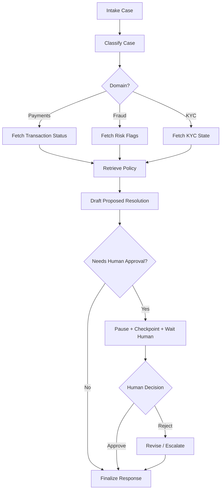

# Semana 06 — LangGraph, Workflows, Agents y Durable Execution para Fintech

Perfecto. Vamos con la **Semana 6 completa**, bien enseñada, bien aterrizada a **fintech real**, y con foco en lo que cambia de verdad el nivel de tus sistemas: pasar de “LLM + tools” a **orquestación stateful con control**.

En tu plan, la **Semana 6** es:

- **LangGraph**
- **workflows vs agents**
- **durable execution**
- **HITL** (human-in-the-loop)

y el entregable es **Agent Graph v1** con:

- 4 o 5 nodos
- branching simple
- pausa para aprobación humana
- recuperación desde checkpoint

Además, el checklist de salida apunta a que puedas:

- distinguir workflow vs agent,
- entender stateful orchestration,
- meter aprobación humana,
- tener durable execution básica,
- y explicar el grafo de punta a punta.

Eso es exactamente lo que vamos a construir.

---

# Semana 6 — LangGraph / Workflows vs Agents / Durable Execution / HITL

## La idea central

Las primeras semanas te dieron piezas:

- Semana 1: runtime LLM
- Semana 2: structured outputs y tools
- Semana 3: state y memory
- Semana 4: retrieval
- Semana 5: RAG con grounding, hybrid y reranking

La Semana 6 te enseña a **coordinar todo eso como sistema**.

La pregunta ya no es:

> “¿cómo llamo a un modelo?”

Ahora la pregunta es:

> “¿cómo hago para que un proceso AI de varios pasos tenga estado, ramas, validaciones, pausas humanas, reintentos y recuperación?”

Eso es orquestación.

Y ahí entra el modelo de **graph**.

---

# 1. Por qué esta semana es tan importante

Porque muchos sistemas AI fracasan no por el modelo, sino por la orquestación.

Un flujo real de fintech no es:

1. entra prompt
2. sale respuesta

Suele ser algo así:

1. entra caso
2. se clasifica
3. se consulta una tool
4. se decide si hay suficiente evidencia
5. se recupera política
6. se arma propuesta de acción
7. si la acción es sensible, se pausa
8. una persona aprueba o rechaza
9. el sistema continúa
10. se genera salida final
11. se deja trazabilidad

Eso ya no es un “chat”.
Eso es un **workflow stateful**.

---

# 2. Workflow vs Agent

Este es el corazón conceptual de la semana.

## Workflow

Un **workflow** es una secuencia relativamente controlada de pasos, donde el sistema sabe de antemano cuáles son los nodos posibles y cómo se conectan.

Ejemplo:

- clasificar caso
- consultar transacción
- recuperar política
- generar borrador
- pedir aprobación
- cerrar

### Características

- pasos conocidos
- branching acotado
- más fácil de auditar
- más fácil de testear
- ideal para producción regulada

## Agent

Un **agent** tiene más autonomía para decidir qué hacer:

- qué tool usar,
- qué orden de pasos seguir,
- si necesita más información,
- si replantea la estrategia.

### Características

- más flexible
- más abierto
- más poder
- más riesgo
- más difícil de controlar

## Regla práctica

En fintech, la mayor parte del valor productivo al principio viene de:

> **workflows con pequeñas capacidades agentic**, no de agentes totalmente libres.

Ese criterio te evita mucho dolor.

---

# 3. La diferencia más importante entre ambos

## Workflow

La lógica principal vive en la aplicación.

## Agent

La lógica principal vive más cerca del modelo y sus decisiones.

### En producción regulada

Normalmente conviene que:

- la aplicación mande,
- el modelo ayude.

No al revés.

---

# 4. Cuándo usar workflow

Usá workflow cuando:

- el proceso tiene pasos conocidos,
- hay políticas claras,
- hay aprobaciones,
- hay side effects,
- necesitás trazabilidad,
- el costo del error es alto,
- querés testear fácilmente.

### Casos fintech ideales

- intake de disputa
- soporte de fraude
- revisión KYC
- cobranzas asistidas
- preanálisis de aumento de límite
- revisión de alertas de riesgo

---

# 5. Cuándo usar agent

Usá agent cuando:

- el espacio de búsqueda es más abierto,
- necesita decidir entre muchas tools,
- la tarea es exploratoria,
- la flexibilidad supera el costo de control,
- no hay side effects sensibles inmediatos.

### Casos mejores para agent

- investigación interna
- análisis documental
- búsqueda en múltiples fuentes
- generación de hipótesis
- soporte experto para analistas

---

# 6. La idea correcta: agentic workflow

Lo más útil en la práctica no suele ser “workflow puro” ni “agent puro”.

Suele ser esto:

> **workflow gobernado con nodos agentic puntuales**.

Ejemplo:

- el grafo define las etapas,
- pero un nodo decide qué tools consultar,
- otro resume evidencia,
- otro redacta propuesta,
- y los pasos sensibles siguen bajo control del flujo.

Eso te da:

- flexibilidad,
- pero sin perder gobernanza.

---

# 7. Qué es un graph en este contexto

Un **graph** es una forma de modelar el proceso como:

- **nodos** = pasos
- **edges** = transiciones
- **state** = memoria viva del proceso

## Ejemplo mental

```text
Intake -> Classify -> FetchData -> RetrievePolicy -> DraftDecision -> HumanApproval -> Finalize
```

Pero también puede haber branching:

```text
Classify -> FraudPath
Classify -> PaymentsPath
Classify -> KYCPath
```

Y loops controlados:

```text
NeedMoreData -> AskMissingInfo -> Re-evaluate
```

---

# 8. Por qué grafo y no solo “if/else”

Porque cuando el sistema crece, el `if/else` se vuelve inmanejable.

Con graph ganás:

- claridad estructural,
- reusabilidad de nodos,
- branching explícito,
- checkpointing,
- pausar/reanudar,
- observabilidad por etapa,
- testeo por nodo.

---

# 9. Qué es `graph state`

El **graph state** es el estado compartido del proceso a lo largo del flujo.

No es solo historial de chat.
Es el estado operativo de trabajo.

## Qué puede incluir

- case id
- customer id
- mensaje original
- clasificación
- severidad
- team suggested
- transaction status
- risk flags
- retrieved policy chunks
- proposed decision
- approval status
- audit trail
- error state
- retry count

## En una fintech esto es oro

Porque cada paso agrega información que el siguiente necesita.

---

# 10. Regla de oro del state

El state tiene que ser:

- explícito,
- serializable,
- auditable,
- estable,
- mínimo pero suficiente.

## Malo

Meter objetos caóticos, texto suelto y resultados ambiguos.

## Bueno

Usar una estructura formal.

---

# 11. Qué es durable execution

Este concepto es central.

**Durable execution** significa que el proceso puede:

- detenerse,
- persistir su estado,
- reanudarse después,
- sobrevivir fallos,
- seguir desde donde quedó.

## Ejemplo real

Un flujo llega a “espera aprobación humana”.

Pasan 3 horas.
El sistema se reinicia.
La aprobación llega después.

Sin durable execution, perdiste el proceso.
Con durable execution, retomás desde el checkpoint correcto.

---

# 12. Qué problemas resuelve durable execution

- caída del proceso
- timeout
- reinicio de servidor
- pausa humana
- reintentos
- workflows largos
- ejecuciones asíncronas
- necesidad de auditar cada paso

En fintech esto importa muchísimo porque:

- hay aprobaciones,
- hay dependencias externas,
- hay sistemas lentos,
- hay flujos que no cierran en 5 segundos.

---

# 13. Qué es un checkpoint

Un **checkpoint** es una foto persistida del estado del grafo en un punto determinado.

## Qué guarda

- nodo actual
- state actual
- timestamp
- status
- event log
- versión del flujo
- intento/retry

## Para qué sirve

- reanudar
- inspeccionar
- auditar
- recuperar errores
- comparar ejecuciones

---

# 14. Qué es HITL

**HITL** = **Human-in-the-Loop**.

Es cuando el flujo se detiene o deriva para que una persona:

- apruebe,
- rechace,
- complete datos,
- corrija,
- o valide una propuesta.

No es “porque el sistema no sirve”.
Es porque en producción seria, muchas decisiones no deben automatizarse completamente.

---

# 15. Cuándo meter HITL en fintech

Siempre que haya:

- impacto monetario,
- riesgo regulatorio,
- bloqueo/desbloqueo,
- cambio de scoring,
- disputa formal,
- modificación de límite,
- cierre de cuenta,
- comunicación delicada,
- evidencia insuficiente.

## Ejemplos

- crear borrador automático: sí
- enviar disputa final sin aprobación: no
- sugerir bloqueo: sí
- bloquear automáticamente por un LLM: no

---

# 16. Qué tipos de intervención humana hay

## A. Approval

La persona aprueba o rechaza.

## B. Review/Edit

La persona corrige el borrador.

## C. Data completion

La persona aporta dato faltante.

## D. Override

La persona fuerza una ruta distinta.

## E. Escalation

El sistema escala cuando no tiene suficiente certeza.

---

# 17. Qué es LangGraph conceptualmente

Más allá del framework puntual, la idea que importa es esta:

> modelar workflows/agents como un grafo stateful con nodos, edges y persistencia.

Aunque después uses LangGraph.js, Temporal, Step Functions, BPMN o tu propio engine, el patrón conceptual es el mismo:

- state
- nodos
- branching
- checkpoints
- pausa/reanudación
- observabilidad por paso

En esta semana lo importante es el modelo mental, no memorizar una API.

---

# 18. Arquitectura mental correcta de la Semana 6



Ese es el tipo de flujo que querés dominar.

---

# 19. Caso fintech que vamos a usar

Te propongo uno muy bueno para esta semana:

## Caso

Cliente reporta:

- posible cargo duplicado,
- o posible fraude,
- según la evidencia puede requerir:
  - consulta de transacción,
  - consulta de risk flags,
  - recuperación de política,
  - borrador de resolución,
  - aprobación humana.

Este caso es ideal porque tiene:

- branching,
- state,
- retrieval,
- tools,
- HITL,
- side effects suaves,
- alta trazabilidad.

---

# 20. Cómo pensar un flujo bien diseñado

## Paso 1 — Intake

Normalizar el caso.

## Paso 2 — Classification

Definir dominio, severidad y ruta.

## Paso 3 — Data retrieval

Consultar tools internas.

## Paso 4 — Policy retrieval

Buscar la política correcta.

## Paso 5 — Draft

Construir propuesta de respuesta/acción.

## Paso 6 — Approval gate

Decidir si necesita humano.

## Paso 7 — Finalize

Cerrar con respuesta o escalamiento.

---

# 21. Qué debe vivir en el estado del grafo

Para este caso yo usaría algo así:

```ts
type GraphState = {
  caseId: string;
  customerId: string;
  originalMessage: string;

  domain?: "payments" | "fraud" | "kyc";
  severity?: "low" | "medium" | "high";

  transactionStatus?: {
    transactionId?: string;
    status?: string;
    amount?: number;
    currency?: string;
    merchant?: string;
  };

  riskFlags?: {
    accountTakeoverRisk?: "low" | "medium" | "high";
    recentDeviceChange?: boolean;
    recentPasswordReset?: boolean;
  };

  retrievedPolicies: Array<{
    title: string;
    chunkId: string;
    text: string;
  }>;

  proposedResolution?: string;
  requiresHumanApproval?: boolean;
  humanDecision?: "approved" | "rejected";

  auditTrail: string[];
  currentNode?: string;
  status?: "running" | "waiting_human" | "completed" | "failed";
};
```

Eso ya es un state serio.

---

# 22. Diseño de nodos

Cada nodo debería tener una responsabilidad clara.

## Buenos nodos

- pequeños
- explícitos
- testables
- sin mezclar demasiadas cosas

## Malos nodos

- hacen clasificación, retrieval, redacción y decisión todo junto

---

# 23. Propuesta de nodos para esta semana

1. `intakeCase`
2. `classifyCase`
3. `fetchOperationalData`
4. `retrievePolicy`
5. `draftResolution`
6. `approvalGate`
7. `waitHumanDecision`
8. `finalize`

Si querés simplificar, podés fusionar algunos y dejar 5 nodos.
Pero conceptualmente conviene entenderlos separados.

---

# 24. Código — implementación didáctica en TypeScript

Voy a darte una implementación **propia del patrón graph** en TypeScript.

¿Por qué propia?
Porque lo importante esta semana es dominar el patrón.
Después lo mapeás a LangGraph.js sin problema.

---

## 24.1 Estructura del proyecto

```text
week6-agent-graph-fintech/
├─ src/
│  ├─ types.ts
│  ├─ graph.ts
│  ├─ checkpointStore.ts
│  ├─ nodes/
│  │  ├─ intakeCase.ts
│  │  ├─ classifyCase.ts
│  │  ├─ fetchOperationalData.ts
│  │  ├─ retrievePolicy.ts
│  │  ├─ draftResolution.ts
│  │  ├─ approvalGate.ts
│  │  ├─ waitHumanDecision.ts
│  │  └─ finalize.ts
│  └─ main.ts
```

---

## 24.2 `types.ts`

```ts
export type Domain = "payments" | "fraud" | "kyc";
export type Severity = "low" | "medium" | "high";
export type RunStatus = "running" | "waiting_human" | "completed" | "failed";

export interface RetrievedPolicy {
  title: string;
  chunkId: string;
  text: string;
}

export interface GraphState {
  caseId: string;
  customerId: string;
  originalMessage: string;

  domain?: Domain;
  severity?: Severity;

  transactionStatus?: {
    transactionId?: string;
    status?: string;
    amount?: number;
    currency?: string;
    merchant?: string;
  };

  riskFlags?: {
    accountTakeoverRisk?: "low" | "medium" | "high";
    recentDeviceChange?: boolean;
    recentPasswordReset?: boolean;
  };

  retrievedPolicies: RetrievedPolicy[];

  proposedResolution?: string;
  requiresHumanApproval?: boolean;
  humanDecision?: "approved" | "rejected";

  currentNode?: string;
  status: RunStatus;
  auditTrail: string[];
}
```

---

## 24.3 `checkpointStore.ts`

```ts
import { GraphState } from "./types";

export interface CheckpointRecord {
  runId: string;
  node: string;
  state: GraphState;
  createdAt: string;
}

export class InMemoryCheckpointStore {
  private checkpoints: CheckpointRecord[] = [];

  save(runId: string, node: string, state: GraphState) {
    this.checkpoints.push({
      runId,
      node,
      state: JSON.parse(JSON.stringify(state)),
      createdAt: new Date().toISOString()
    });
  }

  latest(runId: string): CheckpointRecord | undefined {
    const records = this.checkpoints.filter(c => c.runId === runId);
    return records[records.length - 1];
  }

  all(runId: string): CheckpointRecord[] {
    return this.checkpoints.filter(c => c.runId === runId);
  }
}
```

---

## 24.4 `graph.ts`

```ts
import { GraphState } from "./types";
import { InMemoryCheckpointStore } from "./checkpointStore";

export type NodeResult = {
  nextNode?: string;
  pause?: boolean;
};

export type GraphNode = (state: GraphState) => Promise<NodeResult>;

export class GraphRunner {
  constructor(
    private readonly nodes: Record<string, GraphNode>,
    private readonly checkpointStore: InMemoryCheckpointStore
  ) {}

  async run(runId: string, startNode: string, state: GraphState): Promise<GraphState> {
    let currentNode: string | undefined = startNode;

    while (currentNode) {
      state.currentNode = currentNode;
      this.checkpointStore.save(runId, currentNode, state);

      const node = this.nodes[currentNode];
      if (!node) {
        state.status = "failed";
        state.auditTrail.push(`Nodo inexistente: ${currentNode}`);
        return state;
      }

      try {
        const result = await node(state);

        if (result.pause) {
          state.status = "waiting_human";
          state.auditTrail.push(`Flujo pausado en ${currentNode}`);
          this.checkpointStore.save(runId, currentNode, state);
          return state;
        }

        currentNode = result.nextNode;
      } catch (error) {
        state.status = "failed";
        state.auditTrail.push(`Error en ${currentNode}: ${(error as Error).message}`);
        this.checkpointStore.save(runId, currentNode, state);
        return state;
      }
    }

    state.status = "completed";
    return state;
  }
}
```

---

## 24.5 `nodes/intakeCase.ts`

```ts
import { GraphNode } from "../graph";

export const intakeCase: GraphNode = async (state) => {
  state.auditTrail.push("Caso recibido y normalizado");
  return { nextNode: "classifyCase" };
};
```

---

## 24.6 `nodes/classifyCase.ts`

```ts
import { GraphNode } from "../graph";

export const classifyCase: GraphNode = async (state) => {
  const msg = state.originalMessage.toLowerCase();

  if (msg.includes("fraude") || msg.includes("no reconozco") || msg.includes("sms")) {
    state.domain = "fraud";
    state.severity = "high";
  } else if (msg.includes("documento") || msg.includes("revisión")) {
    state.domain = "kyc";
    state.severity = "medium";
  } else {
    state.domain = "payments";
    state.severity = "medium";
  }

  state.auditTrail.push(`Caso clasificado como ${state.domain} / ${state.severity}`);
  return { nextNode: "fetchOperationalData" };
};
```

---

## 24.7 `nodes/fetchOperationalData.ts`

```ts
import { GraphNode } from "../graph";

export const fetchOperationalData: GraphNode = async (state) => {
  if (state.domain === "payments") {
    state.transactionStatus = {
      transactionId: "txn_001",
      status: "posted",
      amount: 48200,
      currency: "ARS",
      merchant: "Carrefour"
    };
    state.auditTrail.push("Se consultó estado transaccional");
  }

  if (state.domain === "fraud") {
    state.riskFlags = {
      accountTakeoverRisk: "medium",
      recentDeviceChange: true,
      recentPasswordReset: false
    };
    state.auditTrail.push("Se consultaron risk flags");
  }

  if (state.domain === "kyc") {
    state.auditTrail.push("Se consultó estado KYC");
  }

  return { nextNode: "retrievePolicy" };
};
```

---

## 24.8 `nodes/retrievePolicy.ts`

```ts
import { GraphNode } from "../graph";

export const retrievePolicy: GraphNode = async (state) => {
  if (state.domain === "payments") {
    state.retrievedPolicies = [
      {
        title: "Política de cargos duplicados",
        chunkId: "pay_001",
        text: "No debe prometerse reintegro automático sin validar estado de la transacción y del comercio."
      }
    ];
  }

  if (state.domain === "fraud") {
    state.retrievedPolicies = [
      {
        title: "Guía de consumo no reconocido",
        chunkId: "fraud_001",
        text: "Debe tratarse como sospecha de fraude hasta validación adicional. No confirmar fraude sin controles extra."
      }
    ];
  }

  if (state.domain === "kyc") {
    state.retrievedPolicies = [
      {
        title: "Estados KYC",
        chunkId: "kyc_001",
        text: "La cuenta puede quedar en revisión por documento vencido, imagen ilegible o inconsistencia de datos."
      }
    ];
  }

  state.auditTrail.push(`Se recuperó política para ${state.domain}`);
  return { nextNode: "draftResolution" };
};
```

---

## 24.9 `nodes/draftResolution.ts`

```ts
import { GraphNode } from "../graph";

export const draftResolution: GraphNode = async (state) => {
  if (state.domain === "payments") {
    state.proposedResolution =
      "Posible cargo duplicado. Debe validarse si se trata de duplicación real o retención temporal. No corresponde prometer reintegro automático.";
    state.requiresHumanApproval = false;
  }

  if (state.domain === "fraud") {
    state.proposedResolution =
      "El caso debe tratarse como sospecha de fraude. Se recomienda validación adicional y revisión de señales de riesgo antes de cualquier acción sensible.";
    state.requiresHumanApproval = true;
  }

  if (state.domain === "kyc") {
    state.proposedResolution =
      "La cuenta permanece en revisión. Debe explicarse el motivo general sin exponer lógica antifraude interna.";
    state.requiresHumanApproval = false;
  }

  state.auditTrail.push("Se generó propuesta de resolución");
  return { nextNode: "approvalGate" };
};
```

---

## 24.10 `nodes/approvalGate.ts`

```ts
import { GraphNode } from "../graph";

export const approvalGate: GraphNode = async (state) => {
  if (state.requiresHumanApproval) {
    state.auditTrail.push("El caso requiere aprobación humana");
    return { nextNode: "waitHumanDecision" };
  }

  state.auditTrail.push("No requiere aprobación humana");
  return { nextNode: "finalize" };
};
```

---

## 24.11 `nodes/waitHumanDecision.ts`

```ts
import { GraphNode } from "../graph";

export const waitHumanDecision: GraphNode = async (state) => {
  if (!state.humanDecision) {
    return { pause: true };
  }

  state.auditTrail.push(`Decisión humana recibida: ${state.humanDecision}`);

  if (state.humanDecision === "rejected") {
    state.proposedResolution =
      "La propuesta original fue rechazada. Escalar a equipo especializado para revisión manual.";
  }

  return { nextNode: "finalize" };
};
```

---

## 24.12 `nodes/finalize.ts`

```ts
import { GraphNode } from "../graph";

export const finalize: GraphNode = async (state) => {
  state.auditTrail.push("Caso finalizado");
  return { nextNode: undefined };
};
```

---

## 24.13 `main.ts`

```ts
import { GraphRunner } from "./graph";
import { InMemoryCheckpointStore } from "./checkpointStore";
import { GraphState } from "./types";

import { intakeCase } from "./nodes/intakeCase";
import { classifyCase } from "./nodes/classifyCase";
import { fetchOperationalData } from "./nodes/fetchOperationalData";
import { retrievePolicy } from "./nodes/retrievePolicy";
import { draftResolution } from "./nodes/draftResolution";
import { approvalGate } from "./nodes/approvalGate";
import { waitHumanDecision } from "./nodes/waitHumanDecision";
import { finalize } from "./nodes/finalize";

async function main() {
  const checkpointStore = new InMemoryCheckpointStore();

  const runner = new GraphRunner(
    {
      intakeCase,
      classifyCase,
      fetchOperationalData,
      retrievePolicy,
      draftResolution,
      approvalGate,
      waitHumanDecision,
      finalize
    },
    checkpointStore
  );

  const runId = "run_001";

  let state: GraphState = {
    caseId: "case_001",
    customerId: "cust_001",
    originalMessage:
      "No reconozco una compra internacional y además me llegó un SMS que no aprobé.",
    retrievedPolicies: [],
    status: "running",
    auditTrail: []
  };

  const firstRun = await runner.run(runId, "intakeCase", state);
  console.log("=== Primera ejecución ===");
  console.log(firstRun);

  if (firstRun.status === "waiting_human") {
    console.log("=== Checkpoint guardado ===");
    console.log(checkpointStore.latest(runId));

    const resumedState = checkpointStore.latest(runId)!.state;
    resumedState.humanDecision = "approved";
    resumedState.status = "running";

    const secondRun = await runner.run(runId, "waitHumanDecision", resumedState);
    console.log("=== Reanudado tras aprobación humana ===");
    console.log(secondRun);
  }
}

main().catch(console.error);
```

---

# 25. Qué enseña este código

Este código ya te enseña lo esencial de la semana.

## Workflow vs agent

El flujo está gobernado por la app.

## Graph state

Toda la información pasa nodo a nodo en `GraphState`.

## Durable execution

Se guarda checkpoint antes de cada nodo.

## HITL

El flujo puede pausar y reanudarse.

## Branching

La clasificación define rutas y comportamiento.

## Auditabilidad

Todo queda en `auditTrail`.

Eso ya es una base excelente para un **Agent Graph v1** serio.

---

# 26. Qué le falta para producción real

## A. Checkpoint store persistente

En vez de memoria:

- Postgres
- Redis
- DynamoDB
- S3 + metadata
- Temporal backend
- LangGraph persistence si después lo usás

## B. Idempotencia

Cada acción sensible debería tener:

- `runId`
- `stepId`
- `idempotencyKey`

## C. Versionado de flujo

Guardá:

- `graphVersion`
- `promptVersion`
- `policyVersion`

## D. Retry policy

Por nodo:

- tool timeout
- LLM parse error
- fallback route

## E. Observabilidad

Guardar:

- nodo
- latencia
- costo
- input
- output
- checkpoint id

## F. Policies

Definir claramente:

- qué nodo puede ejecutar acción,
- cuál solo propone,
- cuál requiere approval.

---

# 27. Durable execution bien entendido

Quiero insistir en esto porque es de lo más importante.

Durable execution no significa “guardar logs”.

Significa:

> el proceso puede seguir existiendo como entidad viva aunque el runtime se interrumpa.

Por eso hay que persistir:

- state,
- nodo actual,
- status,
- eventos,
- reintentos.

Si no, tenés solo una función larga con memoria temporal.
Eso no es durable orchestration.

---

# 28. Cómo pensar el branching correctamente

No todo branching debe depender del modelo.

## Buen branching

- dominio
- severidad
- si hay datos mínimos
- si hay aprobación requerida
- si hubo error de tool

## Mal branching

Dejar que el modelo decida rutas críticas sin constraints.

En fintech:

- el modelo puede sugerir,
- la app debe decidir la ruta sensible.

---

# 29. Qué es un approval gate

Un **approval gate** es un nodo cuya función no es producir contenido, sino decidir si el proceso puede continuar solo o debe detenerse.

Ejemplo:

- si la propuesta toca fraude → gate
- si la acción genera side effect monetario → gate
- si el riesgo es alto → gate

Es una de las ideas más importantes de producción seria.

---

# 30. Qué acciones conviene automatizar y cuáles no

## Automatizar sí

- clasificación
- retrieval
- resumen
- borrador
- enriquecimiento
- routing sugerido
- score preliminar

## Automatizar con gate

- creación de disputa draft
- propuesta de bloqueo
- redacción final al cliente
- escalamiento operativo

## No automatizar libremente

- bloqueo irreversible
- liberación de fondos
- cambio de límite definitivo
- cierre de cuenta
- decisiones regulatorias

---

# 31. Ejercicios prácticos — lunes a sábado

## Lunes — Workflow vs agent

### Ejercicio 1

Tomá estos 4 casos y clasificá cuál conviene modelar como workflow y cuál como agent:

1. disputa por cargo duplicado
2. investigación documental libre entre varias fuentes
3. revisión KYC con pasos definidos
4. asistente exploratorio para analistas de riesgo

### Resultado esperado

- 1 workflow
- 2 agent o agentic workflow
- 3 workflow
- 4 agent asistido

### Qué aprendés

A elegir arquitectura, no solo a programar.

---

## Martes — Graph state, nodos y edges

### Ejercicio 2

Diseñá el `GraphState` para un caso de fraude con estos campos mínimos:

- caseId
- customerId
- severity
- riskFlags
- proposedResolution
- requiresHumanApproval
- auditTrail

### Qué aprendés

Que state bueno = flujo mantenible.

### Ejercicio 3

Dibujá el grafo para:

- intake
- classify
- fetch risk
- retrieve policy
- draft
- approval
- finalize

---

## Miércoles — Checkpoints y durable execution

### Ejercicio 4

Modificá `GraphRunner` para guardar checkpoint:

- antes del nodo
- y después del nodo

### Qué aprendés

Diferencia entre “último paso intentado” y “último paso confirmado”.

### Ejercicio 5

Simulá caída del sistema en `draftResolution` y reanudá desde checkpoint.

### Qué aprendés

Durable execution de verdad.

---

## Jueves — HITL

### Ejercicio 6

Hacé que `waitHumanDecision` acepte 3 resultados:

- approved
- rejected
- needs_more_info

Y definí rutas distintas.

### Qué aprendés

HITL no es solo approve/reject.

### Ejercicio 7

Agregá un comentario humano:

```ts
humanReview?: {
  decision: "approved" | "rejected" | "needs_more_info";
  reviewer: string;
  comment: string;
}
```

### Qué aprendés

Aprobar sin trazabilidad no alcanza.

---

## Viernes — Rediseñar un caso real como grafo

### Ejercicio 8

Tomá este caso:

> “Me cobraron dos veces una compra en Carrefour. Ya hablé con soporte y sigo igual.”

Modelalo como grafo con:

- payments path
- consulta transaccional
- retrieval de política
- draft
- finalize

### Después hacé otro:

> “No reconozco una compra internacional y no aprobé el SMS.”

Modelalo con:

- fraud path
- risk flags
- retrieval
- draft
- approval gate
- finalize

### Qué aprendés

Que distintos dominios comparten patrón, pero cambian nodos y gates.

---

## Sábado — Mini proyecto `Agent Graph v1`

### Objetivo formal

Dejar un grafo con:

- 4 o 5 nodos
- branching simple
- pausa humana
- recuperación desde checkpoint

### Recomendación práctica

Construí 2 rutas:

- `payments`
- `fraud`

Y una política:

- `fraud` siempre pasa por gate humano
- `payments` no necesariamente

Eso ya te deja muy bien parado.

---

# 32. Ejercicios extra de nivel fuerte

## Ejercicio 9 — Idempotencia

Agregá `stepExecutionId` por nodo y evitá que `finalize` se ejecute dos veces si reintentás.

## Ejercicio 10 — Retry por nodo

Hacé que `fetchOperationalData` reintente 1 vez si falla.

## Ejercicio 11 — Nodo agentic acotado

Meté un nodo `chooseNextBestTool` que pueda elegir entre:

- `get_transaction_status`
- `get_customer_risk_flags`

pero solo dentro de un catálogo permitido.

## Ejercicio 12 — Escalamiento

Si `humanDecision = rejected`, mandá el flujo a `escalateManualOps`.

---

# 33. Qué deberías saber explicar al terminar la semana

## 1

Qué diferencia hay entre workflow y agent.

## 2

Por qué un graph es mejor que un `if/else` gigante.

## 3

Qué es graph state y qué debe contener.

## 4

Qué es durable execution y por qué no es solo logging.

## 5

Qué es un checkpoint.

## 6

Cuándo meter HITL.

## 7

Qué pasos deben ser automáticos y cuáles no.

## 8

Cómo reanudar un proceso después de una pausa humana.

Si podés explicar eso bien, la semana está incorporada.

---

# 34. Errores clásicos de esta semana

## Error 1

Hacer un “agent libre” para tareas que deberían ser workflow gobernado.

## Error 2

No persistir state.

## Error 3

Persistir solo texto y no estado estructurado.

## Error 4

No tener approval gates.

## Error 5

No pensar idempotencia.

## Error 6

Mezclar demasiadas responsabilidades en un mismo nodo.

## Error 7

No dejar audit trail.

---

# 35. Qué conectás con las semanas anteriores

Esta semana usa todo lo anterior:

- Semana 1: runtime LLM
- Semana 2: structured outputs y tools
- Semana 3: state y memory
- Semana 4: retrieval base
- Semana 5: RAG grounded

Ahora todo eso deja de ser piezas aisladas y pasa a ser **flujo orquestado**.

---

# 36. Qué prepara para las semanas siguientes

La Semana 6 te deja listo para:

- evaluación de graph behaviors
- observabilidad por nodo
- seguridad y guardrails por etapa
- routing multi-tool
- durability seria
- sistemas agentic más avanzados

Es un punto de inflexión fuerte.

---

# 37. Resumen maestro de la Semana 6

Quiero que te quede grabado así:

> Semana 6 no es “usar LangGraph”.
> Semana 6 es aprender a modelar sistemas AI como procesos stateful, auditables y recuperables, donde el modelo participa, pero la orquestación manda.

La secuencia correcta es:

1. definir state
2. modelar nodos
3. definir edges
4. decidir branching
5. persistir checkpoints
6. meter approval gates
7. pausar/reanudar
8. dejar trazabilidad
9. controlar side effects
10. explicar el flujo punta a punta

Ese es el verdadero corazón de un **Agent Graph v1** serio para fintech.

---

# 38. Entregable final ideal de tu Semana 6

Tu proyecto debería terminar con algo así:

- `GraphState`
- `GraphRunner`
- `CheckpointStore`
- `5–8 nodos`
- branching por dominio
- `approvalGate`
- `waitHumanDecision`
- `auditTrail`
- reanudación desde checkpoint
- README con diagrama del flujo

Eso cumple perfecto con el espíritu de la Semana 6.

Si querés, en el próximo paso te lo convierto en **repo GitHub + ZIP completo de la Semana 6**, con README, código, diagramas y estructura lista para subir.