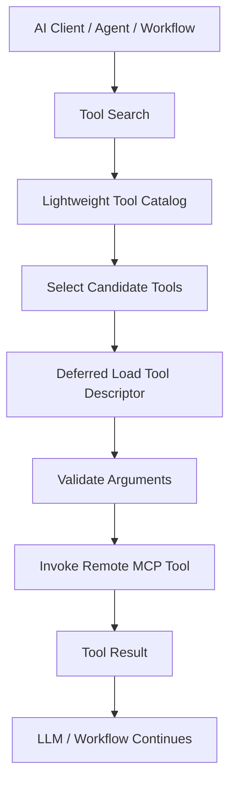
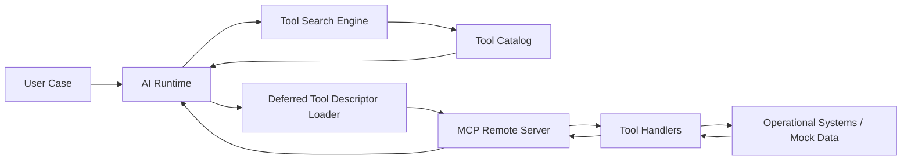
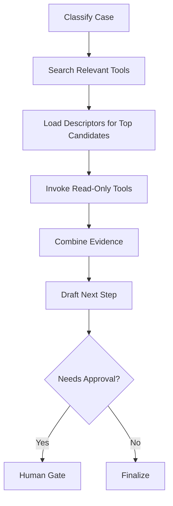

# Semana 07 — MCP, Remote Tools, Tool Search y Deferred Loading para Fintech

Perfecto. Vamos con la **Semana 7 completa**, bien explicada, bien aterrizada a **fintech real**, y como si yo fuera tu profesor obsesivo de IA aplicada en producción.

En tu plan, la **Semana 7** es:

- **MCP**
- **remote tools**
- **tool search**
- **deferred tool loading**

y el objetivo es:

> **dominar la conexión estándar moderna entre IA y sistemas externos**,

con un entregable tipo **MCP Integration v1** que incluya:

- un MCP server simple,
- un agente que lo consuma,
- selección dinámica de tools,

y con el checklist de salida centrado en:

- entender la arquitectura MCP,
- saber cuándo conviene MCP vs API directa,
- poder exponer una tool simple,
- entender tool search,
- tener una demo funcional cliente-servidor.

---

# Semana 7 — MCP / Remote Tools / Tool Search / Deferred Tool Loading

## La idea central

Hasta la Semana 6 construiste algo muy poderoso:

- LLM runtime
- structured outputs
- tools
- state y memory
- retrieval y RAG
- graph orchestration con durable execution y HITL

Ahora la pregunta cambia otra vez.

Ya no es solo:

> “¿cómo hago tools?”

Ahora es:

> “¿cómo conecto mi sistema AI con herramientas y recursos externos de una forma estándar, descubrible, gobernada y escalable?”

Ese es el corazón de la Semana 7.

---

# 1. Qué problema resuelve esta semana

Imaginá una fintech real.

Tu sistema AI necesita acceder a:

- estado de transacciones,
- flags de riesgo,
- estado KYC,
- catálogo de productos,
- políticas,
- CRM,
- tickets,
- reglas de dispute,
- límites de crédito,
- eventos operativos,
- documentación interna.

Si hacés todo “a mano”, cada integración termina siendo:

- ad hoc,
- poco reutilizable,
- difícil de descubrir,
- difícil de gobernar,
- difícil de reutilizar entre asistentes, workflows y agentes.

Entonces aparece una necesidad fuerte:

> que herramientas y recursos estén **estandarizados** y **expuestos** de manera uniforme.

Ahí entra MCP como patrón conceptual.

---

# 2. Qué es MCP, explicado sin humo

Te lo voy a explicar de la manera correcta.

**MCP** se puede entender como un **protocolo/patrón de integración** para que un sistema AI consuma **tools**, **resources** y otras capacidades externas de forma consistente.

No lo pienses como “una librería mágica”.

Pensalo como:

> una forma estándar de decirle a un cliente AI:
>
> - qué herramientas existen,
> - cómo se llaman,
> - qué hacen,
> - qué inputs aceptan,
> - qué outputs devuelven,
> - qué recursos están disponibles,
> - y cómo consumir todo eso de forma uniforme.

---

# 3. Qué te resuelve MCP conceptualmente

Sin MCP o sin un patrón equivalente, cada integración queda así:

- un endpoint raro por acá,
- un wrapper distinto por allá,
- tool schemas desalineados,
- naming inconsistente,
- poco descubrimiento,
- poca gobernanza.

Con MCP, o con una arquitectura inspirada en MCP, ganás:

- estandarización,
- descubrimiento,
- catálogo de capacidades,
- menor acoplamiento,
- mejor interoperabilidad,
- mejor reutilización,
- mejor auditabilidad.

---

# 4. Qué componentes conceptuales tiene MCP

Aunque distintas implementaciones concretas puedan variar, el modelo mental útil tiene estos bloques:

## A. Cliente

El consumidor AI:

- agente,
- workflow,
- assistant runtime,
- orquestador.

## B. Server

El que expone capacidades al cliente.

## C. Tools

Funciones accionables o consultivas.

## D. Resources

Información accesible como recurso.

## E. Schemas / contratos

Definen inputs/outputs.

## F. Discovery

Cómo el cliente sabe qué existe.

## G. Invocation

Cómo llama una tool.

## H. Result handling

Cómo recibe el resultado.

---

# 5. Diferencia entre tool y resource

Este punto es fundamental y mucha gente lo mezcla.

## Tool

Una **tool** es algo que el sistema puede **invocar** para hacer o consultar algo.

Ejemplos fintech:

- `get_transaction_status`
- `get_customer_risk_flags`
- `create_dispute_draft`
- `get_kyc_status`

## Resource

Un **resource** es algo que el sistema puede **leer** o consultar como fuente.

Ejemplos fintech:

- política de cargos duplicados
- catálogo de estados KYC
- tabla de reasons de fraude
- manual operativo de soporte

## Regla simple

- tool = acción o consulta parametrizada
- resource = información o asset accesible

---

# 6. Qué es un MCP server

Un **MCP server** es el componente que expone esas capacidades.

No significa necesariamente “un servidor público en internet”.
Puede ser:

- proceso local,
- servicio interno,
- gateway,
- adapter,
- service container,
- microservicio,
- proxy a sistemas legacy.

Su rol es exponer:

- tools,
- resources,
- descripciones,
- contratos.

---

# 7. Qué es un MCP client

El **MCP client** es el consumidor de esas capacidades.

En tu caso, podría ser:

- un runtime LLM,
- un graph workflow,
- un agente,
- un orchestration layer.

El cliente necesita poder:

- descubrir tools,
- entender su contrato,
- decidir cuál usar,
- ejecutar,
- manejar errores,
- interpretar resultados.

---

# 8. Por qué esto es importante en fintech

Porque una fintech seria no tiene una sola integración.
Tiene decenas.

Y si cada asistente o workflow implementa sus propias integraciones “custom”:

- se duplica trabajo,
- se rompe gobernanza,
- se vuelve difícil asegurar controles,
- se dificulta seguridad,
- cuesta más mantener.

MCP o el patrón equivalente te ayuda a construir:

> una **capa de capacidades compartidas** para IA.

Eso es una diferencia estratégica fuerte.

---

# 9. Cuándo conviene MCP vs API directa

Este punto aparece en tu checklist y es clave.

## Conviene API directa cuando:

- la integración es muy simple,
- hay una sola capacidad,
- no hay necesidad de discovery,
- no va a ser reutilizada,
- el tiempo/valor favorece simplicidad.

## Conviene MCP o patrón equivalente cuando:

- hay muchas tools,
- varios clientes AI van a consumirlas,
- querés tool search,
- querés contratos estandarizados,
- querés desacoplar cliente de backend,
- querés gobernanza de catálogo,
- querés evolutividad.

## Regla práctica

- **1 o 2 integraciones muy simples**: API directa puede estar bien.
- **Plataforma AI con varias capacidades compartidas**: MCP-style architecture gana.

---

# 10. Qué son remote tools

Una **remote tool** es una tool que no vive dentro del mismo proceso del agente o runtime.

Ejemplo:
Tu agente corre en un servicio AI y la tool vive en:

- otro microservicio,
- otro proceso,
- otro contenedor,
- otra cuenta,
- otra red.

## Ventajas

- desacoplamiento,
- reuso,
- ownership claro,
- mejor seguridad por boundary,
- despliegue independiente,
- escalado separado.

## Costos

- red,
- latencia,
- autenticación,
- manejo de errores,
- versionado,
- observabilidad más compleja.

---

# 11. Tool search

Este es otro concepto central de la semana.

**Tool search** significa que el cliente no viene con una lista fija y “hardcodeada” de herramientas en la cabeza, sino que puede:

- descubrir,
- buscar,
- filtrar,
- seleccionar,

una tool adecuada a la tarea.

## Ejemplo

El cliente recibe:

> “El usuario no reconoce una compra internacional y quiere saber el siguiente paso.”

El runtime podría buscar tools relacionadas con:

- transacciones,
- fraude,
- risk flags,
- disputas.

Y elegir:

- `get_customer_risk_flags`
- `get_transaction_status`

según metadata del catálogo.

---

# 12. Por qué tool search es importante

Porque cuando el catálogo crece, el approach de:

```ts
if (...) useToolA
else if (...) useToolB
else if (...) useToolC
```

se vuelve insuficiente.

Necesitás:

- catálogo,
- tags,
- dominios,
- scopes,
- descripciones,
- ranking,
- filtros.

Eso transforma un conjunto de funciones sueltas en una **plataforma de capacidades**.

---

# 13. Deferred tool loading

Este concepto es muy importante y muy útil.

**Deferred tool loading** significa:

> no cargar todas las tools y todos sus detalles desde el inicio, sino traerlas cuando realmente hacen falta.

## Por qué sirve

Porque en sistemas grandes:

- puede haber cientos de tools,
- no todas aplican a todos los casos,
- cargar todo de entrada mete ruido,
- aumenta costo de contexto,
- complica selección,
- puede exponer más superficie de ataque.

## Patrón correcto

1. cargar catálogo liviano
2. buscar candidatos
3. expandir detalles de pocas tools
4. invocar solo las relevantes

Eso es escalable.

---

# 14. Tool catalog liviano vs descriptor completo

## Catálogo liviano

Tiene:

- nombre,
- dominio,
- descripción corta,
- tags,
- nivel de riesgo,
- summary de inputs.

Sirve para discovery y ranking.

## Descriptor completo

Tiene:

- schema completo,
- validaciones,
- auth/scope,
- ejemplos,
- errores,
- policy notes,
- versión.

Sirve cuando ya vas a usar la tool.

## Regla práctica

Deferred loading = primero catálogo liviano, después descriptor completo.

---

# 15. Arquitectura mental correcta de la Semana 7



Eso es exactamente lo que querés dominar.

---

# 16. Qué debe tener un buen catálogo de tools

## Campos recomendados

- `name`
- `title`
- `description`
- `domain`
- `tags`
- `riskLevel`
- `inputSummary`
- `requiresApproval`
- `readOnly`
- `version`
- `owner`
- `availability`

## En fintech agregaría

- `productScope`
- `countryScope`
- `dataSensitivity`
- `complianceNotes`
- `allowedActors`
- `slaTier`

Porque no da lo mismo una tool que:

- lee un FAQ,
- que una tool que consulta fraude,
- que una que prepara una disputa.

---

# 17. Qué debe tener una buena tool remota

## 1. Nombre claro

Ejemplo:
`get_transaction_status`

## 2. Descripción precisa

Qué hace, cuándo usarla y qué no hace.

## 3. Input schema formal

Con validaciones.

## 4. Output estable

No cambiar formato sin control.

## 5. Errores tipificados

- not_found
- unauthorized
- timeout
- invalid_input

## 6. Riesgo declarado

- read_only
- draft
- sensitive_action

## 7. Owner claro

Qué equipo la mantiene.

## 8. Versionado

No romper clientes al evolucionar.

---

# 18. Diseño de seguridad en fintech para MCP/tools remotas

Esto es crítico.

## Principios clave

- mínimo privilegio
- scopes por tool
- separación lectura vs acción
- validación de input
- validación de output
- approval gates para acciones sensibles
- observabilidad
- rate limit
- versionado y ownership

## Regla fuerte

Una tool sensible no debería ser simplemente “visible” para cualquier cliente AI.

Debe estar:

- scopiada,
- autorizada,
- eventualmente aprobada,
- y auditada.

---

# 19. Qué tipo de tools expondría primero en una fintech

Yo arrancaría por estas capas:

## Capa 1 — Read-only seguras

- `get_transaction_status`
- `get_customer_risk_flags`
- `get_kyc_status`
- `get_product_policy_summary`

## Capa 2 — Draft / preparatorias

- `create_dispute_draft`
- `build_support_summary`
- `prepare_kyc_review_note`

## Capa 3 — Sensibles con gate

- `submit_dispute`
- `request_card_block`
- `request_limit_change_review`

La Semana 7 debería concentrarse fuerte en Capa 1 y Capa 2.

---

# 20. Cómo se ve un flujo bien diseñado con MCP

## Ejemplo

Caso:

> “No reconozco una compra internacional y recibí un SMS que no aprobé.”

### Flujo

1. cliente AI clasifica el caso
2. busca tools relevantes en catálogo
3. encuentra tools de `fraud` y `payments`
4. carga detalle de:
   - `get_transaction_status`
   - `get_customer_risk_flags`
5. valida argumentos
6. invoca tools remotas
7. combina resultados
8. sigue el workflow

Eso ya es plataforma AI seria.

---

# 21. Qué diferencia hay entre tool registry y tool search

## Tool registry

Es el lugar donde están registradas.

## Tool search

Es la capacidad del cliente de encontrarlas inteligentemente.

Uno es almacenamiento/catálogo.
El otro es descubrimiento/selección.

---

# 22. Qué rol cumple el schema en esta semana

Esta semana hereda muchísimo de la Semana 2.

Porque si querés tools remotas bien hechas, necesitás:

- contratos claros,
- inputs validados,
- outputs estables,
- errors tipificados.

Entonces esta semana usa:

- structured thinking,
- schemas,
- tools,
- pero a escala de plataforma.

---

# 23. Qué rol cumple el graph de la Semana 6

También conecta muy fuerte con la Semana 6.

Porque ahora, dentro de un graph workflow, en vez de tener tools locales “in-process”, podés tener:

- herramientas remotas descubribles,
- catálogos,
- deferred loading,
- selección dinámica.

Eso hace el sistema mucho más escalable.

---

# 24. Caso fintech que vamos a modelar

Vamos a trabajar con este caso:

## Caso

Cliente reporta una compra internacional no reconocida.

El sistema necesita:

- buscar tools relevantes,
- cargar detalles de pocas tools,
- consultar estado transaccional,
- consultar risk flags,
- preparar borrador de próximo paso.

Es perfecto porque mezcla:

- MCP
- remote tools
- tool search
- deferred loading
- software usable

---

# 25. Diseño conceptual del sistema



---

# 26. Qué vamos a construir en código

Un mini proyecto llamado:

## `MCP Integration v1`

con:

- un **Tool Catalog**
- un **Tool Search Engine**
- un **Deferred Tool Loader**
- un **MCP-like Remote Server**
- un **Client**
- 3 tools fintech
- validación de inputs
- demo end-to-end

---

# 27. Estructura del proyecto

```text
week7-mcp-integration-fintech/
├─ src/
│  ├─ types.ts
│  ├─ toolCatalog.ts
│  ├─ toolSearch.ts
│  ├─ descriptorLoader.ts
│  ├─ mcpServer.ts
│  ├─ mcpClient.ts
│  ├─ validators.ts
│  ├─ tools/
│  │  ├─ getTransactionStatus.ts
│  │  ├─ getCustomerRiskFlags.ts
│  │  └─ createDisputeDraft.ts
│  └─ main.ts
```

---

# 28. Código — tipos base

## `src/types.ts`

```ts
export type ToolRiskLevel = "read_only" | "draft" | "sensitive";

export interface ToolCatalogEntry {
  name: string;
  title: string;
  description: string;
  domain: "payments" | "fraud" | "kyc" | "support";
  tags: string[];
  riskLevel: ToolRiskLevel;
  readOnly: boolean;
  requiresApproval: boolean;
  version: string;
}

export interface ToolDescriptor extends ToolCatalogEntry {
  inputSchema: {
    type: "object";
    required: string[];
    properties: Record<string, { type: string; enum?: string[]; description?: string }>;
  };
  outputDescription: string;
}

export interface ToolInvocationRequest {
  toolName: string;
  arguments: Record<string, unknown>;
}

export interface ToolInvocationResponse {
  success: boolean;
  toolName: string;
  data?: Record<string, unknown>;
  error?: string;
}
```

---

# 29. Catálogo liviano

## `src/toolCatalog.ts`

```ts
import { ToolCatalogEntry } from "./types";

export const toolCatalog: ToolCatalogEntry[] = [
  {
    name: "get_transaction_status",
    title: "Get Transaction Status",
    description: "Consults the operational status of a customer transaction.",
    domain: "payments",
    tags: ["transaction", "payments", "status", "card"],
    riskLevel: "read_only",
    readOnly: true,
    requiresApproval: false,
    version: "1.0.0"
  },
  {
    name: "get_customer_risk_flags",
    title: "Get Customer Risk Flags",
    description: "Returns risk indicators related to the customer profile.",
    domain: "fraud",
    tags: ["fraud", "risk", "customer", "flags"],
    riskLevel: "read_only",
    readOnly: true,
    requiresApproval: false,
    version: "1.0.0"
  },
  {
    name: "create_dispute_draft",
    title: "Create Dispute Draft",
    description: "Creates a dispute draft without submitting the final dispute.",
    domain: "support",
    tags: ["dispute", "draft", "chargeback", "support"],
    riskLevel: "draft",
    readOnly: false,
    requiresApproval: false,
    version: "1.0.0"
  }
];
```

---

# 30. Tool search

## `src/toolSearch.ts`

```ts
import { ToolCatalogEntry } from "./types";

function scoreEntry(query: string, entry: ToolCatalogEntry): number {
  const q = query.toLowerCase();

  let score = 0;

  if (q.includes(entry.domain)) score += 2;

  for (const tag of entry.tags) {
    if (q.includes(tag.toLowerCase())) score += 1.5;
  }

  if (q.includes("fraude") && entry.domain === "fraud") score += 2;
  if (q.includes("compra") && entry.domain === "payments") score += 1;
  if (q.includes("disputa") && entry.name === "create_dispute_draft") score += 2;

  return score;
}

export class ToolSearchEngine {
  constructor(private readonly catalog: ToolCatalogEntry[]) {}

  search(query: string, topK = 3): ToolCatalogEntry[] {
    return [...this.catalog]
      .map((entry) => ({
        entry,
        score: scoreEntry(query, entry)
      }))
      .filter((item) => item.score > 0)
      .sort((a, b) => b.score - a.score)
      .slice(0, topK)
      .map((item) => item.entry);
  }
}
```

---

# 31. Deferred descriptor loading

## `src/descriptorLoader.ts`

```ts
import { ToolDescriptor } from "./types";

const DESCRIPTORS: Record<string, ToolDescriptor> = {
  get_transaction_status: {
    name: "get_transaction_status",
    title: "Get Transaction Status",
    description: "Consults the operational status of a customer transaction.",
    domain: "payments",
    tags: ["transaction", "payments", "status", "card"],
    riskLevel: "read_only",
    readOnly: true,
    requiresApproval: false,
    version: "1.0.0",
    inputSchema: {
      type: "object",
      required: ["transactionId", "customerId"],
      properties: {
        transactionId: { type: "string", description: "Unique transaction identifier" },
        customerId: { type: "string", description: "Unique customer identifier" }
      }
    },
    outputDescription: "Returns transaction status, merchant and amount."
  },

  get_customer_risk_flags: {
    name: "get_customer_risk_flags",
    title: "Get Customer Risk Flags",
    description: "Returns risk indicators related to the customer profile.",
    domain: "fraud",
    tags: ["fraud", "risk", "customer", "flags"],
    riskLevel: "read_only",
    readOnly: true,
    requiresApproval: false,
    version: "1.0.0",
    inputSchema: {
      type: "object",
      required: ["customerId"],
      properties: {
        customerId: { type: "string", description: "Unique customer identifier" }
      }
    },
    outputDescription: "Returns fraud-related customer risk indicators."
  },

  create_dispute_draft: {
    name: "create_dispute_draft",
    title: "Create Dispute Draft",
    description: "Creates a dispute draft without submitting the final dispute.",
    domain: "support",
    tags: ["dispute", "draft", "chargeback", "support"],
    riskLevel: "draft",
    readOnly: false,
    requiresApproval: false,
    version: "1.0.0",
    inputSchema: {
      type: "object",
      required: ["customerId", "transactionId", "reason"],
      properties: {
        customerId: { type: "string" },
        transactionId: { type: "string" },
        reason: {
          type: "string",
          enum: ["duplicate_charge", "fraud_report", "service_not_received"]
        }
      }
    },
    outputDescription: "Returns dispute draft identifier and status."
  }
};

export class DeferredToolDescriptorLoader {
  load(toolName: string): ToolDescriptor {
    const descriptor = DESCRIPTORS[toolName];
    if (!descriptor) {
      throw new Error(`Descriptor no encontrado para tool: ${toolName}`);
    }
    return descriptor;
  }
}
```

---

# 32. Validación de argumentos

## `src/validators.ts`

```ts
import { ToolDescriptor } from "./types";

export function validateToolArguments(
  descriptor: ToolDescriptor,
  args: Record<string, unknown>
): void {
  const required = descriptor.inputSchema.required;

  for (const field of required) {
    if (!(field in args)) {
      throw new Error(`Falta campo requerido: ${field}`);
    }
  }

  for (const [key, schema] of Object.entries(descriptor.inputSchema.properties)) {
    const value = args[key];
    if (value === undefined) continue;

    if (schema.type === "string" && typeof value !== "string") {
      throw new Error(`Campo ${key} debe ser string`);
    }

    if (schema.enum && typeof value === "string" && !schema.enum.includes(value)) {
      throw new Error(`Campo ${key} debe ser uno de: ${schema.enum.join(", ")}`);
    }
  }
}
```

---

# 33. Tools fintech

## `src/tools/getTransactionStatus.ts`

```ts
export async function getTransactionStatus(args: Record<string, unknown>) {
  return {
    transactionId: args.transactionId,
    customerId: args.customerId,
    status: "posted",
    amount: 48200,
    currency: "ARS",
    merchant: "Carrefour",
    possibleDuplicate: false
  };
}
```

## `src/tools/getCustomerRiskFlags.ts`

```ts
export async function getCustomerRiskFlags(args: Record<string, unknown>) {
  return {
    customerId: args.customerId,
    accountTakeoverRisk: "medium",
    recentDeviceChange: true,
    recentPasswordReset: false,
    unusualGeography: true
  };
}
```

## `src/tools/createDisputeDraft.ts`

```ts
export async function createDisputeDraft(args: Record<string, unknown>) {
  return {
    draftId: "disp_draft_001",
    customerId: args.customerId,
    transactionId: args.transactionId,
    reason: args.reason,
    status: "draft_created"
  };
}
```

---

# 34. MCP-like remote server

## `src/mcpServer.ts`

```ts
import { ToolInvocationRequest, ToolInvocationResponse } from "./types";
import { getTransactionStatus } from "./tools/getTransactionStatus";
import { getCustomerRiskFlags } from "./tools/getCustomerRiskFlags";
import { createDisputeDraft } from "./tools/createDisputeDraft";

export class MCPRemoteServer {
  async invoke(request: ToolInvocationRequest): Promise<ToolInvocationResponse> {
    try {
      switch (request.toolName) {
        case "get_transaction_status":
          return {
            success: true,
            toolName: request.toolName,
            data: await getTransactionStatus(request.arguments)
          };

        case "get_customer_risk_flags":
          return {
            success: true,
            toolName: request.toolName,
            data: await getCustomerRiskFlags(request.arguments)
          };

        case "create_dispute_draft":
          return {
            success: true,
            toolName: request.toolName,
            data: await createDisputeDraft(request.arguments)
          };

        default:
          return {
            success: false,
            toolName: request.toolName,
            error: "Tool no soportada"
          };
      }
    } catch (error) {
      return {
        success: false,
        toolName: request.toolName,
        error: (error as Error).message
      };
    }
  }
}
```

---

# 35. MCP client

## `src/mcpClient.ts`

```ts
import { DeferredToolDescriptorLoader } from "./descriptorLoader";
import { MCPRemoteServer } from "./mcpServer";
import { ToolSearchEngine } from "./toolSearch";
import { ToolInvocationResponse } from "./types";
import { toolCatalog } from "./toolCatalog";
import { validateToolArguments } from "./validators";

export class MCPClient {
  private readonly searchEngine = new ToolSearchEngine(toolCatalog);
  private readonly descriptorLoader = new DeferredToolDescriptorLoader();

  constructor(private readonly server: MCPRemoteServer) {}

  searchTools(query: string) {
    return this.searchEngine.search(query);
  }

  async invokeTool(toolName: string, args: Record<string, unknown>): Promise<ToolInvocationResponse> {
    const descriptor = this.descriptorLoader.load(toolName);
    validateToolArguments(descriptor, args);

    return this.server.invoke({
      toolName,
      arguments: args
    });
  }
}
```

---

# 36. Demo end-to-end

## `src/main.ts`

```ts
import { MCPClient } from "./mcpClient";
import { MCPRemoteServer } from "./mcpServer";

async function main() {
  const server = new MCPRemoteServer();
  const client = new MCPClient(server);

  const userCase =
    "Cliente no reconoce una compra internacional y recibió un SMS que no aprobó. Quiere saber qué pasó y cuál sería el próximo paso.";

  console.log("=== TOOL SEARCH ===");
  const tools = client.searchTools(userCase);
  console.log(tools);

  console.log("\n=== DEFERRED LOAD + INVOCATION ===");

  const txResult = await client.invokeTool("get_transaction_status", {
    transactionId: "txn_001",
    customerId: "cust_001"
  });
  console.log(txResult);

  const riskResult = await client.invokeTool("get_customer_risk_flags", {
    customerId: "cust_001"
  });
  console.log(riskResult);

  const draftResult = await client.invokeTool("create_dispute_draft", {
    customerId: "cust_001",
    transactionId: "txn_001",
    reason: "fraud_report"
  });
  console.log(draftResult);
}

main().catch(console.error);
```

---

# 37. Qué enseña este código

Este código, aunque simple, ya te enseña todo lo más importante de la semana:

## MCP-style architecture

Porque separa:

- catálogo,
- discovery,
- descriptor loading,
- validación,
- server remoto,
- cliente.

## Remote tools

Porque las tools viven detrás del server.

## Tool search

Porque el cliente busca herramientas según el caso.

## Deferred tool loading

Porque el descriptor completo solo se carga cuando la tool se va a usar.

## Gobernanza

Porque todo pasa por:

- descriptor,
- schema,
- validador,
- server.

Eso ya es una base muy buena de **MCP Integration v1**.

---

# 38. Cómo se ve el mismo patrón en un graph fintech

Esta semana se integra perfecto con la Semana 6.



Eso es exactamente cómo una capa MCP-friendly se enchufa a un workflow serio.

---

# 39. Qué mejorarías en producción

## A. Auth real

- service identity
- scopes
- JWT m2m
- IAM
- API keys rotadas
- allowlists por cliente

## B. Timeouts y retries

- policy por tool
- retry solo en read-only idempotentes

## C. Observabilidad

- tool search logs
- invocation logs
- descriptor load metrics
- latencia por tool
- tasa de errores

## D. Versionado

- tool version
- schema version
- deprecation policy

## E. Approval gating

Para tools sensibles.

## F. Rate limits

Especialmente si varias runtimes consumen el mismo catálogo.

## G. Tool relevance scoring más serio

- embeddings para tool search
- keyword + semantic ranking
- domain filters
- user intent classification

---

# 40. Cómo pensar tool search bien

Una idea fuerte:

> no toda tool elegible debería estar visible ni rankear igual.

Tool search serio debería considerar:

- intención del caso
- dominio
- producto
- país
- permisos del actor
- nivel de riesgo
- disponibilidad
- etapa del flujo

En una fintech madura, tool search no es solo texto → tool.
Es texto + contexto + policy.

---

# 41. Cómo pensar deferred loading bien

Otra idea importante:

> el catálogo liviano es para descubrir; el descriptor completo es para ejecutar.

No conviene pasarle al modelo o al runtime desde el inicio:

- 100 tools completas,
- schemas gigantes,
- policies largas,
- ejemplos de todas.

Conviene:

1. descubrir
2. reducir
3. expandir pocas
4. ejecutar

Eso reduce:

- costo,
- ruido,
- complejidad,
- superficie de error.

---

# 42. Ejercicios prácticos — lunes a sábado

## Lunes — Fundamentos MCP

### Ejercicio 1

Explicá con tus palabras la diferencia entre:

- cliente
- server
- tool
- resource

### Qué aprendés

A fijar el modelo mental correcto.

### Ejercicio 2

Hacé una tabla con:

- capacidad
- es tool o resource
- dominio
- riesgo

Usando estos ejemplos:

- política de chargeback
- get transaction status
- create dispute draft
- KYC states catalog

---

## Martes — Servers, clients, resources, tools

### Ejercicio 3

Diseñá un catálogo de 5 capacidades fintech y clasificá:

- dominio
- readOnly
- requiresApproval
- riskLevel

### Ejercicio 4

Agregá un resource además de las tools:

- `resource://policies/duplicate-charge`

Y hacé una función simple para leerlo.

### Qué aprendés

A separar acción de conocimiento.

---

## Miércoles — Remote MCP

### Ejercicio 5

Simulá que `MCPRemoteServer` falla en `get_customer_risk_flags`.

### Qué hacer

Devolver:

- `success: false`
- error tipificado

### Qué aprendés

Que remote tool = red + error + resiliencia.

### Ejercicio 6

Agregá latencia artificial con `setTimeout()` y medí tiempos por tool.

---

## Jueves — Tool search

### Ejercicio 7

Probá estas consultas:

1. “No reconozco una compra internacional”
2. “Necesito el estado de una transacción”
3. “Quiero iniciar una disputa”
4. “La cuenta quedó en revisión por documento”

### Qué observar

Qué tools rankean arriba y por qué.

### Qué aprendés

A tunear discovery y no solo invocación.

---

## Viernes — Deferred tool loading

### Ejercicio 8

Medí cuántas tools del catálogo total cargás realmente en cada caso.

### Objetivo

Que no cargues más de 1–3 descriptores por caso.

### Qué aprendés

Que escalabilidad no es cargar todo.

---

## Sábado — Mini proyecto `MCP Integration v1`

### Objetivo formal

Construir:

- un MCP server simple
- un agente/cliente que lo consuma
- selección dinámica de tools

### Requisitos

- catálogo
- search
- deferred loading
- validación
- invocation
- demo end-to-end

---

# 43. Ejercicios extra de nivel fuerte

## Ejercicio 9 — Tool search con scoring híbrido

Mejorá `ToolSearchEngine` para combinar:

- keyword match
- tags
- domain prior
- risk penalty

## Ejercicio 10 — Policy-aware search

No permitas que una tool `draft` se sugiera si el flujo actual está marcado como `read_only_only`.

## Ejercicio 11 — Versioning

Agregá:

```ts
version: "1.1.0"
deprecated: false
replacementTool?: string
```

## Ejercicio 12 — Scope enforcement

Hacé que el cliente tenga permisos:

- `payments:read`
- `fraud:read`
- `support:draft`

Y que no pueda invocar tools fuera de scope.

---

# 44. Qué deberías saber explicar al terminar la semana

## 1

Qué problema resuelve MCP o una arquitectura MCP-style.

## 2

Qué diferencia hay entre tool y resource.

## 3

Qué diferencia hay entre API directa y MCP/patrón equivalente.

## 4

Qué son remote tools.

## 5

Qué es tool search y por qué importa.

## 6

Qué es deferred tool loading y por qué escala mejor.

## 7

Cómo diseñar un catálogo de tools serio.

## 8

Cómo integrar esto con un workflow de fintech.

Si podés explicar eso con claridad, la semana está incorporada.

---

# 45. Errores clásicos de esta semana

## Error 1

Usar MCP/patrón complejo cuando una API directa bastaba.

## Error 2

No separar catálogo liviano de descriptor completo.

## Error 3

No validar inputs antes de invocar.

## Error 4

No separar read-only de draft/sensitive.

## Error 5

No pensar scopes ni permisos.

## Error 6

Hacer tool search sin metadata útil.

## Error 7

Cargar todas las tools siempre.

---

# 46. Cómo conecta con las semanas anteriores

Esta semana sintetiza varias anteriores:

- Semana 2: structured outputs y tools
- Semana 3: state/memory
- Semana 6: graphs y approval gates

Ahora ya no pensás tools como “funciones internas”, sino como **capacidades remotas, descubribles y gobernadas**.

Eso es un salto de madurez importante.

---

# 47. Cómo prepara las semanas siguientes

La Semana 7 te prepara perfecto para:

- evaluación de tools a escala
- observabilidad por tool y por catálogo
- seguridad AI más seria
- tool routing avanzado
- agents con mayor superficie operativa
- plataformas AI internas reutilizables

Es una semana muy estratégica.

---

# 48. Resumen maestro de la Semana 7

Quiero que te quede grabado así:

> Semana 7 no es “usar una moda nueva”.
> Semana 7 es aprender a construir una **capa estándar de capacidades** para IA: herramientas y recursos remotos, descubribles, versionados, validados y cargados bajo demanda.

La secuencia correcta es:

1. diseñar catálogo
2. etiquetar tools
3. implementar search
4. cargar descriptor bajo demanda
5. validar argumentos
6. invocar tool remota
7. interpretar resultado
8. gobernar permisos y riesgo
9. conectar con workflows/agents
10. mantener todo observable y versionado

Ese es el corazón de un **MCP Integration v1** serio para fintech.

---

# 49. Entregable final ideal de tu Semana 7

Tu proyecto debería cerrar con:

- `ToolCatalog`
- `ToolSearchEngine`
- `DeferredToolDescriptorLoader`
- `MCPRemoteServer`
- `MCPClient`
- `3 tools fintech`
- validación de argumentos
- demo end-to-end
- README con diagrama del flujo

Eso cumple perfectamente el espíritu de la Semana 7.

En el próximo paso te lo convierto en **repo GitHub + ZIP completo de la Semana 7**, en **español e inglés**, con README, docs, diagramas, código, tests y estructura lista para subir.