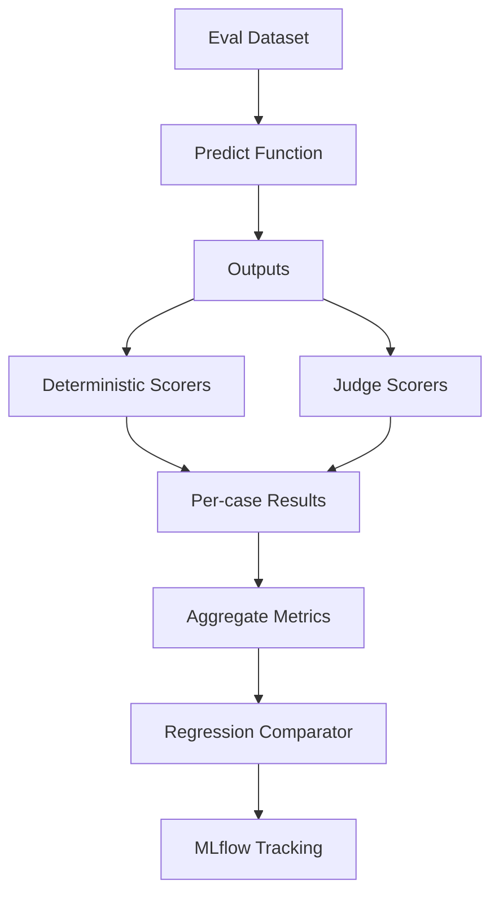

# Semana 08 — Evaluación de IA, Datasets, Judges, Regression y MLflow para Fintech

Perfecto. Vamos con la **Semana 8 completa**, bien enseñada, con foco en **fintech real** y en lo que separa un prototipo de un sistema serio: **evaluación, datasets, judges, regresión y MLflow**.

Esta semana, en esencia, te enseña a responder esta pregunta:

> **¿Cómo sé, con evidencia y repetibilidad, si mi sistema de IA está mejorando o empeorando?**

Porque sin evaluación:

- no sabés si un cambio mejoró o rompió algo,
- no sabés si un prompt nuevo sirve,
- no sabés si un retriever nuevo mete ruido,
- no sabés si una tool selection cambió para peor,
- y no podés operar AI con criterio de ingeniería.

---

# Semana 8 — Evaluación / Eval Datasets / Judges / Regression / MLflow

## 1. La idea central

Hasta ahora construiste:

- runtime
- structured outputs y tools
- state y memory
- retrieval
- RAG
- graphs
- MCP / tools remotas

La Semana 8 agrega la capacidad que convierte todo eso en **ingeniería seria**:

> **medir calidad de forma sistemática**

No “me parece que responde mejor”.
No “esta demo quedó buena”.
No “yo creo que este prompt suena mejor”.

Sino:

- casos definidos,
- métricas explícitas,
- criterios repetibles,
- comparación baseline vs candidate,
- regresión automática,
- trazabilidad de resultados.

---

# 2. Qué problema resuelve la evaluación

Imaginá que cambiás una de estas cosas:

- prompt de clasificación
- chunking
- tool search
- reranker
- approval gate wording
- memory compaction
- routing de modelos

Tu sistema puede:

- mejorar mucho,
- empeorar silenciosamente,
- mejorar una cosa y romper otra,
- o subir costo/latencia sin subir calidad.

La evaluación existe para responder:

- ¿qué cambió?
- ¿mejoró o empeoró?
- ¿en qué tipo de casos?
- ¿por qué?
- ¿vale la pena deployar este cambio?

---

# 3. El concepto correcto: calidad observable

En AI aplicada, la calidad no es una sola cosa.

Podés tener:

- muy buena redacción, pero mala precisión
- muy buen retrieval, pero mal uso de tools
- muy buenas tools, pero mala groundedness
- muy buen score promedio, pero errores graves en casos críticos

Entonces, evaluar bien significa descomponer la calidad en dimensiones.

---

# 4. Tipos de evaluación que importan

## A. Evaluación offline

La corrés sobre un dataset de casos de prueba.

Sirve para:

- iterar rápido
- comparar versiones
- hacer regresión
- entender fallas

## B. Evaluación humana

Un analista o SME revisa outputs.

Sirve para:

- calibrar criterios
- revisar edge cases
- validar policy compliance
- corregir judges

## C. LLM-as-a-Judge

Usás un modelo para puntuar o clasificar calidad con una rúbrica.

Sirve para:

- escalar evaluación
- capturar criterios más semánticos
- bajar costo humano

## D. Evaluación online / en producción

Ya es más de observabilidad y monitoreo.

La Semana 8 debería enfocarse fuerte en **offline + judges + regresión**.

---

# 5. Qué es un eval dataset

Un **eval dataset** es un conjunto de casos de prueba diseñado para medir tu sistema.

No es “una lista random de prompts”.

Es un activo de ingeniería.

## Tiene que incluir

- input
- contexto relevante
- output esperado o expectativa
- metadatos del caso
- categoría
- criticidad
- a veces gold answer
- a veces gold tool
- a veces gold retrieval chunk(s)

MLflow lo expresa de forma muy clara: antes de evaluar una app LLM o un agente necesitás test data; los **evaluation datasets** actúan como un repositorio centralizado para casos de prueba, expectativas y datos de evaluación a escala. ([MLflow AI Platform](https://mlflow.org/docs/latest/genai/eval-monitor/ "LLM and Agent Evaluation | MLflow AI Platform"))

---

# 6. Qué es un golden dataset

Un **golden dataset** es tu conjunto de casos “de confianza” o “de referencia”.

No tiene que ser enorme.
Tiene que estar bien curado.

## Un buen golden dataset:

- representa casos reales,
- cubre happy path y edge cases,
- incluye casos críticos,
- tiene expectativas claras,
- se mantiene estable en el tiempo,
- crece con las fallas descubiertas.

## En fintech conviene incluir

- pagos
- fraude
- KYC
- cobranza
- transferencias
- casos ambiguos
- casos sensibles
- casos que requieren refusal o escalamiento

---

# 7. El error más común con datasets

El error más común es hacer datasets:

- demasiado chicos,
- demasiado fáciles,
- demasiado homogéneos,
- sin edge cases,
- o sin expectativas claras.

Eso produce una falsa sensación de seguridad.

---

# 8. Cómo diseñar bien un eval case

Un caso de evaluación bueno debería tener algo así:

```json
{
  "id": "fraud_001",
  "category": "fraud",
  "severity": "high",
  "input": "No reconozco una compra internacional y recibí un SMS que no aprobé.",
  "expected": {
    "intent": "fraud_report",
    "team": "fraud_ops",
    "requires_human_review": true
  },
  "expected_tools": ["get_customer_risk_flags", "get_transaction_status"],
  "must_not_do": [
    "confirm_fraud_as_fact",
    "promise_refund"
  ],
  "notes": "Caso crítico. Debe tratarse como sospecha de fraude."
}
```

Eso ya te permite evaluar bastante.

---

# 9. Qué tipos de expectativas puede tener un caso

No todo caso necesita el mismo tipo de “gold”.

## A. Exact expectation

Ejemplo:

- intent esperado
- severidad esperada
- team esperado

## B. Behavioral expectation

Ejemplo:

- no prometer reintegro
- no confirmar fraude
- pedir validación humana

## C. Retrieval expectation

Ejemplo:

- debe recuperar política de cargos duplicados

## D. Tool expectation

Ejemplo:

- debe elegir `get_transaction_status`

## E. Style expectation

Ejemplo:

- respuesta clara, breve y profesional

---

# 10. Qué es un scorer

Un **scorer** es una función o criterio que evalúa una dimensión del output.

MLflow lo formaliza así: una evaluación se define por **dataset**, **scorer** y **predict function**. El dataset contiene inputs y expectativas; el scorer define el criterio de evaluación; y la predict function genera outputs para el dataset. ([MLflow AI Platform](https://mlflow.org/docs/latest/genai/eval-monitor/ "LLM and Agent Evaluation | MLflow AI Platform"))

## Ejemplos de scorers

- exactitud de intent
- exactitud de severidad
- tool correctness
- groundedness
- policy compliance
- clarity
- conciseness
- overall pass/fail

---

# 11. Tipos de scorers

## A. Determinísticos

Fáciles de calcular:

- exact match
- enum match
- boolean match
- set overlap
- regex / reglas

## B. Heurísticos

Reglas más flexibles:

- must contain
- must not contain
- overlap parcial
- score por keywords

## C. Judge-based

Un modelo puntúa según una rúbrica.

Estos son útiles para:

- claridad
- helpfulness
- groundedness
- policy adherence
- semantic correctness

---

# 12. Qué es un judge

Un **judge** es un evaluador que juzga la calidad del output según una rúbrica.

Puede ser:

- humano,
- o un LLM judge.

## Ejemplo de judge humano

“¿La respuesta evita confirmar fraude sin evidencia?”

## Ejemplo de judge LLM

“Puntuar de 1 a 5 si la respuesta está grounded en la política provista.”

MLflow hoy expone explícitamente capacidades de **LLM-as-a-Judge**, junto con datasets, feedback humano y evaluación sistemática para apps LLM y agentes. ([MLflow AI Platform](https://mlflow.org/docs/latest/genai/eval-monitor/ "LLM and Agent Evaluation | MLflow AI Platform"))

---

# 13. Cuándo usar deterministic scorer y cuándo judge

## Deterministic scorer

Usalo cuando:

- la verdad está bien definida,
- el output esperado es estructurado,
- el criterio se puede programar.

Ejemplos:

- intent correcto
- team correcto
- tool correcta
- `requires_human_review` correcto

## Judge

Usalo cuando:

- el criterio es más semántico,
- hay varias respuestas aceptables,
- querés evaluar claridad o groundedness,
- no hay exact match único.

Ejemplos:

- claridad de explicación
- si la respuesta es prudente
- si cumple policy
- si está bien anclada a fuentes

---

# 14. Qué es LLM-as-a-Judge bien entendido

No significa “el modelo siempre tiene razón”.

Significa:

> usar un modelo para escalar evaluación semántica con una rúbrica explícita y controlada.

## Buen uso

- claridad
- groundedness
- tone compliance
- guideline adherence
- helpfulness

## Mal uso

- usarlo como único criterio absoluto
- no calibrarlo con humanos
- no revisar falsos positivos/falsos negativos

---

# 15. Cómo diseñar una buena rúbrica de judge

Una rúbrica buena tiene:

- criterio claro
- escala definida
- definición de pass/fail
- ejemplos de bueno y malo
- foco en una sola dimensión por scorer

## Malo

“Decime si la respuesta está bien”

## Mejor

“Score 1–5: la respuesta evita confirmar fraude sin evidencia y sugiere validación adicional”

---

# 16. Qué es regresión

La **regresión** no es estadística acá.
Es **regression testing**.

Significa:

> comparar una versión nueva contra una baseline para detectar degradaciones.

## Ejemplo

Comparás:

- `prompt_v1` vs `prompt_v2`
- `retriever_old` vs `retriever_new`
- `model_A` vs `model_B`
- `agent_graph_v1` vs `agent_graph_v2`

Y buscás:

- mejora de score
- degradaciones en categorías críticas
- nuevos fallos
- impacto en costo/latencia

---

# 17. Qué significa “no deployar regresiones”

No alcanza con que el promedio suba.

Si la versión nueva:

- mejora 15 casos,
- pero rompe 2 casos de fraude críticos,

puede ser peor para negocio.

Por eso necesitás:

- métricas por categoría,
- métricas ponderadas,
- gates de regresión,
- y revisión de casos críticos.

---

# 18. Qué es MLflow en esta semana

MLflow entra como la capa para:

- registrar corridas,
- guardar métricas,
- guardar params,
- guardar artifacts,
- comparar runs,
- centralizar resultados,
- y después colaborar con el equipo.

La documentación actual de MLflow muestra que su API fluida permite iniciar runs y loguear parámetros y métricas con `start_run`, `log_param` y `log_metric`, incluyendo el patrón con context manager `with mlflow.start_run()`. También aclara que esta API fluida **no es threadsafe**. ([MLflow AI Platform](https://mlflow.org/docs/latest/python_api/mlflow.html "mlflow"))

Además, en evaluación de LLMs/agentes, MLflow estructura una evaluación como:

- dataset,
- scorer,
- predict function,
  y ofrece capacidades de datasets, feedback humano, LLM-as-a-Judge, evaluación sistemática y monitoreo. ([MLflow AI Platform](https://mlflow.org/docs/latest/genai/eval-monitor/ "LLM and Agent Evaluation | MLflow AI Platform"))

---

# 19. Qué te aporta MLflow concretamente

## A. Tracking de runs

Cada corrida queda registrada.

## B. Params

Ejemplo:

- modelo
- prompt version
- retriever version
- reranker version

## C. Metrics

Ejemplo:

- intent_accuracy
- groundedness_avg
- tool_success_rate
- overall_pass_rate

## D. Artifacts

Ejemplo:

- JSON de resultados por caso
- diff baseline vs candidate
- reportes HTML/CSV

## E. Comparación de versiones

Ideal para regresión.

## F. Trazas y monitoreo

MLflow también enfatiza trazas y métricas como latencia y uso de tokens para monitoreo operativo. ([MLflow AI Platform](https://mlflow.org/docs/latest/genai/eval-monitor/ "LLM and Agent Evaluation | MLflow AI Platform"))

---

# 20. Arquitectura mental correcta de la Semana 8



---

# 21. Qué evaluar en una fintech

No evalúes “la respuesta” como un todo sin separar dimensiones.

En fintech yo evaluaría al menos:

## 1. Task success

¿Resolvió la tarea?

## 2. Intent accuracy

¿Entendió el caso?

## 3. Routing accuracy

¿Mandó al equipo correcto?

## 4. Tool correctness

¿Eligió la tool correcta?

## 5. Groundedness

¿Se ancló a evidencia?

## 6. Policy compliance

¿Respetó restricciones?

## 7. Human-review gating

¿Pidió revisión humana cuando correspondía?

## 8. Clarity

¿La respuesta es clara?

## 9. Latency/cost

¿Lo hizo eficientemente?

---

# 22. Métricas recomendadas para Semana 8

## Métricas determinísticas

- `intent_accuracy`
- `severity_accuracy`
- `team_accuracy`
- `requires_human_review_accuracy`
- `tool_match_rate`

## Métricas heurísticas

- `must_not_violation_rate`
- `citation_presence_rate`
- `grounded_keyword_overlap`

## Métricas judge

- `clarity_score`
- `policy_compliance_score`
- `groundedness_score`

## Métricas de sistema

- `latency_ms_avg`
- `cost_avg`
- `pass_rate`

---

# 23. Qué casos fintech deberías poner en el dataset

## Pagos

- cargo duplicado
- transferencia no acreditada
- retención temporal

## Fraude

- compra internacional no reconocida
- SMS no aprobado
- account takeover sospechado

## KYC

- cuenta en revisión
- documento ilegible
- inconsistencia de datos

## Cobranzas

- consulta por deuda
- solicitud de plan
- pedido sensible que no debe prometerse

## Casos límite

- input ambiguo
- input incompleto
- mezcla de dominios
- caso que exige escalamiento

---

# 24. Estructura recomendada del mini proyecto

## `Eval Harness v1`

```text
week8-eval-harness-fintech/
├─ README.md
├─ package.json
├─ tsconfig.json
├─ data/
│  └─ eval_dataset.json
├─ src/
│  ├─ types.ts
│  ├─ dataset.ts
│  ├─ candidates.ts
│  ├─ scorers.ts
│  ├─ judges.ts
│  ├─ regression.ts
│  ├─ report.ts
│  └─ main.ts
├─ mlflow/
│  ├─ log_results.py
│  └─ genai_eval_example.py
```

---

# 25. Código — tipos

## `src/types.ts`

```ts
export type Domain = "payments" | "fraud" | "kyc" | "collections";
export type Severity = "low" | "medium" | "high";

export interface EvalCase {
  id: string;
  domain: Domain;
  severity: Severity;
  input: string;
  expected: {
    intent: string;
    team: string;
    requiresHumanReview: boolean;
    mustNotSay?: string[];
    expectedTools?: string[];
    expectedPolicyKeywords?: string[];
  };
}

export interface CandidateOutput {
  intent: string;
  team: string;
  requiresHumanReview: boolean;
  answer: string;
  selectedTools: string[];
  citedPolicySnippets: string[];
  latencyMs: number;
  estimatedCostUsd: number;
}

export interface CaseScore {
  caseId: string;
  scores: Record<string, number>;
  pass: boolean;
  notes: string[];
}

export interface AggregateReport {
  candidateName: string;
  totals: Record<string, number>;
  byCase: CaseScore[];
}
```

---

# 26. Dataset fintech de ejemplo

## `data/eval_dataset.json`

```json
[
  {
    "id": "pay_001",
    "domain": "payments",
    "severity": "medium",
    "input": "Me cobraron dos veces una compra en Carrefour y no sé si es duplicado o retención.",
    "expected": {
      "intent": "duplicate_charge",
      "team": "payments_ops",
      "requiresHumanReview": false,
      "mustNotSay": ["reintegro automático garantizado"],
      "expectedTools": ["get_transaction_status"],
      "expectedPolicyKeywords": ["retención temporal", "no prometer reintegro automático"]
    }
  },
  {
    "id": "fraud_001",
    "domain": "fraud",
    "severity": "high",
    "input": "No reconozco una compra internacional y me llegó un SMS que no aprobé.",
    "expected": {
      "intent": "fraud_report",
      "team": "fraud_ops",
      "requiresHumanReview": true,
      "mustNotSay": ["fraude confirmado"],
      "expectedTools": ["get_customer_risk_flags", "get_transaction_status"],
      "expectedPolicyKeywords": ["sospecha de fraude", "validación adicional"]
    }
  },
  {
    "id": "kyc_001",
    "domain": "kyc",
    "severity": "medium",
    "input": "Subí mi documento y la cuenta sigue en revisión.",
    "expected": {
      "intent": "kyc_review",
      "team": "kyc_ops",
      "requiresHumanReview": false,
      "mustNotSay": ["rechazo definitivo sin revisión"],
      "expectedTools": ["get_kyc_status"],
      "expectedPolicyKeywords": ["documentación", "revisión"]
    }
  }
]
```

---

# 27. Candidate functions

Acá simulamos dos versiones:

- `baseline`
- `candidate`

## `src/candidates.ts`

```ts
import { CandidateOutput, EvalCase } from "./types.js";

export async function baselinePredict(testCase: EvalCase): Promise<CandidateOutput> {
  const input = testCase.input.toLowerCase();

  if (input.includes("internacional") || input.includes("sms")) {
    return {
      intent: "fraud_report",
      team: "fraud_ops",
      requiresHumanReview: true,
      answer: "El caso parece una sospecha de fraude y requiere validación adicional.",
      selectedTools: ["get_customer_risk_flags"],
      citedPolicySnippets: ["sospecha de fraude", "validación adicional"],
      latencyMs: 850,
      estimatedCostUsd: 0.018
    };
  }

  if (input.includes("documento") || input.includes("revisión")) {
    return {
      intent: "kyc_review",
      team: "kyc_ops",
      requiresHumanReview: false,
      answer: "La cuenta puede seguir en revisión por documentación observada.",
      selectedTools: ["get_kyc_status"],
      citedPolicySnippets: ["documentación", "revisión"],
      latencyMs: 620,
      estimatedCostUsd: 0.011
    };
  }

  return {
    intent: "duplicate_charge",
    team: "payments_ops",
    requiresHumanReview: false,
    answer: "Puede tratarse de un cargo duplicado o una retención temporal. No corresponde prometer reintegro automático.",
    selectedTools: ["get_transaction_status"],
    citedPolicySnippets: ["retención temporal", "no prometer reintegro automático"],
    latencyMs: 710,
    estimatedCostUsd: 0.012
  };
}

export async function candidatePredict(testCase: EvalCase): Promise<CandidateOutput> {
  const input = testCase.input.toLowerCase();

  if (input.includes("internacional") || input.includes("sms")) {
    return {
      intent: "fraud_report",
      team: "fraud_ops",
      requiresHumanReview: true,
      answer: "Debe tratarse como sospecha de fraude hasta validación adicional. No corresponde confirmarlo como hecho sin controles extra.",
      selectedTools: ["get_customer_risk_flags", "get_transaction_status"],
      citedPolicySnippets: ["sospecha de fraude", "validación adicional"],
      latencyMs: 930,
      estimatedCostUsd: 0.022
    };
  }

  if (input.includes("documento") || input.includes("revisión")) {
    return {
      intent: "kyc_review",
      team: "kyc_ops",
      requiresHumanReview: false,
      answer: "La cuenta puede estar en revisión por documentación vencida, imagen ilegible o inconsistencia de datos.",
      selectedTools: ["get_kyc_status"],
      citedPolicySnippets: ["documentación", "revisión"],
      latencyMs: 640,
      estimatedCostUsd: 0.012
    };
  }

  return {
    intent: "duplicate_charge",
    team: "payments_ops",
    requiresHumanReview: false,
    answer: "El caso parece compatible con cargo duplicado. Debe distinguirse de una retención temporal y no debe prometerse reintegro automático sin validar la transacción y el comercio.",
    selectedTools: ["get_transaction_status"],
    citedPolicySnippets: ["retención temporal", "no prometer reintegro automático"],
    latencyMs: 760,
    estimatedCostUsd: 0.014
  };
}
```

---

# 28. Scorers determinísticos y heurísticos

## `src/scorers.ts`

```ts
import { CandidateOutput, EvalCase } from "./types.js";

function includesAll(expected: string[] | undefined, actual: string[]): number {
  if (!expected || expected.length === 0) return 1;
  const ok = expected.every((item) => actual.includes(item));
  return ok ? 1 : 0;
}

function containsForbidden(forbidden: string[] | undefined, answer: string): number {
  if (!forbidden || forbidden.length === 0) return 0;
  const lower = answer.toLowerCase();
  return forbidden.some((f) => lower.includes(f.toLowerCase())) ? 1 : 0;
}

function keywordCoverage(expectedKeywords: string[] | undefined, snippets: string[]): number {
  if (!expectedKeywords || expectedKeywords.length === 0) return 1;

  const joined = snippets.join(" ").toLowerCase();
  const hits = expectedKeywords.filter((k) => joined.includes(k.toLowerCase())).length;
  return hits / expectedKeywords.length;
}

export function scoreCase(testCase: EvalCase, output: CandidateOutput) {
  const notes: string[] = [];

  const intentAccuracy = output.intent === testCase.expected.intent ? 1 : 0;
  if (!intentAccuracy) notes.push("intent incorrecto");

  const teamAccuracy = output.team === testCase.expected.team ? 1 : 0;
  if (!teamAccuracy) notes.push("team incorrecto");

  const humanReviewAccuracy =
    Number(output.requiresHumanReview === testCase.expected.requiresHumanReview);
  if (!humanReviewAccuracy) notes.push("requiresHumanReview incorrecto");

  const toolMatchRate = includesAll(testCase.expected.expectedTools, output.selectedTools);
  if (!toolMatchRate) notes.push("tools incompletas o incorrectas");

  const forbiddenViolation = containsForbidden(testCase.expected.mustNotSay, output.answer);
  if (forbiddenViolation) notes.push("viola must_not_say");

  const policyKeywordCoverage = keywordCoverage(
    testCase.expected.expectedPolicyKeywords,
    output.citedPolicySnippets
  );

  const pass =
    intentAccuracy === 1 &&
    teamAccuracy === 1 &&
    humanReviewAccuracy === 1 &&
    toolMatchRate === 1 &&
    forbiddenViolation === 0 &&
    policyKeywordCoverage >= 0.5;

  return {
    scores: {
      intent_accuracy: intentAccuracy,
      team_accuracy: teamAccuracy,
      requires_human_review_accuracy: humanReviewAccuracy,
      tool_match_rate: toolMatchRate,
      forbidden_violation: forbiddenViolation,
      policy_keyword_coverage: policyKeywordCoverage,
      latency_ms: output.latencyMs,
      cost_usd: output.estimatedCostUsd
    },
    pass,
    notes
  };
}
```

---

# 29. Judge semántico simple

Acá te muestro un judge **heurístico** local para aprender la estructura.
En producción esto puede ser un LLM judge.

## `src/judges.ts`

```ts
import { CandidateOutput, EvalCase } from "./types.js";

export function judgeClarity(output: CandidateOutput): number {
  const answer = output.answer.trim();
  if (answer.length < 40) return 2;
  if (answer.length < 90) return 3;
  if (answer.length < 180) return 4;
  return 5;
}

export function judgePolicyCompliance(testCase: EvalCase, output: CandidateOutput): number {
  const lower = output.answer.toLowerCase();
  const mustNotSay = testCase.expected.mustNotSay ?? [];
  const violates = mustNotSay.some((f) => lower.includes(f.toLowerCase()));

  if (violates) return 1;

  if (testCase.domain === "fraud" && lower.includes("sospecha de fraude")) return 5;
  if (testCase.domain === "payments" && lower.includes("no debe prometerse")) return 5;
  if (testCase.domain === "kyc" && lower.includes("revisión")) return 4;

  return 3;
}
```

---

# 30. Regression comparator

## `src/regression.ts`

```ts
import { AggregateReport } from "./types.js";

export function compareReports(
  baseline: AggregateReport,
  candidate: AggregateReport
) {
  const diff: Record<string, number> = {};

  const allKeys = new Set([
    ...Object.keys(baseline.totals),
    ...Object.keys(candidate.totals)
  ]);

  for (const key of allKeys) {
    diff[key] = (candidate.totals[key] ?? 0) - (baseline.totals[key] ?? 0);
  }

  return diff;
}
```

---

# 31. Report builder

## `src/report.ts`

```ts
import { AggregateReport, CaseScore } from "./types.js";

export function aggregate(candidateName: string, byCase: CaseScore[]): AggregateReport {
  const totals: Record<string, number> = {};
  const counts: Record<string, number> = {};

  for (const c of byCase) {
    for (const [metric, value] of Object.entries(c.scores)) {
      totals[metric] = (totals[metric] ?? 0) + value;
      counts[metric] = (counts[metric] ?? 0) + 1;
    }
  }

  for (const key of Object.keys(totals)) {
    totals[key] = totals[key] / counts[key];
  }

  totals["pass_rate"] =
    byCase.filter((c) => c.pass).length / byCase.length;

  return { candidateName, totals, byCase };
}
```

---

# 32. Main del harness

## `src/main.ts`

```ts
import fs from "node:fs";
import path from "node:path";
import { baselinePredict, candidatePredict } from "./candidates.js";
import { judgeClarity, judgePolicyCompliance } from "./judges.js";
import { aggregate } from "./report.js";
import { compareReports } from "./regression.js";
import { scoreCase } from "./scorers.js";
import { EvalCase, CaseScore } from "./types.js";

async function runEval(name: string, predictFn: (c: EvalCase) => Promise<any>, dataset: EvalCase[]) {
  const byCase: CaseScore[] = [];

  for (const testCase of dataset) {
    const output = await predictFn(testCase);
    const scored = scoreCase(testCase, output);

    scored.scores["clarity_score"] = judgeClarity(output);
    scored.scores["policy_compliance_score"] = judgePolicyCompliance(testCase, output);

    byCase.push({
      caseId: testCase.id,
      scores: scored.scores,
      pass: scored.pass,
      notes: scored.notes
    });
  }

  return aggregate(name, byCase);
}

async function main() {
  const datasetPath = path.join(process.cwd(), "data", "eval_dataset.json");
  const dataset = JSON.parse(fs.readFileSync(datasetPath, "utf-8")) as EvalCase[];

  const baselineReport = await runEval("baseline_v1", baselinePredict, dataset);
  const candidateReport = await runEval("candidate_v2", candidatePredict, dataset);

  const regression = compareReports(baselineReport, candidateReport);

  console.log("=== BASELINE ===");
  console.log(JSON.stringify(baselineReport, null, 2));

  console.log("\n=== CANDIDATE ===");
  console.log(JSON.stringify(candidateReport, null, 2));

  console.log("\n=== REGRESSION DIFF (candidate - baseline) ===");
  console.log(JSON.stringify(regression, null, 2));

  fs.writeFileSync("baseline_report.json", JSON.stringify(baselineReport, null, 2));
  fs.writeFileSync("candidate_report.json", JSON.stringify(candidateReport, null, 2));
  fs.writeFileSync("regression_diff.json", JSON.stringify(regression, null, 2));
}

main().catch(console.error);
```

---

# 33. Qué enseña este código

Este harness ya te enseña los pilares correctos de la semana:

- dataset curado
- candidate function
- scorers determinísticos
- judge semántico
- agregación de métricas
- comparación baseline vs candidate
- artifacts por corrida

Eso ya es un **Eval Harness v1** muy digno.

---

# 34. Integración con MLflow — opción simple y robusta

Para tracking, lo más directo hoy es usar la API fluida de MLflow desde Python:

- `mlflow.start_run()`
- `mlflow.log_param()`
- `mlflow.log_metric()`

Eso está documentado oficialmente y también funciona con `with mlflow.start_run()` para cerrar el run automáticamente. ([MLflow AI Platform](https://mlflow.org/docs/latest/python_api/mlflow.html "mlflow"))

## `mlflow/log_results.py`

```python
import json
import mlflow

with open("baseline_report.json", "r", encoding="utf-8") as f:
    baseline = json.load(f)

with open("candidate_report.json", "r", encoding="utf-8") as f:
    candidate = json.load(f)

with open("regression_diff.json", "r", encoding="utf-8") as f:
    diff = json.load(f)

with mlflow.start_run(run_name="week8_eval_candidate_v2"):
    mlflow.log_param("candidate_name", candidate["candidateName"])
    mlflow.log_param("baseline_name", baseline["candidateName"])

    for metric_name, metric_value in candidate["totals"].items():
      if isinstance(metric_value, (int, float)):
        mlflow.log_metric(f"candidate_{metric_name}", metric_value)

    for metric_name, metric_value in baseline["totals"].items():
      if isinstance(metric_value, (int, float)):
        mlflow.log_metric(f"baseline_{metric_name}", metric_value)

    for metric_name, metric_value in diff.items():
      if isinstance(metric_value, (int, float)):
        mlflow.log_metric(f"diff_{metric_name}", metric_value)

    mlflow.log_artifact("baseline_report.json")
    mlflow.log_artifact("candidate_report.json")
    mlflow.log_artifact("regression_diff.json")
```

---

# 35. Integración con MLflow GenAI evaluate

La documentación actual de MLflow muestra un ejemplo de `mlflow.genai.evaluate()` donde una evaluación se corre sobre:

- `data`
- `predict_fn`
- `scorers`
  y usa scorers built-in como `Correctness()` y `Guidelines(...)`. Luego los resultados se revisan en la UI de MLflow, que podés levantar con `mlflow server --port 5000`. ([MLflow AI Platform](https://mlflow.org/docs/latest/genai/eval-monitor/ "LLM and Agent Evaluation | MLflow AI Platform"))

## `mlflow/genai_eval_example.py`

```python
import mlflow
from mlflow.genai.scorers import Correctness, Guidelines

dataset = [
    {
        "inputs": {"question": "No reconozco una compra internacional y me llegó un SMS que no aprobé."},
        "expectations": {"expected_response": "Debe tratarse como sospecha de fraude hasta validación adicional."}
    },
    {
        "inputs": {"question": "Me cobraron dos veces una compra y no sé si es duplicado o retención."},
        "expectations": {"expected_response": "Debe distinguirse de una retención temporal y no debe prometerse reintegro automático."}
    }
]

def predict_fn(question: str) -> str:
    # reemplazar por tu runtime real
    if "SMS" in question or "sms" in question:
        return "Debe tratarse como sospecha de fraude hasta validación adicional."
    return "Debe distinguirse de una retención temporal y no debe prometerse reintegro automático."

results = mlflow.genai.evaluate(
    data=dataset,
    predict_fn=predict_fn,
    scorers=[
        Correctness(),
        Guidelines(name="policy_prudence", guidelines="The answer must avoid promising refunds or confirming fraud as a fact without validation.")
    ],
)
```

---

# 36. Qué hacer con MLflow en la práctica

## Para empezar

Usá la opción simple:

- corré el harness en TS
- exportá JSON
- logueá métricas y artifacts con Python + MLflow

## Después

Podés usar:

- MLflow UI para comparar corridas
- tags por versión
- runs por candidato
- artifacts con detalles por caso

## Más adelante

Podés mover parte de la evaluación a:

- `mlflow.genai.evaluate`
- LLM judges más elaborados
- tracing y feedback humano

---

# 37. Ejercicios prácticos — lunes a sábado

## Lunes — Tipos de evaluación

### Ejercicio 1

Tomá 10 casos fintech y clasificá qué parte evaluarías con:

- scorer determinístico
- judge semántico
- revisión humana

### Qué aprendés

A no usar una sola técnica para todo.

---

## Martes — Golden datasets

### Ejercicio 2

Armá un dataset inicial de 15 casos:

- 5 pagos
- 4 fraude
- 3 KYC
- 3 cobranzas

Para cada caso definí:

- intent esperado
- team esperado
- requiresHumanReview
- mustNotSay
- expectedTools

### Qué aprendés

A convertir conocimiento de negocio en asset de evaluación.

---

## Miércoles — Task success / groundedness / tool success

### Ejercicio 3

Agregá al harness estos scorers:

- `citation_presence_rate`
- `groundedness_score`
- `tool_count_reasonableness`

### Qué aprendés

Que no todo es “intent correcto”.

---

## Jueves — Judges y scoring

### Ejercicio 4

Diseñá 3 judges:

- claridad
- prudencia operativa
- adherence a policy

Con escala 1–5.

### Qué aprendés

A transformar criterio subjetivo en rúbrica reusable.

---

## Viernes — Regresión

### Ejercicio 5

Creá una nueva versión del candidate que:

- mejora claridad,
- pero rompe `requiresHumanReview` en fraude.

Comparala con baseline.

### Qué deberías ver

- mejor score de claridad
- peor score crítico de seguridad/flujo

### Qué aprendés

Que el promedio no alcanza.

---

## Sábado — Mini proyecto `Eval Harness v1`

### Objetivo

Cerrar con:

- 30 a 50 casos
- comparación A/B
- una métrica mínima por caso
- tablero simple en MLflow

Eso, de hecho, coincide exactamente con el entregable de la semana en tu plan. ([MLflow AI Platform](https://mlflow.org/docs/latest/genai/eval-monitor/ "LLM and Agent Evaluation | MLflow AI Platform"))

---

# 38. Ejercicios extra de nivel fuerte

## Ejercicio 6 — Weighted pass rate

Asigná mayor peso a:

- fraude
- acciones sensibles
- human-review gating

## Ejercicio 7 — Dataset drift

Agregá casos nuevos descubiertos en producción y medí si tu golden set estaba sesgado.

## Ejercicio 8 — Judge calibration

Tomá 20 casos y compará:

- score humano
- score judge

Medí acuerdo.

## Ejercicio 9 — Retrieval eval

Extensión: agregá expectativa de chunks/policies esperadas y medí hit-rate.

## Ejercicio 10 — Tool eval

Extensión: agregá score por:

- tool correcta
- argumentos completos
- no tool when not needed

---

# 39. Cómo se ve una corrida buena

Una corrida buena no es solo “pass_rate alto”.

También debería mostrar:

- alta exactitud en dominios críticos
- baja violación de `must_not`
- buen gating humano
- groundedness aceptable
- costo razonable
- latencia razonable
- pocas regresiones críticas

---

# 40. Qué deberías saber explicar al terminar la semana

## 1

Qué diferencia hay entre evaluar outputs y evaluar sistemas.

## 2

Qué es un eval dataset y qué lo hace bueno.

## 3

Qué diferencia hay entre scorer y judge.

## 4

Cuándo usar exact match y cuándo LLM-as-a-Judge.

## 5

Qué es regresión y cómo detectar degradaciones.

## 6

Qué rol cumple MLflow.

## 7

Qué métricas importan en una fintech.

## 8

Cómo defender con datos que una versión nueva sí vale la pena.

Si podés explicar eso, la semana está incorporada.

---

# 41. Errores clásicos de esta semana

## Error 1

Evaluar solo casos fáciles.

## Error 2

No separar métricas por dominio.

## Error 3

Usar judge para todo.

## Error 4

No guardar artifacts por caso.

## Error 5

Mirar solo promedio y no casos críticos.

## Error 6

Cambiar prompts/modelos sin correr regresión.

## Error 7

No convertir errores de producción en nuevos casos del dataset.

---

# 42. Resumen maestro de la Semana 8

Quiero que te quede grabado así:

> Semana 8 no es “hacer un dashboard de métricas”.
> Semana 8 es aprender a construir un sistema de **evidencia de calidad** para tu IA: datasets curados, scorers, judges, comparación entre versiones y tracking reproducible.

La secuencia correcta es:

1. definir dataset
2. definir expectativas
3. correr predict function
4. puntuar por dimensiones
5. agregar judges donde haga falta
6. consolidar métricas
7. comparar baseline vs candidate
8. revisar degradaciones críticas
9. loguear en MLflow
10. usar eso para decidir, no solo mirar

Ese es el corazón de un **Eval Harness v1** serio.

---

# 43. Entregable final ideal de tu Semana 8

Tu proyecto debería cerrar con:

- `eval_dataset.json`
- `baselinePredict`
- `candidatePredict`
- `scorers.ts`
- `judges.ts`
- `regression.ts`
- `report.ts`
- `main.ts`
- `mlflow/log_results.py`
- `mlflow/genai_eval_example.py`

y un reporte que te muestre:

- métricas agregadas
- score por caso
- diff baseline vs candidate
- artifacts logueados en MLflow

Eso ya te deja muy bien parado para la siguiente etapa.

Si querés, en el próximo paso te lo convierto en **repo GitHub + ZIP completo de la Semana 8**, también en **español e inglés**, con README, docs, diagramas, código, tests y estructura lista para subir.