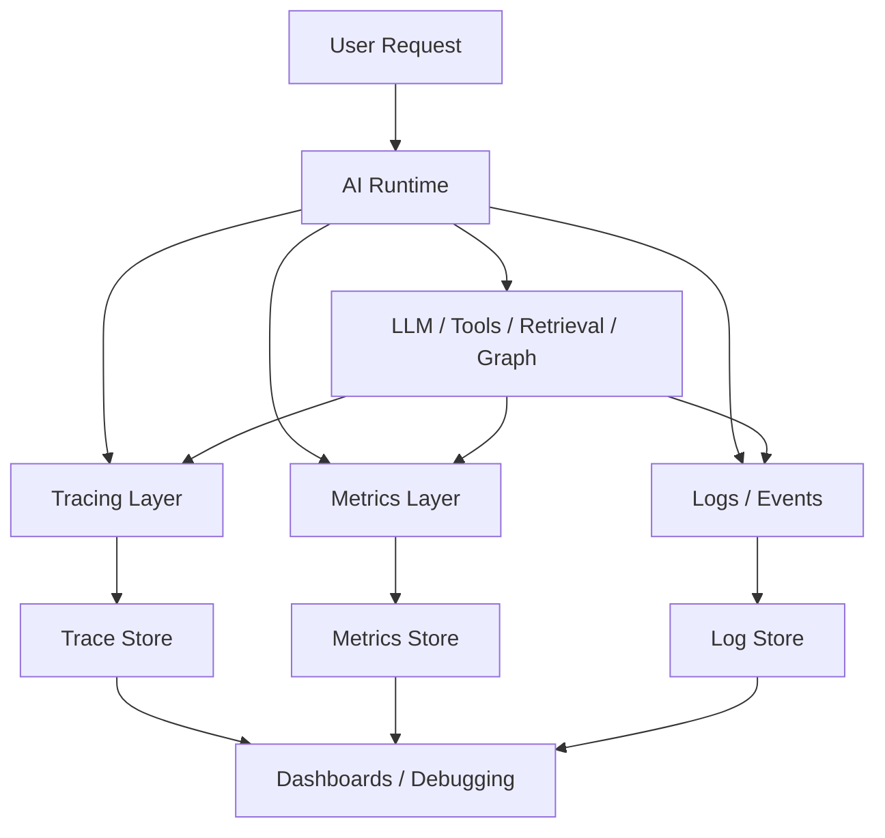

# Semana 09 — Observabilidad de IA, Tracing, Costos y Debugging para Fintech

Perfecto. Vamos con la **Semana 9 completa**, bien enseñada, bien aterrizada a **fintech real**, y con foco en una de las capas más importantes para producción seria:

- **Observabilidad AI**
- **Tracing**
- **Costo**
- **Latencia**
- **Debugging**

En tu recorrido, esta semana aparece después de runtime, tools, state, retrieval, RAG, graphs, MCP y evaluación. Tiene todo el sentido: una vez que ya sabés construir sistemas AI, ahora tenés que aprender a **operarlos bien**. Y eso implica poder ver qué está pasando de punta a punta. En práctica productiva, observabilidad GenAI se vuelve una pieza central para monitorear **quality, latency y cost**, además de trazas, métricas y alertas; y en experiencia real de fintech/LLM también aparece como una capa explícita de “quality/latency/cost per request” y KPIs como grounded answer rate, hallucination rate, latency p95 y cost/request.

---

# Semana 9 — Observabilidad AI / Tracing / Costos / Latencia / Debugging

## 1. La idea central

Hasta la Semana 8 aprendiste a construir y evaluar sistemas AI.
La Semana 9 te enseña a responder esta pregunta:

> **¿Cómo sé qué pasó realmente dentro de mi sistema AI cuando algo anda mal, se pone caro o se vuelve lento?**

Eso es observabilidad.

No es solo tener logs.
No es solo medir tiempo total.

Es poder reconstruir:

- qué pidió el usuario,
- qué prompt se armó,
- qué modelo se usó,
- qué tools se llamaron,
- qué chunks se recuperaron,
- cuánto costó,
- cuánto tardó cada etapa,
- qué salió mal,
- y por qué la respuesta final fue buena, mala o riesgosa.

---

# 2. Qué problema resuelve esta semana

Imaginá estos problemas en una fintech con LLMs:

## Caso A

El sistema responde peor desde ayer.

## Caso B

La latencia pasó de 3 segundos a 11 segundos.

## Caso C

El costo por request se duplicó.

## Caso D

El agente está llamando demasiadas tools.

## Caso E

El retrieval trae chunks irrelevantes y la groundedness cayó.

## Caso F

Un caso de fraude no fue derivado a revisión humana.

## Caso G

Un workflow quedó colgado esperando una tool o una aprobación.

Sin observabilidad, todo eso se siente como:

> “algo raro pasa”.

Con observabilidad, pasa a ser:

> “la degradación viene del reranker nuevo, que aumentó top-k, metió más contexto, subió tokens, empeoró latencia y bajó precisión en fraude”.

Ese salto es enorme.

---

# 3. Qué es observabilidad AI

La definición útil no es académica; es operativa.

**Observabilidad AI** es la capacidad de entender el comportamiento de tu sistema AI a partir de sus señales internas.

Esas señales incluyen:

- **traces**
- **metrics**
- **logs**
- **artifacts**
- **evaluaciones**
- **eventos de tools**
- **costos**
- **latencias**
- **feedback humano**
- **resultados por etapa**

En AI, observabilidad no es solo infraestructura.
También incluye la **calidad de la decisión del sistema**.

---

# 4. Observabilidad vs monitoreo

Se parecen, pero no son lo mismo.

## Monitoreo

Es mirar algunas métricas conocidas:

- CPU
- error rate
- latency p95
- requests por minuto

## Observabilidad

Es poder **investigar causas**, incluso cuando el problema no estaba predefinido.

En AI eso significa:

- seguir un caso end-to-end,
- abrir el trace,
- ver cada paso del pipeline,
- inspeccionar retrieval,
- inspeccionar tool calls,
- correlacionar calidad, costo y latencia,
- y llegar a una hipótesis fuerte.

---

# 5. Por qué observabilidad AI es distinta de observabilidad clásica

Porque los sistemas AI tienen cosas que un backend tradicional no tiene:

- prompts
- context building
- retrieval
- reranking
- grounding
- LLM outputs no determinísticos
- tools
- judges
- human review
- token usage
- model routing
- policy checks
- compaction/memory
- hallucination risk

Entonces no alcanza con medir:

- status code
- latency
- exceptions

También tenés que medir:

- calidad
- tokens
- contexto usado
- evidencia recuperada
- tools llamadas
- policy adherence
- fallback paths
- refusal rate
- human-review trigger rate

---

# 6. Qué es tracing

**Tracing** es la representación detallada de una ejecución de punta a punta.

Un trace se compone de **spans**.

## Ejemplo simple de trace AI

```text
request
 ├─ build_context
 ├─ retrieve_chunks
 ├─ rerank_chunks
 ├─ model_call
 ├─ tool_call:get_transaction_status
 ├─ policy_check
 └─ final_response
```

Cada span tiene:

- nombre
- inicio
- fin
- duración
- inputs
- outputs
- metadata
- estado/error

---

# 7. Qué es un span

Un **span** es una unidad de trabajo dentro del trace.

Ejemplos de spans en un sistema AI:

- `build_prompt`
- `embed_query`
- `vector_search`
- `rerank`
- `model_response`
- `tool_call`
- `judge_score`
- `approval_gate`
- `final_render`

Pensalo así:

- **trace** = película completa
- **span** = escena individual

---

# 8. Qué debería tener un buen trace AI

## Metadata mínima por request

- `request_id`
- `session_id`
- `user_id` tokenizado
- `workflow_id`
- `model`
- `prompt_version`
- `retriever_version`
- `graph_version`

## Metadata por span

- `span_name`
- `start_time`
- `end_time`
- `duration_ms`
- `status`
- `error_type`
- `tokens_in`
- `tokens_out`
- `estimated_cost_usd`

## Metadata AI específica

- tools usadas
- chunks recuperados
- chunks usados
- scores de rerank
- policy flags
- quality signals
- human approval status

---

# 9. Qué es tracing por etapa y por request

Tu plan habla de **tracing por request y por etapa**. Ese es exactamente el criterio correcto.

## Tracing por request

Te deja ver la ejecución completa del caso.

## Tracing por etapa

Te deja aislar:

- dónde se va el tiempo,
- dónde falla,
- dónde sube el costo,
- dónde se degrada calidad.

Ejemplo:

- request total = 6.8s
- retrieval = 0.9s
- rerank = 1.1s
- model = 2.7s
- tool 1 = 0.8s
- tool 2 = 1.0s
- render = 0.3s

Eso ya te dice mucho.

---

# 10. Qué señales tenés que observar en un sistema AI

## A. Calidad

- grounded answer rate
- hallucination rate
- policy compliance
- task success
- tool correctness
- human-review correctness

## B. Latencia

- total latency
- p50 / p95 / p99
- latency por etapa
- latency por modelo
- latency por tool
- latency por retrieval

## C. Costo

- cost/request
- cost/session
- cost por workflow
- cost por tool path
- cost por modelo
- tokens in/out

## D. Estabilidad

- error rate
- timeout rate
- fallback rate
- invalid output rate
- schema validation failures

## E. Seguridad / gobernanza

- refusal rate
- policy violation rate
- PII redaction events
- approval gate frequency
- scope violations

---

# 11. Calidad, costo y latencia: el triángulo real

Una idea muy importante:

> en AI, casi nunca optimizás una sola dimensión.

Si aumentás:

- contexto,
- tools,
- top-k,
- rerank,
- reasoning,
- modelos más grandes,

podés mejorar calidad… pero también subir:

- costo,
- latencia,
- complejidad.

Entonces, observabilidad no es solo detectar problemas.
También es ayudarte a operar trade-offs.

---

# 12. Qué métricas mínimas yo pondría en una fintech

## Métricas por request

- `request_count`
- `success_rate`
- `latency_ms`
- `cost_usd`
- `tokens_input`
- `tokens_output`

## Métricas AI específicas

- `grounded_answer_rate`
- `hallucination_rate`
- `tool_success_rate`
- `retrieval_hit_rate`
- `human_review_trigger_rate`
- `policy_violation_rate`

## Métricas por dominio

- `fraud_pass_rate`
- `payments_pass_rate`
- `kyc_pass_rate`
- `collections_pass_rate`

## Métricas por release

- `prompt_version`
- `model_version`
- `retriever_version`
- `graph_version`

---

# 13. Qué es costo en sistemas AI

Costo no es solo “cuánto sale el modelo”.

Tenés varios costos:

## Costo directo

- tokens del modelo
- embeddings
- reranker
- judge models

## Costo indirecto

- infraestructura
- tools remotas
- caches
- almacenamiento
- tracing/monitoring

## Costo operativo

- revisión humana
- debugging
- incidentes
- retrabajo por mala calidad

La observabilidad buena te permite bajar:

- costo directo innecesario,
- y costo operativo oculto.

---

# 14. Qué mirar del costo

## Por request

¿Cuánto cuesta una request promedio?

## Por sesión

¿Cuánto cuesta una conversación completa?

## Por flujo

¿Cuánto cuesta un graph de fraude vs uno de pagos?

## Por modelo

¿Qué pasa si pasás de un modelo chico a uno grande?

## Por feature

¿Cuánto te cuesta rerank, judge, second tool, approval path?

---

# 15. Qué es latencia bien entendida

Latencia no es solo “tiempo total”.

También te importa:

- latencia total
- latencia del primer token
- latencia por etapa
- latencia por tool
- latencia por proveedor
- latencia de fallback
- latencia con HITL
- latencia de resume tras checkpoint

## En fintech importa mucho

Porque:

- soporte necesita respuestas ágiles,
- operaciones necesita throughput,
- fraude necesita rapidez,
- y procesos lentos destruyen confianza.

---

# 16. Qué mirar de la latencia

## Percentiles

No te quedes solo con promedio.

Mirá:

- p50
- p95
- p99

Porque AI suele tener colas largas.

## Segmentación

Separá por:

- dominio
- flujo
- modelo
- cliente
- tool path
- contexto size

## Correlación

Mirá si latencia crece con:

- tokens
- top-k
- número de tools
- tamaño de respuesta
- fallbacks

---

# 17. Qué es debugging en AI

**Debugging AI** no es solo mirar stack traces.

Es reconstruir por qué el sistema tomó una mala decisión o produjo una mala respuesta.

## Ejemplos

- por qué eligió la tool incorrecta
- por qué no recuperó la política correcta
- por qué confirmó fraude sin evidencia
- por qué no pidió human review
- por qué respondió demasiado largo
- por qué el costo se disparó
- por qué bajó groundedness

---

# 18. Qué necesitás para debuggear bien

## 1. Trazabilidad

Sin trace, no hay debugging serio.

## 2. Inputs capturados

Qué entró realmente.

## 3. Versionado

Qué versión del prompt/model/retriever corría.

## 4. Outputs intermedios

Retrieval results, tool selections, judge scores.

## 5. Policies visibles

Qué guardrail o policy se aplicó.

## 6. Correlación

Link entre request, session, graph y human review.

---

# 19. Arquitectura mental correcta de la Semana 9



---

# 20. Qué componente instrumentarías en una app AI seria

## Runtime

- request lifecycle
- prompt build
- token count
- model call

## Retrieval

- query
- top-k
- scores
- chunks used
- latency

## Tools

- selected tools
- args validation
- latency
- success/error
- retries

## Graph

- current node
- transitions
- checkpoint save
- pause/resume
- human decision

## Guardrails

- violations
- refusals
- redactions
- policy outcomes

## Evaluation

- judge scores
- sampled quality metrics
- regression comparisons

---

# 21. Qué señales AI específicas yo agregaría

Porque esta semana no es solo APM clásico.

## Señales AI recomendadas

- `prompt_chars`
- `context_chars`
- `retrieved_chunk_count`
- `reranked_chunk_count`
- `selected_tool_count`
- `fallback_used`
- `refusal_triggered`
- `human_review_required`
- `human_review_decision`
- `eval_sampled`
- `judge_score_clarity`
- `judge_score_policy`

---

# 22. Buenas preguntas de observabilidad

Una plataforma buena te deja responder:

- ¿Qué requests son las más caras?
- ¿Qué flujos tienen peor groundedness?
- ¿Qué tool falla más?
- ¿Qué dominio tiene más human review?
- ¿Qué release empeoró el p95?
- ¿Qué prompt version aumentó el costo?
- ¿Qué queries recuperan chunks irrelevantes?
- ¿Qué path del grafo genera más rechazos humanos?

Si no podés responder eso, todavía no tenés observabilidad suficiente.

---

# 23. Diseño de dashboard mínimo para AI

## Dashboard 1 — Salud general

- requests
- success rate
- p95 latency
- cost/request
- top errors

## Dashboard 2 — Calidad

- grounded answer rate
- hallucination rate
- pass rate evaluado
- policy compliance
- human-review trigger rate

## Dashboard 3 — Retrieval / RAG

- retrieval hit rate
- top-k avg
- chunk overlap
- rerank impact
- citation presence rate

## Dashboard 4 — Tools / Graphs

- tool success rate
- avg tools per request
- graph path distribution
- pause/resume counts
- approval rejection rate

---

# 24. Alertas que pondría en fintech

## Alertas de sistema

- p95 latency > umbral
- timeout rate > umbral
- cost/request > umbral
- tool error rate > umbral

## Alertas de calidad

- groundedness cae
- policy violation sube
- human review no se dispara en fraude
- refusal rate cambia raro
- retrieval hit rate cae

## Alertas de release

- candidate worse than baseline in fraud
- p95 sube > X%
- cost sube > Y%
- pass_rate cae > Z%

---

# 25. Caso fintech concreto para aprender la semana

Vamos a usar tres flujos:

## Flujo 1 — Payments

Cargo duplicado.

## Flujo 2 — Fraud

Compra internacional no reconocida.

## Flujo 3 — KYC

Cuenta en revisión por documentación.

Queremos poder observar:

- path completo
- tools
- retrieval
- costo
- latencia
- output final
- errores

---

# 26. Mini proyecto de la semana

## `AI Observability v1`

Tu entregable ideal debería incluir un panel o reporte con:

- request
- modelo
- tools
- chunks
- costo
- latencia
- resultado

Eso es exactamente el tipo de panel que el plan de esta etapa busca construir, y además coincide con cómo se habla hoy de observabilidad de agentes/LLMs: quality, latency, cost, traces, metrics y alerts.

---

# 27. Estructura recomendada del proyecto

```text
week9-ai-observability-fintech/
├─ README.md
├─ package.json
├─ tsconfig.json
├─ src/
│  ├─ types.ts
│  ├─ tracer.ts
│  ├─ metrics.ts
│  ├─ logger.ts
│  ├─ runtime.ts
│  ├─ fakeRetriever.ts
│  ├─ fakeTools.ts
│  ├─ fakeModel.ts
│  ├─ dashboard.ts
│  └─ main.ts
├─ data/
│  └─ sample_requests.json
```

---

# 28. Código — tipos base

## `src/types.ts`

```ts
export type Domain = "payments" | "fraud" | "kyc";

export interface RequestInput {
  requestId: string;
  sessionId: string;
  userId: string;
  domain: Domain;
  message: string;
}

export interface RetrievedChunk {
  chunkId: string;
  title: string;
  score: number;
  text: string;
}

export interface ToolCallRecord {
  toolName: string;
  latencyMs: number;
  success: boolean;
  args: Record<string, unknown>;
}

export interface AIResponse {
  answer: string;
  model: string;
  tokensIn: number;
  tokensOut: number;
  estimatedCostUsd: number;
  latencyMs: number;
}

export interface SpanRecord {
  traceId: string;
  spanId: string;
  parentSpanId?: string;
  name: string;
  startTime: number;
  endTime?: number;
  durationMs?: number;
  status: "ok" | "error";
  attributes: Record<string, unknown>;
}

export interface RequestReport {
  requestId: string;
  domain: Domain;
  totalLatencyMs: number;
  totalCostUsd: number;
  model: string;
  retrievedChunks: RetrievedChunk[];
  toolCalls: ToolCallRecord[];
  answer: string;
  traceId: string;
}
```

---

# 29. Tracer

## `src/tracer.ts`

```ts
import { randomUUID } from "node:crypto";
import { SpanRecord } from "./types.js";

export class InMemoryTracer {
  private spans: SpanRecord[] = [];

  startSpan(name: string, traceId: string, parentSpanId?: string, attributes: Record<string, unknown> = {}) {
    const span: SpanRecord = {
      traceId,
      spanId: randomUUID(),
      parentSpanId,
      name,
      startTime: Date.now(),
      status: "ok",
      attributes
    };
    this.spans.push(span);
    return span;
  }

  endSpan(spanId: string, status: "ok" | "error" = "ok", attributes: Record<string, unknown> = {}) {
    const span = this.spans.find((s) => s.spanId === spanId);
    if (!span) return;

    span.endTime = Date.now();
    span.durationMs = span.endTime - span.startTime;
    span.status = status;
    span.attributes = { ...span.attributes, ...attributes };
  }

  getTrace(traceId: string): SpanRecord[] {
    return this.spans.filter((s) => s.traceId === traceId);
  }

  allSpans(): SpanRecord[] {
    return this.spans;
  }
}
```

---

# 30. Metrics collector

## `src/metrics.ts`

```ts
export class MetricsCollector {
  private counters = new Map<string, number>();
  private histograms = new Map<string, number[]>();

  inc(metric: string, value = 1) {
    this.counters.set(metric, (this.counters.get(metric) ?? 0) + value);
  }

  observe(metric: string, value: number) {
    const arr = this.histograms.get(metric) ?? [];
    arr.push(value);
    this.histograms.set(metric, arr);
  }

  snapshot() {
    const histogramSummary: Record<string, { count: number; avg: number; p95: number }> = {};

    for (const [metric, values] of this.histograms.entries()) {
      const sorted = [...values].sort((a, b) => a - b);
      const avg = values.reduce((a, b) => a + b, 0) / values.length;
      const p95 = sorted[Math.max(0, Math.ceil(values.length * 0.95) - 1)] ?? 0;

      histogramSummary[metric] = {
        count: values.length,
        avg,
        p95
      };
    }

    return {
      counters: Object.fromEntries(this.counters.entries()),
      histograms: histogramSummary
    };
  }
}
```

---

# 31. Logger de eventos

## `src/logger.ts`

```ts
export class EventLogger {
  private events: Array<Record<string, unknown>> = [];

  log(event: Record<string, unknown>) {
    this.events.push({
      ts: new Date().toISOString(),
      ...event
    });
  }

  all() {
    return this.events;
  }
}
```

---

# 32. Fake retriever

## `src/fakeRetriever.ts`

```ts
import { RetrievedChunk, Domain } from "./types.js";

export async function retrieve(domain: Domain, message: string): Promise<RetrievedChunk[]> {
  if (domain === "payments") {
    return [
      {
        chunkId: "pay_001",
        title: "Política de cargos duplicados",
        score: 0.91,
        text: "No debe prometerse reintegro automático sin validar estado de transacción y comercio."
      }
    ];
  }

  if (domain === "fraud") {
    return [
      {
        chunkId: "fraud_001",
        title: "Guía de consumo no reconocido",
        score: 0.94,
        text: "Debe tratarse como sospecha de fraude hasta validación adicional."
      }
    ];
  }

  return [
    {
      chunkId: "kyc_001",
      title: "Estados KYC",
      score: 0.89,
      text: "La cuenta puede quedar en revisión por documento vencido, imagen ilegible o inconsistencia."
    }
  ];
}
```

---

# 33. Fake tools

## `src/fakeTools.ts`

```ts
import { ToolCallRecord, Domain } from "./types.js";

function delay(ms: number) {
  return new Promise((resolve) => setTimeout(resolve, ms));
}

export async function runTools(domain: Domain): Promise<ToolCallRecord[]> {
  if (domain === "payments") {
    const start = Date.now();
    await delay(120);
    return [
      {
        toolName: "get_transaction_status",
        latencyMs: Date.now() - start,
        success: true,
        args: { transactionId: "txn_001", customerId: "cust_001" }
      }
    ];
  }

  if (domain === "fraud") {
    const start1 = Date.now();
    await delay(140);

    const start2 = Date.now();
    await delay(110);

    return [
      {
        toolName: "get_transaction_status",
        latencyMs: Date.now() - start1,
        success: true,
        args: { transactionId: "txn_002", customerId: "cust_002" }
      },
      {
        toolName: "get_customer_risk_flags",
        latencyMs: Date.now() - start2,
        success: true,
        args: { customerId: "cust_002" }
      }
    ];
  }

  const start = Date.now();
  await delay(90);
  return [
    {
      toolName: "get_kyc_status",
      latencyMs: Date.now() - start,
      success: true,
      args: { customerId: "cust_003" }
    }
  ];
}
```

---

# 34. Fake model

## `src/fakeModel.ts`

```ts
import { AIResponse, Domain, RetrievedChunk, ToolCallRecord } from "./types.js";

function estimateTokens(text: string): number {
  return Math.ceil(text.length / 4);
}

export async function generateAnswer(params: {
  domain: Domain;
  message: string;
  chunks: RetrievedChunk[];
  tools: ToolCallRecord[];
}): Promise<AIResponse> {
  const started = Date.now();

  let answer = "";
  if (params.domain === "payments") {
    answer =
      "El caso parece compatible con cargo duplicado o retención temporal. No corresponde prometer reintegro automático sin validar estado de la transacción y del comercio.";
  } else if (params.domain === "fraud") {
    answer =
      "El caso debe tratarse como sospecha de fraude hasta validación adicional. No corresponde confirmarlo como hecho sin controles extra.";
  } else {
    answer =
      "La cuenta puede seguir en revisión por documentación observada o inconsistencia de datos.";
  }

  await new Promise((r) => setTimeout(r, params.domain === "fraud" ? 260 : 180));

  const tokensIn =
    estimateTokens(params.message) +
    estimateTokens(params.chunks.map((c) => c.text).join(" ")) +
    estimateTokens(JSON.stringify(params.tools));

  const tokensOut = estimateTokens(answer);

  return {
    answer,
    model: "gpt-observability-demo",
    tokensIn,
    tokensOut,
    estimatedCostUsd: Number(((tokensIn + tokensOut) * 0.000002).toFixed(6)),
    latencyMs: Date.now() - started
  };
}
```

---

# 35. Runtime instrumentado

## `src/runtime.ts`

```ts
import { randomUUID } from "node:crypto";
import { EventLogger } from "./logger.js";
import { MetricsCollector } from "./metrics.js";
import { retrieve } from "./fakeRetriever.js";
import { runTools } from "./fakeTools.js";
import { generateAnswer } from "./fakeModel.js";
import { InMemoryTracer } from "./tracer.js";
import { RequestInput, RequestReport } from "./types.js";

export class AIRuntime {
  constructor(
    private readonly tracer: InMemoryTracer,
    private readonly metrics: MetricsCollector,
    private readonly logger: EventLogger
  ) {}

  async handle(input: RequestInput): Promise<RequestReport> {
    const traceId = randomUUID();
    const root = this.tracer.startSpan("request", traceId, undefined, {
      requestId: input.requestId,
      domain: input.domain
    });

    const started = Date.now();

    const retrievalSpan = this.tracer.startSpan("retrieve_chunks", traceId, root.spanId);
    const chunks = await retrieve(input.domain, input.message);
    this.tracer.endSpan(retrievalSpan.spanId, "ok", {
      chunkCount: chunks.length
    });

    const toolsSpan = this.tracer.startSpan("run_tools", traceId, root.spanId);
    const toolCalls = await runTools(input.domain);
    this.tracer.endSpan(toolsSpan.spanId, "ok", {
      toolCount: toolCalls.length
    });

    const modelSpan = this.tracer.startSpan("model_call", traceId, root.spanId);
    const response = await generateAnswer({
      domain: input.domain,
      message: input.message,
      chunks,
      tools: toolCalls
    });
    this.tracer.endSpan(modelSpan.spanId, "ok", {
      model: response.model,
      tokensIn: response.tokensIn,
      tokensOut: response.tokensOut,
      costUsd: response.estimatedCostUsd
    });

    const totalLatencyMs = Date.now() - started;
    this.tracer.endSpan(root.spanId, "ok", {
      totalLatencyMs
    });

    this.metrics.inc("requests_total");
    this.metrics.inc(`requests_${input.domain}`);
    this.metrics.observe("latency_ms", totalLatencyMs);
    this.metrics.observe("cost_usd", response.estimatedCostUsd);
    this.metrics.observe("tokens_in", response.tokensIn);
    this.metrics.observe("tokens_out", response.tokensOut);
    this.metrics.observe("tool_count", toolCalls.length);
    this.metrics.observe("retrieved_chunk_count", chunks.length);

    this.logger.log({
      type: "request_completed",
      requestId: input.requestId,
      domain: input.domain,
      traceId,
      totalLatencyMs,
      costUsd: response.estimatedCostUsd,
      model: response.model
    });

    return {
      requestId: input.requestId,
      domain: input.domain,
      totalLatencyMs,
      totalCostUsd: response.estimatedCostUsd,
      model: response.model,
      retrievedChunks: chunks,
      toolCalls,
      answer: response.answer,
      traceId
    };
  }
}
```

---

# 36. Dashboard/report simple

## `src/dashboard.ts`

```ts
import { MetricsCollector } from "./metrics.js";
import { InMemoryTracer } from "./tracer.js";
import { EventLogger } from "./logger.js";

export function buildDashboard(
  tracer: InMemoryTracer,
  metrics: MetricsCollector,
  logger: EventLogger
) {
  return {
    metrics: metrics.snapshot(),
    totalSpans: tracer.allSpans().length,
    events: logger.all().slice(-10)
  };
}
```

---

# 37. Main de demo

## `src/main.ts`

```ts
import { AIRuntime } from "./runtime.js";
import { InMemoryTracer } from "./tracer.js";
import { MetricsCollector } from "./metrics.js";
import { EventLogger } from "./logger.js";
import { buildDashboard } from "./dashboard.js";
import { RequestInput } from "./types.js";

async function main() {
  const tracer = new InMemoryTracer();
  const metrics = new MetricsCollector();
  const logger = new EventLogger();

  const runtime = new AIRuntime(tracer, metrics, logger);

  const requests: RequestInput[] = [
    {
      requestId: "req_001",
      sessionId: "sess_001",
      userId: "cust_001",
      domain: "payments",
      message: "Me cobraron dos veces una compra en Carrefour."
    },
    {
      requestId: "req_002",
      sessionId: "sess_002",
      userId: "cust_002",
      domain: "fraud",
      message: "No reconozco una compra internacional y me llegó un SMS que no aprobé."
    },
    {
      requestId: "req_003",
      sessionId: "sess_003",
      userId: "cust_003",
      domain: "kyc",
      message: "Subí mi documento y la cuenta sigue en revisión."
    }
  ];

  for (const req of requests) {
    const report = await runtime.handle(req);
    console.log("\n=== REQUEST REPORT ===");
    console.log(JSON.stringify(report, null, 2));
    console.log("\n=== TRACE ===");
    console.log(JSON.stringify(tracer.getTrace(report.traceId), null, 2));
  }

  console.log("\n=== DASHBOARD SNAPSHOT ===");
  console.log(JSON.stringify(buildDashboard(tracer, metrics, logger), null, 2));
}

main().catch(console.error);
```

---

# 38. Qué enseña este código

Este mini proyecto ya te enseña los pilares correctos de la semana:

- tracing por request
- spans por etapa
- métricas agregadas
- eventos
- costo
- latencia
- tools
- chunks
- reporte final por request

Es una muy buena base de **AI Observability v1**.

---

# 39. Qué mejorarías en producción

## A. OpenTelemetry real

Para spans estándar y exporters.

## B. Datadog / Grafana / Honeycomb / Langfuse / etc.

Como backend de observabilidad.

## C. Correlación con releases

- prompt version
- model version
- graph version

## D. Sampling inteligente

No todo trace completo siempre.

## E. Payload redaction

No loguear PII cruda.

## F. Dashboards por dominio

fraud/payments/kyc.

## G. Alertas y SLOs

no solo reportes.

---

# 40. Qué SLOs pondría en una fintech

## Payments support

- p95 latency < 4s
- policy violation rate < 0.5%
- grounded answer rate > 95%

## Fraud

- human-review correctness > 98%
- false confidence rate muy baja
- no-confirm-fraud violation casi cero

## KYC

- clarity score > umbral
- wrong-routing rate muy baja
- tool success > 99%

---

# 41. Ejercicios prácticos — lunes a sábado

## Lunes — Trazabilidad AI

### Ejercicio 1

Dibujá un trace completo para:

- request
- retrieval
- tool
- model
- final response

### Qué aprendés

A pensar el sistema como cadena observable.

### Ejercicio 2

Agregá estos atributos al root span:

- `promptVersion`
- `retrieverVersion`
- `graphVersion`

---

## Martes — Tracing por request y por etapa

### Ejercicio 3

Instrumentá un span extra:

- `build_context`

Y medí cuánto tarda.

### Ejercicio 4

Separá el span `run_tools` en spans hijos por tool.

### Qué aprendés

A localizar cuellos de botella finos.

---

## Miércoles — Costo por request / sesión

### Ejercicio 5

Calculá:

- costo por request
- costo promedio por dominio
- costo por tool path

### Ejercicio 6

Agregá:

```ts
metrics.observe("cost_per_session_usd", ...);
```

### Qué aprendés

A ver costo más allá del modelo.

---

## Jueves — Latencia por modelo / tool / retrieval

### Ejercicio 7

Simulá que `fraud` usa un modelo más lento.

Compará:

- p50
- p95
- costo promedio
- pass rate estimado

### Qué aprendés

Trade-off calidad vs latencia.

---

## Viernes — Debugging de conversaciones

### Ejercicio 8

Introducí un bug:

- en fraude, no llamar `get_customer_risk_flags`

Después debuggealo usando:

- trace
- tool_count
- logs
- metrics

### Qué aprendés

A debuggear AI con evidencia, no intuición.

---

## Sábado — Mini proyecto `AI Observability v1`

### Objetivo

Cerrar con un panel o reporte que muestre:

- request
- model
- tools
- chunks
- costo
- latencia
- resultado

Eso, conceptualmente, es exactamente el entregable de esta semana y coincide con cómo hoy se presenta observabilidad GenAI en dashboards de producción.

---

# 42. Ejercicios extra de nivel fuerte

## Ejercicio 9 — Alerting

Definí alertas:

- p95 > 5s
- cost/request > 0.03
- tool error rate > 2%
- groundedness cae

## Ejercicio 10 — Quality signals

Agregá:

- `policy_compliance_score`
- `clarity_score`
- `groundedness_score`

como métricas sampleadas.

## Ejercicio 11 — Graph observability

Extendé el trace para incluir:

- nodo actual
- transitions
- checkpoint save
- human decision

## Ejercicio 12 — Release comparison

Agregá:

- baseline runtime
- candidate runtime
  y compará costo/latencia/quality.

---

# 43. Qué deberías saber explicar al terminar la semana

## 1

Qué diferencia hay entre monitoreo y observabilidad.

## 2

Qué es un trace y qué es un span.

## 3

Qué métricas importan en un sistema AI.

## 4

Cómo medir costo real por request.

## 5

Cómo medir latencia útil.

## 6

Cómo debuggear un mal output usando traces.

## 7

Qué señales AI específicas no existen en APM clásico.

## 8

Cómo diseñar un dashboard mínimo para una fintech con LLMs.

Si podés explicar eso, la semana está incorporada.

---

# 44. Errores clásicos de esta semana

## Error 1

Loguear todo y no poder usar nada.

## Error 2

No correlacionar request, trace y session.

## Error 3

No medir tokens/costo.

## Error 4

No instrumentar retrieval ni tools.

## Error 5

No separar latencia por etapa.

## Error 6

No capturar versiones.

## Error 7

No samplear calidad.

## Error 8

Guardar PII cruda en logs.

---

# 45. Resumen maestro de la Semana 9

Quiero que te quede grabado así:

> Semana 9 no es “tener dashboards bonitos”.
> Semana 9 es aprender a operar un sistema AI como producto serio: entender qué hizo, cuánto tardó, cuánto costó, qué usó, dónde falló y cómo mejorarlo sin adivinar.

La secuencia correcta es:

1. instrumentar runtime
2. abrir traces por request
3. crear spans por etapa
4. medir costo y latencia
5. capturar tools y retrieval
6. agregar eventos y métricas
7. construir reportes/dashboards
8. definir alertas
9. usar todo eso para debugging
10. conectar observabilidad con releases y calidad

Ese es el corazón de un **AI Observability v1** serio para fintech.

---

# 46. Entregable final ideal de tu Semana 9

Tu proyecto debería cerrar con:

- `InMemoryTracer`
- `MetricsCollector`
- `EventLogger`
- `AIRuntime`
- spans por etapa
- reporte por request
- dashboard snapshot
- costo/latencia por request
- tools/chunks/model por request
- README con arquitectura y métricas

Eso ya te deja muy bien parado para la siguiente etapa.

Si querés, en el próximo paso te lo convierto en **repo GitHub + ZIP completo de la Semana 9**, también en **español e inglés**, con README, docs, diagramas, código, tests y estructura lista para subir.