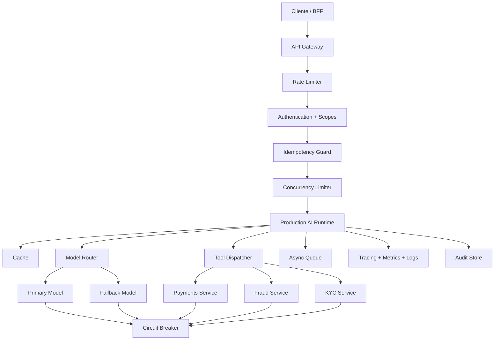
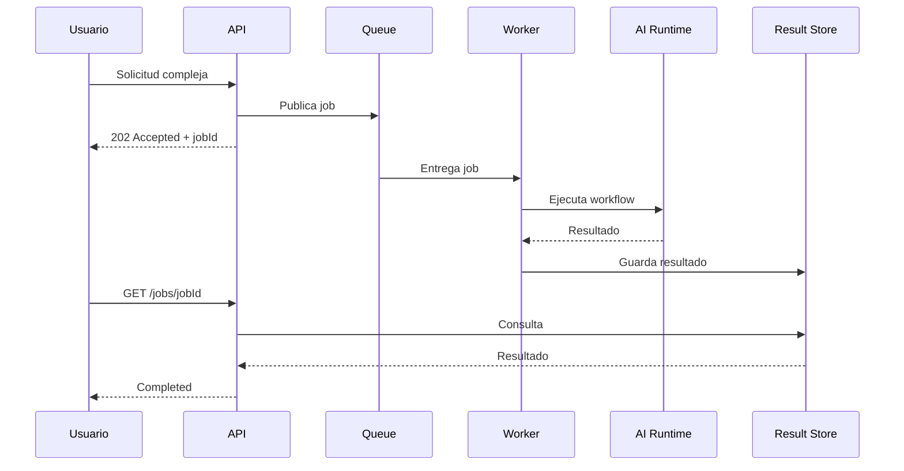

# Semana 11 — Production Readiness de sistemas AI para Fintech

## Confiabilidad, escalabilidad, resiliencia, caching, rate limiting, idempotencia, colas, fallbacks, SLOs y FinOps

Esta semana responde una pregunta fundamental:

> **¿Cómo transformamos un agente o sistema AI que funciona en una demo en un servicio confiable, escalable, controlado y operable en producción?**

Hasta la Semana 10 construiste las principales capacidades:

- runtime de LLM;
- outputs estructurados;
- tool calling;
- memoria y estado;
- retrieval y RAG;
- agentes y workflows;
- MCP;
- evaluaciones;
- observabilidad;
- seguridad y guardrails.

Pero un sistema puede tener todas esas capacidades y aun así fracasar en producción porque:

- se cae cuando el proveedor AI demora;
- reintenta sin control y duplica operaciones;
- consume demasiado dinero;
- satura tools o bases de datos;
- procesa dos veces el mismo reclamo;
- se bloquea cuando falla una dependencia;
- no tiene degradación controlada;
- no puede escalar con tráfico real;
- no diferencia una consulta de una acción financiera;
- no tiene SLOs ni criterios objetivos de disponibilidad.

La Semana 11 agrega la capa de **ingeniería de producción**.

---

# 1. Objetivo general

Construir un **Production AI Runtime v1** para fintech que pueda:

- procesar solicitudes concurrentes;
- controlar la cantidad de llamadas al modelo;
- limitar tráfico por cliente;
- aplicar timeouts;
- reintentar solo cuando sea seguro;
- evitar operaciones duplicadas;
- utilizar circuit breakers;
- aplicar caching;
- enrutar solicitudes entre modelos;
- usar fallbacks;
- degradarse de forma segura;
- registrar costo, latencia y resultado;
- mantener auditabilidad;
- cumplir SLOs técnicos y de negocio.

---

# 2. El cambio mental de esta semana

En una demo preguntamos:

> ¿El modelo respondió correctamente?

En producción preguntamos:

> ¿Respondió correctamente, dentro del tiempo esperado, con costo controlado, sin duplicar acciones, sin exceder permisos y soportando fallas parciales?

La producción no se trata solamente de calidad de respuesta.

La ecuación completa es:

```text
Production Readiness
=
Calidad
+ Disponibilidad
+ Confiabilidad
+ Seguridad
+ Escalabilidad
+ Control de costo
+ Auditabilidad
+ Recuperación ante fallas
```

---

# 3. Requisitos funcionales y no funcionales

## 3.1 Requisitos funcionales

Describen qué hace el sistema.

Ejemplos:

- consultar una transacción;
- clasificar un reclamo;
- recuperar una política;
- generar un borrador de disputa;
- solicitar aprobación humana.

## 3.2 Requisitos no funcionales

Describen cómo debe comportarse.

Ejemplos:

- responder en menos de cuatro segundos en el 95 % de los casos;
- evitar duplicar disputas;
- soportar 500 requests concurrentes;
- mantener disponibilidad del 99,9 %;
- limitar el costo promedio por caso;
- recuperarse de una falla del proveedor;
- conservar trazabilidad completa.

En producción, los requisitos no funcionales suelen ser los que determinan si el sistema es viable.

---

# 4. Arquitectura general de la Semana 11



---

# 5. Conceptos fundamentales

---

# 5.1 Disponibilidad

La disponibilidad indica qué proporción del tiempo el sistema puede atender solicitudes correctamente.

Ejemplo conceptual:

```text
Disponibilidad = tiempo operativo / tiempo total
```

Una disponibilidad del 99,9 % permite aproximadamente algunos minutos de indisponibilidad por mes. Pero el objetivo real debe definirse según el impacto del producto.

No todos los flujos necesitan el mismo nivel:

| FlujoDisponibilidad orientativa |                                              |
| ------------------------------- | -------------------------------------------- |
| Asistente informativo           | 99,5 %                                       |
| Consulta de pagos               | 99,9 %                                       |
| Detección operativa de fraude   | 99,95 %                                      |
| Acción financiera crítica       | Puede requerir arquitectura aún más estricta |

Estos valores son ejemplos de diseño, no reglas universales.

---

# 5.2 Confiabilidad

La confiabilidad representa la capacidad del sistema para producir resultados correctos de manera consistente.

Un servicio puede estar “disponible” y aun así no ser confiable.

Ejemplos:

- responde HTTP 200 pero usa la política equivocada;
- genera dos disputas para el mismo caso;
- ejecuta una tool con argumentos incompletos;
- confirma fraude sin evidencia;
- procesa eventos fuera de orden.

La confiabilidad incluye:

- consistencia;
- idempotencia;
- validación;
- control de estados;
- manejo correcto de fallas.

---

# 5.3 Resiliencia

La resiliencia es la capacidad de continuar funcionando, o recuperarse, cuando una dependencia falla.

Ejemplos de fallas:

- timeout del proveedor LLM;
- rate limit externo;
- tool de pagos fuera de servicio;
- vector store lento;
- cola temporalmente saturada;
- base de datos no disponible;
- respuesta inválida del modelo.

Un sistema resiliente no asume que todo funcionará siempre.

---

# 6. SLI, SLO y SLA

Estos tres términos deben quedar completamente claros.

## 6.1 SLI — Service Level Indicator

Es la medición concreta.

Ejemplos:

- porcentaje de requests exitosas;
- latencia p95;
- tasa de tools exitosas;
- porcentaje de respuestas grounded;
- costo promedio por request;
- tasa de outputs inválidos.

## 6.2 SLO — Service Level Objective

Es el objetivo interno.

Ejemplos:

```text
p95 latency < 4 segundos
tool success rate > 99 %
invalid structured output rate < 0,5 %
duplicate financial action rate = 0
```

## 6.3 SLA — Service Level Agreement

Es el compromiso contractual o externo.

Un SLA puede incluir consecuencias comerciales si no se cumple.

## Diferencia resumida

```text
SLI = qué medimos
SLO = qué objetivo interno buscamos
SLA = qué prometemos contractualmente
```

---

# 7. Percentiles de latencia

El promedio no alcanza.

Supongamos estas latencias:

```text
1s, 1s, 1s, 1s, 1s, 1s, 2s, 2s, 4s, 18s
```

El promedio puede parecer aceptable, pero un grupo de usuarios experimenta 18 segundos.

Por eso se utilizan:

- **p50:** experiencia típica;
- **p95:** experiencia del 95 % de requests;
- **p99:** cola extrema.

En sistemas AI, la latencia tiene mucha variabilidad debido a:

- tamaño del prompt;
- tokens de salida;
- cantidad de tool calls;
- retrieval;
- reranking;
- carga del proveedor;
- reintentos;
- modelos diferentes.

---

# 8. Timeouts

Un timeout define cuánto tiempo estamos dispuestos a esperar por una operación.

Sin timeout, una dependencia puede dejar recursos ocupados indefinidamente.

## Timeouts por nivel

### Timeout de request

Tiempo máximo total de la operación.

### Timeout de modelo

Tiempo máximo de respuesta del proveedor AI.

### Timeout de tool

Tiempo máximo por integración.

### Timeout de conexión

Tiempo permitido para establecer conexión.

## Ejemplo conceptual

```text
Request total: 8 segundos
├── Retrieval: 800 ms
├── Modelo: 4 segundos
├── Tool: 2 segundos
└── Render: 300 ms
```

El presupuesto debe distribuirse entre etapas.

---

# 9. Código: timeout genérico

## `src/resilience/timeout.ts`

```ts
export class TimeoutError extends Error {
  constructor(
    public readonly operation: string,
    public readonly timeoutMs: number
  ) {
    super(`${operation} exceeded timeout of ${timeoutMs} ms`);
    this.name = "TimeoutError";
  }
}

export async function withTimeout<T>(
  operation: string,
  promise: Promise<T>,
  timeoutMs: number
): Promise<T> {
  let timeoutHandle: NodeJS.Timeout | undefined;

  const timeoutPromise = new Promise<never>((_, reject) => {
    timeoutHandle = setTimeout(() => {
      reject(new TimeoutError(operation, timeoutMs));
    }, timeoutMs);
  });

  try {
    return await Promise.race([promise, timeoutPromise]);
  } finally {
    if (timeoutHandle) {
      clearTimeout(timeoutHandle);
    }
  }
}
```

## Qué hace

- recibe una promesa;
- crea otra promesa que falla después del timeout;
- ejecuta ambas con `Promise.race`;
- devuelve la primera en completarse;
- limpia el timer al finalizar.

---

# 10. Retries

Un retry vuelve a intentar una operación fallida.

Pero reintentar todo indiscriminadamente es peligroso.

## Se puede reintentar normalmente

- timeout temporal;
- error 429;
- error 503;
- conexión interrumpida;
- fallo transitorio del proveedor.

## No se debería reintentar automáticamente

- error de autenticación;
- argumentos inválidos;
- policy violation;
- saldo insuficiente;
- acción financiera no idempotente;
- request bloqueada por seguridad.

---

# 11. Exponential backoff

En lugar de reintentar inmediatamente:

```text
100 ms
200 ms
400 ms
800 ms
```

Esto evita golpear repetidamente una dependencia que ya está fallando.

---

# 12. Jitter

El jitter agrega aleatoriedad al retraso.

Sin jitter, cientos de instancias pueden reintentar al mismo tiempo y generar una nueva sobrecarga.

Ejemplo:

```text
delay = baseDelay × 2^attempt + random
```

---

# 13. Código: retry con backoff y jitter

## `src/resilience/retry.ts`

```ts
export interface RetryOptions {
  maxAttempts: number;
  baseDelayMs: number;
  maxDelayMs: number;
  retryable: (error: unknown) => boolean;
}

function sleep(ms: number): Promise<void> {
  return new Promise((resolve) => setTimeout(resolve, ms));
}

function calculateDelay(
  attempt: number,
  baseDelayMs: number,
  maxDelayMs: number
): number {
  const exponential = baseDelayMs * 2 ** (attempt - 1);
  const capped = Math.min(exponential, maxDelayMs);
  const jitter = Math.floor(Math.random() * Math.max(1, capped * 0.25));

  return capped + jitter;
}

export async function withRetry<T>(
  operation: () => Promise<T>,
  options: RetryOptions
): Promise<T> {
  let lastError: unknown;

  for (let attempt = 1; attempt <= options.maxAttempts; attempt++) {
    try {
      return await operation();
    } catch (error) {
      lastError = error;

      const canRetry =
        attempt < options.maxAttempts &&
        options.retryable(error);

      if (!canRetry) {
        throw error;
      }

      const delay = calculateDelay(
        attempt,
        options.baseDelayMs,
        options.maxDelayMs
      );

      await sleep(delay);
    }
  }

  throw lastError;
}
```

---

# 14. Retry storm

Un **retry storm** ocurre cuando muchos componentes reintentan simultáneamente.

Ejemplo:

```text
API → Runtime → LLM Gateway → Provider
```

Si cada capa hace tres retries:

```text
3 × 3 × 3 = hasta 27 intentos
```

Por eso conviene definir claramente qué capa es responsable del retry.

Normalmente:

- el runtime hace pocos retries;
- las capas inferiores evitan multiplicarlos;
- los intentos quedan observados;
- existe un límite total por request.

---

# 15. Circuit breaker

Un circuit breaker evita seguir llamando una dependencia que está fallando.

Tiene tres estados principales.

## CLOSED

Todo funciona. Se permiten llamadas.

## OPEN

La tasa de fallas superó el límite. Se bloquean llamadas temporalmente.

## HALF_OPEN

Después de un tiempo, se permiten algunas llamadas de prueba.

Si funcionan:

```text
HALF_OPEN → CLOSED
```

Si fallan:

```text
HALF_OPEN → OPEN
```

---

# 16. Código: circuit breaker

## `src/resilience/circuitBreaker.ts`

```ts
export type CircuitState = "CLOSED" | "OPEN" | "HALF_OPEN";

export interface CircuitBreakerOptions {
  failureThreshold: number;
  resetTimeoutMs: number;
}

export class CircuitOpenError extends Error {
  constructor(public readonly circuitName: string) {
    super(`Circuit ${circuitName} is open`);
    this.name = "CircuitOpenError";
  }
}

export class CircuitBreaker {
  private state: CircuitState = "CLOSED";
  private failureCount = 0;
  private openedAt?: number;

  constructor(
    private readonly name: string,
    private readonly options: CircuitBreakerOptions
  ) {}

  getState(): CircuitState {
    this.refreshState();
    return this.state;
  }

  async execute<T>(operation: () => Promise<T>): Promise<T> {
    this.refreshState();

    if (this.state === "OPEN") {
      throw new CircuitOpenError(this.name);
    }

    try {
      const result = await operation();

      this.failureCount = 0;
      this.state = "CLOSED";
      this.openedAt = undefined;

      return result;
    } catch (error) {
      this.failureCount++;

      if (this.failureCount >= this.options.failureThreshold) {
        this.state = "OPEN";
        this.openedAt = Date.now();
      }

      throw error;
    }
  }

  private refreshState(): void {
    if (
      this.state === "OPEN" &&
      this.openedAt !== undefined &&
      Date.now() - this.openedAt >= this.options.resetTimeoutMs
    ) {
      this.state = "HALF_OPEN";
    }
  }
}
```

---

# 17. Por qué el circuit breaker es importante en AI

Supongamos que el proveedor primario está fallando.

Sin circuit breaker:

- cada request espera timeout;
- cada request reintenta;
- aumenta la latencia;
- sube el costo;
- se acumulan conexiones;
- se saturan pods;
- el sistema completo se degrada.

Con circuit breaker:

- se detecta el patrón;
- se abre el circuito;
- se evita continuar golpeando la dependencia;
- se activa un fallback;
- se recupera controladamente.

---

# 18. Bulkhead

El patrón **bulkhead** proviene de los compartimentos de un barco.

Su objetivo es impedir que una falla consuma todos los recursos.

## Ejemplo

Separar pools de concurrencia:

- fraude: máximo 20 requests;
- pagos: máximo 50;
- KYC: máximo 10;
- evaluaciones offline: máximo 5.

Si KYC se satura, no debería bloquear fraude.

---

# 19. Concurrency limiter

Limita cuántas operaciones pueden ejecutarse simultáneamente.

## `src/resilience/concurrencyLimiter.ts`

```ts
export class ConcurrencyLimitError extends Error {
  constructor(public readonly limit: number) {
    super(`Concurrency limit of ${limit} exceeded`);
    this.name = "ConcurrencyLimitError";
  }
}

export class ConcurrencyLimiter {
  private active = 0;

  constructor(
    private readonly maxConcurrent: number,
    private readonly rejectWhenFull = false
  ) {}

  getActiveCount(): number {
    return this.active;
  }

  async execute<T>(operation: () => Promise<T>): Promise<T> {
    if (this.active >= this.maxConcurrent && this.rejectWhenFull) {
      throw new ConcurrencyLimitError(this.maxConcurrent);
    }

    while (this.active >= this.maxConcurrent) {
      await new Promise((resolve) => setTimeout(resolve, 10));
    }

    this.active++;

    try {
      return await operation();
    } finally {
      this.active--;
    }
  }
}
```

En producción de alta escala, normalmente se usaría una cola o semáforo más sofisticado. Pero esta implementación enseña el concepto correctamente.

---

# 20. Rate limiting

El rate limiter controla cuántas solicitudes puede enviar un actor durante una ventana temporal.

Puede aplicarse por:

- usuario;
- cliente;
- tenant;
- API key;
- IP;
- sesión;
- endpoint;
- tool.

## Por qué es necesario

- proteger infraestructura;
- evitar abuso;
- limitar costo;
- evitar loops de agentes;
- mantener calidad de servicio;
- prevenir ataques de denegación;
- proteger proveedores externos.

---

# 21. Token bucket

Uno de los algoritmos más usados conceptualmente.

Cada cliente tiene un bucket con tokens.

- cada request consume un token;
- los tokens se regeneran con el tiempo;
- si no hay tokens, la request se rechaza o demora.

---

# 22. Código: rate limiter por token bucket

## `src/limits/rateLimiter.ts`

```ts
interface BucketState {
  tokens: number;
  lastRefillAt: number;
}

export interface TokenBucketOptions {
  capacity: number;
  refillTokensPerSecond: number;
}

export class RateLimitExceededError extends Error {
  constructor(public readonly key: string) {
    super(`Rate limit exceeded for ${key}`);
    this.name = "RateLimitExceededError";
  }
}

export class TokenBucketRateLimiter {
  private readonly buckets = new Map<string, BucketState>();

  constructor(private readonly options: TokenBucketOptions) {}

  consume(key: string, cost = 1): void {
    const now = Date.now();

    const current =
      this.buckets.get(key) ??
      {
        tokens: this.options.capacity,
        lastRefillAt: now
      };

    const elapsedSeconds = (now - current.lastRefillAt) / 1000;
    const refill =
      elapsedSeconds * this.options.refillTokensPerSecond;

    current.tokens = Math.min(
      this.options.capacity,
      current.tokens + refill
    );
    current.lastRefillAt = now;

    if (current.tokens < cost) {
      this.buckets.set(key, current);
      throw new RateLimitExceededError(key);
    }

    current.tokens -= cost;
    this.buckets.set(key, current);
  }
}
```

---

# 23. Idempotencia

Idempotencia significa que ejecutar la misma operación varias veces produce el mismo efecto que ejecutarla una sola vez.

Este concepto es crítico en fintech.

## Operación no idempotente peligrosa

```text
submit_dispute()
submit_dispute()
```

Podría crear dos disputas.

## Operación idempotente

```text
submit_dispute(idempotencyKey="case-123")
```

La segunda ejecución devuelve el resultado previo en lugar de crear otra acción.

---

# 24. Idempotency key

Una idempotency key identifica una operación lógica.

Puede estar formada por:

- request ID del cliente;
- transaction ID + tipo de acción;
- workflow ID;
- case ID + action version.

Ejemplo:

```text
dispute:customer-123:transaction-456:v1
```

---

# 25. Código: idempotency store

## `src/idempotency/idempotencyStore.ts`

```ts
export interface IdempotencyRecord<T> {
  status: "PROCESSING" | "COMPLETED" | "FAILED";
  result?: T;
  createdAt: number;
  updatedAt: number;
}

export class IdempotencyConflictError extends Error {
  constructor(public readonly key: string) {
    super(`Operation ${key} is already processing`);
    this.name = "IdempotencyConflictError";
  }
}

export class InMemoryIdempotencyStore {
  private readonly records =
    new Map<string, IdempotencyRecord<unknown>>();

  async execute<T>(
    key: string,
    operation: () => Promise<T>
  ): Promise<T> {
    const existing =
      this.records.get(key) as IdempotencyRecord<T> | undefined;

    if (existing?.status === "COMPLETED" && existing.result !== undefined) {
      return existing.result;
    }

    if (existing?.status === "PROCESSING") {
      throw new IdempotencyConflictError(key);
    }

    const now = Date.now();

    this.records.set(key, {
      status: "PROCESSING",
      createdAt: now,
      updatedAt: now
    });

    try {
      const result = await operation();

      this.records.set(key, {
        status: "COMPLETED",
        result,
        createdAt: now,
        updatedAt: Date.now()
      });

      return result;
    } catch (error) {
      this.records.set(key, {
        status: "FAILED",
        createdAt: now,
        updatedAt: Date.now()
      });

      throw error;
    }
  }
}
```

En producción, este store debería usar una base transaccional o Redis con operaciones atómicas.

---

# 26. Exactamente una vez vs al menos una vez

En sistemas distribuidos, “exactly once” real es difícil.

Los modelos comunes son:

## At-most-once

Puede perderse una operación, pero no se repite.

## At-least-once

La operación se entregará, pero puede repetirse.

## Effectively-once

Puede haber entregas repetidas, pero la idempotencia evita efectos duplicados.

Para muchas acciones fintech, el objetivo práctico es:

> entrega al menos una vez + ejecución idempotente = efecto único.

---

# 27. Caching en sistemas AI

El caching reduce:

- latencia;
- tokens;
- costo;
- carga en proveedores;
- carga en tools;
- carga en retrieval.

Pero no todo debe cachearse.

---

# 28. Tipos de cache

## 28.1 Exact response cache

Misma entrada exacta → misma respuesta.

Adecuada para:

- FAQ;
- políticas públicas;
- definiciones;
- consultas sin estado.

No adecuada para:

- balances;
- estados de transacciones;
- fraude;
- datos que cambian rápido.

## 28.2 Semantic cache

Entradas semánticamente similares pueden compartir respuesta.

Ejemplo:

```text
“¿Cuándo vence mi tarjeta?”
“¿Cuál es la fecha de vencimiento de la tarjeta?”
```

Debe usarse con mucho cuidado en dominios regulados.

## 28.3 Retrieval cache

Guarda resultados de retrieval para queries repetidas.

## 28.4 Tool cache

Guarda resultados de tools de lectura.

Requiere TTL según volatilidad.

## 28.5 Prompt cache

Reutiliza partes estáticas del contexto cuando el proveedor lo permite.

## 28.6 Embedding cache

Evita recalcular embeddings iguales.

---

# 29. TTL

TTL significa **Time To Live**.

Define cuánto tiempo un dato permanece válido en cache.

Ejemplos orientativos:

| DatoTTL posible             |                       |
| --------------------------- | --------------------- |
| Política interna versionada | Minutos u horas       |
| Catálogo de productos       | Minutos               |
| Estado de transacción       | Segundos              |
| Risk flags                  | Muy corto o sin cache |
| Respuesta genérica FAQ      | Horas                 |
| Token de autenticación      | Según expiración      |

El TTL debe surgir de la semántica del negocio, no solo del rendimiento.

---

# 30. Código: cache con TTL

## `src/cache/ttlCache.ts`

```ts
interface CacheEntry<T> {
  value: T;
  expiresAt: number;
}

export class TtlCache<T> {
  private readonly entries = new Map<string, CacheEntry<T>>();

  get(key: string): T | undefined {
    const entry = this.entries.get(key);

    if (!entry) {
      return undefined;
    }

    if (Date.now() >= entry.expiresAt) {
      this.entries.delete(key);
      return undefined;
    }

    return entry.value;
  }

  set(key: string, value: T, ttlMs: number): void {
    this.entries.set(key, {
      value,
      expiresAt: Date.now() + ttlMs
    });
  }

  delete(key: string): void {
    this.entries.delete(key);
  }

  clear(): void {
    this.entries.clear();
  }
}
```

---

# 31. Cache key correcta

Una mala cache key puede mezclar datos de clientes.

## Incorrecto

```text
get_transaction_status
```

## Correcto

```text
tenantId:customerId:transactionId:toolVersion
```

Ejemplo:

```text
bank-01:cust-123:txn-789:get-status:v2
```

Nunca omitas dimensiones de seguridad o tenancy.

---

# 32. Cache stampede

Ocurre cuando una entrada expira y muchas requests intentan recalcularla al mismo tiempo.

Soluciones:

- lock por clave;
- stale-while-revalidate;
- jitter en TTL;
- single-flight;
- refresh anticipado.

---

# 33. Single-flight

Si diez requests piden el mismo dato simultáneamente, una sola ejecuta la operación y las demás esperan su resultado.

## `src/cache/singleFlight.ts`

```ts
export class SingleFlight {
  private readonly inFlight = new Map<string, Promise<unknown>>();

  async execute<T>(
    key: string,
    operation: () => Promise<T>
  ): Promise<T> {
    const existing = this.inFlight.get(key) as Promise<T> | undefined;

    if (existing) {
      return existing;
    }

    const promise = operation().finally(() => {
      this.inFlight.delete(key);
    });

    this.inFlight.set(key, promise);

    return promise;
  }
}
```

---

# 34. Colas y procesamiento asíncrono

No todas las operaciones deben completarse dentro de la request HTTP.

## Candidatos para ejecución asíncrona

- evaluaciones masivas;
- resumen de conversaciones;
- procesamiento de documentos;
- generación de embeddings;
- análisis de portfolio;
- reportes;
- revisión compleja de expedientes;
- workflows que esperan aprobación humana.

## Candidatos para ejecución síncrona

- consulta inmediata;
- clasificación rápida;
- validación de inputs;
- lectura de estado;
- respuesta inicial al usuario.

---

# 35. Arquitectura con cola



---

# 36. Código: cola en memoria educativa

## `src/queue/jobQueue.ts`

```ts
import { randomUUID } from "node:crypto";

export type JobStatus =
  | "PENDING"
  | "RUNNING"
  | "COMPLETED"
  | "FAILED";

export interface Job<TPayload, TResult> {
  id: string;
  status: JobStatus;
  payload: TPayload;
  result?: TResult;
  error?: string;
  attempts: number;
}

export class InMemoryJobQueue<TPayload, TResult> {
  private readonly jobs = new Map<
    string,
    Job<TPayload, TResult>
  >();

  enqueue(payload: TPayload): Job<TPayload, TResult> {
    const job: Job<TPayload, TResult> = {
      id: randomUUID(),
      status: "PENDING",
      payload,
      attempts: 0
    };

    this.jobs.set(job.id, job);
    return job;
  }

  getJob(id: string): Job<TPayload, TResult> | undefined {
    return this.jobs.get(id);
  }

  async processNext(
    handler: (payload: TPayload) => Promise<TResult>
  ): Promise<Job<TPayload, TResult> | undefined> {
    const job = [...this.jobs.values()].find(
      (candidate) => candidate.status === "PENDING"
    );

    if (!job) {
      return undefined;
    }

    job.status = "RUNNING";
    job.attempts++;

    try {
      job.result = await handler(job.payload);
      job.status = "COMPLETED";
    } catch (error) {
      job.status = "FAILED";
      job.error =
        error instanceof Error ? error.message : String(error);
    }

    return job;
  }
}
```

---

# 37. Dead Letter Queue

Una DLQ almacena jobs que no pudieron procesarse después de varios intentos.

Sirve para:

- investigar errores;
- reprocesar manualmente;
- evitar loops infinitos;
- conservar evidencia;
- alertar operaciones.

Un job debería ir a DLQ cuando:

- excede máximos intentos;
- tiene datos inválidos;
- depende de un recurso inexistente;
- produce una violación persistente.

---

# 38. Model routing

No todas las solicitudes necesitan el modelo más grande.

Podés usar diferentes modelos según:

- complejidad;
- riesgo;
- costo;
- latencia;
- idioma;
- tamaño de contexto;
- necesidad de razonamiento;
- sensibilidad del caso.

---

# 39. Ejemplo de estrategia de routing

| CasoRuta                         |                               |
| -------------------------------- | ----------------------------- |
| Clasificación simple             | Modelo rápido/económico       |
| Resumen de soporte               | Modelo intermedio             |
| Investigación de fraude compleja | Modelo de mayor capacidad     |
| Output sensible                  | Modelo principal + validación |
| Proveedor caído                  | Fallback controlado           |
| Presupuesto agotado              | Respuesta degradada o cola    |

---

# 40. Código: model router

## `src/model/modelRouter.ts`

```ts
export type RiskLevel = "LOW" | "MEDIUM" | "HIGH";
export type Complexity = "SIMPLE" | "STANDARD" | "COMPLEX";

export interface RoutingContext {
  domain: "payments" | "fraud" | "kyc" | "collections";
  risk: RiskLevel;
  complexity: Complexity;
  estimatedInputTokens: number;
}

export interface ModelRoute {
  primary: string;
  fallback?: string;
  maxOutputTokens: number;
  allowFallback: boolean;
}

export function routeModel(
  context: RoutingContext
): ModelRoute {
  if (
    context.domain === "fraud" ||
    context.risk === "HIGH" ||
    context.complexity === "COMPLEX"
  ) {
    return {
      primary: "reasoning-model",
      fallback: "general-model",
      maxOutputTokens: 900,
      allowFallback: true
    };
  }

  if (context.complexity === "SIMPLE") {
    return {
      primary: "fast-model",
      fallback: "general-model",
      maxOutputTokens: 300,
      allowFallback: true
    };
  }

  return {
    primary: "general-model",
    fallback: "fast-model",
    maxOutputTokens: 600,
    allowFallback: true
  };
}
```

---

# 41. Fallbacks

Un fallback es una alternativa cuando el camino principal falla.

## Tipos de fallback

### Fallback de proveedor

Proveedor A → Proveedor B.

### Fallback de modelo

Modelo grande → Modelo menor.

### Fallback de feature

RAG completo → búsqueda keyword.

### Fallback de respuesta

Respuesta generativa → mensaje seguro predefinido.

### Fallback humano

Automatización → analista.

---

# 42. Un fallback no debe cambiar silenciosamente la semántica

Ejemplo peligroso:

- modelo principal realiza evaluación compleja;
- fallback simple responde con confianza equivalente.

La respuesta debería reconocer la degradación:

> “No pude completar la validación automatizada. El caso fue derivado para revisión.”

Eso es mejor que producir una respuesta insegura.

---

# 43. Graceful degradation

Significa degradar funcionalidad sin colapsar completamente.

## Ejemplos fintech

### Retrieval caído

- no inventar política;
- responder que no hay evidencia suficiente;
- derivar a revisión.

### Tool de pagos caída

- no confirmar estado;
- informar que la consulta no pudo completarse;
- generar ticket o job asíncrono.

### Modelo avanzado no disponible

- usar modelo alternativo para clasificación;
- no ejecutar acciones sensibles;
- mantener lectura básica.

### Observabilidad degradada

- continuar solo si el audit trail mínimo permanece disponible;
- no ejecutar acciones financieras sin registro.

---

# 44. Cost control y FinOps AI

FinOps AI significa medir y optimizar el costo de operar sistemas AI.

No se trata solamente de elegir el modelo más barato.

Se trata de optimizar:

```text
Costo por resultado útil
```

Una respuesta barata pero incorrecta puede ser mucho más costosa debido a:

- retrabajo;
- escalamiento humano;
- incidentes;
- reclamos;
- sanciones;
- pérdida de confianza.

---

# 45. Componentes de costo

## Modelo

- tokens de entrada;
- tokens de salida;
- razonamiento;
- llamadas repetidas.

## Retrieval

- embeddings;
- vector search;
- reranking.

## Tools

- APIs externas;
- bases de datos;
- sistemas antifraude.

## Evaluaciones

- judges;
- regresiones;
- monitoreo sampleado.

## Infraestructura

- pods;
- colas;
- caches;
- logs;
- traces;
- almacenamiento.

---

# 46. Estrategias para bajar costo

- model routing;
- limitar tokens de salida;
- resumir contexto;
- caching;
- deduplicar solicitudes;
- evitar tool loops;
- reducir top-k;
- usar reranking solo cuando agrega valor;
- ejecutar judges por sampling;
- usar batch processing;
- usar colas para trabajos no urgentes;
- cortar workflows cuando ya existe evidencia suficiente.

---

# 47. Presupuesto por request

Cada request puede tener un presupuesto.

Ejemplo:

```ts
export interface RequestBudget {
  maxModelCalls: number;
  maxToolCalls: number;
  maxInputTokens: number;
  maxOutputTokens: number;
  maxEstimatedCostUsd: number;
  maxDurationMs: number;
}
```

---

# 48. Código: budget guard

## `src/budget/budgetGuard.ts`

```ts
export interface UsageState {
  modelCalls: number;
  toolCalls: number;
  inputTokens: number;
  outputTokens: number;
  estimatedCostUsd: number;
  startedAt: number;
}

export interface RequestBudget {
  maxModelCalls: number;
  maxToolCalls: number;
  maxInputTokens: number;
  maxOutputTokens: number;
  maxEstimatedCostUsd: number;
  maxDurationMs: number;
}

export class BudgetExceededError extends Error {
  constructor(public readonly dimension: string) {
    super(`Request budget exceeded: ${dimension}`);
    this.name = "BudgetExceededError";
  }
}

export function validateBudget(
  usage: UsageState,
  budget: RequestBudget
): void {
  if (usage.modelCalls > budget.maxModelCalls) {
    throw new BudgetExceededError("model_calls");
  }

  if (usage.toolCalls > budget.maxToolCalls) {
    throw new BudgetExceededError("tool_calls");
  }

  if (usage.inputTokens > budget.maxInputTokens) {
    throw new BudgetExceededError("input_tokens");
  }

  if (usage.outputTokens > budget.maxOutputTokens) {
    throw new BudgetExceededError("output_tokens");
  }

  if (usage.estimatedCostUsd > budget.maxEstimatedCostUsd) {
    throw new BudgetExceededError("estimated_cost_usd");
  }

  if (Date.now() - usage.startedAt > budget.maxDurationMs) {
    throw new BudgetExceededError("duration_ms");
  }
}
```

---

# 49. Multi-tenancy

Una plataforma fintech puede atender:

- distintos bancos;
- distintas marcas;
- distintas unidades de negocio;
- distintos países;
- distintos canales.

Cada tenant puede tener:

- políticas diferentes;
- modelos habilitados;
- límites de consumo;
- tools permitidas;
- datasets separados;
- claves separadas;
- retención de datos diferente.

## Riesgo principal

Nunca permitir que:

```text
tenant A acceda a contexto, cache o tool result de tenant B
```

La dimensión `tenantId` debe formar parte de:

- cache keys;
- idempotency keys;
- authorization;
- trace metadata;
- retrieval filters;
- storage partitioning.

---

# 50. Auditabilidad

En fintech, una respuesta final sin evidencia operativa es insuficiente.

El audit trail debe poder mostrar:

- quién inició la operación;
- qué input recibió;
- qué versión del runtime se usó;
- qué modelo se eligió;
- qué policies se aplicaron;
- qué tools se llamaron;
- qué argumentos se enviaron;
- qué aprobación humana existió;
- qué resultado se produjo;
- qué idempotency key se usó.

No significa guardar PII innecesaria. Significa conservar la evidencia mínima correcta.

---

# 51. Deployment strategies

---

# 51.1 Rolling deployment

Se reemplazan instancias gradualmente.

Ventajas:

- simple;
- sin corte total;
- soportado naturalmente por Kubernetes.

Riesgo:

- durante un período conviven versiones diferentes.

---

# 51.2 Blue-green

Existen dos entornos:

- blue: actual;
- green: nueva versión.

Se cambia tráfico de uno a otro.

Ventaja:

- rollback rápido.

Costo:

- mayor infraestructura.

---

# 51.3 Canary

La nueva versión recibe un porcentaje pequeño del tráfico.

Ejemplo:

```text
v1: 95 %
v2: 5 %
```

Se comparan:

- error rate;
- p95;
- costo;
- calidad;
- policy violations;
- tool success.

Luego se aumenta progresivamente.

---

# 51.4 Shadow traffic

La nueva versión procesa copias de requests, pero sus respuestas no llegan al usuario.

Sirve para comparar:

- outputs;
- latencia;
- costos;
- seguridad;
- rutas de tools.

Es muy útil para AI porque permite observar diferencias sin afectar producción.

---

# 52. Release gates

Antes de promover una versión:

```text
Tests técnicos
+ Security tests
+ Eval regression
+ Latency limits
+ Cost limits
+ Canary metrics
+ Human approval
```

Ejemplo de gate:

```text
No desplegar si:
- fraud pass rate cae más de 1 %
- policy violations aumentan
- p95 sube más de 20 %
- cost/request sube más de 15 %
- duplicate action count > 0
```

---

# 53. Estructura del mini proyecto

```text
week11-production-ai-runtime-fintech/
├─ README.md
├─ package.json
├─ tsconfig.json
├─ src/
│  ├─ types.ts
│  ├─ errors.ts
│  ├─ main.ts
│  ├─ productionRuntime.ts
│  ├─ providers/
│  │  ├─ modelProvider.ts
│  │  └─ fakeProviders.ts
│  ├─ resilience/
│  │  ├─ timeout.ts
│  │  ├─ retry.ts
│  │  ├─ circuitBreaker.ts
│  │  └─ concurrencyLimiter.ts
│  ├─ limits/
│  │  └─ rateLimiter.ts
│  ├─ idempotency/
│  │  └─ idempotencyStore.ts
│  ├─ cache/
│  │  ├─ ttlCache.ts
│  │  └─ singleFlight.ts
│  ├─ queue/
│  │  └─ jobQueue.ts
│  ├─ model/
│  │  └─ modelRouter.ts
│  ├─ budget/
│  │  └─ budgetGuard.ts
│  └─ observability/
│     └─ metrics.ts
└─ tests/
   ├─ retry.test.ts
   ├─ circuitBreaker.test.ts
   ├─ idempotency.test.ts
   ├─ rateLimiter.test.ts
   └─ productionRuntime.test.ts
```

---

# 54. Tipos del runtime

## `src/types.ts`

```ts
export type FintechDomain =
  | "payments"
  | "fraud"
  | "kyc"
  | "collections";

export type RequestRisk = "LOW" | "MEDIUM" | "HIGH";

export interface ProductionRequest {
  requestId: string;
  idempotencyKey: string;
  tenantId: string;
  customerId: string;
  domain: FintechDomain;
  risk: RequestRisk;
  message: string;
}

export interface ModelResponse {
  model: string;
  answer: string;
  inputTokens: number;
  outputTokens: number;
  estimatedCostUsd: number;
}

export interface ProductionResult {
  requestId: string;
  status:
    | "COMPLETED"
    | "DEGRADED"
    | "QUEUED"
    | "BLOCKED";
  model?: string;
  answer: string;
  cached: boolean;
  attempts: number;
  totalLatencyMs: number;
  estimatedCostUsd: number;
  warnings: string[];
}
```

---

# 55. Provider abstraction

## `src/providers/modelProvider.ts`

```ts
import { ModelResponse } from "../types.js";

export interface ModelRequest {
  model: string;
  prompt: string;
  maxOutputTokens: number;
}

export interface ModelProvider {
  generate(request: ModelRequest): Promise<ModelResponse>;
}
```

---

# 56. Fake provider

## `src/providers/fakeProviders.ts`

```ts
import {
  ModelProvider,
  ModelRequest
} from "./modelProvider.js";
import { ModelResponse } from "../types.js";

export class FakeModelProvider implements ModelProvider {
  private calls = 0;

  constructor(
    private readonly failFirstCalls = 0,
    private readonly latencyMs = 80
  ) {}

  async generate(
    request: ModelRequest
  ): Promise<ModelResponse> {
    this.calls++;

    await new Promise((resolve) =>
      setTimeout(resolve, this.latencyMs)
    );

    if (this.calls <= this.failFirstCalls) {
      const error = new Error("Temporary provider failure");
      Object.assign(error, { retryable: true });
      throw error;
    }

    const inputTokens = Math.ceil(request.prompt.length / 4);
    const answer =
      request.model === "reasoning-model"
        ? "El caso requiere análisis reforzado y validación operativa."
        : "El caso fue procesado correctamente.";

    const outputTokens = Math.ceil(answer.length / 4);

    return {
      model: request.model,
      answer,
      inputTokens,
      outputTokens,
      estimatedCostUsd: Number(
        ((inputTokens + outputTokens) * 0.000002).toFixed(6)
      )
    };
  }
}
```

---

# 57. Métricas

## `src/observability/metrics.ts`

```ts
export class RuntimeMetrics {
  private readonly counters = new Map<string, number>();
  private readonly observations = new Map<string, number[]>();

  increment(name: string, value = 1): void {
    this.counters.set(
      name,
      (this.counters.get(name) ?? 0) + value
    );
  }

  observe(name: string, value: number): void {
    const values = this.observations.get(name) ?? [];
    values.push(value);
    this.observations.set(name, values);
  }

  snapshot(): Record<string, unknown> {
    const histograms: Record<
      string,
      { count: number; avg: number; p95: number }
    > = {};

    for (const [name, values] of this.observations.entries()) {
      const sorted = [...values].sort((a, b) => a - b);
      const total = values.reduce((sum, value) => sum + value, 0);
      const p95Index = Math.max(
        0,
        Math.ceil(values.length * 0.95) - 1
      );

      histograms[name] = {
        count: values.length,
        avg: values.length > 0 ? total / values.length : 0,
        p95: sorted[p95Index] ?? 0
      };
    }

    return {
      counters: Object.fromEntries(this.counters),
      histograms
    };
  }
}
```

---

# 58. Production runtime integrado

## `src/productionRuntime.ts`

```ts
import { createHash } from "node:crypto";
import {
  ProductionRequest,
  ProductionResult
} from "./types.js";
import { ModelProvider } from "./providers/modelProvider.js";
import { withTimeout } from "./resilience/timeout.js";
import { withRetry } from "./resilience/retry.js";
import { CircuitBreaker } from "./resilience/circuitBreaker.js";
import { ConcurrencyLimiter } from "./resilience/concurrencyLimiter.js";
import { TokenBucketRateLimiter } from "./limits/rateLimiter.js";
import { InMemoryIdempotencyStore } from "./idempotency/idempotencyStore.js";
import { TtlCache } from "./cache/ttlCache.js";
import { SingleFlight } from "./cache/singleFlight.js";
import { routeModel } from "./model/modelRouter.js";
import {
  RequestBudget,
  UsageState,
  validateBudget
} from "./budget/budgetGuard.js";
import { RuntimeMetrics } from "./observability/metrics.js";

interface ProductionRuntimeDependencies {
  primaryProvider: ModelProvider;
  fallbackProvider: ModelProvider;
  metrics: RuntimeMetrics;
}

export class ProductionAIRuntime {
  private readonly rateLimiter =
    new TokenBucketRateLimiter({
      capacity: 10,
      refillTokensPerSecond: 2
    });

  private readonly concurrency =
    new ConcurrencyLimiter(10);

  private readonly idempotency =
    new InMemoryIdempotencyStore();

  private readonly cache =
    new TtlCache<ProductionResult>();

  private readonly singleFlight =
    new SingleFlight();

  private readonly primaryCircuit =
    new CircuitBreaker("primary-model", {
      failureThreshold: 3,
      resetTimeoutMs: 5_000
    });

  constructor(
    private readonly dependencies:
      ProductionRuntimeDependencies
  ) {}

  async handle(
    request: ProductionRequest
  ): Promise<ProductionResult> {
    const startedAt = Date.now();

    this.rateLimiter.consume(
      `${request.tenantId}:${request.customerId}`
    );

    return this.idempotency.execute(
      `${request.tenantId}:${request.idempotencyKey}`,
      () =>
        this.concurrency.execute(() =>
          this.executeRequest(request, startedAt)
        )
    );
  }

  private async executeRequest(
    request: ProductionRequest,
    startedAt: number
  ): Promise<ProductionResult> {
    const cacheKey = this.buildCacheKey(request);
    const cached = this.cache.get(cacheKey);

    if (cached) {
      this.dependencies.metrics.increment("cache_hit_total");

      return {
        ...cached,
        requestId: request.requestId,
        cached: true,
        totalLatencyMs: Date.now() - startedAt
      };
    }

    this.dependencies.metrics.increment("cache_miss_total");

    return this.singleFlight.execute(cacheKey, async () => {
      const route = routeModel({
        domain: request.domain,
        risk: request.risk,
        complexity:
          request.message.length > 250
            ? "COMPLEX"
            : "STANDARD",
        estimatedInputTokens:
          Math.ceil(request.message.length / 4)
      });

      const budget: RequestBudget = {
        maxModelCalls: 3,
        maxToolCalls: 2,
        maxInputTokens: 4_000,
        maxOutputTokens: route.maxOutputTokens,
        maxEstimatedCostUsd: 0.05,
        maxDurationMs: 6_000
      };

      const usage: UsageState = {
        modelCalls: 0,
        toolCalls: 0,
        inputTokens: 0,
        outputTokens: 0,
        estimatedCostUsd: 0,
        startedAt
      };

      let attempts = 0;
      const warnings: string[] = [];

      try {
        const response = await withRetry(
          async () => {
            attempts++;
            usage.modelCalls++;
            validateBudget(usage, budget);

            return this.primaryCircuit.execute(() =>
              withTimeout(
                "primary-model",
                this.dependencies.primaryProvider.generate({
                  model: route.primary,
                  prompt: request.message,
                  maxOutputTokens: route.maxOutputTokens
                }),
                2_500
              )
            );
          },
          {
            maxAttempts: 2,
            baseDelayMs: 100,
            maxDelayMs: 500,
            retryable: (error) =>
              error instanceof Error &&
              Boolean(
                (error as Error & { retryable?: boolean })
                  .retryable
              )
          }
        );

        usage.inputTokens += response.inputTokens;
        usage.outputTokens += response.outputTokens;
        usage.estimatedCostUsd += response.estimatedCostUsd;
        validateBudget(usage, budget);

        const result: ProductionResult = {
          requestId: request.requestId,
          status: "COMPLETED",
          model: response.model,
          answer: response.answer,
          cached: false,
          attempts,
          totalLatencyMs: Date.now() - startedAt,
          estimatedCostUsd: response.estimatedCostUsd,
          warnings
        };

        if (
          request.risk === "LOW" &&
          request.domain !== "fraud"
        ) {
          this.cache.set(cacheKey, result, 30_000);
        }

        this.recordMetrics(result, request.domain);
        return result;
      } catch (primaryError) {
        warnings.push(
          `primary_failed:${
            primaryError instanceof Error
              ? primaryError.name
              : "unknown"
          }`
        );

        if (!route.allowFallback || !route.fallback) {
          return this.degradedResult(
            request,
            startedAt,
            attempts,
            warnings
          );
        }

        try {
          attempts++;
          usage.modelCalls++;
          validateBudget(usage, budget);

          const fallbackResponse = await withTimeout(
            "fallback-model",
            this.dependencies.fallbackProvider.generate({
              model: route.fallback,
              prompt: request.message,
              maxOutputTokens: Math.min(
                route.maxOutputTokens,
                400
              )
            }),
            2_000
          );

          usage.inputTokens += fallbackResponse.inputTokens;
          usage.outputTokens += fallbackResponse.outputTokens;
          usage.estimatedCostUsd +=
            fallbackResponse.estimatedCostUsd;

          validateBudget(usage, budget);

          warnings.push("fallback_used");

          const result: ProductionResult = {
            requestId: request.requestId,
            status: "DEGRADED",
            model: fallbackResponse.model,
            answer:
              request.risk === "HIGH"
                ? "El análisis automático completo no estuvo disponible. El caso requiere revisión humana."
                : fallbackResponse.answer,
            cached: false,
            attempts,
            totalLatencyMs: Date.now() - startedAt,
            estimatedCostUsd:
              fallbackResponse.estimatedCostUsd,
            warnings
          };

          this.recordMetrics(result, request.domain);
          return result;
        } catch (fallbackError) {
          warnings.push(
            `fallback_failed:${
              fallbackError instanceof Error
                ? fallbackError.name
                : "unknown"
            }`
          );

          return this.degradedResult(
            request,
            startedAt,
            attempts,
            warnings
          );
        }
      }
    });
  }

  private degradedResult(
    request: ProductionRequest,
    startedAt: number,
    attempts: number,
    warnings: string[]
  ): ProductionResult {
    const result: ProductionResult = {
      requestId: request.requestId,
      status: "DEGRADED",
      answer:
        request.risk === "HIGH"
          ? "No fue posible completar el análisis automático. El caso fue derivado para revisión humana."
          : "El servicio está temporalmente degradado. La solicitud podrá reintentarse.",
      cached: false,
      attempts,
      totalLatencyMs: Date.now() - startedAt,
      estimatedCostUsd: 0,
      warnings
    };

    this.recordMetrics(result, request.domain);
    return result;
  }

  private recordMetrics(
    result: ProductionResult,
    domain: string
  ): void {
    this.dependencies.metrics.increment("requests_total");
    this.dependencies.metrics.increment(
      `requests_${result.status.toLowerCase()}`
    );
    this.dependencies.metrics.increment(
      `requests_domain_${domain}`
    );

    this.dependencies.metrics.observe(
      "latency_ms",
      result.totalLatencyMs
    );

    this.dependencies.metrics.observe(
      "estimated_cost_usd",
      result.estimatedCostUsd
    );

    this.dependencies.metrics.observe(
      "attempts",
      result.attempts
    );
  }

  private buildCacheKey(
    request: ProductionRequest
  ): string {
    const digest = createHash("sha256")
      .update(request.message.trim().toLowerCase())
      .digest("hex");

    return [
      request.tenantId,
      request.customerId,
      request.domain,
      request.risk,
      digest
    ].join(":");
  }
}
```

---

# 59. Main de demostración

## `src/main.ts`

```ts
import { ProductionAIRuntime } from "./productionRuntime.js";
import { FakeModelProvider } from "./providers/fakeProviders.js";
import { RuntimeMetrics } from "./observability/metrics.js";
import { ProductionRequest } from "./types.js";

async function main(): Promise<void> {
  const metrics = new RuntimeMetrics();

  const runtime = new ProductionAIRuntime({
    primaryProvider: new FakeModelProvider(1, 100),
    fallbackProvider: new FakeModelProvider(0, 60),
    metrics
  });

  const requests: ProductionRequest[] = [
    {
      requestId: "req-001",
      idempotencyKey: "fraud-case-001",
      tenantId: "fintech-ar",
      customerId: "cust-001",
      domain: "fraud",
      risk: "HIGH",
      message:
        "No reconozco una compra internacional y recibí un SMS que no aprobé."
    },
    {
      requestId: "req-002",
      idempotencyKey: "payment-case-001",
      tenantId: "fintech-ar",
      customerId: "cust-002",
      domain: "payments",
      risk: "LOW",
      message:
        "Me aparece dos veces la misma compra. ¿Puede ser una retención?"
    },
    {
      requestId: "req-003",
      idempotencyKey: "payment-case-001",
      tenantId: "fintech-ar",
      customerId: "cust-002",
      domain: "payments",
      risk: "LOW",
      message:
        "Me aparece dos veces la misma compra. ¿Puede ser una retención?"
    }
  ];

  for (const request of requests) {
    const result = await runtime.handle(request);

    console.log("\n=== PRODUCTION RESULT ===");
    console.log(JSON.stringify(result, null, 2));
  }

  console.log("\n=== METRICS ===");
  console.log(JSON.stringify(metrics.snapshot(), null, 2));
}

main().catch((error) => {
  console.error(error);
  process.exitCode = 1;
});
```

---

# 60. Qué debería ocurrir en la demo

## Request de fraude

- usa routing de riesgo alto;
- intenta modelo principal;
- si falla temporalmente, reintenta;
- si sigue fallando, usa fallback;
- si hay degradación, no confirma una decisión crítica;
- deriva a revisión humana.

## Request de pagos

- usa ruta estándar;
- puede ser cacheada si es de bajo riesgo;
- la segunda ejecución con misma idempotency key devuelve el resultado previo;
- no duplica procesamiento lógico.

---

# 61. Tests recomendados

## Test de retry

```ts
import test from "node:test";
import assert from "node:assert/strict";
import { withRetry } from "../src/resilience/retry.js";

test("retries a temporary error and succeeds", async () => {
  let attempts = 0;

  const result = await withRetry(
    async () => {
      attempts++;

      if (attempts < 3) {
        const error = new Error("temporary");
        Object.assign(error, { retryable: true });
        throw error;
      }

      return "ok";
    },
    {
      maxAttempts: 3,
      baseDelayMs: 1,
      maxDelayMs: 5,
      retryable: (error) =>
        error instanceof Error &&
        Boolean(
          (error as Error & { retryable?: boolean })
            .retryable
        )
    }
  );

  assert.equal(result, "ok");
  assert.equal(attempts, 3);
});
```

---

## Test de idempotencia

```ts
import test from "node:test";
import assert from "node:assert/strict";
import { InMemoryIdempotencyStore } from "../src/idempotency/idempotencyStore.js";

test("does not execute completed operation twice", async () => {
  const store = new InMemoryIdempotencyStore();
  let executions = 0;

  const operation = async () => {
    executions++;
    return { disputeId: "dispute-001" };
  };

  const first = await store.execute(
    "submit-dispute-001",
    operation
  );

  const second = await store.execute(
    "submit-dispute-001",
    operation
  );

  assert.deepEqual(first, second);
  assert.equal(executions, 1);
});
```

---

## Test de circuit breaker

```ts
import test from "node:test";
import assert from "node:assert/strict";
import {
  CircuitBreaker,
  CircuitOpenError
} from "../src/resilience/circuitBreaker.js";

test("opens after threshold failures", async () => {
  const breaker = new CircuitBreaker("provider", {
    failureThreshold: 2,
    resetTimeoutMs: 10_000
  });

  const failing = async () => {
    throw new Error("provider unavailable");
  };

  await assert.rejects(() => breaker.execute(failing));
  await assert.rejects(() => breaker.execute(failing));

  assert.equal(breaker.getState(), "OPEN");

  await assert.rejects(
    () => breaker.execute(async () => "ok"),
    CircuitOpenError
  );
});
```

---

# 62. Ejercicios prácticos por día

---

## Lunes — SLOs y presupuestos

### Ejercicio 1

Definí SLOs para:

- pagos;
- fraude;
- KYC;
- cobranza.

Para cada uno:

- disponibilidad;
- p95;
- error rate;
- policy compliance;
- costo máximo;
- human-review correctness.

### Ejercicio 2

Construí un `RequestBudget` diferente por dominio.

Ejemplo:

```ts
const fraudBudget = {
  maxModelCalls: 3,
  maxToolCalls: 4,
  maxInputTokens: 8_000,
  maxOutputTokens: 1_000,
  maxEstimatedCostUsd: 0.10,
  maxDurationMs: 10_000
};
```

### Aprendizaje

No todos los flujos tienen la misma criticidad ni el mismo presupuesto.

---

## Martes — Timeouts, retries y circuit breakers

### Ejercicio 3

Simulá un proveedor que falle las primeras dos llamadas.

Verificá:

- número de intentos;
- backoff;
- uso de jitter;
- tiempo total.

### Ejercicio 4

Abrí el circuit breaker después de tres fallas.

Después:

- verificá que bloquee llamadas;
- esperá el reset timeout;
- probá el estado `HALF_OPEN`.

### Aprendizaje

Evitar que una dependencia degradada arrastre todo el sistema.

---

## Miércoles — Rate limiting y concurrencia

### Ejercicio 5

Configurá:

- 10 requests por usuario;
- refill de 2 requests por segundo.

Ejecutá 15 requests seguidas y medí cuántas se rechazan.

### Ejercicio 6

Creá límites separados:

```text
fraud: 20 concurrentes
payments: 50
kyc: 10
offline-evals: 5
```

### Aprendizaje

Aislar dominios para evitar saturación cruzada.

---

## Jueves — Idempotencia y colas

### Ejercicio 7

Simulá dos requests concurrentes con la misma idempotency key.

Una debe:

- procesar;
- y la otra recibir conflicto o el resultado existente.

### Ejercicio 8

Encolá un análisis de disputa y procesalo con un worker.

Agregá:

- estado;
- attempts;
- resultado;
- error;
- dead-letter después de tres fallas.

### Aprendizaje

Separar entrega, procesamiento y efecto financiero.

---

## Viernes — Caching y model routing

### Ejercicio 9

Implementá cache para:

- políticas;
- embeddings;
- FAQs.

No caches:

- risk flags sensibles;
- saldos;
- decisiones críticas.

### Ejercicio 10

Compará dos estrategias:

```text
A: todo con modelo grande
B: routing según complejidad
```

Medí:

- costo;
- latencia;
- pass rate;
- casos enviados a fallback.

### Aprendizaje

Optimizar costo sin degradar flujos críticos.

---

## Sábado — Production AI Runtime v1

Construí el mini proyecto completo con:

- timeout;
- retry;
- exponential backoff;
- jitter;
- circuit breaker;
- concurrency limiter;
- rate limiter;
- idempotency;
- TTL cache;
- single-flight;
- model routing;
- fallback;
- request budget;
- métricas;
- tests.

---

# 63. Ejercicios avanzados

## Ejercicio 11 — Stale-while-revalidate

Permití devolver una entrada levemente vencida mientras se actualiza en background.

## Ejercicio 12 — Per-tenant budgets

Definí consumo máximo mensual por tenant.

## Ejercicio 13 — Cost anomaly detection

Alertá si el costo por request aumenta más del 30 % respecto de la media reciente.

## Ejercicio 14 — Shadow deployment

Ejecutá una versión candidata con copias de requests y compará:

- modelo seleccionado;
- herramientas;
- respuesta;
- costo;
- latencia.

## Ejercicio 15 — Chaos engineering

Simulá:

- provider timeout;
- cache caída;
- tool lenta;
- cola saturada;
- DB no disponible;
- circuit breaker abierto.

Verificá que el sistema degrade de forma segura.

## Ejercicio 16 — Load testing

Probá:

- 10 requests;
- 100 requests;
- 1.000 requests.

Medí:

- throughput;
- p50;
- p95;
- p99;
- error rate;
- costo;
- colas;
- circuit state.

---

# 64. Anti-patrones que debés evitar

## Retry sin idempotencia

Puede duplicar acciones.

## Retry en todas las capas

Produce retry storms.

## Timeout demasiado largo

Agota recursos.

## Timeout demasiado corto

Genera fallas innecesarias.

## Cachear datos sensibles sin tenant key

Puede producir fuga de información.

## Fallback silencioso

Puede bajar la calidad sin que nadie lo sepa.

## Modelo grande para todo

Aumenta costo y latencia sin necesidad.

## Una sola pool de concurrencia

Un dominio saturado afecta a todos.

## Sin request budget

Un agente puede entrar en loops de tools o modelos.

## Sin observabilidad

No se puede investigar producción.

---

# 65. Checklist de Production Readiness

## Runtime

-  Timeouts definidos.
-  Retries limitados.
-  Backoff y jitter.
-  Circuit breakers.
-  Fallback seguro.
-  Graceful degradation.

## Tráfico

-  Rate limiting.
-  Concurrency limits.
-  Bulkheads por dominio.
-  Protección contra bursts.

## Consistencia

-  Idempotency keys.
-  Operaciones atómicas.
-  Deduplicación.
-  Estado persistente.
-  DLQ.

## Costo

-  Tokens medidos.
-  Cost/request.
-  Model routing.
-  Request budget.
-  Caching.
-  Alertas de anomalías.

## Seguridad

-  Tenant isolation.
-  Scopes.
-  PII redaction.
-  Audit trail.
-  Sensitive actions con approval.

## Delivery

-  Tests.
-  Evals.
-  Canary.
-  Rollback.
-  Release gates.
-  Runbook operativo.

---

# 66. Qué deberías poder explicar al terminar

1. Diferencia entre disponibilidad, confiabilidad y resiliencia.
2. Qué son SLI, SLO y SLA.
3. Por qué usar p95 y p99.
4. Cuándo reintentar y cuándo no.
5. Por qué backoff y jitter.
6. Cómo funciona un circuit breaker.
7. Qué es un bulkhead.
8. Por qué la idempotencia es crítica en fintech.
9. Cuándo usar una cola.
10. Qué se puede cachear y qué no.
11. Qué es model routing.
12. Cómo diseñar fallbacks seguros.
13. Cómo controlar costo por request.
14. Cómo desplegar mediante canary o shadow traffic.
15. Qué significa graceful degradation.

---

# 67. Entregable final de la Semana 11

El entregable ideal es:

# `Production AI Runtime v1`

Debe demostrar:

- resiliencia ante fallas del proveedor;
- timeout;
- retries controlados;
- circuit breaker;
- fallback;
- rate limiting;
- control de concurrencia;
- idempotencia;
- cache con TTL;
- single-flight;
- model routing;
- presupuesto por request;
- métricas de costo y latencia;
- degradación segura;
- tests automatizados.

---

# 68. Resumen maestro

Quiero que esta semana te quede grabada así:

> **Production Readiness no significa solamente desplegar el código. Significa diseñar el sistema para que continúe siendo correcto, seguro, controlado y económicamente viable cuando aparezcan concurrencia, fallas, duplicados, saturación y tráfico real.**

La secuencia mental correcta es:

```text
Definir SLOs
→ limitar recursos
→ agregar timeouts
→ reintentar con criterio
→ cortar dependencias fallidas
→ asegurar idempotencia
→ aislar concurrencia
→ cachear de forma segura
→ enrutar modelos
→ definir fallbacks
→ controlar presupuesto
→ medir
→ desplegar gradualmente
```

Al completar esta semana, ya no estás construyendo solamente una aplicación con IA.

Estás construyendo una **plataforma AI fintech preparada para producción**.