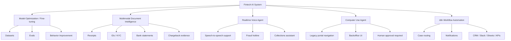
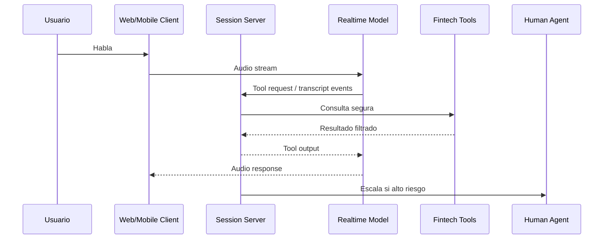
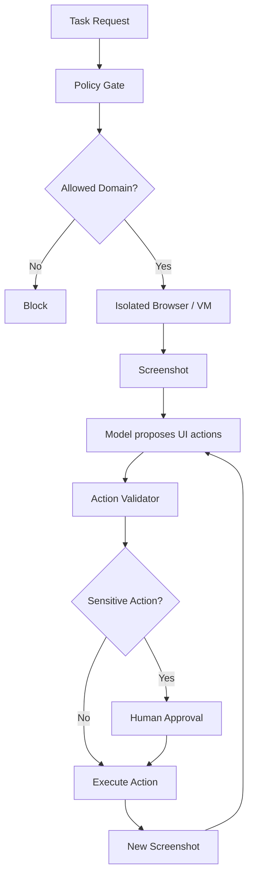
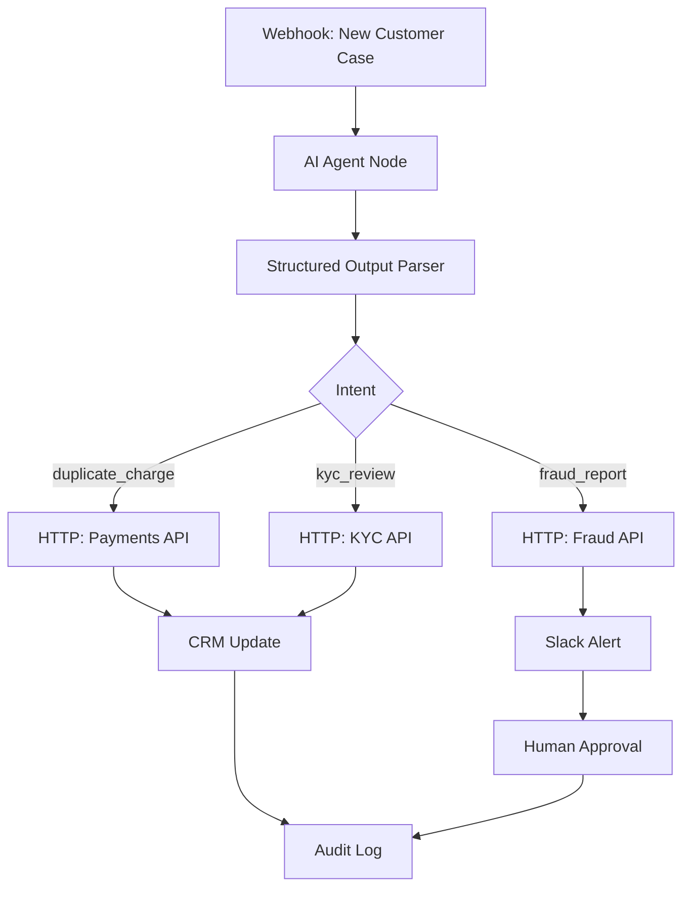

# Semana 12 — Fine-tuning / Multimodal / Realtime Voice / Computer Use / n8n para Fintech

Esta semana conecta cinco capacidades grandes:

1. **Fine-tuning / model optimization**
2. **Multimodalidad**
3. **Realtime voice**
4. **Computer use**
5. **n8n para automatización low-code / no-code**

La idea central es:

> **No todo problema fintech se resuelve con más prompt. A veces necesitás optimizar el comportamiento del modelo, leer imágenes o documentos visuales, hablar en tiempo real, operar interfaces existentes o automatizar procesos completos con workflows.**

Hasta la Semana 11 ya tenés runtime, RAG, agents, MCP, evals, observabilidad, seguridad y production readiness.
La Semana 12 te enseña a extender ese sistema hacia **modalidades y automatizaciones reales de negocio**.

---

# 1. Mapa mental de la Semana 12



---

# 2. Qué problema resuelve esta semana

En producción fintech aparecen problemas que un chatbot textual normal no cubre:

## Problema 1 — El modelo no sigue siempre el formato interno

Ejemplo:

> El modelo debería clasificar reclamos como `duplicate_charge`, `fraud_report`, `kyc_review`, pero a veces responde con categorías libres.

Acá entran:

- evals;
- prompt optimization;
- fine-tuning;
- structured outputs.

---

## Problema 2 — El usuario manda una imagen

Ejemplo:

> “Te paso foto del comprobante de transferencia.”

El sistema debe interpretar:

- monto;
- fecha;
- comercio;
- CBU/CVU;
- número de operación;
- inconsistencias.

Acá entra:

- multimodal;
- OCR-like vision;
- validación estructurada;
- comparación contra tools internas.

---

## Problema 3 — El usuario llama por teléfono

Ejemplo:

> Cliente llama porque no reconoce una compra.

El sistema necesita:

- escuchar;
- entender;
- hablar;
- consultar tools;
- pedir validación;
- escalar a humano.

Acá entra:

- realtime voice.

---

## Problema 4 — Hay sistemas legacy sin API

Ejemplo:

> El backoffice de reclamos tiene una UI vieja y no expone endpoint.

Acá entra:

- computer use;
- browser automation;
- Playwright/Selenium;
- human-in-the-loop;
- sandbox.

---

## Problema 5 — El proceso no termina en el modelo

Ejemplo:

> Si el reclamo es de fraude, crear caso, avisar Slack, actualizar CRM, mandar email y guardar evidencia.

Acá entra:

- n8n;
- workflow automation;
- webhooks;
- herramientas;
- aprobaciones.

---

# 3. Fine-tuning y model optimization

Primero, una aclaración importante y actualizada: la documentación actual de OpenAI ubica fine-tuning dentro de un flujo más amplio de **model optimization**, donde se combinan evals, prompt engineering y fine-tuning como un ciclo de mejora; también indica que la plataforma de fine-tuning de OpenAI se está discontinuando para nuevos usuarios, aunque los modelos fine-tuned existentes siguen disponibles hasta la deprecación de sus modelos base. Por eso, en esta semana conviene aprender el concepto general y diseñar el sistema de manera portable, no dependiente de una sola plataforma. ([Plataforma OpenAI](https://platform.openai.com/docs/guides/fine-tuning "
&#x20; Model optimization | OpenAI API
"))

---

# 4. Qué es fine-tuning

**Fine-tuning** es tomar un modelo base y entrenarlo con ejemplos específicos para mejorar su comportamiento en una tarea concreta.

No le “enseñás todo el negocio desde cero”.
Le mostrás patrones de entrada/salida que querés que replique mejor.

## Ejemplo fintech

Input:

```json
{
  "message": "No reconozco una compra internacional y me llegó un SMS raro.",
  "channel": "app_chat"
}
```

Output esperado:

```json
{
  "intent": "fraud_report",
  "risk": "high",
  "team": "fraud_ops",
  "requires_human_review": true,
  "must_not": ["confirm_fraud_as_fact", "promise_refund"]
}
```

El objetivo no es que el modelo “sepa” tus políticas internas.
El objetivo es que sea más consistente en:

- clasificación;
- formato;
- tono;
- routing;
- decisiones repetitivas;
- corrección de fallas de instrucción.

OpenAI describe el supervised fine-tuning como el uso de ejemplos de respuestas correctas para guiar el comportamiento del modelo; lo posiciona como útil para clasificación, traducción matizada, formatos específicos y corrección de fallas de instruction-following. ([Plataforma OpenAI](https://platform.openai.com/docs/guides/fine-tuning "
&#x20; Model optimization | OpenAI API
"))

---

# 5. Fine-tuning no reemplaza RAG

Esto es clave.

## RAG sirve para conocimiento dinámico

Usalo para:

- políticas actualizadas;
- tasas;
- condiciones comerciales;
- contratos;
- normativas;
- productos cambiantes.

## Fine-tuning sirve para comportamiento

Usalo para:

- estilo;
- formato;
- clasificación;
- decisión operativa repetitiva;
- tono;
- estructura de respuesta.

## Regla maestra

```text
RAG = conocimiento actualizado
Fine-tuning = comportamiento aprendido
Evals = evidencia de mejora
```

---

# 6. Cuándo NO usar fine-tuning

No uses fine-tuning cuando el problema se resuelve con:

- mejor prompt;
- mejor schema;
- mejor RAG;
- mejor tool;
- mejor dataset de evaluación;
- mejor router;
- mejor post-procesamiento;
- mejor guardrail.

Fine-tuning es caro en tiempo, mantenimiento y validación.
Primero medí con evals.

---

# 7. Tipos de optimización

## 7.1 Prompt optimization

Cambiar instrucciones, ejemplos y formato.

Ventaja:

- rápido;
- barato;
- reversible.

Desventaja:

- puede no alcanzar para casos muy repetitivos.

---

## 7.2 Supervised fine-tuning

Entrenar con ejemplos correctos.

Bueno para:

- clasificación;
- formato;
- tono;
- tareas repetitivas.

---

## 7.3 Vision fine-tuning

Entrenar con entradas de imagen para mejorar comprensión visual en una tarea específica. La documentación de OpenAI describe vision fine-tuning como una forma de proporcionar imágenes dentro del proceso supervisado para mejorar comprensión de entradas visuales. ([Plataforma OpenAI](https://platform.openai.com/docs/guides/fine-tuning "
&#x20; Model optimization | OpenAI API
"))

Ejemplo fintech:

- clasificación de comprobantes;
- validación de documento KYC;
- detección de recibo ilegible;
- clasificación de evidencia de chargeback.

---

## 7.4 DPO — Direct Preference Optimization

Entrenar con pares:

- respuesta buena;
- respuesta mala.

Ejemplo:

Input:

```text
Cliente: No reconozco esta compra. ¿Me devolvés la plata?
```

Respuesta A, mala:

```text
Sí, te garantizo el reintegro.
```

Respuesta B, buena:

```text
Primero debemos validar la operación. Puedo iniciar una revisión y, si corresponde, se gestionará el reclamo.
```

DPO sirve cuando querés enseñar preferencias de tono, prudencia y foco. OpenAI describe DPO como un método que proporciona una respuesta correcta e incorrecta para un prompt e indica cuál debería preferirse. ([Plataforma OpenAI](https://platform.openai.com/docs/guides/fine-tuning "
&#x20; Model optimization | OpenAI API
"))

---

## 7.5 RFT — Reinforcement Fine-Tuning

Usa graders expertos para reforzar mejores respuestas en tareas de razonamiento complejo. En documentación oficial se presenta como orientado a tareas complejas específicas de dominio y requiere graders expertos que acuerden qué salida es ideal. ([Plataforma OpenAI](https://platform.openai.com/docs/guides/fine-tuning "
&#x20; Model optimization | OpenAI API
"))

En fintech podría aplicar a:

- análisis complejo de chargebacks;
- revisión de evidencia regulatoria;
- interpretación de políticas internas complejas;
- clasificación avanzada de riesgo operativo.

---

# 8. Dataset de fine-tuning fintech

Un buen dataset debe tener:

- input realista;
- output esperado;
- formato estable;
- cobertura de edge cases;
- ejemplos buenos y malos;
- metadatos;
- separación train/test;
- redacción de PII;
- versionado.

## Ejemplo JSONL conceptual

```json
{"messages":[{"role":"system","content":"Clasificá casos fintech con salida JSON estricta."},{"role":"user","content":"No reconozco una compra internacional."},{"role":"assistant","content":"{\"intent\":\"fraud_report\",\"risk\":\"high\",\"team\":\"fraud_ops\",\"requires_human_review\":true}"}]}
```

---

# 9. Código — dataset builder

## `src/fineTuning/datasetBuilder.ts`

```ts
export type Intent =
  | "duplicate_charge"
  | "fraud_report"
  | "kyc_review"
  | "collections_plan"
  | "unknown";

export interface RawCase {
  id: string;
  message: string;
  label: {
    intent: Intent;
    risk: "low" | "medium" | "high";
    team: "payments_ops" | "fraud_ops" | "kyc_ops" | "collections_ops" | "general_support";
    requiresHumanReview: boolean;
  };
}

export interface FineTuneExample {
  messages: Array<{
    role: "system" | "user" | "assistant";
    content: string;
  }>;
}

export function redactPII(text: string): string {
  return text
    .replace(/\b\d{16}\b/g, "[REDACTED_CARD]")
    .replace(/\b\d{8}\b/g, "[REDACTED_DNI]")
    .replace(/[A-Z0-9._%+-]+@[A-Z0-9.-]+\.[A-Z]{2,}/gi, "[REDACTED_EMAIL]");
}

export function buildFineTuneExample(raw: RawCase): FineTuneExample {
  const output = {
    intent: raw.label.intent,
    risk: raw.label.risk,
    team: raw.label.team,
    requires_human_review: raw.label.requiresHumanReview
  };

  return {
    messages: [
      {
        role: "system",
        content:
          "Clasificá casos fintech. Devolvé únicamente JSON válido con intent, risk, team y requires_human_review."
      },
      {
        role: "user",
        content: redactPII(raw.message)
      },
      {
        role: "assistant",
        content: JSON.stringify(output)
      }
    ]
  };
}

export function toJsonl(examples: FineTuneExample[]): string {
  return examples.map((example) => JSON.stringify(example)).join("\n");
}
```

---

# 10. Código — baseline classifier

Antes de fine-tuning, necesitás baseline.

## `src/fineTuning/baselineClassifier.ts`

```ts
import { Intent } from "./datasetBuilder.js";

export interface ClassificationResult {
  intent: Intent;
  risk: "low" | "medium" | "high";
  team: string;
  requiresHumanReview: boolean;
  confidence: number;
}

export function classifyWithRules(message: string): ClassificationResult {
  const lower = message.toLowerCase();

  if (lower.includes("no reconozco") || lower.includes("sms") || lower.includes("fraude")) {
    return {
      intent: "fraud_report",
      risk: "high",
      team: "fraud_ops",
      requiresHumanReview: true,
      confidence: 0.86
    };
  }

  if (lower.includes("dos veces") || lower.includes("duplicado")) {
    return {
      intent: "duplicate_charge",
      risk: "medium",
      team: "payments_ops",
      requiresHumanReview: false,
      confidence: 0.78
    };
  }

  if (lower.includes("documento") || lower.includes("kyc") || lower.includes("identidad")) {
    return {
      intent: "kyc_review",
      risk: "medium",
      team: "kyc_ops",
      requiresHumanReview: false,
      confidence: 0.74
    };
  }

  if (lower.includes("deuda") || lower.includes("plan de pago")) {
    return {
      intent: "collections_plan",
      risk: "medium",
      team: "collections_ops",
      requiresHumanReview: true,
      confidence: 0.71
    };
  }

  return {
    intent: "unknown",
    risk: "low",
    team: "general_support",
    requiresHumanReview: false,
    confidence: 0.35
  };
}
```

---

# 11. Código — eval de mejora

## `src/fineTuning/evalClassifier.ts`

```ts
import { RawCase } from "./datasetBuilder.js";
import { classifyWithRules } from "./baselineClassifier.js";

export interface EvalReport {
  total: number;
  intentAccuracy: number;
  riskAccuracy: number;
  teamAccuracy: number;
  humanReviewAccuracy: number;
  failedCases: string[];
}

export function evaluateClassifier(cases: RawCase[]): EvalReport {
  let intentOk = 0;
  let riskOk = 0;
  let teamOk = 0;
  let reviewOk = 0;
  const failedCases: string[] = [];

  for (const testCase of cases) {
    const prediction = classifyWithRules(testCase.message);

    if (prediction.intent === testCase.label.intent) intentOk++;
    if (prediction.risk === testCase.label.risk) riskOk++;
    if (prediction.team === testCase.label.team) teamOk++;
    if (prediction.requiresHumanReview === testCase.label.requiresHumanReview) reviewOk++;

    if (
      prediction.intent !== testCase.label.intent ||
      prediction.risk !== testCase.label.risk ||
      prediction.team !== testCase.label.team ||
      prediction.requiresHumanReview !== testCase.label.requiresHumanReview
    ) {
      failedCases.push(testCase.id);
    }
  }

  return {
    total: cases.length,
    intentAccuracy: intentOk / cases.length,
    riskAccuracy: riskOk / cases.length,
    teamAccuracy: teamOk / cases.length,
    humanReviewAccuracy: reviewOk / cases.length,
    failedCases
  };
}
```

---

# 12. Multimodalidad

Multimodal significa que el sistema puede trabajar con más de una modalidad:

- texto;
- imagen;
- audio;
- pantalla;
- archivo;
- video, según plataforma/modelo.

En esta semana nos enfocamos en fintech:

- comprobantes;
- DNI/documentos;
- resúmenes bancarios;
- capturas de pantalla;
- recibos;
- evidencia de chargeback.

Los modelos actuales pueden procesar imágenes como entrada y analizarlas; OpenAI documenta capacidades para imágenes de entrada y generación/edición de imágenes, y lista tipos soportados como PNG, JPEG, WEBP y GIF no animado, además de límites de payload y cantidad de imágenes por request. ([Plataforma OpenAI](https://platform.openai.com/docs/guides/images-vision "
&#x20; Images and vision | OpenAI API
"))

---

# 13. Casos multimodales fintech

## Caso 1 — Comprobante de transferencia

El usuario sube imagen de comprobante.

Extraer:

- monto;
- fecha;
- cuenta origen;
- cuenta destino;
- número de operación;
- banco;
- estado visual.

Validar contra:

- ledger interno;
- movimientos;
- antifraude;
- fecha/hora;
- duplicados.

---

## Caso 2 — KYC con documento

Extraer:

- nombre;
- DNI;
- fecha de nacimiento;
- fecha de vencimiento;
- calidad de imagen;
- posible manipulación;
- mismatch contra onboarding.

---

## Caso 3 — Evidencia de chargeback

El usuario sube:

- captura de comercio;
- ticket;
- email de confirmación;
- comprobante.

El sistema debe:

- clasificar evidencia;
- extraer datos;
- no inventar;
- devolver confidence;
- pedir evidencia faltante.

---

# 14. Código — esquema multimodal

## `src/multimodal/types.ts`

```ts
export type DocumentType =
  | "transfer_receipt"
  | "id_document"
  | "bank_statement"
  | "chargeback_evidence"
  | "unknown";

export interface ImageInput {
  imageId: string;
  fileName: string;
  mimeType: "image/png" | "image/jpeg" | "image/webp" | "image/gif";
  sizeBytes: number;
  base64?: string;
}

export interface ExtractedFinancialDocument {
  documentType: DocumentType;
  confidence: number;
  extractedFields: Record<string, string | number | boolean | null>;
  missingFields: string[];
  warnings: string[];
  requiresHumanReview: boolean;
}
```

---

# 15. Código — validador de imagen

## `src/multimodal/imageValidator.ts`

```ts
import { ImageInput } from "./types.js";

const SUPPORTED_TYPES = new Set([
  "image/png",
  "image/jpeg",
  "image/webp",
  "image/gif"
]);

export function validateImageInput(image: ImageInput): string[] {
  const errors: string[] = [];

  if (!SUPPORTED_TYPES.has(image.mimeType)) {
    errors.push(`unsupported_mime_type:${image.mimeType}`);
  }

  if (image.sizeBytes <= 0) {
    errors.push("empty_image");
  }

  if (image.sizeBytes > 20 * 1024 * 1024) {
    errors.push("image_too_large_for_demo_limit");
  }

  if (!image.fileName.trim()) {
    errors.push("missing_file_name");
  }

  return errors;
}
```

---

# 16. Código — extractor multimodal simulado

En un repo educativo conviene simular el modelo multimodal para poder testear sin costo externo.

## `src/multimodal/documentExtractor.ts`

```ts
import { ExtractedFinancialDocument, ImageInput } from "./types.js";
import { validateImageInput } from "./imageValidator.js";

export function extractFinancialDocumentFromImage(
  image: ImageInput,
  visibleTextHint: string
): ExtractedFinancialDocument {
  const validationErrors = validateImageInput(image);

  if (validationErrors.length > 0) {
    return {
      documentType: "unknown",
      confidence: 0,
      extractedFields: {},
      missingFields: ["valid_image"],
      warnings: validationErrors,
      requiresHumanReview: true
    };
  }

  const text = visibleTextHint.toLowerCase();

  if (text.includes("transferencia") || text.includes("cvu") || text.includes("cbu")) {
    return {
      documentType: "transfer_receipt",
      confidence: 0.88,
      extractedFields: {
        amount: extractAmount(text),
        currency: text.includes("ars") ? "ARS" : null,
        operationId: extractOperationId(text),
        destinationAccount: text.includes("cvu") ? "CVU_detected" : "CBU_detected"
      },
      missingFields: [],
      warnings: [],
      requiresHumanReview: false
    };
  }

  if (text.includes("dni") || text.includes("documento")) {
    return {
      documentType: "id_document",
      confidence: 0.82,
      extractedFields: {
        documentNumber: "[REDACTED_DNI]",
        imageQuality: text.includes("borroso") ? "low" : "acceptable"
      },
      missingFields: text.includes("borroso") ? ["clear_front_image"] : [],
      warnings: text.includes("borroso") ? ["low_image_quality"] : [],
      requiresHumanReview: text.includes("borroso")
    };
  }

  return {
    documentType: "unknown",
    confidence: 0.32,
    extractedFields: {},
    missingFields: ["document_type"],
    warnings: ["could_not_classify_document"],
    requiresHumanReview: true
  };
}

function extractAmount(text: string): number | null {
  const match = text.match(/(?:ars|\$)\s?(\d+(?:[.,]\d+)?)/i);
  if (!match) return null;
  return Number(match[1].replace(",", "."));
}

function extractOperationId(text: string): string | null {
  const match = text.match(/(?:operaci[oó]n|op)\s?[:#]?\s?([a-z0-9-]+)/i);
  return match?.[1] ?? null;
}
```

---

# 17. Realtime voice

Realtime voice significa tener una sesión viva donde el usuario habla y el sistema responde con baja latencia.

No es lo mismo que:

- subir un audio;
- transcribirlo;
- mandar texto al modelo;
- generar un audio de respuesta.

Eso es request-based.

Realtime voice es una experiencia interactiva.

La documentación actual de OpenAI diferencia sesiones realtime para audio de baja latencia de APIs de audio basadas en requests; también distingue casos como voice agents, traducción en vivo, transcripción y speech generation. ([Plataforma OpenAI](https://platform.openai.com/docs/guides/realtime "
&#x20; Realtime and audio | OpenAI API
"))

---

# 18. Cuándo usar realtime voice en fintech

## Bueno para

- soporte conversacional;
- línea de fraude;
- onboarding asistido;
- cobranzas cuidadas;
- ayuda a clientes con baja alfabetización digital;
- casos donde hablar es más rápido que escribir.

## No ideal para

- operaciones financieras irreversibles sin confirmación;
- explicaciones legales complejas sin resumen escrito;
- casos que requieren evidencia documental;
- decisiones de alto impacto sin humano.

---

# 19. Arquitectura realtime voice



Para transporte, OpenAI recomienda elegir según dónde se captura/reproduce audio: WebRTC para browser/mobile, WebSocket para pipelines de servidor o llamadas, y SIP para agentes telefónicos cuando el modelo lo soporte. ([Plataforma OpenAI](https://platform.openai.com/docs/guides/realtime "
&#x20; Realtime and audio | OpenAI API
"))

---

# 20. Código — session simulator de voz

## `src/realtimeVoice/types.ts`

```ts
export interface VoiceTurn {
  speaker: "customer" | "agent";
  text: string;
  timestamp: string;
}

export interface VoiceSessionState {
  sessionId: string;
  customerId: string;
  domain: "payments" | "fraud" | "kyc" | "collections";
  turns: VoiceTurn[];
  risk: "low" | "medium" | "high";
  requiresHumanEscalation: boolean;
}

export interface VoiceAgentResponse {
  transcript: string;
  spokenResponse: string;
  toolRequests: string[];
  requiresHumanEscalation: boolean;
}
```

---

## `src/realtimeVoice/voiceAgent.ts`

```ts
import { VoiceAgentResponse, VoiceSessionState } from "./types.js";

export function handleVoiceTurn(
  state: VoiceSessionState,
  userTranscript: string
): VoiceAgentResponse {
  const lower = userTranscript.toLowerCase();

  state.turns.push({
    speaker: "customer",
    text: userTranscript,
    timestamp: new Date().toISOString()
  });

  if (lower.includes("no reconozco") || lower.includes("sms")) {
    state.domain = "fraud";
    state.risk = "high";
    state.requiresHumanEscalation = true;

    return {
      transcript: userTranscript,
      spokenResponse:
        "Entiendo. Por seguridad voy a tratarlo como una sospecha de fraude. No voy a confirmar el fraude todavía; primero necesitamos validar la operación.",
      toolRequests: ["get_transaction_status", "get_customer_risk_flags"],
      requiresHumanEscalation: true
    };
  }

  if (lower.includes("dos veces") || lower.includes("duplicado")) {
    state.domain = "payments";
    state.risk = "medium";

    return {
      transcript: userTranscript,
      spokenResponse:
        "Puede tratarse de un cargo duplicado o de una retención temporal. Voy a consultar el estado de la transacción.",
      toolRequests: ["get_transaction_status"],
      requiresHumanEscalation: false
    };
  }

  return {
    transcript: userTranscript,
    spokenResponse:
      "Necesito algunos datos más para orientarte correctamente. ¿Podés contarme qué operación estás consultando?",
    toolRequests: [],
    requiresHumanEscalation: false
  };
}
```

---

# 21. Reglas de seguridad para voz

En fintech, el voice agent debe:

- no pedir datos sensibles completos;
- no leer PAN completo;
- no decir “fraude confirmado” sin validación;
- confirmar identidad con flujo seguro;
- escalar alto riesgo;
- guardar transcript redactado;
- aplicar consentimiento según regulación local;
- cortar o derivar si el usuario pide una acción irreversible.

---

# 22. Computer use

**Computer use** significa que el modelo puede mirar una interfaz visual mediante screenshots y devolver acciones como click, scroll o typing, que tu harness ejecuta en un navegador o VM.

Esto sirve cuando no hay API, pero sí hay un sistema interno navegable.

La documentación oficial recomienda ejecutar computer use en un navegador/VM aislado, mantener humano en el loop para acciones de alto impacto y tratar el contenido de páginas como input no confiable; también describe el loop básico: enviar tarea con la tool, inspeccionar `computer_call`, ejecutar acciones, capturar pantalla actualizada y repetir hasta que el modelo deje de pedir acciones. ([Plataforma OpenAI](https://platform.openai.com/docs/guides/tools-computer-use "
&#x20; Computer use | OpenAI API
"))

---

# 23. Casos fintech para computer use

## Buen caso

- consultar estado en backoffice legacy;
- navegar un portal interno;
- descargar evidencia;
- completar formulario de borrador;
- revisar UI operativa.

## Caso peligroso

- aprobar crédito;
- bloquear tarjeta;
- cerrar cuenta;
- transferir dinero;
- cambiar límite;
- enviar disputa final sin humano.

---

# 24. Arquitectura segura de computer use



---

# 25. Código — computer action policy

## `src/computerUse/types.ts`

```ts
export type UiActionType = "click" | "type" | "scroll" | "wait";

export interface UiAction {
  type: UiActionType;
  selector?: string;
  text?: string;
  x?: number;
  y?: number;
}

export interface ComputerTask {
  taskId: string;
  tenantId: string;
  domain: "payments" | "fraud" | "kyc";
  objective: string;
  allowedDomains: string[];
  requiresHumanApprovalFor: string[];
}

export interface ComputerPolicyDecision {
  allowed: boolean;
  requiresHumanApproval: boolean;
  reason?: string;
}
```

---

## `src/computerUse/policy.ts`

```ts
import { ComputerPolicyDecision, ComputerTask, UiAction } from "./types.js";

export function validateComputerTask(task: ComputerTask, currentUrl: string): ComputerPolicyDecision {
  const allowed = task.allowedDomains.some((domain) => currentUrl.startsWith(domain));

  if (!allowed) {
    return {
      allowed: false,
      requiresHumanApproval: false,
      reason: "domain_not_allowed"
    };
  }

  const dangerousWords = ["aprobar", "bloquear", "cerrar cuenta", "transferir", "enviar disputa"];
  const objective = task.objective.toLowerCase();

  if (dangerousWords.some((word) => objective.includes(word))) {
    return {
      allowed: true,
      requiresHumanApproval: true,
      reason: "sensitive_objective"
    };
  }

  return {
    allowed: true,
    requiresHumanApproval: false
  };
}

export function validateUiAction(action: UiAction): ComputerPolicyDecision {
  if (action.type === "type" && action.text) {
    const lower = action.text.toLowerCase();

    if (lower.includes("cvv") || /\b\d{16}\b/.test(lower)) {
      return {
        allowed: false,
        requiresHumanApproval: false,
        reason: "sensitive_data_typing_blocked"
      };
    }
  }

  if (action.type === "click" && action.selector?.toLowerCase().includes("submit-final")) {
    return {
      allowed: true,
      requiresHumanApproval: true,
      reason: "final_submit_requires_approval"
    };
  }

  return {
    allowed: true,
    requiresHumanApproval: false
  };
}
```

---

# 26. n8n para workflows AI

n8n sirve para conectar sistemas y automatizar workflows. En contexto AI, puede funcionar como capa de orquestación low-code para:

- recibir webhooks;
- llamar APIs fintech;
- invocar agentes;
- mover datos entre herramientas;
- mandar Slack/email;
- guardar resultados;
- pedir aprobación humana;
- ejecutar acciones determinísticas.

La documentación de n8n define el AI Agent node como un agente autónomo que recibe datos, decide y actúa en su entorno usando tools y APIs externas; también indica que se debe conectar al menos una tool al nodo. ([n8n Docs](https://docs.n8n.io/integrations/builtin/cluster-nodes/root-nodes/n8n-nodes-langchain.agent "AI Agent node documentation | n8n Docs "))

---

# 27. n8n Tools Agent

El Tools Agent de n8n usa herramientas y APIs externas para recuperar información o ejecutar acciones; la documentación indica que trabaja con tool calling, schemas, modelos de chat y opciones como formato específico de salida, system message, max iterations y retorno de pasos intermedios. ([n8n Docs](https://docs.n8n.io/integrations/builtin/cluster-nodes/root-nodes/n8n-nodes-langchain.agent/tools-agent "Tools AI Agent node documentation | n8n Docs "))

## Aplicación fintech

Un workflow n8n podría hacer:

1. Webhook recibe reclamo.
2. AI Agent clasifica.
3. HTTP node consulta sistema de pagos.
4. Switch node decide ruta.
5. Slack node avisa si es fraude.
6. Google Sheets / DB guarda auditoría.
7. Email node confirma recepción.
8. Human approval antes de acciones sensibles.

---

# 28. Arquitectura n8n fintech



---

# 29. Código — workflow spec tipo n8n

No vamos a depender de n8n real en el ejemplo educativo, pero podemos generar una especificación portable del workflow.

## `src/n8n/workflowSpec.ts`

```ts
export interface WorkflowNode {
  id: string;
  type: "webhook" | "ai_agent" | "http" | "switch" | "slack" | "email" | "approval" | "audit";
  name: string;
  config: Record<string, unknown>;
}

export interface WorkflowEdge {
  from: string;
  to: string;
  condition?: string;
}

export interface WorkflowSpec {
  name: string;
  version: string;
  nodes: WorkflowNode[];
  edges: WorkflowEdge[];
}

export function buildFintechCaseWorkflow(): WorkflowSpec {
  return {
    name: "fintech-ai-case-intake",
    version: "1.0.0",
    nodes: [
      {
        id: "webhook",
        type: "webhook",
        name: "New customer case",
        config: {
          path: "/webhooks/customer-case",
          method: "POST"
        }
      },
      {
        id: "agent",
        type: "ai_agent",
        name: "Classify case",
        config: {
          outputFormat: "json",
          maxIterations: 4,
          systemMessage:
            "Classify fintech support cases. Never execute sensitive actions without approval."
        }
      },
      {
        id: "intent_switch",
        type: "switch",
        name: "Route by intent",
        config: {
          cases: ["fraud_report", "duplicate_charge", "kyc_review", "unknown"]
        }
      },
      {
        id: "fraud_api",
        type: "http",
        name: "Fraud API",
        config: {
          method: "POST",
          url: "https://internal.example/fraud/intake"
        }
      },
      {
        id: "payments_api",
        type: "http",
        name: "Payments API",
        config: {
          method: "POST",
          url: "https://internal.example/payments/cases"
        }
      },
      {
        id: "approval",
        type: "approval",
        name: "Human approval for sensitive cases",
        config: {
          requiredFor: ["fraud_report", "card_block", "submit_dispute"]
        }
      },
      {
        id: "audit",
        type: "audit",
        name: "Audit log",
        config: {
          redactPII: true
        }
      }
    ],
    edges: [
      { from: "webhook", to: "agent" },
      { from: "agent", to: "intent_switch" },
      { from: "intent_switch", to: "fraud_api", condition: "intent == fraud_report" },
      { from: "intent_switch", to: "payments_api", condition: "intent == duplicate_charge" },
      { from: "fraud_api", to: "approval" },
      { from: "payments_api", to: "audit" },
      { from: "approval", to: "audit" }
    ]
  };
}
```

---

# 30. Orquestador completo de Semana 12

Ahora unimos todo:

- clasificador;
- extractor multimodal;
- voice agent;
- computer policy;
- workflow n8n spec.

## `src/orchestrator.ts`

```ts
import { classifyWithRules } from "./fineTuning/baselineClassifier.js";
import { RawCase, buildFineTuneExample } from "./fineTuning/datasetBuilder.js";
import { extractFinancialDocumentFromImage } from "./multimodal/documentExtractor.js";
import { ImageInput } from "./multimodal/types.js";
import { handleVoiceTurn } from "./realtimeVoice/voiceAgent.js";
import { VoiceSessionState } from "./realtimeVoice/types.js";
import { validateComputerTask, validateUiAction } from "./computerUse/policy.js";
import { ComputerTask, UiAction } from "./computerUse/types.js";
import { buildFintechCaseWorkflow } from "./n8n/workflowSpec.js";

export function runWeek12Demo() {
  const rawCase: RawCase = {
    id: "case_001",
    message: "No reconozco una compra internacional y me llegó un SMS raro.",
    label: {
      intent: "fraud_report",
      risk: "high",
      team: "fraud_ops",
      requiresHumanReview: true
    }
  };

  const classification = classifyWithRules(rawCase.message);
  const fineTuneExample = buildFineTuneExample(rawCase);

  const image: ImageInput = {
    imageId: "img_001",
    fileName: "comprobante.png",
    mimeType: "image/png",
    sizeBytes: 350_000
  };

  const documentExtraction = extractFinancialDocumentFromImage(
    image,
    "Comprobante de transferencia ARS 15000 CVU operación OP-12345"
  );

  const voiceState: VoiceSessionState = {
    sessionId: "voice_001",
    customerId: "cust_001",
    domain: "payments",
    risk: "low",
    turns: [],
    requiresHumanEscalation: false
  };

  const voiceResponse = handleVoiceTurn(
    voiceState,
    "No reconozco una compra internacional y recibí un SMS."
  );

  const computerTask: ComputerTask = {
    taskId: "task_001",
    tenantId: "fintech_ar",
    domain: "fraud",
    objective: "Consultar estado de reclamo en portal interno",
    allowedDomains: ["https://backoffice.internal"],
    requiresHumanApprovalFor: ["submit-final", "block-card"]
  };

  const computerTaskDecision = validateComputerTask(
    computerTask,
    "https://backoffice.internal/cases/123"
  );

  const action: UiAction = {
    type: "click",
    selector: "#open-case"
  };

  const actionDecision = validateUiAction(action);

  const workflow = buildFintechCaseWorkflow();

  return {
    classification,
    fineTuneExample,
    documentExtraction,
    voiceResponse,
    computerTaskDecision,
    actionDecision,
    workflow
  };
}
```

---

# 31. Main de demo

## `src/main.ts`

```ts
import fs from "node:fs";
import { runWeek12Demo } from "./orchestrator.js";

const result = runWeek12Demo();

console.log(JSON.stringify(result, null, 2));

fs.writeFileSync(
  "week12_demo_results.json",
  JSON.stringify(result, null, 2)
);
```

---

# 32. Qué debería generar la demo

Debe producir:

```json
{
  "classification": {
    "intent": "fraud_report",
    "risk": "high",
    "team": "fraud_ops",
    "requiresHumanReview": true,
    "confidence": 0.86
  },
  "documentExtraction": {
    "documentType": "transfer_receipt",
    "confidence": 0.88,
    "requiresHumanReview": false
  },
  "voiceResponse": {
    "toolRequests": [
      "get_transaction_status",
      "get_customer_risk_flags"
    ],
    "requiresHumanEscalation": true
  },
  "computerTaskDecision": {
    "allowed": true,
    "requiresHumanApproval": false
  },
  "workflow": {
    "name": "fintech-ai-case-intake",
    "version": "1.0.0"
  }
}
```

---

# 33. Tests recomendados

## Test 1 — PII redaction

```ts
import test from "node:test";
import assert from "node:assert/strict";
import { redactPII } from "../src/fineTuning/datasetBuilder.js";

test("redacts card, DNI and email", () => {
  const text = "Mi tarjeta 1234567812345678 DNI 12345678 mail test@example.com";
  const redacted = redactPII(text);

  assert.equal(redacted.includes("1234567812345678"), false);
  assert.equal(redacted.includes("12345678"), false);
  assert.equal(redacted.includes("test@example.com"), false);
});
```

---

## Test 2 — Fraud classification

```ts
import test from "node:test";
import assert from "node:assert/strict";
import { classifyWithRules } from "../src/fineTuning/baselineClassifier.js";

test("classifies fraud report as high risk", () => {
  const result = classifyWithRules("No reconozco una compra y me llegó un SMS raro.");

  assert.equal(result.intent, "fraud_report");
  assert.equal(result.risk, "high");
  assert.equal(result.requiresHumanReview, true);
});
```

---

## Test 3 — Multimodal extraction

```ts
import test from "node:test";
import assert from "node:assert/strict";
import { extractFinancialDocumentFromImage } from "../src/multimodal/documentExtractor.js";

test("extracts transfer receipt from visual text hint", () => {
  const result = extractFinancialDocumentFromImage(
    {
      imageId: "img_001",
      fileName: "receipt.png",
      mimeType: "image/png",
      sizeBytes: 1000
    },
    "Comprobante transferencia ARS 15000 CVU operación OP-123"
  );

  assert.equal(result.documentType, "transfer_receipt");
  assert.equal(result.requiresHumanReview, false);
});
```

---

## Test 4 — Computer use blocks unsafe typing

```ts
import test from "node:test";
import assert from "node:assert/strict";
import { validateUiAction } from "../src/computerUse/policy.js";

test("blocks typing sensitive card data", () => {
  const decision = validateUiAction({
    type: "type",
    text: "1234567812345678"
  });

  assert.equal(decision.allowed, false);
  assert.equal(decision.reason, "sensitive_data_typing_blocked");
});
```

---

## Test 5 — n8n workflow contains approval

```ts
import test from "node:test";
import assert from "node:assert/strict";
import { buildFintechCaseWorkflow } from "../src/n8n/workflowSpec.js";

test("workflow includes human approval node", () => {
  const workflow = buildFintechCaseWorkflow();
  const approval = workflow.nodes.find((node) => node.type === "approval");

  assert.ok(approval);
});
```

---

# 34. Ejercicios prácticos por día

## Lunes — Fine-tuning y datasets

### Ejercicio 1

Crear 30 casos fintech:

- 10 pagos;
- 8 fraude;
- 6 KYC;
- 6 cobranzas.

Cada caso debe tener:

- input;
- intent;
- risk;
- team;
- requiresHumanReview.

### Ejercicio 2

Convertirlos a JSONL con `buildFineTuneExample()`.

### Ejercicio 3

Separar:

```text
70 % train
15 % validation
15 % test
```

### Aprendizaje

Aprendés que fine-tuning empieza con datos buenos, no con código.

---

## Martes — Evals antes de optimizar

### Ejercicio 4

Usar `evaluateClassifier()`.

Medir:

- intent accuracy;
- risk accuracy;
- team accuracy;
- human review accuracy.

### Ejercicio 5

Agregar edge cases:

- fraude ambiguo;
- mensaje incompleto;
- cliente enojado;
- pedido de reintegro;
- dato sensible.

### Aprendizaje

Sin evals, no sabés si fine-tuning mejora o empeora.

---

## Miércoles — Multimodal fintech

### Ejercicio 6

Agregar soporte para:

- `bank_statement`;
- `chargeback_evidence`.

### Ejercicio 7

Detectar campos faltantes:

- monto;
- fecha;
- comercio;
- número de operación.

### Ejercicio 8

Agregar regla:

```text
confidence < 0.75 => requiresHumanReview = true
```

### Aprendizaje

Un sistema multimodal serio no solo extrae; también mide confianza y deriva.

---

## Jueves — Realtime voice

### Ejercicio 9

Agregar estados de conversación:

- `identity_check_pending`;
- `case_triaged`;
- `tool_lookup`;
- `human_escalated`.

### Ejercicio 10

Simular una llamada de fraude de 5 turnos.

El agente debe:

- no pedir tarjeta completa;
- no confirmar fraude;
- pedir validación;
- escalar a humano.

### Aprendizaje

Voice AI es un workflow conversacional, no una respuesta aislada.

---

## Viernes — Computer use

### Ejercicio 11

Agregar allowlist:

```ts
const allowedDomains = [
  "https://backoffice.internal",
  "https://cases.internal"
];
```

### Ejercicio 12

Bloquear acciones:

- submit final;
- card block;
- close account;
- change limit.

### Ejercicio 13

Agregar approval para clicks sensibles.

### Aprendizaje

Computer use debe tratarse como una frontera de seguridad, no como una comodidad.

---

## Sábado — n8n workflow

### Ejercicio 14

Diseñar un workflow:

```text
Webhook
→ AI Agent
→ Structured Parser
→ Switch
→ Fraud API / Payments API / KYC API
→ Human Approval
→ Slack
→ Audit Log
```

### Ejercicio 15

Exportar el workflow spec como JSON.

### Ejercicio 16

Crear tests que validen:

- existe approval;
- existe audit;
- fraude pasa por approval;
- pagos va a payments API;
- casos desconocidos no ejecutan acciones sensibles.

### Aprendizaje

n8n funciona mejor cuando combina AI con pasos determinísticos y controles claros.

---

# 35. Anti-patrones de esta semana

## 1. Fine-tuning sin evals

No sabés si mejoraste.

## 2. Fine-tuning para conocimiento cambiante

Ese problema es de RAG, no de fine-tuning.

## 3. Multimodal sin validación

El modelo puede leer mal imágenes borrosas.

## 4. Voice agent sin escalation path

Riesgoso en fraude y cobranzas.

## 5. Computer use sin sandbox

Peligroso para sistemas internos.

## 6. n8n agent con demasiadas tools

Aumenta riesgo, costo y errores.

## 7. Workflows sin audit log

En fintech no sirve.

## 8. Automatizar acciones sensibles sin HITL

No debe hacerse.

---

# 36. Checklist de Semana 12

## Fine-tuning / optimization

-  Dataset limpio.
-  PII redactada.
-  Train/validation/test.
-  Baseline.
-  Evals.
-  Criterios de mejora.
-  Rollback.

## Multimodal

-  Tipos de documentos.
-  Validación de imagen.
-  Extracción estructurada.
-  Confidence.
-  Campos faltantes.
-  Human review.

## Voice

-  Session state.
-  Transcript.
-  Tool gating.
-  Escalamiento.
-  No datos sensibles completos.
-  Respuesta breve y clara.

## Computer use

-  Sandbox.
-  Domain allowlist.
-  Action validator.
-  HITL.
-  Screenshots tratados como datos no confiables.
-  Audit trail.

## n8n

-  Webhook.
-  AI Agent.
-  Structured parser.
-  Switch.
-  Approval.
-  Audit.
-  Error handling.
-  Secrets protegidos.

---

# 37. Entregable final ideal

El proyecto final de esta semana debería llamarse:

# `week12-multimodal-automation-fintech`

Y debería incluir:

```text
week12-multimodal-automation-fintech/
├─ README.md
├─ README.es.md
├─ README.en.md
├─ docs/
│  ├─ es/
│  └─ en/
├─ src/
│  ├─ fineTuning/
│  │  ├─ datasetBuilder.ts
│  │  ├─ baselineClassifier.ts
│  │  └─ evalClassifier.ts
│  ├─ multimodal/
│  │  ├─ types.ts
│  │  ├─ imageValidator.ts
│  │  └─ documentExtractor.ts
│  ├─ realtimeVoice/
│  │  ├─ types.ts
│  │  └─ voiceAgent.ts
│  ├─ computerUse/
│  │  ├─ types.ts
│  │  └─ policy.ts
│  ├─ n8n/
│  │  └─ workflowSpec.ts
│  ├─ orchestrator.ts
│  └─ main.ts
├─ tests/
│  ├─ pii.test.ts
│  ├─ classifier.test.ts
│  ├─ multimodal.test.ts
│  ├─ voice.test.ts
│  ├─ computerUse.test.ts
│  └─ n8nWorkflow.test.ts
└─ data/
   ├─ fintech_cases.json
   └─ sample_images_manifest.json
```

---

# 38. Qué deberías poder explicar al terminar

Al cerrar la Semana 12 deberías poder explicar:

1. Diferencia entre prompt engineering, RAG y fine-tuning.
2. Cuándo conviene fine-tuning y cuándo no.
3. Cómo armar un dataset de entrenamiento fintech.
4. Por qué las evals van antes y después de optimizar.
5. Cómo interpretar imágenes de comprobantes o documentos.
6. Cómo diseñar extracción estructurada con confidence y human review.
7. Qué diferencia hay entre audio request-based y realtime voice.
8. Cómo diseñar un voice agent seguro.
9. Qué es computer use y por qué requiere sandbox.
10. Cómo evitar acciones peligrosas en UI automation.
11. Cómo usar n8n como capa de workflow.
12. Cómo combinar AI con nodos determinísticos, approvals y audit.

---

# 39. Resumen maestro

La Semana 12 no es “probar features nuevas”.
Es aprender a extender tu plataforma AI fintech hacia capacidades reales de negocio:

```text
Fine-tuning    → mejora comportamiento repetitivo
Multimodal     → entiende documentos, imágenes y evidencia
Realtime voice → atiende conversaciones vivas
Computer use   → opera interfaces legacy con control
n8n            → automatiza procesos completos
```

La regla final es:

> **Toda capacidad avanzada necesita evaluación, seguridad, trazabilidad y límites.**

Porque en fintech no alcanza con que el sistema pueda hacerlo.
Tiene que poder hacerlo **bien, seguro, medible y auditable**.

El siguiente paso natural es convertir esta Semana 12 en el repo GitHub bilingüe completo con README, docs, diagramas, código, tests, CI y ZIP listo para subir.