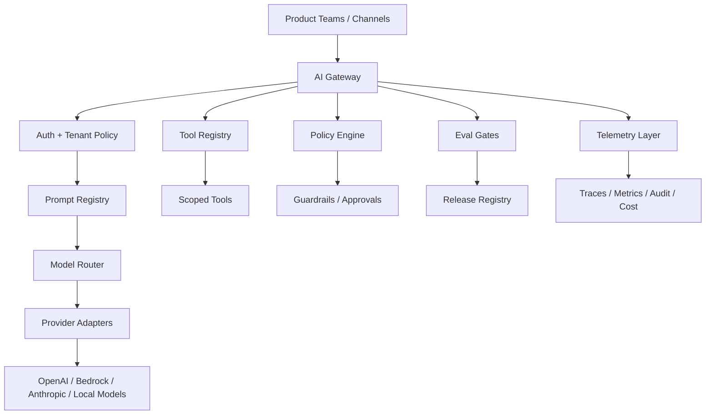

# Semana 13 — AI Platform Engineering / LLM Gateway / Control Plane para Fintech

## Tema central

La Semana 13 es el salto de:

> “tengo varios servicios con IA funcionando”

a:

> “tengo una **plataforma corporativa de IA** gobernada, reusable, observable, segura y escalable para muchos equipos”.

Hasta la Semana 12 ya construiste piezas muy potentes:

- LLM runtime;
- structured outputs;
- tool calling;
- memory;
- RAG;
- agents;
- MCP;
- evals;
- observabilidad;
- guardrails;
- production readiness;
- multimodal;
- realtime voice;
- computer use;
- n8n.

La Semana 13 une todo eso en una arquitectura enterprise.

La pregunta principal es:

> **¿Cómo hago para que muchos equipos de una fintech usen IA sin que cada uno reinvente prompts, seguridad, tools, métricas, costos, modelos y gobernanza?**

---

# 1. Objetivo de la Semana 13

Construir conceptualmente y con código un:

# `Enterprise AI Control Plane v1`

Orientado a fintech.

Debe permitir:

- centralizar el acceso a modelos;
- enrutar requests por riesgo, dominio, costo y latencia;
- aplicar políticas comunes;
- controlar permisos por tenant/equipo;
- versionar prompts;
- gobernar tools;
- auditar cada request;
- aplicar límites de costo;
- validar releases con evals;
- generar trazas y métricas estándar;
- habilitar multi-modelo;
- evitar uso directo e informal de APIs de modelos.

La idea es que la organización deje de tener muchos “scripts con IA” y pase a tener una **plataforma de IA gobernada**.

---

# 2. Mapa mental de la semana



---

# 3. Por qué esta semana es clave en una fintech

En una fintech real, los equipos pueden empezar a usar IA para:

- soporte;
- fraude;
- cobranza;
- KYC;
- onboarding;
- chargebacks;
- análisis de riesgo;
- developer experience;
- operaciones internas;
- data governance.

Si cada equipo llama directamente a un modelo:

```text
Equipo A → API modelo
Equipo B → API modelo
Equipo C → API modelo
Equipo D → API modelo
```

aparecen problemas:

- prompts duplicados;
- costos invisibles;
- herramientas inseguras;
- nula trazabilidad;
- modelos elegidos sin criterio;
- outputs sin evaluación;
- policies inconsistentes;
- riesgos de fuga de datos;
- ausencia de rollback;
- dependencia fuerte de un proveedor;
- dificultad para pasar auditorías.

La Semana 13 enseña a evitar eso con una capa común:

```text
Todos los equipos → AI Gateway / Control Plane → modelos, tools, policies, evals y observabilidad
```

---

# 4. Concepto 1 — AI Platform

Una **AI Platform** es una capa común para construir, operar y gobernar aplicaciones de IA.

No es solamente un endpoint.

Incluye:

- acceso a modelos;
- versionado de prompts;
- tool registry;
- policy engine;
- observabilidad;
- evaluaciones;
- costos;
- seguridad;
- approvals;
- datasets;
- control de releases;
- documentación;
- onboarding para equipos.

## Diferencia con una app AI

Una app AI resuelve un caso.

Ejemplo:

> “Clasificar chargebacks.”

Una AI Platform permite que muchos casos se creen de forma segura.

Ejemplo:

> “Cualquier equipo puede crear un agente fintech usando modelos, prompts, tools, policies, evals y trazabilidad corporativa.”

---

# 5. Concepto 2 — Control plane vs data plane

Este concepto es central.

## Control plane

Define las reglas.

Ejemplos:

- qué modelos existen;
- qué prompts están aprobados;
- qué tools puede usar cada dominio;
- qué equipos tienen acceso;
- qué límites de costo aplican;
- qué guardrails son obligatorios;
- qué evals bloquean un release.

## Data plane

Ejecuta las requests reales.

Ejemplos:

- recibe input del usuario;
- arma contexto;
- llama al modelo;
- ejecuta tools;
- devuelve respuesta;
- registra trazas.

## Analogía

```text
Control plane = gobierno, configuración, políticas
Data plane    = ejecución real
```

En fintech conviene separarlos porque no querés que cada request de producción tenga lógica hardcodeada de gobierno dispersa en cada microservicio.

---

# 6. Concepto 3 — AI Gateway / LLM Gateway

Un **AI Gateway** es la puerta de entrada corporativa para usar modelos.

En vez de que cada servicio llame directo a un proveedor:

```text
Servicio → OpenAI
Servicio → Bedrock
Servicio → Anthropic
```

todos llaman al gateway:

```text
Servicio → AI Gateway → proveedor/modelo correcto
```

## Qué hace el gateway

- autentica;
- identifica tenant/equipo;
- aplica policy;
- enruta modelo;
- registra costo;
- aplica guardrails;
- mide latencia;
- normaliza respuestas;
- audita;
- permite fallback;
- evita dependencia fuerte de proveedor.

---

# 7. Concepto 4 — Provider abstraction

Una **provider abstraction** evita que tu aplicación dependa directamente de un SDK específico.

Tu app no debería saber si está usando:

- OpenAI;
- Bedrock;
- Anthropic;
- modelo local;
- modelo fine-tuned;
- modelo barato;
- modelo reasoning.

Debe pedir:

```text
generate(request)
```

y el adapter se encarga del proveedor.

Esto te permite:

- cambiar modelos;
- hacer fallback;
- medir costo;
- hacer pruebas A/B;
- migrar proveedores;
- negociar costos;
- reducir lock-in.

---

# 8. Concepto 5 — Model registry

Un **model registry** define qué modelos están habilitados.

No todo modelo debería estar disponible para todo.

Ejemplo:

| ModeloUsoRiesgoCostoPermitido para |                      |       |       |                    |
| ---------------------------------- | -------------------- | ----- | ----- | ------------------ |
| `fast-model`                       | clasificación simple | bajo  | bajo  | soporte general    |
| `general-model`                    | respuestas estándar  | medio | medio | pagos/KYC          |
| `reasoning-model`                  | análisis complejo    | alto  | alto  | fraude/chargebacks |
| `local-redaction-model`            | redacción PII        | bajo  | bajo  | todos              |

## Qué metadata debe tener

- nombre lógico;
- proveedor;
- costo estimado;
- latencia esperada;
- capacidades;
- dominios permitidos;
- sensibilidad permitida;
- fallback;
- estado: enabled/disabled/deprecated.

---

# 9. Concepto 6 — Prompt registry

Un **prompt registry** versiona prompts como activos de software.

Un prompt no debería estar perdido en código.

Debe tener:

- ID;
- versión;
- dueño;
- dominio;
- estado;
- changelog;
- eval score;
- fecha de aprobación;
- template;
- variables requeridas;
- riesgos conocidos.

## Ejemplo

```json
{
  "id": "chargeback_triage",
  "version": "1.2.0",
  "domain": "payments",
  "owner": "payments_ai_team",
  "status": "approved",
  "template": "Clasificá el reclamo: {{message}}",
  "requiredVariables": ["message"],
  "minEvalPassRate": 0.95
}
```

---

# 10. Concepto 7 — Tool registry

Un **tool registry** define qué herramientas existen, quién puede usarlas y bajo qué condiciones.

Esto conecta con Semanas 7, 10 y 11.

Cada tool debe declarar:

- nombre;
- dominio;
- descripción;
- schema de argumentos;
- scopes requeridos;
- si es lectura o acción;
- si requiere aprobación humana;
- rate limit;
- timeout;
- owner;
- criticidad;
- auditoría obligatoria.

## Ejemplo

```json
{
  "name": "create_dispute_draft",
  "domain": "payments",
  "risk": "medium",
  "requiredScopes": ["support:draft"],
  "requiresApproval": false,
  "auditRequired": true
}
```

---

# 11. Concepto 8 — Policy-as-code

**Policy-as-code** significa que las reglas de gobierno se expresan en código o configuración versionada.

No queda en documentos sueltos.

Ejemplo de política:

```text
Fraude de alto riesgo:
- debe usar modelo reasoning o revisión humana;
- no puede usar fallback débil para decisión final;
- no puede ejecutar tool sensible sin aprobación;
- debe generar audit trail completo.
```

En código:

```ts
if (request.domain === "fraud" && request.risk === "high") {
  requireReasoningModel();
  requireHumanApprovalForSensitiveTools();
  requireAuditTrail();
}
```

La ventaja es que podés testear la política.

---

# 12. Concepto 9 — Tenant governance

En una organización grande, cada unidad puede tener límites y permisos diferentes.

Ejemplos de tenants:

- `payments`;
- `fraud`;
- `kyc`;
- `collections`;
- `developer_experience`;
- `data_governance`.

Cada tenant puede tener:

- modelos permitidos;
- presupuesto mensual;
- scopes;
- tools;
- límites de requests;
- retención de datos;
- sensibilidad máxima;
- approvals obligatorios.

## Riesgo que evita

Que un equipo use modelos o tools no aprobadas para su dominio.

---

# 13. Concepto 10 — Model access governance

La gobernanza de acceso a modelos define:

- quién puede usar qué modelo;
- con qué datos;
- para qué tarea;
- en qué entorno;
- con qué guardrails;
- con qué trazabilidad.

Esto importa porque el riesgo no depende solo del modelo, sino del **acceso** que le das y del contexto donde lo usás.

En AWS Bedrock, por ejemplo, los Guardrails pueden configurarse para evaluar entradas de usuario y respuestas del modelo, y también existen mecanismos de enforcement a nivel cuenta u organización para aplicar guardrails de forma centralizada en invocaciones de modelos. ([AWS Docs](https://docs.aws.amazon.com/bedrock/latest/userguide/guardrails-how.html?utm_source=chatgpt.com "How Amazon Bedrock Guardrails works - Amazon Bedrock"))

---

# 14. Concepto 11 — Observabilidad estándar para GenAI

En Semana 9 viste observabilidad AI.

En Semana 13, la llevamos a nivel plataforma.

La plataforma debe emitir trazas y métricas con nombres consistentes.

OpenTelemetry define semantic conventions como nombres comunes para operaciones y datos observables; además, el ecosistema de OpenTelemetry tiene convenciones específicas de GenAI con atributos como modelo solicitado, modelo respondido y conteo de tokens. ([OpenTelemetry](https://opentelemetry.io/docs/concepts/semantic-conventions/?utm_source=chatgpt.com "Semantic Conventions | OpenTelemetry"))

## Qué deberías medir a nivel gateway

- `tenant_id`
- `domain`
- `prompt_id`
- `prompt_version`
- `model_requested`
- `model_used`
- `tokens_input`
- `tokens_output`
- `cost_usd`
- `latency_ms`
- `guardrail_result`
- `tool_count`
- `fallback_used`
- `eval_sampled`
- `policy_decision`

---

# 15. Concepto 12 — Release gates para IA

Una app AI no debería pasar a producción solo porque compila.

Necesita gates.

## Gates mínimos

- tests unitarios;
- tests de seguridad;
- eval regression;
- validación de prompts;
- aprobación de policy;
- costo estimado;
- latencia p95;
- revisión de tools;
- observabilidad obligatoria.

## Ejemplo

No promover `prompt_v2` si:

```text
fraud_pass_rate < 0.98
policy_violation_rate > 0
cost_per_case aumenta > 20 %
latency_p95 aumenta > 30 %
human_review_accuracy baja
```

---

# 16. Caso fintech integral de la Semana 13

Vamos a diseñar un gateway para tres casos:

## Caso A — Payments

Usuario reporta cargo duplicado.

Debe:

- usar prompt aprobado;
- usar modelo general;
- permitir tool de lectura;
- no prometer reintegro;
- auditar.

---

## Caso B — Fraud

Usuario no reconoce compra internacional.

Debe:

- usar modelo de mayor razonamiento;
- activar guardrails;
- permitir tools de lectura de riesgo;
- bloquear acciones sin approval;
- emitir auditoría completa.

---

## Caso C — KYC

Usuario en revisión documental.

Debe:

- usar modelo estándar;
- recuperar política KYC;
- no exponer reglas internas;
- derivar si hay baja confianza.

---

# 17. Mini proyecto de la semana

El proyecto ideal:

# `week13-enterprise-ai-control-plane-fintech`

Estructura:

```text
week13-enterprise-ai-control-plane-fintech/
├─ README.md
├─ package.json
├─ tsconfig.json
├─ data/
│  ├─ tenants.json
│  ├─ prompts.json
│  ├─ models.json
│  └─ tools.json
├─ src/
│  ├─ types.ts
│  ├─ registries/
│  │  ├─ tenantRegistry.ts
│  │  ├─ modelRegistry.ts
│  │  ├─ promptRegistry.ts
│  │  └─ toolRegistry.ts
│  ├─ policy/
│  │  └─ policyEngine.ts
│  ├─ routing/
│  │  └─ modelRouter.ts
│  ├─ gateway/
│  │  └─ aiGateway.ts
│  ├─ providers/
│  │  └─ fakeProvider.ts
│  ├─ telemetry/
│  │  └─ telemetry.ts
│  ├─ release/
│  │  └─ releaseGate.ts
│  └─ main.ts
└─ tests/
   ├─ policy.test.ts
   ├─ routing.test.ts
   ├─ promptRegistry.test.ts
   ├─ releaseGate.test.ts
   └─ gateway.test.ts
```

---

# 18. Código — tipos base

## `src/types.ts`

```ts
export type Domain = "payments" | "fraud" | "kyc" | "collections";
export type RiskLevel = "low" | "medium" | "high";
export type Sensitivity = "public" | "internal" | "confidential" | "restricted";

export interface AIRequest {
  requestId: string;
  tenantId: string;
  userId: string;
  domain: Domain;
  risk: RiskLevel;
  sensitivity: Sensitivity;
  promptId: string;
  message: string;
  requestedTools?: string[];
}

export interface AIResponse {
  requestId: string;
  status: "ok" | "blocked" | "degraded";
  answer: string;
  modelUsed?: string;
  promptVersion?: string;
  costUsd: number;
  latencyMs: number;
  policyDecisions: string[];
  warnings: string[];
}

export interface TenantConfig {
  tenantId: string;
  allowedDomains: Domain[];
  allowedModels: string[];
  allowedTools: string[];
  monthlyBudgetUsd: number;
  maxSensitivity: Sensitivity;
}

export interface ModelConfig {
  modelId: string;
  provider: "openai" | "bedrock" | "anthropic" | "local";
  enabled: boolean;
  allowedDomains: Domain[];
  maxSensitivity: Sensitivity;
  estimatedCostTier: "low" | "medium" | "high";
  supportsReasoning: boolean;
  fallbackModelId?: string;
}

export interface PromptConfig {
  promptId: string;
  version: string;
  domain: Domain;
  status: "draft" | "approved" | "deprecated";
  template: string;
  requiredVariables: string[];
  minEvalPassRate: number;
}

export interface ToolConfig {
  toolName: string;
  domain: Domain;
  requiredScopes: string[];
  risk: "read" | "draft" | "sensitive_action";
  requiresApproval: boolean;
}
```

---

# 19. Código — tenant registry

## `src/registries/tenantRegistry.ts`

```ts
import { TenantConfig } from "../types.ts";

export const tenants: TenantConfig[] = [
  {
    tenantId: "payments_ai",
    allowedDomains: ["payments"],
    allowedModels: ["fast-model", "general-model"],
    allowedTools: ["get_transaction_status", "create_dispute_draft"],
    monthlyBudgetUsd: 500,
    maxSensitivity: "confidential"
  },
  {
    tenantId: "fraud_ai",
    allowedDomains: ["fraud"],
    allowedModels: ["general-model", "reasoning-model"],
    allowedTools: ["get_transaction_status", "get_customer_risk_flags"],
    monthlyBudgetUsd: 1200,
    maxSensitivity: "restricted"
  },
  {
    tenantId: "kyc_ai",
    allowedDomains: ["kyc"],
    allowedModels: ["general-model"],
    allowedTools: ["get_kyc_status"],
    monthlyBudgetUsd: 700,
    maxSensitivity: "confidential"
  }
];

export function getTenant(tenantId: string): TenantConfig | undefined {
  return tenants.find((tenant) => tenant.tenantId === tenantId);
}
```

---

# 20. Código — model registry

## `src/registries/modelRegistry.ts`

```ts
import { ModelConfig } from "../types.ts";

export const models: ModelConfig[] = [
  {
    modelId: "fast-model",
    provider: "local",
    enabled: true,
    allowedDomains: ["payments", "kyc", "collections"],
    maxSensitivity: "internal",
    estimatedCostTier: "low",
    supportsReasoning: false,
    fallbackModelId: "general-model"
  },
  {
    modelId: "general-model",
    provider: "openai",
    enabled: true,
    allowedDomains: ["payments", "fraud", "kyc", "collections"],
    maxSensitivity: "confidential",
    estimatedCostTier: "medium",
    supportsReasoning: false,
    fallbackModelId: "fast-model"
  },
  {
    modelId: "reasoning-model",
    provider: "bedrock",
    enabled: true,
    allowedDomains: ["fraud"],
    maxSensitivity: "restricted",
    estimatedCostTier: "high",
    supportsReasoning: true,
    fallbackModelId: "general-model"
  }
];

export function getModel(modelId: string): ModelConfig | undefined {
  return models.find((model) => model.modelId === modelId);
}

export function listEnabledModels(): ModelConfig[] {
  return models.filter((model) => model.enabled);
}
```

---

# 21. Código — prompt registry

## `src/registries/promptRegistry.ts`

```ts
import { PromptConfig } from "../types.ts";

export const prompts: PromptConfig[] = [
  {
    promptId: "payments_triage",
    version: "1.0.0",
    domain: "payments",
    status: "approved",
    template:
      "Clasificá el reclamo de pagos. No prometas reintegros automáticos. Mensaje: {{message}}",
    requiredVariables: ["message"],
    minEvalPassRate: 0.94
  },
  {
    promptId: "fraud_triage",
    version: "1.0.0",
    domain: "fraud",
    status: "approved",
    template:
      "Analizá el caso como sospecha, no como fraude confirmado. Mensaje: {{message}}",
    requiredVariables: ["message"],
    minEvalPassRate: 0.98
  },
  {
    promptId: "kyc_triage",
    version: "1.0.0",
    domain: "kyc",
    status: "approved",
    template:
      "Orientá al usuario sobre revisión documental sin exponer reglas internas. Mensaje: {{message}}",
    requiredVariables: ["message"],
    minEvalPassRate: 0.95
  }
];

export function getApprovedPrompt(promptId: string): PromptConfig | undefined {
  return prompts.find(
    (prompt) => prompt.promptId === promptId && prompt.status === "approved"
  );
}

export function renderPrompt(
  prompt: PromptConfig,
  variables: Record<string, string>
): string {
  for (const required of prompt.requiredVariables) {
    if (!variables[required]) {
      throw new Error(`missing_prompt_variable:${required}`);
    }
  }

  return Object.entries(variables).reduce(
    (rendered, [key, value]) => rendered.replaceAll(`{{${key}}}`, value),
    prompt.template
  );
}
```

---

# 22. Código — tool registry

## `src/registries/toolRegistry.ts`

```ts
import { ToolConfig } from "../types.ts";

export const tools: ToolConfig[] = [
  {
    toolName: "get_transaction_status",
    domain: "payments",
    requiredScopes: ["payments:read"],
    risk: "read",
    requiresApproval: false
  },
  {
    toolName: "create_dispute_draft",
    domain: "payments",
    requiredScopes: ["support:draft"],
    risk: "draft",
    requiresApproval: false
  },
  {
    toolName: "get_customer_risk_flags",
    domain: "fraud",
    requiredScopes: ["fraud:read"],
    risk: "read",
    requiresApproval: false
  },
  {
    toolName: "submit_dispute",
    domain: "payments",
    requiredScopes: ["support:submit"],
    risk: "sensitive_action",
    requiresApproval: true
  },
  {
    toolName: "get_kyc_status",
    domain: "kyc",
    requiredScopes: ["kyc:read"],
    risk: "read",
    requiresApproval: false
  }
];

export function getTool(toolName: string): ToolConfig | undefined {
  return tools.find((tool) => tool.toolName === toolName);
}
```

---

# 23. Código — policy engine

## `src/policy/policyEngine.ts`

```ts
import { AIRequest, Sensitivity, TenantConfig } from "../types.ts";
import { getTool } from "../registries/toolRegistry.ts";

const sensitivityRank: Record<Sensitivity, number> = {
  public: 1,
  internal: 2,
  confidential: 3,
  restricted: 4
};

export interface PolicyResult {
  allowed: boolean;
  decisions: string[];
  warnings: string[];
}

export function evaluatePolicy(
  request: AIRequest,
  tenant: TenantConfig
): PolicyResult {
  const decisions: string[] = [];
  const warnings: string[] = [];

  if (!tenant.allowedDomains.includes(request.domain)) {
    return {
      allowed: false,
      decisions: ["blocked:domain_not_allowed_for_tenant"],
      warnings
    };
  }

  if (
    sensitivityRank[request.sensitivity] >
    sensitivityRank[tenant.maxSensitivity]
  ) {
    return {
      allowed: false,
      decisions: ["blocked:sensitivity_above_tenant_limit"],
      warnings
    };
  }

  decisions.push("tenant_domain_allowed");
  decisions.push("sensitivity_allowed");

  for (const toolName of request.requestedTools ?? []) {
    const tool = getTool(toolName);

    if (!tool) {
      return {
        allowed: false,
        decisions: [`blocked:unknown_tool:${toolName}`],
        warnings
      };
    }

    if (!tenant.allowedTools.includes(toolName)) {
      return {
        allowed: false,
        decisions: [`blocked:tool_not_allowed_for_tenant:${toolName}`],
        warnings
      };
    }

    if (tool.requiresApproval) {
      warnings.push(`approval_required:${toolName}`);
    }

    decisions.push(`tool_allowed:${toolName}`);
  }

  if (request.domain === "fraud" && request.risk === "high") {
    decisions.push("fraud_high_risk_policy_applied");
    warnings.push("requires_full_audit");
  }

  return {
    allowed: true,
    decisions,
    warnings
  };
}
```

---

# 24. Código — model router

## `src/routing/modelRouter.ts`

```ts
import { AIRequest, ModelConfig, TenantConfig } from "../types.ts";
import { listEnabledModels } from "../registries/modelRegistry.ts";

export function routeModel(
  request: AIRequest,
  tenant: TenantConfig
): ModelConfig {
  const candidates = listEnabledModels().filter(
    (model) =>
      tenant.allowedModels.includes(model.modelId) &&
      model.allowedDomains.includes(request.domain)
  );

  if (candidates.length === 0) {
    throw new Error("no_model_available_for_tenant_and_domain");
  }

  if (request.domain === "fraud" && request.risk === "high") {
    const reasoning = candidates.find((model) => model.supportsReasoning);
    if (reasoning) return reasoning;
  }

  if (request.risk === "low") {
    const fast = candidates.find((model) => model.estimatedCostTier === "low");
    if (fast) return fast;
  }

  const general = candidates.find((model) => model.estimatedCostTier === "medium");
  return general ?? candidates[0];
}
```

---

# 25. Código — fake provider

## `src/providers/fakeProvider.ts`

```ts
export interface ProviderCallInput {
  modelId: string;
  prompt: string;
}

export interface ProviderCallOutput {
  answer: string;
  inputTokens: number;
  outputTokens: number;
  costUsd: number;
  latencyMs: number;
}

export async function callFakeProvider(
  input: ProviderCallInput
): Promise<ProviderCallOutput> {
  const started = Date.now();

  await new Promise((resolve) => setTimeout(resolve, 40));

  const inputTokens = Math.ceil(input.prompt.length / 4);

  const answer =
    input.modelId === "reasoning-model"
      ? "Caso de alto riesgo analizado con política reforzada y revisión operativa recomendada."
      : "Caso procesado con respuesta operativa segura.";

  const outputTokens = Math.ceil(answer.length / 4);

  const costMultiplier =
    input.modelId === "reasoning-model" ? 0.000006 : 0.000002;

  return {
    answer,
    inputTokens,
    outputTokens,
    costUsd: Number(((inputTokens + outputTokens) * costMultiplier).toFixed(6)),
    latencyMs: Date.now() - started
  };
}
```

---

# 26. Código — telemetry

## `src/telemetry/telemetry.ts`

```ts
import { AIRequest, AIResponse } from "../types.ts";

export interface TelemetryEvent {
  timestamp: string;
  requestId: string;
  tenantId: string;
  domain: string;
  promptId: string;
  promptVersion?: string;
  modelUsed?: string;
  status: string;
  costUsd: number;
  latencyMs: number;
  policyDecisions: string[];
  warnings: string[];
}

export class TelemetrySink {
  private readonly events: TelemetryEvent[] = [];

  record(request: AIRequest, response: AIResponse): void {
    this.events.push({
      timestamp: new Date().toISOString(),
      requestId: request.requestId,
      tenantId: request.tenantId,
      domain: request.domain,
      promptId: request.promptId,
      promptVersion: response.promptVersion,
      modelUsed: response.modelUsed,
      status: response.status,
      costUsd: response.costUsd,
      latencyMs: response.latencyMs,
      policyDecisions: response.policyDecisions,
      warnings: response.warnings
    });
  }

  all(): TelemetryEvent[] {
    return this.events;
  }

  summary() {
    const totalCost = this.events.reduce((sum, event) => sum + event.costUsd, 0);

    return {
      totalRequests: this.events.length,
      totalCostUsd: Number(totalCost.toFixed(6)),
      blockedRequests: this.events.filter((event) => event.status === "blocked").length,
      degradedRequests: this.events.filter((event) => event.status === "degraded").length
    };
  }
}
```

---

# 27. Código — AI Gateway

## `src/gateway/aiGateway.ts`

```ts
import { AIRequest, AIResponse } from "../types.ts";
import { getTenant } from "../registries/tenantRegistry.ts";
import { getApprovedPrompt, renderPrompt } from "../registries/promptRegistry.ts";
import { evaluatePolicy } from "../policy/policyEngine.ts";
import { routeModel } from "../routing/modelRouter.ts";
import { callFakeProvider } from "../providers/fakeProvider.ts";
import { TelemetrySink } from "../telemetry/telemetry.ts";

export class AIGateway {
  constructor(private readonly telemetry: TelemetrySink) {}

  async handle(request: AIRequest): Promise<AIResponse> {
    const started = Date.now();

    const tenant = getTenant(request.tenantId);
    if (!tenant) {
      return this.block(request, "unknown_tenant", started);
    }

    const policy = evaluatePolicy(request, tenant);
    if (!policy.allowed) {
      const response: AIResponse = {
        requestId: request.requestId,
        status: "blocked",
        answer: "La solicitud fue bloqueada por política corporativa.",
        costUsd: 0,
        latencyMs: Date.now() - started,
        policyDecisions: policy.decisions,
        warnings: policy.warnings
      };

      this.telemetry.record(request, response);
      return response;
    }

    const prompt = getApprovedPrompt(request.promptId);
    if (!prompt || prompt.domain !== request.domain) {
      return this.block(request, "prompt_not_approved_or_wrong_domain", started);
    }

    const model = routeModel(request, tenant);

    const renderedPrompt = renderPrompt(prompt, {
      message: request.message
    });

    const providerOutput = await callFakeProvider({
      modelId: model.modelId,
      prompt: renderedPrompt
    });

    const response: AIResponse = {
      requestId: request.requestId,
      status: "ok",
      answer: providerOutput.answer,
      modelUsed: model.modelId,
      promptVersion: prompt.version,
      costUsd: providerOutput.costUsd,
      latencyMs: Date.now() - started,
      policyDecisions: policy.decisions,
      warnings: policy.warnings
    };

    this.telemetry.record(request, response);
    return response;
  }

  private block(
    request: AIRequest,
    reason: string,
    started: number
  ): AIResponse {
    const response: AIResponse = {
      requestId: request.requestId,
      status: "blocked",
      answer: "La solicitud fue bloqueada por controles de plataforma.",
      costUsd: 0,
      latencyMs: Date.now() - started,
      policyDecisions: [`blocked:${reason}`],
      warnings: []
    };

    this.telemetry.record(request, response);
    return response;
  }
}
```

---

# 28. Código — release gate

## `src/release/releaseGate.ts`

```ts
export interface EvalMetrics {
  passRate: number;
  fraudPassRate: number;
  policyViolationRate: number;
  latencyP95Ms: number;
  costPerCaseUsd: number;
}

export interface ReleaseGateDecision {
  approved: boolean;
  reasons: string[];
}

export function evaluateReleaseGate(metrics: EvalMetrics): ReleaseGateDecision {
  const reasons: string[] = [];

  if (metrics.passRate < 0.95) {
    reasons.push("overall_pass_rate_below_95");
  }

  if (metrics.fraudPassRate < 0.98) {
    reasons.push("fraud_pass_rate_below_98");
  }

  if (metrics.policyViolationRate > 0) {
    reasons.push("policy_violations_detected");
  }

  if (metrics.latencyP95Ms > 5000) {
    reasons.push("latency_p95_above_5s");
  }

  if (metrics.costPerCaseUsd > 0.05) {
    reasons.push("cost_per_case_above_budget");
  }

  return {
    approved: reasons.length === 0,
    reasons
  };
}
```

---

# 29. Código — main de demo

## `src/main.ts`

```ts
import fs from "node:fs";
import { AIGateway } from "./gateway/aiGateway.ts";
import { TelemetrySink } from "./telemetry/telemetry.ts";
import { AIRequest } from "./types.ts";
import { evaluateReleaseGate } from "./release/releaseGate.ts";

async function main() {
  const telemetry = new TelemetrySink();
  const gateway = new AIGateway(telemetry);

  const requests: AIRequest[] = [
    {
      requestId: "req_001",
      tenantId: "payments_ai",
      userId: "cust_001",
      domain: "payments",
      risk: "medium",
      sensitivity: "confidential",
      promptId: "payments_triage",
      message: "Me aparece dos veces la misma compra.",
      requestedTools: ["get_transaction_status"]
    },
    {
      requestId: "req_002",
      tenantId: "fraud_ai",
      userId: "cust_002",
      domain: "fraud",
      risk: "high",
      sensitivity: "restricted",
      promptId: "fraud_triage",
      message: "No reconozco una compra internacional y recibí un SMS.",
      requestedTools: ["get_customer_risk_flags"]
    },
    {
      requestId: "req_003",
      tenantId: "payments_ai",
      userId: "cust_003",
      domain: "fraud",
      risk: "high",
      sensitivity: "restricted",
      promptId: "fraud_triage",
      message: "Quiero investigar fraude desde tenant de pagos.",
      requestedTools: ["get_customer_risk_flags"]
    }
  ];

  const results = [];

  for (const request of requests) {
    const result = await gateway.handle(request);
    results.push(result);
  }

  const releaseDecision = evaluateReleaseGate({
    passRate: 0.96,
    fraudPassRate: 0.985,
    policyViolationRate: 0,
    latencyP95Ms: 4200,
    costPerCaseUsd: 0.032
  });

  const output = {
    results,
    telemetry: telemetry.all(),
    telemetrySummary: telemetry.summary(),
    releaseDecision
  };

  console.log(JSON.stringify(output, null, 2));

  fs.writeFileSync(
    "week13_control_plane_results.json",
    JSON.stringify(output, null, 2)
  );
}

main().catch((error) => {
  console.error(error);
  process.exitCode = 1;
});
```

---

# 30. Resultado esperado de la demo

Deberías ver:

## Request 1 — payments

- tenant permitido;
- prompt aprobado;
- modelo general o fast;
- tool permitida;
- respuesta OK.

## Request 2 — fraud

- tenant permitido;
- sensibilidad restricted permitida;
- modelo reasoning;
- auditoría reforzada;
- respuesta OK.

## Request 3 — intento inválido

- tenant `payments_ai` intenta usar dominio fraud;
- request bloqueada por policy;
- costo 0;
- queda auditada.

---

# 31. Tests recomendados

## Test 1 — tenant no puede usar dominio no autorizado

```ts
import test from "node:test";
import assert from "node:assert/strict";
import { evaluatePolicy } from "../src/policy/policyEngine.ts";
import { getTenant } from "../src/registries/tenantRegistry.ts";

test("blocks tenant using unauthorized domain", () => {
  const tenant = getTenant("payments_ai");
  assert.ok(tenant);

  const result = evaluatePolicy(
    {
      requestId: "r1",
      tenantId: "payments_ai",
      userId: "u1",
      domain: "fraud",
      risk: "high",
      sensitivity: "restricted",
      promptId: "fraud_triage",
      message: "fraud case"
    },
    tenant
  );

  assert.equal(result.allowed, false);
});
```

---

## Test 2 — fraud high risk usa reasoning model

```ts
import test from "node:test";
import assert from "node:assert/strict";
import { routeModel } from "../src/routing/modelRouter.ts";
import { getTenant } from "../src/registries/tenantRegistry.ts";

test("routes high risk fraud to reasoning model", () => {
  const tenant = getTenant("fraud_ai");
  assert.ok(tenant);

  const model = routeModel(
    {
      requestId: "r1",
      tenantId: "fraud_ai",
      userId: "u1",
      domain: "fraud",
      risk: "high",
      sensitivity: "restricted",
      promptId: "fraud_triage",
      message: "No reconozco una compra"
    },
    tenant
  );

  assert.equal(model.modelId, "reasoning-model");
});
```

---

## Test 3 — prompt debe estar aprobado

```ts
import test from "node:test";
import assert from "node:assert/strict";
import { getApprovedPrompt } from "../src/registries/promptRegistry.ts";

test("returns approved prompt", () => {
  const prompt = getApprovedPrompt("fraud_triage");

  assert.ok(prompt);
  assert.equal(prompt.status, "approved");
});
```

---

## Test 4 — release gate bloquea policy violations

```ts
import test from "node:test";
import assert from "node:assert/strict";
import { evaluateReleaseGate } from "../src/release/releaseGate.ts";

test("blocks release with policy violations", () => {
  const decision = evaluateReleaseGate({
    passRate: 0.99,
    fraudPassRate: 0.99,
    policyViolationRate: 0.01,
    latencyP95Ms: 3000,
    costPerCaseUsd: 0.02
  });

  assert.equal(decision.approved, false);
  assert.ok(decision.reasons.includes("policy_violations_detected"));
});
```

---

# 32. Ejercicios prácticos por día

## Lunes — AI Platform y control plane

### Ejercicio 1

Definí los tenants de tu fintech:

- pagos;
- fraude;
- KYC;
- cobranzas;
- developer experience;
- data governance.

Para cada tenant, definí:

- modelos permitidos;
- tools permitidas;
- presupuesto;
- sensibilidad máxima;
- owner.

### Ejercicio 2

Separá qué vive en:

- control plane;
- data plane.

### Aprendizaje

Entender que gobernar IA a escala requiere separar configuración de ejecución.

---

## Martes — Model registry y routing

### Ejercicio 3

Agregá un modelo nuevo:

```text
cheap-classifier-model
```

Debe estar permitido solo para:

- clasificación simple;
- sensibilidad `internal`;
- riesgo bajo.

### Ejercicio 4

Creá reglas de routing:

- fraude alto → reasoning;
- pagos bajo → fast;
- KYC medio → general;
- sensibilidad restricted → no fast-model.

### Aprendizaje

No todo requiere el mismo modelo. El router es una herramienta de calidad, costo y riesgo.

---

## Miércoles — Prompt registry

### Ejercicio 5

Creá estos prompts:

- `collections_triage`;
- `chargeback_evidence_review`;
- `kyc_document_review`.

Cada uno debe tener:

- versión;
- owner;
- status;
- variables requeridas;
- min eval pass rate.

### Ejercicio 6

Agregá validación para bloquear prompts `draft`.

### Aprendizaje

Un prompt en producción debe gestionarse como software.

---

## Jueves — Tool governance

### Ejercicio 7

Agregá tools:

- `submit_dispute`;
- `request_card_block`;
- `change_credit_limit`.

Marcarlas como:

```text
risk = sensitive_action
requiresApproval = true
```

### Ejercicio 8

Bloquear sensitive tools si el tenant no tiene approval workflow configurado.

### Aprendizaje

La plataforma debe gobernar acciones, no solo texto.

---

## Viernes — Release gates

### Ejercicio 9

Definí un gate por dominio:

## Payments

```text
passRate >= 0.95
policyViolationRate = 0
latencyP95Ms <= 4000
```

## Fraud

```text
fraudPassRate >= 0.98
humanReviewAccuracy >= 0.99
policyViolationRate = 0
```

## KYC

```text
passRate >= 0.96
internalRuleLeakRate = 0
```

### Aprendizaje

No todos los dominios tienen el mismo umbral.

---

## Sábado — Enterprise AI Gateway v1

### Ejercicio 10

Construí el flujo completo:

```text
request
→ tenant policy
→ prompt registry
→ model router
→ provider
→ telemetry
→ audit
→ response
```

### Ejercicio 11

Generá un artifact:

```text
week13_control_plane_results.json
```

Debe incluir:

- resultados;
- telemetría;
- decisiones de policy;
- costo;
- release decision.

---

# 33. Ejercicios avanzados

## Ejercicio 12 — Budget por tenant

Agregar consumo acumulado por tenant.

Bloquear cuando:

```text
monthlySpend > monthlyBudgetUsd
```

---

## Ejercicio 13 — Shadow routing

Enviar copia de requests a un modelo candidato sin afectar respuesta final.

Medir:

- diferencia de output;
- costo;
- latencia;
- policy warnings.

---

## Ejercicio 14 — Prompt deprecation

Si un prompt está `deprecated`, bloquearlo y sugerir versión nueva.

---

## Ejercicio 15 — Model deprecation

Si un modelo está deprecated o disabled, el router debe elegir fallback aprobado.

---

## Ejercicio 16 — Audit export

Exportar CSV/JSON para auditoría con:

- request ID;
- tenant;
- prompt version;
- model used;
- policy decision;
- cost;
- latency;
- timestamp.

---

# 34. Anti-patrones de la Semana 13

## 1. Cada equipo llama directo al modelo

Rompe gobernanza, costos y observabilidad.

## 2. Prompts hardcodeados

No hay versionado ni rollback.

## 3. Tools sin owner

Nadie responde por fallas o abuso.

## 4. Un modelo para todo

Sube costo y baja control.

## 5. Sin release gates

Cualquier prompt puede romper producción.

## 6. Sin tenant isolation

Riesgo fuerte de fuga de datos y permisos.

## 7. Policy en documentos, no en código

No se puede testear ni hacer cumplir.

## 8. Observabilidad sin estándar

Después no podés comparar equipos ni modelos.

---

# 35. Checklist de Semana 13

## Plataforma

-  AI Gateway.
-  Control plane.
-  Data plane.
-  Tenant registry.
-  Model registry.
-  Prompt registry.
-  Tool registry.

## Gobernanza

-  Policy-as-code.
-  Scopes.
-  Sensitivity levels.
-  Approval para tools sensibles.
-  Release gates.
-  Model access governance.

## Operación

-  Telemetry.
-  Cost tracking.
-  Latency tracking.
-  Audit trail.
-  Fallback.
-  Model routing.
-  Provider abstraction.

## Fintech

-  Bloqueo por dominio no permitido.
-  Fraude alto usa política reforzada.
-  KYC no expone reglas internas.
-  Pagos no promete reintegros.
-  Cobranzas requiere tono y compliance.

---

# 36. Qué deberías poder explicar al terminar

Al cerrar la Semana 13 deberías poder explicar:

1. Qué es una AI Platform.
2. Qué diferencia hay entre control plane y data plane.
3. Para qué sirve un AI Gateway.
4. Por qué no conviene llamar directo al proveedor.
5. Qué es un model registry.
6. Qué es un prompt registry.
7. Qué es un tool registry.
8. Qué es policy-as-code.
9. Cómo se gobierna acceso por tenant.
10. Cómo se enrutan modelos por dominio/riesgo.
11. Cómo se bloquea un release AI inseguro.
12. Cómo se audita el uso de IA en una fintech.
13. Cómo se controla costo y latencia centralizadamente.
14. Cómo se prepara una plataforma reusable para muchos equipos.

---

# 37. Resumen maestro

La Semana 13 no es otra feature de IA.

Es la semana donde empezás a pensar como **AI Platform Architect**.

La idea final es:

```text
Aplicaciones AI aisladas
→ AI Gateway
→ Control Plane
→ Model Registry
→ Prompt Registry
→ Tool Registry
→ Policy-as-Code
→ Eval Gates
→ Observability
→ Governance at Scale
```

La frase clave:

> **Una fintech no necesita solamente modelos potentes. Necesita una plataforma que haga que el uso de esos modelos sea gobernado, medible, seguro, auditable, costeable y reusable.**

El siguiente paso natural es convertir esta Semana 13 en el repo GitHub bilingüe completo con README, docs, diagramas, código, tests, CI y ZIP listo para subir.