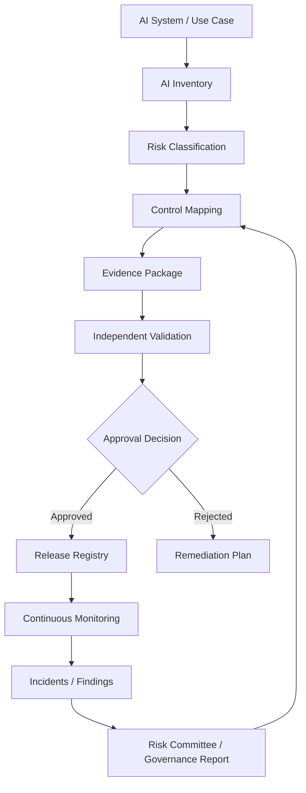

# Semana 14 — AI Governance, Risk & Compliance / Model Risk Management para Fintech

## Gobierno, riesgo, compliance, auditoría, inventario de sistemas AI, evidencia, controles y validación independiente

La **Semana 14** es el paso natural después de la Semana 13.

En la Semana 13 construiste el **AI Control Plane / LLM Gateway**: una plataforma corporativa para que muchos equipos usen modelos, prompts, tools, policies y telemetría de forma centralizada.

La Semana 14 responde esta pregunta:

> **¿Cómo demuestro, con evidencia auditable, que mis sistemas de IA están gobernados, controlados, validados y alineados a riesgo/compliance?**

En fintech esto es crítico, porque no alcanza con decir:

> “El agente funciona bien.”

Tenés que poder demostrar:

- qué sistema AI existe;
- quién es el owner;
- para qué se usa;
- qué riesgo tiene;
- qué modelo usa;
- qué datos consume;
- qué decisiones impacta;
- qué controles tiene;
- qué evals pasó;
- qué incidentes tuvo;
- qué versión está desplegada;
- quién aprobó el release;
- qué evidencia respalda que puede operar.

---

# 1. Tema central de la Semana 14

La Semana 14 es:

# **AI Governance & Model Risk Management v1**

Aplicado a fintech.

El objetivo es construir una capa que permita:

- inventariar sistemas AI;
- clasificar riesgo;
- mapear controles;
- generar evidencia;
- validar modelos/prompts/agentes;
- aprobar releases;
- auditar decisiones;
- monitorear drift;
- gestionar hallazgos;
- preparar reportes para governance, risk, compliance, auditoría interna y arquitectura.

---

# 2. Por qué esta semana importa

Hasta ahora venías construyendo capacidades técnicas:

- prompts;
- tools;
- RAG;
- agents;
- evals;
- observabilidad;
- seguridad;
- production readiness;
- multimodal;
- control plane.

Pero una fintech seria necesita además:

```text
capacidad técnica
+ gobierno
+ evidencia
+ validación
+ trazabilidad
+ aprobación
+ auditoría
```

Sin Semana 14, tenés una plataforma potente pero difícil de defender ante:

- auditoría interna;
- seguridad;
- compliance;
- reguladores;
- CDAO;
- CTO;
- risk committee;
- model risk;
- arquitectura empresarial;
- legales;
- data governance.

---

# 3. La idea principal

Quiero que te quede grabado así:

> **Un sistema AI no está listo para producción regulada hasta que existe como activo gobernado, clasificado, controlado, validado y monitoreado.**

En otras palabras:

- si no está inventariado, no existe formalmente;
- si no tiene owner, nadie responde;
- si no tiene riesgo asignado, no sabés qué controles aplicar;
- si no tiene evidencia, no es auditable;
- si no tiene validación, no sabés si es confiable;
- si no tiene monitoreo, no sabés si sigue siendo confiable.

---

# 4. Marcos globales que conviene conocer

Para una fintech, la Semana 14 se puede apoyar en cuatro familias de referencia.

## 4.1 NIST AI RMF

El **NIST AI Risk Management Framework** es un marco voluntario para mejorar la incorporación de consideraciones de confiabilidad en el diseño, desarrollo, uso y evaluación de productos, servicios y sistemas de IA. NIST estructura el AI RMF alrededor de funciones como **Govern, Map, Measure y Manage**, que sirven muy bien para ordenar un sistema de gobierno AI. ([NIST](https://www.nist.gov/itl/ai-risk-management-framework?utm_source=chatgpt.com "AI Risk Management Framework | NIST"))

Para tu caso, la traducción práctica sería:

| Función NISTTraducción fintech |                                                          |
| ------------------------------ | -------------------------------------------------------- |
| Govern                         | Definir ownership, policies, roles y comités             |
| Map                            | Mapear caso de uso, datos, impacto y riesgo              |
| Measure                        | Medir calidad, seguridad, fairness, drift y performance  |
| Manage                         | Tomar acciones, aprobar, bloquear, remediar y monitorear |

---

## 4.2 ISO/IEC 42001

**ISO/IEC 42001:2023** especifica requisitos para establecer, implementar, mantener y mejorar continuamente un **Artificial Intelligence Management System**, es decir, un sistema de gestión de IA dentro de una organización. ISO la presenta como el primer estándar internacional de sistema de gestión de IA. ([iso.org](https://www.iso.org/es/norma/42001?utm_source=chatgpt.com "ISO/IEC 42001:2023 - AI management systems"))

Para una fintech, esto significa que no alcanza con tener proyectos AI aislados.

Necesitás un sistema de gestión:

- políticas;
- roles;
- riesgos;
- controles;
- operación;
- monitoreo;
- mejora continua;
- evidencia.

---

## 4.3 EU AI Act

El **EU AI Act** usa un enfoque basado en riesgo. En servicios financieros, el Anexo III incluye como alto riesgo los sistemas destinados a evaluar la solvencia crediticia de personas físicas o establecer su credit score, con excepción de sistemas usados para detectar fraude financiero. ([AI Act Service Desk](https://ai-act-service-desk.ec.europa.eu/en/ai-act/annex-3?utm_source=chatgpt.com "Annex III | AI Act Service Desk"))

También la Comisión Europea describe que los sistemas de IA usados para acceso a servicios esenciales, evaluación de creditworthiness y ciertos seguros pueden ser alto riesgo. ([Estrategia Digital Europea](https://digital-strategy.ec.europa.eu/en/faqs/navigating-ai-act?utm_source=chatgpt.com "Navigating the AI Act | Shaping Europe’s digital future"))

Esto es importante aunque estés en Argentina, porque muchas fintechs adoptan estos marcos como referencia global, especialmente si tienen operación regional, partners internacionales, auditorías externas o exposición a clientes/servicios en mercados regulados.

---

## 4.4 Model Risk Management en banca

En Estados Unidos, las agencias bancarias publicaron en 2026 una guía revisada de **Model Risk Management** que reemplaza SR 11-7 y SR 21-8, aclarando principios de gestión de riesgo de modelos y enfatizando un enfoque basado en riesgo, proporcional al perfil de riesgo, tamaño y complejidad de la organización bancaria. ([Reserva Federal](https://www.federalreserve.gov/supervisionreg/srletters/SR2602.htm?utm_source=chatgpt.com "The Fed - FRB: Supervisory Letter SR 26-2 on Revised Guidance on Model Risk Management -- April 17, 2026"))

Aunque una aplicación generativa no siempre sea “modelo regulatorio clásico”, en fintech conviene tomar prácticas de Model Risk Management:

- inventario;
- tiering;
- validación independiente;
- documentación;
- monitoreo continuo;
- gestión de cambios;
- controles de uso;
- evidencia de performance.

---

# 5. Cómo se conecta esta semana con las anteriores

La Semana 14 no reemplaza las semanas anteriores. Las gobierna.

| SemanaQué construisteSemana 14 lo gobierna así |                                   |                                                 |
| ---------------------------------------------- | --------------------------------- | ----------------------------------------------- |
| 8                                              | Evals                             | Evidence package y release gates                |
| 9                                              | Observabilidad                    | Monitoreo continuo y reporting                  |
| 10                                             | Guardrails                        | Controles de riesgo y seguridad                 |
| 11                                             | Production readiness              | SLOs, resiliencia y riesgo operacional          |
| 12                                             | Multimodal / voice / computer use | Clasificación de impacto y controles reforzados |
| 13                                             | AI Control Plane                  | Inventario, políticas y auditoría centralizada  |

---

# 6. Arquitectura conceptual de Semana 14



---

# 7. Concepto 1 — AI Inventory

Un **AI Inventory** es el registro oficial de todos los sistemas, agentes, modelos, prompts y automatizaciones AI de la organización.

No es una lista informal.

Es un catálogo gobernado.

## Debe registrar

- ID del sistema;
- nombre;
- owner;
- dominio;
- tipo de IA;
- propósito;
- usuarios;
- modelo usado;
- proveedor;
- datos consumidos;
- tools disponibles;
- impacto en decisiones;
- nivel de autonomía;
- nivel de sensibilidad;
- risk tier;
- controles obligatorios;
- estado;
- fecha de aprobación;
- última validación.

## Ejemplo fintech

```json
{
  "systemId": "ai-fraud-triage-v1",
  "name": "Fraud Triage Assistant",
  "domain": "fraud",
  "owner": "fraud_ai_team",
  "aiType": "llm_agent",
  "purpose": "Clasificar reportes de consumos no reconocidos",
  "decisionImpact": "advisory",
  "autonomyLevel": "human_in_the_loop",
  "dataSensitivity": "restricted",
  "riskTier": "high",
  "status": "approved"
}
```

---

# 8. Concepto 2 — AI System Card

Una **AI System Card** es una ficha formal del sistema.

Sirve para que cualquiera pueda entender:

- qué hace;
- qué no hace;
- qué riesgo tiene;
- cómo fue evaluado;
- cuáles son sus límites;
- qué controles tiene.

Es similar a una ficha técnica + ficha de riesgo + ficha de auditoría.

## Secciones recomendadas

1. Identificación.
2. Propósito.
3. Alcance.
4. No-alcance.
5. Usuarios.
6. Datos.
7. Modelo.
8. Tools.
9. Riesgos.
10. Controles.
11. Evals.
12. Monitoreo.
13. Evidencia.
14. Aprobaciones.
15. Historial de cambios.

---

# 9. Concepto 3 — Risk Tiering

**Risk tiering** significa clasificar sistemas AI por nivel de riesgo.

No todos los sistemas requieren el mismo nivel de control.

## Ejemplo de niveles

| TierRiesgoEjemploControles |         |                                    |                                                         |
| -------------------------- | ------- | ---------------------------------- | ------------------------------------------------------- |
| Tier 1                     | Bajo    | Resumen interno no sensible        | Logging básico                                          |
| Tier 2                     | Medio   | Soporte con datos de cliente       | Guardrails + evals                                      |
| Tier 3                     | Alto    | Fraude, KYC, cobranzas             | HITL + validación + auditoría                           |
| Tier 4                     | Crítico | Crédito, límites, bloqueo autónomo | Comité + validación independiente + controles estrictos |

---

# 10. Cómo definir risk tier en fintech

Podés calcularlo por dimensiones.

## Dimensiones principales

1. **Impacto financiero**
   ¿Puede afectar dinero, deuda, límites, saldos o reclamos?
2. **Impacto sobre cliente**
   ¿Puede afectar acceso, bloqueo, rechazo, cobranza o experiencia crítica?
3. **Sensibilidad de datos**
   ¿Usa PII, documentos, riesgo, fraude, crédito?
4. **Autonomía**
   ¿Sugiere, redacta, ejecuta o decide?
5. **Reversibilidad**
   ¿Se puede deshacer fácil?
6. **Exposición externa**
   ¿Lo ve un cliente o solo un operador interno?
7. **Complejidad técnica**
   ¿Usa RAG, tools, agentes, multimodal, computer use?
8. **Regulación/compliance**
   ¿Toca crédito, KYC, fraude, AML, cobranzas, privacidad?

---

# 11. Matriz simple de scoring

```text
risk_score =
impacto_financiero
+ impacto_cliente
+ sensibilidad_datos
+ autonomia
+ irreversibilidad
+ exposicion_externa
+ complejidad_ai
+ regulacion
```

Cada dimensión se puntúa de 1 a 5.

## Clasificación sugerida

| Score totalTier |          |
| --------------- | -------- |
| 8–14            | Low      |
| 15–24           | Medium   |
| 25–32           | High     |
| 33–40           | Critical |

---

# 12. Código — tipos base

## `src/types.ts`

```ts
export type Domain =
  | "payments"
  | "fraud"
  | "kyc"
  | "collections"
  | "credit"
  | "data_governance"
  | "developer_experience";

export type AIType =
  | "llm_assistant"
  | "llm_agent"
  | "rag_system"
  | "multimodal_system"
  | "voice_agent"
  | "computer_use_agent"
  | "traditional_ml"
  | "hybrid_ai";

export type AutonomyLevel =
  | "assistive"
  | "drafting"
  | "recommending"
  | "human_in_the_loop"
  | "automated_action";

export type Sensitivity =
  | "public"
  | "internal"
  | "confidential"
  | "restricted";

export type RiskTier = "low" | "medium" | "high" | "critical";

export type SystemStatus =
  | "draft"
  | "in_review"
  | "approved"
  | "rejected"
  | "deprecated"
  | "retired";

export interface AISystem {
  systemId: string;
  name: string;
  domain: Domain;
  owner: string;
  aiType: AIType;
  purpose: string;
  intendedUsers: string[];
  autonomyLevel: AutonomyLevel;
  dataSensitivity: Sensitivity;
  usesCustomerData: boolean;
  usesFinancialData: boolean;
  usesSensitiveTools: boolean;
  externalFacing: boolean;
  reversibleOutcome: boolean;
  regulatoryTouchpoints: string[];
  modelIds: string[];
  promptIds: string[];
  toolNames: string[];
  status: SystemStatus;
}

export interface RiskAssessment {
  systemId: string;
  financialImpact: number;
  customerImpact: number;
  dataSensitivity: number;
  autonomy: number;
  irreversibility: number;
  externalExposure: number;
  technicalComplexity: number;
  regulatoryExposure: number;
  totalScore: number;
  riskTier: RiskTier;
  rationale: string[];
}

export interface Control {
  controlId: string;
  name: string;
  category:
    | "governance"
    | "security"
    | "privacy"
    | "quality"
    | "operations"
    | "model_risk"
    | "compliance";
  requiredFor: RiskTier[];
  description: string;
}

export interface EvidenceItem {
  evidenceId: string;
  systemId: string;
  type:
    | "eval_report"
    | "security_test"
    | "architecture_diagram"
    | "approval"
    | "monitoring_snapshot"
    | "incident_report"
    | "data_lineage"
    | "model_card"
    | "prompt_card";
  path: string;
  createdAt: string;
  owner: string;
}

export interface ValidationFinding {
  findingId: string;
  systemId: string;
  severity: "low" | "medium" | "high" | "critical";
  title: string;
  description: string;
  status: "open" | "mitigated" | "accepted" | "closed";
  remediationOwner: string;
}
```

---

# 13. Concepto 4 — Control Library

Una **Control Library** es una biblioteca de controles que se aplican según el riesgo.

Ejemplo:

- todo sistema AI necesita owner;
- sistemas medium necesitan evals;
- sistemas high necesitan HITL;
- sistemas critical necesitan validación independiente y aprobación de comité.

## Controles típicos

### Governance

- owner asignado;
- system card;
- risk assessment;
- aprobación formal.

### Security

- prompt injection tests;
- scoped tools;
- secret redaction;
- access control.

### Privacy

- PII minimization;
- data retention;
- masking/redaction;
- purpose limitation.

### Quality

- eval dataset;
- regression tests;
- golden cases;
- hallucination checks.

### Operations

- SLOs;
- observability;
- fallback;
- incident response.

### Model risk

- validation;
- limitations;
- performance monitoring;
- drift monitoring.

### Compliance

- evidence package;
- audit trail;
- approval record;
- regulatory mapping.

---

# 14. Código — control library

## `src/controlLibrary.ts`

```ts
import { Control } from "./types.ts";

export const controls: Control[] = [
  {
    controlId: "GOV-001",
    name: "AI system owner assigned",
    category: "governance",
    requiredFor: ["low", "medium", "high", "critical"],
    description: "Every AI system must have an accountable business and technical owner."
  },
  {
    controlId: "GOV-002",
    name: "AI system card completed",
    category: "governance",
    requiredFor: ["medium", "high", "critical"],
    description: "The system must have a documented purpose, scope, limitations and controls."
  },
  {
    controlId: "SEC-001",
    name: "Prompt injection testing",
    category: "security",
    requiredFor: ["medium", "high", "critical"],
    description: "The system must be tested against direct and indirect prompt injection attempts."
  },
  {
    controlId: "SEC-002",
    name: "Scoped tools enforced",
    category: "security",
    requiredFor: ["high", "critical"],
    description: "Tool access must be restricted by scopes, domain and approval policy."
  },
  {
    controlId: "PRI-001",
    name: "PII redaction and minimization",
    category: "privacy",
    requiredFor: ["medium", "high", "critical"],
    description: "The system must redact or minimize unnecessary personally identifiable information."
  },
  {
    controlId: "QUA-001",
    name: "Golden evaluation dataset",
    category: "quality",
    requiredFor: ["medium", "high", "critical"],
    description: "The system must be evaluated against a curated dataset of expected behavior."
  },
  {
    controlId: "QUA-002",
    name: "Regression gate",
    category: "quality",
    requiredFor: ["high", "critical"],
    description: "New versions must not degrade critical eval metrics versus baseline."
  },
  {
    controlId: "OPS-001",
    name: "Observability baseline",
    category: "operations",
    requiredFor: ["medium", "high", "critical"],
    description: "The system must emit traces, metrics, costs, latency and audit events."
  },
  {
    controlId: "MRM-001",
    name: "Independent validation",
    category: "model_risk",
    requiredFor: ["high", "critical"],
    description: "A function independent from development must validate the system before approval."
  },
  {
    controlId: "CMP-001",
    name: "Evidence package",
    category: "compliance",
    requiredFor: ["medium", "high", "critical"],
    description: "The system must maintain evidence for audit and governance review."
  },
  {
    controlId: "CMP-002",
    name: "Risk committee approval",
    category: "compliance",
    requiredFor: ["critical"],
    description: "Critical AI systems must be approved by a designated governance body."
  }
];

export function requiredControlsForTier(riskTier: string): Control[] {
  return controls.filter((control) =>
    control.requiredFor.includes(riskTier as never)
  );
}
```

---

# 15. Concepto 5 — Risk Assessment automatizado

El risk assessment no debe ser solamente manual.

Podés automatizar una primera clasificación y después permitir revisión humana.

## Ejemplo

Un sistema:

- dominio: fraud;
- usa datos sensibles;
- usa tools;
- tiene salida al cliente;
- requiere HITL;
- no ejecuta acción directa.

Probablemente sea **high**, no critical.

Un sistema que:

- decide crédito;
- cambia límites;
- bloquea cuenta;
- ejecuta acción automática;
- afecta acceso financiero.

Probablemente sea **critical**.

---

# 16. Código — risk engine

## `src/riskEngine.ts`

```ts
import { AISystem, RiskAssessment, RiskTier } from "./types.ts";

function clampScore(value: number): number {
  return Math.max(1, Math.min(5, value));
}

function tierFromScore(score: number): RiskTier {
  if (score >= 33) return "critical";
  if (score >= 25) return "high";
  if (score >= 15) return "medium";
  return "low";
}

export function assessRisk(system: AISystem): RiskAssessment {
  const rationale: string[] = [];

  const financialImpact = clampScore(
    system.usesFinancialData ? 4 : 2
  );

  if (system.usesFinancialData) {
    rationale.push("uses_financial_data");
  }

  const customerImpact = clampScore(
    system.externalFacing ? 4 : 2
  );

  if (system.externalFacing) {
    rationale.push("external_customer_facing");
  }

  const dataSensitivity =
    system.dataSensitivity === "restricted"
      ? 5
      : system.dataSensitivity === "confidential"
        ? 4
        : system.dataSensitivity === "internal"
          ? 2
          : 1;

  rationale.push(`data_sensitivity:${system.dataSensitivity}`);

  const autonomy =
    system.autonomyLevel === "automated_action"
      ? 5
      : system.autonomyLevel === "human_in_the_loop"
        ? 4
        : system.autonomyLevel === "recommending"
          ? 3
          : system.autonomyLevel === "drafting"
            ? 2
            : 1;

  rationale.push(`autonomy:${system.autonomyLevel}`);

  const irreversibility = system.reversibleOutcome ? 1 : 5;

  if (!system.reversibleOutcome) {
    rationale.push("outcome_not_easily_reversible");
  }

  const externalExposure = system.externalFacing ? 5 : 2;

  const technicalComplexity =
    system.aiType === "computer_use_agent" ||
    system.aiType === "voice_agent" ||
    system.aiType === "llm_agent" ||
    system.aiType === "multimodal_system"
      ? 5
      : 3;

  rationale.push(`ai_type:${system.aiType}`);

  const regulatoryExposure =
    system.regulatoryTouchpoints.length >= 3
      ? 5
      : system.regulatoryTouchpoints.length > 0
        ? 4
        : 1;

  if (system.regulatoryTouchpoints.length > 0) {
    rationale.push(
      `regulatory_touchpoints:${system.regulatoryTouchpoints.join(",")}`
    );
  }

  const totalScore =
    financialImpact +
    customerImpact +
    dataSensitivity +
    autonomy +
    irreversibility +
    externalExposure +
    technicalComplexity +
    regulatoryExposure;

  return {
    systemId: system.systemId,
    financialImpact,
    customerImpact,
    dataSensitivity,
    autonomy,
    irreversibility,
    externalExposure,
    technicalComplexity,
    regulatoryExposure,
    totalScore,
    riskTier: tierFromScore(totalScore),
    rationale
  };
}
```

---

# 17. Concepto 6 — Control mapping

Una vez que tenés el risk tier, asignás controles obligatorios.

Ejemplo:

```text
AI System → Risk Assessment → Risk Tier → Required Controls
```

Esto permite que governance sea consistente.

---

# 18. Código — control mapper

## `src/controlMapper.ts`

```ts
import { Control } from "./types.ts";
import { requiredControlsForTier } from "./controlLibrary.ts";

export interface ControlMappingResult {
  systemId: string;
  riskTier: string;
  requiredControls: Control[];
  missingControlIds: string[];
  completedControlIds: string[];
  readinessPercent: number;
}

export function mapControls(
  systemId: string,
  riskTier: string,
  completedControlIds: string[]
): ControlMappingResult {
  const requiredControls = requiredControlsForTier(riskTier);

  const missingControlIds = requiredControls
    .map((control) => control.controlId)
    .filter((controlId) => !completedControlIds.includes(controlId));

  const readinessPercent =
    requiredControls.length === 0
      ? 1
      : (requiredControls.length - missingControlIds.length) /
        requiredControls.length;

  return {
    systemId,
    riskTier,
    requiredControls,
    missingControlIds,
    completedControlIds,
    readinessPercent
  };
}
```

---

# 19. Concepto 7 — Evidence Package

Un **Evidence Package** es el paquete de evidencia que demuestra que el sistema fue diseñado, evaluado y aprobado correctamente.

## Debe incluir

- system card;
- architecture diagram;
- data lineage;
- prompt card;
- model card;
- eval report;
- security test report;
- privacy review;
- control mapping;
- approval record;
- monitoring snapshot;
- release notes;
- incident history.

## Ejemplo

```json
{
  "systemId": "ai-fraud-triage-v1",
  "evidence": [
    "docs/system-card.md",
    "reports/eval-report.json",
    "reports/security-tests.json",
    "approvals/risk-committee.json"
  ]
}
```

---

# 20. Código — evidence registry

## `src/evidenceRegistry.ts`

```ts
import { EvidenceItem } from "./types.ts";

export class EvidenceRegistry {
  private readonly items: EvidenceItem[] = [];

  add(item: EvidenceItem): void {
    this.items.push(item);
  }

  listBySystem(systemId: string): EvidenceItem[] {
    return this.items.filter((item) => item.systemId === systemId);
  }

  hasEvidenceType(systemId: string, type: EvidenceItem["type"]): boolean {
    return this.items.some(
      (item) => item.systemId === systemId && item.type === type
    );
  }

  completeness(systemId: string, requiredTypes: EvidenceItem["type"][]) {
    const missing = requiredTypes.filter(
      (type) => !this.hasEvidenceType(systemId, type)
    );

    return {
      systemId,
      requiredTypes,
      missing,
      complete: missing.length === 0
    };
  }
}
```

---

# 21. Concepto 8 — Independent Validation

La validación independiente es una práctica tomada de Model Risk Management.

Significa que alguien que no construyó el sistema revisa si es aceptable.

## Qué valida

- conceptual soundness;
- datos;
- diseño;
- supuestos;
- métricas;
- limitaciones;
- controles;
- documentación;
- monitoreo;
- uso adecuado.

En sistemas GenAI, además debe validar:

- prompt injection;
- hallucination;
- grounding;
- tool usage;
- human review;
- output safety;
- cost/latency;
- observability;
- reproducibilidad de evals.

---

# 22. Validación de AI no es solo accuracy

Un sistema puede tener accuracy alta y aun así ser riesgoso.

Ejemplo:

- clasifica bien 98 % de casos;
- pero en 2 % de fraude crítico no pide revisión humana.

Eso puede ser inaceptable.

## Métricas mínimas

- task success;
- policy violation rate;
- human review accuracy;
- groundedness;
- hallucination rate;
- tool correctness;
- sensitive data leakage rate;
- latency p95;
- cost per case;
- fallback safety rate.

---

# 23. Código — validation engine

## `src/validationEngine.ts`

```ts
export interface EvalMetrics {
  taskSuccessRate: number;
  policyViolationRate: number;
  humanReviewAccuracy: number;
  groundednessRate: number;
  toolCorrectnessRate: number;
  sensitiveLeakageRate: number;
  latencyP95Ms: number;
  costPerCaseUsd: number;
}

export interface ValidationDecision {
  approved: boolean;
  severity: "none" | "low" | "medium" | "high" | "critical";
  reasons: string[];
}

export function validateSystem(metrics: EvalMetrics): ValidationDecision {
  const reasons: string[] = [];
  let severity: ValidationDecision["severity"] = "none";

  function add(reason: string, level: ValidationDecision["severity"]) {
    reasons.push(reason);

    const rank = {
      none: 0,
      low: 1,
      medium: 2,
      high: 3,
      critical: 4
    };

    if (rank[level] > rank[severity]) {
      severity = level;
    }
  }

  if (metrics.taskSuccessRate < 0.95) {
    add("task_success_below_95", "high");
  }

  if (metrics.policyViolationRate > 0) {
    add("policy_violations_detected", "critical");
  }

  if (metrics.humanReviewAccuracy < 0.98) {
    add("human_review_accuracy_below_98", "critical");
  }

  if (metrics.groundednessRate < 0.95) {
    add("groundedness_below_95", "high");
  }

  if (metrics.toolCorrectnessRate < 0.97) {
    add("tool_correctness_below_97", "high");
  }

  if (metrics.sensitiveLeakageRate > 0) {
    add("sensitive_data_leakage_detected", "critical");
  }

  if (metrics.latencyP95Ms > 5000) {
    add("latency_p95_above_5s", "medium");
  }

  if (metrics.costPerCaseUsd > 0.05) {
    add("cost_per_case_above_budget", "medium");
  }

  return {
    approved: reasons.length === 0,
    severity,
    reasons
  };
}
```

---

# 24. Concepto 9 — Findings Management

Un **finding** es un hallazgo.

Puede venir de:

- validación;
- auditoría;
- seguridad;
- incidentes;
- monitoreo;
- red team;
- revisión humana.

## Ejemplos de findings

- “El agente no bloquea indirect prompt injection.”
- “El dataset de evals no cubre cobranzas.”
- “El sistema no registra prompt version.”
- “El fallback de fraude responde con demasiada confianza.”
- “Falta evidencia de aprobación.”
- “La latencia p95 supera el SLO.”

---

# 25. Código — findings registry

## `src/findingsRegistry.ts`

```ts
import { ValidationFinding } from "./types.ts";

export class FindingsRegistry {
  private readonly findings: ValidationFinding[] = [];

  add(finding: ValidationFinding): void {
    this.findings.push(finding);
  }

  listOpen(systemId: string): ValidationFinding[] {
    return this.findings.filter(
      (finding) =>
        finding.systemId === systemId &&
        ["open", "mitigated"].includes(finding.status)
    );
  }

  close(findingId: string): void {
    const finding = this.findings.find(
      (candidate) => candidate.findingId === findingId
    );

    if (!finding) {
      throw new Error(`finding_not_found:${findingId}`);
    }

    finding.status = "closed";
  }

  hasBlockingFindings(systemId: string): boolean {
    return this.listOpen(systemId).some((finding) =>
      ["high", "critical"].includes(finding.severity)
    );
  }
}
```

---

# 26. Concepto 10 — Approval Workflow

Un sistema AI no debería pasar a producción sin aprobación formal.

## Aprobadores posibles

- business owner;
- technical owner;
- security;
- privacy;
- legal/compliance;
- model risk;
- architecture;
- data governance;
- risk committee.

## La aprobación depende del tier

| TierAprobación |                                                                |
| -------------- | -------------------------------------------------------------- |
| Low            | Owner técnico                                                  |
| Medium         | Owner + security/privacy                                       |
| High           | Owner + risk/compliance + validación independiente             |
| Critical       | Comité formal + validación independiente + monitoreo reforzado |

---

# 27. Código — approval engine

## `src/approvalEngine.ts`

```ts
import { RiskTier } from "./types.ts";

export interface ApprovalRecord {
  systemId: string;
  approverRole: string;
  approverName: string;
  approved: boolean;
  approvedAt: string;
}

export function requiredApproverRoles(riskTier: RiskTier): string[] {
  if (riskTier === "critical") {
    return [
      "business_owner",
      "technical_owner",
      "security",
      "privacy",
      "compliance",
      "model_risk",
      "architecture",
      "risk_committee"
    ];
  }

  if (riskTier === "high") {
    return [
      "business_owner",
      "technical_owner",
      "security",
      "privacy",
      "compliance",
      "model_risk"
    ];
  }

  if (riskTier === "medium") {
    return ["business_owner", "technical_owner", "security"];
  }

  return ["technical_owner"];
}

export function evaluateApprovals(
  riskTier: RiskTier,
  approvals: ApprovalRecord[]
) {
  const required = requiredApproverRoles(riskTier);

  const approvedRoles = approvals
    .filter((approval) => approval.approved)
    .map((approval) => approval.approverRole);

  const missing = required.filter(
    (role) => !approvedRoles.includes(role)
  );

  return {
    approved: missing.length === 0,
    required,
    missing
  };
}
```

---

# 28. Concepto 11 — Continuous Monitoring

La aprobación inicial no alcanza.

Un sistema puede degradarse por:

- cambios de datos;
- cambios de usuario;
- cambios de políticas;
- cambios de modelo;
- nuevos ataques;
- drift de comportamiento;
- cambios de tools;
- cambios de prompts;
- errores de integración.

## Métricas de monitoreo

- pass rate sampleado;
- policy violation rate;
- hallucination rate;
- groundedness;
- human escalation rate;
- fallback rate;
- latency p95;
- cost per case;
- incident count;
- complaints;
- override humano;
- tool error rate.

---

# 29. Código — monitoring snapshot

## `src/monitoring.ts`

```ts
export interface MonitoringSnapshot {
  systemId: string;
  timestamp: string;
  requestCount: number;
  taskSuccessRate: number;
  policyViolationRate: number;
  humanOverrideRate: number;
  fallbackRate: number;
  latencyP95Ms: number;
  costPerCaseUsd: number;
  incidentCount: number;
}

export interface MonitoringAlert {
  systemId: string;
  severity: "low" | "medium" | "high" | "critical";
  reason: string;
}

export function evaluateMonitoring(
  snapshot: MonitoringSnapshot
): MonitoringAlert[] {
  const alerts: MonitoringAlert[] = [];

  if (snapshot.policyViolationRate > 0) {
    alerts.push({
      systemId: snapshot.systemId,
      severity: "critical",
      reason: "policy_violation_detected"
    });
  }

  if (snapshot.taskSuccessRate < 0.95) {
    alerts.push({
      systemId: snapshot.systemId,
      severity: "high",
      reason: "task_success_below_threshold"
    });
  }

  if (snapshot.humanOverrideRate > 0.2) {
    alerts.push({
      systemId: snapshot.systemId,
      severity: "medium",
      reason: "human_override_rate_above_20_percent"
    });
  }

  if (snapshot.fallbackRate > 0.15) {
    alerts.push({
      systemId: snapshot.systemId,
      severity: "medium",
      reason: "fallback_rate_above_15_percent"
    });
  }

  if (snapshot.latencyP95Ms > 5000) {
    alerts.push({
      systemId: snapshot.systemId,
      severity: "medium",
      reason: "latency_p95_above_5s"
    });
  }

  if (snapshot.incidentCount > 0) {
    alerts.push({
      systemId: snapshot.systemId,
      severity: "high",
      reason: "incidents_detected"
    });
  }

  return alerts;
}
```

---

# 30. Concepto 12 — AI Audit Trail

El audit trail debe permitir reconstruir:

- qué sistema respondió;
- qué versión;
- qué modelo;
- qué prompt;
- qué datos;
- qué tools;
- qué policy;
- qué guardrails;
- qué output;
- qué aprobación;
- qué usuario o actor;
- qué costo;
- qué latencia;
- qué evidencia.

## En fintech

El audit trail debe ser:

- completo;
- trazable;
- no modificable fácilmente;
- redactado de PII innecesaria;
- consultable por request ID;
- exportable para auditoría.

---

# 31. Código — audit event

## `src/audit.ts`

```ts
export interface AuditEvent {
  eventId: string;
  timestamp: string;
  systemId: string;
  requestId: string;
  actorId: string;
  action: string;
  modelId?: string;
  promptId?: string;
  policyDecision?: string;
  riskTier?: string;
  evidenceIds?: string[];
  metadata: Record<string, unknown>;
}

export class AuditLog {
  private readonly events: AuditEvent[] = [];

  record(event: AuditEvent): void {
    this.events.push(event);
  }

  listBySystem(systemId: string): AuditEvent[] {
    return this.events.filter((event) => event.systemId === systemId);
  }

  listByRequest(requestId: string): AuditEvent[] {
    return this.events.filter((event) => event.requestId === requestId);
  }

  export(): AuditEvent[] {
    return this.events;
  }
}
```

---

# 32. Orquestador integral de governance

Ahora unimos:

- AI Inventory;
- risk engine;
- control mapping;
- evidence;
- validation;
- findings;
- approvals;
- monitoring;
- audit.

## `src/governanceOrchestrator.ts`

```ts
import { randomUUID } from "node:crypto";
import {
  AISystem,
  ApprovalRecord,
  EvidenceItem,
  ValidationFinding
} from "./types.ts";
import { assessRisk } from "./riskEngine.ts";
import { mapControls } from "./controlMapper.ts";
import { EvidenceRegistry } from "./evidenceRegistry.ts";
import { validateSystem, EvalMetrics } from "./validationEngine.ts";
import { FindingsRegistry } from "./findingsRegistry.ts";
import { evaluateApprovals } from "./approvalEngine.ts";
import { AuditLog } from "./audit.ts";
import {
  evaluateMonitoring,
  MonitoringSnapshot
} from "./monitoring.ts";

export interface GovernanceReviewInput {
  system: AISystem;
  completedControlIds: string[];
  evidence: EvidenceItem[];
  metrics: EvalMetrics;
  findings: ValidationFinding[];
  approvals: ApprovalRecord[];
  monitoringSnapshot: MonitoringSnapshot;
}

export function runGovernanceReview(input: GovernanceReviewInput) {
  const evidenceRegistry = new EvidenceRegistry();
  const findingsRegistry = new FindingsRegistry();
  const audit = new AuditLog();

  const risk = assessRisk(input.system);

  const controls = mapControls(
    input.system.systemId,
    risk.riskTier,
    input.completedControlIds
  );

  for (const item of input.evidence) {
    evidenceRegistry.add(item);
  }

  for (const finding of input.findings) {
    findingsRegistry.add(finding);
  }

  const requiredEvidenceTypes: EvidenceItem["type"][] = [
    "eval_report",
    "security_test",
    "architecture_diagram",
    "approval",
    "monitoring_snapshot"
  ];

  const evidenceCompleteness = evidenceRegistry.completeness(
    input.system.systemId,
    requiredEvidenceTypes
  );

  const validation = validateSystem(input.metrics);

  const approval = evaluateApprovals(
    risk.riskTier,
    input.approvals
  );

  const monitoringAlerts = evaluateMonitoring(
    input.monitoringSnapshot
  );

  const hasBlockingFindings =
    findingsRegistry.hasBlockingFindings(input.system.systemId);

  const approved =
    controls.readinessPercent === 1 &&
    evidenceCompleteness.complete &&
    validation.approved &&
    approval.approved &&
    !hasBlockingFindings &&
    !monitoringAlerts.some((alert) => alert.severity === "critical");

  audit.record({
    eventId: randomUUID(),
    timestamp: new Date().toISOString(),
    systemId: input.system.systemId,
    requestId: "governance-review",
    actorId: "governance-orchestrator",
    action: approved ? "governance_approved" : "governance_rejected",
    riskTier: risk.riskTier,
    evidenceIds: input.evidence.map((item) => item.evidenceId),
    metadata: {
      totalRiskScore: risk.totalScore,
      missingControls: controls.missingControlIds,
      missingEvidence: evidenceCompleteness.missing,
      validationReasons: validation.reasons,
      approvalMissing: approval.missing,
      monitoringAlerts
    }
  });

  return {
    approved,
    risk,
    controls,
    evidenceCompleteness,
    validation,
    approval,
    monitoringAlerts,
    blockingFindings: hasBlockingFindings,
    audit: audit.export()
  };
}
```

---

# 33. Main de demo

## `src/main.ts`

```ts
import fs from "node:fs";
import { runGovernanceReview } from "./governanceOrchestrator.ts";
import {
  AISystem,
  ApprovalRecord,
  EvidenceItem,
  ValidationFinding
} from "./types.ts";

const system: AISystem = {
  systemId: "ai-fraud-triage-v1",
  name: "Fraud Triage Assistant",
  domain: "fraud",
  owner: "fraud_ai_team",
  aiType: "llm_agent",
  purpose: "Clasificar reportes de consumos no reconocidos y sugerir próximos pasos.",
  intendedUsers: ["fraud_ops", "customer_support"],
  autonomyLevel: "human_in_the_loop",
  dataSensitivity: "restricted",
  usesCustomerData: true,
  usesFinancialData: true,
  usesSensitiveTools: true,
  externalFacing: false,
  reversibleOutcome: true,
  regulatoryTouchpoints: ["fraud", "privacy", "consumer_protection"],
  modelIds: ["reasoning-model"],
  promptIds: ["fraud_triage_v1"],
  toolNames: ["get_transaction_status", "get_customer_risk_flags"],
  status: "in_review"
};

const evidence: EvidenceItem[] = [
  {
    evidenceId: "ev-001",
    systemId: system.systemId,
    type: "eval_report",
    path: "reports/eval-report.json",
    createdAt: new Date().toISOString(),
    owner: "ai_eval_team"
  },
  {
    evidenceId: "ev-002",
    systemId: system.systemId,
    type: "security_test",
    path: "reports/security-tests.json",
    createdAt: new Date().toISOString(),
    owner: "security_team"
  },
  {
    evidenceId: "ev-003",
    systemId: system.systemId,
    type: "architecture_diagram",
    path: "docs/architecture.md",
    createdAt: new Date().toISOString(),
    owner: "architecture_team"
  },
  {
    evidenceId: "ev-004",
    systemId: system.systemId,
    type: "approval",
    path: "approvals/approval-record.json",
    createdAt: new Date().toISOString(),
    owner: "risk_committee"
  },
  {
    evidenceId: "ev-005",
    systemId: system.systemId,
    type: "monitoring_snapshot",
    path: "reports/monitoring-snapshot.json",
    createdAt: new Date().toISOString(),
    owner: "sre_team"
  }
];

const findings: ValidationFinding[] = [];

const approvals: ApprovalRecord[] = [
  {
    systemId: system.systemId,
    approverRole: "business_owner",
    approverName: "Business Owner",
    approved: true,
    approvedAt: new Date().toISOString()
  },
  {
    systemId: system.systemId,
    approverRole: "technical_owner",
    approverName: "Tech Owner",
    approved: true,
    approvedAt: new Date().toISOString()
  },
  {
    systemId: system.systemId,
    approverRole: "security",
    approverName: "Security Reviewer",
    approved: true,
    approvedAt: new Date().toISOString()
  },
  {
    systemId: system.systemId,
    approverRole: "privacy",
    approverName: "Privacy Reviewer",
    approved: true,
    approvedAt: new Date().toISOString()
  },
  {
    systemId: system.systemId,
    approverRole: "compliance",
    approverName: "Compliance Reviewer",
    approved: true,
    approvedAt: new Date().toISOString()
  },
  {
    systemId: system.systemId,
    approverRole: "model_risk",
    approverName: "Model Risk Validator",
    approved: true,
    approvedAt: new Date().toISOString()
  }
];

const result = runGovernanceReview({
  system,
  completedControlIds: [
    "GOV-001",
    "GOV-002",
    "SEC-001",
    "SEC-002",
    "PRI-001",
    "QUA-001",
    "QUA-002",
    "OPS-001",
    "MRM-001",
    "CMP-001"
  ],
  evidence,
  metrics: {
    taskSuccessRate: 0.97,
    policyViolationRate: 0,
    humanReviewAccuracy: 0.99,
    groundednessRate: 0.96,
    toolCorrectnessRate: 0.98,
    sensitiveLeakageRate: 0,
    latencyP95Ms: 4200,
    costPerCaseUsd: 0.031
  },
  findings,
  approvals,
  monitoringSnapshot: {
    systemId: system.systemId,
    timestamp: new Date().toISOString(),
    requestCount: 1500,
    taskSuccessRate: 0.97,
    policyViolationRate: 0,
    humanOverrideRate: 0.08,
    fallbackRate: 0.05,
    latencyP95Ms: 4200,
    costPerCaseUsd: 0.031,
    incidentCount: 0
  }
});

console.log(JSON.stringify(result, null, 2));

fs.writeFileSync(
  "week14_governance_review_results.json",
  JSON.stringify(result, null, 2)
);
```

---

# 34. Resultado esperado

El sistema debería aprobarse si:

- risk tier es alto;
- controles requeridos están completos;
- evidencia está completa;
- validación pasa;
- approvals requeridos están presentes;
- no hay findings bloqueantes;
- monitoreo no tiene alertas críticas.

Ejemplo esperado:

```json
{
  "approved": true,
  "risk": {
    "systemId": "ai-fraud-triage-v1",
    "riskTier": "high",
    "totalScore": 31
  },
  "validation": {
    "approved": true,
    "severity": "none",
    "reasons": []
  }
}
```

---

# 35. Tests recomendados

## Test 1 — Risk engine clasifica fraude como high

```ts
import test from "node:test";
import assert from "node:assert/strict";
import { assessRisk } from "../src/riskEngine.ts";
import { AISystem } from "../src/types.ts";

test("classifies fraud agent as high risk", () => {
  const system: AISystem = {
    systemId: "fraud",
    name: "Fraud Agent",
    domain: "fraud",
    owner: "fraud_team",
    aiType: "llm_agent",
    purpose: "Fraud triage",
    intendedUsers: ["fraud_ops"],
    autonomyLevel: "human_in_the_loop",
    dataSensitivity: "restricted",
    usesCustomerData: true,
    usesFinancialData: true,
    usesSensitiveTools: true,
    externalFacing: false,
    reversibleOutcome: true,
    regulatoryTouchpoints: ["fraud", "privacy"],
    modelIds: ["reasoning-model"],
    promptIds: ["fraud_triage"],
    toolNames: ["get_customer_risk_flags"],
    status: "in_review"
  };

  const risk = assessRisk(system);

  assert.equal(risk.riskTier, "high");
});
```

---

## Test 2 — Controles faltantes bloquean readiness

```ts
import test from "node:test";
import assert from "node:assert/strict";
import { mapControls } from "../src/controlMapper.ts";

test("detects missing controls", () => {
  const result = mapControls("system-1", "high", ["GOV-001"]);

  assert.equal(result.readinessPercent < 1, true);
  assert.ok(result.missingControlIds.length > 0);
});
```

---

## Test 3 — Validación bloquea leakage

```ts
import test from "node:test";
import assert from "node:assert/strict";
import { validateSystem } from "../src/validationEngine.ts";

test("blocks sensitive leakage", () => {
  const result = validateSystem({
    taskSuccessRate: 0.99,
    policyViolationRate: 0,
    humanReviewAccuracy: 0.99,
    groundednessRate: 0.99,
    toolCorrectnessRate: 0.99,
    sensitiveLeakageRate: 0.01,
    latencyP95Ms: 3000,
    costPerCaseUsd: 0.02
  });

  assert.equal(result.approved, false);
  assert.equal(result.severity, "critical");
});
```

---

## Test 4 — Aprobaciones incompletas bloquean

```ts
import test from "node:test";
import assert from "node:assert/strict";
import { evaluateApprovals } from "../src/approvalEngine.ts";

test("requires model risk approval for high risk systems", () => {
  const result = evaluateApprovals("high", [
    {
      systemId: "s1",
      approverRole: "business_owner",
      approverName: "Owner",
      approved: true,
      approvedAt: new Date().toISOString()
    }
  ]);

  assert.equal(result.approved, false);
  assert.ok(result.missing.includes("model_risk"));
});
```

---

## Test 5 — Monitoreo detecta policy violation

```ts
import test from "node:test";
import assert from "node:assert/strict";
import { evaluateMonitoring } from "../src/monitoring.ts";

test("monitoring raises critical alert on policy violation", () => {
  const alerts = evaluateMonitoring({
    systemId: "s1",
    timestamp: new Date().toISOString(),
    requestCount: 1000,
    taskSuccessRate: 0.98,
    policyViolationRate: 0.01,
    humanOverrideRate: 0.05,
    fallbackRate: 0.02,
    latencyP95Ms: 3000,
    costPerCaseUsd: 0.02,
    incidentCount: 0
  });

  assert.equal(alerts[0].severity, "critical");
});
```

---

# 36. Ejercicios prácticos por día

## Lunes — AI Inventory

### Ejercicio 1

Crear un inventario con 8 sistemas:

- asistente de pagos;
- triage de fraude;
- revisión KYC;
- cobranzas;
- agente para chargebacks;
- asistente interno de arquitectura;
- RAG de políticas;
- agente multimodal de comprobantes.

Para cada uno completar:

- owner;
- dominio;
- propósito;
- tipo de IA;
- autonomía;
- sensibilidad;
- tools;
- modelos;
- estado.

### Aprendizaje

Lo que no está inventariado no se puede gobernar.

---

## Martes — Risk Tiering

### Ejercicio 2

Aplicar `assessRisk()` a los 8 sistemas.

Comparar:

- score total;
- rationale;
- risk tier;
- dominios más riesgosos.

### Ejercicio 3

Modificar el sistema de chargebacks para que pase de `human_in_the_loop` a `automated_action`.

Observar cómo sube el riesgo.

### Aprendizaje

La autonomía cambia radicalmente el riesgo.

---

## Miércoles — Control Mapping

### Ejercicio 4

Usar `mapControls()` para cada sistema.

Generar una tabla:

```text
systemId | riskTier | requiredControls | missingControls | readinessPercent
```

### Ejercicio 5

Agregar un control nuevo:

```text
SEC-003: Indirect prompt injection tests
```

Debe ser obligatorio para:

- high;
- critical.

### Aprendizaje

Governance tiene que ser configurable y versionable.

---

## Jueves — Evidence Package

### Ejercicio 6

Para cada sistema high o critical, exigir:

- eval report;
- security test;
- architecture diagram;
- monitoring snapshot;
- approval.

### Ejercicio 7

Crear un sistema high sin `security_test`.

Debe fallar evidence completeness.

### Aprendizaje

Sin evidencia, no hay aprobación defendible.

---

## Viernes — Independent Validation

### Ejercicio 8

Crear tres escenarios de métricas:

1. sistema sano;
2. sistema con policy violation;
3. sistema con baja groundedness.

Pasarlos por `validateSystem()`.

### Ejercicio 9

Crear findings para los casos fallidos.

### Aprendizaje

Validación no es mirar un dashboard. Es tomar una decisión explícita.

---

## Sábado — Governance Review completo

### Ejercicio 10

Ejecutar `runGovernanceReview()` para:

- fraud triage;
- KYC document review;
- payments support.

Cada uno debe producir:

- risk assessment;
- control mapping;
- evidence completeness;
- validation decision;
- approval decision;
- monitoring alerts;
- audit event;
- final approval.

### Aprendizaje

Un sistema AI enterprise necesita un pipeline formal de governance.

---

# 37. Ejercicios avanzados

## Ejercicio 11 — Regulatory mapping

Agregar una matriz:

```text
controlId → framework → requirement
```

Ejemplo:

```text
GOV-001 → NIST AI RMF → Govern
QUA-001 → NIST AI RMF → Measure
MRM-001 → Model Risk → Independent validation
CMP-001 → ISO 42001 → documented evidence
```

---

## Ejercicio 12 — Risk acceptance

Permitir que un finding high sea aceptado temporalmente con:

- approver;
- justification;
- expiration date;
- compensating controls.

---

## Ejercicio 13 — AI System Card generator

Generar Markdown automático:

```text
system-card-ai-fraud-triage-v1.md
```

Con:

- purpose;
- risk tier;
- controls;
- evidence;
- approvals;
- limitations.

---

## Ejercicio 14 — Governance dashboard

Generar resumen:

- total systems;
- systems by tier;
- approved systems;
- systems with missing evidence;
- open high findings;
- critical alerts.

---

## Ejercicio 15 — Drift governance

Agregar monitoreo de drift:

- input drift;
- output drift;
- cost drift;
- latency drift;
- policy drift.

---

# 38. Anti-patrones de Semana 14

## 1. Inventario manual desactualizado

Si nadie lo actualiza, no sirve.

## 2. Risk tier subjetivo sin criterios

Produce discusiones infinitas.

## 3. Controles iguales para todos

Sobrecarga sistemas simples y deja cortos sistemas críticos.

## 4. Evals sin evidencia guardada

No son auditables.

## 5. Aprobaciones por chat informal

No sirven como registro formal.

## 6. Validación hecha por el mismo equipo que construyó

Pierde independencia.

## 7. Findings sin owner

Nunca se cierran.

## 8. Monitoreo sin acción

Alertar sin proceso de remediación no es governance.

## 9. Compliance solo al final

Debe estar integrado desde diseño.

## 10. No versionar controls

Los controles también cambian y deben tener trazabilidad.

---

# 39. Checklist de Semana 14

## Inventario

-  Todos los sistemas AI registrados.
-  Owner definido.
-  Dominio definido.
-  Propósito documentado.
-  Tipo de IA registrado.
-  Autonomía registrada.
-  Sensibilidad registrada.
-  Estado definido.

## Riesgo

-  Risk assessment ejecutado.
-  Score explicable.
-  Risk tier asignado.
-  Rationale guardado.
-  Riesgo revisable por humano.

## Controles

-  Control library versionada.
-  Mapping por risk tier.
-  Controles faltantes visibles.
-  Readiness calculado.

## Evidencia

-  Eval report.
-  Security report.
-  Architecture diagram.
-  Monitoring snapshot.
-  Approval record.
-  Data lineage.
-  Prompt/model cards.

## Validación

-  Métricas mínimas.
-  Gate de policy violations.
-  Gate de leakage.
-  Gate de human review.
-  Hallazgos registrados.

## Aprobaciones

-  Roles requeridos por tier.
-  Registro formal.
-  Comité para critical.
-  Expiración de risk acceptance.

## Monitoreo

-  Alertas críticas.
-  Snapshot periódico.
-  Incidentes vinculados.
-  Drift monitoreado.

## Auditoría

-  Audit log.
-  Export JSON/CSV.
-  Evidence IDs.
-  Request traceability.
-  Versiones registradas.

---

# 40. Qué deberías poder explicar al terminar

Al cerrar la Semana 14 deberías poder explicar:

1. Qué es AI Governance.
2. Qué es Model Risk Management aplicado a GenAI.
3. Qué es un AI Inventory.
4. Qué es una AI System Card.
5. Cómo clasificar riesgo de un sistema AI.
6. Qué controles corresponden según risk tier.
7. Qué es un Evidence Package.
8. Qué significa validación independiente.
9. Qué métricas mínimas validan un sistema AI fintech.
10. Cómo gestionar findings.
11. Cómo diseñar approval workflows.
12. Cómo monitorear AI después de aprobarla.
13. Cómo preparar evidencia para auditoría.
14. Cómo conectar governance con NIST AI RMF, ISO 42001, EU AI Act y prácticas de Model Risk Management.
15. Cómo pasar de “tengo un agente” a “tengo un activo AI gobernado”.

---

# 41. Proyecto final ideal de la Semana 14

El repo debería llamarse:

# `week14-ai-governance-risk-fintech`

Estructura recomendada:

```text
week14-ai-governance-risk-fintech/
├─ README.md
├─ README.es.md
├─ README.en.md
├─ docs/
│  ├─ es/
│  └─ en/
├─ assets/
│  ├─ es/
│  └─ en/
├─ data/
│  ├─ ai_systems.json
│  ├─ controls.json
│  ├─ evidence_items.json
│  ├─ approvals.json
│  ├─ eval_metrics.json
│  └─ monitoring_snapshots.json
├─ src/
│  ├─ types.ts
│  ├─ controlLibrary.ts
│  ├─ riskEngine.ts
│  ├─ controlMapper.ts
│  ├─ evidenceRegistry.ts
│  ├─ validationEngine.ts
│  ├─ findingsRegistry.ts
│  ├─ approvalEngine.ts
│  ├─ monitoring.ts
│  ├─ audit.ts
│  ├─ governanceOrchestrator.ts
│  ├─ reportGenerator.ts
│  ├─ httpServer.ts
│  └─ main.ts
├─ tests/
│  ├─ riskEngine.test.ts
│  ├─ controlMapper.test.ts
│  ├─ evidenceRegistry.test.ts
│  ├─ validationEngine.test.ts
│  ├─ approvalEngine.test.ts
│  ├─ monitoring.test.ts
│  └─ governanceOrchestrator.test.ts
└─ .github/
   └─ workflows/
      └─ ci.yml
```

---

# 42. Resumen maestro

La Semana 14 es donde pasás de ser un constructor de aplicaciones AI a pensar como arquitecto enterprise de IA regulada.

La secuencia mental correcta es:

```text
AI use case
→ AI inventory
→ system card
→ risk assessment
→ control mapping
→ evidence package
→ independent validation
→ findings
→ approvals
→ release
→ continuous monitoring
→ audit
```

La frase final:

> **En fintech, la IA no se gobierna con confianza verbal. Se gobierna con inventario, riesgo, controles, evidencia, validación, aprobación y monitoreo continuo.**

Ese es el corazón de **AI Governance & Model Risk Management v1**.