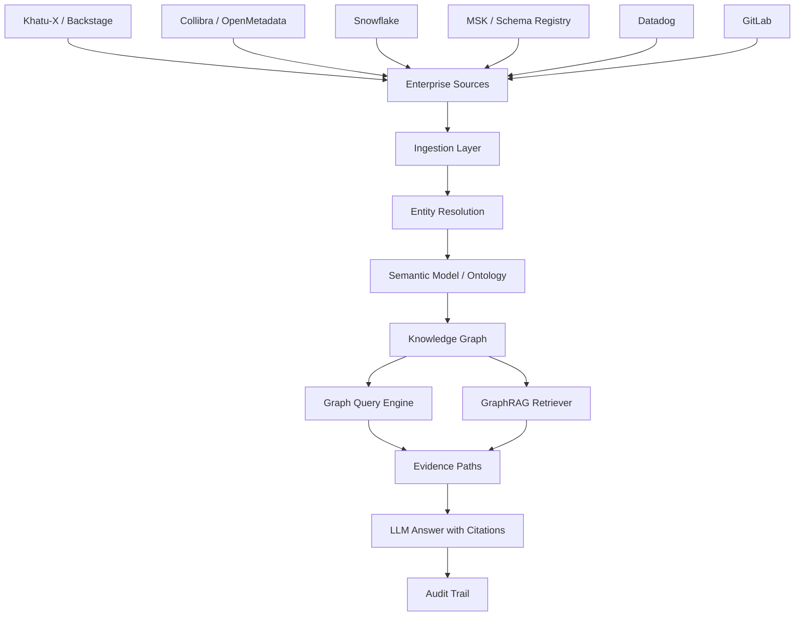
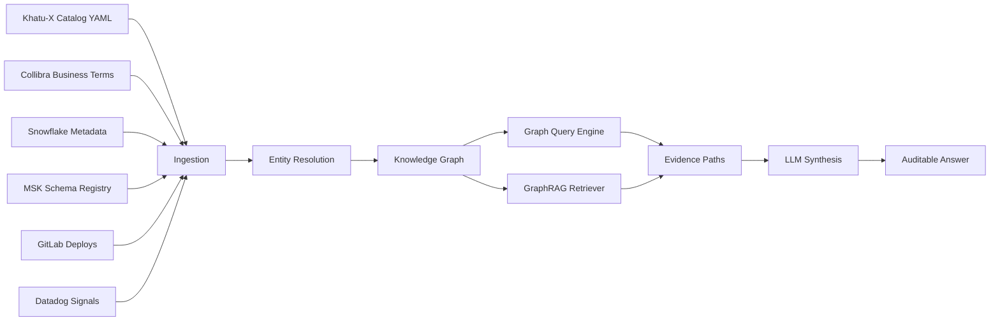

# Semana 15 — Semantic Layer, Knowledge Graph y GraphRAG para Fintech

## Enterprise Context Layer para agentes AI gobernados

La **Semana 15** es una de las semanas más importantes para tu visión de **NX Pulse IA**.

Hasta ahora construiste:

- runtime LLM;
- tool calling;
- structured outputs;
- memory;
- embeddings;
- RAG;
- agents;
- MCP;
- evals;
- observabilidad;
- seguridad;
- production readiness;
- multimodal;
- control plane;
- governance y model risk.

Ahora viene la capa que le da **contexto corporativo real** a los agentes:

> **Semantic Layer + Knowledge Graph + GraphRAG.**

La pregunta central de esta semana es:

> **¿Cómo hago para que un agente de IA entienda dominios, sistemas, APIs, eventos, datasets, owners, reglas, linaje, servicios, riesgos y evidencia como un mapa vivo de la organización?**

---

# 1. Tema central de la Semana 15

La Semana 15 se puede resumir así:

```text
Fintech AI Agent
+ Semantic Layer
+ Knowledge Graph
+ GraphRAG
+ Evidence Paths
+ Access Control
= Enterprise Context Agent
```

El objetivo es construir un sistema que pueda responder preguntas como:

```text
¿Por qué subió el chargeback rate en Comercios Amigos?
¿Qué servicio produce este evento?
¿Qué API consume este dominio?
¿Qué dataset certificado respalda esta métrica?
¿Quién es el owner del sistema?
¿Qué deploy reciente pudo impactar esta métrica?
¿Qué evidencia tengo antes de sugerir una causa?
¿Qué camino del grafo conecta merchant → payment → chargeback → fraud rule → deploy?
```

Esto es mucho más potente que un RAG clásico.

Un RAG clásico busca texto parecido.

Un **GraphRAG enterprise** razona sobre relaciones.

---

# 2. Por qué esta semana importa en fintech

Una fintech no es solo una colección de documentos.

Es una red viva de:

- productos;
- cuentas;
- clientes;
- comercios;
- transacciones;
- APIs;
- eventos Kafka;
- datasets;
- reglas antifraude;
- modelos;
- owners;
- deploys;
- métricas;
- políticas;
- evidencia;
- incidentes;
- SLIs/SLOs;
- permisos;
- linaje de datos.

El problema es que esa información vive dispersa en:

- Backstage / Khatu-X;
- Collibra / OpenMetadata;
- Snowflake;
- MSK / Schema Registry;
- Datadog;
- GitLab;
- Slack;
- Jira;
- Confluence;
- runbooks;
- repositorios;
- dashboards;
- documentación técnica.

La Semana 15 enseña a unir todo eso en una **capa semántica consultable por agentes**.

---

# 3. Mapa mental de la Semana 15



---

# 4. La idea principal

Quiero que te quede grabado así:

> **Embeddings te ayudan a encontrar texto parecido. Un Knowledge Graph te ayuda a entender cómo las cosas están conectadas.**

Ejemplo simple:

## Pregunta

```text
¿Qué pudo causar el aumento de chargebacks en el dominio payments?
```

Un RAG vectorial puede recuperar documentos parecidos a:

- chargebacks;
- payments;
- fraude;
- reclamos.

Pero un grafo puede recorrer:

```text
Business Metric: chargeback_rate
→ calculated_from
Dataset: analytics_secure.v_chargebacks
→ joined_with
Dataset: analytics_secure.v_payments_tx
→ produced_by
System: payments-core
→ emits
Topic: payments.authorization.approved
→ consumed_by
System: fraud-rules-engine
→ recently_deployed
Deploy: deploy_2026_07_28
→ changed
RuleSet: step_up_rules_v4
```

Ese camino es evidencia.

No es solo texto.

---

# 5. Qué es una Semantic Layer

Una **Semantic Layer** es una capa que define el significado común de conceptos de negocio y técnicos.

Ejemplo:

```text
chargeback_rate
```

No debería significar una cosa para Data, otra para Fraude y otra para Payments.

Debe tener una definición gobernada:

```text
chargeback_rate =
cantidad de chargebacks confirmados / cantidad de transacciones aprobadas
en un período y segmento determinado
```

## La semantic layer define

- términos de negocio;
- métricas certificadas;
- entidades;
- relaciones;
- sinónimos;
- owners;
- reglas;
- restricciones;
- definiciones oficiales;
- fuentes autorizadas;
- linaje.

## Ejemplo fintech

```json
{
  "term": "chargeback_rate",
  "domain": "payments",
  "definition": "Ratio de chargebacks confirmados sobre transacciones aprobadas.",
  "certifiedSource": "analytics_secure.v_chargebacks",
  "owner": "payments_data_team",
  "sensitivity": "confidential"
}
```

---

# 6. Semantic Layer vs Knowledge Graph

No son lo mismo.

## Semantic Layer

Define significado.

Ejemplo:

```text
Merchant = comercio que procesa pagos.
Chargeback = disputa iniciada por el emisor o cliente.
Authorization = decisión de aprobar o rechazar una transacción.
```

## Knowledge Graph

Conecta entidades reales.

Ejemplo:

```text
merchant_123
→ has_chargeback_rate
metric_chargeback_rate_july

merchant_123
→ uses_mcc
mcc_5812

payment_tx_999
→ generated_chargeback
chargeback_456
```

## Relación

```text
Semantic Layer = vocabulario común
Knowledge Graph = instancias y relaciones reales
```

---

# 7. Qué es un Knowledge Graph

Un **Knowledge Graph** es una representación de conocimiento en forma de nodos y relaciones.

## Nodos

Son cosas.

Ejemplos fintech:

- `Domain`;
- `System`;
- `Component`;
- `API`;
- `KafkaTopic`;
- `Dataset`;
- `BusinessMetric`;
- `BusinessTerm`;
- `Owner`;
- `Deploy`;
- `Incident`;
- `RuleSet`;
- `Merchant`;
- `Transaction`;
- `Chargeback`.

## Relaciones

Explican cómo se conectan.

Ejemplos:

- `OWNS`;
- `PRODUCES`;
- `CONSUMES`;
- `DEPENDS_ON`;
- `CALCULATED_FROM`;
- `CERTIFIED_BY`;
- `DEPLOYED_BY`;
- `IMPACTED_BY`;
- `OBSERVED_IN`;
- `HAS_OWNER`;
- `HAS_POLICY`;
- `HAS_EVIDENCE`.

---

# 8. Property Graph vs RDF Graph

Hay dos formas muy comunes de pensar grafos.

## 8.1 Property Graph

Muy usado en motores como Neo4j.

Modelo mental:

```text
(node)-[relationship]->(node)
```

Cada nodo y relación puede tener propiedades.

Ejemplo:

```text
(:System {id:"payments-core"})
-[:EMITS {schemaVersion:"2.1"}]->
(:KafkaTopic {name:"payments.authorization.approved"})
```

Bueno para:

- arquitectura;
- linaje;
- relaciones operativas;
- consultas de caminos;
- GraphRAG;
- dependencias entre sistemas.

---

## 8.2 RDF Graph

RDF representa información como triples:

```text
subject → predicate → object
```

El estándar RDF 1.1 de W3C define los grafos RDF como conjuntos de triples sujeto-predicado-objeto, donde los elementos pueden ser IRIs, blank nodes o literales tipados. ([W3C](https://www.w3.org/TR/rdf-concepts/?utm_source=chatgpt.com "RDF 1.1 Concepts and Abstract Syntax"))

Ejemplo:

```text
payments-core → emits → payments.authorization.approved
```

Bueno para:

- interoperabilidad;
- ontologías;
- datos enlazados;
- SPARQL;
- estándares semánticos.

Amazon Neptune, por ejemplo, permite consultar grafos RDF con SPARQL, que AWS describe como un lenguaje de consulta para RDF. ([AWS Docs](https://docs.aws.amazon.com/neptune/latest/userguide/access-graph-sparql.html?utm_source=chatgpt.com "Accessing the Neptune graph with SPARQL - Amazon Neptune"))

---

# 9. Qué es GraphRAG

**GraphRAG** es una estrategia de Retrieval-Augmented Generation donde el contexto no viene solo de chunks vectoriales, sino de un grafo de conocimiento.

En vez de:

```text
buscar chunks parecidos → pasar chunks al LLM
```

hacés:

```text
detectar entidades → recorrer grafo → obtener caminos de evidencia → pasar contexto estructurado al LLM
```

Neo4j documenta enfoques GraphRAG donde una pregunta puede traducirse a una consulta Cypher mediante Text2Cypher para ejecutarse contra una base Neo4j o Knowledge Graph. ([Neo4j Graph Intelligence Platform](https://neo4j.com/docs/neo4j-graphrag-python/current/user_guide_rag.html?utm_source=chatgpt.com "User Guide: RAG — neo4j-graphrag-python documentation"))

---

# 10. RAG clásico vs GraphRAG

| DimensiónRAG clásicoGraphRAG |                                     |                                                |
| ---------------------------- | ----------------------------------- | ---------------------------------------------- |
| Unidad base                  | Chunk de texto                      | Entidad + relación                             |
| Recuperación                 | Similitud semántica                 | Caminos, vecinos, relaciones                   |
| Bueno para                   | Documentos largos                   | Sistemas conectados                            |
| Evidencia                    | Fragmentos                          | Paths explicables                              |
| Riesgo                       | Contexto parecido pero no conectado | Requiere buen modelado                         |
| Ejemplo                      | Buscar “chargeback”                 | Conectar métrica → dataset → servicio → deploy |

---

# 11. Por qué GraphRAG es ideal para NX Pulse IA

Tu visión de NX Pulse IA necesita responder preguntas cross-domain.

Ejemplo:

```text
Resolver chargebacks no es solo mirar chargebacks.
```

Necesitás conectar:

- comercios;
- pagos;
- fraude;
- reglas;
- aprobaciones;
- step-up;
- datasets;
- APIs;
- eventos;
- owners;
- deploys;
- trazas;
- logs;
- cambios de schema;
- definiciones certificadas.

Eso es grafo.

---

# 12. Arquitectura objetivo de Semana 15



---

# 13. Concepto 1 — Ontología fintech

Una **ontología** define los tipos de entidades y relaciones válidas.

Es decir, el contrato semántico del grafo.

## Ejemplo de tipos de nodos

```text
Domain
System
Component
API
KafkaTopic
Dataset
BusinessMetric
BusinessTerm
Owner
Deploy
Incident
RuleSet
Merchant
Transaction
Chargeback
```

## Ejemplo de relaciones válidas

```text
Domain OWNS System
System HAS_COMPONENT Component
Component PROVIDES_API API
Component CONSUMES_API API
Component EMITS_TOPIC KafkaTopic
Component CONSUMES_TOPIC KafkaTopic
Dataset CALCULATES_METRIC BusinessMetric
BusinessTerm CERTIFIES BusinessMetric
Deploy CHANGED Component
Incident IMPACTED Metric
Owner OWNS Domain
```

## Regla clave

> Un grafo sin ontología se vuelve un basurero de nodos.

---

# 14. Concepto 2 — Entity Resolution

**Entity Resolution** es detectar que dos referencias apuntan a la misma entidad.

Ejemplo:

```text
payments-core
payments_core
nx-payments-core
payments service
```

Podrían ser el mismo sistema.

## Por qué importa

Si no resolvés identidades:

- duplicás nodos;
- rompés linaje;
- recuperás evidencia incompleta;
- el agente responde con contradicciones;
- no podés auditar bien.

## Estrategias

1. Normalización de nombres.
2. IDs canónicos.
3. Alias.
4. Matching determinístico.
5. Matching semántico.
6. Revisión humana para baja confianza.

---

# 15. Concepto 3 — Metadata ingestion

El grafo se alimenta de fuentes enterprise.

## Khatu-X / Backstage

Aporta:

- dominios;
- sistemas;
- componentes;
- APIs;
- ownership;
- dependencias;
- `providesApis`;
- `consumesApis`;
- `dependsOn`.

## Collibra / OpenMetadata

Aporta:

- términos de negocio;
- métricas certificadas;
- owners de datos;
- políticas;
- linaje;
- clasificación de sensibilidad.

## Snowflake

Aporta:

- tablas;
- vistas;
- columnas;
- métricas;
- queries;
- freshness;
- uso.

## MSK / Schema Registry

Aporta:

- topics;
- schemas;
- producers;
- consumers;
- versiones;
- compatibilidad.

## GitLab

Aporta:

- commits;
- deploys;
- releases;
- authors;
- cambios recientes.

## Datadog

Aporta:

- traces;
- logs;
- métricas;
- errores;
- latencia;
- incidentes.

---

# 16. Concepto 4 — Evidence Path

Un **Evidence Path** es un camino del grafo que justifica una respuesta.

Ejemplo:

```text
chargeback_rate
→ calculated_from
v_chargebacks
→ joined_with
v_payments_tx
→ populated_by
payments-core
→ changed_by
deploy_2026_07_28
→ authored_by
team_payments
```

El agente no debería decir:

```text
“Probablemente fue payments-core.”
```

Debería decir:

```text
“La hipótesis más fuerte apunta a payments-core porque la métrica chargeback_rate se calcula desde v_chargebacks, que depende de v_payments_tx, alimentada por payments-core, y existe un deploy reciente sobre el componente authorization-worker dentro de la ventana del cambio.”
```

Eso es una respuesta auditable.

---

# 17. Concepto 5 — Graph Query

Una consulta de grafo no pregunta solo:

```text
documentos parecidos a X
```

Pregunta:

```text
qué entidades están conectadas con X en N saltos
```

Ejemplos:

```text
¿Qué sistemas consumen el topic payments.authorization.approved?
¿Qué datasets calculan chargeback_rate?
¿Qué deploys recientes afectaron componentes del dominio fraud?
¿Qué owners están asociados al flujo de dispute?
¿Qué APIs dependen de customer-profile?
```

---

# 18. Concepto 6 — GraphRAG Retriever

El GraphRAG Retriever hace cinco pasos:

```text
1. Detectar entidades de la pregunta
2. Resolver entidades canónicas
3. Expandir vecinos relevantes
4. Construir evidence paths
5. Entregar contexto compacto al LLM
```

## Diferencia con vector search

Vector search dice:

```text
este texto se parece a tu pregunta
```

GraphRAG dice:

```text
esta entidad está conectada con esa otra por esta relación verificable
```

---

# 19. Concepto 7 — Hybrid Retrieval

En producción no tenés que elegir entre vector y grafo.

Lo mejor es combinar:

```text
Graph retrieval + Vector retrieval + Metadata filters + Policy filters
```

## Ejemplo

Pregunta:

```text
¿Por qué subió el chargeback rate?
```

Recuperación híbrida:

1. Grafo:
   - metric → datasets → systems → deploys → incidents.
2. Vector:
   - runbooks;
   - incident notes;
   - postmortems;
   - documentación.
3. Metadata:
   - dominio payments;
   - ventana temporal últimos 7 días;
   - entorno prod.
4. Policy:
   - ocultar PII;
   - filtrar datos sin permiso;
   - mostrar solo fuentes certificadas.

---

# 20. Concepto 8 — Access Control sobre el grafo

El grafo puede revelar información sensible.

Ejemplo:

- reglas antifraude;
- señales de riesgo;
- vulnerabilidades;
- nombres de clientes;
- datos financieros;
- APIs internas;
- incidentes de seguridad.

Entonces no todo usuario puede ver todo.

## Controles

- RBAC;
- ABAC;
- filtros por dominio;
- sensibilidad por nodo;
- redacción de propiedades;
- ocultamiento de relaciones sensibles;
- audit log;
- purpose limitation.

---

# 21. Concepto 9 — Graph Observability

El grafo también se observa.

OpenTelemetry define convenciones semánticas como nombres comunes para operaciones y datos observables; en un sistema GraphRAG conviene emitir atributos consistentes para poder comparar latencia, costo, paths y resultados. ([OpenTelemetry](https://opentelemetry.io/docs/concepts/semantic-conventions/?utm_source=chatgpt.com "Semantic Conventions | OpenTelemetry"))

## Métricas útiles

- `graph.nodes.count`;
- `graph.edges.count`;
- `graph.query.latency_ms`;
- `graphrag.entities.detected`;
- `graphrag.paths.returned`;
- `graphrag.evidence.coverage`;
- `graphrag.answer.groundedness`;
- `graphrag.policy.filtered_nodes`;
- `graphrag.no_evidence_rate`.

---

# 22. Código — estructura del proyecto

El proyecto ideal de esta semana:

```text
week15-semantic-knowledge-graph-fintech/
├─ README.md
├─ README.es.md
├─ README.en.md
├─ docs/
│  ├─ es/
│  └─ en/
├─ assets/
│  ├─ es/
│  └─ en/
├─ data/
│  ├─ catalog_entities.json
│  ├─ business_terms.json
│  ├─ datasets.json
│  ├─ events.json
│  ├─ deploys.json
│  └─ sample_questions.json
├─ src/
│  ├─ types.ts
│  ├─ graphStore.ts
│  ├─ ontology.ts
│  ├─ entityResolver.ts
│  ├─ ingestion.ts
│  ├─ graphQuery.ts
│  ├─ graphRagRetriever.ts
│  ├─ policyFilter.ts
│  ├─ evidenceFormatter.ts
│  ├─ telemetry.ts
│  ├─ httpServer.ts
│  └─ main.ts
└─ tests/
   ├─ ontology.test.ts
   ├─ entityResolver.test.ts
   ├─ graphStore.test.ts
   ├─ graphQuery.test.ts
   ├─ graphRagRetriever.test.ts
   └─ policyFilter.test.ts
```

---

# 23. Código — tipos base

## `src/types.ts`

```ts
export type NodeType =
  | "Domain"
  | "System"
  | "Component"
  | "API"
  | "KafkaTopic"
  | "Dataset"
  | "BusinessMetric"
  | "BusinessTerm"
  | "Owner"
  | "Deploy"
  | "Incident"
  | "RuleSet"
  | "Merchant";

export type EdgeType =
  | "OWNS"
  | "HAS_COMPONENT"
  | "PROVIDES_API"
  | "CONSUMES_API"
  | "EMITS_TOPIC"
  | "CONSUMES_TOPIC"
  | "DEPENDS_ON"
  | "CALCULATED_FROM"
  | "CERTIFIED_BY"
  | "DEPLOYED"
  | "CHANGED"
  | "IMPACTED"
  | "OBSERVED_IN"
  | "HAS_OWNER";

export type Sensitivity =
  | "public"
  | "internal"
  | "confidential"
  | "restricted";

export interface GraphNode {
  id: string;
  type: NodeType;
  name: string;
  aliases: string[];
  sensitivity: Sensitivity;
  domain?: string;
  source: string;
  properties: Record<string, string | number | boolean | null>;
}

export interface GraphEdge {
  id: string;
  from: string;
  to: string;
  type: EdgeType;
  source: string;
  confidence: number;
  properties: Record<string, string | number | boolean | null>;
}

export interface EvidencePath {
  pathId: string;
  nodes: GraphNode[];
  edges: GraphEdge[];
  score: number;
  rationale: string[];
}

export interface GraphRagContext {
  question: string;
  detectedEntities: string[];
  resolvedNodeIds: string[];
  evidencePaths: EvidencePath[];
  policyFilteredNodeIds: string[];
  compactContext: string;
}
```

---

# 24. Código — ontología

## `src/ontology.ts`

```ts
import type { EdgeType, NodeType } from "./types.ts";

export interface RelationshipRule {
  from: NodeType;
  edge: EdgeType;
  to: NodeType;
}

export const relationshipRules: RelationshipRule[] = [
  { from: "Owner", edge: "OWNS", to: "Domain" },
  { from: "Domain", edge: "OWNS", to: "System" },
  { from: "System", edge: "HAS_COMPONENT", to: "Component" },
  { from: "Component", edge: "PROVIDES_API", to: "API" },
  { from: "Component", edge: "CONSUMES_API", to: "API" },
  { from: "Component", edge: "EMITS_TOPIC", to: "KafkaTopic" },
  { from: "Component", edge: "CONSUMES_TOPIC", to: "KafkaTopic" },
  { from: "System", edge: "DEPENDS_ON", to: "System" },
  { from: "BusinessMetric", edge: "CALCULATED_FROM", to: "Dataset" },
  { from: "BusinessTerm", edge: "CERTIFIED_BY", to: "Owner" },
  { from: "Deploy", edge: "CHANGED", to: "Component" },
  { from: "Incident", edge: "IMPACTED", to: "BusinessMetric" },
  { from: "Dataset", edge: "OBSERVED_IN", to: "BusinessMetric" }
];

export function isRelationshipAllowed(
  from: NodeType,
  edge: EdgeType,
  to: NodeType
): boolean {
  return relationshipRules.some(
    (rule) => rule.from === from && rule.edge === edge && rule.to === to
  );
}
```

---

# 25. Código — graph store in-memory

## `src/graphStore.ts`

```ts
import type { EdgeType, EvidencePath, GraphEdge, GraphNode } from "./types.ts";
import { isRelationshipAllowed } from "./ontology.ts";

export class GraphStore {
  private readonly nodes = new Map<string, GraphNode>();
  private readonly edges = new Map<string, GraphEdge>();

  addNode(node: GraphNode): void {
    if (this.nodes.has(node.id)) {
      throw new Error(`node_already_exists:${node.id}`);
    }

    this.nodes.set(node.id, node);
  }

  addEdge(edge: GraphEdge): void {
    const from = this.nodes.get(edge.from);
    const to = this.nodes.get(edge.to);

    if (!from || !to) {
      throw new Error(`edge_references_missing_node:${edge.id}`);
    }

    if (!isRelationshipAllowed(from.type, edge.type, to.type)) {
      throw new Error(
        `relationship_not_allowed:${from.type}-${edge.type}-${to.type}`
      );
    }

    this.edges.set(edge.id, edge);
  }

  getNode(id: string): GraphNode | undefined {
    return this.nodes.get(id);
  }

  allNodes(): GraphNode[] {
    return [...this.nodes.values()];
  }

  allEdges(): GraphEdge[] {
    return [...this.edges.values()];
  }

  neighbors(nodeId: string, edgeTypes?: EdgeType[]): GraphNode[] {
    const result: GraphNode[] = [];

    for (const edge of this.edges.values()) {
      const allowedEdge =
        !edgeTypes || edgeTypes.length === 0 || edgeTypes.includes(edge.type);

      if (!allowedEdge) continue;

      if (edge.from === nodeId) {
        const node = this.nodes.get(edge.to);
        if (node) result.push(node);
      }

      if (edge.to === nodeId) {
        const node = this.nodes.get(edge.from);
        if (node) result.push(node);
      }
    }

    return result;
  }

  findEdgesForNode(nodeId: string): GraphEdge[] {
    return [...this.edges.values()].filter(
      (edge) => edge.from === nodeId || edge.to === nodeId
    );
  }

  findPaths(startNodeId: string, maxDepth: number): EvidencePath[] {
    const start = this.nodes.get(startNodeId);
    if (!start) return [];

    const paths: EvidencePath[] = [];

    const walk = (
      currentNodeId: string,
      visitedNodeIds: string[],
      visitedEdgeIds: string[],
      depth: number
    ) => {
      if (depth > maxDepth) return;

      const currentNode = this.nodes.get(currentNodeId);
      if (!currentNode) return;

      if (visitedNodeIds.length > 1) {
        const nodes = visitedNodeIds
          .map((id) => this.nodes.get(id))
          .filter((node): node is GraphNode => Boolean(node));

        const edges = visitedEdgeIds
          .map((id) => this.edges.get(id))
          .filter((edge): edge is GraphEdge => Boolean(edge));

        paths.push({
          pathId: `path_${paths.length + 1}`,
          nodes,
          edges,
          score: this.scorePath(nodes, edges),
          rationale: [
            `path_depth:${visitedNodeIds.length - 1}`,
            `edge_count:${edges.length}`
          ]
        });
      }

      for (const edge of this.findEdgesForNode(currentNodeId)) {
        if (visitedEdgeIds.includes(edge.id)) continue;

        const nextNodeId = edge.from === currentNodeId ? edge.to : edge.from;
        if (visitedNodeIds.includes(nextNodeId)) continue;

        walk(
          nextNodeId,
          [...visitedNodeIds, nextNodeId],
          [...visitedEdgeIds, edge.id],
          depth + 1
        );
      }
    };

    walk(startNodeId, [start.id], [], 0);

    return paths.sort((a, b) => b.score - a.score);
  }

  private scorePath(nodes: GraphNode[], edges: GraphEdge[]): number {
    const confidence = edges.reduce((sum, edge) => sum + edge.confidence, 0);
    const certifiedBonus = nodes.some(
      (node) => node.type === "BusinessTerm" || node.type === "BusinessMetric"
    )
      ? 0.2
      : 0;

    const shortPathBonus = nodes.length <= 4 ? 0.15 : 0;

    return Number(
      (confidence / Math.max(edges.length, 1) + certifiedBonus + shortPathBonus).toFixed(3)
    );
  }
}
```

---

# 26. Código — entity resolver

## `src/entityResolver.ts`

```ts
import type { GraphNode } from "./types.ts";

function normalize(value: string): string {
  return value
    .toLowerCase()
    .trim()
    .replace(/[_-]+/g, " ")
    .replace(/\s+/g, " ");
}

export interface ResolutionResult {
  input: string;
  nodeId?: string;
  confidence: number;
  strategy: "exact_id" | "exact_name" | "alias" | "partial" | "not_found";
}

export function resolveEntity(
  input: string,
  nodes: GraphNode[]
): ResolutionResult {
  const normalized = normalize(input);

  const byId = nodes.find((node) => normalize(node.id) === normalized);
  if (byId) {
    return {
      input,
      nodeId: byId.id,
      confidence: 1,
      strategy: "exact_id"
    };
  }

  const byName = nodes.find((node) => normalize(node.name) === normalized);
  if (byName) {
    return {
      input,
      nodeId: byName.id,
      confidence: 0.95,
      strategy: "exact_name"
    };
  }

  const byAlias = nodes.find((node) =>
    node.aliases.some((alias) => normalize(alias) === normalized)
  );

  if (byAlias) {
    return {
      input,
      nodeId: byAlias.id,
      confidence: 0.9,
      strategy: "alias"
    };
  }

  const partial = nodes.find((node) =>
    normalize(node.name).includes(normalized)
  );

  if (partial) {
    return {
      input,
      nodeId: partial.id,
      confidence: 0.65,
      strategy: "partial"
    };
  }

  return {
    input,
    confidence: 0,
    strategy: "not_found"
  };
}

export function detectEntityMentions(question: string, nodes: GraphNode[]): string[] {
  const normalizedQuestion = normalize(question);

  return nodes
    .filter((node) => {
      const candidates = [node.name, node.id, ...node.aliases].map(normalize);
      return candidates.some((candidate) =>
        normalizedQuestion.includes(candidate)
      );
    })
    .map((node) => node.name);
}
```

---

# 27. Código — ingestion

## `src/ingestion.ts`

```ts
import type { GraphEdge, GraphNode } from "./types.ts";
import { GraphStore } from "./graphStore.ts";

export interface CatalogComponentInput {
  domain: string;
  system: string;
  component: string;
  owner: string;
  providesApis: string[];
  consumesTopics: string[];
}

export interface BusinessMetricInput {
  metricName: string;
  businessTerm: string;
  dataset: string;
  owner: string;
  domain: string;
}

export interface DeployInput {
  deployId: string;
  component: string;
  author: string;
  deployedAt: string;
}

export function ingestCatalog(
  graph: GraphStore,
  inputs: CatalogComponentInput[]
): void {
  for (const input of inputs) {
    const ownerId = `owner:${input.owner}`;
    const domainId = `domain:${input.domain}`;
    const systemId = `system:${input.system}`;
    const componentId = `component:${input.component}`;

    ensureNode(graph, {
      id: ownerId,
      type: "Owner",
      name: input.owner,
      aliases: [],
      sensitivity: "internal",
      source: "khatu-x",
      properties: {}
    });

    ensureNode(graph, {
      id: domainId,
      type: "Domain",
      name: input.domain,
      aliases: [],
      sensitivity: "internal",
      source: "khatu-x",
      properties: {}
    });

    ensureNode(graph, {
      id: systemId,
      type: "System",
      name: input.system,
      aliases: [`${input.system.replaceAll("-", "_")}`],
      sensitivity: "internal",
      domain: input.domain,
      source: "khatu-x",
      properties: {}
    });

    ensureNode(graph, {
      id: componentId,
      type: "Component",
      name: input.component,
      aliases: [],
      sensitivity: "internal",
      domain: input.domain,
      source: "khatu-x",
      properties: {}
    });

    ensureEdge(graph, {
      id: `edge:${ownerId}:OWNS:${domainId}`,
      from: ownerId,
      to: domainId,
      type: "OWNS",
      source: "khatu-x",
      confidence: 1,
      properties: {}
    });

    ensureEdge(graph, {
      id: `edge:${domainId}:OWNS:${systemId}`,
      from: domainId,
      to: systemId,
      type: "OWNS",
      source: "khatu-x",
      confidence: 1,
      properties: {}
    });

    ensureEdge(graph, {
      id: `edge:${systemId}:HAS_COMPONENT:${componentId}`,
      from: systemId,
      to: componentId,
      type: "HAS_COMPONENT",
      source: "khatu-x",
      confidence: 1,
      properties: {}
    });

    for (const api of input.providesApis) {
      const apiId = `api:${api}`;

      ensureNode(graph, {
        id: apiId,
        type: "API",
        name: api,
        aliases: [],
        sensitivity: "internal",
        domain: input.domain,
        source: "khatu-x",
        properties: {}
      });

      ensureEdge(graph, {
        id: `edge:${componentId}:PROVIDES_API:${apiId}`,
        from: componentId,
        to: apiId,
        type: "PROVIDES_API",
        source: "khatu-x",
        confidence: 1,
        properties: {}
      });
    }

    for (const topic of input.consumesTopics) {
      const topicId = `topic:${topic}`;

      ensureNode(graph, {
        id: topicId,
        type: "KafkaTopic",
        name: topic,
        aliases: [],
        sensitivity: "confidential",
        domain: input.domain,
        source: "schema-registry",
        properties: {}
      });

      ensureEdge(graph, {
        id: `edge:${componentId}:CONSUMES_TOPIC:${topicId}`,
        from: componentId,
        to: topicId,
        type: "CONSUMES_TOPIC",
        source: "schema-registry",
        confidence: 0.95,
        properties: {}
      });
    }
  }
}

export function ingestBusinessMetrics(
  graph: GraphStore,
  inputs: BusinessMetricInput[]
): void {
  for (const input of inputs) {
    const metricId = `metric:${input.metricName}`;
    const termId = `term:${input.businessTerm}`;
    const datasetId = `dataset:${input.dataset}`;
    const ownerId = `owner:${input.owner}`;

    ensureNode(graph, {
      id: metricId,
      type: "BusinessMetric",
      name: input.metricName,
      aliases: [],
      sensitivity: "confidential",
      domain: input.domain,
      source: "collibra",
      properties: {}
    });

    ensureNode(graph, {
      id: termId,
      type: "BusinessTerm",
      name: input.businessTerm,
      aliases: [input.metricName],
      sensitivity: "confidential",
      domain: input.domain,
      source: "collibra",
      properties: {}
    });

    ensureNode(graph, {
      id: datasetId,
      type: "Dataset",
      name: input.dataset,
      aliases: [],
      sensitivity: "confidential",
      domain: input.domain,
      source: "snowflake",
      properties: {}
    });

    ensureNode(graph, {
      id: ownerId,
      type: "Owner",
      name: input.owner,
      aliases: [],
      sensitivity: "internal",
      source: "collibra",
      properties: {}
    });

    ensureEdge(graph, {
      id: `edge:${metricId}:CALCULATED_FROM:${datasetId}`,
      from: metricId,
      to: datasetId,
      type: "CALCULATED_FROM",
      source: "collibra",
      confidence: 1,
      properties: {}
    });

    ensureEdge(graph, {
      id: `edge:${termId}:CERTIFIED_BY:${ownerId}`,
      from: termId,
      to: ownerId,
      type: "CERTIFIED_BY",
      source: "collibra",
      confidence: 1,
      properties: {}
    });
  }
}

export function ingestDeploys(
  graph: GraphStore,
  inputs: DeployInput[]
): void {
  for (const input of inputs) {
    const deployId = `deploy:${input.deployId}`;
    const componentId = `component:${input.component}`;

    ensureNode(graph, {
      id: deployId,
      type: "Deploy",
      name: input.deployId,
      aliases: [],
      sensitivity: "internal",
      source: "gitlab",
      properties: {
        author: input.author,
        deployedAt: input.deployedAt
      }
    });

    ensureEdge(graph, {
      id: `edge:${deployId}:CHANGED:${componentId}`,
      from: deployId,
      to: componentId,
      type: "CHANGED",
      source: "gitlab",
      confidence: 0.9,
      properties: {
        deployedAt: input.deployedAt
      }
    });
  }
}

function ensureNode(graph: GraphStore, node: GraphNode): void {
  if (!graph.getNode(node.id)) {
    graph.addNode(node);
  }
}

function ensureEdge(graph: GraphStore, edge: GraphEdge): void {
  const exists = graph.allEdges().some((candidate) => candidate.id === edge.id);
  if (!exists) {
    graph.addEdge(edge);
  }
}
```

---

# 28. Código — policy filter

## `src/policyFilter.ts`

```ts
import type { GraphNode, Sensitivity } from "./types.ts";

const rank: Record<Sensitivity, number> = {
  public: 1,
  internal: 2,
  confidential: 3,
  restricted: 4
};

export interface GraphAccessContext {
  userId: string;
  allowedDomains: string[];
  maxSensitivity: Sensitivity;
}

export interface PolicyFilterResult {
  allowedNodes: GraphNode[];
  filteredNodeIds: string[];
}

export function filterNodesByPolicy(
  nodes: GraphNode[],
  context: GraphAccessContext
): PolicyFilterResult {
  const allowedNodes: GraphNode[] = [];
  const filteredNodeIds: string[] = [];

  for (const node of nodes) {
    const domainAllowed =
      !node.domain || context.allowedDomains.includes(node.domain);

    const sensitivityAllowed =
      rank[node.sensitivity] <= rank[context.maxSensitivity];

    if (domainAllowed && sensitivityAllowed) {
      allowedNodes.push(node);
    } else {
      filteredNodeIds.push(node.id);
    }
  }

  return {
    allowedNodes,
    filteredNodeIds
  };
}
```

---

# 29. Código — GraphRAG Retriever

## `src/graphRagRetriever.ts`

```ts
import type { GraphRagContext } from "./types.ts";
import { GraphStore } from "./graphStore.ts";
import {
  detectEntityMentions,
  resolveEntity
} from "./entityResolver.ts";
import {
  filterNodesByPolicy,
  type GraphAccessContext
} from "./policyFilter.ts";
import { formatEvidencePaths } from "./evidenceFormatter.ts";

export function retrieveGraphContext(
  question: string,
  graph: GraphStore,
  access: GraphAccessContext
): GraphRagContext {
  const allNodes = graph.allNodes();
  const detectedEntities = detectEntityMentions(question, allNodes);

  const resolved = detectedEntities
    .map((entity) => resolveEntity(entity, allNodes))
    .filter((result) => result.nodeId && result.confidence >= 0.65);

  const resolvedNodeIds = resolved
    .map((result) => result.nodeId)
    .filter((id): id is string => Boolean(id));

  const paths = resolvedNodeIds.flatMap((nodeId) =>
    graph.findPaths(nodeId, 3)
  );

  const uniquePaths = dedupePaths(paths)
    .sort((a, b) => b.score - a.score)
    .slice(0, 8);

  const nodesInPaths = uniquePaths.flatMap((path) => path.nodes);
  const policy = filterNodesByPolicy(nodesInPaths, access);

  const allowedNodeIds = new Set(policy.allowedNodes.map((node) => node.id));

  const filteredPaths = uniquePaths.filter((path) =>
    path.nodes.every((node) => allowedNodeIds.has(node.id))
  );

  return {
    question,
    detectedEntities,
    resolvedNodeIds,
    evidencePaths: filteredPaths,
    policyFilteredNodeIds: policy.filteredNodeIds,
    compactContext: formatEvidencePaths(filteredPaths)
  };
}

function dedupePaths<T extends { pathId: string; nodes: { id: string }[] }>(
  paths: T[]
): T[] {
  const seen = new Set<string>();
  const result: T[] = [];

  for (const path of paths) {
    const key = path.nodes.map((node) => node.id).join(">");
    if (seen.has(key)) continue;

    seen.add(key);
    result.push(path);
  }

  return result;
}
```

---

# 30. Código — evidence formatter

## `src/evidenceFormatter.ts`

```ts
import type { EvidencePath } from "./types.ts";

export function formatEvidencePaths(paths: EvidencePath[]): string {
  if (paths.length === 0) {
    return "No graph evidence paths were found for this question.";
  }

  return paths
    .map((path, index) => {
      const chain = path.nodes
        .map((node, nodeIndex) => {
          const edge = path.edges[nodeIndex];

          if (!edge) {
            return `${node.type}:${node.name}`;
          }

          return `${node.type}:${node.name} -[${edge.type}]->`;
        })
        .join(" ");

      return [
        `Evidence Path ${index + 1}`,
        `Score: ${path.score}`,
        `Chain: ${chain}`,
        `Sources: ${[...new Set(path.edges.map((edge) => edge.source))].join(", ")}`
      ].join("\n");
    })
    .join("\n\n");
}
```

---

# 31. Código — telemetry

## `src/telemetry.ts`

```ts
export interface GraphTelemetryEvent {
  timestamp: string;
  question: string;
  detectedEntities: number;
  resolvedEntities: number;
  evidencePaths: number;
  policyFilteredNodes: number;
  latencyMs: number;
}

export class GraphTelemetry {
  private readonly events: GraphTelemetryEvent[] = [];

  record(event: GraphTelemetryEvent): void {
    this.events.push(event);
  }

  all(): GraphTelemetryEvent[] {
    return this.events;
  }

  summary() {
    const total = this.events.length;
    const totalPaths = this.events.reduce(
      (sum, event) => sum + event.evidencePaths,
      0
    );

    const totalLatency = this.events.reduce(
      (sum, event) => sum + event.latencyMs,
      0
    );

    return {
      totalQueries: total,
      averageEvidencePaths: total === 0 ? 0 : totalPaths / total,
      averageLatencyMs: total === 0 ? 0 : totalLatency / total
    };
  }
}
```

---

# 32. Código — main demo

## `src/main.ts`

```ts
import fs from "node:fs";
import { GraphStore } from "./graphStore.ts";
import {
  ingestBusinessMetrics,
  ingestCatalog,
  ingestDeploys
} from "./ingestion.ts";
import { retrieveGraphContext } from "./graphRagRetriever.ts";
import { GraphTelemetry } from "./telemetry.ts";

const graph = new GraphStore();
const telemetry = new GraphTelemetry();

ingestCatalog(graph, [
  {
    domain: "payments",
    system: "payments-core",
    component: "authorization-worker",
    owner: "payments-platform-team",
    providesApis: ["payments-authorizations-api"],
    consumesTopics: ["fraud.rules.updated"]
  },
  {
    domain: "fraud",
    system: "fraud-rules-engine",
    component: "rules-evaluator",
    owner: "fraud-platform-team",
    providesApis: ["fraud-risk-api"],
    consumesTopics: ["payments.authorization.approved"]
  }
]);

ingestBusinessMetrics(graph, [
  {
    metricName: "chargeback_rate",
    businessTerm: "Chargeback Rate",
    dataset: "analytics_secure.v_chargebacks",
    owner: "payments-data-governance",
    domain: "payments"
  }
]);

ingestDeploys(graph, [
  {
    deployId: "deploy_2026_07_28_authorization_worker",
    component: "authorization-worker",
    author: "payments-platform-team",
    deployedAt: "2026-07-28T14:30:00-03:00"
  }
]);

const question =
  "¿Qué evidencia conecta chargeback_rate con payments-core y cambios recientes?";

const started = Date.now();

const context = retrieveGraphContext(question, graph, {
  userId: "analyst-001",
  allowedDomains: ["payments", "fraud"],
  maxSensitivity: "confidential"
});

telemetry.record({
  timestamp: new Date().toISOString(),
  question,
  detectedEntities: context.detectedEntities.length,
  resolvedEntities: context.resolvedNodeIds.length,
  evidencePaths: context.evidencePaths.length,
  policyFilteredNodes: context.policyFilteredNodeIds.length,
  latencyMs: Date.now() - started
});

const output = {
  graphSummary: {
    nodes: graph.allNodes().length,
    edges: graph.allEdges().length
  },
  context,
  telemetry: telemetry.all(),
  telemetrySummary: telemetry.summary()
};

console.log(JSON.stringify(output, null, 2));

fs.writeFileSync(
  "week15_graphrag_context_results.json",
  JSON.stringify(output, null, 2)
);
```

---

# 33. Resultado esperado de la demo

La demo debería generar:

```json
{
  "graphSummary": {
    "nodes": 12,
    "edges": 8
  },
  "context": {
    "question": "¿Qué evidencia conecta chargeback_rate con payments-core y cambios recientes?",
    "detectedEntities": [
      "payments-core",
      "chargeback_rate"
    ],
    "resolvedNodeIds": [
      "system:payments-core",
      "metric:chargeback_rate"
    ],
    "evidencePaths": [
      {
        "pathId": "path_1",
        "score": 1.15
      }
    ],
    "compactContext": "Evidence Path 1..."
  }
}
```

---

# 34. Tests recomendados

## Test 1 — Ontología bloquea relaciones inválidas

```ts
import test from "node:test";
import assert from "node:assert/strict";
import { isRelationshipAllowed } from "../src/ontology.ts";

test("blocks invalid ontology relationship", () => {
  assert.equal(
    isRelationshipAllowed("Dataset", "DEPENDS_ON", "Owner"),
    false
  );
});
```

---

## Test 2 — Entity resolver detecta alias

```ts
import test from "node:test";
import assert from "node:assert/strict";
import { resolveEntity } from "../src/entityResolver.ts";
import type { GraphNode } from "../src/types.ts";

test("resolves entity by alias", () => {
  const nodes: GraphNode[] = [
    {
      id: "system:payments-core",
      type: "System",
      name: "payments-core",
      aliases: ["payments_core", "payments service"],
      sensitivity: "internal",
      source: "test",
      properties: {}
    }
  ];

  const result = resolveEntity("payments service", nodes);

  assert.equal(result.nodeId, "system:payments-core");
  assert.equal(result.strategy, "alias");
});
```

---

## Test 3 — GraphStore rechaza edge inválido

```ts
import test from "node:test";
import assert from "node:assert/strict";
import { GraphStore } from "../src/graphStore.ts";

test("graph store rejects invalid edge", () => {
  const graph = new GraphStore();

  graph.addNode({
    id: "dataset:one",
    type: "Dataset",
    name: "dataset one",
    aliases: [],
    sensitivity: "internal",
    source: "test",
    properties: {}
  });

  graph.addNode({
    id: "owner:one",
    type: "Owner",
    name: "owner one",
    aliases: [],
    sensitivity: "internal",
    source: "test",
    properties: {}
  });

  assert.throws(() =>
    graph.addEdge({
      id: "bad-edge",
      from: "dataset:one",
      to: "owner:one",
      type: "DEPENDS_ON",
      source: "test",
      confidence: 1,
      properties: {}
    })
  );
});
```

---

## Test 4 — Policy filter oculta nodos restringidos

```ts
import test from "node:test";
import assert from "node:assert/strict";
import { filterNodesByPolicy } from "../src/policyFilter.ts";

test("filters restricted nodes for confidential user", () => {
  const result = filterNodesByPolicy(
    [
      {
        id: "rule:f1",
        type: "RuleSet",
        name: "fraud secret rule",
        aliases: [],
        sensitivity: "restricted",
        domain: "fraud",
        source: "test",
        properties: {}
      }
    ],
    {
      userId: "u1",
      allowedDomains: ["fraud"],
      maxSensitivity: "confidential"
    }
  );

  assert.equal(result.allowedNodes.length, 0);
  assert.deepEqual(result.filteredNodeIds, ["rule:f1"]);
});
```

---

## Test 5 — GraphRAG devuelve contexto

```ts
import test from "node:test";
import assert from "node:assert/strict";
import { GraphStore } from "../src/graphStore.ts";
import { ingestBusinessMetrics } from "../src/ingestion.ts";
import { retrieveGraphContext } from "../src/graphRagRetriever.ts";

test("retrieves graph context for business metric", () => {
  const graph = new GraphStore();

  ingestBusinessMetrics(graph, [
    {
      metricName: "chargeback_rate",
      businessTerm: "Chargeback Rate",
      dataset: "analytics_secure.v_chargebacks",
      owner: "payments-data-governance",
      domain: "payments"
    }
  ]);

  const context = retrieveGraphContext(
    "Explicame chargeback_rate",
    graph,
    {
      userId: "u1",
      allowedDomains: ["payments"],
      maxSensitivity: "confidential"
    }
  );

  assert.ok(context.resolvedNodeIds.includes("metric:chargeback_rate"));
  assert.ok(context.compactContext.length > 0);
});
```

---

# 35. Ejercicios prácticos por día

## Lunes — Ontología fintech

### Ejercicio 1

Diseñar la ontología mínima para tu fintech.

Debe incluir:

- `Domain`;
- `System`;
- `Component`;
- `API`;
- `KafkaTopic`;
- `Dataset`;
- `BusinessMetric`;
- `BusinessTerm`;
- `Owner`;
- `Deploy`;
- `Incident`.

### Ejercicio 2

Definir relaciones válidas:

```text
Domain OWNS System
System HAS_COMPONENT Component
Component PROVIDES_API API
Component EMITS_TOPIC KafkaTopic
BusinessMetric CALCULATED_FROM Dataset
Deploy CHANGED Component
Incident IMPACTED BusinessMetric
```

### Aprendizaje

Sin ontología, el grafo pierde control y calidad.

---

## Martes — Ingesta de catálogo

### Ejercicio 3

Crear dataset desde Khatu-X ficticio:

```json
{
  "domain": "payments",
  "system": "payments-core",
  "component": "authorization-worker",
  "owner": "payments-platform-team"
}
```

### Ejercicio 4

Ingerir:

- 3 dominios;
- 5 sistemas;
- 8 componentes;
- 6 APIs;
- 6 topics.

### Aprendizaje

El grafo empieza desde metadata confiable, no desde texto libre.

---

## Miércoles — Business terms y métricas

### Ejercicio 5

Cargar términos:

- `chargeback_rate`;
- `approval_rate`;
- `fraud_rate`;
- `step_up_rate`;
- `dpd_early_mora_rate`.

### Ejercicio 6

Conectarlos con datasets certificados:

```text
chargeback_rate → analytics_secure.v_chargebacks
approval_rate → analytics_secure.v_payments_tx
fraud_rate → analytics_secure.v_fraud_decisions
```

### Aprendizaje

La IA necesita saber qué métrica es oficial y de dónde sale.

---

## Jueves — Entity resolution

### Ejercicio 7

Agregar alias:

```text
payments-core
payments_core
payments service
payment core
```

### Ejercicio 8

Crear tests para:

- exact ID;
- exact name;
- alias;
- partial match;
- not found.

### Aprendizaje

Entity resolution evita que el agente rompa el contexto por nombres inconsistentes.

---

## Viernes — GraphRAG

### Ejercicio 9

Implementar preguntas:

```text
¿Qué datasets calculan chargeback_rate?
¿Qué componentes cambiaron cerca del aumento de chargebacks?
¿Qué sistemas consumen payments.authorization.approved?
¿Qué owners están asociados al flujo de fraude?
```

### Ejercicio 10

Devolver:

- entidades detectadas;
- nodos resueltos;
- evidence paths;
- contexto compacto;
- nodos filtrados por policy.

### Aprendizaje

GraphRAG transforma relaciones en evidencia para el modelo.

---

## Sábado — Security, policy y audit

### Ejercicio 11

Crear usuarios:

```text
support_analyst → payments only, confidential
fraud_analyst → payments + fraud, restricted
external_auditor → governance only, internal
```

### Ejercicio 12

Validar que:

- soporte no vea reglas antifraude restricted;
- auditor no vea datos operativos sensibles;
- fraude sí vea paths completos;
- todo quede auditado.

### Aprendizaje

Un grafo enterprise sin control de acceso es un riesgo.

---

# 36. Ejercicios avanzados

## Ejercicio 13 — Graph + vector hybrid

Agregar documentos:

- runbook de chargebacks;
- postmortem de fraude;
- política de KYC;
- ADR de eventos;
- guía de APIs.

Implementar recuperación híbrida:

```text
top graph paths + top text chunks
```

---

## Ejercicio 14 — Temporal graph

Agregar fechas a edges:

```text
validFrom
validTo
observedAt
deployedAt
```

Responder:

```text
¿Qué cambió en los últimos 7 días?
```

---

## Ejercicio 15 — Confidence scoring

Calcular score por path:

```text
score =
edge_confidence_avg
+ certified_source_bonus
+ freshness_bonus
+ short_path_bonus
- sensitive_filter_penalty
```

---

## Ejercicio 16 — Evidence-first answering

Crear una función:

```text
answerOnlyIfEvidence(context)
```

Regla:

```text
si evidencePaths.length === 0
→ no responder hipótesis fuerte
→ pedir más fuentes
```

---

## Ejercicio 17 — Export a auditoría

Exportar:

- graph nodes;
- graph edges;
- evidence paths;
- queries;
- filtered nodes;
- policy decisions.

Formato:

```text
week15_graph_audit_export.json
```

---

# 37. Anti-patrones de Semana 15

## 1. Crear grafo sin ontología

Termina lleno de relaciones inconsistentes.

## 2. Usar solo LLM para extraer nodos

Genera entidades falsas o duplicadas.

## 3. No resolver identidades

Duplica sistemas y rompe evidencia.

## 4. Meter PII en el grafo sin necesidad

Aumenta riesgo y exposición.

## 5. No versionar relaciones

No sabés qué era cierto en cada momento.

## 6. Confundir similitud con causalidad

Que dos cosas aparezcan juntas no significa que una causó la otra.

## 7. No filtrar por permisos

El grafo puede exponer información muy sensible.

## 8. Dejar que el LLM invente paths

Los paths deben venir del grafo, no de la imaginación del modelo.

## 9. No guardar evidencia

Sin paths auditables, GraphRAG pierde su ventaja.

## 10. No medir calidad del grafo

Un grafo viejo o incompleto contamina al agente.

---

# 38. Checklist de Semana 15

## Ontología

-  Tipos de nodos definidos.
-  Tipos de relaciones definidos.
-  Reglas de relación validadas.
-  Sensibilidad por nodo.
-  Source por nodo y edge.
-  Confidence por edge.

## Ingesta

-  Khatu-X / Backstage.
-  Collibra / OpenMetadata.
-  Snowflake.
-  MSK / Schema Registry.
-  GitLab.
-  Datadog.
-  Datos normalizados.

## Entity resolution

-  IDs canónicos.
-  Aliases.
-  Normalización.
-  Matching determinístico.
-  Baja confianza revisable.

## Graph query

-  Vecinos.
-  Caminos.
-  Filtros por tipo.
-  Filtros por dominio.
-  Filtros temporales.
-  Ranking de paths.

## GraphRAG

-  Entity detection.
-  Entity resolution.
-  Evidence path retrieval.
-  Compact context.
-  Evidence-first answer.
-  No evidence fallback.

## Seguridad

-  RBAC.
-  ABAC.
-  Sensitivity filter.
-  Domain filter.
-  Audit log.
-  Redacción de propiedades sensibles.

## Observabilidad

-  Query latency.
-  Detected entities.
-  Resolved entities.
-  Evidence paths.
-  Filtered nodes.
-  No evidence rate.
-  Groundedness.

---

# 39. Qué deberías poder explicar al terminar

Al cerrar la Semana 15 deberías poder explicar:

1. Qué es una semantic layer.
2. Qué es un knowledge graph.
3. Diferencia entre property graph y RDF.
4. Qué es una ontología.
5. Qué es entity resolution.
6. Cómo se ingieren fuentes enterprise.
7. Cómo se conecta Khatu-X con Collibra, Snowflake, MSK, GitLab y Datadog.
8. Qué es GraphRAG.
9. Diferencia entre RAG vectorial y GraphRAG.
10. Qué es un evidence path.
11. Cómo filtrar el grafo por permisos.
12. Cómo evitar que el LLM invente relaciones.
13. Cómo responder con evidencia.
14. Cómo medir calidad del grafo.
15. Cómo usar esta capa para NX Pulse IA.

---

# 40. Proyecto final ideal de Semana 15

El repo debería llamarse:

# `week15-semantic-knowledge-graph-fintech`

Debe incluir:

```text
week15-semantic-knowledge-graph-fintech/
├─ README.md
├─ README.es.md
├─ README.en.md
├─ docs/
│  ├─ es/
│  └─ en/
├─ assets/
│  ├─ es/
│  └─ en/
├─ data/
│  ├─ catalog_entities.json
│  ├─ business_terms.json
│  ├─ datasets.json
│  ├─ events.json
│  ├─ deploys.json
│  └─ sample_questions.json
├─ src/
│  ├─ types.ts
│  ├─ ontology.ts
│  ├─ graphStore.ts
│  ├─ entityResolver.ts
│  ├─ ingestion.ts
│  ├─ graphQuery.ts
│  ├─ graphRagRetriever.ts
│  ├─ policyFilter.ts
│  ├─ evidenceFormatter.ts
│  ├─ telemetry.ts
│  ├─ httpServer.ts
│  └─ main.ts
├─ tests/
│  ├─ ontology.test.ts
│  ├─ graphStore.test.ts
│  ├─ entityResolver.test.ts
│  ├─ graphRagRetriever.test.ts
│  ├─ policyFilter.test.ts
│  └─ ingestion.test.ts
└─ .github/
   └─ workflows/
      └─ ci.yml
```

---

# 41. Resumen maestro

La Semana 15 es donde tu IA deja de ser solo un motor de texto y empieza a entender la organización como un mapa vivo.

La secuencia mental correcta es:

```text
Fuentes enterprise
→ semantic layer
→ ontology
→ entity resolution
→ knowledge graph
→ graph query
→ evidence paths
→ GraphRAG
→ answer grounded
→ audit trail
```

La frase final:

> **En fintech, un agente inteligente no debería responder solo porque encontró texto parecido. Debería responder porque encontró una ruta de evidencia gobernada entre entidades reales del negocio.**

Ese es el corazón de la Semana 15:
**Semantic Layer + Knowledge Graph + GraphRAG para agentes AI enterprise.**