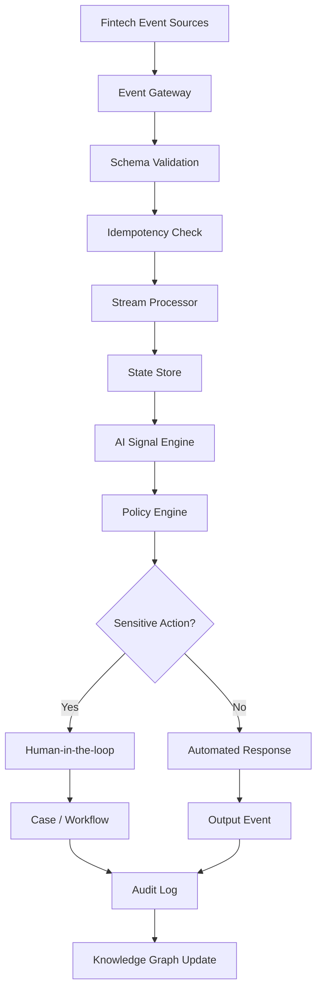
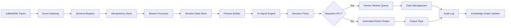

# Semana 16 — Event-Driven AI, Streaming Intelligence y Real-Time Decisioning para Fintech

## Cómo construir agentes AI que reaccionan a eventos reales en tiempo casi real

La **Semana 16** es el paso natural después de la Semana 15.

En la Semana 15 construiste:

```text
Semantic Layer
→ Ontology
→ Knowledge Graph
→ Evidence Paths
→ GraphRAG
→ Answer grounded
→ Audit trail
```

Eso te dio una capa de contexto corporativo.

Pero aparece un problema nuevo:

> **El contexto enterprise no puede estar muerto o desactualizado. Tiene que actualizarse con eventos reales de negocio, operación, fraude, pagos, deploys, métricas e incidentes.**

Entonces la Semana 16 responde:

> **¿Cómo hago que mis agentes AI reaccionen a eventos en tiempo casi real, mantengan contexto vivo, generen alertas, tomen decisiones seguras y dejen evidencia auditable?**

---

# 1. Tema central de la Semana 16

La Semana 16 es:

# **Event-Driven AI + Streaming Intelligence + Real-Time Decisioning**

aplicado a fintech.

La idea central:

```text
Eventos fintech
→ Event contracts
→ Stream processing
→ State store
→ AI signal detection
→ Policy engine
→ Human-in-the-loop
→ Action/event output
→ Audit trail
```

Esto sirve para casos como:

- fraude en transacciones;
- chargebacks;
- morosidad temprana;
- KYC;
- alertas operativas;
- incidentes;
- deploy impact analysis;
- customer support automation;
- detección de anomalías;
- enriquecimiento de Knowledge Graph;
- agentes que se activan ante eventos.

---

# 2. Por qué esta semana importa en fintech

Una fintech vive en eventos.

Ejemplos:

```text
payment.authorized
payment.rejected
card.transaction.created
fraud.signal.detected
chargeback.created
kyc.document.rejected
customer.risk.updated
loan.installment.overdue
merchant.settlement.failed
deploy.completed
datadog.alert.triggered
schema.version.changed
```

Cada uno de esos eventos puede disparar una acción:

- alertar;
- clasificar;
- enriquecer;
- bloquear;
- derivar a humano;
- crear caso;
- actualizar grafo;
- ejecutar workflow;
- guardar evidencia;
- iniciar investigación.

Pero en fintech no alcanza con “reaccionar rápido”.

Tenés que reaccionar:

```text
rápido
+ correcto
+ seguro
+ idempotente
+ auditable
+ explicable
+ tolerante a fallas
+ controlado por políticas
```

Amazon MSK, por ejemplo, está documentado por AWS como un servicio administrado para construir y ejecutar aplicaciones que usan Apache Kafka para procesar datos de streaming; esto encaja naturalmente con arquitecturas fintech basadas en eventos. ([Documentación de AWS](https://docs.aws.amazon.com/msk/latest/developerguide/msk-cluster-management.html?utm_source=chatgpt.com "Amazon MSK: How it works - Amazon Managed Streaming for Apache Kafka"))

---

# 3. Mapa mental de la Semana 16



---

# 4. Qué problema resuelve

Hasta ahora muchos sistemas AI responden cuando alguien pregunta.

La Semana 16 agrega otra capacidad:

> **El agente no espera a que lo consulten. Escucha eventos y detecta cuándo debe actuar.**

Ejemplo:

```text
Evento:
chargeback.created

El sistema:
1. valida schema;
2. chequea idempotencia;
3. calcula riesgo;
4. consulta contexto del comercio;
5. revisa señales de fraude;
6. busca deploys recientes;
7. genera evidence path;
8. decide si escala;
9. crea alerta auditable.
```

Esto transforma un agente de IA en un componente operativo real.

---

# 5. Concepto 1 — Event-Driven Architecture

Una **Event-Driven Architecture** es una arquitectura donde los sistemas se comunican publicando y consumiendo eventos.

No es:

```text
Servicio A llama directo a Servicio B y espera respuesta
```

Es:

```text
Servicio A publica un evento
Servicio B, C y D lo consumen cuando corresponde
```

## Ejemplo fintech

Cuando ocurre una autorización de pago:

```text
payments-core
→ publica payment.authorized
→ fraud-engine consume
→ loyalty consume
→ analytics consume
→ customer-notification consume
```

Esto desacopla sistemas.

## Ventajas

- escalabilidad;
- desacoplamiento;
- auditabilidad;
- replay;
- integración entre dominios;
- procesamiento asíncrono;
- resiliencia;
- posibilidad de alimentar AI con eventos reales.

## Riesgos

- duplicados;
- desorden;
- eventos tardíos;
- schemas incompatibles;
- side effects repetidos;
- consumers rotos;
- DLQs crecientes;
- pérdida de trazabilidad;
- decisiones automáticas peligrosas.

---

# 6. Concepto 2 — Evento vs comando

Esto es clave.

## Evento

Describe algo que **ya pasó**.

Ejemplos:

```text
payment.authorized
chargeback.created
fraud.signal.detected
kyc.document.rejected
```

## Comando

Pide que algo **pase**.

Ejemplos:

```text
block_card
create_dispute
notify_customer
assign_case
```

## Regla

```text
Evento = hecho pasado
Comando = intención futura
```

En fintech, no mezcles esto.

Malo:

```text
event: block_card
```

Mejor:

```text
command: block_card
event: card.blocked
```

---

# 7. Concepto 3 — Event contract

Un **event contract** define la forma oficial del evento.

Debe especificar:

- nombre;
- versión;
- productor;
- dominio;
- schema;
- campos obligatorios;
- sensibilidad;
- semántica;
- compatibilidad;
- owner;
- ejemplos;
- reglas de evolución.

## Ejemplo

```json
{
  "eventName": "chargeback.created",
  "version": "1.0.0",
  "domain": "payments",
  "producer": "chargebacks-service",
  "sensitivity": "confidential",
  "schema": {
    "chargebackId": "string",
    "merchantId": "string",
    "amount": "number",
    "currency": "ARS",
    "createdAt": "datetime"
  }
}
```

CloudEvents existe justamente para estandarizar metadatos comunes de eventos y mejorar interoperabilidad entre servicios, plataformas y sistemas; su especificación define atributos de contexto que acompañan el evento, como identificador, fuente, tipo y hora. ([GitHub](https://github.com/cloudevents/spec/blob/main/cloudevents/spec.md?utm_source=chatgpt.com "spec/cloudevents/spec.md at main · cloudevents/spec · GitHub"))

---

# 8. Concepto 4 — Schema evolution

Los eventos cambian.

Ejemplo:

Versión 1:

```json
{
  "merchantId": "m_123",
  "amount": 1000
}
```

Versión 2:

```json
{
  "merchantId": "m_123",
  "amount": 1000,
  "paymentMethod": "credit_card"
}
```

Agregar campos opcionales suele ser compatible.

Pero eliminar o renombrar campos puede romper consumidores.

## Regla práctica

```text
Nunca rompas consumidores silenciosamente.
```

## Tipos de compatibilidad

| TipoQué significa   |                                            |
| ------------------- | ------------------------------------------ |
| Backward compatible | consumidores nuevos leen eventos viejos    |
| Forward compatible  | consumidores viejos toleran eventos nuevos |
| Full compatible     | ambas cosas                                |
| Breaking change     | alguien se rompe                           |

En fintech, un breaking change en eventos puede afectar:

- fraude;
- conciliación;
- analytics;
- auditoría;
- cobranzas;
- reporting regulatorio.

---

# 9. Concepto 5 — Idempotencia

**Idempotencia** significa que procesar el mismo evento más de una vez no produce efectos duplicados.

Esto es obligatorio en eventos.

Porque en sistemas distribuidos puede pasar que:

- el productor reintente;
- el consumer caiga;
- Kafka reentregue;
- el proceso se reinicie;
- el offset no se confirme;
- llegue un duplicado real.

## Ejemplo peligroso

Evento duplicado:

```text
chargeback.created cb_123
chargeback.created cb_123
```

Sin idempotencia:

```text
crear caso 1
crear caso 2
avisar Slack dos veces
cobrar dos veces
```

Con idempotencia:

```text
cb_123 ya procesado → no duplicar side effect
```

Kafka documenta que el productor idempotente busca asegurar que una sola copia de cada mensaje sea escrita en el stream; además, la documentación de diseño de Kafka explica que las transacciones permiten semánticas tipo “todo o nada” al escribir en múltiples particiones/topics, y que Kafka Streams puede ofrecer procesamiento exactly-once dentro del ecosistema Kafka. ([Apache Kafka](https://kafka.apache.org/30/configuration/producer-configs/?utm_source=chatgpt.com "Producer Configs | Apache Kafka"))

---

# 10. Concepto 6 — Exactly-once no significa magia

Muchos confunden:

```text
exactly-once en Kafka
```

con:

```text
mi negocio nunca ejecuta un efecto duplicado
```

No es lo mismo.

Kafka puede ayudarte con garantías dentro del log y ciertos flujos transaccionales, pero si tu consumer llama una API externa, crea un caso en CRM, manda un email o bloquea una tarjeta, necesitás idempotencia de negocio.

## Regla fintech

```text
No confíes solo en exactly-once del broker.
Diseñá idempotencia en el dominio.
```

Ejemplo:

```text
idempotencyKey = eventId + actionType + targetEntity
```

---

# 11. Concepto 7 — Ordering

**Ordering** significa mantener el orden de eventos.

En Kafka, el orden se garantiza dentro de una partición, no globalmente.

## Ejemplo

Para una tarjeta:

```text
card.created
card.blocked
card.unblocked
```

Si llegan desordenados, podés dejar el estado incorrecto.

## Clave de partición

Para mantener orden por entidad, elegí bien la key:

```text
key = cardId
key = customerId
key = merchantId
key = accountId
```

## En fintech

| CasoKey recomendada      |                               |
| ------------------------ | ----------------------------- |
| transacciones de tarjeta | `cardId` o `accountId`        |
| riesgo cliente           | `customerId`                  |
| settlement comercio      | `merchantId`                  |
| chargebacks              | `chargebackId` o `merchantId` |
| mora                     | `accountId` o `loanId`        |

---

# 12. Concepto 8 — Event time vs processing time

## Event time

Cuándo ocurrió realmente el evento.

```text
payment.createdAt = 10:03:15
```

## Processing time

Cuándo tu sistema lo procesó.

```text
consumer recibió = 10:05:02
```

Esto importa porque los eventos pueden llegar tarde o desordenados.

Apache Flink explica que event time y processing time pueden avanzar de forma independiente, y que los watermarks son el mecanismo para medir progreso en event time; también documenta que los eventos tardíos son aquellos que llegan después de que el watermark ya pasó su timestamp. ([Apache Nightlies](https://nightlies.apache.org/flink/flink-docs-stable/docs/concepts/time/?utm_source=chatgpt.com "Timely Stream Processing | Apache Flink"))

---

# 13. Concepto 9 — Watermarks

Un **watermark** es una señal que dice:

```text
Creo que ya llegaron todos los eventos hasta este tiempo.
```

Ejemplo:

```text
watermark = 10:05
```

Significa:

```text
puedo cerrar ventanas hasta 10:05
```

Pero si llega un evento de 10:03 después del watermark, es un late event.

## En fintech

Ejemplo: cálculo de fraude por ventana de 5 minutos.

```text
10:00-10:05
```

Si un evento de 10:02 llega a las 10:07:

- ¿lo ignorás?
- ¿recalculás?
- ¿mandás a late-events?
- ¿abrís un caso?

Eso debe estar definido.

---

# 14. Concepto 10 — Windowing

**Windowing** agrupa eventos por ventanas de tiempo.

## Tipos

### Tumbling window

Ventanas fijas sin solapamiento.

```text
10:00-10:05
10:05-10:10
10:10-10:15
```

Bueno para:

- conteo de transacciones cada 5 minutos;
- chargebacks por hora;
- errores por minuto.

### Sliding window

Ventanas solapadas.

```text
últimos 10 minutos, evaluado cada 1 minuto
```

Bueno para:

- fraude;
- anomalías;
- picos;
- métricas vivas.

### Session window

Agrupa eventos por actividad.

Bueno para:

- sesión de usuario;
- onboarding;
- flujo KYC;
- checkout.

---

# 15. Concepto 11 — Stream processing

**Stream processing** es procesar eventos continuamente.

No esperás al batch nocturno.

Ejemplo batch:

```text
cada noche calculo morosidad
```

Ejemplo streaming:

```text
cada evento de pago vencido actualiza riesgo de mora
```

## En fintech

Streaming sirve para:

- fraude inmediato;
- alertas de chargeback;
- riesgo de mora temprano;
- KYC backlog;
- detección de incidentes;
- monitoreo de APIs;
- señales para agentes AI;
- actualización de grafos.

---

# 16. Concepto 12 — Stateful stream processing

Muchas decisiones necesitan memoria.

Ejemplo:

```text
¿Este cliente tuvo más de 5 rechazos en 10 minutos?
```

No alcanza con mirar un evento aislado.

Necesitás estado:

```text
customerId → cantidad de rechazos en ventana
merchantId → chargebacks últimos 7 días
cardId → intentos fallidos últimos 5 minutos
```

## Riesgo

El estado debe ser:

- consistente;
- recuperable;
- expirado por TTL;
- auditable;
- particionado;
- protegido.

---

# 17. Concepto 13 — AI Signal Engine

Un **AI Signal Engine** no es necesariamente un LLM.

Es una capa que recibe eventos y produce señales.

Puede combinar:

- reglas;
- features;
- heurísticas;
- modelos ML;
- LLM;
- GraphRAG;
- políticas;
- thresholds;
- anomaly detection.

## Ejemplo

Entrada:

```json
{
  "type": "chargeback.created",
  "merchantId": "merchant_123",
  "amount": 35000,
  "currency": "ARS"
}
```

Salida:

```json
{
  "signalType": "merchant_chargeback_spike",
  "severity": "high",
  "confidence": 0.91,
  "recommendedAction": "open_investigation",
  "requiresHumanReview": true
}
```

---

# 18. Concepto 14 — Real-Time Decisioning

**Real-Time Decisioning** significa tomar una decisión operativa mientras el evento todavía importa.

Ejemplos:

- autorizar o rechazar;
- pedir step-up;
- escalar fraude;
- pausar una acción;
- crear caso;
- alertar a risk ops;
- actualizar score;
- activar contacto preventivo.

## Regla fintech

No toda decisión real-time debe ser automática.

Clasificá así:

| DecisiónAutomatización |                        |
| ---------------------- | ---------------------- |
| Enriquecer evento      | automática             |
| Crear señal            | automática             |
| Crear caso draft       | automática             |
| Alertar humano         | automática             |
| Bloquear tarjeta       | HITL o policy estricta |
| Cambiar límite         | HITL fuerte            |
| Rechazar crédito       | governance crítico     |
| Cobranza sensible      | control compliance     |

---

# 19. Concepto 15 — Event-driven AI agent

Un agente AI event-driven tiene tres entradas:

```text
1. Evento
2. Estado
3. Contexto
```

Y produce:

```text
1. Señal
2. Decisión
3. Acción
4. Evidencia
5. Audit event
```

## Ejemplo

```text
chargeback.created
+ estado del comercio
+ GraphRAG del flujo payments/fraud
→ señal de spike
→ crear investigation draft
→ escalar a humano
→ guardar evidence path
```

---

# 20. Arquitectura objetivo Semana 16



---

# 21. Diseño de eventos para la semana

Vamos a trabajar con cuatro eventos fintech:

```text
payment.authorized
payment.rejected
chargeback.created
deploy.completed
```

Y producir tres salidas:

```text
ai.signal.detected
ai.case.created
ai.audit.recorded
```

---

# 22. Código — tipos base

## `src/types.ts`

```ts
export type EventType =
  | "payment.authorized"
  | "payment.rejected"
  | "chargeback.created"
  | "deploy.completed";

export type OutputEventType =
  | "ai.signal.detected"
  | "ai.case.created"
  | "ai.audit.recorded";

export type Domain =
  | "payments"
  | "fraud"
  | "collections"
  | "kyc"
  | "platform";

export type Severity = "low" | "medium" | "high" | "critical";

export interface FintechEvent<TPayload = Record<string, unknown>> {
  id: string;
  type: EventType;
  source: string;
  subject: string;
  domain: Domain;
  time: string;
  schemaVersion: string;
  correlationId: string;
  causationId?: string;
  sensitivity: "public" | "internal" | "confidential" | "restricted";
  payload: TPayload;
}

export interface PaymentAuthorizedPayload {
  paymentId: string;
  customerId: string;
  merchantId: string;
  amount: number;
  currency: "ARS" | "USD";
  channel: "card" | "wallet" | "transfer";
}

export interface PaymentRejectedPayload {
  paymentId: string;
  customerId: string;
  merchantId: string;
  reason: "insufficient_funds" | "risk_decline" | "technical_error";
  amount: number;
  currency: "ARS" | "USD";
}

export interface ChargebackCreatedPayload {
  chargebackId: string;
  paymentId: string;
  customerId: string;
  merchantId: string;
  amount: number;
  currency: "ARS" | "USD";
  reason: "fraud" | "duplicate" | "service_not_provided" | "unknown";
}

export interface DeployCompletedPayload {
  deployId: string;
  systemId: string;
  componentId: string;
  environment: "dev" | "staging" | "prod";
  deployedBy: string;
}

export interface AISignal {
  signalId: string;
  sourceEventId: string;
  signalType:
    | "merchant_chargeback_spike"
    | "customer_rejection_burst"
    | "deploy_risk_correlation"
    | "normal_activity";
  severity: Severity;
  confidence: number;
  recommendedAction:
    | "none"
    | "open_investigation"
    | "create_case_draft"
    | "notify_human"
    | "pause_automation";
  requiresHumanReview: boolean;
  rationale: string[];
}

export interface DecisionResult {
  allowed: boolean;
  action: string;
  requiresHumanReview: boolean;
  reason: string;
}

export interface AuditRecord {
  auditId: string;
  eventId: string;
  signalId?: string;
  decision: DecisionResult;
  createdAt: string;
  evidence: string[];
}
```

---

# 23. Código — event contract validator

## `src/eventContract.ts`

```ts
import type { EventType, FintechEvent } from "./types.ts";

const supportedVersions: Record<EventType, string[]> = {
  "payment.authorized": ["1.0.0"],
  "payment.rejected": ["1.0.0"],
  "chargeback.created": ["1.0.0"],
  "deploy.completed": ["1.0.0"]
};

export interface ValidationResult {
  valid: boolean;
  errors: string[];
}

export function validateEventContract(event: FintechEvent): ValidationResult {
  const errors: string[] = [];

  if (!event.id) errors.push("missing_event_id");
  if (!event.type) errors.push("missing_event_type");
  if (!event.source) errors.push("missing_source");
  if (!event.subject) errors.push("missing_subject");
  if (!event.domain) errors.push("missing_domain");
  if (!event.time || Number.isNaN(Date.parse(event.time))) {
    errors.push("invalid_event_time");
  }

  const versions = supportedVersions[event.type];
  if (!versions?.includes(event.schemaVersion)) {
    errors.push(`unsupported_schema_version:${event.schemaVersion}`);
  }

  if (!event.correlationId) {
    errors.push("missing_correlation_id");
  }

  if (!event.payload || typeof event.payload !== "object") {
    errors.push("missing_payload");
  }

  return {
    valid: errors.length === 0,
    errors
  };
}
```

---

# 24. Código — idempotency store

## `src/idempotencyStore.ts`

```ts
export interface IdempotencyResult {
  firstSeen: boolean;
  duplicate: boolean;
}

export class IdempotencyStore {
  private readonly processed = new Set<string>();

  checkAndMark(key: string): IdempotencyResult {
    if (this.processed.has(key)) {
      return {
        firstSeen: false,
        duplicate: true
      };
    }

    this.processed.add(key);

    return {
      firstSeen: true,
      duplicate: false
    };
  }

  has(key: string): boolean {
    return this.processed.has(key);
  }

  size(): number {
    return this.processed.size;
  }
}
```

---

# 25. Código — event time window store

## `src/windowStore.ts`

```ts
import type { FintechEvent } from "./types.ts";

export interface WindowCount {
  key: string;
  windowStart: string;
  windowEnd: string;
  count: number;
}

export class EventTimeWindowStore {
  private readonly eventsByKey = new Map<string, FintechEvent[]>();

  add(key: string, event: FintechEvent): void {
    const current = this.eventsByKey.get(key) ?? [];
    current.push(event);
    this.eventsByKey.set(key, current);
  }

  countEventsSince(key: string, sinceIso: string): number {
    const since = Date.parse(sinceIso);
    const events = this.eventsByKey.get(key) ?? [];

    return events.filter((event) => Date.parse(event.time) >= since).length;
  }

  countByTypeSince(key: string, type: string, sinceIso: string): number {
    const since = Date.parse(sinceIso);
    const events = this.eventsByKey.get(key) ?? [];

    return events.filter(
      (event) => event.type === type && Date.parse(event.time) >= since
    ).length;
  }

  keys(): string[] {
    return [...this.eventsByKey.keys()];
  }
}
```

---

# 26. Código — watermark manager

## `src/watermarkManager.ts`

```ts
export interface WatermarkDecision {
  accepted: boolean;
  late: boolean;
  reason: string;
}

export class WatermarkManager {
  private currentWatermarkMs = 0;

  constructor(private readonly allowedLatenessMs: number) {}

  observeEvent(eventTimeIso: string): void {
    const eventTime = Date.parse(eventTimeIso);
    const candidate = eventTime - this.allowedLatenessMs;

    if (candidate > this.currentWatermarkMs) {
      this.currentWatermarkMs = candidate;
    }
  }

  evaluate(eventTimeIso: string): WatermarkDecision {
    const eventTime = Date.parse(eventTimeIso);

    if (eventTime < this.currentWatermarkMs) {
      return {
        accepted: false,
        late: true,
        reason: "event_is_later_than_watermark"
      };
    }

    return {
      accepted: true,
      late: false,
      reason: "event_accepted"
    };
  }

  watermarkIso(): string {
    return new Date(this.currentWatermarkMs).toISOString();
  }
}
```

---

# 27. Código — AI signal engine

## `src/aiSignalEngine.ts`

```ts
import { randomUUID } from "node:crypto";
import type {
  AISignal,
  ChargebackCreatedPayload,
  FintechEvent,
  PaymentRejectedPayload
} from "./types.ts";
import { EventTimeWindowStore } from "./windowStore.ts";

export function detectSignal(
  event: FintechEvent,
  state: EventTimeWindowStore,
  nowIso: string
): AISignal {
  const fifteenMinutesAgo = new Date(
    Date.parse(nowIso) - 15 * 60 * 1000
  ).toISOString();

  if (event.type === "chargeback.created") {
    const payload = event.payload as ChargebackCreatedPayload;
    const merchantKey = `merchant:${payload.merchantId}`;

    const chargebacks = state.countByTypeSince(
      merchantKey,
      "chargeback.created",
      fifteenMinutesAgo
    );

    if (chargebacks >= 3) {
      return {
        signalId: randomUUID(),
        sourceEventId: event.id,
        signalType: "merchant_chargeback_spike",
        severity: "high",
        confidence: 0.91,
        recommendedAction: "open_investigation",
        requiresHumanReview: true,
        rationale: [
          `chargebacks_in_15m:${chargebacks}`,
          `merchant:${payload.merchantId}`,
          "threshold_exceeded"
        ]
      };
    }
  }

  if (event.type === "payment.rejected") {
    const payload = event.payload as PaymentRejectedPayload;
    const customerKey = `customer:${payload.customerId}`;

    const rejects = state.countByTypeSince(
      customerKey,
      "payment.rejected",
      fifteenMinutesAgo
    );

    if (rejects >= 4) {
      return {
        signalId: randomUUID(),
        sourceEventId: event.id,
        signalType: "customer_rejection_burst",
        severity: "medium",
        confidence: 0.84,
        recommendedAction: "notify_human",
        requiresHumanReview: true,
        rationale: [
          `rejections_in_15m:${rejects}`,
          `customer:${payload.customerId}`,
          "possible_risk_or_customer_friction"
        ]
      };
    }
  }

  if (event.type === "deploy.completed") {
    return {
      signalId: randomUUID(),
      sourceEventId: event.id,
      signalType: "deploy_risk_correlation",
      severity: "low",
      confidence: 0.7,
      recommendedAction: "none",
      requiresHumanReview: false,
      rationale: [
        "deploy_observed",
        "correlation_requires_metric_change_before_action"
      ]
    };
  }

  return {
    signalId: randomUUID(),
    sourceEventId: event.id,
    signalType: "normal_activity",
    severity: "low",
    confidence: 0.5,
    recommendedAction: "none",
    requiresHumanReview: false,
    rationale: ["no_threshold_exceeded"]
  };
}
```

---

# 28. Código — decision policy

## `src/decisionPolicy.ts`

```ts
import type { AISignal, DecisionResult } from "./types.ts";

export function evaluateDecision(signal: AISignal): DecisionResult {
  if (signal.severity === "critical") {
    return {
      allowed: false,
      action: "blocked",
      requiresHumanReview: true,
      reason: "critical_signal_requires_manual_governance"
    };
  }

  if (signal.recommendedAction === "open_investigation") {
    return {
      allowed: true,
      action: "create_case_draft",
      requiresHumanReview: true,
      reason: "investigation_allowed_as_draft_only"
    };
  }

  if (signal.recommendedAction === "notify_human") {
    return {
      allowed: true,
      action: "notify_human",
      requiresHumanReview: true,
      reason: "human_notification_allowed"
    };
  }

  if (signal.recommendedAction === "pause_automation") {
    return {
      allowed: false,
      action: "pause_automation_requires_approval",
      requiresHumanReview: true,
      reason: "automation_pause_requires_explicit_approval"
    };
  }

  return {
    allowed: true,
    action: "no_action",
    requiresHumanReview: false,
    reason: "no_risky_action_requested"
  };
}
```

---

# 29. Código — audit log

## `src/auditLog.ts`

```ts
import { randomUUID } from "node:crypto";
import type { AISignal, AuditRecord, DecisionResult, FintechEvent } from "./types.ts";

export class AuditLog {
  private readonly records: AuditRecord[] = [];

  record(event: FintechEvent, signal: AISignal, decision: DecisionResult): AuditRecord {
    const audit: AuditRecord = {
      auditId: randomUUID(),
      eventId: event.id,
      signalId: signal.signalId,
      decision,
      createdAt: new Date().toISOString(),
      evidence: [
        `event_type:${event.type}`,
        `event_source:${event.source}`,
        `signal_type:${signal.signalType}`,
        `severity:${signal.severity}`,
        ...signal.rationale
      ]
    };

    this.records.push(audit);
    return audit;
  }

  all(): AuditRecord[] {
    return this.records;
  }

  byEvent(eventId: string): AuditRecord[] {
    return this.records.filter((record) => record.eventId === eventId);
  }
}
```

---

# 30. Código — stream processor

## `src/streamProcessor.ts`

```ts
import type { AISignal, AuditRecord, DecisionResult, FintechEvent } from "./types.ts";
import { validateEventContract } from "./eventContract.ts";
import { IdempotencyStore } from "./idempotencyStore.ts";
import { EventTimeWindowStore } from "./windowStore.ts";
import { WatermarkManager } from "./watermarkManager.ts";
import { detectSignal } from "./aiSignalEngine.ts";
import { evaluateDecision } from "./decisionPolicy.ts";
import { AuditLog } from "./auditLog.ts";

export interface ProcessedEventResult {
  eventId: string;
  status: "processed" | "duplicate" | "invalid" | "late";
  validationErrors: string[];
  signal?: AISignal;
  decision?: DecisionResult;
  audit?: AuditRecord;
}

export class StreamProcessor {
  private readonly idempotency = new IdempotencyStore();
  private readonly state = new EventTimeWindowStore();
  private readonly watermark: WatermarkManager;
  private readonly audit = new AuditLog();

  constructor(allowedLatenessMs: number) {
    this.watermark = new WatermarkManager(allowedLatenessMs);
  }

  process(event: FintechEvent, nowIso: string): ProcessedEventResult {
    const validation = validateEventContract(event);

    if (!validation.valid) {
      return {
        eventId: event.id,
        status: "invalid",
        validationErrors: validation.errors
      };
    }

    const watermarkDecision = this.watermark.evaluate(event.time);

    if (!watermarkDecision.accepted) {
      return {
        eventId: event.id,
        status: "late",
        validationErrors: [watermarkDecision.reason]
      };
    }

    this.watermark.observeEvent(event.time);

    const idempotencyKey = `${event.id}:${event.type}`;
    const idem = this.idempotency.checkAndMark(idempotencyKey);

    if (idem.duplicate) {
      return {
        eventId: event.id,
        status: "duplicate",
        validationErrors: []
      };
    }

    const stateKeys = this.deriveStateKeys(event);

    for (const key of stateKeys) {
      this.state.add(key, event);
    }

    const signal = detectSignal(event, this.state, nowIso);
    const decision = evaluateDecision(signal);
    const audit = this.audit.record(event, signal, decision);

    return {
      eventId: event.id,
      status: "processed",
      validationErrors: [],
      signal,
      decision,
      audit
    };
  }

  auditRecords(): AuditRecord[] {
    return this.audit.all();
  }

  private deriveStateKeys(event: FintechEvent): string[] {
    const payload = event.payload as {
      customerId?: string;
      merchantId?: string;
      paymentId?: string;
    };

    const keys: string[] = [];

    if (payload.customerId) keys.push(`customer:${payload.customerId}`);
    if (payload.merchantId) keys.push(`merchant:${payload.merchantId}`);
    if (payload.paymentId) keys.push(`payment:${payload.paymentId}`);

    return keys;
  }
}
```

---

# 31. Código — telemetry

## `src/telemetry.ts`

```ts
import type { ProcessedEventResult } from "./streamProcessor.ts";

export interface TelemetryEvent {
  timestamp: string;
  eventId: string;
  status: string;
  signalType?: string;
  severity?: string;
  latencyMs: number;
}

export class StreamTelemetry {
  private readonly events: TelemetryEvent[] = [];

  record(result: ProcessedEventResult, latencyMs: number): void {
    this.events.push({
      timestamp: new Date().toISOString(),
      eventId: result.eventId,
      status: result.status,
      signalType: result.signal?.signalType,
      severity: result.signal?.severity,
      latencyMs
    });
  }

  all(): TelemetryEvent[] {
    return this.events;
  }

  summary() {
    const processed = this.events.filter((event) => event.status === "processed");
    const invalid = this.events.filter((event) => event.status === "invalid");
    const duplicate = this.events.filter((event) => event.status === "duplicate");
    const late = this.events.filter((event) => event.status === "late");

    const avgLatency =
      this.events.length === 0
        ? 0
        : this.events.reduce((sum, event) => sum + event.latencyMs, 0) /
          this.events.length;

    return {
      totalEvents: this.events.length,
      processed: processed.length,
      invalid: invalid.length,
      duplicate: duplicate.length,
      late: late.length,
      highSignals: this.events.filter((event) => event.severity === "high").length,
      averageLatencyMs: Number(avgLatency.toFixed(2))
    };
  }
}
```

---

# 32. Código — main demo

## `src/main.ts`

```ts
import fs from "node:fs";
import type {
  ChargebackCreatedPayload,
  FintechEvent,
  PaymentRejectedPayload
} from "./types.ts";
import { StreamProcessor } from "./streamProcessor.ts";
import { StreamTelemetry } from "./telemetry.ts";

const processor = new StreamProcessor(2 * 60 * 1000);
const telemetry = new StreamTelemetry();

const nowIso = "2026-08-03T14:00:00-03:00";

const events: FintechEvent[] = [
  paymentRejected("evt_001", "cust_001", "merchant_001", nowIso),
  paymentRejected("evt_002", "cust_001", "merchant_001", "2026-08-03T14:01:00-03:00"),
  paymentRejected("evt_003", "cust_001", "merchant_001", "2026-08-03T14:02:00-03:00"),
  paymentRejected("evt_004", "cust_001", "merchant_001", "2026-08-03T14:03:00-03:00"),
  chargebackCreated("evt_005", "cb_001", "pay_001", "cust_002", "merchant_777", "2026-08-03T14:04:00-03:00"),
  chargebackCreated("evt_006", "cb_002", "pay_002", "cust_003", "merchant_777", "2026-08-03T14:05:00-03:00"),
  chargebackCreated("evt_007", "cb_003", "pay_003", "cust_004", "merchant_777", "2026-08-03T14:06:00-03:00"),
  chargebackCreated("evt_007", "cb_003", "pay_003", "cust_004", "merchant_777", "2026-08-03T14:06:00-03:00")
];

const results = [];

for (const event of events) {
  const started = Date.now();
  const result = processor.process(event, "2026-08-03T14:07:00-03:00");
  telemetry.record(result, Date.now() - started);
  results.push(result);
}

const output = {
  results,
  telemetry: telemetry.all(),
  telemetrySummary: telemetry.summary(),
  auditRecords: processor.auditRecords()
};

console.log(JSON.stringify(output, null, 2));

fs.writeFileSync(
  "week16_streaming_ai_results.json",
  JSON.stringify(output, null, 2)
);

function paymentRejected(
  id: string,
  customerId: string,
  merchantId: string,
  time: string
): FintechEvent<PaymentRejectedPayload> {
  return {
    id,
    type: "payment.rejected",
    source: "payments-core",
    subject: `customer:${customerId}`,
    domain: "payments",
    time,
    schemaVersion: "1.0.0",
    correlationId: `corr_${id}`,
    sensitivity: "confidential",
    payload: {
      paymentId: `pay_${id}`,
      customerId,
      merchantId,
      reason: "risk_decline",
      amount: 15000,
      currency: "ARS"
    }
  };
}

function chargebackCreated(
  id: string,
  chargebackId: string,
  paymentId: string,
  customerId: string,
  merchantId: string,
  time: string
): FintechEvent<ChargebackCreatedPayload> {
  return {
    id,
    type: "chargeback.created",
    source: "chargebacks-service",
    subject: `merchant:${merchantId}`,
    domain: "payments",
    time,
    schemaVersion: "1.0.0",
    correlationId: `corr_${id}`,
    sensitivity: "confidential",
    payload: {
      chargebackId,
      paymentId,
      customerId,
      merchantId,
      amount: 35000,
      currency: "ARS",
      reason: "fraud"
    }
  };
}
```

---

# 33. Resultado esperado de la demo

Debería generar:

```json
{
  "telemetrySummary": {
    "totalEvents": 8,
    "processed": 7,
    "duplicate": 1,
    "invalid": 0,
    "late": 0,
    "highSignals": 1
  }
}
```

Y además:

- una señal `customer_rejection_burst`;
- una señal `merchant_chargeback_spike`;
- un duplicado detectado;
- audit records para eventos procesados;
- decisiones con `requiresHumanReview`.

---

# 34. Tests recomendados

## Test 1 — Event contract inválido

```ts
import test from "node:test";
import assert from "node:assert/strict";
import { validateEventContract } from "../src/eventContract.ts";
import type { FintechEvent } from "../src/types.ts";

test("rejects event with invalid time", () => {
  const event = {
    id: "evt_bad",
    type: "payment.rejected",
    source: "payments-core",
    subject: "customer:c1",
    domain: "payments",
    time: "not-a-date",
    schemaVersion: "1.0.0",
    correlationId: "corr_1",
    sensitivity: "confidential",
    payload: {}
  } as FintechEvent;

  const result = validateEventContract(event);

  assert.equal(result.valid, false);
  assert.ok(result.errors.includes("invalid_event_time"));
});
```

---

## Test 2 — Idempotencia

```ts
import test from "node:test";
import assert from "node:assert/strict";
import { IdempotencyStore } from "../src/idempotencyStore.ts";

test("detects duplicate idempotency key", () => {
  const store = new IdempotencyStore();

  const first = store.checkAndMark("evt_1:payment.rejected");
  const second = store.checkAndMark("evt_1:payment.rejected");

  assert.equal(first.firstSeen, true);
  assert.equal(second.duplicate, true);
});
```

---

## Test 3 — Watermark detecta evento tardío

```ts
import test from "node:test";
import assert from "node:assert/strict";
import { WatermarkManager } from "../src/watermarkManager.ts";

test("marks event as late when older than watermark", () => {
  const manager = new WatermarkManager(60_000);

  manager.observeEvent("2026-08-03T14:10:00-03:00");

  const decision = manager.evaluate("2026-08-03T14:05:00-03:00");

  assert.equal(decision.late, true);
  assert.equal(decision.accepted, false);
});
```

---

## Test 4 — Spike de chargebacks

```ts
import test from "node:test";
import assert from "node:assert/strict";
import { EventTimeWindowStore } from "../src/windowStore.ts";
import { detectSignal } from "../src/aiSignalEngine.ts";
import type { FintechEvent } from "../src/types.ts";

test("detects merchant chargeback spike", () => {
  const state = new EventTimeWindowStore();

  const events = [1, 2, 3].map((i) => ({
    id: `evt_${i}`,
    type: "chargeback.created",
    source: "chargebacks-service",
    subject: "merchant:m1",
    domain: "payments",
    time: `2026-08-03T14:0${i}:00-03:00`,
    schemaVersion: "1.0.0",
    correlationId: `corr_${i}`,
    sensitivity: "confidential",
    payload: {
      chargebackId: `cb_${i}`,
      paymentId: `pay_${i}`,
      customerId: `cust_${i}`,
      merchantId: "m1",
      amount: 1000,
      currency: "ARS",
      reason: "fraud"
    }
  })) as FintechEvent[];

  for (const event of events) {
    state.add("merchant:m1", event);
  }

  const signal = detectSignal(
    events[2],
    state,
    "2026-08-03T14:10:00-03:00"
  );

  assert.equal(signal.signalType, "merchant_chargeback_spike");
  assert.equal(signal.requiresHumanReview, true);
});
```

---

## Test 5 — Policy no permite acciones críticas automáticas

```ts
import test from "node:test";
import assert from "node:assert/strict";
import { evaluateDecision } from "../src/decisionPolicy.ts";

test("blocks critical signal from automatic action", () => {
  const decision = evaluateDecision({
    signalId: "sig_1",
    sourceEventId: "evt_1",
    signalType: "merchant_chargeback_spike",
    severity: "critical",
    confidence: 0.99,
    recommendedAction: "pause_automation",
    requiresHumanReview: true,
    rationale: []
  });

  assert.equal(decision.allowed, false);
  assert.equal(decision.requiresHumanReview, true);
});
```

---

# 35. Ejercicios prácticos por día

## Lunes — Event contracts

### Ejercicio 1

Diseñar contratos para:

```text
payment.authorized
payment.rejected
chargeback.created
kyc.document.rejected
loan.installment.overdue
```

Cada contrato debe tener:

- event name;
- schema version;
- domain;
- producer;
- owner;
- sensitivity;
- payload;
- examples;
- compatibility rules.

### Ejercicio 2

Implementar validación de campos obligatorios.

### Aprendizaje

Un evento sin contrato es deuda técnica distribuida.

---

## Martes — Idempotencia y duplicados

### Ejercicio 3

Crear un `IdempotencyStore`.

Procesar dos veces:

```text
chargeback.created cb_123
```

Debe crear un solo caso.

### Ejercicio 4

Definir idempotency keys para:

- alertas;
- casos;
- notificaciones;
- acciones sensibles.

### Aprendizaje

En event-driven systems, duplicado no es excepción. Es parte del diseño.

---

## Miércoles — Event time, watermarks y late events

### Ejercicio 5

Crear eventos con timestamps desordenados.

Ejemplo:

```text
14:01
14:03
14:02
14:10
13:59
```

### Ejercicio 6

Definir una política:

```text
late <= 2 minutos → aceptar
late > 2 minutos → late-event queue
```

### Aprendizaje

La verdad de negocio usa event time, no solo processing time.

---

## Jueves — Windowing y stateful processing

### Ejercicio 7

Detectar:

```text
4 pagos rechazados en 15 minutos por cliente
```

### Ejercicio 8

Detectar:

```text
3 chargebacks en 15 minutos por comercio
```

### Ejercicio 9

Agregar TTL del estado.

### Aprendizaje

La inteligencia streaming depende de estado bien diseñado.

---

## Viernes — AI Signal Engine

### Ejercicio 10

Agregar señales:

```text
merchant_chargeback_spike
customer_rejection_burst
deploy_risk_correlation
kyc_backlog_spike
```

Cada señal debe tener:

- severity;
- confidence;
- recommendedAction;
- requiresHumanReview;
- rationale.

### Aprendizaje

El AI Signal Engine convierte eventos en decisiones explicables.

---

## Sábado — Decisioning, HITL y audit

### Ejercicio 11

Crear policy:

```text
low → no action
medium → notify human
high → create case draft
critical → block automation and require approval
```

### Ejercicio 12

Generar audit trail para cada evento procesado.

Debe incluir:

- eventId;
- signalId;
- decision;
- rationale;
- timestamp;
- correlationId;
- evidence.

### Aprendizaje

En fintech, la decisión no termina en el modelo. Termina en una evidencia auditable.

---

# 36. Ejercicios avanzados

## Ejercicio 13 — Correlación con deploys

Detectar:

```text
deploy.completed en payments-core
+
aumento de payment.rejected
+
ventana de 30 minutos
```

Generar señal:

```text
deploy_risk_correlation
```

---

## Ejercicio 14 — Actualización del Knowledge Graph

Cada evento procesado debe actualizar nodos:

```text
Merchant
Payment
Chargeback
Deploy
Signal
Case
```

Y relaciones:

```text
MERCHANT_HAS_CHARGEBACK
PAYMENT_GENERATED_CHARGEBACK
DEPLOY_PRECEDES_SIGNAL
SIGNAL_CREATED_CASE
```

---

## Ejercicio 15 — Dead Letter Queue

Eventos inválidos deben ir a:

```text
dlq.invalid_events
```

Eventos tardíos deben ir a:

```text
dlq.late_events
```

Eventos con error técnico:

```text
dlq.processing_errors
```

---

## Ejercicio 16 — Replay seguro

Implementar replay de eventos históricos.

Reglas:

```text
no ejecutar side effects reales
sí recalcular señales
sí regenerar audit simulado
sí comparar contra resultados previos
```

---

## Ejercicio 17 — Streaming evals

Medir:

- precision de señales;
- false positive rate;
- false negative rate;
- human override rate;
- alert fatigue;
- average detection latency;
- duplicate suppression rate;
- DLQ rate.

---

# 37. Anti-patrones de Semana 16

## 1. Evento sin schema

Rompe consumidores y genera interpretaciones distintas.

## 2. Evento como comando

Confunde hechos con órdenes.

## 3. Procesar sin idempotencia

Duplica casos, alertas y acciones.

## 4. Ignorar late events

Produce métricas falsas.

## 5. Usar processing time para todo

Puede distorsionar ventanas de negocio.

## 6. Acción sensible automática

Riesgo fuerte en fintech.

## 7. No auditar decisiones

No se puede explicar qué pasó.

## 8. DLQ sin dueño

Se convierte en cementerio de errores.

## 9. Replays con side effects reales

Puede recrear acciones viejas peligrosamente.

## 10. LLM en cada evento

Costoso, lento y muchas veces innecesario.

---

# 38. Checklist de Semana 16

## Event contracts

-  Nombre del evento.
-  Versión.
-  Productor.
-  Owner.
-  Schema.
-  Ejemplos.
-  Sensibilidad.
-  Compatibilidad.

## Streaming

-  Consumer idempotente.
-  Event time.
-  Watermarks.
-  Late event handling.
-  Windows.
-  State store.
-  DLQ.

## AI

-  Signal engine.
-  Confidence.
-  Rationale.
-  Policy decision.
-  HITL.
-  Evidence.

## Fintech safety

-  No acción irreversible sin aprobación.
-  No duplicar side effects.
-  No PII innecesaria.
-  No fraude confirmado sin validación.
-  No bloqueo automático sin policy fuerte.

## Observabilidad

-  Eventos procesados.
-  Duplicados.
-  Late events.
-  Invalid events.
-  Señales high/critical.
-  Latency.
-  DLQ rate.
-  Audit trail.

---

# 39. Qué deberías poder explicar al terminar

Al cerrar la Semana 16 deberías poder explicar:

1. Qué es Event-Driven Architecture.
2. Diferencia entre evento y comando.
3. Qué es un event contract.
4. Qué es schema evolution.
5. Qué es idempotencia.
6. Por qué exactly-once no resuelve todo.
7. Qué es ordering por partición.
8. Qué es event time.
9. Qué son watermarks.
10. Qué es windowing.
11. Qué es stateful stream processing.
12. Qué es un AI Signal Engine.
13. Qué es Real-Time Decisioning.
14. Cómo diseñar un agente event-driven.
15. Cómo evitar acciones sensibles automáticas.
16. Cómo auditar decisiones streaming.
17. Cómo conectar eventos con Knowledge Graph.
18. Cómo usar streaming para NX Pulse IA.

---

# 40. Proyecto final ideal de la Semana 16

El repo debería llamarse:

# `week16-event-driven-ai-fintech`

Estructura recomendada:

```text
week16-event-driven-ai-fintech/
├─ README.md
├─ README.es.md
├─ README.en.md
├─ docs/
│  ├─ es/
│  └─ en/
├─ assets/
│  ├─ es/
│  └─ en/
├─ data/
│  ├─ event_contracts.json
│  ├─ sample_events.json
│  ├─ replay_events.json
│  ├─ policy_rules.json
│  └─ expected_signals.json
├─ src/
│  ├─ types.ts
│  ├─ eventContract.ts
│  ├─ idempotencyStore.ts
│  ├─ windowStore.ts
│  ├─ watermarkManager.ts
│  ├─ aiSignalEngine.ts
│  ├─ decisionPolicy.ts
│  ├─ auditLog.ts
│  ├─ streamProcessor.ts
│  ├─ telemetry.ts
│  ├─ httpServer.ts
│  └─ main.ts
├─ tests/
│  ├─ eventContract.test.ts
│  ├─ idempotencyStore.test.ts
│  ├─ watermarkManager.test.ts
│  ├─ windowStore.test.ts
│  ├─ aiSignalEngine.test.ts
│  ├─ decisionPolicy.test.ts
│  └─ streamProcessor.test.ts
└─ .github/
   └─ workflows/
      └─ ci.yml
```

---

# 41. Resumen maestro

La Semana 16 es donde tu IA deja de ser solo consultiva y pasa a ser **reactiva a eventos reales**.

La secuencia mental correcta es:

```text
Fintech event
→ contract validation
→ idempotency
→ event-time handling
→ stateful window
→ signal detection
→ policy decision
→ HITL when needed
→ output event
→ audit trail
→ graph/context update
```

La frase final:

> **En fintech, un agente AI event-driven no debe actuar porque “vio algo raro”. Debe actuar porque un evento válido, dentro de una ventana correcta, con estado suficiente y una política aprobada generó una señal auditable.**

Ese es el corazón de la Semana 16:
**Event-Driven AI + Streaming Intelligence + Real-Time Decisioning para Fintech.**