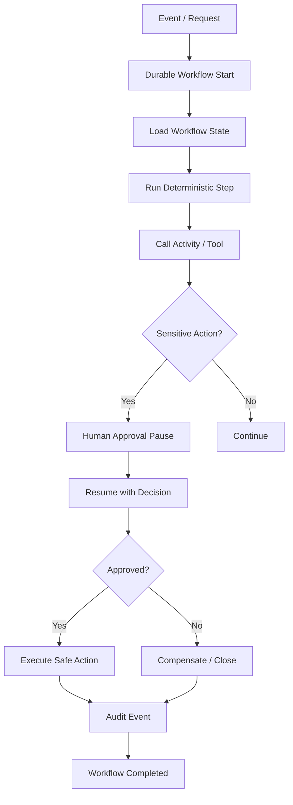
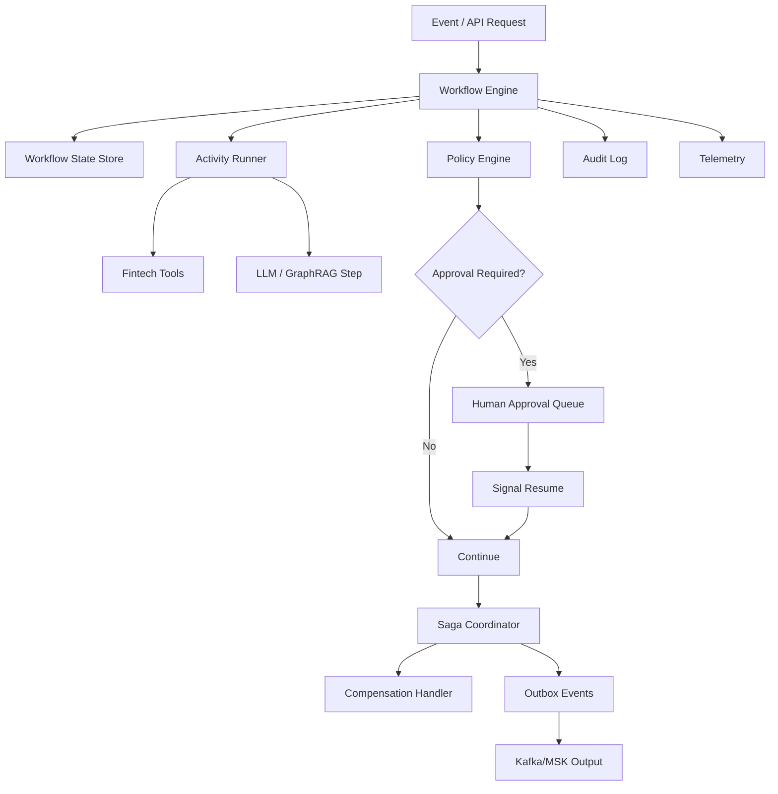

# Semana 17 — Durable AI Workflows, Human-in-the-Loop y Saga Orchestration para Fintech

## Cómo diseñar agentes y procesos AI que duran minutos, horas o días sin perder estado, sin duplicar acciones y con aprobación humana auditable

La **Semana 17** es el paso natural después de la Semana 16.

En la Semana 16 construiste:

```text
Eventos fintech
→ event contracts
→ idempotencia
→ event time
→ windowing
→ AI Signal Engine
→ decision policy
→ HITL
→ audit trail
```

Ahora aparece el siguiente problema real de producción:

> **Un evento puede disparar un proceso AI que no termina en una sola llamada. Puede durar minutos, horas o días, esperar aprobaciones humanas, consultar tools, reintentar, compensar errores, guardar evidencia y continuar después de una caída.**

Eso es la Semana 17:

# **Durable AI Workflows + HITL + Saga Orchestration para Fintech**

---

# 1. Tema central de la Semana 17

La Semana 17 enseña a construir workflows AI que sean:

```text
durables
+ pausables
+ reanudables
+ auditables
+ idempotentes
+ gobernados
+ compensables
+ seguros para acciones sensibles
```

El objetivo es pasar de esto:

```text
LLM call → respuesta
```

a esto:

```text
Evento fintech
→ workflow durable
→ clasificación
→ enriquecimiento
→ consulta de contexto
→ decisión preliminar
→ aprobación humana
→ acción segura
→ compensación si falla
→ auditoría
→ cierre
```

En plataformas actuales, esta idea aparece en herramientas como **Temporal**, que documenta ejecución durable y recuperación después de fallas; **AWS Step Functions**, que mantiene el estado de una ejecución y soporta pasos con aprobación humana/callback; y **LangGraph**, que posiciona durable execution, persistence y human-in-the-loop como capacidades centrales para agentes stateful. ([Documentación de Temporal](https://docs.temporal.io/?utm_source=chatgpt.com "Temporal Docs | Temporal Platform Documentation"))

---

# 2. Por qué esta semana importa en fintech

En fintech, muchos procesos AI no son instantáneos.

Ejemplos:

## Chargebacks

```text
chargeback.created
→ clasificar evidencia
→ consultar payment
→ consultar merchant
→ revisar fraude
→ generar recomendación
→ esperar aprobación humana
→ crear disputa draft
→ notificar área
→ auditar
```

## Fraude

```text
fraud.signal.detected
→ analizar señal
→ consultar últimas transacciones
→ revisar riesgo cliente
→ pedir revisión humana
→ crear caso
→ pausar automatización si corresponde
→ dejar evidencia
```

## KYC

```text
kyc.document.rejected
→ analizar causa
→ revisar documento
→ pedir imagen nueva
→ esperar acción del cliente
→ reintentar validación
→ escalar si hay inconsistencias
```

## Morosidad

```text
loan.installment.overdue
→ calcular riesgo
→ revisar historial
→ segmentar cliente
→ generar propuesta de contacto
→ aprobación compliance
→ ejecutar comunicación
```

Ninguno de estos debería depender de un proceso en memoria que se pierde si cae el servidor.

---

# 3. Mapa mental de la Semana 17



---

# 4. La idea principal

Quiero que te quede grabado así:

> **Un agente AI productivo no es solo un modelo que razona. Es un workflow durable que sabe pausar, esperar, reintentar, compensar, pedir aprobación y dejar evidencia.**

En fintech, esto es crítico porque muchas decisiones:

- no pueden ser automáticas;
- requieren revisión humana;
- tienen side effects;
- pueden fallar a mitad de camino;
- deben poder auditarse;
- deben tolerar reintentos;
- deben evitar duplicados;
- deben tener rollback o compensación.

---

# 5. Workflow vs agent

Primero, separá estos conceptos.

## Agent

Un agente decide dinámicamente qué hacer.

Ejemplo:

```text
“Necesito consultar pagos, después fraude y luego generar una hipótesis.”
```

## Workflow

Un workflow define un proceso controlado.

Ejemplo:

```text
1. Validar evento
2. Enriquecer contexto
3. Clasificar riesgo
4. Si riesgo alto, pedir aprobación
5. Crear caso
6. Auditar
```

## Regla fintech

```text
Agent = razonamiento flexible
Workflow = proceso gobernado
```

En fintech, lo mejor suele ser:

```text
workflow durable
+ pasos determinísticos
+ agentes acotados dentro de pasos específicos
```

No conviene que todo sea libre.

---

# 6. Durable execution

**Durable execution** significa que el workflow puede sobrevivir a:

- caída del servidor;
- restart;
- deploy;
- timeout;
- espera larga;
- aprobación humana;
- error temporal;
- retry;
- pausa de horas o días.

La idea es que el estado del workflow no viva solamente en RAM.

Debe persistirse como:

```text
workflowId
status
currentStep
state
history
pendingApproval
attempts
auditTrail
```

Temporal describe la ejecución durable como una forma de reanudar aplicaciones exactamente donde quedaron después de fallas de red, crashes o problemas de infraestructura, incluso en ejecuciones largas. ([Documentación de Temporal](https://docs.temporal.io/?utm_source=chatgpt.com "Temporal Docs | Temporal Platform Documentation"))

---

# 7. Por qué no alcanza con async/await

Un `async/await` normal sirve para procesos cortos.

Ejemplo:

```ts
const result = await model.call(input);
```

Pero no sirve bien para:

```text
esperar 2 días una aprobación humana
seguir luego de un deploy
reintentar una tool mañana
reconstruir estado después de caída
auditar cada paso
compensar acciones parciales
```

Un workflow durable necesita persistencia explícita.

---

# 8. Estados de workflow

Un workflow fintech necesita estados claros.

Ejemplo:

```text
CREATED
VALIDATING
ENRICHING_CONTEXT
CLASSIFYING_RISK
WAITING_HUMAN_APPROVAL
APPROVED
REJECTED
EXECUTING_ACTION
COMPENSATING
COMPLETED
FAILED
CANCELLED
```

## Regla

> Si un estado no está modelado, después nadie entiende dónde quedó trabado el proceso.

---

# 9. Activities

Una **activity** es una tarea concreta ejecutada por el workflow.

Ejemplos:

```text
get_transaction_status
get_customer_risk_flags
generate_case_summary
create_case_draft
send_slack_notification
write_audit_record
```

Las activities pueden fallar y reintentarse.

El workflow decide cuándo y cómo.

---

# 10. Determinismo en workflows durables

En motores durables reales, el workflow normalmente debe ser determinístico.

Eso significa:

```text
misma historia de eventos → mismo resultado
```

No conviene meter dentro del workflow principal:

- llamadas random;
- Date.now directo;
- llamadas HTTP directas;
- LLM call directa;
- lógica no reproducible.

Mejor:

```text
workflow determinístico
→ activity externa no determinística
→ resultado guardado en history
```

Esto permite replay seguro.

---

# 11. Replay

**Replay** es reconstruir el estado del workflow leyendo su historia.

Ejemplo:

```text
Workflow started
Step validate completed
Step enrich completed
Approval requested
Approval received
Action executed
Workflow completed
```

Si el proceso cae, podés reconstruirlo.

## Riesgo

Si el código cambió y el replay ejecuta una rama distinta, podés romper la consistencia.

Por eso hay que versionar workflows.

---

# 12. Versionado de workflows

Un workflow en producción puede durar días.

Mientras tanto, el equipo puede desplegar una nueva versión.

Problema:

```text
workflow iniciado con v1
deploy de v2
workflow intenta continuar con otra lógica
```

Esto puede generar inconsistencias.

## Solución práctica

Guardar:

```text
workflowVersion
promptVersion
policyVersion
modelAliasResolved
toolVersion
semanticSnapshotId
```

Esto se conecta con una línea de investigación reciente sobre **semantic isolation** en workflows AI durables: la idea es que una ejecución AI puede durar más que el entorno semántico que la inició, mientras prompts, tools, modelos, policies o índices cambian por separado. La propuesta busca evitar anomalías como leer recursos incompatibles durante una continuación. Es investigación emergente, pero el problema es muy real para arquitecturas AI enterprise. ([arXiv](https://arxiv.org/abs/2608.05412?utm_source=chatgpt.com "BEGIN AI TRANSACTION: Semantic Isolation for Durable AI Workflows"))

---

# 13. Human-in-the-loop

**Human-in-the-loop** significa que el workflow se pausa para esperar una decisión humana.

Puede ser:

```text
approve
reject
edit
request_more_info
escalate
```

LangGraph documenta que su capa de persistence permite pausar y reanudar ejecución para HITL; AWS Step Functions también muestra patrones de workflow que esperan aprobación humana mediante callback/task token. ([Docs by LangChain](https://docs.langchain.com/oss/python/langchain/human-in-the-loop?utm_source=chatgpt.com "Human-in-the-loop - Docs by LangChain"))

## En fintech

HITL es obligatorio cuando hay:

- acción sensible;
- bloqueo;
- cambios de límite;
- impacto crediticio;
- comunicación legal/compliance;
- fraude alto;
- baja confianza;
- contradicción de evidencia;
- output no suficientemente grounded.

---

# 14. Saga pattern

Una **saga** es un patrón para coordinar procesos distribuidos con múltiples pasos y compensaciones.

Ejemplo:

```text
1. Crear caso draft
2. Reservar revisión humana
3. Notificar Slack
4. Actualizar estado del workflow
```

Si falla el paso 3, quizá no podés “deshacer” todo con rollback tradicional.

Necesitás compensaciones:

```text
cancelar caso draft
marcar revisión como liberada
registrar fallo
notificar error
```

## En fintech

Saga aplica a:

- chargebacks;
- onboarding;
- KYC;
- cobranzas;
- fraude;
- disputes;
- cambios operativos.

---

# 15. Compensation

Una **compensation** es una acción que intenta revertir o neutralizar un paso previo.

Ejemplos:

| Acción originalCompensation |                         |
| --------------------------- | ----------------------- |
| create_case_draft           | cancel_case_draft       |
| reserve_review_slot         | release_review_slot     |
| notify_human                | send_correction_notice  |
| update_status               | restore_previous_status |
| create_customer_message     | mark_message_void       |

No siempre se puede revertir perfectamente.

Por eso la compensation debe ser explícita.

---

# 16. Outbox pattern

Cuando un workflow escribe en una base y publica eventos, puede pasar esto:

```text
DB write OK
publish event FAIL
```

O al revés.

El **outbox pattern** evita inconsistencias:

```text
1. Guardar cambio de estado
2. Guardar evento pendiente en outbox
3. Un publisher separado publica
4. Marcar evento como publicado
```

En fintech es útil para:

- audit;
- notificaciones;
- eventos de caso;
- output events;
- integración con Kafka/MSK.

---

# 17. Inbox pattern

El **inbox pattern** evita reprocesar mensajes entrantes.

Similar a idempotencia, pero orientado a consumidores.

```text
eventId recibido
→ guardar en inbox
→ si ya existe, no procesar side effects
```

En Semana 16 viste idempotencia.
En Semana 17 lo llevamos a workflows largos.

---

# 18. Callback / signals

Un workflow durable puede recibir señales externas.

Ejemplos:

```text
human.approved
human.rejected
customer.uploaded_document
timer.expired
case.closed
fraud.review.completed
```

Esto permite que el proceso no tenga que hacer polling constante.

---

# 19. Timers y timeouts

Un workflow puede esperar, pero no para siempre.

Ejemplo:

```text
esperar aprobación humana hasta 24 horas
si no llega:
→ escalar
→ cancelar
→ cerrar como expired
```

En fintech, todo HITL debe tener timeout.

---

# 20. Escalation policy

Cuando un workflow queda trabado:

```text
WAITING_HUMAN_APPROVAL por más de 4 horas
```

puede escalar:

```text
notify_supervisor
increase_priority
create_incident
pause_related_automation
```

---

# 21. Observabilidad de workflows AI

No alcanza con logs sueltos.

Deberías medir:

- workflows started;
- workflows completed;
- workflows failed;
- workflows waiting approval;
- approval latency;
- activity retries;
- compensation count;
- tool error rate;
- LLM cost per workflow;
- HITL rejection rate;
- SLA breached;
- stuck workflows;
- audit completeness.

OpenTelemetry define semantic conventions como nombres comunes para operaciones y datos observables; en workflows AI conviene reutilizar esa disciplina para estandarizar spans, eventos y atributos como `workflow.id`, `activity.name`, `approval.status`, `model.used`, `cost.usd`, `policy.decision`. ([OpenTelemetry](https://opentelemetry.io/docs/concepts/semantic-conventions/?utm_source=chatgpt.com "Semantic Conventions | OpenTelemetry"))

---

# 22. Arquitectura objetivo Semana 17



---

# 23. Caso integral fintech de la semana

Vamos a trabajar con un caso:

# `chargeback-investigation-workflow`

## Entrada

```json
{
  "eventType": "chargeback.created",
  "chargebackId": "cb_001",
  "paymentId": "pay_001",
  "merchantId": "merchant_777",
  "customerId": "cust_123",
  "amount": 35000,
  "currency": "ARS"
}
```

## Flujo

```text
1. Validar evento
2. Crear workflow durable
3. Enriquecer pago
4. Enriquecer comercio
5. Consultar señales de fraude
6. Generar resumen AI
7. Evaluar política
8. Si riesgo alto → pausar y pedir aprobación humana
9. Si aprueban → crear case draft
10. Publicar output event
11. Auditar
12. Completar
```

---

# 24. Código — estructura del proyecto

Repo ideal:

```text
week17-durable-ai-workflows-fintech/
├─ README.md
├─ README.es.md
├─ README.en.md
├─ docs/
│  ├─ es/
│  └─ en/
├─ assets/
│  ├─ es/
│  └─ en/
├─ data/
│  ├─ sample_workflows.json
│  ├─ sample_events.json
│  ├─ approval_decisions.json
│  ├─ activity_results.json
│  └─ expected_audit.json
├─ src/
│  ├─ types.ts
│  ├─ workflowStateStore.ts
│  ├─ activityRunner.ts
│  ├─ policyEngine.ts
│  ├─ approvalQueue.ts
│  ├─ sagaCoordinator.ts
│  ├─ compensationHandler.ts
│  ├─ outbox.ts
│  ├─ auditLog.ts
│  ├─ telemetry.ts
│  ├─ durableWorkflowEngine.ts
│  ├─ httpServer.ts
│  └─ main.ts
├─ tests/
│  ├─ workflowStateStore.test.ts
│  ├─ policyEngine.test.ts
│  ├─ approvalQueue.test.ts
│  ├─ sagaCoordinator.test.ts
│  ├─ compensationHandler.test.ts
│  ├─ outbox.test.ts
│  └─ durableWorkflowEngine.test.ts
└─ .github/
   └─ workflows/
      └─ ci.yml
```

---

# 25. Código — tipos base

## `src/types.ts`

```ts
export type WorkflowStatus =
  | "CREATED"
  | "VALIDATING"
  | "ENRICHING_CONTEXT"
  | "CLASSIFYING_RISK"
  | "WAITING_HUMAN_APPROVAL"
  | "APPROVED"
  | "REJECTED"
  | "EXECUTING_ACTION"
  | "COMPENSATING"
  | "COMPLETED"
  | "FAILED"
  | "CANCELLED"
  | "EXPIRED";

export type ActivityStatus =
  | "PENDING"
  | "RUNNING"
  | "COMPLETED"
  | "FAILED"
  | "COMPENSATED";

export type RiskLevel = "low" | "medium" | "high" | "critical";

export type ApprovalDecision = "approved" | "rejected" | "needs_more_info";

export interface ChargebackWorkflowInput {
  chargebackId: string;
  paymentId: string;
  merchantId: string;
  customerId: string;
  amount: number;
  currency: "ARS" | "USD";
  reason: "fraud" | "duplicate" | "service_not_provided" | "unknown";
}

export interface WorkflowState {
  workflowId: string;
  workflowType: "chargeback_investigation";
  workflowVersion: string;
  status: WorkflowStatus;
  input: ChargebackWorkflowInput;
  riskLevel?: RiskLevel;
  aiSummary?: string;
  approvalRequestId?: string;
  approvalDecision?: ApprovalDecision;
  caseId?: string;
  createdAt: string;
  updatedAt: string;
  completedAt?: string;
  semanticSnapshot: {
    promptVersion: string;
    policyVersion: string;
    modelId: string;
    graphSnapshotId: string;
  };
  history: WorkflowHistoryEvent[];
}

export interface WorkflowHistoryEvent {
  timestamp: string;
  type:
    | "WORKFLOW_STARTED"
    | "STATUS_CHANGED"
    | "ACTIVITY_STARTED"
    | "ACTIVITY_COMPLETED"
    | "ACTIVITY_FAILED"
    | "APPROVAL_REQUESTED"
    | "APPROVAL_RECEIVED"
    | "ACTION_EXECUTED"
    | "COMPENSATION_EXECUTED"
    | "WORKFLOW_COMPLETED"
    | "WORKFLOW_FAILED";
  message: string;
  metadata: Record<string, unknown>;
}

export interface ActivityResult<T = unknown> {
  activityName: string;
  status: ActivityStatus;
  result?: T;
  error?: string;
  attempts: number;
}

export interface ApprovalRequest {
  approvalRequestId: string;
  workflowId: string;
  reason: string;
  riskLevel: RiskLevel;
  summary: string;
  status: "pending" | "approved" | "rejected" | "expired";
  createdAt: string;
  decidedAt?: string;
  decidedBy?: string;
}

export interface PolicyDecision {
  requiresApproval: boolean;
  allowedAction: "none" | "create_case_draft" | "notify_human" | "block";
  reason: string;
}

export interface OutboxEvent {
  id: string;
  type: string;
  workflowId: string;
  payload: Record<string, unknown>;
  status: "pending" | "published";
  createdAt: string;
  publishedAt?: string;
}

export interface AuditEvent {
  auditId: string;
  workflowId: string;
  action: string;
  timestamp: string;
  actor: string;
  metadata: Record<string, unknown>;
}
```

---

# 26. Código — workflow state store

## `src/workflowStateStore.ts`

```ts
import type { WorkflowState } from "./types.ts";

export class WorkflowStateStore {
  private readonly states = new Map<string, WorkflowState>();

  save(state: WorkflowState): void {
    this.states.set(state.workflowId, structuredClone(state));
  }

  get(workflowId: string): WorkflowState | undefined {
    const state = this.states.get(workflowId);
    return state ? structuredClone(state) : undefined;
  }

  update(workflowId: string, updater: (state: WorkflowState) => WorkflowState): WorkflowState {
    const current = this.get(workflowId);

    if (!current) {
      throw new Error(`workflow_not_found:${workflowId}`);
    }

    const updated = updater(current);
    this.save(updated);
    return updated;
  }

  all(): WorkflowState[] {
    return [...this.states.values()].map((state) => structuredClone(state));
  }

  byStatus(status: WorkflowState["status"]): WorkflowState[] {
    return this.all().filter((state) => state.status === status);
  }
}
```

---

# 27. Código — audit log

## `src/auditLog.ts`

```ts
import { randomUUID } from "node:crypto";
import type { AuditEvent } from "./types.ts";

export class AuditLog {
  private readonly events: AuditEvent[] = [];

  record(
    workflowId: string,
    action: string,
    actor: string,
    metadata: Record<string, unknown>
  ): AuditEvent {
    const event: AuditEvent = {
      auditId: randomUUID(),
      workflowId,
      action,
      actor,
      timestamp: new Date().toISOString(),
      metadata
    };

    this.events.push(event);
    return event;
  }

  all(): AuditEvent[] {
    return [...this.events];
  }

  byWorkflow(workflowId: string): AuditEvent[] {
    return this.events.filter((event) => event.workflowId === workflowId);
  }
}
```

---

# 28. Código — activity runner

## `src/activityRunner.ts`

```ts
import type { ActivityResult, ChargebackWorkflowInput, RiskLevel } from "./types.ts";

export class ActivityRunner {
  async getPaymentContext(input: ChargebackWorkflowInput): Promise<ActivityResult> {
    return {
      activityName: "getPaymentContext",
      status: "COMPLETED",
      attempts: 1,
      result: {
        paymentId: input.paymentId,
        amount: input.amount,
        currency: input.currency,
        status: "authorized",
        channel: "card"
      }
    };
  }

  async getMerchantContext(input: ChargebackWorkflowInput): Promise<ActivityResult> {
    return {
      activityName: "getMerchantContext",
      status: "COMPLETED",
      attempts: 1,
      result: {
        merchantId: input.merchantId,
        recentChargebacks7d: input.merchantId === "merchant_777" ? 18 : 2,
        segment: "ecommerce"
      }
    };
  }

  async getFraudSignals(input: ChargebackWorkflowInput): Promise<ActivityResult> {
    return {
      activityName: "getFraudSignals",
      status: "COMPLETED",
      attempts: 1,
      result: {
        customerId: input.customerId,
        fraudSignals: input.reason === "fraud" ? ["unrecognized_purchase", "velocity_alert"] : [],
        score: input.reason === "fraud" ? 0.91 : 0.42
      }
    };
  }

  async generateAiSummary(input: {
    chargeback: ChargebackWorkflowInput;
    merchantChargebacks7d: number;
    fraudScore: number;
  }): Promise<ActivityResult<{ summary: string; riskLevel: RiskLevel }>> {
    const riskLevel: RiskLevel =
      input.fraudScore >= 0.9 || input.merchantChargebacks7d >= 10
        ? "high"
        : input.fraudScore >= 0.7
          ? "medium"
          : "low";

    return {
      activityName: "generateAiSummary",
      status: "COMPLETED",
      attempts: 1,
      result: {
        riskLevel,
        summary:
          `Chargeback ${input.chargeback.chargebackId} evaluado. ` +
          `Merchant ${input.chargeback.merchantId} tiene ${input.merchantChargebacks7d} chargebacks en 7 días. ` +
          `Fraud score ${input.fraudScore}. Riesgo ${riskLevel}.`
      }
    };
  }

  async createCaseDraft(workflowId: string): Promise<ActivityResult<{ caseId: string }>> {
    return {
      activityName: "createCaseDraft",
      status: "COMPLETED",
      attempts: 1,
      result: {
        caseId: `case_${workflowId}`
      }
    };
  }
}
```

---

# 29. Código — policy engine

## `src/policyEngine.ts`

```ts
import type { PolicyDecision, RiskLevel } from "./types.ts";

export function evaluateWorkflowPolicy(input: {
  riskLevel: RiskLevel;
  amount: number;
  action: "create_case_draft" | "notify_human" | "block";
}): PolicyDecision {
  if (input.riskLevel === "critical") {
    return {
      requiresApproval: true,
      allowedAction: "block",
      reason: "critical_risk_requires_manual_governance"
    };
  }

  if (input.riskLevel === "high") {
    return {
      requiresApproval: true,
      allowedAction: input.action,
      reason: "high_risk_requires_human_approval"
    };
  }

  if (input.amount > 100_000) {
    return {
      requiresApproval: true,
      allowedAction: input.action,
      reason: "amount_above_manual_review_threshold"
    };
  }

  return {
    requiresApproval: false,
    allowedAction: input.action,
    reason: "action_allowed_without_manual_approval"
  };
}
```

---

# 30. Código — approval queue

## `src/approvalQueue.ts`

```ts
import { randomUUID } from "node:crypto";
import type { ApprovalDecision, ApprovalRequest, RiskLevel } from "./types.ts";

export class ApprovalQueue {
  private readonly approvals = new Map<string, ApprovalRequest>();

  requestApproval(input: {
    workflowId: string;
    reason: string;
    riskLevel: RiskLevel;
    summary: string;
  }): ApprovalRequest {
    const approval: ApprovalRequest = {
      approvalRequestId: randomUUID(),
      workflowId: input.workflowId,
      reason: input.reason,
      riskLevel: input.riskLevel,
      summary: input.summary,
      status: "pending",
      createdAt: new Date().toISOString()
    };

    this.approvals.set(approval.approvalRequestId, approval);
    return structuredClone(approval);
  }

  decide(
    approvalRequestId: string,
    decision: ApprovalDecision,
    decidedBy: string
  ): ApprovalRequest {
    const approval = this.approvals.get(approvalRequestId);

    if (!approval) {
      throw new Error(`approval_not_found:${approvalRequestId}`);
    }

    approval.status = decision === "approved" ? "approved" : "rejected";
    approval.decidedAt = new Date().toISOString();
    approval.decidedBy = decidedBy;

    return structuredClone(approval);
  }

  get(approvalRequestId: string): ApprovalRequest | undefined {
    const approval = this.approvals.get(approvalRequestId);
    return approval ? structuredClone(approval) : undefined;
  }

  pending(): ApprovalRequest[] {
    return [...this.approvals.values()]
      .filter((approval) => approval.status === "pending")
      .map((approval) => structuredClone(approval));
  }
}
```

---

# 31. Código — outbox

## `src/outbox.ts`

```ts
import { randomUUID } from "node:crypto";
import type { OutboxEvent } from "./types.ts";

export class Outbox {
  private readonly events: OutboxEvent[] = [];

  add(type: string, workflowId: string, payload: Record<string, unknown>): OutboxEvent {
    const event: OutboxEvent = {
      id: randomUUID(),
      type,
      workflowId,
      payload,
      status: "pending",
      createdAt: new Date().toISOString()
    };

    this.events.push(event);
    return structuredClone(event);
  }

  publishPending(): OutboxEvent[] {
    const published: OutboxEvent[] = [];

    for (const event of this.events) {
      if (event.status === "pending") {
        event.status = "published";
        event.publishedAt = new Date().toISOString();
        published.push(structuredClone(event));
      }
    }

    return published;
  }

  all(): OutboxEvent[] {
    return this.events.map((event) => structuredClone(event));
  }
}
```

---

# 32. Código — compensation handler

## `src/compensationHandler.ts`

```ts
export interface CompensationResult {
  compensationName: string;
  executed: boolean;
  reason: string;
}

export class CompensationHandler {
  compensateCreateCaseDraft(caseId?: string): CompensationResult {
    if (!caseId) {
      return {
        compensationName: "compensateCreateCaseDraft",
        executed: false,
        reason: "no_case_id_to_compensate"
      };
    }

    return {
      compensationName: "compensateCreateCaseDraft",
      executed: true,
      reason: `case_draft_cancelled:${caseId}`
    };
  }

  compensateHumanApprovalReservation(approvalRequestId?: string): CompensationResult {
    if (!approvalRequestId) {
      return {
        compensationName: "compensateHumanApprovalReservation",
        executed: false,
        reason: "no_approval_request_to_release"
      };
    }

    return {
      compensationName: "compensateHumanApprovalReservation",
      executed: true,
      reason: `approval_reservation_released:${approvalRequestId}`
    };
  }
}
```

---

# 33. Código — durable workflow engine

## `src/durableWorkflowEngine.ts`

```ts
import { randomUUID } from "node:crypto";
import type {
  ApprovalDecision,
  ChargebackWorkflowInput,
  WorkflowHistoryEvent,
  WorkflowState
} from "./types.ts";
import { WorkflowStateStore } from "./workflowStateStore.ts";
import { ActivityRunner } from "./activityRunner.ts";
import { evaluateWorkflowPolicy } from "./policyEngine.ts";
import { ApprovalQueue } from "./approvalQueue.ts";
import { Outbox } from "./outbox.ts";
import { AuditLog } from "./auditLog.ts";
import { CompensationHandler } from "./compensationHandler.ts";

export class DurableWorkflowEngine {
  constructor(
    private readonly store: WorkflowStateStore,
    private readonly activities: ActivityRunner,
    private readonly approvals: ApprovalQueue,
    private readonly outbox: Outbox,
    private readonly audit: AuditLog,
    private readonly compensation: CompensationHandler
  ) {}

  async startChargebackWorkflow(input: ChargebackWorkflowInput): Promise<WorkflowState> {
    const workflowId = `wf_${randomUUID()}`;

    const state: WorkflowState = {
      workflowId,
      workflowType: "chargeback_investigation",
      workflowVersion: "1.0.0",
      status: "CREATED",
      input,
      createdAt: new Date().toISOString(),
      updatedAt: new Date().toISOString(),
      semanticSnapshot: {
        promptVersion: "fraud_summary_prompt@1.0.0",
        policyVersion: "chargeback_policy@1.0.0",
        modelId: "reasoning-model-stable",
        graphSnapshotId: "graph_snapshot_2026_08_09"
      },
      history: [
        history("WORKFLOW_STARTED", "Workflow created", {
          chargebackId: input.chargebackId
        })
      ]
    };

    this.store.save(state);
    this.audit.record(workflowId, "workflow_started", "system", {
      chargebackId: input.chargebackId
    });

    return this.runUntilPauseOrComplete(workflowId);
  }

  async resumeWithApproval(
    workflowId: string,
    decision: ApprovalDecision,
    decidedBy: string
  ): Promise<WorkflowState> {
    const state = this.store.get(workflowId);

    if (!state) {
      throw new Error(`workflow_not_found:${workflowId}`);
    }

    if (!state.approvalRequestId) {
      throw new Error(`workflow_has_no_pending_approval:${workflowId}`);
    }

    const approval = this.approvals.decide(
      state.approvalRequestId,
      decision,
      decidedBy
    );

    this.store.update(workflowId, (current) => ({
      ...current,
      approvalDecision: decision,
      status: decision === "approved" ? "APPROVED" : "REJECTED",
      updatedAt: new Date().toISOString(),
      history: [
        ...current.history,
        history("APPROVAL_RECEIVED", `Approval ${decision}`, {
          decidedBy,
          approvalRequestId: approval.approvalRequestId
        })
      ]
    }));

    this.audit.record(workflowId, "approval_received", decidedBy, {
      decision
    });

    return this.runUntilPauseOrComplete(workflowId);
  }

  private async runUntilPauseOrComplete(workflowId: string): Promise<WorkflowState> {
    let state = this.store.get(workflowId);

    if (!state) {
      throw new Error(`workflow_not_found:${workflowId}`);
    }

    if (state.status === "CREATED") {
      state = this.transition(workflowId, "VALIDATING", "Validating workflow input");
    }

    if (state.status === "VALIDATING") {
      state = this.transition(workflowId, "ENRICHING_CONTEXT", "Input validated");
    }

    if (state.status === "ENRICHING_CONTEXT") {
      const payment = await this.activities.getPaymentContext(state.input);
      const merchant = await this.activities.getMerchantContext(state.input);
      const fraud = await this.activities.getFraudSignals(state.input);

      this.appendHistory(workflowId, "ACTIVITY_COMPLETED", "Context enrichment completed", {
        payment: payment.result,
        merchant: merchant.result,
        fraud: fraud.result
      });

      state = this.transition(workflowId, "CLASSIFYING_RISK", "Context enriched");
    }

    if (state.status === "CLASSIFYING_RISK") {
      const merchantChargebacks7d =
        state.input.merchantId === "merchant_777" ? 18 : 2;
      const fraudScore = state.input.reason === "fraud" ? 0.91 : 0.42;

      const summary = await this.activities.generateAiSummary({
        chargeback: state.input,
        merchantChargebacks7d,
        fraudScore
      });

      const riskLevel = summary.result?.riskLevel ?? "low";
      const aiSummary = summary.result?.summary ?? "No summary generated";

      const policy = evaluateWorkflowPolicy({
        riskLevel,
        amount: state.input.amount,
        action: "create_case_draft"
      });

      if (policy.requiresApproval) {
        const approval = this.approvals.requestApproval({
          workflowId,
          reason: policy.reason,
          riskLevel,
          summary: aiSummary
        });

        state = this.store.update(workflowId, (current) => ({
          ...current,
          riskLevel,
          aiSummary,
          approvalRequestId: approval.approvalRequestId,
          status: "WAITING_HUMAN_APPROVAL",
          updatedAt: new Date().toISOString(),
          history: [
            ...current.history,
            history("APPROVAL_REQUESTED", "Human approval requested", {
              approvalRequestId: approval.approvalRequestId,
              reason: policy.reason
            })
          ]
        }));

        this.audit.record(workflowId, "approval_requested", "system", {
          approvalRequestId: approval.approvalRequestId,
          reason: policy.reason
        });

        return state;
      }

      state = this.store.update(workflowId, (current) => ({
        ...current,
        riskLevel,
        aiSummary,
        status: "APPROVED",
        updatedAt: new Date().toISOString(),
        history: [
          ...current.history,
          history("STATUS_CHANGED", "Auto-approved by policy", {
            reason: policy.reason
          })
        ]
      }));
    }

    if (state.status === "REJECTED") {
      const compensation = this.compensation.compensateHumanApprovalReservation(
        state.approvalRequestId
      );

      state = this.store.update(workflowId, (current) => ({
        ...current,
        status: "COMPLETED",
        completedAt: new Date().toISOString(),
        updatedAt: new Date().toISOString(),
        history: [
          ...current.history,
          history("COMPENSATION_EXECUTED", "Workflow rejected and compensated", {
            compensation
          }),
          history("WORKFLOW_COMPLETED", "Workflow completed as rejected", {})
        ]
      }));

      this.audit.record(workflowId, "workflow_rejected_completed", "system", {
        compensation
      });

      return state;
    }

    if (state.status === "APPROVED") {
      state = this.transition(workflowId, "EXECUTING_ACTION", "Executing approved action");

      const caseResult = await this.activities.createCaseDraft(workflowId);
      const caseId = caseResult.result?.caseId;

      this.outbox.add("ai.case.created", workflowId, {
        caseId,
        chargebackId: state.input.chargebackId,
        riskLevel: state.riskLevel
      });

      this.outbox.add("ai.audit.recorded", workflowId, {
        action: "case_draft_created",
        workflowId
      });

      state = this.store.update(workflowId, (current) => ({
        ...current,
        caseId,
        status: "COMPLETED",
        completedAt: new Date().toISOString(),
        updatedAt: new Date().toISOString(),
        history: [
          ...current.history,
          history("ACTION_EXECUTED", "Case draft created", { caseId }),
          history("WORKFLOW_COMPLETED", "Workflow completed successfully", {
            caseId
          })
        ]
      }));

      this.audit.record(workflowId, "workflow_completed", "system", {
        caseId
      });

      return state;
    }

    return state;
  }

  private transition(
    workflowId: string,
    status: WorkflowState["status"],
    message: string
  ): WorkflowState {
    return this.store.update(workflowId, (current) => ({
      ...current,
      status,
      updatedAt: new Date().toISOString(),
      history: [
        ...current.history,
        history("STATUS_CHANGED", message, { status })
      ]
    }));
  }

  private appendHistory(
    workflowId: string,
    type: WorkflowHistoryEvent["type"],
    message: string,
    metadata: Record<string, unknown>
  ): void {
    this.store.update(workflowId, (current) => ({
      ...current,
      updatedAt: new Date().toISOString(),
      history: [...current.history, history(type, message, metadata)]
    }));
  }
}

function history(
  type: WorkflowHistoryEvent["type"],
  message: string,
  metadata: Record<string, unknown>
): WorkflowHistoryEvent {
  return {
    timestamp: new Date().toISOString(),
    type,
    message,
    metadata
  };
}
```

---

# 34. Código — main demo

## `src/main.ts`

```ts
import fs from "node:fs";
import { WorkflowStateStore } from "./workflowStateStore.ts";
import { ActivityRunner } from "./activityRunner.ts";
import { ApprovalQueue } from "./approvalQueue.ts";
import { Outbox } from "./outbox.ts";
import { AuditLog } from "./auditLog.ts";
import { CompensationHandler } from "./compensationHandler.ts";
import { DurableWorkflowEngine } from "./durableWorkflowEngine.ts";

async function main() {
  const store = new WorkflowStateStore();
  const activities = new ActivityRunner();
  const approvals = new ApprovalQueue();
  const outbox = new Outbox();
  const audit = new AuditLog();
  const compensation = new CompensationHandler();

  const engine = new DurableWorkflowEngine(
    store,
    activities,
    approvals,
    outbox,
    audit,
    compensation
  );

  const waiting = await engine.startChargebackWorkflow({
    chargebackId: "cb_001",
    paymentId: "pay_001",
    merchantId: "merchant_777",
    customerId: "cust_123",
    amount: 35000,
    currency: "ARS",
    reason: "fraud"
  });

  const finalState =
    waiting.status === "WAITING_HUMAN_APPROVAL" && waiting.approvalRequestId
      ? await engine.resumeWithApproval(
          waiting.workflowId,
          "approved",
          "fraud_ops_reviewer"
        )
      : waiting;

  const publishedEvents = outbox.publishPending();

  const output = {
    finalState,
    allWorkflows: store.all(),
    pendingApprovals: approvals.pending(),
    outbox: outbox.all(),
    publishedEvents,
    auditEvents: audit.all()
  };

  console.log(JSON.stringify(output, null, 2));

  fs.writeFileSync(
    "week17_durable_workflow_results.json",
    JSON.stringify(output, null, 2)
  );
}

main().catch((error) => {
  console.error(error);
  process.exitCode = 1;
});
```

---

# 35. Resultado esperado de la demo

La demo debería generar:

```json
{
  "finalState": {
    "status": "COMPLETED",
    "riskLevel": "high",
    "approvalDecision": "approved",
    "caseId": "case_wf_..."
  },
  "publishedEvents": [
    {
      "type": "ai.case.created"
    },
    {
      "type": "ai.audit.recorded"
    }
  ]
}
```

Y debería dejar evidencia de:

- workflow started;
- status changes;
- context enrichment;
- AI summary;
- approval requested;
- approval received;
- case draft created;
- outbox events;
- audit events.

---

# 36. Tests recomendados

## Test 1 — State store guarda y recupera workflows

```ts
import test from "node:test";
import assert from "node:assert/strict";
import { WorkflowStateStore } from "../src/workflowStateStore.ts";
import type { WorkflowState } from "../src/types.ts";

test("stores and retrieves workflow state", () => {
  const store = new WorkflowStateStore();

  const state: WorkflowState = {
    workflowId: "wf_1",
    workflowType: "chargeback_investigation",
    workflowVersion: "1.0.0",
    status: "CREATED",
    input: {
      chargebackId: "cb_1",
      paymentId: "pay_1",
      merchantId: "m1",
      customerId: "c1",
      amount: 1000,
      currency: "ARS",
      reason: "fraud"
    },
    createdAt: new Date().toISOString(),
    updatedAt: new Date().toISOString(),
    semanticSnapshot: {
      promptVersion: "p1",
      policyVersion: "pol1",
      modelId: "m1",
      graphSnapshotId: "g1"
    },
    history: []
  };

  store.save(state);

  assert.equal(store.get("wf_1")?.workflowId, "wf_1");
});
```

---

## Test 2 — High risk requiere aprobación

```ts
import test from "node:test";
import assert from "node:assert/strict";
import { evaluateWorkflowPolicy } from "../src/policyEngine.ts";

test("high risk workflow requires human approval", () => {
  const decision = evaluateWorkflowPolicy({
    riskLevel: "high",
    amount: 35000,
    action: "create_case_draft"
  });

  assert.equal(decision.requiresApproval, true);
});
```

---

## Test 3 — Approval queue decide correctamente

```ts
import test from "node:test";
import assert from "node:assert/strict";
import { ApprovalQueue } from "../src/approvalQueue.ts";

test("approval queue stores and decides approval", () => {
  const queue = new ApprovalQueue();

  const approval = queue.requestApproval({
    workflowId: "wf_1",
    reason: "high risk",
    riskLevel: "high",
    summary: "Needs review"
  });

  const decided = queue.decide(
    approval.approvalRequestId,
    "approved",
    "reviewer"
  );

  assert.equal(decided.status, "approved");
});
```

---

## Test 4 — Outbox publica pendientes

```ts
import test from "node:test";
import assert from "node:assert/strict";
import { Outbox } from "../src/outbox.ts";

test("publishes pending outbox events", () => {
  const outbox = new Outbox();

  outbox.add("ai.case.created", "wf_1", { caseId: "case_1" });

  const published = outbox.publishPending();

  assert.equal(published.length, 1);
  assert.equal(published[0].status, "published");
});
```

---

## Test 5 — Workflow pausa y reanuda

```ts
import test from "node:test";
import assert from "node:assert/strict";
import { WorkflowStateStore } from "../src/workflowStateStore.ts";
import { ActivityRunner } from "../src/activityRunner.ts";
import { ApprovalQueue } from "../src/approvalQueue.ts";
import { Outbox } from "../src/outbox.ts";
import { AuditLog } from "../src/auditLog.ts";
import { CompensationHandler } from "../src/compensationHandler.ts";
import { DurableWorkflowEngine } from "../src/durableWorkflowEngine.ts";

test("workflow pauses for approval and resumes to completion", async () => {
  const store = new WorkflowStateStore();
  const engine = new DurableWorkflowEngine(
    store,
    new ActivityRunner(),
    new ApprovalQueue(),
    new Outbox(),
    new AuditLog(),
    new CompensationHandler()
  );

  const waiting = await engine.startChargebackWorkflow({
    chargebackId: "cb_1",
    paymentId: "pay_1",
    merchantId: "merchant_777",
    customerId: "cust_1",
    amount: 35000,
    currency: "ARS",
    reason: "fraud"
  });

  assert.equal(waiting.status, "WAITING_HUMAN_APPROVAL");

  const completed = await engine.resumeWithApproval(
    waiting.workflowId,
    "approved",
    "reviewer"
  );

  assert.equal(completed.status, "COMPLETED");
  assert.ok(completed.caseId);
});
```

---

# 37. Ejercicios prácticos por día

## Lunes — Modelar workflow durable

### Ejercicio 1

Definir estados para:

```text
chargeback investigation
fraud review
KYC document retry
collections contact approval
```

Cada workflow debe tener:

- estados;
- entrada;
- salida;
- pasos;
- condiciones;
- aprobaciones;
- timeouts;
- compensaciones.

### Ejercicio 2

Crear un diagrama Mermaid por workflow.

### Aprendizaje

Un proceso AI serio se modela como estado + transición, no como prompt largo.

---

## Martes — State store + history

### Ejercicio 3

Implementar `WorkflowStateStore`.

Debe soportar:

- guardar;
- recuperar;
- actualizar;
- listar por estado;
- clonar para evitar mutaciones accidentales.

### Ejercicio 4

Agregar `history` a cada transición.

### Aprendizaje

La historia del workflow es la base del replay y de la auditoría.

---

## Miércoles — Activities y retries

### Ejercicio 5

Crear activities:

```text
getPaymentContext
getMerchantContext
getFraudSignals
generateAiSummary
createCaseDraft
```

### Ejercicio 6

Agregar retry policy:

```text
maxAttempts = 3
backoffMs = 500
retryOn = transient_error
```

### Aprendizaje

Las tools fallan. El workflow debe saber reintentar sin perder consistencia.

---

## Jueves — Human-in-the-loop

### Ejercicio 7

Implementar `ApprovalQueue`.

Debe permitir:

- crear approval request;
- listar pendientes;
- aprobar;
- rechazar;
- expirar.

### Ejercicio 8

El workflow debe pausar en riesgo alto.

### Ejercicio 9

El workflow debe reanudar al recibir decisión.

### Aprendizaje

HITL no es un mensaje en Slack. Es un estado formal del workflow.

---

## Viernes — Saga y compensaciones

### Ejercicio 10

Agregar compensaciones para:

```text
createCaseDraft
reserveHumanReview
sendNotification
```

### Ejercicio 11

Simular fallo después de crear case draft.

Debe ejecutar compensation.

### Aprendizaje

En sistemas distribuidos no siempre hay rollback. Hay compensación explícita.

---

## Sábado — Outbox, audit y observabilidad

### Ejercicio 12

Implementar outbox para:

```text
ai.case.created
ai.workflow.completed
ai.audit.recorded
```

### Ejercicio 13

Publicar eventos pendientes.

### Ejercicio 14

Generar audit trail completo.

### Ejercicio 15

Crear métricas:

```text
workflows_started
workflows_completed
workflows_waiting_approval
approval_latency_ms
compensations_executed
```

### Aprendizaje

Un workflow AI no está completo hasta que deja trazabilidad operacional.

---

# 38. Ejercicios avanzados

## Ejercicio 16 — Timeout de aprobación

Agregar regla:

```text
si WAITING_HUMAN_APPROVAL > 24h
→ status = EXPIRED
→ notify_supervisor
→ audit
```

---

## Ejercicio 17 — Replay seguro

Implementar:

```text
replay(workflowHistory)
```

Debe reconstruir:

- estado final;
- steps ejecutados;
- aprobación;
- caseId;
- audit summary.

No debe ejecutar side effects reales.

---

## Ejercicio 18 — Workflow versioning

Agregar:

```text
workflowVersion
activityVersion
promptVersion
policyVersion
toolVersion
graphSnapshotId
```

Validar que un workflow iniciado con v1 no continúe con recursos incompatibles.

---

## Ejercicio 19 — Semantic snapshot

Congelar recursos semánticos al inicio:

```text
prompt@1.0.0
policy@1.0.0
modelAlias → resolved model ID
graphSnapshotId
tool schema version
```

Esto evita que un workflow pausado continúe con otro contexto incompatible.

---

## Ejercicio 20 — Event-driven workflow start

Conectar Semana 16:

```text
chargeback.created
→ startChargebackWorkflow()
```

El evento debe:

- validar contract;
- aplicar idempotencia;
- iniciar workflow durable;
- guardar correlationId.

---

# 39. Anti-patrones de Semana 17

## 1. Workflow en memoria

Si cae el proceso, perdés todo.

## 2. HITL informal

“Te lo mando por Slack y vemos” no es workflow durable.

## 3. LLM decide acciones sensibles

El modelo puede recomendar, pero la policy debe decidir.

## 4. No guardar versiones

Un workflow largo puede continuar con recursos distintos.

## 5. Sin compensación

Los pasos parciales quedan sucios.

## 6. Side effects durante replay

Muy peligroso. Replay debe reconstruir, no repetir acciones reales.

## 7. Sin outbox

Podés guardar estado pero perder eventos.

## 8. Sin audit trail

No podés explicar qué pasó.

## 9. Workflow demasiado libre

Demasiado agente, poco proceso.

## 10. Workflow demasiado rígido

Demasiado proceso, cero inteligencia.

El balance correcto es:

```text
workflow gobernado
+ intelligence bounded
+ policy gates
+ human approval
```

---

# 40. Checklist de Semana 17

## Diseño

-  Workflow type definido.
-  Estados definidos.
-  Transiciones definidas.
-  Inputs/outputs definidos.
-  Versiones registradas.

## Durable execution

-  Estado persistido.
-  History guardado.
-  Reanudación soportada.
-  Replay seguro.
-  Timers/timeouts.

## Activities

-  Activities separadas.
-  Retries.
-  Timeouts.
-  Idempotency keys.
-  Errores clasificados.

## HITL

-  Approval request formal.
-  Pause/resume.
-  Decisión auditada.
-  Expiración.
-  Escalamiento.

## Saga

-  Side effects identificados.
-  Compensation definida.
-  Compensation testeada.
-  Fallos simulados.

## Outbox/Audit

-  Output events pendientes.
-  Publisher separado.
-  Audit completo.
-  Trazas de workflow.
-  Métricas operativas.

## Fintech safety

-  Acciones sensibles requieren aprobación.
-  No se bloquea tarjeta automáticamente.
-  No se promete reintegro.
-  No se confirma fraude sin validación.
-  No se exponen reglas internas.
-  Todo queda trazado.

---

# 41. Qué deberías poder explicar al terminar

Al cerrar la Semana 17 deberías poder explicar:

1. Qué es durable execution.
2. Por qué `async/await` no alcanza para procesos largos.
3. Qué es un workflow state machine.
4. Qué es una activity.
5. Por qué los workflows durables necesitan history.
6. Qué es replay.
7. Por qué el workflow core debe ser determinístico.
8. Cómo versionar workflows largos.
9. Qué es human-in-the-loop real.
10. Cómo pausar y reanudar un workflow.
11. Qué es Saga Pattern.
12. Qué es compensation.
13. Qué es outbox pattern.
14. Qué es inbox pattern.
15. Cómo evitar duplicar side effects.
16. Cómo auditar un workflow AI.
17. Cómo conectar eventos de Semana 16 con workflows durables.
18. Cómo usar esto para chargebacks, fraude, KYC y morosidad.

---

# 42. Proyecto final ideal de Semana 17

El repo debería llamarse:

# `week17-durable-ai-workflows-fintech`

Debe incluir:

```text
week17-durable-ai-workflows-fintech/
├─ README.md
├─ README.es.md
├─ README.en.md
├─ docs/
│  ├─ es/
│  └─ en/
├─ assets/
│  ├─ es/
│  └─ en/
├─ data/
│  ├─ sample_workflows.json
│  ├─ sample_events.json
│  ├─ approval_decisions.json
│  ├─ activity_results.json
│  └─ expected_audit.json
├─ src/
│  ├─ types.ts
│  ├─ workflowStateStore.ts
│  ├─ activityRunner.ts
│  ├─ policyEngine.ts
│  ├─ approvalQueue.ts
│  ├─ sagaCoordinator.ts
│  ├─ compensationHandler.ts
│  ├─ outbox.ts
│  ├─ auditLog.ts
│  ├─ telemetry.ts
│  ├─ durableWorkflowEngine.ts
│  ├─ httpServer.ts
│  └─ main.ts
├─ tests/
│  ├─ workflowStateStore.test.ts
│  ├─ policyEngine.test.ts
│  ├─ approvalQueue.test.ts
│  ├─ outbox.test.ts
│  ├─ compensationHandler.test.ts
│  └─ durableWorkflowEngine.test.ts
└─ .github/
   └─ workflows/
      └─ ci.yml
```

---

# 43. Resumen maestro

La Semana 17 es donde tus agentes dejan de ser “respuestas inteligentes” y pasan a ser **procesos operativos durables**.

La secuencia mental correcta es:

```text
event/request
→ durable workflow
→ persistent state
→ activities
→ policy
→ HITL
→ resume
→ saga
→ compensation
→ outbox
→ audit
→ telemetry
```

La frase final:

> **En fintech, una IA productiva no solo debe razonar bien. Debe ejecutar procesos largos con estado durable, aprobaciones humanas, compensaciones, versionado, trazabilidad y control de riesgo.**

Ese es el corazón de la Semana 17:
**Durable AI Workflows + Human-in-the-Loop + Saga Orchestration para Fintech.**