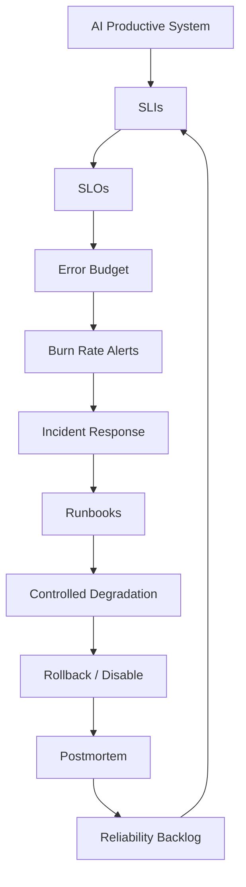
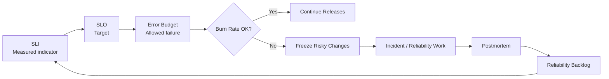
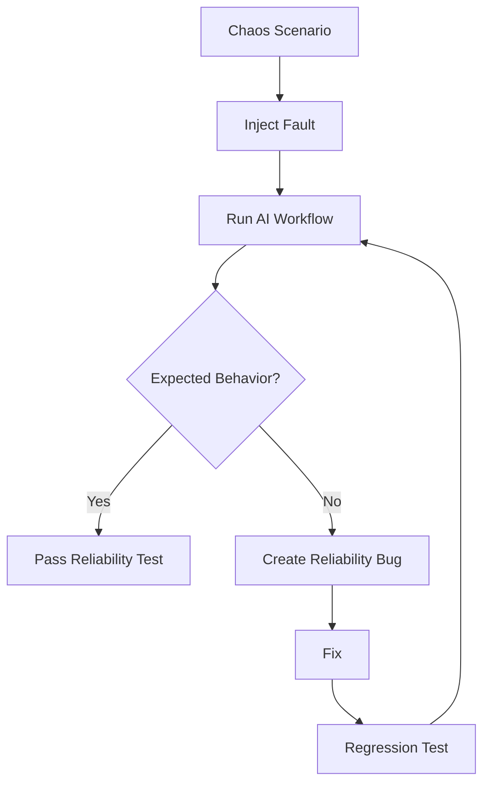
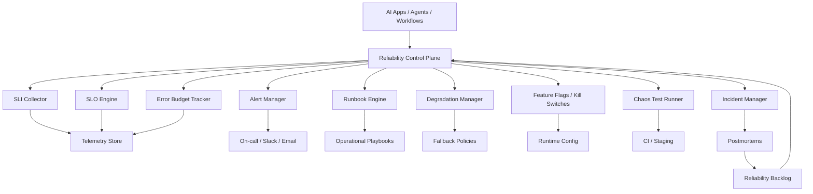
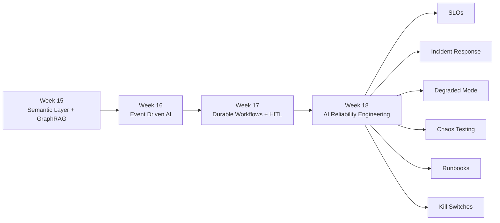

# Semana 18 — AI Reliability Engineering, SLOs, Incident Response y Chaos Testing para Fintech

## Cómo llevar agentes AI, RAG, GraphRAG, workflows durables y automatizaciones fintech a producción con confiabilidad operativa real

La **Semana 18** es el paso natural después de la Semana 17.

En la Semana 17 construiste:

```text
event/request
→ durable workflow
→ persistent state
→ activities
→ policy
→ HITL
→ resume
→ saga
→ compensation
→ outbox
→ audit
→ telemetry
```

Ahora aparece el problema de producción real:

> **No alcanza con que el agente funcione en una demo. Tiene que operar de forma confiable, medible, degradable, auditable y recuperable ante fallas reales.**

Eso es la Semana 18:

# **AI Reliability Engineering + SLOs + Incident Response + Chaos Testing para Fintech**

---

# 1. Tema central de la Semana 18

La Semana 18 enseña a construir una capa de confiabilidad para sistemas AI productivos.

El objetivo es pasar de esto:

```text
“Mi agente responde bien cuando todo anda bien”
```

a esto:

```text
“Mi plataforma AI tiene SLOs, error budgets, alertas accionables, degradación controlada, runbooks, incident response, rollback, chaos testing, postmortems y métricas de calidad AI”
```

Google SRE define los SLOs como objetivos de nivel de servicio medidos por SLIs; además, recomienda no apuntar a 100% de confiabilidad porque eso puede reducir innovación y deployment velocity. En su modelo, el error budget permite decidir objetivamente cuándo seguir desplegando y cuándo frenar cambios. ([Google SRE](https://sre.google/sre-book/service-level-objectives/?utm_source=chatgpt.com "Google SRE - Defining slo: service level objective meaning"))

---

# 2. Por qué esta semana importa en fintech

En fintech, un sistema AI puede fallar de muchas formas.

No todo fallo es un `500`.

Un agente puede:

- responder lento;
- responder sin evidencia;
- usar un dataset incorrecto;
- consultar una tool caída;
- violar una política;
- inventar una relación;
- omitir una alerta;
- crear duplicados;
- escalar demasiados casos;
- no escalar un caso crítico;
- generar costo excesivo;
- degradar experiencia del usuario;
- dejar trazabilidad incompleta;
- continuar un workflow con versiones incompatibles;
- fallar silenciosamente.

En una fintech, eso puede impactar:

```text
fraude
chargebacks
KYC
morosidad
riesgo crediticio
operaciones
compliance
auditoría
experiencia cliente
costos cloud / modelo
```

Por eso, la Semana 18 responde:

> **¿Cómo opero AI como un sistema de producción crítico y no como un experimento?**

---

# 3. Mapa mental de la Semana 18



---

# 4. La idea principal

La frase central de esta semana:

> **Un sistema AI productivo no es confiable porque “el modelo es bueno”. Es confiable porque tiene objetivos medibles, límites de riesgo, fallback, control humano, monitoreo, incident response y mejora continua.**

Esto cambia tu forma de pensar.

Antes:

```text
prompt bueno → respuesta buena
```

Ahora:

```text
SLOs
+ evaluaciones
+ observabilidad
+ guardrails
+ degraded mode
+ incident response
+ rollback
+ postmortem
= AI operable en fintech
```

---

# 5. Qué es AI Reliability Engineering

**AI Reliability Engineering** es aplicar prácticas de confiabilidad, SRE, observabilidad, calidad, seguridad y operación a sistemas basados en IA.

Incluye:

- SLIs;
- SLOs;
- error budgets;
- alertas accionables;
- tracing;
- evals continuas;
- detección de degradación;
- rollback;
- fallback;
- feature flags;
- runbooks;
- incident response;
- chaos testing;
- postmortems;
- reliability backlog.

AWS describe el pilar de confiabilidad del Well-Architected Framework como la capacidad de un workload para cumplir su función prevista y recuperarse rápidamente de fallas para satisfacer demanda. Esa definición aplica muy bien a agentes AI fintech cuando se los trata como workloads productivos. ([Amazon Web Services, Inc.](https://aws.amazon.com/architecture/well-architected/?nc2=h_ql_le_wa%5C\&utm_source=chatgpt.com "AWS Well-Architected - Build secure, efficient cloud applications"))

---

# 6. Diferencia entre observabilidad AI y confiabilidad AI

En semanas anteriores viste observabilidad.

La diferencia es esta:

| ConceptoPregunta que responde |                                                               |
| ----------------------------- | ------------------------------------------------------------- |
| Observabilidad AI             | ¿Qué pasó?                                                    |
| Evaluación AI                 | ¿La respuesta fue buena?                                      |
| Seguridad AI                  | ¿La respuesta fue segura?                                     |
| Gobernanza AI                 | ¿Estaba permitido?                                            |
| Confiabilidad AI              | ¿El sistema puede operar consistentemente bajo fallas reales? |

Ejemplo:

```text
Observabilidad:
La tool de Collibra tardó 4 segundos.

Evaluación:
La respuesta usó evidencia correcta.

Seguridad:
No expuso PII.

Gobernanza:
La acción requería aprobación humana.

Confiabilidad:
El workflow degradó correctamente cuando Collibra falló.
```

---

# 7. Taxonomía de fallas AI en fintech

Antes de definir SLOs, tenés que entender qué puede fallar.

## 7.1 Fallas técnicas

Ejemplos:

```text
model timeout
tool timeout
HTTP 500
Kafka lag
database unavailable
vector DB unavailable
Graph DB unavailable
rate limit
memory pressure
```

## 7.2 Fallas de contexto

Ejemplos:

```text
RAG no encontró documentos
GraphRAG no encontró evidence path
dataset vencido
owner no encontrado
schema obsoleto
semantic layer desactualizada
```

## 7.3 Fallas de calidad AI

Ejemplos:

```text
respuesta sin evidencia
alucinación
respuesta ambigua
JSON inválido
clasificación incorrecta
recomendación débil
confidence mal calibrada
```

## 7.4 Fallas de política

Ejemplos:

```text
acción sensible sin HITL
respuesta con PII
consulta fuera del dominio permitido
tool no autorizada
policy version incompatible
```

## 7.5 Fallas operativas

Ejemplos:

```text
casos duplicados
outbox no publicado
replay con side effects
DLQ creciente
approval queue saturada
workflow stuck
compensation no ejecutada
```

## 7.6 Fallas económicas

Ejemplos:

```text
costo por caso demasiado alto
uso excesivo de modelo caro
retries innecesarios
prompts demasiado largos
cache miss elevado
```

---

# 8. Diagrama de fallas AI

```mermaid
flowchart TD
    A[AI Failure] --> B[Technical Failure]
    A --> C[Context Failure]
    A --> D[Quality Failure]
    A --> E[Policy Failure]
    A --> F[Operational Failure]
    A --> G[Cost Failure]

    B --> B1[Timeouts]
    B --> B2[Tool unavailable]
    B --> B3[Rate limits]

    C --> C1[Missing evidence]
    C --> C2[Stale dataset]
    C --> C3[Broken graph path]

    D --> D1[Hallucination]
    D --> D2[Invalid JSON]
    D --> D3[Bad classification]

    E --> E1[PII leakage]
    E --> E2[Action without approval]
    E --> E3[Unauthorized tool]

    F --> F1[Duplicate case]
    F --> F2[Workflow stuck]
    F --> F3[Compensation missing]

    G --> G1[High token cost]
    G --> G2[Model overuse]
    G --> G3[Retry storm]
```



---

# 9. Concepto 1 — SLI

**SLI** significa **Service Level Indicator**.

Es una métrica que indica cómo se comporta el servicio.

Ejemplos clásicos:

```text
availability
latency
error rate
throughput
```

En AI fintech, también necesitás SLIs específicos de IA.

Ejemplos:

```text
valid_json_rate
grounded_answer_rate
tool_success_rate
policy_violation_rate
human_approval_latency
workflow_completion_rate
hallucination_detected_rate
retrieval_hit_rate
graph_evidence_path_rate
cost_per_case
```

## Regla

> Un SLI debe medir algo que realmente importa para el usuario o para el riesgo operacional.

Malo:

```text
tokens generados por minuto
```

Bueno:

```text
% de respuestas con evidencia válida
```

---

# 10. Concepto 2 — SLO

**SLO** significa **Service Level Objective**.

Es el objetivo que querés cumplir para un SLI.

Ejemplos:

```text
99.5% de workflows AI completan sin error técnico en 30 días
95% de respuestas críticas incluyen evidencia trazable
99% de acciones sensibles requieren HITL
99.9% de outputs estructurados cumplen JSON Schema
p95 latency < 6 segundos para consultas operativas
```

Google SRE recomienda que los SLOs especifiquen cómo se miden y bajo qué condiciones son válidos; también recomienda trabajar desde lo que el usuario necesita hacia los indicadores, no simplemente desde lo que es fácil medir. ([Google SRE](https://sre.google/sre-book/service-level-objectives/?utm_source=chatgpt.com "Google SRE - Defining slo: service level objective meaning"))

---

# 11. Concepto 3 — SLA vs SLO vs SLI

| ConceptoSignificadoEjemplo |                     |                                   |
| -------------------------- | ------------------- | --------------------------------- |
| SLI                        | Indicador medido    | `grounded_answer_rate = 96.2%`    |
| SLO                        | Objetivo interno    | `grounded_answer_rate >= 95%`     |
| SLA                        | Acuerdo contractual | penalidad si el servicio incumple |

En tu caso, para una plataforma interna como NX Pulse IA, al principio necesitás principalmente:

```text
SLIs + SLOs + error budgets
```

No necesariamente SLA contractual.

---

# 12. Concepto 4 — Error budget

El **error budget** es el margen permitido para fallar.

Si tu SLO es:

```text
99% de workflows completados correctamente
```

tu error budget es:

```text
1% de workflows pueden fallar
```

Google SRE describe el error budget como `1 - SLO`; por ejemplo, un objetivo de disponibilidad de 99.99% deja un presupuesto de 0.01% para indisponibilidad. Si el presupuesto se consume, el equipo puede frenar cambios salvo fixes urgentes o de seguridad. ([Google SRE](https://sre.google/sre-book/service-best-practices/?utm_source=chatgpt.com "Google SRE: Production Services Best Practices"))

## Ejemplo fintech

```text
SLO:
99% de workflows chargeback completan correctamente en 30 días.

Volumen:
10.000 workflows mensuales.

Error budget:
1% = 100 workflows fallidos permitidos por mes.
```

Si al día 10 ya fallaron 90, estás quemando el presupuesto demasiado rápido.

---

# 13. Concepto 5 — Burn rate

**Burn rate** es la velocidad a la que consumís el error budget.

Ejemplo:

```text
Error budget mensual: 100 fallas
Fallas hasta día 5: 80
```

Tu burn rate es peligroso.

No esperás al día 30 para enterarte.

Necesitás alertas.

Google SRE Workbook recomienda alertar sobre SLOs usando técnicas de burn rate; en particular, considera que la técnica multi-window multi-burn-rate suele ser apropiada para defender SLOs de aplicaciones. ([Google SRE](https://sre.google/workbook/alerting-on-slos/?hl=es-PY\&utm_source=chatgpt.com "Google SRE - Prometheus Alerting: Turn SLOs into Alerts"))

---

# 14. Concepto 6 — AI SLOs

Acá está el salto importante.

Un sistema AI no solo necesita SLOs técnicos.

Necesita SLOs de:

```text
disponibilidad
latencia
calidad
grounding
seguridad
gobernanza
workflow
costo
operación
```

## Ejemplos de SLOs para NX Pulse IA

| ÁreaSLO           |                                                                    |
| ----------------- | ------------------------------------------------------------------ |
| Disponibilidad    | 99.5% de requests `/solve-chargebacks` responden sin error técnico |
| Latencia          | p95 menor a 8 segundos                                             |
| Grounding         | 95% de respuestas críticas tienen evidence path                    |
| Structured output | 99% cumple JSON Schema                                             |
| Seguridad         | 0 respuestas con PII no autorizada                                 |
| HITL              | 100% de acciones sensibles requieren aprobación                    |
| Workflow          | 98% de workflows completan o quedan pausados correctamente         |
| Costo             | p95 costo por caso menor a USD 0.25                                |
| GraphRAG          | 95% de diagnósticos críticos usan al menos 2 fuentes               |
| Auditoría         | 100% de decisiones generan audit record                            |

---

# 15. Diagrama SLI → SLO → Error Budget → Incident



---

# 16. Concepto 7 — Degraded mode

**Degraded mode** significa que el sistema sigue funcionando con capacidades reducidas cuando algo falla.

Ejemplos:

| FallaDegradación correcta |                                                  |
| ------------------------- | ------------------------------------------------ |
| Vector DB caída           | usar búsqueda keyword/catálogo                   |
| Graph DB caída            | responder con evidencia documental solamente     |
| Modelo premium saturado   | usar modelo fallback más barato/lento            |
| Tool de Datadog caída     | omitir métricas y marcar evidencia incompleta    |
| Collibra caída            | usar cache de metadata certificada               |
| Slack caído               | dejar aprobación pendiente y notificar por email |
| Policy engine caído       | bloquear acciones sensibles por default          |

## Regla fintech

> Cuando falla una dependencia, el sistema debe reducir capacidad, no inventar certeza.

Malo:

```text
No encontré Collibra, pero igual afirmo owner y dataset.
```

Bueno:

```text
Collibra no disponible. Diagnóstico parcial. No ejecuto acción sensible.
```

---

# 17. Concepto 8 — Fail open vs fail closed

Cuando una dependencia falla, podés elegir:

```text
fail open = permitir
fail closed = bloquear
```

En fintech, para acciones sensibles, casi siempre:

```text
fail closed
```

Ejemplos:

| CasoEstrategia               |                             |
| ---------------------------- | --------------------------- |
| Generar resumen informativo  | fail open con advertencia   |
| Consultar estado no crítico  | fail open parcial           |
| Crear caso draft             | fail closed si falta policy |
| Bloquear tarjeta             | fail closed                 |
| Cambiar límite               | fail closed                 |
| Enviar comunicación sensible | fail closed                 |
| Marcar fraude confirmado     | fail closed                 |

---

# 18. Concepto 9 — Circuit breaker

Un **circuit breaker** corta temporalmente llamadas a una dependencia que está fallando.

Ejemplo:

```text
Graph DB falla 5 veces seguidas
→ abrir circuito
→ dejar de llamarla 60 segundos
→ usar fallback
→ probar recuperación
```

Estados:

```text
CLOSED = funciona normal
OPEN = no llamo dependencia
HALF_OPEN = pruebo una llamada
```

Esto evita:

- retry storms;
- saturar dependencias;
- aumentar latencia;
- gastar tokens innecesarios;
- empeorar incidentes.

---

# 19. Concepto 10 — Bulkhead

**Bulkhead** significa aislar recursos para que una falla no hunda todo.

Ejemplo:

```text
pool separado para chargebacks
pool separado para KYC
pool separado para morosidad
```

Si KYC se dispara, no debería tumbar chargebacks.

En AI:

```text
concurrency limit por dominio
rate limit por tool
token budget por workflow
cola separada por criticidad
```

---

# 20. Concepto 11 — Retry policy

No todos los errores deben reintentarse.

## Reintentar

```text
timeout temporal
HTTP 503
rate limit con backoff
connection reset
```

## No reintentar

```text
schema inválido
policy denied
PII violation
acción no autorizada
input malformado
```

Regla:

```text
retry solo para errores transitorios
```

---

# 21. Concepto 12 — Timeout budget

Cada request tiene un presupuesto de tiempo.

Ejemplo:

```text
SLO p95 = 8 segundos
```

Distribución:

```text
auth: 200 ms
policy: 300 ms
retrieval: 1500 ms
graph: 1200 ms
model: 3500 ms
format validation: 300 ms
buffer: 1000 ms
```

Si una tool consume todo el presupuesto, el agente debe degradar.

---

# 22. Concepto 13 — Runbook

Un **runbook** es una guía operativa para responder incidentes.

Debe decir:

- qué significa la alerta;
- cómo confirmar el problema;
- impacto probable;
- dashboards;
- queries;
- acciones seguras;
- acciones prohibidas;
- rollback;
- escalamiento;
- comunicación;
- cierre.

Ejemplo:

```text
Alerta:
grounded_answer_rate < 90%

Acciones:
1. Verificar si vector DB está caída.
2. Revisar retrieval_hit_rate.
3. Revisar deploy reciente de indexer.
4. Activar degraded mode documental.
5. Bloquear acciones sensibles.
6. Abrir incidente si afecta chargebacks críticos.
```

---

# 23. Concepto 14 — Incident response

El proceso base:

```text
Detectar
→ Triage
→ Asignar severidad
→ Contener
→ Mitigar
→ Recuperar
→ Comunicar
→ Postmortem
→ Backlog de confiabilidad
```

## Severidades fintech

| SeveridadDefinición |                                                                          |
| ------------------- | ------------------------------------------------------------------------ |
| SEV0                | Riesgo regulatorio, PII, fraude mal manejado, acción sensible incorrecta |
| SEV1                | Servicio crítico AI indisponible o respuestas críticas incorrectas       |
| SEV2                | Degradación parcial con workaround                                       |
| SEV3                | Problema menor sin impacto operativo                                     |
| SEV4                | Bug cosmético o documentación                                            |

---

# 24. Concepto 15 — Postmortem sin culpa

Un postmortem no busca culpables.

Busca:

- qué pasó;
- cuándo pasó;
- impacto;
- detección;
- causa raíz;
- factores contribuyentes;
- qué funcionó;
- qué falló;
- acciones preventivas;
- owners;
- fechas.

Ejemplo de acción mala:

```text
tener más cuidado
```

Ejemplo de acción buena:

```text
Agregar test de contract para policyVersion incompatible antes del 2026-08-20.
Owner: AI Platform.
```

---

# 25. Concepto 16 — Chaos testing para AI

**Chaos testing** consiste en inyectar fallas controladas para validar resiliencia.

En AI fintech, podés simular:

```text
modelo lento
modelo devuelve JSON inválido
vector DB caída
Graph DB caída
policy engine caída
tool timeout
dataset stale
approval queue saturada
outbox publish fail
DLQ creciente
costo por request alto
```

No se hace en producción sin control.

Se empieza en:

```text
local
dev
staging
shadow mode
canary controlado
```

---

# 26. Diagrama de chaos testing AI



---

# 27. Concepto 17 — Reliability gates en CI/CD

Antes de desplegar, deberías correr:

```text
unit tests
integration tests
contract tests
eval golden set
security checks
policy checks
chaos scenarios
cost checks
latency budget checks
schema validation
```

El deploy debería bloquearse si:

```text
eval score cae demasiado
JSON validity baja
policy tests fallan
latency p95 supera presupuesto
costo estimado supera umbral
chaos critical scenario falla
```

---

# 28. Concepto 18 — Feature flags y kill switches

En AI productivo necesitás poder apagar funcionalidades.

Ejemplos:

```text
disable_auto_case_creation
disable_graph_rag
force_human_review
disable_premium_model
use_safe_template_only
block_sensitive_actions
```

## Kill switch

Un kill switch es una bandera fuerte para cortar una capacidad riesgosa.

Ejemplo:

```text
ai_sensitive_actions_enabled = false
```

Esto debería poder activarse rápido durante un incidente.

---

# 29. Concepto 19 — Release strategy para AI

No despliegues AI crítico de una sola vez.

Estrategias:

```text
shadow mode
internal beta
canary 1%
canary 10%
progressive rollout
domain-specific rollout
rollback automático
```

## Ejemplo fintech

```text
/solve-chargebacks
→ shadow mode con casos históricos
→ 5 analistas internos
→ 10% de comercios amigos
→ solo canal billetera e-commerce
→ solo lectura
→ case draft con aprobación
→ expansión gradual
```

---

# 30. Concepto 20 — Reliability backlog

Cada incidente, test fallido o SLO quemado debe generar backlog.

Ejemplos:

```text
Agregar fallback documental cuando Graph DB no responde.
Agregar alert de workflow_stuck_count.
Reducir timeout de Collibra tool.
Cachear dataset owner certificado.
Separar pool de chargebacks y KYC.
Agregar replay test sin side effects.
```

---

# 31. Arquitectura objetivo Semana 18



---

# 32. Arquitectura integrada con Semanas 15, 16 y 17



---

# 33. Caso integral fintech de la semana

Vamos a trabajar con:

# `ai-reliability-control-plane`

Para el caso:

```text
/solve-chargebacks
```

El sistema debe monitorear:

```text
availability
latency
groundedness
JSON validity
tool success
policy violations
workflow stuck
HITL latency
cost per case
```

Y debe poder:

```text
calcular SLOs
calcular error budget
detectar burn rate
generar alertas
recomendar runbook
activar degraded mode
correr chaos tests
emitir incident report
```

---

# 34. Código — estructura del proyecto

Repo ideal:

```text
week18-ai-reliability-engineering-fintech/
├─ README.md
├─ README.es.md
├─ README.en.md
├─ docs/
│  ├─ es/
│  └─ en/
├─ assets/
│  ├─ es/
│  └─ en/
├─ data/
│  ├─ sli_events.json
│  ├─ slo_definitions.json
│  ├─ incident_scenarios.json
│  ├─ chaos_scenarios.json
│  ├─ runbooks.json
│  └─ feature_flags.json
├─ src/
│  ├─ types.ts
│  ├─ sliCollector.ts
│  ├─ sloEngine.ts
│  ├─ errorBudget.ts
│  ├─ burnRate.ts
│  ├─ alertManager.ts
│  ├─ runbookEngine.ts
│  ├─ degradationManager.ts
│  ├─ featureFlags.ts
│  ├─ circuitBreaker.ts
│  ├─ chaosRunner.ts
│  ├─ incidentManager.ts
│  ├─ telemetry.ts
│  ├─ httpServer.ts
│  └─ main.ts
├─ tests/
│  ├─ sloEngine.test.ts
│  ├─ errorBudget.test.ts
│  ├─ burnRate.test.ts
│  ├─ degradationManager.test.ts
│  ├─ featureFlags.test.ts
│  ├─ circuitBreaker.test.ts
│  ├─ chaosRunner.test.ts
│  └─ incidentManager.test.ts
└─ .github/
   └─ workflows/
      └─ ci.yml
```

---

# 35. Código — tipos base

## `src/types.ts`

```ts
export type SliName =
  | "availability"
  | "latency_p95_ms"
  | "grounded_answer_rate"
  | "valid_json_rate"
  | "tool_success_rate"
  | "policy_violation_rate"
  | "workflow_completion_rate"
  | "workflow_stuck_rate"
  | "human_approval_latency_p95_ms"
  | "cost_per_case_p95_usd";

export type Severity = "SEV0" | "SEV1" | "SEV2" | "SEV3" | "SEV4";

export type IncidentStatus =
  | "OPEN"
  | "MITIGATING"
  | "RESOLVED"
  | "POSTMORTEM_REQUIRED"
  | "CLOSED";

export type Dependency =
  | "model"
  | "vector_db"
  | "graph_db"
  | "policy_engine"
  | "collibra"
  | "datadog"
  | "approval_queue"
  | "outbox";

export interface SliEvent {
  id: string;
  timestamp: string;
  service: string;
  workflowType: string;
  sli: SliName;
  good: boolean;
  value: number;
  unit: "boolean" | "ms" | "rate" | "usd";
  labels: Record<string, string>;
}

export interface SloDefinition {
  id: string;
  service: string;
  sli: SliName;
  objective: number;
  windowDays: number;
  comparison: "gte" | "lte";
  description: string;
  severityOnBreach: Severity;
}

export interface SloEvaluation {
  sloId: string;
  service: string;
  sli: SliName;
  objective: number;
  actual: number;
  compliant: boolean;
  totalEvents: number;
  badEvents: number;
  errorBudgetTotal: number;
  errorBudgetConsumed: number;
  errorBudgetRemaining: number;
}

export interface BurnRateEvaluation {
  sloId: string;
  burnRate: number;
  alert: boolean;
  reason: string;
}

export interface Alert {
  alertId: string;
  sloId: string;
  severity: Severity;
  title: string;
  description: string;
  runbookId: string;
  createdAt: string;
}

export interface Runbook {
  id: string;
  title: string;
  appliesTo: SliName | "general";
  steps: string[];
  safeActions: string[];
  forbiddenActions: string[];
  escalation: string[];
}

export interface FeatureFlags {
  enableGraphRag: boolean;
  enablePremiumModel: boolean;
  enableAutoCaseDraft: boolean;
  forceHumanReview: boolean;
  blockSensitiveActions: boolean;
}

export interface DegradationDecision {
  mode:
    | "normal"
    | "document_only"
    | "safe_template_only"
    | "human_review_only"
    | "read_only"
    | "disabled";
  reason: string;
  flags: FeatureFlags;
}

export interface ChaosScenario {
  id: string;
  name: string;
  dependency: Dependency;
  fault: "timeout" | "unavailable" | "invalid_json" | "stale_data" | "high_latency";
  expectedMode: DegradationDecision["mode"];
  severityIfFails: Severity;
}

export interface ChaosResult {
  scenarioId: string;
  passed: boolean;
  expectedMode: DegradationDecision["mode"];
  actualMode: DegradationDecision["mode"];
  details: string[];
}

export interface Incident {
  incidentId: string;
  title: string;
  severity: Severity;
  status: IncidentStatus;
  openedAt: string;
  resolvedAt?: string;
  alerts: Alert[];
  timeline: string[];
  runbookId: string;
}
```

---

# 36. Código — SLO engine

## `src/sloEngine.ts`

```ts
import type { SliEvent, SloDefinition, SloEvaluation } from "./types.ts";

export function evaluateSlo(
  definition: SloDefinition,
  events: SliEvent[]
): SloEvaluation {
  const relevant = events.filter(
    (event) =>
      event.service === definition.service && event.sli === definition.sli
  );

  if (relevant.length === 0) {
    return {
      sloId: definition.id,
      service: definition.service,
      sli: definition.sli,
      objective: definition.objective,
      actual: 0,
      compliant: false,
      totalEvents: 0,
      badEvents: 0,
      errorBudgetTotal: 0,
      errorBudgetConsumed: 0,
      errorBudgetRemaining: 0
    };
  }

  const actual =
    definition.comparison === "gte"
      ? relevant.filter((event) => event.good).length / relevant.length
      : percentile(relevant.map((event) => event.value), 95);

  const compliant =
    definition.comparison === "gte"
      ? actual >= definition.objective
      : actual <= definition.objective;

  const badEvents =
    definition.comparison === "gte"
      ? relevant.filter((event) => !event.good).length
      : relevant.filter((event) => event.value > definition.objective).length;

  const errorBudgetTotal =
    definition.comparison === "gte"
      ? Math.max(0, relevant.length * (1 - definition.objective))
      : Math.max(1, relevant.length * 0.01);

  const errorBudgetConsumed = badEvents;
  const errorBudgetRemaining = Math.max(
    0,
    errorBudgetTotal - errorBudgetConsumed
  );

  return {
    sloId: definition.id,
    service: definition.service,
    sli: definition.sli,
    objective: definition.objective,
    actual: round(actual),
    compliant,
    totalEvents: relevant.length,
    badEvents,
    errorBudgetTotal: round(errorBudgetTotal),
    errorBudgetConsumed,
    errorBudgetRemaining: round(errorBudgetRemaining)
  };
}

function percentile(values: number[], p: number): number {
  const sorted = [...values].sort((a, b) => a - b);
  const index = Math.ceil((p / 100) * sorted.length) - 1;
  return sorted[Math.max(0, Math.min(index, sorted.length - 1))];
}

function round(value: number): number {
  return Number(value.toFixed(4));
}
```

---

# 37. Código — burn rate

## `src/burnRate.ts`

```ts
import type { BurnRateEvaluation, SloEvaluation } from "./types.ts";

export function evaluateBurnRate(input: {
  evaluation: SloEvaluation;
  elapsedWindowRatio: number;
  threshold: number;
}): BurnRateEvaluation {
  const budget = input.evaluation.errorBudgetTotal;

  if (budget === 0) {
    return {
      sloId: input.evaluation.sloId,
      burnRate: 0,
      alert: true,
      reason: "no_error_budget_available"
    };
  }

  const expectedConsumption = budget * input.elapsedWindowRatio;

  const burnRate =
    expectedConsumption === 0
      ? 0
      : input.evaluation.errorBudgetConsumed / expectedConsumption;

  return {
    sloId: input.evaluation.sloId,
    burnRate: Number(burnRate.toFixed(2)),
    alert: burnRate >= input.threshold,
    reason:
      burnRate >= input.threshold
        ? "error_budget_burning_too_fast"
        : "burn_rate_within_expected_range"
  };
}
```

---

# 38. Código — alert manager

## `src/alertManager.ts`

```ts
import { randomUUID } from "node:crypto";
import type {
  Alert,
  BurnRateEvaluation,
  Runbook,
  SloDefinition
} from "./types.ts";

export function createAlertIfNeeded(input: {
  slo: SloDefinition;
  burn: BurnRateEvaluation;
  runbooks: Runbook[];
}): Alert | undefined {
  if (!input.burn.alert) {
    return undefined;
  }

  const runbook =
    input.runbooks.find((item) => item.appliesTo === input.slo.sli) ??
    input.runbooks.find((item) => item.appliesTo === "general");

  return {
    alertId: randomUUID(),
    sloId: input.slo.id,
    severity: input.slo.severityOnBreach,
    title: `SLO burn alert: ${input.slo.sli}`,
    description: `${input.burn.reason}. Burn rate=${input.burn.burnRate}`,
    runbookId: runbook?.id ?? "runbook_general_ai_incident",
    createdAt: new Date().toISOString()
  };
}
```

---

# 39. Código — feature flags

## `src/featureFlags.ts`

```ts
import type { FeatureFlags } from "./types.ts";

export const defaultFlags: FeatureFlags = {
  enableGraphRag: true,
  enablePremiumModel: true,
  enableAutoCaseDraft: true,
  forceHumanReview: false,
  blockSensitiveActions: false
};

export class FeatureFlagStore {
  private flags: FeatureFlags;

  constructor(initial: FeatureFlags = defaultFlags) {
    this.flags = structuredClone(initial);
  }

  get(): FeatureFlags {
    return structuredClone(this.flags);
  }

  update(patch: Partial<FeatureFlags>): FeatureFlags {
    this.flags = {
      ...this.flags,
      ...patch
    };

    return this.get();
  }

  killSensitiveActions(): FeatureFlags {
    return this.update({
      enableAutoCaseDraft: false,
      forceHumanReview: true,
      blockSensitiveActions: true
    });
  }

  disableGraphRag(): FeatureFlags {
    return this.update({
      enableGraphRag: false
    });
  }

  forceSafeTemplateOnly(): FeatureFlags {
    return this.update({
      enableGraphRag: false,
      enablePremiumModel: false,
      enableAutoCaseDraft: false,
      forceHumanReview: true,
      blockSensitiveActions: true
    });
  }
}
```

---

# 40. Código — degradation manager

## `src/degradationManager.ts`

```ts
import type {
  DegradationDecision,
  Dependency,
  FeatureFlags
} from "./types.ts";

export function decideDegradation(input: {
  dependency: Dependency;
  fault: string;
  flags: FeatureFlags;
}): DegradationDecision {
  if (input.dependency === "policy_engine") {
    return {
      mode: "human_review_only",
      reason: "policy_engine_unavailable_fail_closed",
      flags: {
        ...input.flags,
        enableAutoCaseDraft: false,
        forceHumanReview: true,
        blockSensitiveActions: true
      }
    };
  }

  if (input.dependency === "graph_db") {
    return {
      mode: "document_only",
      reason: "graph_db_unavailable_use_documentary_evidence_only",
      flags: {
        ...input.flags,
        enableGraphRag: false,
        forceHumanReview: true
      }
    };
  }

  if (input.dependency === "model") {
    return {
      mode: "safe_template_only",
      reason: "model_unavailable_use_safe_template",
      flags: {
        ...input.flags,
        enablePremiumModel: false,
        enableAutoCaseDraft: false,
        forceHumanReview: true
      }
    };
  }

  if (input.dependency === "outbox") {
    return {
      mode: "read_only",
      reason: "outbox_unavailable_prevent_side_effects",
      flags: {
        ...input.flags,
        enableAutoCaseDraft: false,
        blockSensitiveActions: true
      }
    };
  }

  return {
    mode: "normal",
    reason: "no_degradation_required",
    flags: input.flags
  };
}
```

---

# 41. Código — circuit breaker

## `src/circuitBreaker.ts`

```ts
export type CircuitState = "CLOSED" | "OPEN" | "HALF_OPEN";

export class CircuitBreaker {
  private failures = 0;
  private stateValue: CircuitState = "CLOSED";
  private openedAt = 0;

  constructor(
    private readonly failureThreshold: number,
    private readonly openMs: number
  ) {}

  canCall(nowMs: number): boolean {
    if (this.stateValue === "CLOSED") {
      return true;
    }

    if (this.stateValue === "OPEN" && nowMs - this.openedAt >= this.openMs) {
      this.stateValue = "HALF_OPEN";
      return true;
    }

    return this.stateValue === "HALF_OPEN";
  }

  recordSuccess(): void {
    this.failures = 0;
    this.stateValue = "CLOSED";
  }

  recordFailure(nowMs: number): void {
    this.failures += 1;

    if (this.failures >= this.failureThreshold) {
      this.stateValue = "OPEN";
      this.openedAt = nowMs;
    }
  }

  state(): CircuitState {
    return this.stateValue;
  }

  failureCount(): number {
    return this.failures;
  }
}
```

---

# 42. Código — runbook engine

## `src/runbookEngine.ts`

```ts
import type { Alert, Runbook } from "./types.ts";

export function findRunbookForAlert(
  alert: Alert,
  runbooks: Runbook[]
): Runbook {
  const runbook = runbooks.find((item) => item.id === alert.runbookId);

  if (!runbook) {
    const fallback = runbooks.find((item) => item.appliesTo === "general");
    if (!fallback) {
      throw new Error("runbook_not_found_and_no_general_fallback");
    }
    return fallback;
  }

  return runbook;
}
```

---

# 43. Código — chaos runner

## `src/chaosRunner.ts`

```ts
import type {
  ChaosResult,
  ChaosScenario,
  FeatureFlags
} from "./types.ts";
import { decideDegradation } from "./degradationManager.ts";

export function runChaosScenario(input: {
  scenario: ChaosScenario;
  flags: FeatureFlags;
}): ChaosResult {
  const decision = decideDegradation({
    dependency: input.scenario.dependency,
    fault: input.scenario.fault,
    flags: input.flags
  });

  const passed = decision.mode === input.scenario.expectedMode;

  return {
    scenarioId: input.scenario.id,
    passed,
    expectedMode: input.scenario.expectedMode,
    actualMode: decision.mode,
    details: [
      `dependency:${input.scenario.dependency}`,
      `fault:${input.scenario.fault}`,
      `decision:${decision.reason}`
    ]
  };
}
```

---

# 44. Código — incident manager

## `src/incidentManager.ts`

```ts
import { randomUUID } from "node:crypto";
import type { Alert, Incident, IncidentStatus, Severity } from "./types.ts";

export class IncidentManager {
  private readonly incidents = new Map<string, Incident>();

  open(input: {
    title: string;
    severity: Severity;
    alert: Alert;
    runbookId: string;
  }): Incident {
    const incident: Incident = {
      incidentId: randomUUID(),
      title: input.title,
      severity: input.severity,
      status: "OPEN",
      openedAt: new Date().toISOString(),
      alerts: [input.alert],
      runbookId: input.runbookId,
      timeline: [
        `opened:${input.alert.alertId}`,
        `severity:${input.severity}`
      ]
    };

    this.incidents.set(incident.incidentId, incident);
    return structuredClone(incident);
  }

  transition(
    incidentId: string,
    status: IncidentStatus,
    note: string
  ): Incident {
    const incident = this.incidents.get(incidentId);

    if (!incident) {
      throw new Error(`incident_not_found:${incidentId}`);
    }

    incident.status = status;
    incident.timeline.push(`${status}:${note}`);

    if (status === "RESOLVED") {
      incident.resolvedAt = new Date().toISOString();
    }

    return structuredClone(incident);
  }

  all(): Incident[] {
    return [...this.incidents.values()].map((incident) =>
      structuredClone(incident)
    );
  }
}
```

---

# 45. Código — main demo

## `src/main.ts`

```ts
import fs from "node:fs";
import type {
  ChaosScenario,
  Runbook,
  SliEvent,
  SloDefinition
} from "./types.ts";
import { evaluateSlo } from "./sloEngine.ts";
import { evaluateBurnRate } from "./burnRate.ts";
import { createAlertIfNeeded } from "./alertManager.ts";
import { defaultFlags, FeatureFlagStore } from "./featureFlags.ts";
import { runChaosScenario } from "./chaosRunner.ts";
import { IncidentManager } from "./incidentManager.ts";
import { findRunbookForAlert } from "./runbookEngine.ts";

const events: SliEvent[] = [
  ...rateEvents("ai-chargebacks", "grounded_answer_rate", 92, 100),
  ...rateEvents("ai-chargebacks", "valid_json_rate", 99, 100),
  ...latencyEvents("ai-chargebacks", "latency_p95_ms", [
    4000, 4200, 5000, 6200, 9000, 8700, 8300, 8100, 7800, 7600
  ])
];

const slos: SloDefinition[] = [
  {
    id: "slo_grounded_95",
    service: "ai-chargebacks",
    sli: "grounded_answer_rate",
    objective: 0.95,
    windowDays: 30,
    comparison: "gte",
    description: "95% of critical answers must include evidence paths",
    severityOnBreach: "SEV1"
  },
  {
    id: "slo_json_99",
    service: "ai-chargebacks",
    sli: "valid_json_rate",
    objective: 0.99,
    windowDays: 30,
    comparison: "gte",
    description: "99% of structured outputs must pass schema validation",
    severityOnBreach: "SEV2"
  },
  {
    id: "slo_latency_8000",
    service: "ai-chargebacks",
    sli: "latency_p95_ms",
    objective: 8000,
    windowDays: 30,
    comparison: "lte",
    description: "p95 latency must be below 8 seconds",
    severityOnBreach: "SEV2"
  }
];

const runbooks: Runbook[] = [
  {
    id: "runbook_grounding_drop",
    title: "Grounded answer rate drop",
    appliesTo: "grounded_answer_rate",
    steps: [
      "Check retrieval_hit_rate",
      "Check graph_db availability",
      "Check recent indexer deployments",
      "Enable document_only degraded mode",
      "Force human review for sensitive actions"
    ],
    safeActions: [
      "disable GraphRAG temporarily",
      "use certified documentary evidence only",
      "freeze sensitive automated actions"
    ],
    forbiddenActions: [
      "do not invent missing evidence",
      "do not create cases automatically without policy"
    ],
    escalation: ["AI Platform", "Data Governance", "Risk Ops"]
  },
  {
    id: "runbook_general_ai_incident",
    title: "General AI incident",
    appliesTo: "general",
    steps: [
      "Confirm alert",
      "Assess blast radius",
      "Enable safe mode",
      "Notify owner",
      "Open incident"
    ],
    safeActions: ["read_only mode", "force human review"],
    forbiddenActions: ["do not run replay with side effects"],
    escalation: ["AI Platform"]
  }
];

const chaosScenarios: ChaosScenario[] = [
  {
    id: "chaos_graph_down",
    name: "Graph DB unavailable",
    dependency: "graph_db",
    fault: "unavailable",
    expectedMode: "document_only",
    severityIfFails: "SEV1"
  },
  {
    id: "chaos_policy_down",
    name: "Policy engine unavailable",
    dependency: "policy_engine",
    fault: "timeout",
    expectedMode: "human_review_only",
    severityIfFails: "SEV0"
  },
  {
    id: "chaos_model_down",
    name: "Model unavailable",
    dependency: "model",
    fault: "unavailable",
    expectedMode: "safe_template_only",
    severityIfFails: "SEV1"
  }
];

const evaluations = slos.map((slo) => evaluateSlo(slo, events));

const burns = evaluations.map((evaluation) =>
  evaluateBurnRate({
    evaluation,
    elapsedWindowRatio: 0.33,
    threshold: 2
  })
);

const alerts = burns
  .map((burn) => {
    const slo = slos.find((item) => item.id === burn.sloId);
    if (!slo) return undefined;
    return createAlertIfNeeded({ slo, burn, runbooks });
  })
  .filter((alert) => alert !== undefined);

const flags = new FeatureFlagStore(defaultFlags);
const chaosResults = chaosScenarios.map((scenario) =>
  runChaosScenario({ scenario, flags: flags.get() })
);

const incidentManager = new IncidentManager();

for (const alert of alerts) {
  const runbook = findRunbookForAlert(alert, runbooks);
  incidentManager.open({
    title: alert.title,
    severity: alert.severity,
    alert,
    runbookId: runbook.id
  });
}

const output = {
  evaluations,
  burnRates: burns,
  alerts,
  chaosResults,
  incidents: incidentManager.all()
};

console.log(JSON.stringify(output, null, 2));

fs.writeFileSync(
  "week18_ai_reliability_results.json",
  JSON.stringify(output, null, 2)
);

function rateEvents(
  service: string,
  sli: SliEvent["sli"],
  good: number,
  total: number
): SliEvent[] {
  return Array.from({ length: total }, (_, index) => ({
    id: `${sli}_${index}`,
    timestamp: new Date().toISOString(),
    service,
    workflowType: "chargeback_investigation",
    sli,
    good: index < good,
    value: index < good ? 1 : 0,
    unit: "rate",
    labels: {
      domain: "payments"
    }
  }));
}

function latencyEvents(
  service: string,
  sli: SliEvent["sli"],
  values: number[]
): SliEvent[] {
  return values.map((value, index) => ({
    id: `${sli}_${index}`,
    timestamp: new Date().toISOString(),
    service,
    workflowType: "chargeback_investigation",
    sli,
    good: value <= 8000,
    value,
    unit: "ms",
    labels: {
      domain: "payments"
    }
  }));
}
```

---

# 46. Resultado esperado de la demo

La demo debe mostrar:

```json
{
  "evaluations": [
    {
      "sloId": "slo_grounded_95",
      "actual": 0.92,
      "compliant": false
    }
  ],
  "alerts": [
    {
      "title": "SLO burn alert: grounded_answer_rate",
      "severity": "SEV1"
    }
  ],
  "chaosResults": [
    {
      "scenarioId": "chaos_graph_down",
      "passed": true,
      "expectedMode": "document_only",
      "actualMode": "document_only"
    }
  ]
}
```

---

# 47. Tests recomendados

## Test 1 — SLO de rate

```ts
import test from "node:test";
import assert from "node:assert/strict";
import { evaluateSlo } from "../src/sloEngine.ts";
import type { SliEvent, SloDefinition } from "../src/types.ts";

test("evaluates grounded answer SLO", () => {
  const events: SliEvent[] = Array.from({ length: 100 }, (_, index) => ({
    id: `evt_${index}`,
    timestamp: new Date().toISOString(),
    service: "ai-chargebacks",
    workflowType: "chargeback",
    sli: "grounded_answer_rate",
    good: index < 96,
    value: index < 96 ? 1 : 0,
    unit: "rate",
    labels: {}
  }));

  const slo: SloDefinition = {
    id: "slo_grounded",
    service: "ai-chargebacks",
    sli: "grounded_answer_rate",
    objective: 0.95,
    windowDays: 30,
    comparison: "gte",
    description: "grounded answer rate",
    severityOnBreach: "SEV1"
  };

  const result = evaluateSlo(slo, events);

  assert.equal(result.actual, 0.96);
  assert.equal(result.compliant, true);
});
```

---

## Test 2 — Error budget consumido

```ts
import test from "node:test";
import assert from "node:assert/strict";
import { evaluateSlo } from "../src/sloEngine.ts";
import type { SliEvent, SloDefinition } from "../src/types.ts";

test("calculates consumed error budget", () => {
  const events: SliEvent[] = Array.from({ length: 100 }, (_, index) => ({
    id: `evt_${index}`,
    timestamp: new Date().toISOString(),
    service: "ai-chargebacks",
    workflowType: "chargeback",
    sli: "valid_json_rate",
    good: index < 97,
    value: index < 97 ? 1 : 0,
    unit: "rate",
    labels: {}
  }));

  const slo: SloDefinition = {
    id: "slo_json",
    service: "ai-chargebacks",
    sli: "valid_json_rate",
    objective: 0.99,
    windowDays: 30,
    comparison: "gte",
    description: "valid JSON rate",
    severityOnBreach: "SEV2"
  };

  const result = evaluateSlo(slo, events);

  assert.equal(result.badEvents, 3);
  assert.equal(result.compliant, false);
});
```

---

## Test 3 — Burn rate alerta

```ts
import test from "node:test";
import assert from "node:assert/strict";
import { evaluateBurnRate } from "../src/burnRate.ts";

test("alerts when burn rate is too high", () => {
  const burn = evaluateBurnRate({
    evaluation: {
      sloId: "slo_1",
      service: "ai-chargebacks",
      sli: "grounded_answer_rate",
      objective: 0.95,
      actual: 0.9,
      compliant: false,
      totalEvents: 100,
      badEvents: 10,
      errorBudgetTotal: 5,
      errorBudgetConsumed: 10,
      errorBudgetRemaining: 0
    },
    elapsedWindowRatio: 0.25,
    threshold: 2
  });

  assert.equal(burn.alert, true);
});
```

---

## Test 4 — Degradación Graph DB

```ts
import test from "node:test";
import assert from "node:assert/strict";
import { decideDegradation } from "../src/degradationManager.ts";
import { defaultFlags } from "../src/featureFlags.ts";

test("degrades to document only when graph DB is unavailable", () => {
  const decision = decideDegradation({
    dependency: "graph_db",
    fault: "unavailable",
    flags: defaultFlags
  });

  assert.equal(decision.mode, "document_only");
  assert.equal(decision.flags.enableGraphRag, false);
});
```

---

## Test 5 — Policy engine fail closed

```ts
import test from "node:test";
import assert from "node:assert/strict";
import { decideDegradation } from "../src/degradationManager.ts";
import { defaultFlags } from "../src/featureFlags.ts";

test("fails closed when policy engine is unavailable", () => {
  const decision = decideDegradation({
    dependency: "policy_engine",
    fault: "timeout",
    flags: defaultFlags
  });

  assert.equal(decision.mode, "human_review_only");
  assert.equal(decision.flags.blockSensitiveActions, true);
});
```

---

## Test 6 — Circuit breaker abre

```ts
import test from "node:test";
import assert from "node:assert/strict";
import { CircuitBreaker } from "../src/circuitBreaker.ts";

test("opens circuit after failures", () => {
  const breaker = new CircuitBreaker(3, 1000);

  breaker.recordFailure(0);
  breaker.recordFailure(1);
  breaker.recordFailure(2);

  assert.equal(breaker.state(), "OPEN");
  assert.equal(breaker.canCall(500), false);
});
```

---

## Test 7 — Chaos scenario pasa

```ts
import test from "node:test";
import assert from "node:assert/strict";
import { runChaosScenario } from "../src/chaosRunner.ts";
import { defaultFlags } from "../src/featureFlags.ts";

test("chaos scenario validates expected degradation", () => {
  const result = runChaosScenario({
    flags: defaultFlags,
    scenario: {
      id: "chaos_policy",
      name: "Policy engine timeout",
      dependency: "policy_engine",
      fault: "timeout",
      expectedMode: "human_review_only",
      severityIfFails: "SEV0"
    }
  });

  assert.equal(result.passed, true);
});
```

---

# 48. Ejercicios prácticos por día

## Lunes — Taxonomía de fallas y SLIs

### Ejercicio 1

Crear una matriz de fallas para:

```text
/solve-chargebacks
/solve-fraud
/assist-kyc
/collections-risk-assistant
```

Cada una debe tener:

```text
technical failures
context failures
quality failures
policy failures
operational failures
cost failures
```

### Ejercicio 2

Definir 10 SLIs para `/solve-chargebacks`.

Mínimo incluir:

```text
availability
latency_p95_ms
grounded_answer_rate
valid_json_rate
tool_success_rate
policy_violation_rate
workflow_completion_rate
workflow_stuck_rate
human_approval_latency_p95_ms
cost_per_case_p95_usd
```

### Aprendizaje

No podés mejorar confiabilidad si primero no sabés qué significa fallar.

---

## Martes — SLOs y error budgets

### Ejercicio 3

Crear SLOs para cada SLI.

Ejemplo:

```text
grounded_answer_rate >= 95%
valid_json_rate >= 99%
latency_p95_ms <= 8000
policy_violation_rate == 0
```

### Ejercicio 4

Implementar `evaluateSlo`.

Debe calcular:

```text
actual
compliant
badEvents
errorBudgetTotal
errorBudgetConsumed
errorBudgetRemaining
```

### Aprendizaje

El SLO convierte “queremos que ande bien” en una regla operacional medible.

---

## Miércoles — Burn rate y alertas

### Ejercicio 5

Implementar `evaluateBurnRate`.

Debe detectar consumo acelerado del error budget.

### Ejercicio 6

Crear alertas para:

```text
grounded_answer_rate cae
valid_json_rate cae
latency supera p95
policy violations > 0
workflow stuck rate alto
```

### Aprendizaje

No esperás al final del mes para descubrir que el SLO se rompió.

---

## Jueves — Degraded mode y feature flags

### Ejercicio 7

Implementar degraded modes:

```text
normal
document_only
safe_template_only
human_review_only
read_only
disabled
```

### Ejercicio 8

Implementar feature flags:

```text
enableGraphRag
enablePremiumModel
enableAutoCaseDraft
forceHumanReview
blockSensitiveActions
```

### Ejercicio 9

Crear kill switch:

```text
killSensitiveActions()
```

### Aprendizaje

La confiabilidad no siempre significa seguir igual. A veces significa reducir capacidad con seguridad.

---

## Viernes — Circuit breaker, retry y timeout budget

### Ejercicio 10

Implementar circuit breaker para:

```text
graph_db
vector_db
policy_engine
model
collibra
```

### Ejercicio 11

Definir retry policy:

```text
retry transient errors only
maxAttempts = 3
exponential backoff
jitter
no retry for policy denied
no retry for invalid input
```

### Ejercicio 12

Crear timeout budget:

```text
total = 8000 ms
retrieval = 1500 ms
graph = 1200 ms
model = 3500 ms
policy = 300 ms
format = 300 ms
buffer = 1200 ms
```

### Aprendizaje

Sin límites, los sistemas distribuidos fallan lento y caro.

---

## Sábado — Chaos testing, runbooks e incident response

### Ejercicio 13

Crear chaos scenarios:

```text
graph_db unavailable
policy_engine timeout
model invalid_json
outbox unavailable
approval_queue saturated
dataset stale
```

### Ejercicio 14

Cada chaos scenario debe validar:

```text
expected degradation mode
feature flags changed
no sensitive action executed
audit generated
alert created if needed
```

### Ejercicio 15

Crear runbooks para:

```text
grounded_answer_rate_drop
policy_engine_unavailable
workflow_stuck_spike
cost_per_case_high
json_schema_failure
```

### Ejercicio 16

Crear incident manager.

Debe soportar:

```text
open incident
transition status
attach alerts
attach runbook
timeline
resolve
postmortem required
```

### Aprendizaje

Un incidente AI sin runbook es improvisación. En fintech, improvisar con acciones sensibles es riesgo operacional.

---

# 49. Ejercicios avanzados

## Ejercicio 17 — Multi-window burn rate

Implementar evaluación con dos ventanas:

```text
5 minutos
1 hora
```

Regla:

```text
alerta crítica si ambas ventanas queman presupuesto rápido
```

---

## Ejercicio 18 — Reliability score

Crear un score de confiabilidad:

```text
reliabilityScore =
  30% SLO compliance
+ 20% grounding
+ 15% policy safety
+ 15% workflow health
+ 10% cost health
+ 10% chaos pass rate
```

---

## Ejercicio 19 — Auto-degradation por SLO

Si:

```text
grounded_answer_rate < 90%
```

entonces:

```text
enableGraphRag = false
forceHumanReview = true
enableAutoCaseDraft = false
```

---

## Ejercicio 20 — Postmortem generator

Generar postmortem con:

```text
summary
impact
timeline
root cause
contributing factors
what went well
what went wrong
action items
owners
due dates
```

---

## Ejercicio 21 — Reliability gate en CI

Bloquear deploy si:

```text
chaos critical scenario failed
policy tests failed
eval score dropped > 5%
estimated cost increased > 20%
latency p95 exceeded budget
```

---

# 50. Anti-patrones de Semana 18

## 1. Solo monitorear HTTP 500

En AI, muchas fallas son respuestas “exitosas” pero incorrectas.

## 2. SLOs solo técnicos

Necesitás SLOs de grounding, policy, audit y workflow.

## 3. Alertas no accionables

Toda alerta debe tener runbook.

## 4. No tener degraded mode

Si una dependencia falla, el sistema queda binario: funciona o muere.

## 5. Fail open en acciones sensibles

Peligroso en fintech.

## 6. Reintentar errores no transitorios

Genera ruido y costo.

## 7. Sin circuit breaker

Una dependencia caída puede tumbar toda la plataforma.

## 8. Sin kill switch

Durante incidentes, necesitás apagar capacidades riesgosas rápido.

## 9. Chaos testing inexistente

Descubrís resiliencia recién cuando falla producción.

## 10. Postmortems blandos

“Ser más cuidadosos” no arregla sistemas.

---

# 51. Checklist de Semana 18

## SLIs

-  Availability.
-  Latency.
-  Grounding.
-  JSON validity.
-  Tool success.
-  Policy safety.
-  Workflow health.
-  HITL latency.
-  Cost.
-  Audit completeness.

## SLOs

-  Objetivo definido.
-  Ventana definida.
-  Método de medición.
-  Owner.
-  Severidad si incumple.
-  Error budget.

## Alerts

-  Burn rate.
-  Severidad.
-  Runbook asociado.
-  Owner.
-  Acción segura.

## Degraded mode

-  Document-only.
-  Safe-template-only.
-  Human-review-only.
-  Read-only.
-  Disabled.
-  Fail-closed para acciones sensibles.

## Resilience

-  Circuit breaker.
-  Retry policy.
-  Timeout budget.
-  Bulkhead.
-  Feature flags.
-  Kill switch.

## Incident response

-  Triage.
-  Severidad.
-  Contención.
-  Mitigación.
-  Comunicación.
-  Postmortem.
-  Reliability backlog.

## Chaos testing

-  Fallas de modelo.
-  Fallas de RAG.
-  Fallas de GraphRAG.
-  Fallas de policy.
-  Fallas de workflow.
-  Fallas de outbox.
-  Fallas de costo/latencia.

---

# 52. Qué deberías poder explicar al terminar

Al terminar la Semana 18 deberías poder explicar:

1. Qué es AI Reliability Engineering.
2. Diferencia entre observabilidad AI y confiabilidad AI.
3. Qué es un SLI.
4. Qué es un SLO.
5. Qué es un error budget.
6. Qué es burn rate.
7. Por qué los sistemas AI necesitan SLOs de calidad, grounding y policy.
8. Qué es degraded mode.
9. Diferencia entre fail open y fail closed.
10. Qué es un circuit breaker.
11. Qué es bulkhead.
12. Cómo diseñar retry policy.
13. Cómo definir timeout budget.
14. Qué debe tener un runbook.
15. Cómo responder un incidente AI.
16. Cómo hacer postmortems sin culpa.
17. Cómo ejecutar chaos testing para AI.
18. Cómo usar feature flags y kill switches.
19. Cómo bloquear deploys con reliability gates.
20. Cómo aplicar todo esto a `/solve-chargebacks`.

---

# 53. Proyecto final ideal de Semana 18

El repo debería llamarse:

# `week18-ai-reliability-engineering-fintech`

Debe incluir:

```text
week18-ai-reliability-engineering-fintech/
├─ README.md
├─ README.es.md
├─ README.en.md
├─ docs/
│  ├─ es/
│  └─ en/
├─ assets/
│  ├─ es/
│  └─ en/
├─ data/
│  ├─ sli_events.json
│  ├─ slo_definitions.json
│  ├─ incident_scenarios.json
│  ├─ chaos_scenarios.json
│  ├─ runbooks.json
│  └─ feature_flags.json
├─ src/
│  ├─ types.ts
│  ├─ sliCollector.ts
│  ├─ sloEngine.ts
│  ├─ errorBudget.ts
│  ├─ burnRate.ts
│  ├─ alertManager.ts
│  ├─ runbookEngine.ts
│  ├─ degradationManager.ts
│  ├─ featureFlags.ts
│  ├─ circuitBreaker.ts
│  ├─ chaosRunner.ts
│  ├─ incidentManager.ts
│  ├─ telemetry.ts
│  ├─ httpServer.ts
│  └─ main.ts
├─ tests/
│  ├─ sloEngine.test.ts
│  ├─ errorBudget.test.ts
│  ├─ burnRate.test.ts
│  ├─ degradationManager.test.ts
│  ├─ featureFlags.test.ts
│  ├─ circuitBreaker.test.ts
│  ├─ chaosRunner.test.ts
│  └─ incidentManager.test.ts
└─ .github/
   └─ workflows/
      └─ ci.yml
```

---

# 54. Resumen maestro

La Semana 18 es donde tus agentes, RAGs, GraphRAGs y workflows durables dejan de ser solamente “funcionales” y pasan a ser **operables en producción**.

La secuencia mental correcta es:

```text
AI system
→ SLIs
→ SLOs
→ error budget
→ burn rate
→ alerts
→ runbooks
→ degraded mode
→ incident response
→ postmortem
→ reliability backlog
→ chaos testing
→ stronger system
```

La frase final:

> **En fintech, una IA productiva no es confiable porque responde bien en la demo. Es confiable cuando puede fallar de forma controlada, medible, auditable y recuperable sin ejecutar acciones sensibles de manera insegura.**

Ese es el corazón de la Semana 18:

# **AI Reliability Engineering + SLOs + Incident Response + Chaos Testing para Fintech**