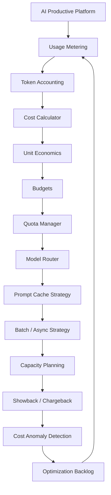
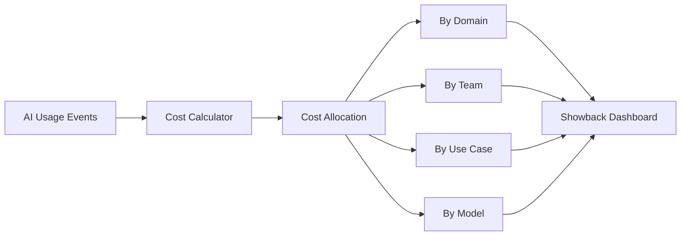
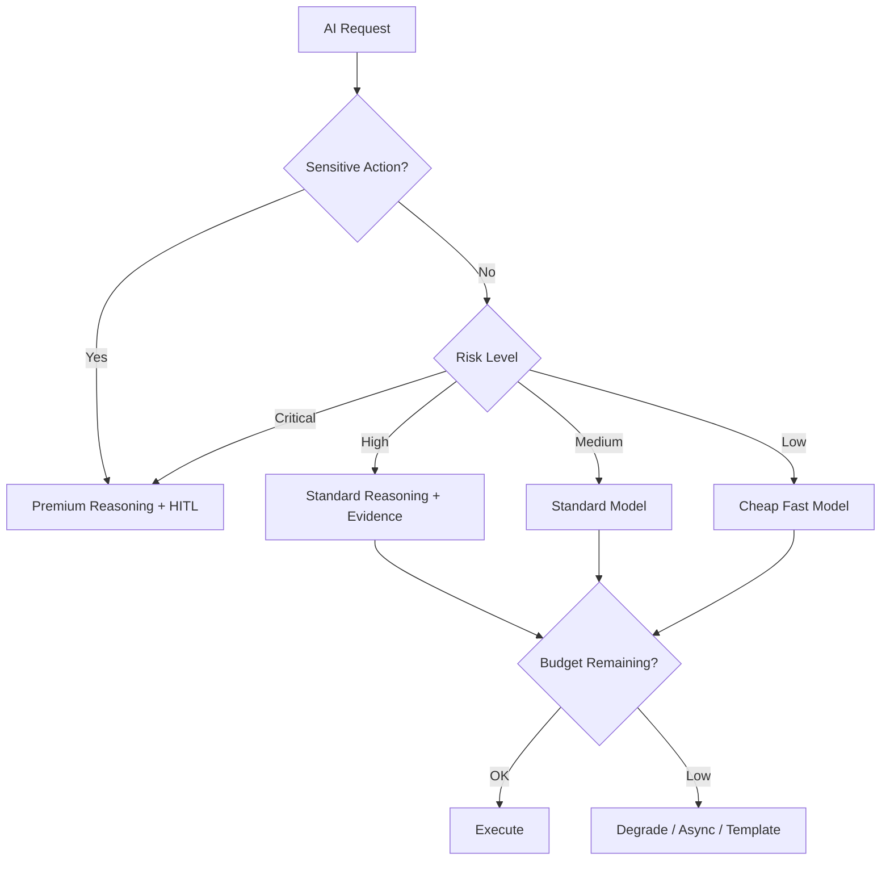
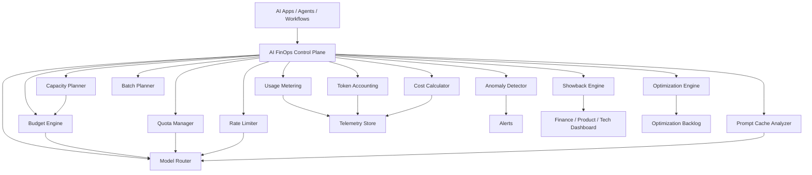
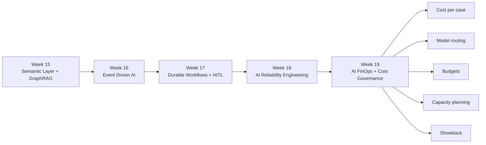

# Semana 19 — AI FinOps, Cost Governance, Capacity Planning y Model Routing para Fintech

## Cómo hacer que una plataforma AI enterprise sea económicamente sostenible, controlable, escalable y defendible ante negocio, finanzas, riesgo y tecnología

La **Semana 19** es el paso natural después de la Semana 18.

En la Semana 18 trabajaste:

```text
AI system
→ SLIs
→ SLOs
→ error budget
→ burn rate
→ alerts
→ runbooks
→ degraded mode
→ incident response
→ postmortem
→ reliability backlog
→ chaos testing
→ stronger system
```

Ahora aparece el siguiente problema real de producción:

> **Una plataforma AI puede ser técnicamente correcta y confiable, pero económicamente inviable si no controla costo, consumo, modelos, tokens, capacidad, cuotas, caching, routing y valor de negocio.**

Eso es la Semana 19:

# **AI FinOps + Cost Governance + Capacity Planning + Model Routing para Fintech**

---

# 1. Tema central de la Semana 19

La Semana 19 enseña a construir una capa de gobierno económico para sistemas AI productivos.

El objetivo es pasar de esto:

```text
“Mi agente funciona y responde bien”
```

a esto:

```text
“Mi plataforma AI sabe cuánto cuesta cada caso, qué modelo conviene usar, cuándo cachear, cuándo degradar, cuándo bloquear consumo, cómo asignar costos por dominio y cómo justificar valor de negocio”
```

FinOps no es simplemente “bajar costos”. El framework de FinOps Foundation lo plantea como un modelo operativo para generar responsabilidad financiera colaborativa y maximizar valor de negocio sobre el gasto tecnológico. Además, sus principios remarcan que las decisiones deben estar guiadas por valor de negocio, que todos deben asumir responsabilidad por el uso, y que los reportes deben ser accesibles y oportunos. ([FinOps Foundation](https://www.finops.org/framework/principles/?utm_source=chatgpt.com "FinOps Principles"))

---

# 2. Por qué esta semana importa en fintech

En fintech, los sistemas AI pueden crecer muy rápido.

Un caso como `/solve-chargebacks` puede empezar así:

```text
10 analistas internos
→ 100 consultas por día
→ 1.000 consultas por día
→ 10.000 workflows mensuales
→ integración con Slack
→ integración con Khatu-X
→ integración con Datadog
→ integración con Snowflake
→ integración con Collibra
→ automatización parcial
```

Si no gobernás el costo, pasa esto:

```text
más usuarios
→ más prompts
→ más contexto
→ más tokens
→ más llamadas a tools
→ más retries
→ más workflows
→ más storage
→ más embeddings
→ más costos ocultos
```

Y después alguien pregunta:

> **¿Cuánto cuesta resolver un chargeback con AI?**

Si no tenés respuesta, la plataforma queda débil frente a dirección, finanzas, auditoría y arquitectura.

AWS Well-Architected define la optimización de costos como la capacidad de ejecutar sistemas para entregar valor de negocio al menor precio posible, y la ubica como uno de los pilares arquitectónicos junto con excelencia operacional, seguridad, confiabilidad y performance efficiency. ([AWS Docs](https://docs.aws.amazon.com/wellarchitected/latest/cost-optimization-pillar/welcome.html?utm_source=chatgpt.com "Cost Optimization Pillar - AWS Well-Architected Framework - Cost Optimization Pillar"))

---

# 3. Mapa mental de la Semana 19



---

# 4. La idea principal

La frase central de esta semana:

> **Una plataforma AI productiva no escala solo porque responde bien. Escala cuando cada decisión de modelo, contexto, tool, workflow y cache está gobernada por valor, riesgo, latencia y costo.**

Antes pensabas:

```text
mejor modelo → mejor respuesta
```

Ahora tenés que pensar:

```text
caso de uso
+ criticidad
+ riesgo
+ SLO
+ costo máximo
+ modelo adecuado
+ contexto mínimo suficiente
+ caching
+ routing
+ quota
+ presupuesto
= AI económicamente operable
```

---

# 5. Qué es AI FinOps

**AI FinOps** es aplicar FinOps, ingeniería de costos, gobernanza, observabilidad y economía de producto a sistemas basados en IA.

Incluye:

```text
token accounting
cost per request
cost per workflow
cost per successful resolution
cost per avoided manual hour
model routing
prompt caching
batch processing
capacity planning
budgets
quotas
showback
chargeback interno
cost anomaly detection
unit economics
optimization backlog
```

No es solo mirar la factura mensual.

Es poder responder:

```text
¿Cuánto cuesta cada caso?
¿Qué usuario, dominio o squad consume más?
¿Qué modelo consume más?
¿Qué porcentaje de tokens se va en contexto?
¿Qué prompts tienen bajo cache hit?
Qué workflows queman presupuesto?
Qué casos deberían ir a batch?
Qué casos deberían usar modelo barato?
Qué casos justifican modelo premium?
Qué costo tiene cada resolución exitosa?
Qué ahorro operativo genera?
```

---

# 6. Diferencia entre FinOps tradicional y AI FinOps

| ÁreaFinOps cloud tradicionalAI FinOps |                                    |                                                     |
| ------------------------------------- | ---------------------------------- | --------------------------------------------------- |
| Unidad base                           | CPU, memoria, storage, red         | tokens, requests, embeddings, tool calls, workflows |
| Métrica principal                     | costo por servicio                 | costo por caso AI                                   |
| Optimización                          | rightsizing, reservas, autoscaling | model routing, prompt compression, cache, batching  |
| Riesgo                                | sobreprovisionamiento              | alucinación cara, contexto excesivo, retries caros  |
| Governance                            | tags, budgets, accounts            | tenant, dominio, use case, model, prompt, policy    |
| Decisión clave                        | qué infraestructura usar           | qué modelo/contexto/tool usar para cada caso        |
| Unidad de valor                       | workload / producto                | resolución / decisión / workflow completado         |

---

# 7. Taxonomía de costos AI

Antes de optimizar, tenés que saber qué estás pagando.

## 7.1 Costos de inferencia

```text
input tokens
cached input tokens
output tokens
reasoning tokens
image tokens
audio tokens
latencia premium
capacidad reservada
```

OpenAI explica que los tokens son las unidades que los modelos procesan y generan; también distingue input tokens, output tokens, cached input tokens y reasoning tokens, todos relevantes para límites y costos. ([OpenAI Help Center](https://help.openai.com/en/articles/4936856-w?utm_source=chatgpt.com "Understanding and counting tokens | OpenAI Help Center"))

## 7.2 Costos de contexto

```text
RAG chunks
GraphRAG paths
metadata
schemas
policies
system prompts
tool descriptions
conversation history
memory
```

El problema típico:

```text
meto demasiado contexto
→ suben input tokens
→ sube latencia
→ baja precisión por ruido
→ aumenta costo
```

## 7.3 Costos de tools

```text
Collibra queries
Snowflake queries
Datadog queries
GitLab queries
Schema Registry calls
Kafka lookups
OpenMetadata calls
internal APIs
```

En enterprise AI, cada tool call también puede costar por:

```text
latencia
infraestructura
licencia
rate limit
retries
operación
observabilidad
```

## 7.4 Costos de workflows

```text
state persistence
activity retries
approval queue
outbox
audit logs
telemetry spans
long-running executions
compensations
```

Esto conecta con Semana 17.

## 7.5 Costos de confiabilidad

```text
fallback calls
duplicate attempts
chaos tests
evals continuas
golden sets
incident response
postmortems
```

Esto conecta con Semana 18.

## 7.6 Costos ocultos

```text
tiempo de analistas
tiempo de soporte
revisión manual
corrección de errores
casos mal escalados
decisiones no auditables
reproceso
```

AI FinOps no mira solo la factura de modelos. Mira el costo total de operar AI.

---

# 8. Diagrama de costos AI

```mermaid
flowchart TD
    A[AI Cost] --> B[Inference Cost]
    A --> C[Context Cost]
    A --> D[Tool Cost]
    A --> E[Workflow Cost]
    A --> F[Reliability Cost]
    A --> G[Hidden Operational Cost]

    B --> B1[Input tokens]
    B --> B2[Output tokens]
    B --> B3[Reasoning tokens]
    B --> B4[Cached tokens]

    C --> C1[RAG chunks]
    C --> C2[Graph paths]
    C --> C3[Memory]
    C --> C4[System prompts]

    D --> D1[Snowflake]
    D --> D2[Collibra]
    D --> D3[Datadog]
    D --> D4[GitLab]

    E --> E1[State store]
    E --> E2[Outbox]
    E --> E3[Audit]
    E --> E4[Approvals]

    F --> F1[Evals]
    F --> F2[Chaos tests]
    F --> F3[Fallbacks]

    G --> G1[Manual review]
    G --> G2[Rework]
    G --> G3[Incident time]
```



---

# 9. Concepto 1 — Usage metering

**Usage metering** es medir el consumo real de la plataforma AI.

No alcanza con:

```text
cantidad de requests
```

Necesitás medir:

```text
requestId
userId
teamId
domain
useCase
workflowId
modelId
promptVersion
policyVersion
inputTokens
cachedInputTokens
outputTokens
reasoningTokens
toolCalls
latencyMs
costUsd
success
riskLevel
businessOutcome
```

## Regla

> Lo que no se mide por caso de uso, después no se puede optimizar ni defender.

---

# 10. Concepto 2 — Token accounting

**Token accounting** es registrar cuántos tokens consume cada request o workflow.

Ejemplo:

```json
{
  "requestId": "req_001",
  "useCase": "solve-chargebacks",
  "modelId": "premium-reasoning",
  "inputTokens": 8500,
  "cachedInputTokens": 4000,
  "outputTokens": 900,
  "reasoningTokens": 1200
}
```

La clave está en separar:

```text
input tokens
cached input tokens
output tokens
reasoning tokens
```

Porque no todos cuestan igual ni tienen el mismo comportamiento.

OpenAI documenta que Prompt Caching reutiliza el prefijo más largo previamente procesado, comenzando desde 1.024 tokens e incrementando en bloques de 128 tokens; además, el uso reporta `cached_tokens`, lo que permite medir cache hit real. ([OpenAI](https://openai.com/index/api-prompt-caching/?utm_source=chatgpt.com "Prompt Caching in the API | OpenAI"))

---

# 11. Concepto 3 — Cost per request

**Cost per request** responde:

> ¿Cuánto costó esta consulta AI?

Fórmula simplificada:

```text
cost =
  inputTokens * inputRate
+ cachedInputTokens * cachedInputRate
+ outputTokens * outputRate
+ reasoningTokens * reasoningRate
+ toolCost
+ workflowCost
```

No pongas precios hardcodeados en el código productivo.

Usá un catálogo configurable:

```json
{
  "modelId": "premium-reasoning",
  "inputRatePerMillion": 10,
  "cachedInputRatePerMillion": 1,
  "outputRatePerMillion": 30,
  "reasoningRatePerMillion": 30
}
```

Los precios reales cambian por proveedor, modelo, contrato y fecha. Por eso, el repo de esta semana debe usar precios de ejemplo y configuración versionada, no tarifas embebidas.

---

# 12. Concepto 4 — Cost per workflow

En Semana 17 viste workflows durables.

Ahora medimos cuánto cuesta todo el workflow:

```text
cost per workflow =
  step 1 model cost
+ step 2 retrieval cost
+ step 3 tool calls
+ step 4 HITL notification
+ step 5 audit
+ step 6 retries
+ step 7 outbox
```

Ejemplo:

```text
chargeback investigation workflow

AI summary: USD 0.08
GraphRAG: USD 0.03
Snowflake query: USD 0.02
Datadog query: USD 0.01
Workflow storage: USD 0.002
Audit: USD 0.001
Retries: USD 0.015

Total: USD 0.158
```

La pregunta real no es solo:

```text
¿Cuánto cuesta el modelo?
```

La pregunta real es:

```text
¿Cuánto cuesta resolver el proceso completo?
```

---

# 13. Concepto 5 — Unit economics AI

**Unit economics** es conectar costo con valor.

Ejemplo para chargebacks:

```text
costo AI por caso = USD 0.20
tiempo manual ahorrado = 12 minutos
costo hora analista = USD 15
ahorro estimado = USD 3.00
ROI bruto por caso = 15x
```

Fórmula:

```text
valuePerCase = manualMinutesSaved / 60 * analystHourlyCost
roi = valuePerCase / aiCostPerCase
```

Pero cuidado: en fintech también tenés que sumar:

```text
riesgo reducido
fraude evitado
mejor SLA operativo
mejor trazabilidad
menor reproceso
mejor auditoría
```

No todo valor aparece como ahorro directo.

---

# 14. Concepto 6 — Showback y chargeback interno

En FinOps aparecen dos prácticas importantes:

## Showback

Mostrar consumo por equipo, producto o dominio.

```text
Customer Management consumió USD 1.200
Tarjeta Crédito consumió USD 2.700
Fraude consumió USD 900
KYC consumió USD 500
```

## Chargeback interno

Asignar el costo al área que consume.

```text
Fraude paga el costo de /solve-fraud
Disputas paga /solve-chargebacks
Riesgo paga /collections-risk-assistant
```

Para un MVP, empezaría con **showback**, no chargeback.

Porque primero necesitás visibilidad y confianza.

---

# 15. Diagrama showback AI



---

# 16. Concepto 7 — Budgets

Un **budget** define cuánto puede gastar un dominio, equipo, usuario o caso de uso.

Ejemplos:

```text
solve-chargebacks: USD 2.000 / mes
solve-fraud: USD 5.000 / mes
assist-kyc: USD 1.000 / mes
collections-risk-assistant: USD 1.500 / mes
```

También podés tener presupuestos por:

```text
team
environment
model
tenant
workflow type
risk level
```

## Reglas de budget

```text
80% consumido → warning
90% consumido → require cheaper model
95% consumido → force human review / async only
100% consumido → block non-critical usage
```

---

# 17. Concepto 8 — Quotas

Una **quota** limita consumo.

Ejemplos:

```text
máximo requests por día
máximo tokens por día
máximo costo por mes
máximo workflows simultáneos
máximo tool calls por request
máximo retries por workflow
máximo uso de modelo premium
```

## Diferencia budget vs quota

| ConceptoPregunta |                              |
| ---------------- | ---------------------------- |
| Budget           | ¿Cuánto dinero puedo gastar? |
| Quota            | ¿Cuánto consumo permito?     |

---

# 18. Concepto 9 — Rate limiting

**Rate limiting** controla la velocidad de consumo.

Ejemplo:

```text
máximo 60 requests por minuto para /solve-chargebacks
máximo 10 requests por minuto con modelo premium
máximo 3 workflows concurrentes por merchant
```

Esto evita:

```text
cost spikes
retry storms
abuso interno
saturación de tools
incidentes por carga
```

---

# 19. Concepto 10 — Model routing

**Model routing** decide qué modelo usar para cada caso.

No todo requiere el mejor modelo.

Ejemplo:

| CasoModelo recomendado         |                         |
| ------------------------------ | ----------------------- |
| FAQ interna simple             | cheap-fast              |
| Resumen con evidencia          | standard                |
| Diagnóstico chargeback crítico | premium-reasoning       |
| Clasificación masiva offline   | batch-cheap             |
| Acción sensible                | premium + policy + HITL |

## Criterios de routing

```text
riskLevel
complexity
latencySlo
budgetRemaining
requiredGrounding
userTier
workflowStep
confidenceNeeded
```

## Regla fintech

> El modelo más caro se justifica solo cuando el riesgo, la complejidad o el impacto económico lo requieren.

---

# 20. Diagrama model routing



---

# 21. Concepto 11 — Prompt caching

**Prompt caching** consiste en reutilizar partes repetidas del prompt para reducir costo y latencia.

En AI enterprise, suelen repetirse:

```text
system prompt
policies
tool definitions
schemas
instructions
domain glossary
certified metric definitions
```

Estrategia:

```text
poner contenido estable al principio
poner contenido variable al final
versionar system prompts
evitar cambiar prefijos innecesariamente
medir cachedInputTokens
```

OpenAI indica que Prompt Caching puede reducir latencia y costos de entrada cuando hay prefijos reutilizables; además, permite observar tokens cacheados en los campos de uso, lo cual sirve para monitoreo y optimización. ([OpenAI](https://openai.com/index/api-prompt-caching/?utm_source=chatgpt.com "Prompt Caching in the API | OpenAI"))

---

# 22. Concepto 12 — Prompt compression

**Prompt compression** es reducir contexto sin perder información crítica.

Se puede hacer con:

```text
deduplicación
resumen previo
top-k menor
chunk filtering
metadata filtering
schema minimization
tool pruning
memory trimming
policy references by ID
```

Ejemplo malo:

```text
Enviar 25 documentos completos al modelo.
```

Ejemplo bueno:

```text
Enviar 5 evidencias relevantes + IDs auditables + resumen estructurado.
```

## Regla

> El mejor prompt no es el más largo. Es el mínimo contexto suficiente para decidir con evidencia.

---

# 23. Concepto 13 — Tool pruning

**Tool pruning** significa no mandar todas las tools al modelo en todos los casos.

Ejemplo:

```text
Para chargebacks:
- payment_tool
- merchant_tool
- fraud_signal_tool
- dispute_policy_tool

No mandar:
- kyc_tool
- loan_tool
- collections_tool
- marketing_tool
```

Esto reduce:

```text
tokens
latencia
confusión
riesgo de tool incorrecta
```

---

# 24. Concepto 14 — Batch processing

No todo debe ser online.

Casos ideales para batch:

```text
clasificación histórica
reprocesamiento de casos cerrados
generación de resúmenes nocturnos
evaluaciones masivas
detección de anomalías offline
scoring no interactivo
```

Casos que NO deberían ir a batch:

```text
respuesta interactiva de analista
aprobación urgente
fraude en tiempo real
bloqueo sensible
acción con SLA inmediato
```

OpenAI documenta su Batch API como procesamiento asíncrono que completa dentro de una ventana de hasta 24 horas y ofrece descuento frente a APIs síncronas, por lo que conviene para trabajos no interactivos y tolerantes a demora. ([OpenAI Plataforma](https://platform.openai.com/docs/api-reference/batch/object?api-mode=responses\&utm_source=chatgpt.com "Batch | OpenAI API Reference"))

---

# 25. Concepto 15 — Capacity planning

**Capacity planning** responde:

```text
¿Cuánta capacidad necesito para atender demanda sin romper SLOs ni presupuesto?
```

Para AI tenés que estimar:

```text
requests por minuto
tokens por minuto
tokens por día
workflows concurrentes
tool calls por minuto
latencia p95
rate limits
colas
batch windows
capacidad reservada
```

OpenAI ofrece Scale Tier para clientes API como un esquema para comprar por adelantado unidades de tokens por minuto de entrada y salida para un snapshot específico de modelo, lo cual ilustra cómo la capacidad AI se puede pensar en términos de throughput de tokens, no solo requests. ([OpenAI](https://openai.com/api-scale-tier/?utm_source=chatgpt.com "Scale Tier for API Customers | OpenAI"))

---

# 26. Concepto 16 — Cost anomaly detection

Necesitás detectar anomalías como:

```text
costo por request subió 80%
output tokens duplicados
cache hit cayó de 70% a 10%
modelo premium usado en casos low risk
retries se triplicaron
tool de Snowflake consultada 10x más
batch no corrió y pasó a online caro
```

Regla:

```text
si el costo cambia bruscamente, casi siempre cambió:
prompt
modelo
routing
datos
tool
volumen
retry behavior
```

---

# 27. Concepto 17 — Cost-aware degraded mode

En Semana 18 viste degraded mode por confiabilidad.

Ahora aparece degraded mode por costo.

Ejemplo:

```text
Budget 90% consumido
→ desactivar modelo premium para casos low risk
→ forzar batch para reprocesos
→ reducir topK de RAG
→ usar template seguro
→ mantener HITL para acciones sensibles
```

No degradás seguridad.
Degradás lujo, amplitud o velocidad.

---

# 28. Concepto 18 — Cost-aware SLOs

Un sistema AI puede tener SLOs económicos:

```text
p95 cost per chargeback case <= USD 0.25
premium model usage <= 20% de requests
cache hit rate >= 50%
average input tokens <= 8.000
tool calls per request <= 5
batch ratio >= 30% para tareas offline
cost anomaly detection latency <= 15 minutos
```

Estos SLOs no reemplazan SLOs de calidad.

Los complementan.

---

# 29. Concepto 19 — Business value score

No todo debe optimizarse por menor costo.

Ejemplo:

```text
Caso A:
costo USD 0.02
valor bajo
riesgo bajo

Caso B:
costo USD 1.00
evita fraude de USD 500
riesgo alto
```

El Caso B es caro, pero puede estar muy justificado.

Score:

```text
businessValueScore =
  expectedFinancialImpact
+ riskReductionValue
+ manualTimeSavedValue
+ auditValue
- aiCost
```

La decisión correcta no es:

```text
usar siempre el modelo más barato
```

La decisión correcta es:

```text
usar el modelo con mejor relación valor/riesgo/costo
```

---

# 30. Concepto 20 — Optimization backlog

Cada hallazgo de costo debe generar backlog.

Ejemplos:

```text
Reducir system prompt de 9.000 a 5.000 tokens.
Aumentar cache hit rate de 20% a 60%.
Mover reprocesamiento nocturno a batch.
Crear router low/medium/high risk.
Limitar premium model en consultas informativas.
Reducir topK por defecto de 12 a 6.
Cachear definiciones de métricas certificadas.
Medir cost_per_successful_resolution.
```

---

# 31. Arquitectura objetivo Semana 19



---

# 32. Arquitectura integrada con Semanas 15 a 18



---

# 33. Caso integral fintech de la semana

Vamos a trabajar con:

# `ai-finops-control-plane`

Para el caso:

```text
/solve-chargebacks
```

El sistema debe medir:

```text
requests
tokens
cached tokens
output tokens
reasoning tokens
tool calls
workflow steps
latency
model used
cost per request
cost per workflow
cost per successful resolution
budget remaining
```

Y debe poder decidir:

```text
qué modelo usar
si conviene batch
si conviene cache
si hay que degradar
si se superó budget
si hay anomalía de costo
qué equipo/dominio consumió más
qué optimización aplicar
```

---

# 34. Código — estructura del proyecto

Repo ideal:

```text
week19-ai-finops-cost-governance-fintech/
├─ README.md
├─ README.es.md
├─ README.en.md
├─ docs/
│  ├─ es/
│  └─ en/
├─ assets/
│  ├─ es/
│  └─ en/
├─ data/
│  ├─ pricing_catalog.json
│  ├─ usage_events.json
│  ├─ budget_definitions.json
│  ├─ quota_definitions.json
│  ├─ routing_policies.json
│  ├─ optimization_recommendations.json
│  └─ showback_expected.json
├─ src/
│  ├─ types.ts
│  ├─ pricingCatalog.ts
│  ├─ usageMeter.ts
│  ├─ tokenAccounting.ts
│  ├─ costCalculator.ts
│  ├─ budgetEngine.ts
│  ├─ quotaManager.ts
│  ├─ rateLimiter.ts
│  ├─ modelRouter.ts
│  ├─ promptCacheAnalyzer.ts
│  ├─ batchPlanner.ts
│  ├─ capacityPlanner.ts
│  ├─ anomalyDetector.ts
│  ├─ showbackEngine.ts
│  ├─ optimizationEngine.ts
│  ├─ unitEconomics.ts
│  ├─ httpServer.ts
│  └─ main.ts
├─ tests/
│  ├─ costCalculator.test.ts
│  ├─ budgetEngine.test.ts
│  ├─ quotaManager.test.ts
│  ├─ rateLimiter.test.ts
│  ├─ modelRouter.test.ts
│  ├─ promptCacheAnalyzer.test.ts
│  ├─ batchPlanner.test.ts
│  ├─ anomalyDetector.test.ts
│  ├─ showbackEngine.test.ts
│  └─ unitEconomics.test.ts
└─ .github/
   └─ workflows/
      └─ ci.yml
```

---

# 35. Código — tipos base

## `src/types.ts`

```ts
export type UseCase =
  | "solve-chargebacks"
  | "solve-fraud"
  | "assist-kyc"
  | "collections-risk-assistant";

export type Domain =
  | "payments"
  | "fraud"
  | "kyc"
  | "collections"
  | "credit-card";

export type RiskLevel = "low" | "medium" | "high" | "critical";

export type LatencyClass = "interactive" | "nearline" | "batch";

export type ModelTier = "cheap" | "standard" | "premium" | "batch";

export interface PricingModel {
  modelId: string;
  tier: ModelTier;
  inputUsdPerMillion: number;
  cachedInputUsdPerMillion: number;
  outputUsdPerMillion: number;
  reasoningUsdPerMillion: number;
}

export interface UsageEvent {
  requestId: string;
  workflowId?: string;
  timestamp: string;
  userId: string;
  teamId: string;
  domain: Domain;
  useCase: UseCase;
  riskLevel: RiskLevel;
  latencyClass: LatencyClass;
  modelId: string;
  inputTokens: number;
  cachedInputTokens: number;
  outputTokens: number;
  reasoningTokens: number;
  toolCalls: number;
  toolCostUsd: number;
  workflowCostUsd: number;
  latencyMs: number;
  success: boolean;
  businessOutcome:
    | "resolved"
    | "manual_review"
    | "rejected"
    | "partial"
    | "failed";
}

export interface CostBreakdown {
  requestId: string;
  modelId: string;
  inputCostUsd: number;
  cachedInputCostUsd: number;
  outputCostUsd: number;
  reasoningCostUsd: number;
  toolCostUsd: number;
  workflowCostUsd: number;
  totalCostUsd: number;
}

export interface BudgetDefinition {
  id: string;
  scopeType: "domain" | "team" | "useCase" | "model";
  scopeValue: string;
  monthlyBudgetUsd: number;
  warningThreshold: number;
  degradeThreshold: number;
  blockThreshold: number;
}

export interface BudgetEvaluation {
  budgetId: string;
  scopeType: BudgetDefinition["scopeType"];
  scopeValue: string;
  spentUsd: number;
  budgetUsd: number;
  utilization: number;
  status: "ok" | "warning" | "degrade" | "block";
}

export interface QuotaDefinition {
  id: string;
  scopeType: "user" | "team" | "useCase";
  scopeValue: string;
  maxRequestsPerDay: number;
  maxTokensPerDay: number;
  maxPremiumRequestsPerDay: number;
}

export interface QuotaEvaluation {
  quotaId: string;
  allowed: boolean;
  reason: string;
  usedRequests: number;
  usedTokens: number;
  usedPremiumRequests: number;
}

export interface RoutingInput {
  useCase: UseCase;
  riskLevel: RiskLevel;
  latencyClass: LatencyClass;
  requiresEvidence: boolean;
  budgetStatus: BudgetEvaluation["status"];
  estimatedInputTokens: number;
}

export interface RoutingDecision {
  modelId: string;
  tier: ModelTier;
  reason: string;
  requiresHumanApproval: boolean;
  mode: "normal" | "degraded" | "batch" | "blocked";
}

export interface CacheAnalysis {
  requestId: string;
  cacheHitRate: number;
  cachedTokens: number;
  totalInputTokens: number;
  estimatedSavingsUsd: number;
  recommendation: string;
}

export interface ShowbackRow {
  scope: string;
  scopeValue: string;
  requests: number;
  totalCostUsd: number;
  avgCostUsd: number;
  successfulResolutions: number;
  costPerSuccessfulResolutionUsd: number;
}

export interface UnitEconomics {
  requestId: string;
  aiCostUsd: number;
  manualMinutesSaved: number;
  analystHourlyCostUsd: number;
  estimatedManualSavingsUsd: number;
  roi: number;
}

export interface Anomaly {
  id: string;
  metric: string;
  currentValue: number;
  baselineValue: number;
  changeRatio: number;
  severity: "low" | "medium" | "high" | "critical";
  reason: string;
}
```

---

# 36. Código — pricing catalog

## `src/pricingCatalog.ts`

```ts
import type { PricingModel } from "./types.ts";

export class PricingCatalog {
  private readonly models = new Map<string, PricingModel>();

  constructor(models: PricingModel[]) {
    for (const model of models) {
      this.models.set(model.modelId, structuredClone(model));
    }
  }

  get(modelId: string): PricingModel {
    const model = this.models.get(modelId);

    if (!model) {
      throw new Error(`pricing_model_not_found:${modelId}`);
    }

    return structuredClone(model);
  }

  all(): PricingModel[] {
    return [...this.models.values()].map((model) => structuredClone(model));
  }
}

export const samplePricingCatalog = new PricingCatalog([
  {
    modelId: "cheap-fast",
    tier: "cheap",
    inputUsdPerMillion: 0.5,
    cachedInputUsdPerMillion: 0.05,
    outputUsdPerMillion: 1.5,
    reasoningUsdPerMillion: 1.5
  },
  {
    modelId: "standard-reasoning",
    tier: "standard",
    inputUsdPerMillion: 2,
    cachedInputUsdPerMillion: 0.2,
    outputUsdPerMillion: 8,
    reasoningUsdPerMillion: 8
  },
  {
    modelId: "premium-reasoning",
    tier: "premium",
    inputUsdPerMillion: 10,
    cachedInputUsdPerMillion: 1,
    outputUsdPerMillion: 30,
    reasoningUsdPerMillion: 30
  },
  {
    modelId: "batch-cheap",
    tier: "batch",
    inputUsdPerMillion: 0.25,
    cachedInputUsdPerMillion: 0.025,
    outputUsdPerMillion: 0.75,
    reasoningUsdPerMillion: 0.75
  }
]);
```

---

# 37. Código — cost calculator

## `src/costCalculator.ts`

```ts
import type { CostBreakdown, UsageEvent } from "./types.ts";
import { PricingCatalog } from "./pricingCatalog.ts";

export function calculateCost(
  event: UsageEvent,
  catalog: PricingCatalog
): CostBreakdown {
  const pricing = catalog.get(event.modelId);

  const billableInputTokens = Math.max(
    0,
    event.inputTokens - event.cachedInputTokens
  );

  const inputCostUsd =
    (billableInputTokens / 1_000_000) * pricing.inputUsdPerMillion;

  const cachedInputCostUsd =
    (event.cachedInputTokens / 1_000_000) *
    pricing.cachedInputUsdPerMillion;

  const outputCostUsd =
    (event.outputTokens / 1_000_000) * pricing.outputUsdPerMillion;

  const reasoningCostUsd =
    (event.reasoningTokens / 1_000_000) *
    pricing.reasoningUsdPerMillion;

  const totalCostUsd =
    inputCostUsd +
    cachedInputCostUsd +
    outputCostUsd +
    reasoningCostUsd +
    event.toolCostUsd +
    event.workflowCostUsd;

  return {
    requestId: event.requestId,
    modelId: event.modelId,
    inputCostUsd: round(inputCostUsd),
    cachedInputCostUsd: round(cachedInputCostUsd),
    outputCostUsd: round(outputCostUsd),
    reasoningCostUsd: round(reasoningCostUsd),
    toolCostUsd: round(event.toolCostUsd),
    workflowCostUsd: round(event.workflowCostUsd),
    totalCostUsd: round(totalCostUsd)
  };
}

function round(value: number): number {
  return Number(value.toFixed(6));
}
```

---

# 38. Código — budget engine

## `src/budgetEngine.ts`

```ts
import type {
  BudgetDefinition,
  BudgetEvaluation,
  CostBreakdown,
  UsageEvent
} from "./types.ts";

export function evaluateBudget(input: {
  budget: BudgetDefinition;
  usageEvents: UsageEvent[];
  costs: CostBreakdown[];
}): BudgetEvaluation {
  const requestIdsInScope = new Set(
    input.usageEvents
      .filter((event) => isInBudgetScope(event, input.budget))
      .map((event) => event.requestId)
  );

  const spentUsd = input.costs
    .filter((cost) => requestIdsInScope.has(cost.requestId))
    .reduce((sum, cost) => sum + cost.totalCostUsd, 0);

  const utilization =
    input.budget.monthlyBudgetUsd === 0
      ? 1
      : spentUsd / input.budget.monthlyBudgetUsd;

  let status: BudgetEvaluation["status"] = "ok";

  if (utilization >= input.budget.blockThreshold) {
    status = "block";
  } else if (utilization >= input.budget.degradeThreshold) {
    status = "degrade";
  } else if (utilization >= input.budget.warningThreshold) {
    status = "warning";
  }

  return {
    budgetId: input.budget.id,
    scopeType: input.budget.scopeType,
    scopeValue: input.budget.scopeValue,
    spentUsd: round(spentUsd),
    budgetUsd: input.budget.monthlyBudgetUsd,
    utilization: round(utilization),
    status
  };
}

function isInBudgetScope(
  event: UsageEvent,
  budget: BudgetDefinition
): boolean {
  if (budget.scopeType === "domain") return event.domain === budget.scopeValue;
  if (budget.scopeType === "team") return event.teamId === budget.scopeValue;
  if (budget.scopeType === "useCase") return event.useCase === budget.scopeValue;
  if (budget.scopeType === "model") return event.modelId === budget.scopeValue;

  return false;
}

function round(value: number): number {
  return Number(value.toFixed(4));
}
```

---

# 39. Código — quota manager

## `src/quotaManager.ts`

```ts
import type { PricingModel, QuotaDefinition, QuotaEvaluation, UsageEvent } from "./types.ts";
import { PricingCatalog } from "./pricingCatalog.ts";

export function evaluateQuota(input: {
  quota: QuotaDefinition;
  usageEvents: UsageEvent[];
  catalog: PricingCatalog;
}): QuotaEvaluation {
  const events = input.usageEvents.filter((event) =>
    isInQuotaScope(event, input.quota)
  );

  const usedRequests = events.length;
  const usedTokens = events.reduce(
    (sum, event) =>
      sum +
      event.inputTokens +
      event.outputTokens +
      event.reasoningTokens,
    0
  );

  const usedPremiumRequests = events.filter((event) =>
    isPremium(event.modelId, input.catalog)
  ).length;

  if (usedRequests > input.quota.maxRequestsPerDay) {
    return deny(input.quota.id, "request_quota_exceeded", usedRequests, usedTokens, usedPremiumRequests);
  }

  if (usedTokens > input.quota.maxTokensPerDay) {
    return deny(input.quota.id, "token_quota_exceeded", usedRequests, usedTokens, usedPremiumRequests);
  }

  if (usedPremiumRequests > input.quota.maxPremiumRequestsPerDay) {
    return deny(input.quota.id, "premium_model_quota_exceeded", usedRequests, usedTokens, usedPremiumRequests);
  }

  return {
    quotaId: input.quota.id,
    allowed: true,
    reason: "quota_available",
    usedRequests,
    usedTokens,
    usedPremiumRequests
  };
}

function isInQuotaScope(event: UsageEvent, quota: QuotaDefinition): boolean {
  if (quota.scopeType === "user") return event.userId === quota.scopeValue;
  if (quota.scopeType === "team") return event.teamId === quota.scopeValue;
  if (quota.scopeType === "useCase") return event.useCase === quota.scopeValue;

  return false;
}

function isPremium(modelId: string, catalog: PricingCatalog): boolean {
  const model: PricingModel = catalog.get(modelId);
  return model.tier === "premium";
}

function deny(
  quotaId: string,
  reason: string,
  usedRequests: number,
  usedTokens: number,
  usedPremiumRequests: number
): QuotaEvaluation {
  return {
    quotaId,
    allowed: false,
    reason,
    usedRequests,
    usedTokens,
    usedPremiumRequests
  };
}
```

---

# 40. Código — rate limiter

## `src/rateLimiter.ts`

```ts
export interface RateLimitResult {
  allowed: boolean;
  remaining: number;
  resetAtMs: number;
  reason: string;
}

interface Bucket {
  windowStartMs: number;
  count: number;
}

export class FixedWindowRateLimiter {
  private readonly buckets = new Map<string, Bucket>();

  constructor(
    private readonly limit: number,
    private readonly windowMs: number
  ) {}

  check(key: string, nowMs: number): RateLimitResult {
    const bucket = this.buckets.get(key);

    if (!bucket || nowMs - bucket.windowStartMs >= this.windowMs) {
      this.buckets.set(key, {
        windowStartMs: nowMs,
        count: 1
      });

      return {
        allowed: true,
        remaining: this.limit - 1,
        resetAtMs: nowMs + this.windowMs,
        reason: "new_window"
      };
    }

    if (bucket.count >= this.limit) {
      return {
        allowed: false,
        remaining: 0,
        resetAtMs: bucket.windowStartMs + this.windowMs,
        reason: "rate_limit_exceeded"
      };
    }

    bucket.count += 1;

    return {
      allowed: true,
      remaining: this.limit - bucket.count,
      resetAtMs: bucket.windowStartMs + this.windowMs,
      reason: "within_limit"
    };
  }
}
```

---

# 41. Código — model router

## `src/modelRouter.ts`

```ts
import type { RoutingDecision, RoutingInput } from "./types.ts";

export function routeModel(input: RoutingInput): RoutingDecision {
  if (input.budgetStatus === "block") {
    return {
      modelId: "none",
      tier: "cheap",
      reason: "budget_block_threshold_reached",
      requiresHumanApproval: true,
      mode: "blocked"
    };
  }

  if (input.latencyClass === "batch") {
    return {
      modelId: "batch-cheap",
      tier: "batch",
      reason: "offline_or_reprocessing_task",
      requiresHumanApproval: false,
      mode: "batch"
    };
  }

  if (input.budgetStatus === "degrade") {
    return {
      modelId: "cheap-fast",
      tier: "cheap",
      reason: "budget_degrade_threshold_reached",
      requiresHumanApproval: input.riskLevel === "high" || input.riskLevel === "critical",
      mode: "degraded"
    };
  }

  if (input.riskLevel === "critical") {
    return {
      modelId: "premium-reasoning",
      tier: "premium",
      reason: "critical_risk_requires_best_reasoning",
      requiresHumanApproval: true,
      mode: "normal"
    };
  }

  if (input.riskLevel === "high" && input.requiresEvidence) {
    return {
      modelId: "premium-reasoning",
      tier: "premium",
      reason: "high_risk_with_evidence_requirement",
      requiresHumanApproval: true,
      mode: "normal"
    };
  }

  if (input.riskLevel === "medium" || input.requiresEvidence) {
    return {
      modelId: "standard-reasoning",
      tier: "standard",
      reason: "standard_reasoning_sufficient",
      requiresHumanApproval: false,
      mode: "normal"
    };
  }

  return {
    modelId: "cheap-fast",
    tier: "cheap",
    reason: "low_risk_low_complexity",
    requiresHumanApproval: false,
    mode: "normal"
  };
}
```

---

# 42. Código — prompt cache analyzer

## `src/promptCacheAnalyzer.ts`

```ts
import type { CacheAnalysis, CostBreakdown, UsageEvent } from "./types.ts";

export function analyzePromptCache(input: {
  event: UsageEvent;
  cost: CostBreakdown;
  estimatedUncachedInputCostUsd: number;
}): CacheAnalysis {
  const totalInputTokens = input.event.inputTokens;

  const cacheHitRate =
    totalInputTokens === 0
      ? 0
      : input.event.cachedInputTokens / totalInputTokens;

  const estimatedSavingsUsd = Math.max(
    0,
    input.estimatedUncachedInputCostUsd -
      input.cost.inputCostUsd -
      input.cost.cachedInputCostUsd
  );

  return {
    requestId: input.event.requestId,
    cacheHitRate: round(cacheHitRate),
    cachedTokens: input.event.cachedInputTokens,
    totalInputTokens,
    estimatedSavingsUsd: round(estimatedSavingsUsd),
    recommendation: recommendation(cacheHitRate)
  };
}

function recommendation(cacheHitRate: number): string {
  if (cacheHitRate >= 0.6) {
    return "cache_strategy_healthy";
  }

  if (cacheHitRate >= 0.3) {
    return "move_stable_context_to_prompt_prefix";
  }

  return "redesign_prompt_prefix_and_version_stable_instructions";
}

function round(value: number): number {
  return Number(value.toFixed(4));
}
```

---

# 43. Código — batch planner

## `src/batchPlanner.ts`

```ts
import type { LatencyClass, UseCase } from "./types.ts";

export interface BatchDecision {
  useBatch: boolean;
  reason: string;
  maxDelayHours: number;
}

export function decideBatch(input: {
  useCase: UseCase;
  latencyClass: LatencyClass;
  isUserWaiting: boolean;
  requiresImmediateAction: boolean;
}): BatchDecision {
  if (input.requiresImmediateAction) {
    return {
      useBatch: false,
      reason: "immediate_action_required",
      maxDelayHours: 0
    };
  }

  if (input.isUserWaiting) {
    return {
      useBatch: false,
      reason: "interactive_user_waiting",
      maxDelayHours: 0
    };
  }

  if (input.latencyClass === "batch") {
    return {
      useBatch: true,
      reason: "batch_latency_class",
      maxDelayHours: 24
    };
  }

  return {
    useBatch: false,
    reason: "nearline_or_interactive",
    maxDelayHours: 0
  };
}
```

---

# 44. Código — capacity planner

## `src/capacityPlanner.ts`

```ts
import type { UsageEvent } from "./types.ts";

export interface CapacityPlan {
  requestsPerMinuteP95: number;
  tokensPerMinuteP95: number;
  estimatedDailyTokens: number;
  recommendedTokenCapacityPerMinute: number;
  recommendation: string;
}

export function planCapacity(events: UsageEvent[]): CapacityPlan {
  const buckets = new Map<string, { requests: number; tokens: number }>();

  for (const event of events) {
    const minute = event.timestamp.slice(0, 16);
    const current = buckets.get(minute) ?? { requests: 0, tokens: 0 };

    current.requests += 1;
    current.tokens +=
      event.inputTokens + event.outputTokens + event.reasoningTokens;

    buckets.set(minute, current);
  }

  const requestCounts = [...buckets.values()].map((bucket) => bucket.requests);
  const tokenCounts = [...buckets.values()].map((bucket) => bucket.tokens);

  const requestsPerMinuteP95 = percentile(requestCounts, 95);
  const tokensPerMinuteP95 = percentile(tokenCounts, 95);
  const estimatedDailyTokens = Math.round(tokensPerMinuteP95 * 60 * 24);

  const recommendedTokenCapacityPerMinute = Math.ceil(tokensPerMinuteP95 * 1.3);

  return {
    requestsPerMinuteP95,
    tokensPerMinuteP95,
    estimatedDailyTokens,
    recommendedTokenCapacityPerMinute,
    recommendation:
      recommendedTokenCapacityPerMinute > 100_000
        ? "consider_reserved_capacity_or_batch_offloading"
        : "on_demand_capacity_is_likely_sufficient"
  };
}

function percentile(values: number[], p: number): number {
  if (values.length === 0) return 0;

  const sorted = [...values].sort((a, b) => a - b);
  const index = Math.ceil((p / 100) * sorted.length) - 1;

  return sorted[Math.max(0, Math.min(index, sorted.length - 1))];
}
```

---

# 45. Código — anomaly detector

## `src/anomalyDetector.ts`

```ts
import { randomUUID } from "node:crypto";
import type { Anomaly } from "./types.ts";

export function detectCostAnomaly(input: {
  metric: string;
  currentValue: number;
  baselineValue: number;
  warningRatio: number;
  criticalRatio: number;
}): Anomaly | undefined {
  if (input.baselineValue <= 0) {
    return undefined;
  }

  const changeRatio = input.currentValue / input.baselineValue;

  if (changeRatio < input.warningRatio) {
    return undefined;
  }

  const severity =
    changeRatio >= input.criticalRatio
      ? "critical"
      : changeRatio >= input.criticalRatio * 0.8
        ? "high"
        : "medium";

  return {
    id: randomUUID(),
    metric: input.metric,
    currentValue: round(input.currentValue),
    baselineValue: round(input.baselineValue),
    changeRatio: round(changeRatio),
    severity,
    reason: "cost_metric_above_baseline"
  };
}

function round(value: number): number {
  return Number(value.toFixed(4));
}
```

---

# 46. Código — showback engine

## `src/showbackEngine.ts`

```ts
import type { CostBreakdown, ShowbackRow, UsageEvent } from "./types.ts";

export function buildShowback(input: {
  usageEvents: UsageEvent[];
  costs: CostBreakdown[];
  scope: "domain" | "teamId" | "useCase" | "modelId";
}): ShowbackRow[] {
  const costsByRequestId = new Map(
    input.costs.map((cost) => [cost.requestId, cost])
  );

  const groups = new Map<
    string,
    {
      requests: number;
      cost: number;
      successfulResolutions: number;
    }
  >();

  for (const event of input.usageEvents) {
    const key = String(event[input.scope]);
    const cost = costsByRequestId.get(event.requestId)?.totalCostUsd ?? 0;

    const current =
      groups.get(key) ?? {
        requests: 0,
        cost: 0,
        successfulResolutions: 0
      };

    current.requests += 1;
    current.cost += cost;

    if (event.businessOutcome === "resolved") {
      current.successfulResolutions += 1;
    }

    groups.set(key, current);
  }

  return [...groups.entries()]
    .map(([scopeValue, value]) => ({
      scope: input.scope,
      scopeValue,
      requests: value.requests,
      totalCostUsd: round(value.cost),
      avgCostUsd: round(value.cost / value.requests),
      successfulResolutions: value.successfulResolutions,
      costPerSuccessfulResolutionUsd:
        value.successfulResolutions === 0
          ? 0
          : round(value.cost / value.successfulResolutions)
    }))
    .sort((a, b) => b.totalCostUsd - a.totalCostUsd);
}

function round(value: number): number {
  return Number(value.toFixed(6));
}
```

---

# 47. Código — unit economics

## `src/unitEconomics.ts`

```ts
import type { UnitEconomics } from "./types.ts";

export function calculateUnitEconomics(input: {
  requestId: string;
  aiCostUsd: number;
  manualMinutesSaved: number;
  analystHourlyCostUsd: number;
}): UnitEconomics {
  const estimatedManualSavingsUsd =
    (input.manualMinutesSaved / 60) * input.analystHourlyCostUsd;

  const roi =
    input.aiCostUsd === 0
      ? 0
      : estimatedManualSavingsUsd / input.aiCostUsd;

  return {
    requestId: input.requestId,
    aiCostUsd: round(input.aiCostUsd),
    manualMinutesSaved: input.manualMinutesSaved,
    analystHourlyCostUsd: input.analystHourlyCostUsd,
    estimatedManualSavingsUsd: round(estimatedManualSavingsUsd),
    roi: round(roi)
  };
}

function round(value: number): number {
  return Number(value.toFixed(4));
}
```

---

# 48. Código — optimization engine

## `src/optimizationEngine.ts`

```ts
import type { BudgetEvaluation, CacheAnalysis, ShowbackRow } from "./types.ts";

export interface OptimizationRecommendation {
  id: string;
  priority: "low" | "medium" | "high" | "critical";
  title: string;
  reason: string;
  expectedImpact: string;
}

export function generateOptimizations(input: {
  budgets: BudgetEvaluation[];
  cacheAnalyses: CacheAnalysis[];
  showback: ShowbackRow[];
}): OptimizationRecommendation[] {
  const recommendations: OptimizationRecommendation[] = [];

  for (const budget of input.budgets) {
    if (budget.status === "degrade" || budget.status === "block") {
      recommendations.push({
        id: `budget_${budget.budgetId}`,
        priority: budget.status === "block" ? "critical" : "high",
        title: `Optimize budget for ${budget.scopeValue}`,
        reason: `budget_status:${budget.status}, utilization:${budget.utilization}`,
        expectedImpact: "reduce premium model usage and enforce routing controls"
      });
    }
  }

  const lowCache = input.cacheAnalyses.filter(
    (analysis) => analysis.cacheHitRate < 0.3
  );

  if (lowCache.length > 0) {
    recommendations.push({
      id: "prompt_cache_low",
      priority: "high",
      title: "Improve prompt cache hit rate",
      reason: `${lowCache.length} requests have low cache hit rate`,
      expectedImpact: "reduce input token cost and latency"
    });
  }

  const topCost = input.showback[0];

  if (topCost && topCost.avgCostUsd > 0.25) {
    recommendations.push({
      id: `showback_${topCost.scopeValue}`,
      priority: "medium",
      title: `Review high average cost for ${topCost.scopeValue}`,
      reason: `avg_cost:${topCost.avgCostUsd}`,
      expectedImpact: "identify expensive prompts, tools or model routing"
    });
  }

  return recommendations;
}
```

---

# 49. Código — main demo

## `src/main.ts`

```ts
import fs from "node:fs";
import type { BudgetDefinition, QuotaDefinition, UsageEvent } from "./types.ts";
import { samplePricingCatalog } from "./pricingCatalog.ts";
import { calculateCost } from "./costCalculator.ts";
import { evaluateBudget } from "./budgetEngine.ts";
import { evaluateQuota } from "./quotaManager.ts";
import { routeModel } from "./modelRouter.ts";
import { analyzePromptCache } from "./promptCacheAnalyzer.ts";
import { decideBatch } from "./batchPlanner.ts";
import { planCapacity } from "./capacityPlanner.ts";
import { detectCostAnomaly } from "./anomalyDetector.ts";
import { buildShowback } from "./showbackEngine.ts";
import { calculateUnitEconomics } from "./unitEconomics.ts";
import { generateOptimizations } from "./optimizationEngine.ts";

const usageEvents: UsageEvent[] = [
  {
    requestId: "req_001",
    workflowId: "wf_001",
    timestamp: new Date().toISOString(),
    userId: "analyst_1",
    teamId: "disputes",
    domain: "payments",
    useCase: "solve-chargebacks",
    riskLevel: "high",
    latencyClass: "interactive",
    modelId: "premium-reasoning",
    inputTokens: 9000,
    cachedInputTokens: 5000,
    outputTokens: 900,
    reasoningTokens: 1200,
    toolCalls: 4,
    toolCostUsd: 0.025,
    workflowCostUsd: 0.004,
    latencyMs: 7200,
    success: true,
    businessOutcome: "resolved"
  },
  {
    requestId: "req_002",
    workflowId: "wf_002",
    timestamp: new Date().toISOString(),
    userId: "analyst_2",
    teamId: "fraud",
    domain: "fraud",
    useCase: "solve-fraud",
    riskLevel: "critical",
    latencyClass: "interactive",
    modelId: "premium-reasoning",
    inputTokens: 12000,
    cachedInputTokens: 2000,
    outputTokens: 1100,
    reasoningTokens: 1800,
    toolCalls: 6,
    toolCostUsd: 0.04,
    workflowCostUsd: 0.006,
    latencyMs: 8500,
    success: true,
    businessOutcome: "manual_review"
  },
  {
    requestId: "req_003",
    workflowId: "wf_003",
    timestamp: new Date().toISOString(),
    userId: "analyst_3",
    teamId: "kyc",
    domain: "kyc",
    useCase: "assist-kyc",
    riskLevel: "low",
    latencyClass: "batch",
    modelId: "batch-cheap",
    inputTokens: 6000,
    cachedInputTokens: 4000,
    outputTokens: 600,
    reasoningTokens: 300,
    toolCalls: 2,
    toolCostUsd: 0.01,
    workflowCostUsd: 0.002,
    latencyMs: 60000,
    success: true,
    businessOutcome: "resolved"
  }
];

const budgets: BudgetDefinition[] = [
  {
    id: "budget_payments",
    scopeType: "domain",
    scopeValue: "payments",
    monthlyBudgetUsd: 1000,
    warningThreshold: 0.8,
    degradeThreshold: 0.9,
    blockThreshold: 1
  },
  {
    id: "budget_fraud",
    scopeType: "domain",
    scopeValue: "fraud",
    monthlyBudgetUsd: 1500,
    warningThreshold: 0.8,
    degradeThreshold: 0.9,
    blockThreshold: 1
  }
];

const quotas: QuotaDefinition[] = [
  {
    id: "quota_disputes",
    scopeType: "team",
    scopeValue: "disputes",
    maxRequestsPerDay: 500,
    maxTokensPerDay: 5_000_000,
    maxPremiumRequestsPerDay: 100
  }
];

const costs = usageEvents.map((event) =>
  calculateCost(event, samplePricingCatalog)
);

const budgetEvaluations = budgets.map((budget) =>
  evaluateBudget({
    budget,
    usageEvents,
    costs
  })
);

const quotaEvaluations = quotas.map((quota) =>
  evaluateQuota({
    quota,
    usageEvents,
    catalog: samplePricingCatalog
  })
);

const routingDecisions = [
  routeModel({
    useCase: "solve-chargebacks",
    riskLevel: "high",
    latencyClass: "interactive",
    requiresEvidence: true,
    budgetStatus: "ok",
    estimatedInputTokens: 9000
  }),
  routeModel({
    useCase: "assist-kyc",
    riskLevel: "low",
    latencyClass: "batch",
    requiresEvidence: false,
    budgetStatus: "ok",
    estimatedInputTokens: 6000
  })
];

const cacheAnalyses = usageEvents.map((event) => {
  const cost = costs.find((item) => item.requestId === event.requestId);

  if (!cost) {
    throw new Error(`cost_not_found:${event.requestId}`);
  }

  const pricing = samplePricingCatalog.get(event.modelId);
  const estimatedUncachedInputCostUsd =
    (event.inputTokens / 1_000_000) * pricing.inputUsdPerMillion;

  return analyzePromptCache({
    event,
    cost,
    estimatedUncachedInputCostUsd
  });
});

const batchDecisions = usageEvents.map((event) =>
  decideBatch({
    useCase: event.useCase,
    latencyClass: event.latencyClass,
    isUserWaiting: event.latencyClass === "interactive",
    requiresImmediateAction: event.riskLevel === "critical"
  })
);

const capacityPlan = planCapacity(usageEvents);

const anomalies = [
  detectCostAnomaly({
    metric: "avg_cost_per_request",
    currentValue: 0.42,
    baselineValue: 0.18,
    warningRatio: 1.5,
    criticalRatio: 2.5
  })
].filter((item) => item !== undefined);

const showbackByDomain = buildShowback({
  usageEvents,
  costs,
  scope: "domain"
});

const showbackByUseCase = buildShowback({
  usageEvents,
  costs,
  scope: "useCase"
});

const unitEconomics = costs.map((cost) =>
  calculateUnitEconomics({
    requestId: cost.requestId,
    aiCostUsd: cost.totalCostUsd,
    manualMinutesSaved: cost.requestId === "req_001" ? 12 : 7,
    analystHourlyCostUsd: 15
  })
);

const optimizations = generateOptimizations({
  budgets: budgetEvaluations,
  cacheAnalyses,
  showback: showbackByUseCase
});

const output = {
  costs,
  budgetEvaluations,
  quotaEvaluations,
  routingDecisions,
  cacheAnalyses,
  batchDecisions,
  capacityPlan,
  anomalies,
  showbackByDomain,
  showbackByUseCase,
  unitEconomics,
  optimizations
};

console.log(JSON.stringify(output, null, 2));

fs.mkdirSync("artifacts", { recursive: true });
fs.writeFileSync(
  "artifacts/week19_ai_finops_results.json",
  JSON.stringify(output, null, 2)
);
fs.writeFileSync(
  "artifacts/cost_breakdown.json",
  JSON.stringify(costs, null, 2)
);
fs.writeFileSync(
  "artifacts/showback_by_domain.json",
  JSON.stringify(showbackByDomain, null, 2)
);
fs.writeFileSync(
  "artifacts/unit_economics.json",
  JSON.stringify(unitEconomics, null, 2)
);
```

---

# 50. Resultado esperado de la demo

La demo debería generar algo así:

```json
{
  "costs": [
    {
      "requestId": "req_001",
      "modelId": "premium-reasoning",
      "totalCostUsd": 0.1075
    }
  ],
  "routingDecisions": [
    {
      "modelId": "premium-reasoning",
      "tier": "premium",
      "reason": "high_risk_with_evidence_requirement",
      "requiresHumanApproval": true,
      "mode": "normal"
    }
  ],
  "cacheAnalyses": [
    {
      "requestId": "req_001",
      "cacheHitRate": 0.5556,
      "recommendation": "move_stable_context_to_prompt_prefix"
    }
  ],
  "showbackByDomain": [
    {
      "scope": "domain",
      "scopeValue": "payments",
      "requests": 1,
      "totalCostUsd": 0.1075
    }
  ]
}
```

---

# 51. Tests recomendados

## Test 1 — Calcula costo con cached tokens

```ts
import test from "node:test";
import assert from "node:assert/strict";
import { calculateCost } from "../src/costCalculator.ts";
import { samplePricingCatalog } from "../src/pricingCatalog.ts";
import type { UsageEvent } from "../src/types.ts";

test("calculates request cost with cached tokens", () => {
  const event: UsageEvent = {
    requestId: "req_1",
    timestamp: new Date().toISOString(),
    userId: "u1",
    teamId: "disputes",
    domain: "payments",
    useCase: "solve-chargebacks",
    riskLevel: "high",
    latencyClass: "interactive",
    modelId: "premium-reasoning",
    inputTokens: 10000,
    cachedInputTokens: 5000,
    outputTokens: 1000,
    reasoningTokens: 1000,
    toolCalls: 2,
    toolCostUsd: 0,
    workflowCostUsd: 0,
    latencyMs: 7000,
    success: true,
    businessOutcome: "resolved"
  };

  const cost = calculateCost(event, samplePricingCatalog);

  assert.equal(cost.modelId, "premium-reasoning");
  assert.ok(cost.totalCostUsd > 0);
  assert.ok(cost.cachedInputCostUsd < cost.inputCostUsd);
});
```

---

## Test 2 — Budget entra en degrade

```ts
import test from "node:test";
import assert from "node:assert/strict";
import { evaluateBudget } from "../src/budgetEngine.ts";
import type { BudgetDefinition, CostBreakdown, UsageEvent } from "../src/types.ts";

test("budget enters degrade status", () => {
  const budget: BudgetDefinition = {
    id: "budget_payments",
    scopeType: "domain",
    scopeValue: "payments",
    monthlyBudgetUsd: 100,
    warningThreshold: 0.8,
    degradeThreshold: 0.9,
    blockThreshold: 1
  };

  const usageEvents = [
    {
      requestId: "req_1",
      timestamp: new Date().toISOString(),
      userId: "u1",
      teamId: "t1",
      domain: "payments",
      useCase: "solve-chargebacks",
      riskLevel: "high",
      latencyClass: "interactive",
      modelId: "premium-reasoning",
      inputTokens: 1,
      cachedInputTokens: 0,
      outputTokens: 1,
      reasoningTokens: 1,
      toolCalls: 0,
      toolCostUsd: 0,
      workflowCostUsd: 0,
      latencyMs: 1,
      success: true,
      businessOutcome: "resolved"
    } as UsageEvent
  ];

  const costs: CostBreakdown[] = [
    {
      requestId: "req_1",
      modelId: "premium-reasoning",
      inputCostUsd: 0,
      cachedInputCostUsd: 0,
      outputCostUsd: 0,
      reasoningCostUsd: 0,
      toolCostUsd: 0,
      workflowCostUsd: 0,
      totalCostUsd: 92
    }
  ];

  const evaluation = evaluateBudget({ budget, usageEvents, costs });

  assert.equal(evaluation.status, "degrade");
});
```

---

## Test 3 — Router usa premium para riesgo alto con evidencia

```ts
import test from "node:test";
import assert from "node:assert/strict";
import { routeModel } from "../src/modelRouter.ts";

test("routes high risk evidence request to premium model", () => {
  const decision = routeModel({
    useCase: "solve-chargebacks",
    riskLevel: "high",
    latencyClass: "interactive",
    requiresEvidence: true,
    budgetStatus: "ok",
    estimatedInputTokens: 9000
  });

  assert.equal(decision.modelId, "premium-reasoning");
  assert.equal(decision.requiresHumanApproval, true);
});
```

---

## Test 4 — Router degrada por budget

```ts
import test from "node:test";
import assert from "node:assert/strict";
import { routeModel } from "../src/modelRouter.ts";

test("routes to degraded cheap model when budget is degraded", () => {
  const decision = routeModel({
    useCase: "solve-chargebacks",
    riskLevel: "medium",
    latencyClass: "interactive",
    requiresEvidence: true,
    budgetStatus: "degrade",
    estimatedInputTokens: 9000
  });

  assert.equal(decision.modelId, "cheap-fast");
  assert.equal(decision.mode, "degraded");
});
```

---

## Test 5 — Prompt cache analysis

```ts
import test from "node:test";
import assert from "node:assert/strict";
import { analyzePromptCache } from "../src/promptCacheAnalyzer.ts";
import type { CostBreakdown, UsageEvent } from "../src/types.ts";

test("analyzes prompt cache hit rate", () => {
  const event = {
    requestId: "req_1",
    inputTokens: 10000,
    cachedInputTokens: 7000
  } as UsageEvent;

  const cost = {
    requestId: "req_1",
    modelId: "premium-reasoning",
    inputCostUsd: 0.03,
    cachedInputCostUsd: 0.007,
    outputCostUsd: 0,
    reasoningCostUsd: 0,
    toolCostUsd: 0,
    workflowCostUsd: 0,
    totalCostUsd: 0.037
  } as CostBreakdown;

  const result = analyzePromptCache({
    event,
    cost,
    estimatedUncachedInputCostUsd: 0.1
  });

  assert.equal(result.cacheHitRate, 0.7);
  assert.equal(result.recommendation, "cache_strategy_healthy");
});
```

---

## Test 6 — Batch planner

```ts
import test from "node:test";
import assert from "node:assert/strict";
import { decideBatch } from "../src/batchPlanner.ts";

test("uses batch for offline non-urgent work", () => {
  const decision = decideBatch({
    useCase: "assist-kyc",
    latencyClass: "batch",
    isUserWaiting: false,
    requiresImmediateAction: false
  });

  assert.equal(decision.useBatch, true);
});
```

---

## Test 7 — Showback por dominio

```ts
import test from "node:test";
import assert from "node:assert/strict";
import { buildShowback } from "../src/showbackEngine.ts";
import type { CostBreakdown, UsageEvent } from "../src/types.ts";

test("builds showback by domain", () => {
  const usageEvents = [
    {
      requestId: "req_1",
      domain: "payments",
      businessOutcome: "resolved"
    },
    {
      requestId: "req_2",
      domain: "payments",
      businessOutcome: "manual_review"
    }
  ] as UsageEvent[];

  const costs = [
    { requestId: "req_1", totalCostUsd: 0.1 },
    { requestId: "req_2", totalCostUsd: 0.2 }
  ] as CostBreakdown[];

  const rows = buildShowback({
    usageEvents,
    costs,
    scope: "domain"
  });

  assert.equal(rows[0].scopeValue, "payments");
  assert.equal(rows[0].requests, 2);
  assert.equal(rows[0].totalCostUsd, 0.3);
});
```

---

## Test 8 — Unit economics

```ts
import test from "node:test";
import assert from "node:assert/strict";
import { calculateUnitEconomics } from "../src/unitEconomics.ts";

test("calculates unit economics and ROI", () => {
  const result = calculateUnitEconomics({
    requestId: "req_1",
    aiCostUsd: 0.2,
    manualMinutesSaved: 12,
    analystHourlyCostUsd: 15
  });

  assert.equal(result.estimatedManualSavingsUsd, 3);
  assert.equal(result.roi, 15);
});
```

---

# 52. Ejercicios prácticos por día

## Lunes — Medición de uso AI

### Ejercicio 1

Definir el evento de usage para:

```text
/solve-chargebacks
/solve-fraud
/assist-kyc
/collections-risk-assistant
```

Cada evento debe incluir:

```text
requestId
workflowId
userId
teamId
domain
useCase
modelId
promptVersion
policyVersion
inputTokens
cachedInputTokens
outputTokens
reasoningTokens
toolCalls
latencyMs
success
businessOutcome
```

### Ejercicio 2

Crear `UsageMeter`.

Debe permitir:

```text
registrar usage events
listar por dominio
listar por equipo
listar por use case
calcular tokens totales
calcular requests exitosos
```

### Aprendizaje

No existe AI FinOps sin usage metering granular.

---

## Martes — Cost calculator y unit economics

### Ejercicio 3

Crear `PricingCatalog`.

Debe soportar:

```text
cheap-fast
standard-reasoning
premium-reasoning
batch-cheap
```

### Ejercicio 4

Crear `CostCalculator`.

Debe calcular:

```text
input cost
cached input cost
output cost
reasoning cost
tool cost
workflow cost
total cost
```

### Ejercicio 5

Crear `UnitEconomics`.

Debe calcular:

```text
manual savings
AI cost
ROI
cost per successful resolution
```

### Aprendizaje

El costo técnico solo importa cuando se conecta con valor operativo.

---

## Miércoles — Budgets, quotas y rate limits

### Ejercicio 6

Crear budgets por:

```text
domain
team
useCase
model
```

### Ejercicio 7

Implementar estados:

```text
ok
warning
degrade
block
```

### Ejercicio 8

Crear quotas:

```text
requests per day
tokens per day
premium requests per day
tool calls per request
```

### Ejercicio 9

Implementar `FixedWindowRateLimiter`.

### Aprendizaje

El control de gasto no debe ocurrir al final del mes. Debe ocurrir en runtime.

---

## Jueves — Model routing y prompt cache

### Ejercicio 10

Implementar `ModelRouter`.

Debe decidir por:

```text
riskLevel
latencyClass
requiresEvidence
budgetStatus
estimatedInputTokens
```

### Ejercicio 11

Implementar reglas:

```text
critical → premium + HITL
high + evidence → premium + HITL
medium → standard
low → cheap
batch → batch-cheap
budget degrade → cheap/degraded
budget block → blocked
```

### Ejercicio 12

Implementar `PromptCacheAnalyzer`.

Debe calcular:

```text
cacheHitRate
cachedTokens
estimatedSavingsUsd
recommendation
```

### Aprendizaje

La decisión de modelo es una decisión económica, técnica y de riesgo al mismo tiempo.

---

## Viernes — Batch, capacity planning y anomaly detection

### Ejercicio 13

Crear `BatchPlanner`.

Debe decidir batch si:

```text
no hay usuario esperando
no hay acción inmediata
latencyClass = batch
```

### Ejercicio 14

Crear `CapacityPlanner`.

Debe calcular:

```text
requestsPerMinuteP95
tokensPerMinuteP95
estimatedDailyTokens
recommendedTokenCapacityPerMinute
```

### Ejercicio 15

Crear `AnomalyDetector`.

Detectar:

```text
avg cost per request subió
cache hit bajó
premium usage subió
tool cost subió
output tokens subieron
```

### Aprendizaje

AI productiva no se escala solo con autoscaling. Se escala con capacidad, routing y demanda gobernada.

---

## Sábado — Showback y optimization backlog

### Ejercicio 16

Crear `ShowbackEngine`.

Debe agrupar por:

```text
domain
team
useCase
model
```

### Ejercicio 17

Cada fila debe mostrar:

```text
requests
totalCostUsd
avgCostUsd
successfulResolutions
costPerSuccessfulResolutionUsd
```

### Ejercicio 18

Crear `OptimizationEngine`.

Debe recomendar:

```text
mejorar prompt cache
reducir uso premium
mover jobs a batch
reducir topK
aplicar quotas
crear budget específico
```

### Aprendizaje

El objetivo no es gastar menos en todo. El objetivo es gastar mejor donde hay más valor y menos riesgo.

---

# 53. Ejercicios avanzados

## Ejercicio 19 — Router valor/riesgo/costo

Crear score:

```text
routingScore =
  40% riskNeed
+ 25% evidenceNeed
+ 20% businessValue
- 15% costPressure
```

Debe decidir:

```text
cheap
standard
premium
batch
blocked
```

---

## Ejercicio 20 — Cost-aware RAG

Implementar una política de RAG:

```text
topK = 12 si critical
topK = 8 si high
topK = 5 si medium
topK = 3 si low
```

Pero si budget está en degrade:

```text
topK máximo = 5
```

---

## Ejercicio 21 — Tool cost guard

Bloquear tool calls si:

```text
toolCalls > 6
toolCostUsd > 0.10
useCase low risk intenta usar premium tools
```

---

## Ejercicio 22 — Forecast mensual

Con consumo de 7 días, proyectar:

```text
monthlyProjectedCost
budgetUtilizationProjected
daysUntilBudgetExhaustion
```

---

## Ejercicio 23 — Cost anomaly alert

Crear alertas:

```text
critical si costo actual > 2.5x baseline
high si costo actual > 2x baseline
medium si costo actual > 1.5x baseline
```

---

## Ejercicio 24 — GitHub Action de FinOps gate

Bloquear PR si:

```text
estimated_prompt_tokens aumenta > 30%
premium_model_usage aumenta > 20%
expected_cost_per_case > threshold
cache_hit_rate esperado < 30%
```

---

# 54. Anti-patrones de Semana 19

## 1. Medir solo factura mensual

Llegás tarde. Necesitás costo por request, workflow, equipo y caso de uso.

## 2. Usar siempre el modelo más caro

No es arquitectura premium. Es ausencia de routing.

## 3. Usar siempre el modelo más barato

Puede romper calidad, grounding y riesgo.

## 4. No medir cached tokens

Sin medir caching no podés optimizar prompts estables.

## 5. Mandar todas las tools siempre

Sube tokens, latencia y riesgo de tool incorrecta.

## 6. Contexto infinito

Más contexto no siempre mejora. A veces mete ruido y costo.

## 7. Sin budget runtime

Finanzas descubre el problema cuando ya ocurrió.

## 8. Sin showback

Nadie se hace responsable del consumo.

## 9. Optimizar costo rompiendo seguridad

Nunca degradar controles críticos por ahorrar.

## 10. No conectar costo con valor

Un caso caro puede ser excelente si evita fraude, reproceso o riesgo regulatorio.

---

# 55. Checklist de Semana 19

## Usage metering

-  Request ID.
-  Workflow ID.
-  User/team/domain.
-  Use case.
-  Model ID.
-  Prompt version.
-  Policy version.
-  Tokens.
-  Tool calls.
-  Cost.
-  Business outcome.

## Cost calculator

-  Input tokens.
-  Cached input tokens.
-  Output tokens.
-  Reasoning tokens.
-  Tool cost.
-  Workflow cost.
-  Total cost.

## Budgets

-  Por dominio.
-  Por equipo.
-  Por caso de uso.
-  Por modelo.
-  Warning threshold.
-  Degrade threshold.
-  Block threshold.

## Quotas

-  Requests por día.
-  Tokens por día.
-  Premium requests por día.
-  Tool calls por request.
-  Workflows concurrentes.

## Routing

-  Low risk → cheap.
-  Medium → standard.
-  High → standard/premium.
-  Critical → premium + HITL.
-  Batch → batch model.
-  Budget degrade → cheaper mode.
-  Budget block → no ejecución no crítica.

## Caching

-  Stable prefix.
-  Prompt versioning.
-  Cached token tracking.
-  Cache hit rate.
-  Savings estimation.

## Batch y capacity

-  Identificar trabajos batch.
-  Calcular tokens por minuto.
-  Calcular demanda p95.
-  Definir buffer.
-  Separar interactive vs batch.

## Showback

-  Por dominio.
-  Por equipo.
-  Por use case.
-  Por modelo.
-  Cost per successful resolution.
-  ROI por caso.

---

# 56. Qué deberías poder explicar al terminar

Al cerrar la Semana 19 deberías poder explicar:

1. Qué es AI FinOps.
2. Diferencia entre FinOps cloud tradicional y AI FinOps.
3. Cómo medir usage events AI.
4. Qué es token accounting.
5. Cómo calcular cost per request.
6. Cómo calcular cost per workflow.
7. Qué son unit economics en AI.
8. Qué es showback.
9. Qué es chargeback interno.
10. Cómo definir budgets.
11. Cómo definir quotas.
12. Cómo aplicar rate limiting.
13. Qué es model routing.
14. Cuándo usar cheap, standard, premium o batch.
15. Qué es prompt caching.
16. Cómo mejorar cache hit rate.
17. Qué es prompt compression.
18. Qué es tool pruning.
19. Cuándo usar Batch API o procesamiento async.
20. Cómo hacer capacity planning en tokens por minuto.
21. Cómo detectar anomalías de costo.
22. Cómo degradar por presupuesto sin romper seguridad.
23. Cómo crear cost-aware SLOs.
24. Cómo conectar costo con valor de negocio.
25. Cómo aplicar esto a `/solve-chargebacks`.

---

# 57. Proyecto final ideal de Semana 19

El repo debería llamarse:

# `week19-ai-finops-cost-governance-fintech`

Debe incluir:

```text
week19-ai-finops-cost-governance-fintech/
├─ README.md
├─ README.es.md
├─ README.en.md
├─ docs/
│  ├─ es/
│  └─ en/
├─ assets/
│  ├─ es/
│  └─ en/
├─ data/
│  ├─ pricing_catalog.json
│  ├─ usage_events.json
│  ├─ budget_definitions.json
│  ├─ quota_definitions.json
│  ├─ routing_policies.json
│  ├─ optimization_recommendations.json
│  └─ showback_expected.json
├─ src/
│  ├─ types.ts
│  ├─ pricingCatalog.ts
│  ├─ usageMeter.ts
│  ├─ tokenAccounting.ts
│  ├─ costCalculator.ts
│  ├─ budgetEngine.ts
│  ├─ quotaManager.ts
│  ├─ rateLimiter.ts
│  ├─ modelRouter.ts
│  ├─ promptCacheAnalyzer.ts
│  ├─ batchPlanner.ts
│  ├─ capacityPlanner.ts
│  ├─ anomalyDetector.ts
│  ├─ showbackEngine.ts
│  ├─ optimizationEngine.ts
│  ├─ unitEconomics.ts
│  ├─ httpServer.ts
│  └─ main.ts
├─ tests/
│  ├─ costCalculator.test.ts
│  ├─ budgetEngine.test.ts
│  ├─ quotaManager.test.ts
│  ├─ rateLimiter.test.ts
│  ├─ modelRouter.test.ts
│  ├─ promptCacheAnalyzer.test.ts
│  ├─ batchPlanner.test.ts
│  ├─ anomalyDetector.test.ts
│  ├─ showbackEngine.test.ts
│  └─ unitEconomics.test.ts
└─ .github/
   └─ workflows/
      └─ ci.yml
```

---

# 58. Resumen maestro

La Semana 19 es donde tus agentes, RAGs, GraphRAGs, workflows y reliability layer dejan de ser solo **operables técnicamente** y pasan a ser **sostenibles económicamente**.

La secuencia mental correcta es:

```text
AI usage
→ token accounting
→ cost calculation
→ unit economics
→ budget
→ quota
→ rate limit
→ model routing
→ prompt cache
→ batch planning
→ capacity planning
→ showback
→ anomaly detection
→ optimization backlog
→ better value per dollar
```

La frase final:

> **En fintech, una IA productiva no escala porque usa el mejor modelo. Escala porque sabe elegir el modelo correcto, con el contexto correcto, para el riesgo correcto, dentro del presupuesto correcto y con valor de negocio medible.**

Ese es el corazón de la Semana 19:

# **AI FinOps + Cost Governance + Capacity Planning + Model Routing para Fintech**