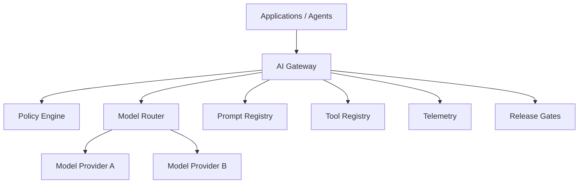
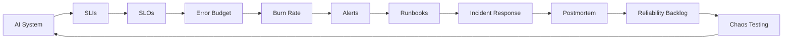

# Building Enterprise Agentic AI

## Technical White Paper & Architecture Playbook

### From LLM Runtime to Governed, Event-Driven & Reliable AI Platforms

<p align="center">
  <strong>
    An Architecture Playbook for RAG, AI Agents, MCP, Evals,
    Observability, Security, GraphRAG, Durable Workflows
    and AI Reliability in Fintech
  </strong>
</p>

<p align="center">
  
  
  
  
  
</p>

<p align="center">
  <a href="./enterprise-agentic-ai-architecture-playbook.pdf">
    <strong>📘 Open the Complete Architecture Playbook</strong>
  </a>
  &nbsp;&nbsp;·&nbsp;&nbsp;
  <a href="../../">
    <strong>🏗️ Back to the Engineering Portfolio</strong>
  </a>
</p>

---

> **The White Paper explains the architecture.  
> The repositories demonstrate the engineering.**

---

# Why this document exists

Most Generative AI content explains isolated capabilities:

- how to call an LLM,
- how to build RAG,
- how to create an agent,
- how to connect a tool.

But enterprise AI becomes difficult when all those capabilities must work
**together** under real engineering constraints.

The problem is no longer:

> “How do I make the model answer?”

The real problem becomes:

> **How do I engineer the system around the model so that AI can become
> governed, evidence-based, observable, secure, event-driven, durable
> and reliable?**

This Architecture Playbook explores that progression step by step.

It connects the conceptual architecture with the implementations,
tests, datasets and engineering evidence available across the
18 repositories of the
[Enterprise Agentic AI Engineering Portfolio](../../).

---

# The Core Idea

```text
Model ≠ AI System
Agent ≠ AI Platform
```

A serious AI system requires more than model intelligence.

```text
Model
+ Context
+ Retrieval
+ Tools
+ State
+ Evaluation
+ Observability
+ Security
+ Governance
+ Event Processing
+ Durable Workflows
+ Reliability
─────────────────────────
= Enterprise AI System
```

The model is only one component.

The architecture surrounding the model is what determines whether
an AI capability can move beyond experimentation.

---

# Architecture Evolution

The playbook follows a progressive architecture journey.

```mermaid
flowchart LR
    A["01 · MODEL<br/>LLM Runtime · Structured Outputs · Memory"]
    B["02 · KNOWLEDGE<br/>Embeddings · Retrieval · RAG"]
    C["03 · AGENCY<br/>Agent Graphs · HITL · MCP Concepts"]
    D["04 · TRUST<br/>Evals · Observability · Security"]
    E["05 · PLATFORM<br/>Production Patterns · Control Plane · Governance"]
    F["06 · CONTEXT<br/>Semantic Layer · Knowledge Graph · GraphRAG"]
    G["07 · OPERATIONS<br/>Events · Durable Workflows · Saga"]
    H["08 · RELIABILITY<br/>SLOs · Incidents · Chaos"]

    A --> B --> C --> D --> E --> F --> G --> H
```



The sequence is intentional.

Each architectural layer solves a limitation introduced by the
previous one.

---

# Eight Architecture Layers

| Level | Architecture Layer | Modules | Main Focus |
|---:|---|---|---|
| **01** | **MODEL FOUNDATION** | Weeks 01–03 | Runtime · Structured Outputs · State · Memory |
| **02** | **KNOWLEDGE** | Weeks 04–05 | Embeddings · Retrieval · Hybrid Search · Grounded RAG |
| **03** | **AGENCY** | Weeks 06–07 | Graph Orchestration · HITL · MCP Concepts |
| **04** | **TRUST** | Weeks 08–10 | Evals · Observability · Security · Guardrails |
| **05** | **PLATFORM** | Weeks 11–14 | Production Patterns · Control Plane · Governance |
| **06** | **ENTERPRISE CONTEXT** | Week 15 | Semantic Layer · Knowledge Graph · GraphRAG |
| **07** | **AUTONOMOUS OPERATIONS** | Weeks 16–17 | Event-Driven AI · Durable Workflows · Saga |
| **08** | **RELIABILITY** | Week 18 | SLOs · Incident Response · Chaos Testing |

---

# What the Playbook Covers

## 1. LLM Runtime & Context Engineering

The journey begins with the application layer surrounding the model.

Topics include:

- modern LLM runtimes,
- OpenAI / Bedrock provider abstraction,
- prompt construction,
- context engineering,
- provider routing,
- output normalization,
- operational controls,
- minimum observability,
- governance.

The first architectural lesson is simple:

> **The value of an LLM application is not only in the model.
> It is in the runtime, context and constraints around it.**

---

## 2. Structured Outputs & Tool Calling

Free-form text is useful for humans.

Software needs contracts.

This layer introduces:

- Structured Outputs,
- JSON Schema,
- structured extraction,
- structured classification,
- tool definitions,
- formal tool schemas,
- argument validation,
- business validation,
- tool dispatching,
- safe execution boundaries.

The transition is:

```text
Natural Language
      ↓
Structured Contract
      ↓
Validation
      ↓
Business Logic
      ↓
Controlled Tool Execution
```

---

## 3. State, Memory & Compaction

Enterprise agents need state.

But unlimited conversation history is not memory.

This section explores:

- conversation state,
- session persistence,
- short-term memory,
- long-term memory,
- prompt caching,
- context budgets,
- selective retention,
- summarization,
- compaction,
- useful-history vs noise.

The design objective is:

> **Preserve what matters without sending everything forever.**

---

## 4. Embeddings & Retrieval

Before building RAG, the system needs a serious retrieval layer.

Topics include:

- embeddings,
- semantic similarity,
- cosine similarity,
- corpus design,
- chunking,
- overlap,
- metadata,
- ingestion pipelines,
- vector indexing,
- Top-k retrieval,
- retrieval failure modes.

Architecture:

```text
Documents
    ↓
Parsing
    ↓
Cleaning
    ↓
Chunking
    ↓
Metadata
    ↓
Embeddings
    ↓
Vector Index
    ↓
Retriever
```

---

## 5. Enterprise RAG

Retrieval alone is not enough.

The objective is to produce answers supported by evidence.

This section develops:

- RAG,
- grounding,
- citations,
- recall vs precision,
- vector search,
- keyword search,
- hybrid retrieval,
- reranking,
- evidence traceability,
- grounded answer generation.

The architecture evolves into:

```text
Query
  ↓
Hybrid Retrieval
  ↓
Candidate Evidence
  ↓
Reranking
  ↓
Grounded Context
  ↓
LLM
  ↓
Answer + Citations
```

---

## 6. Agent Graphs & Human-in-the-Loop

Agents require orchestration.

A production-oriented agent should not be a free-form loop with
unlimited autonomy.

This layer explores:

- workflow vs agent,
- graph orchestration,
- graph state,
- nodes,
- edges,
- branching,
- checkpoints,
- durable execution concepts,
- Human-in-the-Loop,
- approval gates,
- escalation,
- auditability.

A typical controlled flow becomes:

```text
Intake
  ↓
Classification
  ↓
Operational Data
  ↓
Policy / Evidence
  ↓
Draft Resolution
  ↓
Risk Decision
  ↓
Human Approval
  ↓
Finalization
```

---

## 7. MCP Concepts & Remote Tool Integration

As agents gain access to more capabilities, tool integration becomes
an architecture problem.

This section covers:

- Model Context Protocol concepts,
- client/server architecture,
- tools vs resources,
- remote tools,
- tool catalogs,
- tool discovery,
- Tool Search,
- deferred tool loading,
- schemas,
- scopes,
- versioning,
- governance.

The implementation explores an **MCP-style integration architecture**
rather than assuming unrestricted direct system access.

Key idea:

> **An agent should discover capabilities through governed contracts,
> not through arbitrary infrastructure access.**

---

## 8. AI Evaluation

AI quality cannot be based on intuition.

This layer introduces:

- evaluation datasets,
- golden datasets,
- deterministic scorers,
- heuristic scorers,
- LLM-as-a-Judge,
- judge rubrics,
- groundedness,
- routing accuracy,
- tool correctness,
- policy compliance,
- baseline vs candidate comparison,
- regression testing,
- MLflow.

The release mindset becomes:

```text
Candidate
   ↓
Evaluation Dataset
   ↓
Scorers / Judges
   ↓
Baseline Comparison
   ↓
Regression Detection
   ↓
Release Decision
```

---

## 9. AI Observability

Traditional monitoring is not enough for AI systems.

A successful HTTP `200` can still contain:

- an incorrect answer,
- weak evidence,
- a wrong tool selection,
- excessive latency,
- excessive cost,
- a policy violation.

This section explores:

- request tracing,
- spans,
- prompt/model metadata,
- retrieval telemetry,
- tool telemetry,
- latency,
- token usage,
- cost,
- release correlation,
- AI-specific quality signals,
- dashboards,
- alerts,
- debugging.

The question changes from:

> “Is the API alive?”

to:

> **“Why did the AI system behave this way?”**

---

## 10. AI Security & Guardrails

AI security is not solved with a system prompt.

The architecture requires defense in depth.

Topics include:

- direct prompt injection,
- indirect prompt injection,
- trust boundaries,
- untrusted retrieved content,
- tool abuse,
- data leakage,
- guardrails,
- scoped tools,
- least privilege,
- policy engines,
- output validation,
- approval gates,
- audit trails.

The governing principle is:

> **Separate reasoning from authority.**

An LLM may recommend an action.

That does not mean it should be authorized to execute it.

---

## 11. Production Readiness

A useful AI system must also be operable.

This layer introduces classical distributed-systems engineering into
AI architecture:

- availability,
- reliability,
- resilience,
- SLIs,
- SLOs,
- timeouts,
- retries,
- exponential backoff,
- jitter,
- circuit breakers,
- bulkheads,
- concurrency limits,
- rate limiting,
- idempotency,
- caching,
- queues,
- DLQs,
- model routing,
- fallbacks,
- graceful degradation,
- FinOps,
- release strategies.

A model call becomes part of a production runtime.

---

## 12. Advanced AI Capabilities

The architecture then expands beyond text-only interaction.

Topics include:

- fine-tuning,
- prompt optimization,
- multimodal AI,
- image/document understanding,
- realtime voice,
- Computer Use,
- workflow automation,
- n8n-style orchestration.

The focus remains the same:

```text
Advanced Capability
        ↓
Validation
        ↓
Policy
        ↓
Sandbox / Scope
        ↓
Human Approval
        ↓
Audit
```

---

## 13. Enterprise AI Control Plane

When multiple teams and models exist, direct model access does not scale.

This section introduces the architecture of an enterprise AI platform.

Components include:

- AI Gateway,
- LLM Gateway,
- control plane vs data plane,
- model registry,
- prompt registry,
- tool registry,
- model router,
- provider abstraction,
- policy-as-code,
- tenant governance,
- telemetry standards,
- release gates.

Conceptual architecture:



The objective is to stop every application team from rebuilding
the same governance and runtime controls independently.

---

## 14. AI Governance & Model Risk

Enterprise AI requires governance beyond runtime security.

This layer covers:

- AI inventory,
- AI System Cards,
- risk tiering,
- control libraries,
- automated risk assessment,
- control mapping,
- evidence packages,
- independent validation,
- findings management,
- approval workflows,
- continuous monitoring,
- AI audit trails.

The governance sequence becomes:

```text
AI System
   ↓
Inventory
   ↓
Risk Tier
   ↓
Required Controls
   ↓
Evidence
   ↓
Independent Validation
   ↓
Approval
   ↓
Continuous Monitoring
```

The principle is:

> **AI is governed through evidence, controls, ownership,
> validation and continuous monitoring — not verbal confidence.**

---

## 15. Semantic Layer, Knowledge Graph & GraphRAG

RAG retrieves similar text.

Enterprise reasoning often requires relationships.

This layer introduces:

- semantic layers,
- fintech ontology,
- entity resolution,
- Knowledge Graphs,
- property graphs,
- RDF concepts,
- GraphRAG,
- Evidence Paths,
- hybrid graph/vector retrieval,
- access control,
- graph observability,
- lineage,
- ownership.

Conceptual flow:

```text
Enterprise Metadata
        ↓
Normalization
        ↓
Entity Resolution
        ↓
Knowledge Graph
        ↓
Graph Query
        ↓
GraphRAG Retriever
        ↓
Evidence Path
        ↓
Grounded AI Answer
```

Typical enterprise sources can include:

- Internal Developer Portals / Backstage,
- business glossaries and governance catalogs,
- analytical metadata platforms,
- Schema Registries,
- source-control / deployment systems,
- observability platforms.

The important architectural transition is:

> **From retrieving documents to reasoning over governed enterprise
> entities and relationships.**

---

## 16. Event-Driven AI

Traditional AI applications wait for a user request.

Operational AI must also react to events.

This section explores:

- Event-Driven Architecture,
- event vs command,
- event contracts,
- schema evolution,
- idempotency,
- ordering,
- partition keys,
- event time vs processing time,
- watermarks,
- windowing,
- stateful stream processing,
- AI Signal Engines,
- bounded real-time decisioning,
- DLQs,
- replay,
- streaming telemetry.

Architecture:

```text
Business Events
      ↓
Event Contract
      ↓
Validation
      ↓
Idempotency
      ↓
Stream Processing
      ↓
Signal Engine
      ↓
Decision Policy
      ↓
AI / Workflow
      ↓
Audit
```

The key principle:

> **Not every event needs an LLM.**

AI is invoked when reasoning adds value.

---

## 17. Durable AI Workflows

Once AI participates in real operational processes, execution may last
minutes, hours or days.

Normal `async/await` is not enough.

This section develops:

- durable execution,
- persistent workflow state,
- activities,
- determinism,
- replay,
- workflow versioning,
- Human-in-the-Loop,
- signals/callbacks,
- timers,
- escalation policies,
- Saga orchestration,
- compensation,
- Outbox,
- Inbox,
- auditability.

Conceptual architecture:

```text
Event / Request
      ↓
Durable Workflow
      ↓
Persistent State
      ↓
Activities
      ↓
Policy
      ↓
Human Approval
      ↓
Resume
      ↓
Saga
      ↓
Compensation
      ↓
Outbox
      ↓
Audit + Telemetry
```

The key operational principle is:

> **Long-running AI processes must survive restarts, retries,
> approvals and partial failures without duplicating sensitive actions.**

---

## 18. AI Reliability Engineering

The final architecture layer asks a different question:

> **What happens when the AI system fails?**

Reliability means failures must be:

- measurable,
- bounded,
- diagnosable,
- recoverable,
- auditable,
- safe.

Topics include:

- AI failure taxonomy,
- SLIs,
- SLOs,
- error budgets,
- burn rate,
- AI quality SLOs,
- degraded modes,
- fail-open vs fail-closed,
- circuit breakers,
- bulkheads,
- retry policies,
- timeout budgets,
- runbooks,
- incident response,
- blameless postmortems,
- feature flags,
- kill switches,
- release gates,
- chaos testing.

The reliability cycle is:



The final principle is:

> **Production AI is not reliable because it performs well in a demo.
> It is reliable when it can fail in a controlled, measurable,
> auditable and recoverable way.**

---

# The Complete Engineering Journey

```text
01  LLM Runtime
        ↓
02  Structured Outputs & Tool Calling
        ↓
03  State + Memory + Compaction
        ↓
04  Embeddings + Vector Retrieval
        ↓
05  Enterprise RAG
        ↓
06  Graph Orchestration + HITL
        ↓
07  MCP Concepts + Tool Integration
        ↓
08  Evaluation + Regression
        ↓
09  AI Observability
        ↓
10  Security + Guardrails
        ↓
11  Production Readiness
        ↓
12  Advanced / Multimodal AI
        ↓
13  Enterprise AI Control Plane
        ↓
14  AI Governance + Model Risk
        ↓
15  Semantic Layer + Knowledge Graph + GraphRAG
        ↓
16  Event-Driven AI
        ↓
17  Durable AI Workflows + Saga
        ↓
18  AI Reliability Engineering
```

---

# White Paper ↔ Engineering Repositories

The architecture playbook and the GitHub modules serve different roles.

| Technical White Paper | Engineering Repositories |
|---|---|
| Architecture principles | Runnable implementations |
| Conceptual models | TypeScript / Node.js code |
| Design decisions | Tests |
| Failure modes | Datasets |
| Reference architectures | Generated artifacts |
| Fintech examples | Evaluation reports |
| Practical exercises | Telemetry |
| Anti-patterns | Audit evidence |
| Production considerations | CI-oriented structures |

Together they form one portfolio:

```text
                   ENTERPRISE AGENTIC AI
                     ENGINEERING PORTFOLIO

                              │
                ┌─────────────┴─────────────┐
                │                           │
                ▼                           ▼

       TECHNICAL WHITE PAPER        ENGINEERING REPOSITORIES

       Architecture                Runnable Code
       Concepts                    Tests
       Patterns                    Datasets
       Design Decisions            Evals
       Anti-Patterns               Telemetry
       Exercises                   Evidence

                │                           │
                └─────────────┬─────────────┘
                              │
                              ▼

                 PRODUCTION-ORIENTED
                 ENTERPRISE AI SYSTEMS
```

---

# Explore the 18 Engineering Modules

| Week | Engineering Artifact | Main Focus | Repository |
|---:|---|---|---|
| **01** | **LLM Runtime v1** | Responses API · OpenAI/Bedrock · Prompt & Context Engineering | [Open →](https://github.com/marcelodmartini/week1-llm-ia-fintech-bilingual) |
| **02** | **Tool Runtime v1** | Structured Outputs · JSON Schema · Tool Calling | [Open →](https://github.com/marcelodmartini/week2-llm-ia-fintech-bilingual) |
| **03** | **Stateful Chat v1** | Prompt Caching · State · Memory · Compaction | [Open →](https://github.com/marcelodmartini/week3-llm-ia-fintech-bilingual) |
| **04** | **Retriever v1** | Embeddings · Chunking · Metadata · Vector Search | [Open →](https://github.com/marcelodmartini/week4-llm-ia-fintech-bilingual) |
| **05** | **Enterprise RAG v1** | Hybrid Search · Reranking · Grounding · Citations | [Open →](https://github.com/marcelodmartini/week5-llm-ia-fintech-bilingual) |
| **06** | **Agent Graph v1** | Graph Orchestration · Checkpoints · HITL | [Open →](https://github.com/marcelodmartini/week6-llm-ia-fintech-bilingual) |
| **07** | **MCP Integration v1** | MCP Concepts · Remote Tools · Tool Search | [Open →](https://github.com/marcelodmartini/week7-llm-ia-fintech-bilingual) |
| **08** | **Eval Harness v1** | Datasets · Judges · Regression · MLflow | [Open →](https://github.com/marcelodmartini/week8-llm-ia-fintech-bilingual) |
| **09** | **AI Observability v1** | Tracing · Cost · Latency · Debugging | [Open →](https://github.com/marcelodmartini/week9-llm-ia-fintech-bilingual) |
| **10** | **Secure Agent v1** | Prompt Injection · Guardrails · Scoped Tools | [Open →](https://github.com/marcelodmartini/week10-llm-ia-fintech-bilingual) |
| **11** | **Production AI Runtime** | Resilience · Idempotency · Queues · SLOs · FinOps | [Open →](https://github.com/marcelodmartini/week11-llm-ia-fintech-bilingual) |
| **12** | **Multimodal Automation** | Fine-Tuning · Multimodal · Voice · Computer Use · n8n | [Open →](https://github.com/marcelodmartini/week12-llm-ia-fintech-bilingual) |
| **13** | **Enterprise AI Control Plane** | AI Gateway · Routing · Registries · Release Gates | [Open →](https://github.com/marcelodmartini/week13-llm-ia-fintech-bilingual) |
| **14** | **AI Governance & Model Risk** | Risk · Controls · Evidence · Validation · Audit | [Open →](https://github.com/marcelodmartini/week14-llm-ia-fintech-bilingual) |
| **15** | **Semantic Layer + Knowledge Graph + GraphRAG** | Ontology · Entity Resolution · Evidence Paths | [Open →](https://github.com/marcelodmartini/week15-llm-ia-fintech-bilingual) |
| **16** | **Event-Driven AI** | Streaming · Real-Time Decisioning · DLQ · Replay | [Open →](https://github.com/marcelodmartini/week16-llm-ia-fintech-bilingual) |
| **17** | **Durable AI Workflows** | HITL · Saga · Compensation · Outbox/Inbox | [Open →](https://github.com/marcelodmartini/week17-llm-ia-fintech-bilingual) |
| **18** | **AI Reliability Engineering** | SLIs/SLOs · Incidents · Chaos Testing | [Open →](https://github.com/marcelodmartini/week18-llm-ia-fintech-bilingual) |

---

# Suggested Reading Paths

The complete playbook can be read sequentially, but different readers
may want different paths.

## AI / Solution Architect

Recommended focus:

```text
RAG
→ Agent Graphs
→ MCP
→ Evals
→ Observability
→ Security
→ AI Control Plane
→ Governance
→ GraphRAG
→ Event-Driven AI
→ Durable Workflows
→ Reliability
```

Corresponding modules:

```text
05 → 06 → 07 → 08 → 09 → 10
→ 13 → 14 → 15 → 16 → 17 → 18
```

---

## AI / LLM Engineer

Recommended path:

```text
01 → 02 → 03 → 04 → 05
→ 06 → 07 → 08 → 09 → 10
→ 11 → 18
```

Focus on:

- runtime design,
- structured outputs,
- memory,
- retrieval,
- RAG,
- tools,
- agent orchestration,
- evaluation,
- observability,
- security,
- reliability.

---

## Platform / Enterprise Architect

Recommended focus:

```text
11 → 13 → 14 → 15 → 16 → 17 → 18
```

This path emphasizes:

- production runtime,
- AI Gateway,
- model/tool registries,
- policy-as-code,
- governance,
- enterprise context,
- event-driven processing,
- durable execution,
- reliability engineering.

---

## Recruiter / Engineering Manager

For a shorter architecture review:

```text
05 → Enterprise RAG
08 → AI Evaluation
10 → Secure Agent
13 → Enterprise AI Control Plane
15 → Knowledge Graph + GraphRAG
17 → Durable AI Workflows
18 → AI Reliability Engineering
```

Then inspect the corresponding repositories for implementation evidence.

---

# Core Engineering Principles

Across the complete playbook, several principles recur.

### 1. Evidence over eloquence

An AI answer becomes stronger when it can point to trusted evidence.

---

### 2. Deterministic control around probabilistic models

Use schemas, policies, validation, state machines and explicit workflow
transitions around probabilistic reasoning.

---

### 3. Bounded autonomy

Agents may reason.

They should not receive unlimited authority.

---

### 4. Human approval where risk requires it

Human-in-the-Loop is an architectural control, not a UI decoration.

---

### 5. Evaluation before confidence

Quality requires:

- datasets,
- scorers,
- judges,
- baselines,
- regression detection.

---

### 6. Observability before production

Teams must be able to inspect:

- model selection,
- context,
- retrieval,
- tools,
- latency,
- cost,
- failures,
- quality.

---

### 7. Security by design

Prompt injection, tool abuse and data leakage are system-level risks.

---

### 8. Idempotency before retry

Retries without idempotency can duplicate real financial side effects.

---

### 9. Governance requires evidence

Models, prompts, tools, policies, approvals and decisions require:

- ownership,
- versioning,
- controls,
- validation,
- auditability.

---

### 10. Reliability is a product property

Production AI needs:

- SLOs,
- error budgets,
- degraded modes,
- runbooks,
- incident response,
- kill switches,
- chaos testing.

---

# Fintech Engineering Context

The examples use realistic but generic financial-services scenarios.

Typical domains include:

```text
Payments
Fraud Investigation
KYC / Onboarding
Chargebacks & Disputes
Credit / Risk
Collections
Customer Operations
Compliance
Data Governance
Operational Troubleshooting
```

The architecture intentionally avoids assuming unrestricted autonomous
execution of sensitive financial actions.

The recurring pattern is:

```text
Reasoning
    ↓
Evidence
    ↓
Policy
    ↓
Bounded Tool Access
    ↓
Human Approval when Required
    ↓
Auditable Action
```

---

# Technology Landscape

The playbook explores architectural concepts and implementation patterns
around technologies such as:

```text
TypeScript
Node.js
OpenAI Responses API
AWS Bedrock
JSON Schema
Structured Outputs
Tool Calling
Graph Orchestration
LangGraph Patterns
MCP Concepts
MCP-style Integration
Embeddings
Vector Search
Hybrid Retrieval
Reranking
RAG
MLflow
AI Tracing
Guardrails
Policy Engines
Queues
Idempotency
Multimodal AI
Realtime Voice
Computer Use
n8n
LLM Gateway
AI Control Plane
Knowledge Graph
GraphRAG
Event-Driven Architecture
Streaming
Saga
Outbox / Inbox
SLIs / SLOs
Error Budgets
Incident Response
Chaos Testing
```

The exact implementation evolves across the modules.

The architectural theme remains constant:

> **Production-oriented Enterprise Agentic AI for fintech.**

---

# Read the Complete White Paper

<p align="center">

## 📘 Technical White Paper & Architecture Playbook

### Building Enterprise Agentic AI

**From LLM Runtime to Governed, Event-Driven & Reliable AI Platforms**

<br/>

[](./enterprise-agentic-ai-architecture-playbook.pdf)

</p>

---

# Main Portfolio

The source-code portfolio is available here:

### [Enterprise Agentic AI Engineering →](../../)

Repository:

```text
github.com/marcelodmartini/enterprise-agentic-ai-engineering
```

---

# Author

## Marcelo D. Martini

**Software Engineer · AI Solutions Architect · LLM Engineer · Enterprise Agentic AI**

Areas of focus:

- Generative AI
- Agentic AI
- Enterprise AI Architecture
- LLM Engineering
- RAG / GraphRAG
- AI Platform Engineering
- Event-Driven Architecture
- Durable Workflows
- AI Reliability
- Fintech

GitHub: [@marcelodmartini](https://github.com/marcelodmartini)

LinkedIn: [Marcelo Martini](https://www.linkedin.com/in/marcelomartini1981/)

---

# Disclaimer

This repository and white paper are part of a personal engineering,
architecture and learning portfolio.

The examples are intended to demonstrate architectural concepts,
engineering patterns and generic fintech use cases.

They should not be interpreted as:

- production financial advice,
- regulatory guidance,
- authorization to automate sensitive financial decisions,
- documentation of any specific production environment.

Company-specific information, internal identifiers, credentials,
customer data and proprietary production details should not be
included in the public edition of this material.

---

<p align="center">
  <strong>
    The model is not the architecture.<br/>
    The agent is not the platform.<br/>
    Production AI emerges from the system around them.
  </strong>
</p>
